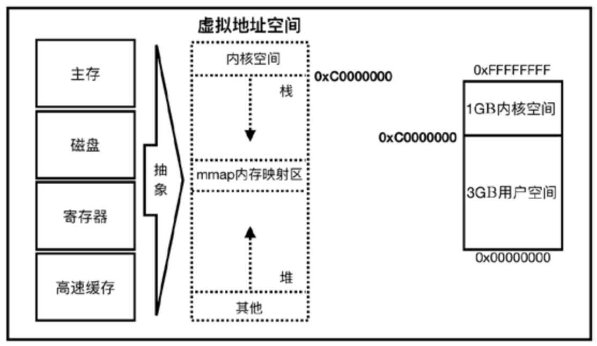
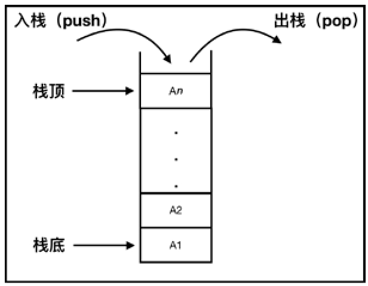
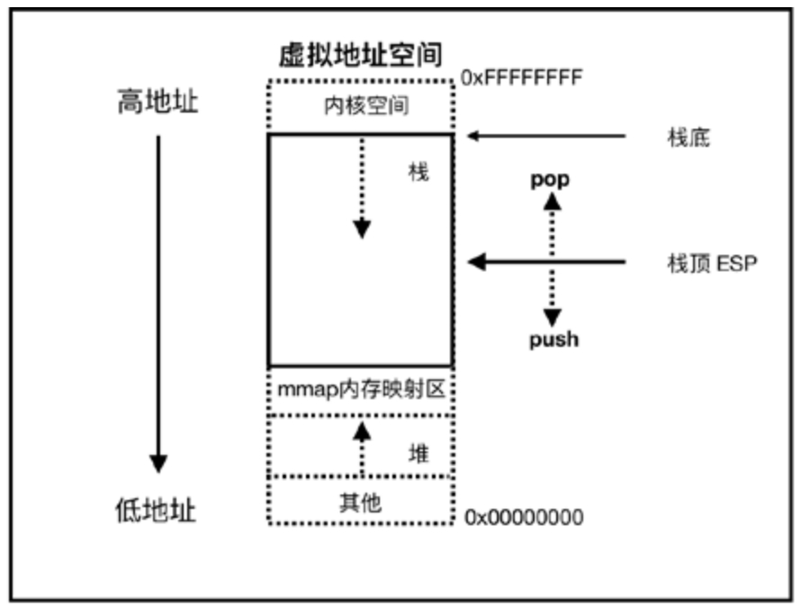
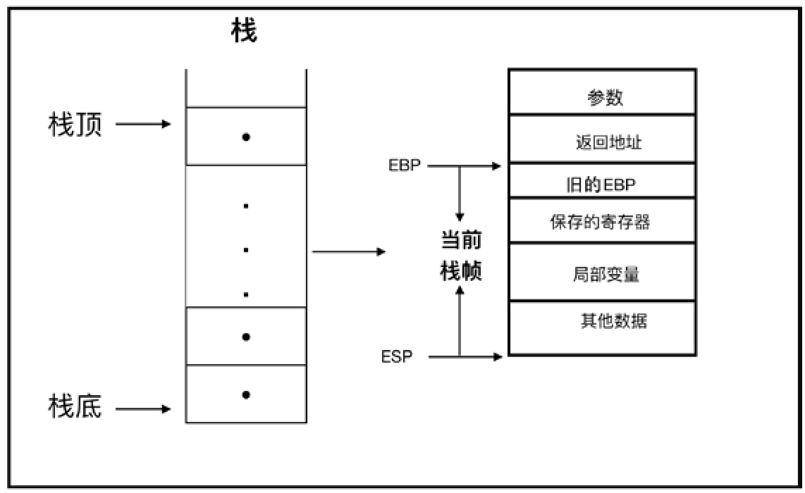
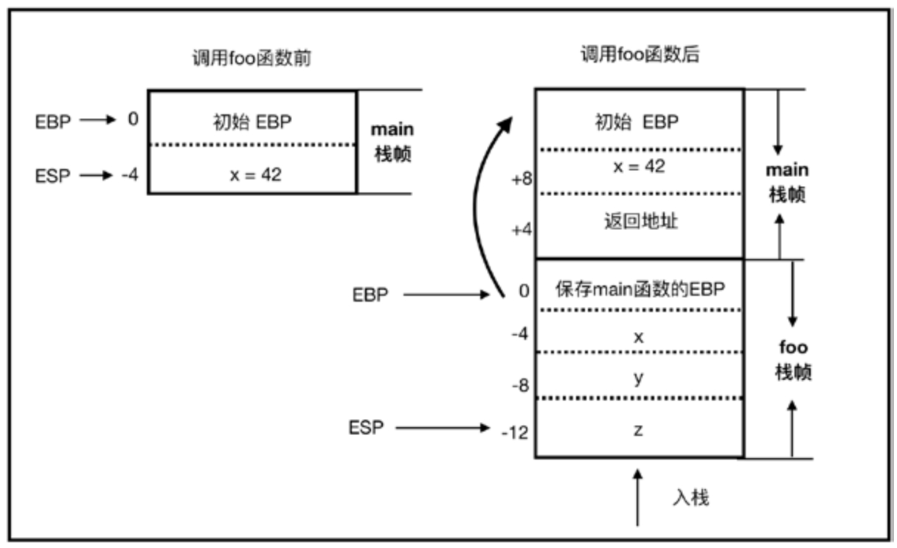
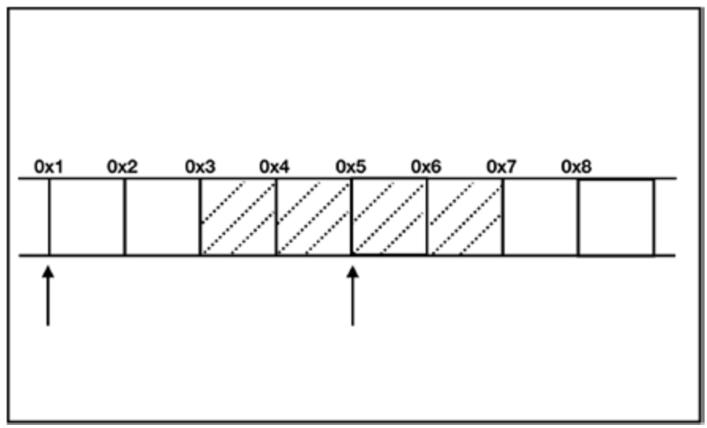
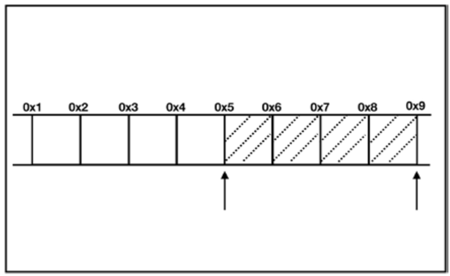
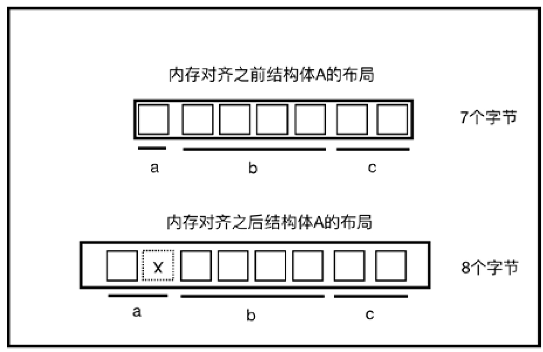

<!-- @import "[TOC]" {cmd="toc" depthFrom=1 depthTo=6 orderedList=false} -->

<!-- code_chunk_output -->

- [虚拟内存](#虚拟内存)
- [栈](#栈)
  - [栈数据结构](#栈数据结构)
  - [栈内存](#栈内存)
  - [栈帧](#栈帧)
  - [示例](#示例)
- [堆](#堆)
  - [堆数据结构](#堆数据结构)
  - [堆内存](#堆内存)
  - [堆内存的申请释放](#堆内存的申请释放)
  - [堆分配算法](#堆分配算法)
    - [空闲链表(Free List)](#空闲链表free-list)
    - [位图(Bitmap)](#位图bitmap)
  - [堆内存分配器](#堆内存分配器)
- [内存布局](#内存布局)

<!-- /code_chunk_output -->

# 虚拟内存

现代操作系统在保护模式下都采用**虚拟内存**管理技术.

虚拟地址空间被人为地分为两部分: **用户空间**和**内核空间**, 它们的比例是 `3: 1`(Linux系统中)或 `2: 2`(Windows系统中).

以Linux系统为例, 32 位计算机的地址空间大小是 4GB, 寻址范围是 `0x00000000~0xFFFFFFFF`. 然后通过内存分页等底层复杂的机制来把虚拟地址翻译为物理地址.



上图是 Linux 系统中的虚拟地址空间示意图, 其中值得注意的是**用户空间**中的**栈**(`stack`)和**堆**(`heap`).

箭头的方向代表内存增长的方向, **栈向下**(**由高地址向低地址**)增长, **堆向上**(**由低地址向高地址**)增长.

# 栈

栈(stack), 也被称为堆栈, 为了避免歧义, 本书只称其为栈. 栈一般有两种定义, 一种是指**数据结构**, 一种是指**栈内存**.

## 栈数据结构

在**数据结构**中, 栈是一种特殊的线性表, 如图. 其特殊性在于限定了**插入和删除数据**只能在**线性表固定的一端**进行.



**操作栈**的一端被称为**栈顶**, 相反的一端被称为**栈底**.

从栈顶压入数据叫入栈(push), 从栈顶弹出数据叫出栈(pop), 这意味着最后一个入栈的数据会第一个出栈, 所以栈被称为**后进先出**(**LIFO**, `Last in First Out`)**线性表**.

## 栈内存

**栈数据结构**和**栈内存**在特性上有所关联.

**物理内存本身并不区分堆和栈**, 但是**虚拟内存空间**需要分出**一部分内存**, 用于支持 CPU 入栈或出栈的指令操作, 这部分内存空间就是**栈内存**.

**栈内存示意图**:



**栈顶**由**栈指针寄存器** `ESP` 保存, 起初栈顶指向栈底的位置.
* 当有数据**入栈**时, **栈顶**地址**向下增长**, 地址由**高地址变成低地址**; 
* 当有数据被**弹出**时, 栈顶地址向上增长, 地址由**低地址变成高地址**.

因此, **降低 ESP 的地址**等价于**开辟栈空间**, **增加 ESP 的地址**等价于**回收栈空间**.

## 栈帧

**栈内存**最重要的作用是**在程序运行过程中保存函数调用所要维护的信息**.

存储每次**函数调用所需信息的记录单元**被称为**栈帧**(`Stack Frame`, 有时也被称为**活动记录**(`Activate Record`).

因此**栈内存**被栈帧分割成了 **N 个记录块**, 而且这些记录块都是**大小不一**的.

**栈帧示意图**:



> 图是不是有问题?

**栈帧**一般包括三方面的内容:

* 函数的**返回地址**和**参数**.
* **临时变量**. 包括**函数内部**的**非静态局部变量**和**编译器产生的临时变量**.
* 保存的**上下文**.

**EBP 指针**是**帧指针**(`Frame Pointer`), 它指向当前栈帧的一个**固定的位置**, 而 **ESP** 始终指向**栈顶**. **EBP** 指向的值是**调用该函数之前**的**旧的EBP值**, 这样在**函数返回**时, 就可以通过该值**恢复到调用前的值**.

由 **EBP 指针**和 **ESP 指针**构成的区域就是**一个栈帧**, 一般是指**当前栈帧**.

栈帧的分配非常快, 其中的**局部变量！！！** 都是**预分配内存！！！**, 在**栈上分配的值**都是可以**预先！！！确定大小的类型**. 当**函数结束调用**的时候, **栈帧会被自动释放**, 所以栈上数据的生命周期都是在一个函数调用周期内的.

## 示例

通过具体代码了解上述过程.
```rust
fn foo4_1(x: u32) {
	let y = x;
	let z = 1000;
}

fn main4_1() {
	let x = 42;
	foo4_1(x);
}
```

main 函数为入口函数, 所以首先被调用.

main函数中声明了**变量 x**, 在**调用 foo 函数前**, main 函数**先**在**栈**里**开辟了空间**, 压入了 x 变量. 栈帧里 **EBP** 指向**起始位置**, 变量 x 保存在帧指针 `EBP - 4`(只是为了演示)偏移处.

在**调用 foo 函数时**, 将**返回地址**压入栈中, 然后由 PC 指针(程序计数器)引导执行**函数调用指令**, 进入 **foo 函数栈帧**中. 此时同样**在栈中开辟空间**, 依次将 **main 函数**的 **EBP 地址**、**参数 x** 以及**局部变量 y** 和 **z** 压入栈中. EBP 指针依旧指向**地址为 0** 的固定位置, 表明当前是在 foo 函数栈帧中, 通过 `EBP - 4`、`EBP - 8` 和 `EBP - 12` 就可以访问参数和变量.

当 **foo 函数执行完毕时**, 其参数或局部变量会依次弹出, 直到得到 main 函数的EBP地址, 就可以**跳回 main 函数栈帧**中, 然后通过返回地址就可以继续执行main 函数中其余的代码了, 这个过程如图所示.

函数调用栈帧示意图:



在上述过程中, 调用 main 和 foo 函数时, **栈顶 ESP 地址**会**降低**, 因为要**分配栈内存**, 栈向下增长, 当 foo 函数**执行完毕**时, **ESP 地址**会**增长**, 因为**栈内存**会被**释放**.

随着栈内存的释放, 函数中的局部变量也会被释放, 所以可想而知, **全局变量不会被存储到栈中**. 该过程说来简单, 但其实底层涉及寻址、寄存器、汇编指令等比较复杂的协作过程, 这些都是由编译器或解释器自动完成的.

# 堆

**堆**(heap)一般也有两种定义, 一种是指数据结构, 另一种是指堆内存.

## 堆数据结构

在数据结构中, 堆表示一种特殊的**树形数据结构**, 特殊之处在于此树是一棵**完全二叉树**, 它的特点是:

* **父节点**的**值**要么**都大于两个子节点的值**, 称为**大顶堆**; 
* **父节点**的**值**要么**都小于两个子节点的值**, 称为**小顶堆**.

一般用于实现**堆排序**或**优先队列**.

## 堆内存

**堆数据结构**和**堆内存**并**无直接的联系**.

**栈内存**中保存的数据, **生命周期都比较短**, 会随着函数调用的完成而消亡. 但很多情况下会**需要**能相对**长久地保存**在内存中的数据, 以便**跨函数使用**, 这就是**堆内存**发挥作用的地方. 堆内存是一块**巨大的内存空间**, 占了**虚拟内存空间**的**绝大部分**.

## 堆内存的申请释放

程序**不可以主动申请栈内存**, 但可以**主动申请堆内存**. 在堆内存中存放的数据会在**程序运行过程中！！！一直存在**, 除非该内存**被主动释放！！！**掉.

在**C语言**中, 程序员可以通过调用 **malloc** 函数来**申请堆内存**, 并可以通过 free 函数来释放它; 在 **C++** 语言中, 可以使用 **new** 和 **delete** 函数. **包含 GC 的编程语言**则是由 **GC** 来**分配和回收堆内存**的.

在实际工作中, 对于**事先知道大小的类型**, 可以分配到**栈**中, 比如**固定大小的数组**. 但是如果需要**动态大小的数组**, 则需要使用**堆内存**. 开发者**只能！！！** 通过**指针！！！** 来掌握**已分配的堆内存**, 这本身就带来了**安全隐患**, 如果**指针指向的堆内存被释放掉**但**指针没有被正确处理**, 或者该**指针指向一个不合法的内存**, 就会带来**内存不安全**问题. 所以, 面向对象大师 Bertrand Meyer 才会说: "要么保证软件质量, 要么使用指针, 两者不可兼得. "

## 堆分配算法

**堆**是**一大块内存空间**, 程序通过 `malloc` 申请到的内存空间是**大小不一**、**不连续且无序**的, 所以如何管理堆内存是一个问题. 这就涉及**堆分配算法**, 堆分配算法有很多种, 就本质而言可以分为**两大类**: **空闲链表**(`Free List`)和**位图标记**(`Bitmap`).

### 空闲链表(Free List)

**空闲链表**实际上就是把**堆中空闲的内存地址记录为链表**, 当系统收到程序**申请时**, 会**遍历该链表**; 当找到**适合的空间堆节点**时, 会将**此节点**从**链表中删除**; 当**空间被回收**以后, 再将其**加到空闲链表**中.

空闲链表的**优势**是**实现简单**, 但如果**链表遭到破坏**, 整个堆就无法正常工作.

### 位图(Bitmap)

**位图**的核心思想是将**整个堆**划分为大量**大小相等的块**. 当程序**申请内存**时, 总是分配**整数个块的空间**. **每块内存**都用**一个二进制位**来表示其状态, 如果该内存被占用, 则相应位图中的位置置为 1; 如果该内存空闲, 则相应位图中的位置置为 0.

位图的**优势**是**速度快**, 如果单个内存块数据遭到破坏, 也不会影响整个堆, 但**缺点**是**容易产生内存碎片**.

## 堆内存分配器

不管是什么算法, 分配的都是**虚拟地址空间**. 所以当**堆空间被释放**时, 并**不代表**指**物理空间也马上被释放**. 堆内存**分配函数 malloc** 和**回收函数 free** 背后是**内存分配器**(`memory allocator`), 比如 glibc 的内存分配器 ptmallac2, 或者 FreeBSD 平台的 jemalloc. 这些内存分配器负责管理申请和回收堆内存, 当堆内存释放时, 内存被归还给了内存分配器. 内存分配器会对空闲的内存进行统一"整理", 在适合(比如空闲内存达到 2048 KB)的时候, 才会把内存归还给系统, 也就是指释放物理空间.

**Rust 编译器**目前自带**两个默认分配器**: `alloc_system` 和 `alloc_jemalloc`.

* 在 `Rust 2015` 版本下, 编译器产生的二进制文件默认使用 `alloc_jemalloc` (**某些平台可能不支持**jemalloc), 而对于**静态或动态链接库**, 默认使用 `alloc_system`.
* 在 `Rust 2018` 版本下, 默认使用 `alloc_system`, 并且可以**由开发者自己指派** Jemalloc 或其他**第三方分配器**.

Jemalloc 的优势有以下几点:
* 分配或回收内存更快速.
* 内存碎片更少.
* 多核友好.
* 良好的可伸缩性.

Jemalloc 是现代化的业界流行的内存分配解决方案, 它整块批发内存(称为 chunk)以供程序使用, 而非频繁地使用系统调用(比如 brk 或 mmap)来向操作系统申请内存. 其内存管理采用层级架构, 分别是线程缓存tcache、分配区arena和系统内存(system memory), 不同大小的内存块对应不同的分配区. 每个线程对应一个 tcache, tcache 负责当前线程所使用内存块的申请和释放, 避免线程间锁的竞争和同步. tcache是对arena中内存块的缓存, 当没有tcache时则使用arena分配内存. arena采用内存池思想对内存区域进行了合理划分和管理, 在有效保证低碎片的前提下实现了不同大小内存块的高效管理. 当 arena 中有不能分配的超大内存时, 再直接使用mmap从系统内存中申请, 并使用红黑树进行管理.

即使堆分配算法再好, 也只是解决了堆内存合理分配和回收的问题, 其**访问性能远不如栈内存**. 存放在**堆上的数据**要**通过**其存放于**栈上的指针进行访问**, 这就至少多了一层内存中的跳转. 所以, 能放在栈上的数据最好不要放到堆上. 因此, Rust的类型默认都是放到栈上的.

# 内存布局

**内存中数据的排列方式**称为**内存布局**. 不同的排列方式, 占用的内存不同, 也会间接影响CPU访问内存的效率. 为了权衡**空间占用情况**和**访问效率**, 引入了**内存对齐规则**.

**CPU** 在**单位时间**内能处理的**一组二进制数**称为**字**, 这组二进制数的**位数**称为**字长**. 如果是 32 位CPU, 其字长为32位, 也就是4个字节. 一般来说, 字长越大, 计算机处理信息的速度就越快, 例如, 64 位CPU就比 32 位CPU效率更高.

以 32 位 CPU 为例, **CPU 每次只能从内存中读取 4 个字节的数据**, 所以**每次只能对4的倍数的地址进行读取**.

假设现有一整数类型的数据, 首地址并不是 4 的倍数, 不妨设为 0x3, 则该类型存储在**地址范围**是 `0x3 ~ 0x7` 的存储空间中. 因此, CPU 如果想读取该数据, 则需要分别在 0x1 和0x5处进行**两次读取**, 而且还需要对读取到的数据**进行处理**才能得到该整数, 如图所示.

CPU读取首地址非4的倍数的数据:



CPU 的处理速度比从内存中读取数据的速度要快得多, 因此**减少 CPU 对内存空间的访问**是提高程序**性能**的关键.

而采取**内存对齐策略**是提高程序性能的关键. 对于上图中展示的整数类型, 因为是 32 位CPU, 所以只需要按 4 字节对齐, 如下图所示, CPU 只需要读取一次.

CPU读取内存对齐数据:



因为**对齐的是字节**, 所以**内存对齐**也叫**字节对齐**. 内存对齐是**编译器**或**虚拟机**(比如JVM)的工作, **不需要人为指定**.

内存对齐包括**基本数据对齐**和**结构体**(或**联合体**)**数据对齐**. 对于**基本数据类型**, **默认**对齐方式是**按其大小进行对齐**, 也被称作**自然对齐**. 比如 u32 类型占 4 字节, 则它默认对齐方式为 4 字节对齐. 对于内部含有**多个基本类型**的**结构体**来说, 对齐规则稍微有点复杂.

假设**对齐字节数**为**N**(N=1, 2, 4, 8, 16), **每个成员内存长度**为 **Len**, `Max(Len)`为**最大成员内存长度**. 如果没有外部明确的规定, N **默认**按 `Max(Len)` 对齐.

字节对齐规则为:

* 结构体的**起始地址**能够被 `Max(Len)` 整除.
* 结构体中**每个成员**相对于结构体**起始地址**的**偏移量**, 即**对齐值**, 应该是 `Min(N, Len)` 的倍数, 若不满足对齐值的要求, 编译器会在**成员之间填充若干个字节**.
* 结构体的**总长度**应该是 `Min(N, Max(Len))` 的**倍数**, 若不满足总长度要求, 则编译器会在为最后一个成员分配空间后, 在其后面填充若干个字节.

以 Rust 中的结构体为例验证结构体字节对齐规则:

```rust
struct A_4_2 {
	a: u8,
	b: u32,
	c: u16,
}

fn main_4_2() {
	println!("{:?}", std::mem::size_of::<A_4_2>()); // 8
}
```

`std::mem::size_of::<A_4_2>()` 可以计算结构体的内存占用大小. **基本数据类型** `u8` 占 **1 个字节**, `u32` 占 **4 个字节**, `u16` 占 **2 个字节**.

结构体A的内存对齐(即字节对齐)前后的布局对比:



图中的**一个方块**代表**一个字节**, 注意一个字节是 **8 个比特位**. 内存对齐之前, 结构体 A 占用7个字节.

结构体A没有明确指定字节对齐值, 所以**默认按其最长成员的值来对齐**, 结构体 A 中最长的成员是 b, 占 4 个字节. 那么对于成员a来说, 它的对齐值为 `Min(4, 1)`, 即 1, 所以 a 需要补齐一个字节的空间, 如图4-8中虚线x框所示, 那么现在 a 的大小是2个字节. 成员 b 已经是对齐的, 成员 c 是结构体中最后一位成员, 当前结构体A的总长度为a、b、c之和, 占8个字节, 正好是 `Min(4, 4)`, 也就是4的倍数, 所以成员c不需要再补齐. 而结构体A实际占用也是8个字节.

联合体(Union)和结构体不同的地方在于, 联合体中的所有成员都共享一段内存, 所有成员的首地址都是一样的, 但为了能够容纳所有成员, 就必须可以容纳其中最长的成员. 所以联合体以最长成员为对齐数. 代码展示了Rust中的联合体字节对齐.

Rust中联合体字节对齐:

```rust
union U_4_3 {
	f1: u32,
	f2: f32,
	f3: f64
}

fn main_4_3() {
	println!("{:?}", std::mem::size_of::<U_4_3>()); //8
}
```

f1和f2各占4个字节, f3占8个字节, 其中f3最长, 所以联合体U占8个字节. f1、f2和f3共用内存, 8个字节够用了.