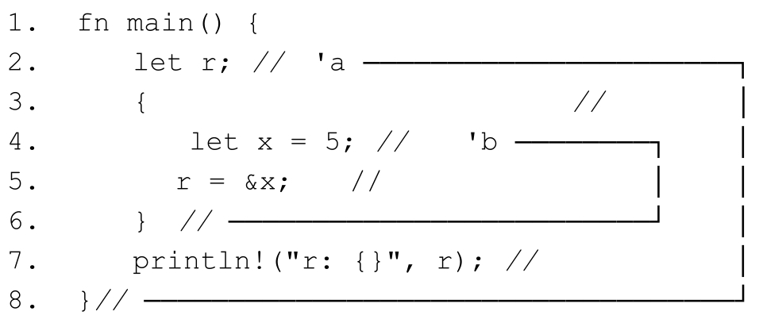

**值的生命周期**和**词法作用域**有关, 但是**借用**可以在**各个函数间传递**, 必然会**跨越多个词法作用域**.

对于**函数本地声明**的拥有所有权的**值**或者**借用**来说, Rust编译器中包含的**借用检查器**(**borrow checker**)可以检查它们的生命周期, 但是对于**跨词法作用域**的**借用**, 借用检查器就**无法自动推断**借用的合法性了, 也就是说, 无法判断这些跨词法作用域的借用是否满足借用规则. **不合法的借用**会产生**悬垂指针**, 造成内存不安全.

所以, Rust必须确保所有的借用都是有效的, 不会存在悬垂指针.

**绑定 r** 将在**整个 main 函数作用域**中存活, 其生命周期长度用 `'a` 表示; **绑定 x** 存活于第 3 ~ 6 行之间的**内部词法作用域**中, 因为它**离开内部作用域**就会**被析构**, 其生命周期长度用 `'b` 表示, `'b` 要比 `'a` 小很多.

**如果**该代码**正常通过编译**, 则在运行时, 第 5 行代码就会产生一个悬垂指针. 幸运的是, **Rust编译器不会允许这种事情发生**. 编译时会通过**借用检查器**检查代码中**每个引用的有效性**, 会报错如下:

根据借用规则一, **借用方**的生命周期不能长于**出借方**的**生命周期**. 在代码清单5-28中, 借用 `&x` 要绑定给变量r, r 就成了**借用方**, 其生命周期长度是 `'a`, 而出借方是x, 出借方的生命周期长度是 'b, 现在 'a远远大于 'b, 说明借用的生命周期远远大于出借方的生命周期, 出借方被析构, 借用还存在, 就会造成悬垂指针. 由此证明借用无效, 借用检查无法通过, 编译器报错, 成功地阻止了悬垂指针的产生.

如果只是在函数本地使用借用, 那么借用检查器很容易推导其生命周期, 因为此时Rust拥有关于此函数的所有信息. 一旦跨函数使用借用, 比如作为函数参数或返回值使用, 编译器就无法进行检查, 因为编译器无法判断出所有的传入或传出的借用生命周期范围, 此时需要显式地对借用参数或返回值使用生命周期参数进行标注.

# 显式生命周期参数

生命周期参数必须以单引号开头, 参数名通常都是小写字母, 比如＇a. 生命周期参数位于引用符号&后面, 并使用空格来分割生命周期参数和类型, 如下所示. 

## 函数签名中的生命周期参数

## 结构体定义中的生命周期参数

> 一个**包含引用成员**的结构体, 必须保证**结构体本身的生命周期不能超过**任何一个**引用成员**的生命周期. 否则就会出现成员已经被销毁之后, 结构体还保持对那个成员的引用就会产生悬垂引用. 所以这依旧是 rust 的借用规则即借用方(结构体本身)的生命周期不能比出借方(结构体中的引用成员)的生命周期还要长. 因此就需要在声明结构体的同时也声明生命周期参数, 同时对结构体的引用成员进行生命周期参数标注. 

除了函数签名, 结构体在含有引用类型成员的时候也需要标注生命周期参数, 否则编译器会报错: missing lifetime specifier. 代码清单5-35是一个包含引用类型成员的结构体示例. 代码清单5-35: 包含引用类型成员的结构体也需要标注生命周期参数

在代码清单5-35中, 结构体Foo有一个成员为&str类型, 必须先声明生命周期泛型参数＜＇a＞, 才能为成员part标注生命周期参数, 变为&＇a str类型. 这里的生命周期参数标记, 实际上是和编译器约定了一个规则: 结构体实例的生命周期应短于或等于任意一个成员的生命周期. 

main 函数中声明了一个 String 类型的字符串 words, 然后使用 split 方法按逗号规则将words进行分割, 再通过next方法和expect方法返回一个字符串切片first. 其中next方法为迭代器相关的内容, 第6章会讲到. 

在代码第7行, 用first实例化结构体Foo. 此时, 编译器就会根据该结构体事先定义的生命周期规则对其成员part的生命周期长度进行检查. 当前part的生命周期是整个main函数, 而Foo结构体实例f的生命周期确实小于其成员part的生命周期, f会在first之前被析构. 否则, 如果first先被析构, f.part就会成为悬垂指针, 这是Rust绝对不允许的. 

## 方法定义中的生命周期参数

假如为结构体Foo实现方法(如代码清单5-36所示), 因为其包含引用类型成员, 标注了生命周期参数, 所以需要在impl关键字之后声明生命周期参数, 并在结构体Foo名称之后使用, 这与泛型参数是相似的. 

代码清单5-36: 为结构体Foo实现方法

# reference

细说 rust 生命周期参数: https://learnku.com/articles/44644

