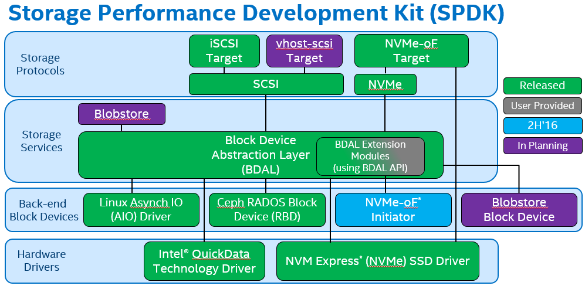

<!-- @import "[TOC]" {cmd="toc" depthFrom=1 depthTo=6 orderedList=false} -->

<!-- code_chunk_output -->

- [1 简介](#1-简介)
- [2 软件体系结构概览](#2-软件体系结构概览)
  - [2.1 驱动代码运行在用户态](#21-驱动代码运行在用户态)
  - [2.2 轮询模式驱动(PMD)](#22-轮询模式驱动pmd)
  - [2.3 SPDK 架构](#23-spdk-架构)
    - [2.3.1 硬件驱动](#231-硬件驱动)
    - [2.3.2 后端块设备](#232-后端块设备)
    - [2.3.3 存储服务](#233-存储服务)
    - [2.3.4 存储协议](#234-存储协议)
  - [2.4 相关问题](#24-相关问题)
- [3 参考](#3-参考)

<!-- /code_chunk_output -->

# 1 简介

**固态存储设备**正在取代**数据中心**. 目前这一代的闪存存储, 比起传统的磁盘设备, 在**性能(performance**)、**功耗(power consumption**)和**机架密度(rack density**)上具有显著的优势. 这些优势将会继续增大, 使闪存存储作为下一代设备进入市场.

用户使用现在的**固态设备**, 比如 Intel® SSD DC P3700 Series Non\-Volatile Memory Express(NVMe)驱动, 面临一个**主要的挑战**: 因为**吞吐量**和**延迟性能**比传统的磁盘**好太多**, 现在**总的处理时间**中, **存储软件**占用了**更大的比例**. 换句话说, **存储软件栈**的**性能**和**效率**在整个存储系统中越来越重要. 随着存储设备继续发展, 它将面临远远超过正在使用的软件体系结构的风险(即**存储设备**受制于**相关软件的不足**而**不能发挥全部性能**), 在接下来的几年中, 存储设备将会继续发展到一个令人难以置信的地步.

为了帮助**存储 OEM(设备代工厂**)和**ISV(独立软件开发商**)整合硬件, Inte 构造了**一系列驱动**, 以及一个**完善的**、**端对端**的**参考存储体系结构**, 被命名为 Storage Performance Development Kit(**SPDK**).

SPDK 的**目标**是通过**同时**使用**Intel 的网络技术**, **处理技术**和**存储技术**来提高突出显著的**效率和性能**. 通过运行**为硬件设计的软件**, SPDK 已经证明很容易达到**每秒钟数百万次 I/O 读取**, 通过使用许多处理器核心和许多 NVMe 驱动去存储, 而**不需要额外卸载硬件**.

Intel 在[BSD license](https://github.com/spdk/spdk/blob/master/LICENSE)许可协议下通过[Github](https://github.com/spdk)分发提供其全部的 Linux 参考架构的源代码.

博客、邮件列表和额外文档可以在[spdk.io](http://www.spdk.io/)中找到.

# 2 软件体系结构概览

SPDK 如何工作?达到这样的超高性能运用了**两个关键技术**: **运行于用户态**和**轮询模式**. 让我们进一步了解这两个软件工程术语.

## 2.1 驱动代码运行在用户态

首先, 我们的**设备驱动代码运行在用户态**意味着, 在定义上**驱动代码不会运行在内核**中. 避免**内核上下文切换**和**中断**将会**节省大量的处理开销**, 允许**更多的时钟周期**被用来做**实际的数据存储**. 无论存储算法(去冗, 加密, 压缩, 空白块存储)多么复杂, **浪费更少的时钟周期**总是意味着**更好的性能和延迟**.

这并**不是**说**内核增加了不必要的开销**; 相反, **内核增加**了那些可能**不适用**于**专用存储堆栈**的**通用计算用例**的相关开销.

SPDK 的**指导原则**是通过**消除每一处额外的软件开销**来提供**最少的延迟**和**最高的效率**.

## 2.2 轮询模式驱动(PMD)

其次, **轮询模式驱动**(Polled Mode Drivers, PMDs)改变了**I/O 的基本模型**.

在**传统的 I/O 模型**中, **应用程序**提交读写请求后**睡眠**, 一旦**I/O 完成**, **中断**就会将其**唤醒**.

PMDs 的**工作方式不同**, **应用程序**提交**读写请求**后**继续执行其他工作**, 以**一定的时间间隔**回头**检查 I/O 是否已经完成**. 这种方式**避免**了**中断带来的延迟和开销**, 并使得应用程序提高了 I/O 的效率.

在**旋转设备时代**(磁带和机械硬盘), **中断开销**只占整个 I/O 时间的一个**很小的百分比**, 因此给系统带来了巨大的效率提升.

然而, 在**固态设备的时代**, 持续引入**更低延迟的持久化设备**, 中断开销成为了整个 I/O 时间中不能被忽视的部分. 这个问题在**更低延迟的设备**上只会越来越**严重**. 系统已经能够**每秒处理数百万个 I/O**, 所以消除**数百万个事务的这种开销**, 能够**快速地复制到多个内核**中. 数据包和数据块被立即分发, 等待时间减小到最少, 使得延迟更低, **一致性延迟更多(抖动更少**), 吞吐量也得到提高.

## 2.3 SPDK 架构

SPDK 由**数个子组件**构成, **相互连接**并**共享用户态操作和轮询模式操作**的**共有部分**.

当构造**端对端 SPDK 体系结构**时, **每个组件**被构造用于克服遭遇到的**特定的性能瓶颈**.

然而, 每个组件也可以被**整合**进**非 SPDK 体系结构**, 允许用户利用 SPDK 中使用的经验和技术来加速自己的软件.

SPDK Architecture:

我们从下往上构建

### 2.3.1 硬件驱动

NVMe Driver: SPDK 的**基础组件**, 这个**高优化无锁**的驱动提供了高扩展性, 高效性和高性能.

Inter QuickData Technology: 也称为 Intel I/O Acceleration Technology(Inter IOAT, **英特尔 I/O 加速技术**), 这是一种基于**Xeon 处理器平台**上的**copy offload 引擎**. 通过**提供用户空间访问**, 减少了**DMA 数据移动**的阈值, 允许对**小尺寸 I/O**或**NTB**的更好利用.

### 2.3.2 后端块设备

NVMe over Fabrics(NVMe\-oF)initiator: 从**程序员的角度**来看, **本地 SPDK NVMe 驱动**和**NVMe\-oF 启动器**共享一套**共同的 API 命令**. 这意味着, 比如**本地/远程复制**非常**容易实现**.

Ceph RADOS Block Device(RBD): 使**Ceph**成为**SPDK 的后端设备**, 比如这可能允许 Ceph 用作另一个存储层.

Blobstore Block Device: 由**SPDK Blobstore**分配的**块设备**, 是**虚拟机**或**数据库**可以与之交互的**虚拟设备**. 这些设备得到**SPDK 基础架构的优势**, 意味着**零拷贝**和令人难以置信的**可扩展性**.

Linux Asynchrounous I/O(AIO): 允许**SPDK**与**内核设备**(比如机械硬盘)交互.

### 2.3.3 存储服务

Block device abstration layer(bdev): 这种**通用的块设备抽象**是连接到**各种不同设备驱动**和**块设备的存储协议**的粘合剂. 还在块层中提供灵活的 API 用于额外的用户功能(磁盘阵列, 压缩, 去冗等等).

Blobstore: 为 SPDK 实现一个**高精简的文件式语义**(非 POSIX). 这可以为数据库, 容器, 虚拟机或其他不依赖于大部分 POSIX 文件系统功能集(比如用户访问控制)的工作负载提供高性能基础.

### 2.3.4 存储协议

**iSCSI target**: 建立了通过**以太网**的**块流量规范**, 大约是**内核 LIO 效率**的**两倍**. 现在的版本**默认使用内核 TCP/IP 协议栈**.

NVMe\-oF target: 实现了**新 NVMe\-oF 规范**. 虽然这取决于**RDMA 硬件**, NVMe\-oF 的目标可以为**每个 CPU 核**提供高达 40Gbps 的流量.

vhost\-scsi target: **KVM/QEMU**的功能利用了**SPDK NVMe 驱动**, 使得访客**虚拟机访问存储设备**时延迟更低, 使得**I/O 密集型工作**负载的整体 CPU 负载减低.

## 2.4 相关问题

SPDK**不适应所有的存储体系结构**. 这里有一些问题可能会帮助用户决定 SPDK 组件是否适合你们的体系结构.

1. 这个存储系统是否基于 Linux 或 FreeBSD?

SPDK 主要在 Linux 上测试和支持. 硬件驱动被 FreeBSD 和 Linux 支持.

2. 存储系统的硬件平台是否要求是 Intel 体系结构?

SPDK 被设计为充分利用 Intel 平台的特性, 并针对 Intel 芯片和系统测试和调整.

3. 这个存储系统的**高性能路径**是否运行在用户态?

SPDK 通过更多地在**用户态**下运行从**网卡到磁盘**的高性能路径, 提高性能和效率. 通过将**具有 SPDK 功能**(比如 NVMe\-oF 目标, NVMe\-oF 启动器, Blobstore)的**应用程序结合**起来, 整个数据通路可能能够在**用户空间运行**, 从而提供显著的高效率.

4. **系统体系结构**可以合并**无锁的 PMDs**到它的线程模型吗?

因为**PMD 持续运行在它们的线程**中(而不是睡眠或者不用时让出处理器), 所以它们有**特殊的线程模型需求**.

5. 系统现在是否用**DPDK 处理网络数据包**的工作负载

**SPDK**和**DPDK 共享早期的编程模型**, 所以现在使用 DPDK 的用户可能会发现与 SPDK 紧密整合非常有用. 同样地, 如果正在使用 SPDK 的用户为网络处理添加 DPDK 功能可能是个重要的机遇.

6. 开发团队自己是否具有理解和解决问题的专业技能?

Intel 没有为相关软件提供支持的义务. 当 Intel 和围绕 SPDK 的开源社区将付出商业上合理的努力去调出未修改的发布版本软件的潜在错误, 任何情况下 Intel 都没有任务义务为用户提供针对该软件任何形式的维护和支持.

# 3 参考

- http://aidaiz.com/spdk/
- 原文: [《Introduction to the Storage Performance Development Kit (SPDK)》](https://software.intel.com/en-us/articles/introduction-to-the-storage-performance-development-kit-spdk)