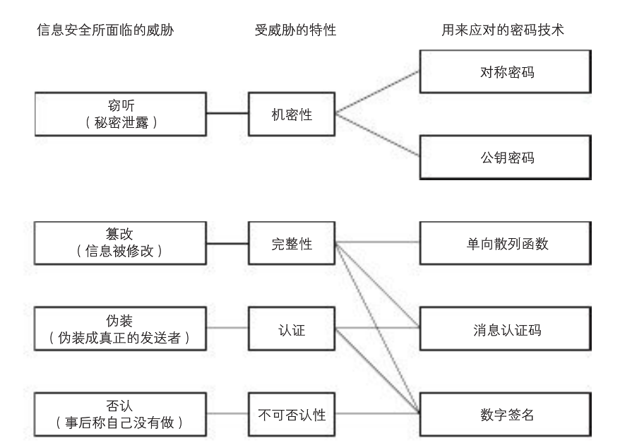
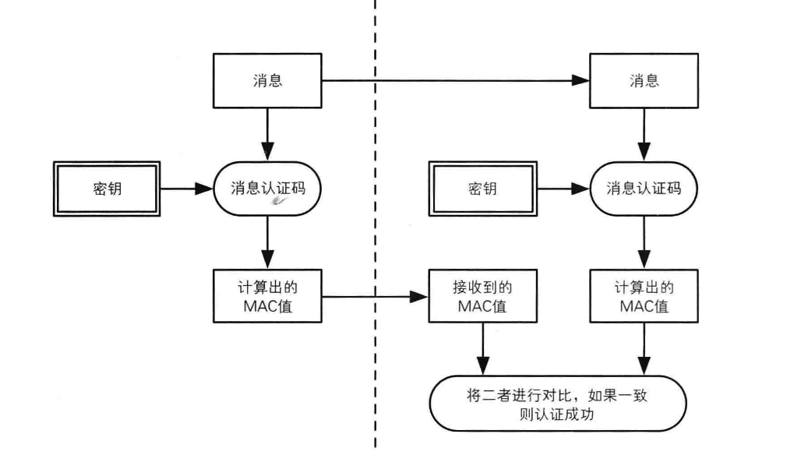
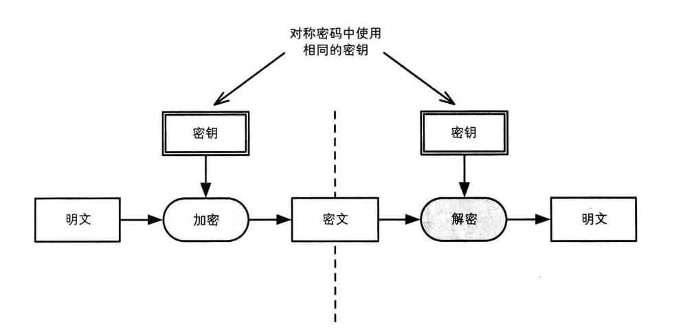
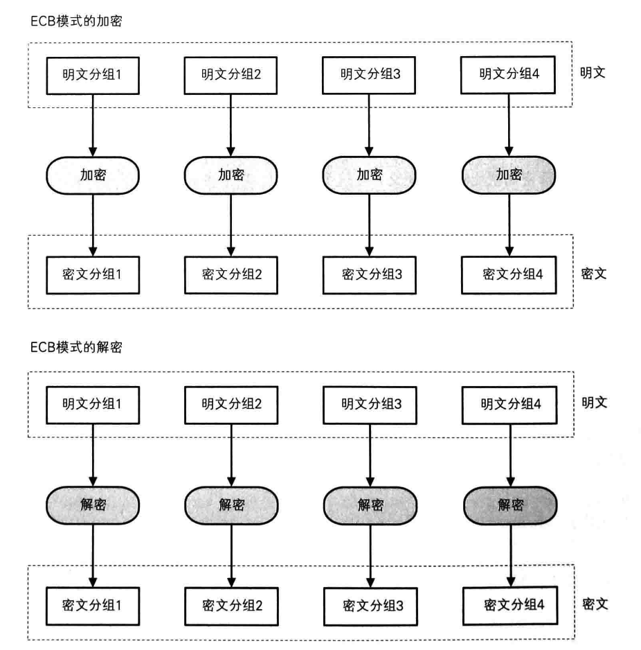
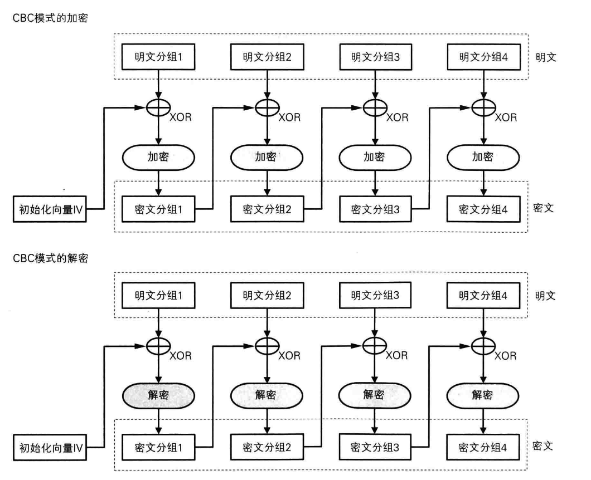
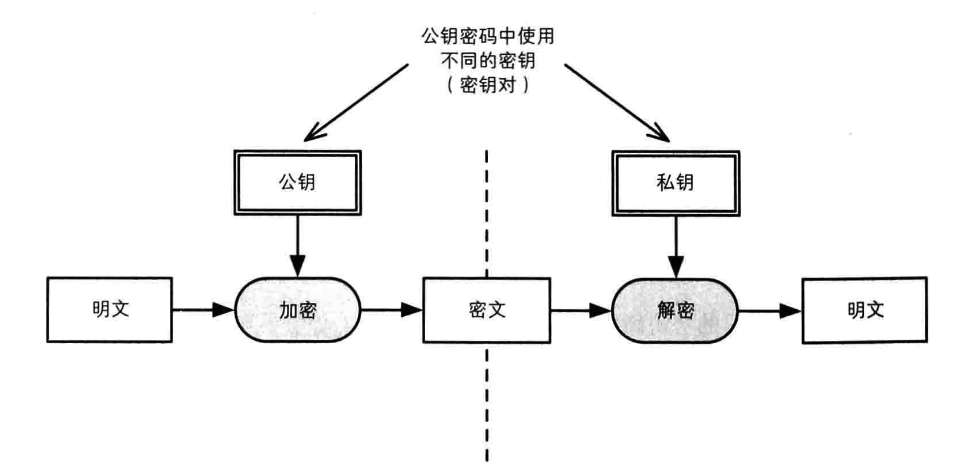
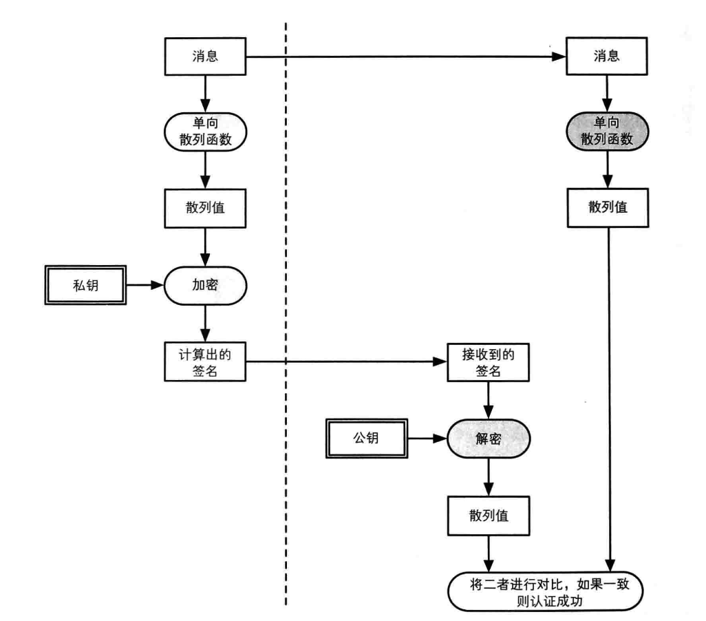

参考:

https://www.cnblogs.com/chao8888/p/5585871.html

## 1. 数据安全

01 攻城利器: Charles(公司中一般都使用该工具来抓包, 并做网络测试)

注意: Charles 在使用中的乱码问题, 可以显示包内容, 然后打开 info.plist 文件, 找到 java 目录下面的 VMOptions, 在后面添加一项: -Dfile.encoding=UTF-8

02 MD5 消息摘要算法是不可逆的.

03 数据安全的原则

    1)在网络上"不允许"传输用户隐私数据的"明文"
    2)在本地"不允许"保存用户隐私数据的"明文"

04 数据加密的方式和规范一般公司会有具体的规定, 不必多花时间.



## 2. Base64

#### 1. Base64 简单说明

描述: Base64 可以成为密码学的基石, 非常重要.

特点: 可以将任意的二进制数据进行 Base64 编码

结果: 所有的数据都能被编码为并只用 65 个字符就能表示的文本文件.

65 字符: A~Z a~z 0~9 + / =

对文件进行 base64 编码后文件数据的变化: 编码后的数据~=编码前数据的 4/3, 会大 1/3 左右.

#### 2. 命令行进行 Base64 编码和解码

编码: base64 123.png > 123.txt

解码: base64 -d 123.txt > test.png

#### 3. Base64 编码原理

1)将所有字符转化为 ASCII 码;

2)将 ASCII 码转化为 8 位二进制;

3)将二进制 3 个归成一组(不足 3 个在后边补 0)共 24 位, 再拆分成 4 组, 每组 6 位;

4)统一在 6 位二进制前补两个 0 凑足 8 位;

5)将补 0 后的二进制转为十进制;

6)从 Base64 编码表获取十进制对应的 Base64 编码;

处理过程说明:

a.转换的时候, 将三个 byte 的数据, 先后放入一个 24bit 的缓冲区中, 先来的 byte 占高位.

b.数据不足 3byte 的话, 于缓冲区中剩下的 bit 用 0 补足. 然后, 每次取出 6 个 bit, 按照其值选择查表选择对应的字符作为编码后的输出.

c.不断进行, 直到全部输入数据转换完成.

d.如果最后剩下两个输入数据, 在编码结果后加 1 个"=";

e.如果最后剩下一个输入数据, 编码结果后加 2 个"=";

f.如果没有剩下任何数据, 就什么都不要加, 这样才可以保证资料还原的正确性.

#### 4. 实现

a.说明:

1)从 iOS7.0 开始, 苹果就提供了 base64 的编码和解码支持

2)如果是老项目, 则还能看到 base64 编码和解码的第三方框架, 如果当前不再支持 iOS7.0 以下版本, 则建议替换.

b.相关代码:

```
//给定一个字符串, 对该字符串进行 Base64 编码, 然后返回编码后的结果
-(NSString *)base64EncodeString:(NSString *)string
{
    //1.先把字符串转换为二进制数据
    NSData *data = [string dataUsingEncoding:NSUTF8StringEncoding];

    //2.对二进制数据进行 base64 编码, 返回编码后的字符串
    return [data base64EncodedStringWithOptions:0];
}

//对 base64 编码后的字符串进行解码
-(NSString *)base64DecodeString:(NSString *)string
{
    //1.将 base64 编码后的字符串『解码』为二进制数据
    NSData *data = [[NSData alloc]initWithBase64EncodedString:string options:0];

    //2.把二进制数据转换为字符串返回
    return [[NSString alloc]initWithData:data encoding:NSUTF8StringEncoding];
}
```

c.终端测试命令

$ echo -n A | base64

$ echo -n QQ== |base64 -D

## 3. 常见的加密算法和其它

#### 1. base64 编码格式

#### 2. 密码学演化 "秘密本"-->RSA

#### 3. 常见的加密算法

1)消息摘要(单向散列函数)

2)对称加密

3)非对称加密

4)证书等

## 4. 单向散列函数

#### 1. 单向散列函数的特点:

1)加密后密文的长度是定长的

2)如果明文不一样, 那么散列后的结果一定不一样

3)如果明文一样, 那么加密后的密文一定一样(对相同数据加密, 加密后的密文一样)

4)所有的加密算法是公开的

5)不可以逆推反算

#### 2. 经典加密算法

1)MD5 加密

2)SHA1

3)SHA512

#### 3. MD5 加密算法简单说明

1)对字符串进行 MD5 加密可以得到一个 32 个字符的密文

2)加密之后不能根据密文逆推出明文

3)MD5 已经被破解(暴力破解|碰撞检测)

#### 4. MD5 加密进阶

1)先加盐, 然后再进行 MD5

2)先乱序, 再进行 MD5 加密

3)乱序|加盐, 多次 MD5 加密等

4)使用消息认证机制, 即 HMAC-MD5-先对密钥进行加密, 加密之后进行两次 MD5 散列

5)加密命令行

```
MD5 加密-字符串      $ echo -n "super" |md5
MD5 加密-文件 1       $ md5 abc.png
SHA1 加密:           $ echo -n "super" |openssl sha -sha1
SHA256              $ echo -n "super" |openssl sha -sha256
SHA512              $ echo -n "super" |openssl sha -sha512
hmacMD5 加密         $ echo -n "super" |openssl dgst -md5 -hmac "123"
```

#### 5. 散列函数应用领域

1)搜索 多个关键字, 先对每个关键字进行散列, 然后多个关键字进行或运算, 如果值一致则搜索结果一致

2)版权 对文件进行散列判断该文件是否是正版或原版的

3)文件完整性验证 对整个文件进行散列, 比较散列值判断文件是否完整或被篡改

#### 6. 消息认证机制(HMAC)简单说明

1)原理

1)消息的发送者和接收者有一个共享密钥

2)发送者使用共享密钥对消息加密计算得到 MAC 值(消息认证码)

3)消息接收者使用共享密钥对消息加密计算得到 MAC 值

4)比较两个 MAC 值是否一致

2)使用

1)客户端需要在发送的时候把(消息)+(消息·HMAC)一起发送给服务器

2)服务器接收到数据后, 对拿到的消息用共享的 KEY 进行 HMAC, 比较是否一致, 如果一致则信任



## 5. 对称加密

#### 1. 对称加密的特点

1)加密/解密使用相同的密钥

2)加密和解密的过程是可逆的(明文-》明文-》明文)



#### 2. 经典算法

1)DES 数据加密标准

2)3DES 使用 3 个密钥, 对消息进行(密钥 1·加密)+(密钥 2·解密)+(密钥 3·加密)

3)AES 高级加密标准

#### 3. 分组密码简单说明

密码算法可以分为分组密码和流密码两种.

- 分组密码: 每次只能处理特定长度的一 zu 数据的一类密码算法. 一个分组的比特数量就称之为分组长度.

- ex:DES 和 3DES 的分组长度都是 64 比特. 即每次只能加密 64 比特的明文, 并生成 64 比特的密文. AES 的分组长度有 128 比特、192 比特和 256 比特可以选择.

- 流密码: 对数据流进行连续处理的一类算法. 流密码中一般以 1 比特、8 比特或者是 32 比特等作为单位俩进行加密和解密.

#### 4. ECB 分组模式

ECB 模式的全称为 Electronic CodeBook 模式. 又成为电子密码本模式.

特点:

1)使用 ECB 模式加密的时候, 相同的明文分组会被转换为相同的密文分组.

2)类似于一个巨大的明文分组-》密文分组的对照表.



终端测试命令:

- 加密 $ openssl enc -des-ecb -K 616263 -nosalt -in 123.txt -out 123.bin

- 解密 $ openssl enc -des-ecb -K 616263 -nosalt -in 123.bin -out 1231.txt -d

#### 5. CBC 分组模式

CBC 模式全称为 Cipher Block Chainning 模式(密文分组链接模式|电子密码链条)

特点: 在 CBC 模式中, 首先将明文分组与前一个密文分组进行 XOR 运算, 然后再进行加密.



终端命令:

- 加密 $ openssl enc -des-cbc -K 616263 -iv 0102030405060708 -nosalt -in a.txt -out a.bin

- 解密 $ openssl enc -des-cbc -K 616263 -iv 0102030405060708 -nosalt -in a.bin -out a1.txt -d

## 6. 非对称加密

### 1. 非对称加密的特点

1)使用公钥加密, 使用私钥解密

2)公钥是公开的, 私钥保密

3)加密处理安全, 但是性能极差



2.经典算法---RSA

1)RSA 原理

(1)求 N, 准备两个质数 p 和 q,N = p x q

(2)求 L,L 是 p-1 和 q-1 的最小公倍数. L = lcm(p-1,q-1)

(3)求 E, E 和 L 的最大公约数为 1(E 和 L 互质)

(4)求 D, E x D mode L = 1

2)RSA 加密小实践

(1)p = 17,q = 19 =>N = 323

(2)lcm(p-1,q-1)=>lcm(16, 18)=>L= 144

(3)gcd(E,L)=1 =>E=5

(4)E 乘以几可以 mode L =1? D=29 可以满足

(5)得到公钥为: E=5,N=323

(6)得到私钥为: D=29,N=323

(7)加密 明文的 E 次方 mod N = 123 的 5 次方 mod 323 = 225(密文)

(8)解密 密文的 D 次方 mod N = 225 的 29 次方 mod 323 = 123(明文)

3)openssl 生成密钥命令

- 生成强度是 512 的 RSA 私钥: $ openssl genrsa -out private.pem 512
- 以明文输出私钥内容: $ openssl rsa -in private.pem -text -out private.txt
- 校验私钥文件: $ openssl rsa -in private.pem -check
- 从私钥中提取公钥: $ openssl rsa -in private.pem -out public.pem -outform PEM -pubout
- 以明文输出公钥内容: $ openssl rsa -in public.pem -out public.txt -pubin -pubout -text
- 使用公钥加密小文件: $ openssl rsautl -encrypt -pubin -inkey public.pem -in msg.txt -out msg.bin
- 使用私钥解密小文件: $ openssl rsautl -decrypt -inkey private.pem -in msg.bin -out a.txt
- 将私钥转换成 DER 格式: $ openssl rsa -in private.pem -out private.der -outform der
- 将公钥转换成 DER 格式: $ openssl rsa -in public.pem -out public.der -pubin -outform der

## 7. 数字签名

#### 1. 数字签名的应用场景

需要严格验证发送方身份信息情况

#### 2. 数字签名原理

1)客户端处理

1)对"消息"进行 HASH 得到 "消息摘要"

2)发送方使用自己的私钥对"消息摘要" 加密(数字签名)

3)把数字签名附着在"报文"的末尾一起发送给接收方

2)服务端处理

1)对"消息" HASH 得到 "报文摘要"

2)使用公钥对"数字签名" 解密

3)对结果进行匹配



## 8. 数字证书

#### 1. 简单说明

证书和驾照很相似, 里面记有姓名、组织、地址等个人信息, 以及属于此人的公钥, 并有认证机构施加数字签名,只要看到公钥证书, 我们就可以知道认证机构认证该公钥的确属于此人

#### 2. 数字证书的内容

1)公钥

2)认证机构的数字签名

#### 3. 证书的生成步骤

1)生成私钥 openssl genrsa -out private.pem 1024

2)创建证书请求 openssl req -new -key private.pem -out rsacert.csr

3)生成证书并签名, 有效期 10 年 openssl x509 -req -days 3650 -in rsacert.csr -signkey private.pem -out rsacert.crt

4)将 PEM 格式文件转换成 DER 格式 openssl x509 -outform der -in rsacert.crt -out rsacert.der

5)导出 P12 文件 openssl pkcs12 -export -out p.p12 -inkey private.pem -in rsacert.crt

#### 4. iOS 开发中的注意点

1)在 iOS 开发中, 不能直接使用 PEM 格式的证书, 因为其内部进行了 Base64 编码, 应该使用的是 DER 的证书, 是二进制格式的

2)OpenSSL 默认生成的都是 PEM 格式的证书

## 9. HTTPS 的基本使用

#### 1. https 简单说明

HTTPS(全称: Hyper Text Transfer Protocol over Secure Socket Layer), 是以安全为目标的 HTTP 通道, 简单讲是 HTTP 的安全版.

即 HTTP 下加入 SSL 层, HTTPS 的安全基础是 SSL, 因此加密的详细内容就需要 SSL.  它是一个 URI scheme(抽象标识符体系), 句法类同 http:体系. 用于安全的 HTTP 数据传输.

https:URL 表明它使用了 HTTP, 但 HTTPS 存在不同于 HTTP 的默认端口及一个加密/身份验证层(在 HTTP 与 TCP 之间).

#### 2. HTTPS 和 HTTP 的区别主要为以下四点:

一、https 协议需要到 ca 申请证书, 一般免费证书很少, 需要交费.

二、http 是超文本传输协议, 信息是明文传输, https 则是具有安全性的 ssl 加密传输协议.

三、http 和 https 使用的是完全不同的连接方式, 用的端口也不一样, 前者是 80, 后者是 443.

四、http 的连接很简单, 是无状态的; HTTPS 协议是由 SSL+HTTP 协议构建的可进行加密传输、身份认证的网络协议, 比 http 协议安全.

#### 3.简单说明

1)HTTPS 的主要思想是在不安全的网络上创建一安全信道, 并可在使用适当的加密包和服务器证书可被验证且可被信任时, 对窃听和中间人攻击提供合理的保护.

2)HTTPS 的信任继承基于预先安装在浏览器中的证书颁发机构(如 VeriSign、Microsoft 等)(意即"我信任证书颁发机构告诉我应该信任的").

3)因此, 一个到某网站的 HTTPS 连接可被信任, 如果服务器搭建自己的 https 也就是说采用自认证的方式来建立 https 信道, 这样一般在客户端是不被信任的.

4)所以我们一般在浏览器访问一些 https 站点的时候会有一个提示, 问你是否继续.

#### 4. 对开发的影响.

4.1 如果是自己使用 NSURLSession 来封装网络请求, 涉及代码如下.

```
- (void)touchesBegan:(NSSet *)touches withEvent:(UIEvent *)event
{
    NSURLSession *session = [NSURLSession sessionWithConfiguration:[NSURLSessionConfiguration defaultSessionConfiguration] delegate:self delegateQueue:[NSOperationQueue mainQueue]];

    NSURLSessionDataTask *task =  [session dataTaskWithURL:[NSURL URLWithString:@"https://www.apple.com"] completionHandler:^(NSData *data, NSURLResponse *response, NSError *error) {
        NSLog(@"%@", [[NSString alloc] initWithData:data encoding:NSUTF8StringEncoding]);
    }];
    [task resume];
}

/*
 只要请求的地址是 HTTPS 的, 就会调用这个代理方法
 我们需要在该方法中告诉系统, 是否信任服务器返回的证书
 Challenge: 挑战 质问 (包含了受保护的区域)
 protectionSpace : 受保护区域
 NSURLAuthenticationMethodServerTrust : 证书的类型是 服务器信任
 */
- (void)URLSession:(NSURLSession *)session didReceiveChallenge:(NSURLAuthenticationChallenge *)challenge completionHandler:(void (^)(NSURLSessionAuthChallengeDisposition, NSURLCredential *))completionHandler
{
    //    NSLog(@"didReceiveChallenge %@", challenge.protectionSpace);
    NSLog(@"调用了最外层");
    // 1.判断服务器返回的证书类型, 是否是服务器信任
    if ([challenge.protectionSpace.authenticationMethod isEqualToString:NSURLAuthenticationMethodServerTrust]) {
        NSLog(@"调用了里面这一层是服务器信任的证书");
        /*
         NSURLSessionAuthChallengeUseCredential = 0,                     使用证书
         NSURLSessionAuthChallengePerformDefaultHandling = 1,            忽略证书(默认的处理方式)
         NSURLSessionAuthChallengeCancelAuthenticationChallenge = 2,     忽略书证, 并取消这次请求
         NSURLSessionAuthChallengeRejectProtectionSpace = 3,            拒绝当前这一次, 下一次再询问
         */
//        NSURLCredential *credential = [NSURLCredential credentialForTrust:challenge.protectionSpace.serverTrust];

        NSURLCredential *card = [[NSURLCredential alloc]initWithTrust:challenge.protectionSpace.serverTrust];
        completionHandler(NSURLSessionAuthChallengeUseCredential , card);
    }
}
// 如果是使用 AFN 框架, 那么我们不需要做任何额外的操作, AFN 内部已经做了处理.
```

#### 5. ATS

1)iOS9 中新增 App Transport Security(简称 ATS)特性, 让原来请求时候用到的 HTTP, 全部都转向 TLS1.2 协议进行传输.

2)这意味着所有的 HTTP 协议都强制使用了 HTTPS 协议进行传输.

3)如果我们在 iOS9 下直接进行 HTTP 请求是会报错. 系统会告诉我们不能直接使用 HTTP 进行请求, 需要在 Info.plist 中控制 ATS 的配置.

    "NSAppTransportSecurity"是 ATS 配置的根节点, 配置了节点表示告诉系统要走自定义的 ATS 设置.

    "NSAllowsAritraryLoads"节点控制是否禁用 ATS 特性, 设置 YES 就是禁用 ATS 功能.

4)有两种解决方法, 一种是修改配置信息继续使用以前的设置.

另一种解决方法是所有的请求都基于基于"TLS 1.2"版本协议. (该方法需要严格遵守官方的规定, 如选用的加密算法、证书等)

```
/*
 ATS 默认的条件
 1)服务器 TLS 版本至少是 1.2 版本
 2)连接加密只允许几种先进的加密
 3)证书必须使用 SHA256 或者更好的哈希算法进行签名, 要么是 2048 位或者更长的 RSA 密钥, 要么就是 256 位或更长的 ECC 密钥.
 */
```

AFSecurityPolicy, 内部有三个重要的属性, 如下:

```
AFSSLPinningMode SSLPinningMode;    //该属性标明了 AFSecurityPolicy 是以何种方式来验证
BOOL allowInvalidCertificates;      //是否允许不信任的证书通过验证, 默认为 NO
BOOL validatesDomainName;           //是否验证主机名, 默认为 YES
```

"AFSSLPinningMode"枚举类型有三个值, 分别是 AFSSLPinningModeNone、AFSSLPinningModePublicKey、AFSSLPinningModeCertificate.

"AFSSLPinningModeNone"代表了 AFSecurityPolicy 不做更严格的验证, "只要是系统信任的证书"就可以通过验证, 不过, 它受到 allowInvalidCertificates 和 validatesDomainName 的影响;

"AFSSLPinningModePublicKey"是通过"比较证书当中公钥(PublicKey)部分"来进行验证, 通过 SecTrustCopyPublicKey 方法获取本地证书和服务器证书, 然后进行比较, 如果有一个相同, 则通过验证, 此方式主要适用于自建证书搭建的 HTTPS 服务器和需要较高安全要求的验证;

"AFSSLPinningModeCertificate"则是直接将本地的证书设置为信任的根证书, 然后来进行判断, 并且比较本地证书的内容和服务器证书内容是否相同, 来进行二次判断, 此方式适用于较高安全要求的验证.

如果 HTTPS 服务器满足 ATS 默认的条件, 而且 SSL 证书是通过权威的 CA 机构认证过的, 那么什么都不用做. 如果上面的条件中有任何一个不成立, 那么都只能修改 ATS 配置.