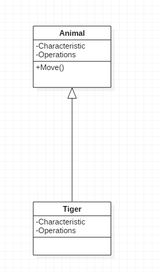
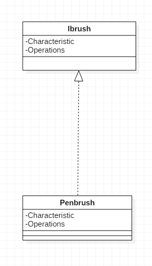

https://blog.csdn.net/tianhai110/article/details/6339565

在UML类图中, 常见的有以下几种关系: 泛化(Generalization),  实现(Realization),关联(Association),聚合(Aggregation),组合(Composition), 依赖(Dependency)

## 1.泛化(Generalization)

【泛化关系】: 是一种继承关系,它指定了子类如何特化父类的所有特征和行为. 例如: 老虎是动物的一种.

【箭头指向】: 带三角箭头的实线, 箭头指向父类

## 2.实现(Realization/Implementation)

【实现关系】: 是一种类与接口的关系, 表示类是接口所有特征和行为的实现

【箭头指向】: 带三角箭头的虚线, 箭头指向接口

