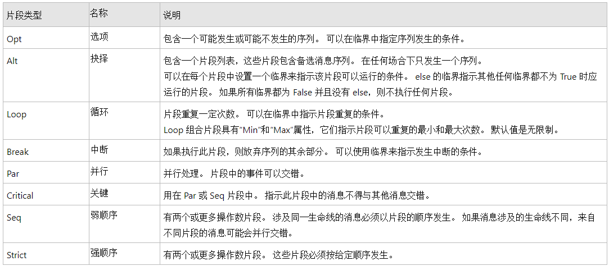

转自:

htt://blog.csdn.net/tianhai110

序列图主要用于展示对象之间交互的顺序.

序列图将交互关系表示为一个二维图. 纵向是时间轴, 时间沿竖线向下延伸. 横向轴代表了在协作中各独立对象的类元角色. 类元角色用生命线表示. 当**对象存在**时, 角色用一条**虚线**表示, 当对象的过程处于**激活状态**时, 生命线是一个**双道线**.

消息用从一个对象的生命线到另一个对象生命线的箭头表示. 箭头以时间顺序在图中从上到下排列.

序列图中涉及的元素:

## 1. 生命线

生命线名称可带下划线. 当使用下划线时, 意味着序列图中的生命线代表一个类的特定实体.

## 2. 同步消息

发送人在它继续之前, 将等待同步消息响应

## 3. 异步消息

在发送方继续之前, 无需等待响应的消息

## 4. 注释

## 5. 约束

约束的符号很简单; 格式是: [Boolean Test]

## 6. 组合片段

组合片段 用来解决交互执行的条件及方式. 它允许在序列图中直接表示逻辑组件, 用于通过指定条件或子进程的应用区域, 为任何生命线的任何部分定义特殊条件和子进程.

常用的组合片段有:

### a. 抉择(Alt)

抉择用来指明在两个或更多的消息序列之间的互斥的选择, 相当于经典的 if..else...

抉择在任何场合下只发生一个序列. 可以在每个片段中设置一个临界来指示该片段可以运行的条件.  else 的临界指示其他任何临界都不为 True 时应运行的片段.  如果所有临界都为 False 并且没有 else, 则不执行任何片段.

### b. 选项(Opt)

包含一个可能发生或不发生的序列

### c. 循环(Loop)

片段重复一定次数.  可以在临界中指示片段重复的条件.

### d. 并行(Par)

下表列出了常用的组合片段:

默认情况下, 序列图表明可能发生的一系列消息. 在运行的系统中, 可能会出现您未选择显示在关系图上的其他消息.

以下片段类型可用于更改此释义:

