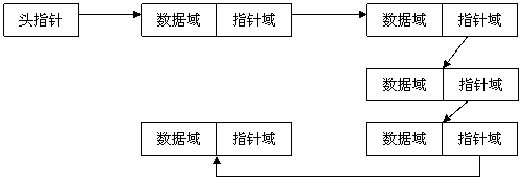
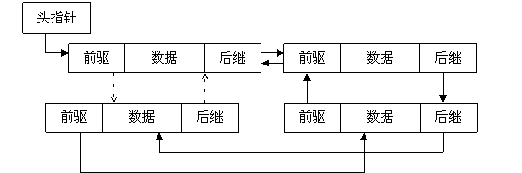
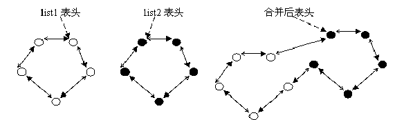

# 概要

算法和数据结构纷繁复杂, 但是对于 Linux Kernel 开发人员来说重点了解 Linux 内核中使用到的算法和数据结构很有必要.

在一个国外问答平台[stackexchange.com](https://stackexchange.com/)的 Theoretical Computer Science 子板有一篇讨论实际使用中的算法和数据结构, Vijay D 做出了详细的解答, 其中有一部分是 Basic Data Structures and Algorithms in the Linux Kernel 对 Linux 内核中使用到的算法和数据结构做出的归纳整理. 详情参考[这里](https://cstheory.stackexchange.com/questions/19759/core-algorithms-deployed).

同时有一篇中文翻译在[https://linux.cn/article-2317-1.html](https://linux.cn/article-2317-1.html)可以找到.

下面就以 Vijay D 的回答作为蓝本进行学习总结.

# 测试方法准备

由于需要在内核中进行代码测试验证, 完整编译安装内核比较耗时耗力. 准备采用 module 形式来验证.

Makefile

```
obj-m:=linked-list.o

KERNELBUILD:=/lib/modules/$(shell uname -r)/build

default:
    make -C ${KERNELBUILD} M=$(shell pwd) modules
clean:
    rm -rf *.o *.cmd *.ko *.mod.c .tmp_versions
```

linked-list.c

```cpp
#include <linux/module.h>
#include <linux/init.h>
#include <linux/list.h>

int linked_list_init(void)
{
    printk("%s\n", __func__);
    return 0;
}

void linked_list_exit(void)
{
    printk("%s\n", __func__);
}

module_init(linked_list_init);
module_exit(linked_list_exit);
MODULE_AUTHOR("Haiwei Li");
MODULE_LICENSE("GPL");
MODULE_DESCRIPTION("Linked list test");
```

安装 module

```
sudo insmod linked-list.ko
```

查找安装情况

```
lsmod | grep linked-list
```

执行 log

```
<4>[621267.946711] linked_list_init
<4>[621397.154534] linked_list_exit
```

删除 module

```
sudo rmmod linked-list
```

# 链表、双向链表、无锁链表

> [Linked list](https://github.com/mirrors/linux-2.6/blob/master/lib/llist.c)
> 
> [doubly linked list](https://github.com/mirrors/linux-2.6/blob/master/include/linux/list.h)
> 
> [lock-free linked list](https://github.com/mirrors/linux-2.6/blob/master/include/linux/llist.h)

链表是一种常用的组织有序数据的数据结构, 它通过指针将一系列数据节点连接成一条数据链, 是线性表的一种重要实现方式. 相对于数组, 链表具有更好的动态性, 建立链表时无需预先知道数据总量, 可以随机分配空间, 可以高效地在链表中的任意位置实时插入或删除数据. 链表的开销主要是访问的顺序性和组织链的空间损失.

通常链表数据结构至少应包含两个域: 数据域和指针域, 数据域用于存储数据, 指针域用于建立与下一个节点的联系. 按照指针域的组织以及各个节点之间的联系形式, 链表又可以分为单链表、双链表、循环链表等多种类型.



通过设计前驱和后继两个指针域, 双链表可以从两个方向遍历, 这是它区别于单链表的地方. 如果打乱前驱、后继的依赖关系, 就可以构成"二叉树"; 如果再让首节点的前驱指向链表尾节点、尾节点的后继指向首节点(如图 2 中虚线部分), 就构成了循环链表; 如果设计更多的指针域, 就可以构成各种复杂的树状数据结构.



循环链表的特点是尾节点的后继指向首节点. 前面已经给出了双循环链表的示意图, 它的特点是从任意一个节点出发, 沿两个方向的任何一个, 都能找到链表中的任意一个数据. 如果去掉前驱指针, 就是单循环链表.

## 2.1 Simple doubly linked list

数据结构:

```
struct list_head {
    struct list_head *next, *prev;
};
```

声明和初始化:

```
static inline void INIT_LIST_HEAD(struct list_head *list)
```

在表头插入和在表尾插入:

```cpp
static inline void list_add(struct list_head *new, struct list_head *head)

static inline void list_add_tail(struct list_head *entry, struct list_head *head)
```

删除, 被删除的节点 prev、next 分别被设为 LIST\_POISON2、LIST\_POISON1, 当访问此节点时会引起叶故障. 保证不在链表中的节点项不可访问.

```cpp
static inline void list_del(struct list_head *entry)

static inline void list_del_init(struct list_head *entry)  将 entry 从链表解下来, 重新初始化, 就可以访问节点.
```

将节点从一个链表搬移到另一个链表, 根据插入表头和表位分两种:

```cpp
static inline void list_move(struct list_head *list, struct list_head *head)

static inline void list_move_tail(struct list_head *list, struct list_head *head)
```

用新节点替换纠结点:

```
static inline void list_replace(struct list_head *old, struct list_head *new)
```

将 list 插入到 head:

```
static inline void list_splice(const struct list_head *list, struct list_head *head)

static inline void list_splice_tail(struct list_head *list, struct list_head *head)

static inline void list_splice_init(struct list_head *list, struct list_head *head) 将 list 设为空链表

static inline void list_splice_tail_init(struct list_head *list, struct list_head *head) 将 list 设为空链表
```



```
static inline void list_cut_position(struct list_head *list, struct list_head *head, struct list_head *entry)
```

遍历宏:

```
list_entry(ptr, type, member)

list_first_entry(ptr, type, member)

list_last_entry(ptr, type, member)

list_next_entry(pos, member)

list_prev_entry(pos, member)

list_for_each(pos, head)

list_for_each_prev(pos, head) 反向操作

list_for_each_safe(pos, n, head) 安全操作

list_for_each_entry(pos, head, member) 遍历链表是获取链表节点

list_for_each_entry_safe(pos, n, head, member) 安全操作

list_for_each_entry_reverse(pos, head, member) 反向操作
```

判断链表是否为空:

```
static inline int list_empty(const struct list_head *head)
```

## 2.2 Doubly linked list with a single pointer list head

linux 内核里边除了著名的 list 双向循环链表以外, 还有一个重要的数据结构, 就是哈希链表. 哈希链表也在很多重要的地方有所使用, 比如 linux 内核的 dentry, 进程查询, 文件系统等, 可以说, 弄明白 hlist 对于理解 linux 内核具有重要的意义.

```
struct hlist_head {
    struct hlist_node *first;
};

struct hlist_node {
    struct hlist_node *next, **pprev;
};
```

linux 内核的 hash 链表有两个数据结构组成, 一个是 hlist\_head 是 hash 表的表头, 一个是 hlist\_node 是 hash 标的后续节点.

在使用的时候, 一般定义一个 struct hlist\_head xxx[100]数组(100 只是一个代表的数字, 视具体情况而定), 采取**哈希函数来将键值与数组的对应的地址**联系起来, 如果出现冲突的话, 就在 hlist\_head 的后边继续添加.

hlist\_head 的成员 first 指针指向后续的第一个节点, 如果哈希链表是空的话, 就为 NULL.

为什么 hlist\_head 不弄成双向链表呢, 因为为了节约空间, 如果一个指针的话, 一个哈希数组的空间消耗就会减半.

hlist\_node 的成员 next 指向后续的节点的地址, 如果为空就是 NULL, 另一个成员 pprev 是二级指针, 指向前一个节点的 next 成员的地址, 如果前一个成员是 hlist\_head 的话, pprev 的值就是前一个的 first 指针的地址.

```
#define HLIST_HEAD(name) struct hlist_head name = {  .first = NULL }  定义并且初始化.

#define INIT_HLIST_HEAD(ptr) ((ptr)->first = NULL) 在定义之后, 需要初始化, 不然使用会导致错误.

static inline void INIT_HLIST_NODE(struct hlist_node *h) 初始化 node 节点

static inline int hlist_empty(const struct hlist_head *h) 判断 hash 链表是否为空

static inline void hlist_del(struct hlist_node *n) 删除节点, 并且将节点 next、pprev 指针修改为 LIST_POSITION1 和 LIST_POSITION2.

static inline void hlist_del_init(struct hlist_node *n) 此种方法更安全, 删除然后再初始化节点.

static inline void hlist_add_head(struct hlist_node *n, struct hlist_head *h) 将节点插入到 hash 链表的头结点后边.

static inline void hlist_add_before(struct hlist_node *n, struct hlist_node *next) 将一个节点插入到 next 前面.

static inline void hlist_add_behind(struct hlist_node *n, struct hlist_node *prev) 将一个节点插入到 prev 后面.

遍历访问节点:

hlist_for_each(pos, head)

hlist_for_each_safe(pos, n, head)

#define hlist_entry(ptr, type, member) container_of(ptr,type,member)

hlist_entry_safe(ptr, type, member)

hlist_for_each_entry(pos, head, member)

hlist_for_each_entry_safe(pos, n, head, member)
```

## 2.3 Lock-less NULL terminated single linked list

无锁链表定义在 include/linux/llist.h.

数据结构如下:

```
struct llist_head {
    struct llist_node *first;
};

struct llist_node {
    struct llist_node *next;
};
```

```
#define LLIST_HEAD(name)    struct llist_head name = LLIST_HEAD_INIT(name)

static inline void init_llist_head(struct llist_head *list)

llist_entry(ptr, type, member)

llist_for_each(pos, node)

static inline bool llist_empty(const struct llist_head *head)

static inline struct llist_node *llist_next(struct llist_node *node)

static inline bool llist_add(struct llist_node *new, struct llist_head *head)

bool llist_add_batch(struct llist_node *new_first, struct llist_node *new_last, struct llist_head *head)

static inline struct llist_node *llist_del_all(struct llist_head *head)

struct llist_node *llist_del_first(struct llist_head *head)
```

llist\_add、llist\_add\_batch、llist\_del\_first 都是基于 cmpxchg 原子操作来实现, 整个操作是原子的; llist\_del\_all 是基于 xchg 来实现的.

cmpxchg(void\* ptr, int old, int new), 如果 ptr 和 old 的值一样, 则把 new 写到 ptr 内存, 否则返回 ptr 的值, 整个操作是原子的. 在 Intel 平台下, 会用 lock cmpxchg 来实现, 这里的 lock 个人理解是锁住内存总线, 这样如果有另一个线程想访问 ptr 的内存, 就会被 block 住.

# B+ 树

关于 B 树及 B 树衍生树有篇介绍不错《从 B 树、B+树、B*树谈到 R 树》.

B 树诞生的背景:

在大规模数据存储中, 实现索引查询这样一个实际背景下, 树节点存储的元素数量是有限的, 这样就会导致二叉树结构由于树的深度过大而造成磁盘 I/O 读写过于频繁, 进而导致查询效率低下.
那么如何减少树的深度, 一个基本的想法是采用多叉树结构.
因为磁盘的操作费时费资源, 那么如何提高效率, 即如何避免频繁的读取呢?根据磁盘查找存取的次数往往由树的高度决定, 所以只要通过较好的结构降低树的高度. 根据平衡二叉树的启发, 自然就想到平衡多叉树结构.

几个算法时间复杂度度量:

O(n) 表示某函数值(未列出)是 n 的常数倍; 亦即他们增长的速度相当.称 大 O,big O (发音 "欧" 英文字母 O )
同理:O(logN):是 logN 的常数倍; O(nlogn):是 nlogn 的常数倍

# 4 优先排序列表

> [Priority sorted lists](https://github.com/mirrors/linux-2.6/blob/master/include/linux/plist.h) used for [mutexes](https://github.com/mirrors/linux-2.6/blob/b3a3a9c441e2c8f6b6760de9331023a7906a4ac6/include/linux/rtmutex.h), [drivers](https://github.com/mirrors/linux-2.6/blob/f0d55cc1a65852e6647d4f5d707c1c9b5471ce3c/drivers/powercap/intel_rapl.c), etc.

plist 有两个重要结构体 struct plist\_head 和 struct plist\_node, 分别用来表示 plist 表头和 plist 节点.

```cpp
struct plist_head {
    struct list_head node_list;
};

struct plist_node {
    int prio;
    struct list_head prio_list;
    struct list_head node_list;
};
```

相关函数:

```cpp
PLIST_HEAD(head) 初始化 plist 表头
PLIST_NODE_INIT(node, __prio) 初始化 plist 节点
static inline void plist_head_init(struct plist_head *head) 初始化 plist 表头

static inline void plist_node_init(struct plist_node *node, int prio) 初始化 plist 节点

添加节点、删除节点:
extern void plist_add(struct plist_node *node, struct plist_head *head); 通过 plist_add 添加到 head 的 node 是按照 prio 优先级由高到低顺序在 node_list 上排列.
extern void plist_del(struct plist_node *node, struct plist_head *head);
extern void plist_requeue(struct plist_node *node, struct plist_head *head); 是 plist_del 的优化版本

遍历 plist:
plist_for_each(pos, head)

判断 head 是否为空:
static inline int plist_head_empty(const struct plist_head *head)

判断当前 node 是否在 node_list 上:
static inline int plist_node_empty(const struct plist_node *node)

获取前一、后一节点:
plist_next(pos)
plist_prev(pos)

获取首节点、尾节点:
static inline struct plist_node *plist_first(const struct plist_head *head)
static inline struct plist_node *plist_last(const struct plist_head *head)
```

下面是对 plist 进行的一些验证:

```cpp
static dump_list(void)
{
    struct plist_node *node_pos, *first_node, *last_node;
    int i;

    printk(KERN_DEBUG "%s start\n", __func__);
    printk("node_list: ");
    list_for_each_entry(node_pos, &test_head.node_list, node_list) {
        printk("%d ", node_pos->prio);
    }
    printk("\n");

    first_node = plist_first(&test_head);
    last_node = plist_last(&test_head);
    printk("prio_list: %d ", first_node->prio);
    list_for_each_entry(node_pos, &first_node->prio_list, prio_list) {
        printk("%d ", node_pos->prio);
    }
    printk("\n");

#if 0
    for (i = 0; i < ARRAY_SIZE(test_node); i++) {
        if(!plist_node_empty(test_node+i))
            printk(KERN_DEBUG "(test_node+%d)->prio=%d\n", i, (test_node+i)->prio);
    }
#endif
    printk(KERN_DEBUG "MIN(prio)=%d MAX(prio)=%d\n", first_node->prio, last_node->prio);
    printk(KERN_DEBUG "%s end\n", __func__);
}

static int  __init plist_test(void)
{
    int nr_expect = 0, i, loop;
    unsigned int r = local_clock();

    printk(KERN_DEBUG "start plist test\n");
    plist_head_init(&test_head);
    for (i = 0; i < ARRAY_SIZE(test_node); i++)
        plist_node_init(test_node + i, 0);

    for (loop = 0; loop < 10; loop++) {
        r = r * 193939 % 47629;
        i = r % ARRAY_SIZE(test_node);
        if (plist_node_empty(test_node + i)) {
            r = r * 193939 % 47629;
            test_node[i].prio = r % 10;
            plist_add(test_node + i, &test_head);
            nr_expect++;
        } else {
            plist_del(test_node + i, &test_head);
            nr_expect--;
        }
        plist_test_check(nr_expect);
        if (!plist_node_empty(test_node + i)) {
            plist_test_requeue(test_node + i);
            plist_test_check(nr_expect);
        }
    }

    dump_list();

    for (i = 0; i < ARRAY_SIZE(test_node); i++) {
        if (plist_node_empty(test_node + i))
            continue;
        plist_del(test_node + i, &test_head);
        nr_expect--;
        plist_test_check(nr_expect);
    }

    printk(KERN_DEBUG "end plist test\n");
    return 0;
}
```

通过初始化不超过 10 个 node 节点, 优先级为 0-9. 然后查看 node\_list 和 prio\_list 两链表的节点情况:

```
[22050.404475] start plist test
[22050.404481] dump_list start
[22050.404482] node_list: 0 0 1 1 2 6 8 8 9 9
[22050.404486] prio_list: 0 1 2 6 8 9
[22050.404488] MIN(prio)=0 MAX(prio)=9
[22050.404489] dump_list end
[22050.404491] end plist test
[22050.947810] start plist test
[22050.947816] dump_list start
[22050.947817] node_list: 0 1 1 2 2 3 3 3 8 8
[22050.947820] prio_list: 0 1 2 3 8
[22050.947822] MIN(prio)=0 MAX(prio)=8
[22050.947823] dump_list end
[22050.947825] end plist test
[22051.491245] start plist test
[22051.491254] dump_list start
[22051.491256] node_list: 0 1 2 3 3 3 6 9 9 9
[22051.491262] prio_list: 0 1 2 3 6 9
[22051.491266] MIN(prio)=0 MAX(prio)=9
[22051.491267] dump_list end
[22051.491271] end plist test
```

可以看出 node\_list 上的节点按照优先级由高到低排序, 优先级可能会重复; 在 prio\_list 上是不同优先级的节点. 如下所示:

```
* pl:prio_list (only for plist_node)
* nl:node_list
*HEAD|             NODE(S)
*        |
*        ||------------------------------------|
*        ||->|pl|<->|pl|<--------------->|pl|<-|
*        |     |10|   |21|   |21|   |21|   |40|   (prio)
*        |     |  |   |  |   |  |   |  |   |  |
*        |     |  |   |  |   |  |   |  |   |  |
*        | ->|nl|<->|nl|<->|nl|<->|nl|<->|nl|<->|nl|<-|
*        |-------------------------------------------------|
```

# 5 红黑树

> [Red-Black trees](https://github.com/mirrors/linux-2.6/blob/master/include/linux/rbtree.h) are [used](http://lwn.net/Articles/184495/) for scheduling, virtual memory management, to track file descriptors and directory entries,etc.

# 6 参考

https://www.cnblogs.com/arnoldlu/p/6695451.html