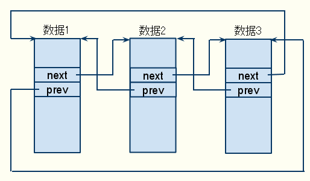
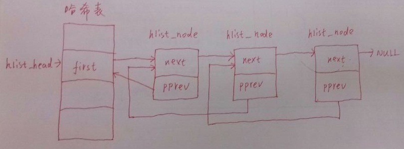

<!-- @import "[TOC]" {cmd="toc" depthFrom=1 depthTo=6 orderedList=false} -->

<!-- code_chunk_output -->

- [1 链表与哈希表](#1-链表与哈希表)
  - [1.1 双向链表](#11-双向链表)
  - [1.2 hlist](#12-hlist)
  - [1.3 ScatterList](#13-scatterlist)
    - [1.3.1 scatterlist 的存储结构](#131-scatterlist-的存储结构)
    - [1.3.2 scatterlist 的遍历](#132-scatterlist-的遍历)
  - [1.4 llist](#14-llist)
- [LRU](#lru)
  - [List-lru](#list-lru)
  - [LIRS](#lirs)
- [参考](#参考)

<!-- /code_chunk_output -->

# 1 链表与哈希表

链表可以把离散时间到达的数据结构串起来, 使其可以被更容易的索引. Linux 内核中全部使用双向链表. 那为何链表要与哈希表放在一起介绍呢?因为哈希表是由链表群组成的, 其每一个哈希桶都是一个链表. 而 linux 内核中全部使用双向链表, 这个链表在应用到哈希表时要针对性的优化.

## 1.1 双向链表



双向列表很容易做成一个环, 将起始的 prev 设为最后一个数据, 将最后一个数据的 next 设为起始. 一般的链表的设计思路是以链表节点为主体, 一个双向链表的节点的数据域一般包括: prev、next 与 data. 然而这样设计的一个显著的坏处是当一部分代码要处理链表的一部分数据的时候, 其拿到的永远是链表的节点, 要操作里面的数据代码需要通过节点索引到具体的数据位置. 如果这种代码块很多, 这个每次都要进行的索引操作在代码整洁上就是败笔.

Linux 采用了一个取巧的做法. 其双向链表的节点不包含实际的数据域, 而是数据结构中包含链表的节点. 哲学上, 链表功能是数据结构功能的一部分, 而不是反过来. 如此, 当一块代码拿到一个数据结构的实例后, 其就可以通过访问其中的链表域来确定其链表情况. 而使用链表定位到某一个实例后就可以使用 container_of 宏定位到这个结构体本身.

Container\_of 的作用是已知结构体某个域的指针, 求出结构体实例的指针. 原理是根据结构体定义得出已知指针的便宜, 用已知指针减去这个偏移就是结构体的指针.

## 1.2 hlist

双向链表有个显而易见的坏处, 就是如果有很多链表, 但可能大部分链表都很短的时候(很可能只有一个节点), 此时双向链表的 next 和 prev 的作用都可以用一个域来替代. 典型的是哈希表, 我们知道哈希表使用哈希函数计算得到一个地址, 然后直接访问该地址的机制实现快速访问的, 但是哈希算法不可避免的会有哈希冲突(多个输入产生了同一个地址输出), 此时解决冲突的方法就是哈希桶, 一般在同一个计算地址的位置实现一个链表, 该链表链出所有哈希结果为本地址的值.

此时, 一方面, 哈希结果一般只是一个整数, 你用两个整数大小的双向链表节点就会无法放得下一个哈希结果. 即使你人为的规定哈希得到的是两个整数大小的值, 虽然双向链表也可用了, 但浪费了整整一倍的空间. 好的算法设计是不会让这种事情发生的. 所以重新设计了 hlist, 专门用于放哈希桶链表.



哈希链表本质上也是个双向链表, 但是组织方式与双向列表并不完全一样.

```cpp
//hash 桶的头结点
struct hlist_head {
    struct hlist_node *first;//指向每一个 hash 桶的第一个结点的指针
};
//hash 桶的普通结点
struct hlist_node {
    struct hlist_node *next;//指向下一个结点的指针
    struct hlist_node **pprev;//指向上一个结点的 next 指针的地址
};
```

Linux 双向列表是环形的, 而 hlist 是有特定的头部结构的. 其头部只有一个 first 域, 用来指向第一个节点(如此一个头部只有一个整数大小). 而第一个节点和后续的节点的结构都是一样的, 只是**第一个节点的 next 和 pprev 都是指向的头部的 first 域. 后续的节点的 next 指向的是下个节点的 next 域(就是下个节点的地址), 而 pprev 指向的是上个节点的 next 域**. 细心的人会发现, 在整个链表的设计中, 与双向链表的不同有两处: 头部和 pprev. 而 pprev 本质上又和双向链表的 prev 是一样的, 都是指向上一个链表数据结构的地址. 那为何要用 pprev 而不直接使用双向链表呢?

这个问题其实为了适应头部设计而引入的副作用的解决方法. 我们前面讨论过, 之所以要设计头部为一个整数大小的原因(哈希桶的空间利用率), 而这个头部的引入, 导致了第一个节点和后面节点的不同. 第一个节点指向的 prev 和后面的节点的 prev 在结构上和定义上不同. 为此, 所有相关的操作(添加、删除、遍历等)都得特别照顾第一个节点(多一个特殊情况判断). 无疑能从数据结构设计上将这种特殊情况去掉是最好的. hlist 的设计做到. 其 prev 并不是指向上一个节点的数据结构, 而是指向上一个节点的 next 节点. 这对于头部节点来说, 上一个节点的数据结构是 hlist\_head, 而上一个节点的下一个 next 节点的类型是 struct hlist\_node *, 采用后者就能让第一个节点和后续的节点对所有操作展现出一样的接口.

## 1.3 ScatterList

### 1.3.1 scatterlist 的存储结构

该数据结构存在的原因是系统运行会产生内存碎片, 为了利用内存碎片传送大数据, 在 DMA 支持分离的多块内存同时的传输下, 对应的产生的软件结构. 其表示的是多块分离的内存.

scatterlist 的主要结构体是:

```cpp
struct scatterlist {

         unsignedlong  page_link;    //指向下个 scatterlist 节点的地址

         unsignedint     offset;       //偏移

         unsignedint     length;       //长度

};
```

这里的数据结构的命名与设计非常不易懂, 但是很高效, 核心在 page\_link.

你可以在任何内存位置定义一个 scatterlist 的数组, scatterlist 连续的存放于内存中. 结构体内部的 page\_link 指向数据的存储页, offset 表示其指向的内存在本 page 的偏移, length 表示其指向的内存空间的大小(可以大于一个页). scatterlist 的数组称为 scatterlist table.

然而, linux 允许两个 scatterlist 被连接起来, 构成一个更大的 scatterlist. (如果多次调用, 就可以连接起很多个 scatterlist), 这里级联的方法使用的仍旧是该结构体的 page\_link 域. 如果区分两种功能呢?由于 page_link 不论是指向一个 page 页地址, 还是指向一个 scatterlist 结构体, 其最后的两位都是 0(不止两位, 但只用了两位). 所以就可以使用最后的两位来区别解释前面的地址到底是页地址还是 scatterlist 地址:

01 标示地址指向的是 scatterlist(级联情况), 10 标示后面没有级联的节点了, 00 表示 page\_link 指向的是存储的页地址.

当一个 scatterlist 结构体用作级联的情况下, 该结构体内的其他域都为 0, 表示该节点不指向任何可用的存储空间, 而是只是用来连接下一个 scatterlist table 的桥梁.

```cpp
struct sg_table {

         structscatterlist *sgl;     /* the list */

         unsignedint nents;           /* number of mappedentries */

         unsignedint orig_nents; /* original size of list*/

};
```

sg\_table 是对 scatter\_list 的总体概括, 内含了 scaterlist 和一个 map 之前的块数目, 和一个 map 之后的块数目. 这里的 map 的意义是, 各个分离的内存有可能恰好相邻, 可以合并.

### 1.3.2 scatterlist 的遍历

scatterlist table 由于可以被拼接(chain), 不同的 scatterlist 如果所指向的内存是相邻的还可以被合并, 所以其遍历格外复杂.

## 1.4 llist

llist 全称是 Lock-less NULL terminated single linked list, 意思是不需要加锁的 list. 在生产者消费者模型下, 如果有多个生产者和多个消费者, 生产者意味者链表添加, 消费者意味着链表删除操作. 但多个一起操作时就需要加锁, 加锁毕竟是高耗费的操作, 内核现在流行无锁操作, 为这个需求诞生的专门的 list 就是 llist.

典型的情形就是中断. 我们都知道中断有上半部分和下半部分. 上半部分是会关闭所有中断, 使系统失去响应, 为了减小这个时间, 上班部分不能休眠, 复杂的操作也得放到下半部分执行. 也就是意味着上班部分的代码不能使用加锁操作, 而中断重入是很容易发生的, 这就又诞生了加锁的需求. 最好的提供上半部分使用 list 数据结构能力的方式就是使用无锁 list.

内核实现的方法是使用 cmpxchg 宏. 这本来是一个 intel 平台的汇编指令, linux 喜欢这个指令, 但其他平台不一定有, 所以就封装了一个宏, 在其他平台重新实现, 而 intel 平台就可以直接调用 cmpxchg 指令即可. 这个指令是原子的, 有 3 个参数, 对比第一个和第二个参数, 如果相等就写入第三个参数到第一个参数指向的地址. 如果不相等就返回第三个参数. 本意是将第三个参数写入第一个参数指向的地址. 但是加上了对比, 对比之后写入之前第一个参数指向的内存就不会被其他任何指令修改, 这就确保了在写入操作之前和之后的一致性. 具体到 llist 就是在添加链表节点到头部时, 需要确保修改 head->first 指针时, 没有其他的并行操作也在修改. 如此就会造成同时进行的两个操作有一个丢失. 所以 cmpxchg 先读出 head->next, 然后 head->first 作为第一个参数, 刚读出的 head->first 作为第二个, 要添加的作为第三个.

作者是 intel 公司的 Huang Ying.

# LRU

## List-lru

在 mm 下有定义, 主要用在内存管理. 在 Linux 中, 操作系统对 LRU 的实现主要是基于一对双向链表: active 链表和 inactive 链表, 这两个链表是 Linux 操作系统进行页面回收所依赖的关键数据结构, 每个内存区域都存在一对这样的链表. 顾名思义, 那些经常被访问的处于活跃状态的页面会被放在 active 链表上, 而那些虽然可能关联到一个或者多个进程, 但是并不经常使用的页面则会被放到 inactive 链表上. 页面会在这两个双向链表中移动, 操作系统会根据页面的活跃程度来判断应该把页面放到哪个链表上. 页面可能会从 active 链表上被转移到 inactive 链表上, 也可能从 inactive 链表上被转移到 active 链表上, 但是, 这种转移并不是每次页面访问都会发生, 页面的这种转移发生的间隔有可能比较长. 那些最近最少使用的页面会被逐个放到 inactive 链表的尾部. 进行页面回收的时候, Linux 操作系统会从 inactive 链表的尾部开始进行回收.

## LIRS

这个算法是 LRU 的改进算法. LRU 在遍历时会导致被全部刷新, 失去意义, 反而会带来效率的损失. 但是 LIRS 使用两层列表, 一个是 cold, 一个是 hot. 利用两层数据保证经常使用的数据不被遍历操作刷掉. 但是这个算法在内核中还没有实现, 估计日后有人会做.

# 参考

https://blog.csdn.net/ljy1988123/article/details/48391745