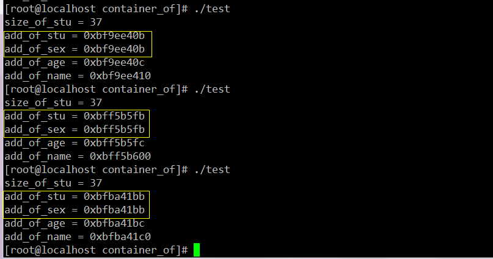
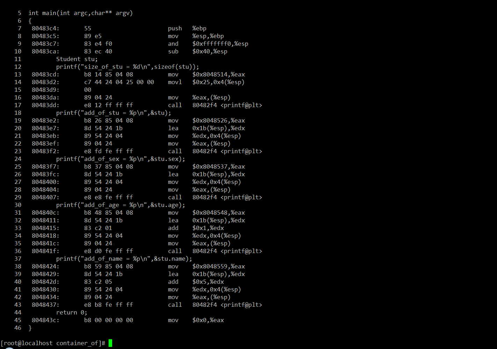
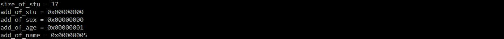
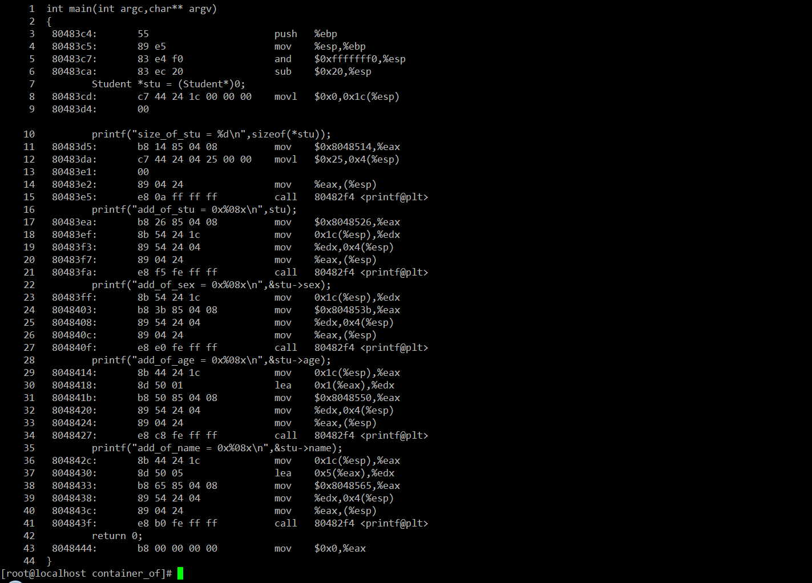
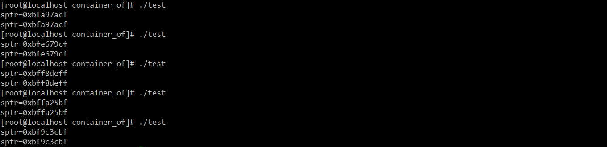

参考:

https://blog.csdn.net/wjlkoorey/article/details/52012996

`container_of()` 这个宏, 还包括一个叫做 `offsetof()` 的家伙. 在这两个宏定义里都出现将 "零" 地址强转成目标结构体类型, 然后再访问其成员属性的情形. 0 地址不可以访问(参见 Linux/Debug/Segmentation fault 文章), 那 `container_of()` 和 `offsetof()` 宏定义里用 0 时怎么没报错呢? 到底该如何理解"零"地址? 结构体被编译时有没有什么猫腻呢? 程序到底是如何访问结构体里的每个成员属性的?

内核宏定义 `container_of()`:

```
/* include/linux/stddef.h */
#ifdef __compiler_offsetof
#define offsetof(TYPE,MEMBER) __compiler_offsetof(TYPE,MEMBER)
#else
#define offsetof(TYPE, MEMBER) ((size_t) &((TYPE *)0)->MEMBER)

/* include/linux/kernel.h */
/**
 * container_of - cast a member of a structure out to the containing structure
 * @ptr:    the pointer to the member.
 * @type:   the type of the container struct this is embedded in.
 * @member: the name of the member within the struct.
 *
 */
#define container_of(ptr, type, member) ({          \
    const typeof( ((type *)0)->member ) *__mptr = (ptr);    \
    (type *)( (char *)__mptr - offsetof(type,member) );})
```

offsetof: 将零地址强制转换成目标结构体类型 TYPE, 然后访问其成员属性 MEMBER, 就得到了该成员在其宿主结构体里的偏移量(按字节计算).

可为什么 0 地址能被这样用呢?编译器就不报错?

看一个简单的例子:

```
#include <stdio.h>

#pragma pack(1)
typedef struct student{
        unsigned char sex;
        unsigned int age;
        unsigned char name[32];
}Student;

int main(int argc,char** argv)
{
        Student stu;
        printf("size_of_stu = %d\n",sizeof(stu));
        printf("add_of_stu = %p\n",&stu);
        printf("add_of_sex = %p\n",&stu.sex);
        printf("add_of_age = %p\n",&stu.age);
        printf("add_of_name = %p\n",&stu.name);
        return 0;
}
```

其中第三行代码是取消编译默认的结构体对齐优化, 这样一来 Student 结构体所占内存空间大小为 37 字节. 编译运行结果如下:

```
[root@tsinghua-pcm C]# gcc -g -m32 student.c -o student

[root@tsinghua-pcm C]# ./student
size_of_stu = 37
add_of_stu = 0xff962e1b
add_of_sex = 0xff962e1b
add_of_age = 0xff962e1c
add_of_name = 0xff962e20

[root@tsinghua-pcm C]# file student
student: ELF 32-bit LSB executable, Intel 80386, version 1 (SYSV), dynamically linked (uses shared libs), for GNU/Linux 2.6.32, BuildID[sha1]=403f53056b00dd2ac46f64af9e04f6daf3d3dd7f, not stripped
```

Student 结构体对象 stu 里的三个成员属性的地址, 按照我们的预期进行排列的. 此时我们知道 stu 对象的地址是个随机值, 每次运行的时候都会变, 但是无论怎么变 stu.sex 的地址永远和 stu 的地址是一致:



反汇编一下:



```
[root@tsinghua-pcm C]# objdump -S student
```

如果你对 AT&T 的汇编语言不是很熟悉, 建议先看一下《深入理解 C 语言的函数调用过程 》. 上面的反汇编代码已经和 C 源代码关联起来了, 注意看第 20 行反汇编代码"lea    0x1b(%esp),%edx", 用 lea 指令将 esp 向高地址偏移 27 字节的地址, 也就是栈空间上 stu 的地址装载到 edx 寄存器里, lea 指令的全称是 load effective address, 所以该指令是将要操作的地址装载到目标寄存器里. 另外, 我们看到, 在打印 stu.age 地址时, 第 26 行也装载的是 0x1b(%esp)地址; 打印 stu.age 时, 注意第 32、33 行代码, 因为栈是向高地址增长的, 所以 age 的地址比 stu.sex 的地址值要大, 这里在编译阶段编译器就已经完成了地址偏移的计算过程; 同样地, stu.name 的地址, 观察第 39、40 行代码, 是在 0x1b(%esp)的基础上, 增加了 stu.sex 和 stu.age 的偏移, 即 5 个字节后找到了 stu.name 的地址.

也就是说, 编译器在编译阶段就已经知道结构体里每个成员属性的相对偏移量, 我们源代码里的所有对结构体成员的访问, 最终都会被编译器转化成对其相对地址的访问, **代码在运行时根本没有变量名、成员属性一说, 有的也只有地址**. OK, 那就简单了, 我们再看一下下面的程序:

```
#include <stdio.h>

#pragma pack(1)
typedef struct student{
        unsigned char sex;
        unsigned int age;
        unsigned char name[32];
}Student;

int main(int argc,char** argv)
{
        Student *stu = (Student*)0;

        printf("size_of_stu = %d\n",sizeof(*stu));
        printf("add_of_stu = 0x%08x\n",stu);
        printf("add_of_sex = 0x%08x\n",&stu->sex);
        printf("add_of_age = 0x%08x\n",&stu->age);
        printf("add_of_name = 0x%08x\n",&stu->name);
        return 0;
}
```

运行结果:



反汇编:



第 8 行"movl   $0x0,0x1c(%esp)" 为指针 stu 赋值, 为了打印 stu 指针所指向的地址值, 第 18、19 行准备将 0x1c(%esp)的值压栈, 为调用 printf()做准备; 准备打印 stu->sex 时, 参见第 23、25 两行所做的事情, 与第 18、19 行相同; 当准备打印 stu->age 时, 参见第 29、30 行, eax 里已经保存了 stu 所指向的地址 0, 是从栈上 0x1c(%esp)里取来的, 然后 lea 指令将 eax 所指向地址向"后"偏 1 字节的地址值装载到 edx 里, 和上面第一个实例代码一样. 因为 eax 的值是 0, 所以 0x1(%eax)的值肯定就是 1, 即此时在 stu=NULL 的前提下, 找到了 stu->age 的地址. 到这里, 我们的问题也就差不多明朗了:

第一: 对于任何一个变量, 任何时候我们都可以访问该变量的地址, 但是却不一定能访问该地址里的值, 因为在保护模式下对地址里的值的访问是受限的;

第二, 结构体在编译期间就已经确定了每个成员的大小, 进而明确了每个成员相对于结构体头部的偏移的地址, 源代码里所有对结构体成员的访问, 在编译期间都已经静态地转化成了对相对地址的访问.

换句话说, 源代码里你可以写类似于 int \*ptr = 0x12345; 这样的语句代码, 对 ptr 执行加、减, 甚至强制类型转换都没有任何问题, 但是如果你想**访问 ptr 地址里的内容**, 那么很不幸, 你可能会**收到一个"Segmentation Fault"的错误提示**, 因为你**访问了非法的内存地址**.

最后, 让我们回到开篇的那个问题:

```
#define offsetof(TYPE, MEMBER) ((size_t) &((TYPE *)0)->MEMBER)
```

相信大家现在对 offsetof()定义里那个奇怪的 0 应该不再会感到奇怪了吧. 其实 container\_of()里还有一个名叫 typeof 的东东, 是用于取一个变量的类型, 这是 GCC 编译器的一个扩展功能, 也就是说 typeof 是编译器相关的. 既不是 C 语言规范的所要求, 也不是某个神马标准的一部分, 仅仅是 GCC 编译器的一个扩展特性而已, Windows 下的 VC 编译器就不带这个技能. 让我们继续刨一刨 container\_of()的代码:

```
#define container_of(ptr, type, member) ({            \
    const typeof( ((type *)0)->member ) *__mptr = (ptr);    \
    (type *)( (char *)__mptr - offsetof(type,member) );})
```

第二句代码意思是用 typeof()获取结构体里 member 成员属性的类型, 然后定义一个该类型的临时指针变量\_\_mptr, 并将 ptr 所指向的 member 的地址赋给\_\_mptr; 第三句代码意思就更简单了, \_\_mptr 减去它自身在结构体 type 里的偏移量就找到了结构体的入口地址, 最后将该地址强转成目标结构体的地址类型就 OK 了. 如果我们将使用了 container\_of()的代码进行宏展开后, 看得会比较清楚一点:

```
#include <stdio.h>

#pragma pack(1)
typedef struct student{
        unsigned char sex;
        unsigned int age;
        unsigned char name[32];
}Student;

#define offsetof(TYPE, MEMBER) ((size_t) &((TYPE *)0)->MEMBER)
#define container_of(ptr, type, member) ({ \
        const typeof( ((type *)0)->member ) *__mptr = (ptr); \
        (type *)( (char *)__mptr - offsetof(type,member) );})

int main(int argc,char** argv)
{
        Student stu;
        Student *sptr = NULL;
        sptr = container_of(&stu.name,Student,name);
        printf("sptr=%p\n",sptr);
        sptr = container_of(&stu.age,Student,age);
        printf("sptr=%p\n",sptr);
        return 0;
}
```

运行结果:



宏展开后的代码如下:

```
int main(int argc,char** argv)
{
 Student stu;
 Student *sptr = ((void *)0);
 sptr = ({ const typeof(((Student *)0)->name ) *__mptr = (&stu.name); (Student *)( (char *)__mptr - ((size_t) &((Student *)0)->name) );});
 printf("sptr=%p\n",sptr);
 sptr = ({ const typeof(((Student *)0)->age ) *__mptr = (&stu.age); (Student *)( (char *)__mptr - ((size_t) &((Student *)0)->age) );});
 printf("sptr=%p\n",sptr);
 return 0;
}
```

GCC 在接下来的编译过程中会将 typeof()进行替换处理, 我们可以认为此时上述的代码和下面的代码是等价的:

```
int main(int argc,char** argv)
{
 Student stu;
 Student *sptr = ((void *)0);
 sptr = ({ const unsigned char  *__mptr = (&stu.name); (Student *)( (char *)__mptr - ((size_t) &((Student *)0)->name) );});
 printf("sptr=%p\n",sptr);
 sptr = ({ const unsigned int *__mptr = (&stu.age); (Student *)( (char *)__mptr - ((size_t) &((Student *)0)->age) );});
 printf("sptr=%p\n",sptr);
 return 0;
}
```