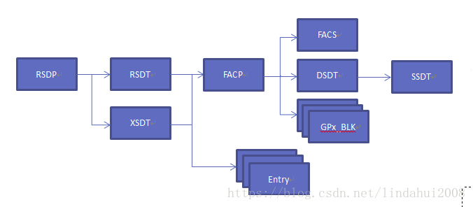
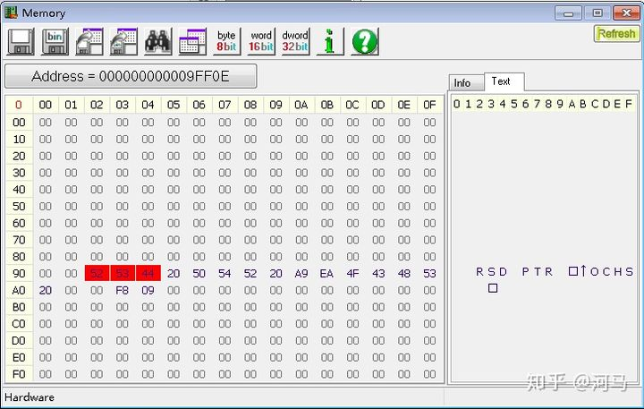
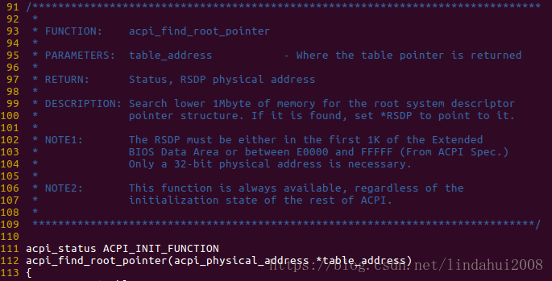
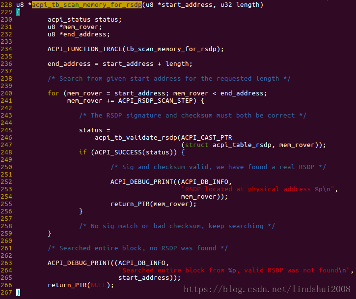

**ACPI**(Advanced Configuration and Power Interface) 是在**系统启动阶段**由 `BIOS/UEFI` **收集系统各方面信息并创建**的, 它大致**以树形的组织形式**(如下图所示)存在**系统物理内存**中.

**整个 ACPI 表**以 **RSDP**(`Root System Descriptor Pointer Table`) 为**入口点**, 每个非叶子节点都会包含指向其他子表的指针, 各个表都会有一个表头, 在该表头中包含了相应的 Signature, 用于标识该表, 有点类似与该表的 ID, 除此之外, 在表头中还会包含 Checksum、Revision、OEM ID 等信息. 所以查找 ACPI 表的关键就是在内存中定位到 RSDP 表.

对于基于 Legacy BIOS 的系统而言, RSDP 表所在的物理地址并不固定:

* 要么位于 **EBDA**(`Extended BIOS Data Area`)(位于物理地址 0x40E, x86来说, EBDA 的位置应该位于 9FC00 处)的前 1KB 范围内;

* 要么位于 0x000E0000 到 0x000FFFFF 的物理地址范围内.

Linux kernel 在启动的时候, 会去这两个物理地址范围, 通过遍历物理地址空间的方法寻找 RSDP 表, 即通过寻找 RSDP 表的 Signature(RSD PTR)来定位 RSDP 的位置, 并通过该表的 length 和 checksum 来确保找到的表是正确的.

用 RW 读取的 RSD PTR 表

来看一下 Linux 内核源码, 在内核启动的时候会调用 `acpi_boot_table_init()` 函数, 该函数会调用到 `acpi_find_root_pointer()` 函数用于定位 RSDP 表, 其函数的调用顺序如下:

`arch/x86/kernel/head64.S` -> `arch/x86/kernel/head64.c:x86_64_start_kernel()` -> `arch/x86/kernel/head64.c:x86_64_start_reservations` -> `init/main.c:start_kernel()` -> `arch/x86/kernel/setup.c:setup_arch()` -> `acpi_boot_table_init()` -> `acpi_table_init()` -> `acpi_initialize_tables()` -> `acpi_os_get_root_pointer()` -> `acpi_find_root_pointer()`

在 `acpi_find_root_pointer()` 函数中, 会先后在 EBDA 和 0x000E0000 到 0x000FFFFF 的物理地址范围内调用 `acpi_tb_scan_memory_for_rsdp()` 函数来检测 RSDP 表的 Signature "RSD PTR".

对于基于 UEFI 的系统而言, RSDP Table 位于 `EFI_SYSTEM_TABLE`, 所以 Linux 内核可以直接到该表里面查找 RSDP 表, 然后定位所有的 ACPI 表.

# 参考

Linux 启动时如何定位 BIOS 提供的 ACPI 表: https://zhuanlan.zhihu.com/p/49500489

