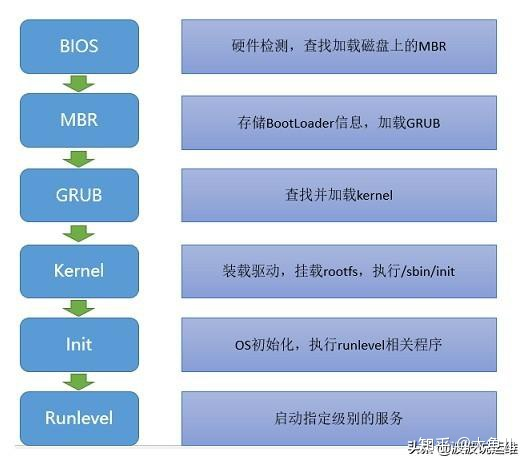
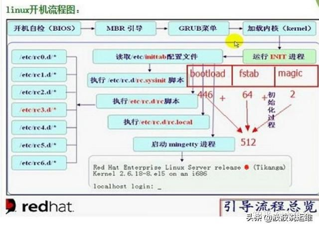

# LINUX 启动流程

先通过一张图来简单了解下整个系统启动的流程, 整个过程基本可以分为`POST-->BIOS-->MBR(GRUB)-->Kernel-->Init-->Runlevel`. 下面会详细说明每个过程的作用.



# BIOS

BIOS(Basic Input/Output System), 基本输入输出系统, 该系统存储于主板的 ROM 芯片上, 计算机在开机时, 会最先读取该系统, 然后会有一个加电自检过程, 这个过程其实就是检查 CPU 和内存, 计算机最基本的组成单元(控制器、运算器和存储器), 还会检查其他硬件, 若没有异常就开始加载 BIOS 程序到内存当中. 详细的 BIOS 功能, 这边就不说了, BIOS 主要的一个功能就是存储了磁盘的启动顺序, BIOS 会按照启动顺序去查找第一个磁盘头的 MBR 信息, 并加载和执行 MBR 中的 Bootloader 程序, 若第一个磁盘不存在 MBR, 则会继续查找第二个磁盘(PS: 启动顺序可以在 BIOS 的界面中进行设置), 一旦 BootLoader 程序被检测并加载内存中, BIOS 就将控制权交接给了 BootLoader 程序.

# MBR


# GRUB

GRUB(Grand Unified Bootloader), 多系统启动程序, 其执行过程可分为三个步骤:

Stage1: 这个其实就是 MBR, 它的主要工作就是查找并加载第二段 Bootloader 程序(stage2), 但系统在没启动时, MBR 根本找不到文件系统, 也就找不到 stage2 所存放的位置, 因此, 就有了 stage1_5

Stage1_5: 该步骤就是为了识别文件系统

Stage2: GRUB 程序会根据/boot/grub/grub.conf 文件查找 Kernel 的信息, 然后开始加载 Kernel 程序, 当 Kernel 程序被检测并在加载到内存中, GRUB 就将控制权交接给了 Kernel 程序.

PS: 实际上这个步骤/boot 还没被挂载, GRUB 直接识别 grub 所在磁盘的文件系统, 所以实际上应该是/grub/grub.conf 文件, 该配置文件的信息如下:

grub.conf:

```conf
#boot=/dev/sda
default=0 #设定默认启动的 title 的编号, 从 0 开始
timeout=5 #等待用户选择的超时时间
splashimage=(hd0,0)/boot/grub/splash.xpm.gz #GRUB 的背景图片
hiddenmenu #隐藏菜单
title CentOS (2.6.18-194.el5PAE) #内核标题
root (hd0,0) #内核文件所在的设备
kernel /vmlinuz-2.6.18-194.el5PAE ro root=LABEL=/ #内核文件路径以及传递给内核的参数
initrd /initrd-2.6.18-194.el5PAE.img #ramdisk 文件路径
```

# Kernel

Kernel, 内核, Kernel 是 Linux 系统最主要的程序, 实际上, Kernel 的文件很小, 只保留了最基本的模块, 并以压缩的文件形式存储在硬盘中, 当 GRUB 将 Kernel 读进内存, 内存开始解压缩内核文件. 讲内核启动, 应该先讲下 initrd 这个文件,

initrd(Initial RAM Disk), 它在 stage2 这个步骤就被拷贝到了内存中, 这个文件是在安装系统时产生的, 是一个临时的根文件系统(rootfs). 因为 Kernel 为了精简, 只保留了最基本的模块, 因此, Kernel 上并没有各种硬件的驱动程序, 也就无法识 rootfs 所在的设备, 故产生了 initrd 这个文件, 该文件装载了必要的驱动模块, 当 Kernel 启动时, 可以从 initrd 文件中装载驱动模块, 直到挂载真正的 rootfs, 然后将 initrd 从内存中移除.

Kernel 会以只读方式挂载根文件系统, 当根文件系统被挂载后, 开始装载第一个进程(用户空间的进程), 执行/sbin/init, 之后就将控制权交接给了 init 程序.

# Init

init, 初始化, 顾名思义, 该程序就是进行 OS 初始化操作, 实际上是根据/etc/inittab(定义了系统默认运行级别)设定的动作进行脚本的执行, 第一个被执行的脚本为/etc/rc.d/rc.sysinit, 这个是真正的 OS 初始化脚本, 简单讲下这个脚本的任务(可以去看看实际脚本, 看看都做了什么):

1、激活 udev 和 selinux;

2、根据/etc/sysctl.conf 文件, 来设定内核参数;

3、设定系统时钟;

4、装载硬盘映射;

5、启用交换分区;

6、设置主机名;

7、根文件系统检测, 并以读写方式重新挂载根文件系统;

8、激活 RAID 和 LVM 设备;

9、启用磁盘配额;

10、根据/etc/fstab, 检查并挂载其他文件系统;

11、清理过期的锁和 PID 文件

执行完后, 根据配置的启动级别, 执行对应目录底下的脚本, 最后执行/etc/rc.d/rc.local 这个脚本, 至此, 系统启动完成.

# Runlevel
runlevel, 运行级别, 不同的级别会启动的服务不一样, init 会根据定义的级别去执行相应目录下的脚本, Linux 的启动级别分为以下几种

0: 关机模式

1: 单一用户模式(直接以管理员身份进入)

2: 多用户模式(无网络)

3: 多用户模式(命令行)

4: 保留

5: 多用户模式(图形界面)

6: 重启

在不同的运行级别下, /etc/rc.d/rc 这个脚本会分别执行不同目录下的脚本

Run level 0 – /etc/rc.d/rc0.d/
Run level 1 – /etc/rc.d/rc1.d/
Run level 2 – /etc/rc.d/rc2.d/
Run level 3 – /etc/rc.d/rc3.d/
Run level 4 – /etc/rc.d/rc4.d/
Run level 5 – /etc/rc.d/rc5.d/
Run level 6 – /etc/rc.d/rc6.d/

这些目录下的脚本只有`K*`和`S*`开头的文件, K 开头的文件为开机需要执行关闭的服务, S 开头的文件为开机需要执行开启的服务.



# 参考

https://zhuanlan.zhihu.com/p/100746398

