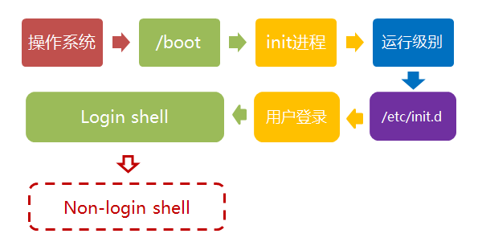

<!-- @import "[TOC]" {cmd="toc" depthFrom=1 depthTo=6 orderedList=false} -->

<!-- code_chunk_output -->

- [第一步、加载内核](#第一步-加载内核)
- [第二步、启动初始化进程](#第二步-启动初始化进程)
- [第三步、确定运行级别](#第三步-确定运行级别)
- [第五步、用户登录](#第五步-用户登录)
- [第六步、进入 login shell](#第六步-进入-login-shell)
- [第七步, 打开 non-login shell](#第七步-打开-non-login-shell)

<!-- /code_chunk_output -->

探讨操作系统接管硬件以后发生的事情, 也就是操作系统的启动流程.


下面的内容针对的是 Debian 发行版

## 第一步、加载内核

操作系统接管硬件以后, 首先读入 /boot 目录下的内核文件.


/boot 目录下面大概是这样一些文件:

```
$ ls /boot
　　
config-3.2.0-3-amd64
config-3.2.0-4-amd64
grub
initrd.img-3.2.0-3-amd64
initrd.img-3.2.0-4-amd64
System.map-3.2.0-3-amd64
System.map-3.2.0-4-amd64
vmlinuz-3.2.0-3-amd64
vmlinuz-3.2.0-4-amd64
```

## 第二步、启动初始化进程

内核文件加载以后, 就开始运行**第一个程序/sbin/init**, 它的作用是初始化系统环境.


由于 init 是第一个运行的程序, 它的**进程编号(pid)就是 1**. 其他所有进程都从它衍生, 都是它的子进程.

## 第三步、确定运行级别

许多程序需要开机启动. 它们在 Windows 叫做"服务"(service), 在 Linux 就叫做"[守护进程](http://zh.wikipedia.org/wiki/%E5%AE%88%E6%8A%A4%E8%BF%9B%E7%A8%8B)"(daemon).

init 进程的一大任务, 就是去**运行这些开机启动的程序**. 但是, 不同的场合需要启动不同的程序, 比如用作服务器时, 需要启动 Apache, 用作桌面就不需要. Linux 允许为不同的场合, 分配不同的开机启动程序, 这就叫做"运行级别"(runlevel). 也就是说, 启动时根据"[运行级别](http://zh.wikipedia.org/wiki/%E8%BF%90%E8%A1%8C%E7%BA%A7%E5%88%AB)", 确定要运行哪些程序.


Linux 预置七种运行级别(0-6). 一般来说, 0 是关机, 1 是单用户模式(也就是维护模式), 6 是重启. 运行级别 2-5, 各个发行版不太一样, 对于 Debian 来说, 都是同样的多用户模式(也就是正常模式).

init 进程首先读取**文件/etc/inittab**, 它是运行级别的设置文件. 如果你打开它, 可以看到第一行是这样的:

```
id:2:initdefault:
```

initdefault 的值是 2, 表明系统启动时的运行级别为 2. 如果需要**指定其他级别**, 可以**手动修改**这个值.

那么, 运行级别 2 有些什么程序呢, 系统怎么知道每个级别应该加载哪些程序呢?......回答是**每个运行级别在/etc 目录**下面, 都有一个对应的子目录, 指定**要加载的程序**.

```
/etc/rc0.d
/etc/rc1.d
/etc/rc2.d
/etc/rc3.d
/etc/rc4.d
/etc/rc5.d
/etc/rc6.d
```

上面目录名中的"**rc**", 表示**run command**(运行程序), 最后的**d 表示 directory**(目录). 下面让我们看看 /etc/rc2.d 目录中到底指定了哪些程序.

```
$ ls  /etc/rc2.d
　　
README
S01motd
S13rpcbind
S14nfs-common
S16binfmt-support
S16rsyslog
S16sudo
S17apache2
S18acpid
...
```

可以看到, 除了第一个文件 README 以外, 其他文件名都是"**字母 S+两位数字+程序名**"的形式. **字母 S 表示 Start**, 也就是启动的意思(启动脚本的运行参数为 start), 如果这个位置是**字母 K, 就代表 Kill**(关闭), 即如果从其他运行级别切换过来, 需要关闭的程序(启动脚本的运行参数为 stop). 后面的**两位数字表示处理顺序**, 数字越小越早处理, 所以第一个启动的程序是 motd, 然后是 rpcbing、nfs......**数字相同时**, 则按照**程序名的字母顺序启动**, 所以 rsyslog 会先于 sudo 启动.

这个目录里的所有文件(除了 README), 就是启动时要加载的程序. 如果想增加或删除某些程序, 不建议手动修改/etc/rcN.d 目录, 最好是用一些专门命令进行管理(参考[这里](http://www.debianadmin.com/manage-linux-init-or-startup-scripts.html)和[这里](http://www.debianadmin.com/remove-unwanted-startup-files-or-services-in-debian.html)).

前面提到, 七种预设的"运行级别"各自有一个目录, 存放需要开机启动的程序. 不难想到, 如果多个"运行级别"需要启动同一个程序, 那么这个程序的启动脚本, 就会在每一个目录里都有一个拷贝. 这样会造成管理上的困扰: 如果要修改启动脚本, 岂不是每个目录都要改一遍?

Linux 的解决办法, 就是七个 /etc/rcN.d 目录里列出的程序, 都设为链接文件, 指向另外一个目录 /etc/init.d , 真正的启动脚本都统一放在这个目录中. init 进程逐一加载开机启动程序, 其实就是运行这个目录里的启动脚本.


下面就是链接文件真正的指向.

```
$ ls -l /etc/rc2.d
　　
README
S01motd -> ../init.d/motd
S13rpcbind -> ../init.d/rpcbind
S14nfs-common -> ../init.d/nfs-common
S16binfmt-support -> ../init.d/binfmt-support
S16rsyslog -> ../init.d/rsyslog
S16sudo -> ../init.d/sudo
S17apache2 -> ../init.d/apache2
S18acpid -> ../init.d/acpid
```

这样做的另一个好处, 就是如果你要手动关闭或重启某个进程, 直接到目录 /etc/init.d 中寻找启动脚本即可. 比如, 我要重启 Apache 服务器, 就运行下面的命令:

```
$ sudo /etc/init.d/apache2 restart
```

/etc/init.d 这个目录名最后一个字母 d, 是 directory 的意思, 表示这是一个目录, 用来与程序 /etc/init 区分.

## 第五步、用户登录

开机启动程序加载完毕以后, 就要让用户登录了.


一般来说, 用户的登录方式有三种:

(1)命令行登录

(2)ssh 登录

(3)图形界面登录

这三种情况, 都有自己的方式对用户进行认证.

(1)命令行登录: init 进程调用 getty 程序(意为 get teletype), 让用户输入用户名和密码. 输入完成后, 再调用 login 程序, 核对密码(Debian 还会再多运行一个身份核对程序/etc/pam.d/login). 如果密码正确, 就从文件 /etc/passwd 读取该用户指定的 shell, 然后启动这个 shell.

(2)ssh 登录: 这时系统调用 sshd 程序(Debian 还会再运行/etc/pam.d/ssh ), 取代 getty 和 login, 然后启动 shell.

(3)图形界面登录: init 进程调用显示管理器, Gnome 图形界面对应的显示管理器为 gdm(GNOME Display Manager), 然后用户输入用户名和密码. 如果密码正确, 就读取/etc/gdm3/Xsession, 启动用户的会话.

## 第六步、进入 login shell

所谓 shell, 简单说就是命令行界面, 让用户可以直接与操作系统对话. 用户登录时打开的 shell, 就叫做 login shell.


Debian 默认的 shell 是 Bash, 它会读入一系列的配置文件. 上一步的三种情况, 在这一步的处理, 也存在差异.

(1)命令行登录: 首先读入 /etc/profile, 这是对所有用户都有效的配置; 然后依次寻找下面三个文件, 这是针对当前用户的配置.

```
~/.bash_profile
~/.bash_login
~/.profile
```

需要注意的是, 这三个文件只要有一个存在, 就不再读入后面的文件了. 比如, 要是 \~/.bash_profile 存在, 就不会再读入后面两个文件了.

(2)ssh 登录: 与第一种情况完全相同.

(3)图形界面登录: 只加载 /etc/profile 和 \~/.profile. 也就是说, \~/.bash_profile 不管有没有, 都不会运行.

## 第七步, 打开 non-login shell

老实说, 上一步完成以后, Linux 的启动过程就算结束了, 用户已经可以看到命令行提示符或者图形界面了. 但是, 为了内容的完整, 必须再介绍一下这一步.

用户进入操作系统以后, 常常会再手动开启一个 shell. 这个 shell 就叫做 non-login shell, 意思是它不同于登录时出现的那个 shell, 不读取/etc/profile 和.profile 等配置文件.



non-login shell 的重要性, 不仅在于它是用户最常接触的那个 shell, 还在于它会读入用户自己的 bash 配置文件 \~/.bashrc. 大多数时候, 我们对于 bash 的定制, 都是写在这个文件里面的.

你也许会问, 要是不进入 non-login shell, 岂不是.bashrc 就不会运行了, 因此 bash 也就不能完成定制了?事实上, Debian 已经考虑到这个问题了, 请打开文件 \~/.profile, 可以看到下面的代码:

```
if [ -n "$BASH_VERSION" ]; then
　　if [ -f "$HOME/.bashrc" ]; then
　　　　. "$HOME/.bashrc"
　　fi
fi
```

上面代码先判断变量 $BASH_VERSION 是否有值, 然后判断主目录下是否存在 .bashrc 文件, 如果存在就运行该文件. 第三行开头的那个点, 是 source 命令的简写形式, 表示运行某个文件, 写成"source ~/.bashrc"也是可以的.

因此, 只要运行~/.profile 文件, ~/.bashrc 文件就会连带运行. 但是上一节的第一种情况提到过, 如果存在~/.bash\_profile 文件, 那么有可能不会运行~/.profile 文件. 解决这个问题很简单, 把下面代码写入.bash\_profile 就行了.

```
if [ -f ~/.profile ]; then
　　. ~/.profile
fi
```

这样一来, 不管是哪种情况, .bashrc 都会执行, 用户的设置可以放心地都写入这个文件了.

Bash 的设置之所以如此繁琐, 是由于历史原因造成的. 早期的时候, 计算机运行速度很慢, 载入配置文件需要很长时间, Bash 的作者只好把配置文件分成了几个部分, 阶段性载入. 系统的通用设置放在 /etc/profile, 用户个人的、需要被所有子进程继承的设置放在.profile, 不需要被继承的设置放在.bashrc.

顺便提一下, 除了 Linux 以外,  Mac OS X 使用的 shell 也是 Bash. 但是, 它只加载.bash\_profile, 然后在.bash_profile 里面调用.bashrc. 而且, 不管是 ssh 登录, 还是在图形界面里启动 shell 窗口, 都是如此.

参考链接

[1] Debian Wiki, [Environment Variables](https://wiki.debian.org/EnvironmentVariables)

[2] Debian Wiki, [Dot Files](https://wiki.debian.org/DotFiles)

[3] Debian Administration, [An introduction to run-levels](http://www.debian-administration.org/articles/212)

[4] Debian Admin, [Debian and Ubuntu Linux Run Levels](http://www.debianadmin.com/debian-and-ubuntu-linux-run-levels.html)

[5] Linux Information Project (LINFO), [Runlevel Definition](http://www.linfo.org/runlevel_def.html)

[6] LinuxQuestions.org, [What are run levels](http://wiki.linuxquestions.org/wiki/Run_Levels)?

[7] Dalton Hubble, [Bash Configurations Demystified](http://dghubble.com/.bashprofile-.profile-and-.bashrc-conventions.html)