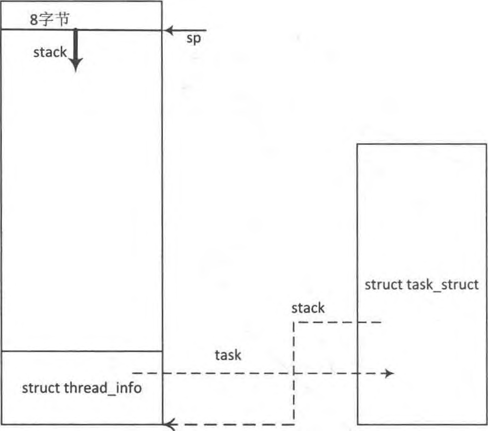
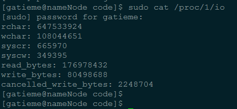

<!-- @import "[TOC]" {cmd="toc" depthFrom=1 depthTo=6 orderedList=false} -->

<!-- code_chunk_output -->

- [进程状态](#进程状态)
  - [1.1 5 个互斥状态](#11-5-个互斥状态)
  - [1.2 2 个终止状态](#12-2-个终止状态)
  - [1.3 新增睡眠状态](#13-新增睡眠状态)
    - [1.3.1 内核如何将进程置为睡眠状态](#131-内核如何将进程置为睡眠状态)
- [2 进程标识符(PID)](#2-进程标识符pid)
- [3 进程内核栈](#3-进程内核栈)
  - [3.1 内核栈与线程描述符](#31-内核栈与线程描述符)
  - [3.2 内核栈数据结构描述 thread\_info 和 thread\_union](#32-内核栈数据结构描述-thread_info-和-thread_union)
  - [3.3 获取当前在 CPU 上正在运行进程的 thread\_info](#33-获取当前在-cpu-上正在运行进程的-thread_info)
  - [3.4 分配和销毁 thread\_info](#34-分配和销毁-thread_info)
- [4 进程标记](#4-进程标记)
- [5 表示进程亲属关系的成员](#5-表示进程亲属关系的成员)
- [6 ptrace 系统调用](#6-ptrace-系统调用)
- [7 Performance Event](#7-performance-event)
- [8 进程调度](#8-进程调度)
  - [8.1 优先级](#81-优先级)
  - [8.2 调度策略相关字段](#82-调度策略相关字段)
  - [8.3 调度策略](#83-调度策略)
  - [8.4 调度类](#84-调度类)
- [9 进程地址空间](#9-进程地址空间)
- [10 判断标志](#10-判断标志)
- [11 时间](#11-时间)
- [12 信号处理](#12-信号处理)
- [13 其他](#13-其他)

<!-- /code_chunk_output -->

进程是处于**执行期的程序**以及它**所管理的资源**(如打开的文件、挂起的信号、进程状态、地址空间等等)的总称. 注意, 程序并不是进程, 实际上两个或多个进程不仅有可能执行同一程序, 而且还有可能共享地址空间等资源.

Linux 内核通过一个被称为进程描述符的[task\_struct](http://lxr.free-electrons.com/source/include/linux/sched.h#L1389)结构体来管理进程, 这个结构体包含了一个进程所需的所有信息. 它定义在[include/linux/sched.h](http://lxr.free-electrons.com/source/include/linux/sched.h)文件中.

谈到 task\_struct 结构体, 可以说她是 linux 内核源码中**最复杂的一个结构体**了, 成员之多, 占用内存之大.

鉴于她的复杂, 我们不能简单的亵渎, 而是要深入"窥探".

下面来慢慢介绍这些复杂成员

# 进程状态

```c
volatile long state;    /* -1 unrunnable, 0 runnable, >0 stopped */
```

[state](http://lxr.free-electrons.com/source/include/linux/sched.h?v=4.5#L1390)成员的可能取值如下

>参见 http://lxr.free-electrons.com/source/include/linux/sched.h?v=4.5#L207

```

 /*
  * Task state bitmask. NOTE! These bits are also
  * encoded in fs/proc/array.c: get_task_state().
  *
  * We have two separate sets of flags: task->state
  * is about runnability, while task->exit_state are
  * about the task exiting. Confusing, but this way
  * modifying one set can't modify the other one by
  * mistake.
  */
 #define TASK_RUNNING            0
 #define TASK_INTERRUPTIBLE      1
 #define TASK_UNINTERRUPTIBLE    2
 #define __TASK_STOPPED          4
 #define __TASK_TRACED           8

/* in tsk->exit_state */
 #define EXIT_DEAD               16
 #define EXIT_ZOMBIE             32
 #define EXIT_TRACE              (EXIT_ZOMBIE | EXIT_DEAD)

/* in tsk->state again */
 #define TASK_DEAD               64
 #define TASK_WAKEKILL           128 /** wake on signals that are deadly **/
 #define TASK_WAKING             256
 #define TASK_PARKED             512
 #define TASK_NOLOAD             1024
 #define TASK_STATE_MAX          2048

 /* Convenience macros for the sake of set_task_state */
#define TASK_KILLABLE           (TASK_WAKEKILL | TASK_UNINTERRUPTIBLE)
#define TASK_STOPPED            (TASK_WAKEKILL | __TASK_STOPPED)
#define TASK_TRACED             (TASK_WAKEKILL | __TASK_TRACED)

```

## 1.1 5 个互斥状态

state 域能够取 5 个互为排斥的值(通俗一点就是这五个值任意两个不能一起使用, 只能单独使用). 系统中的每个进程都必然处于以上所列进程状态中的一种.

| 状态| 描述 |
| ---- |:----|
| TASK\_RUNNING | 表示进程要么**正在执行**, 要么正要**准备执行**(已经就绪), 正在等待 cpu 时间片的调度 |
| TASK\_INTERRUPTIBLE | **阻塞态**.进程因为**等待一些条件**而**被挂起(阻塞**)而**所处的状态**. 这些条件主要包括: **硬中断、资源、一些信号**......, **一旦等待的条件成立**, 进程就会从该状态(阻塞)迅速**转化成为就绪状态 TASK\_RUNNING** |
| TASK\_UNINTERRUPTIBLE | 意义与 TASK\_INTERRUPTIBLE 类似, 除了**不能通过接受一个信号来唤醒**以外, 对于处于 TASK\_UNINTERRUPIBLE 状态的进程, 哪怕我们**传递一个信号或者有一个外部中断都不能唤醒他们**. **只有它所等待的资源可用**的时候, 他才会被唤醒. 这个标志很少用, 但是并不代表没有任何用处, 其实他的作用非常大, 特别是对于驱动刺探相关的硬件过程很重要, 这个刺探过程不能被一些其他的东西给中断, 否则就会让进城进入不可预测的状态 |
| TASK\_STOPPED | 进程被**停止执行**, 当进程接收到**SIGSTOP、SIGTTIN、SIGTSTP 或者 SIGTTOU 信号**之后就会进入该状态 |
| TASK\_TRACED | 表示**进程被 debugger 等进程监视**, 进程执行被调试程序所停止, 当一个进程被另外的进程所监视, 每一个信号都会让进城进入该状态 |

## 1.2 2 个终止状态

其实还有**两个附加的进程状态**既可以**被添加到 state 域**中, 又可以被添加到**exit\_state**域中. 只有**当进程终止**的时候, 才会达到这两种状态.

```c
/* task state */
int exit_state;
int exit_code, exit_signal;
```

| 状态| 描述 |
| ----- |:------|
| **EXIT\_ZOMBIE** | 进程的执行被终止, 但是其**父进程还没有使用 wait()等系统调用来获知它的终止信息**, 此时进程成为**僵尸进程** |
| EXIT\_DEAD | 进程的**最终状态** |

而 int exit\_code, exit\_signal;我们会在后面进程介绍

## 1.3 新增睡眠状态

>参见
>
>[TASK\_KILLABLE: Linux 中的新进程状态](http://www.ibm.com/developerworks/cn/linux/l-task-killable/index.html)

如前所述, 进程状态**TASK\_UNINTERRUPTIBLE 和 TASK\_INTERRUPTIBLE 都是睡眠状态**. 现在, 我们来看看内核如何将进程置为睡眠状态.

### 1.3.1 内核如何将进程置为睡眠状态

Linux 内核提供了**两种方法**将进程置为**睡眠状态**.

将进程置为睡眠状态的**普通方法**是将**进程状态设置**为 TASK\_INTERRUPTIBLE 或 TASK\_UNINTERRUPTIBLE 并**调用调度程序的 schedule**()函数. 这样会**将进程从 CPU 运行队列中移除**.

- 如果进程处于**可中断模式的睡眠状态**(通过将其状态设置为**TASK\_INTERRUPTIBLE**), 那么可以通过**显式的唤醒呼叫**(wakeup\_process())或**需要处理的信号来唤醒**它.

- 但是, 如果进程处于**非可中断模式的睡眠状态**(通过将其状态设置为**TASK\_UNINTERRUPTIBLE**), 那么**只能通过显式的唤醒呼叫**将其唤醒. 除非万不得已, 否则我们**建议将进程置为可中断睡眠模式**, 而不是不可中断睡眠模式(比如说在设备 I/O 期间, 处理信号非常困难时).

当处于**可中断睡眠模式的任务接收到信号**时, 它**需要处理该信号(除非它已被屏蔽**), 离开之前正在处理的任务(此处需要**清除**代码), 并**将-EINTR**返回给**用户空间**. 再一次, **检查这些返回代码和采取适当操作**的工作将由程序员完成.

因此, 懒惰的程序员可能比较喜欢将进程置为不可中断模式的睡眠状态, 因为信号不会唤醒这类任务.

但需要注意的一种情况是, 对**不可中断睡眠模式的进程**的**唤醒呼叫**可能会由于某些原因**不会发生**, 这会使**进程无法被终止**, 从而最终引发问题, 因为惟一的解决方法就是重启系统. 一方面, 您需要考虑一些细节, 因为不这样做会在内核端和用户端引入 bug. 另一方面, 您可能会生成永远不会停止的进程(**被阻塞且无法终止的进程**).

现在, 我们在内核中实现了一种**新的睡眠方法**

Linux Kernel 2.6.25 引入了一种新的进程睡眠状态,

| 状态| 描述 |
| ------------- |:-------------:|
| TASK\_KILLABLE | 当进程处于这种**可以终止的新睡眠状态**中, 它的运行原理类似于 TASK\_UNINTERRUPTIBLE, 只不过**可以响应致命信号** |

它定义如下:

```c
#define TASK_WAKEKILL           128 /** wake on signals that are deadly **/

/* Convenience macros for the sake of set_task_state */
#define TASK_KILLABLE           (TASK_WAKEKILL | TASK_UNINTERRUPTIBLE)
#define TASK_STOPPED            (TASK_WAKEKILL | __TASK_STOPPED)
#define TASK_TRACED             (TASK_WAKEKILL | __TASK_TRACED)
```

换句话说, TASK\_UNINTERRUPTIBLE + TASK\_WAKEKILL = TASK\_KILLABLE.

而 TASK\_WAKEKILL 用于在**接收到致命信号时唤醒进程**

新的睡眠状态允许 TASK\_UNINTERRUPTIBLE 响应致命信号

进程状态的切换过程和原因大致如下图


# 2 进程标识符(PID)

```c
pid_t pid;
pid_t tgid;
```

Unix 系统通过**pid 来标识进程**, linux 把不同的 pid 与系统中每个进程或轻量级线程关联, 而**unix**程序员希望**同一组线程具有共同的 pid**, 遵照这个标准 linux 引入线程组的概念. 一个**线程组所有线程**与**领头线程**具有**相同的 pid**, 存入**tgid**字段, **getpid()返回当前进程的 tgid 值而不是 pid 的值(！！！**).

在**CONFIG\_BASE\_SMALL 配置为 0**的情况下, **PID 的取值范围是 0 到 32767**, 即系统中的**进程数最大为 32768 个**.

```cpp
#define PID_MAX_DEFAULT (CONFIG_BASE_SMALL ? 0x1000 : 0x8000)
```

>参见 http://lxr.free-electrons.com/source/include/linux/threads.h#L27

在 Linux 系统中, 一个线程组中的所有线程使用和该线程组的领头线程(该组中的第一个轻量级进程)相同的 PID, 并被存放在**tgid 成员**中. 只有**线程组的领头线程**的**pid**成员才会被设置为**与 tgid 相同**的值. 注意, getpid()系统调用返回的是当前进程的 tgid 值而不是 pid 值.

# 3 进程内核栈

```c
void *stack;
```

## 3.1 内核栈与线程描述符

对**每个进程**, Linux 内核都把**两个不同的数据结构紧凑**的存放在一个**单独为进程分配的内存区域**中

- 一个是**内核态**的**进程堆栈**,

- 另一个是紧挨着**进程描述符**的小数据结构 thread\_info, 叫做**线程描述符**.

Linux 把**thread\_info**(线程描述符)和**内核态**的**线程堆栈**存放在一起, **这块区域**通常是 8192Byte(占**两个页框**), 其实地址必须是 8192 的整数倍.

在 linux/arch/x86/include/asm/page\_32\_types.h 中,

```c
#define THREAD_SIZE_ORDER    1
#define THREAD_SIZE        (PAGE_SIZE << THREAD_SIZE_ORDER)
```

出于效率考虑, 内核让这 8K 空间占据连续的两个页框并让第一个页框的起始地址是 213 的倍数.

**内核态的进程**访问处于**内核数据段的栈**, 这个栈**不同于**用户态的进程所用的栈.

**用户态进程**所用的**栈**, 是在进程**线性地址空间**中;

而**内核栈**是当进程**从用户空间进入内核空间**时, **特权级发生变化**, 需要**切换堆栈**, 那么内核空间中使用的就是这个内核栈. 因为内核控制路径使用**很少的栈空间**, 所以**只需要几千个字节的内核态堆栈**.

>需要注意的是, **内核态堆栈**仅用于**内核例程**, Linux 内核另外为中断提供了单独的**硬中断栈**和**软中断栈**

下图中显示了在**物理内存**中存放**两种数据结构**的方式. 线程描述符驻留与这个内存区的开始, 而栈顶末端向下增长.  下图摘自 ULK3,进程内核栈与进程描述符的关系如下图:





但是较新的内核代码中, **进程描述符 task\_struct**结构中**没有直接指向 thread\_info 结构的指针**, 而是用一个**void 指针类型**的成员表示, 然后通过**类型转换来访问 thread\_info 结构**.

相关代码在[include/linux/sched.h](http://lxr.free-electrons.com/source/include/linux/sched.h?v=4.5#L2812)中

```c
#define task_thread_info(task)  ((struct thread_info *)(task)->stack)
```

在这个图中, esp 寄存器是 CPU 栈指针, 用来存放栈顶单元的地址. 在 80x86 系统中, 栈起始于顶端, 并朝着这个内存区开始的方向增长. 从用户态刚切换到内核态以后, 进程的内核栈总是空的. 因此, esp 寄存器指向这个栈的顶端. 一旦数据写入堆栈, esp 的值就递减.

## 3.2 内核栈数据结构描述 thread\_info 和 thread\_union

**thread\_info 是体系结构相关**的, 结构的定义在[thread_info.h](http://lxr.free-electrons.com/ident?v=4.5;i=thread_info)中

| 架构 | 定义链接 |
| ------------- |:-------------|
| x86 | [linux-4.5/arch/x86/include/asm/thread_info.h, line 55](http://lxr.free-electrons.com/source/arch/x86/include/asm/thread_info.h?v=4.5#L55) |
| arm | [linux-4.5arch/arm/include/asm/thread_info.h, line 49](http://lxr.free-electrons.com/source/arch/arm/include/asm/thread_info.h#L49)
| arm64 | [linux/4.5/arch/arm64/include/asm/thread_info.h, line 47](http://lxr.free-electrons.com/source/arch/arm64/include/asm/thread_info.h#L47) |

Linux 内核中使用一个**联合体**来表示一个**进程的线程描述符**和**内核栈**:

```c
union thread_union
{
 struct thread_info thread_info;
 unsigned long stack[THREAD_SIZE/sizeof(long)];
};
```

## 3.3 获取当前在 CPU 上正在运行进程的 thread\_info

下面来说说如何通过**esp 栈指针**来获取当前在 CPU 上**正在运行进程的 thread\_info**结构.

实际上, 上面提到, **thread\_info**结构和**内核态堆栈**是紧密结合在一起的, 占据**两个页框的物理内存空间**. 而且, 这**两个页框的起始起始地址是 213 对齐**的.

早期的版本中, 不需要对 64 位处理器的支持, 所以, 内核通过简单的屏蔽掉 esp 的低 13 位有效位就可以获得 thread\_info 结构的基地址了.

我们在下面对比了, 获取正在运行的进程的 thread_info 的实现方式

| 架构 | 版本 | 定义链接 | 实现方式 | 思路解析 |
| ------------- |:-------------:|:-------------:|:-------------:|:-------------:|
| x86 | [3.14](http://lxr.free-electrons.com/ident?v=3.14;i=current_thread_info)   | [current_thread_info(void)](http://lxr.free-electrons.com/source/arch/x86/include/asm/thread_info.h#L164) |return (struct thread_info *)(sp & ~(THREAD_SIZE - 1)); | 屏蔽了 esp 的低十三位, 最终得到的是 thread_info 的地址 |
| x86 | [3.15](http://lxr.free-electrons.com/ident?v=3.15;i=current_thread_info) | [current_thread_info(void)](http://lxr.free-electrons.com/source/arch/x86/include/asm/thread_info.h?v=3.15#L163) | ti = (void *)(this_cpu_read_stable(kernel_stack) + KERNEL_STACK_OFFSET - THREAD_SIZE); |
| x86 | [4.1](http://lxr.free-electrons.com/ident?v=4.1&i=current_thread_info) | [current_thread_info(void)](http://lxr.free-electrons.com/source/arch/x86/include/asm/thread_info.h?v=4.1#L182) |  (struct thread\_info *)(current\_top\_of\_stack() \- THREAD\_SIZE);

>**早期版本**
>
>当前的栈指针(current\_stack\_pointer == sp)就是 esp,
>
>THREAD\_SIZE 为 8K, 二进制的表示为 0000 0000 0000 0000 0010 0000 0000 0000.
>
>\~(THREAD\_SIZE\-1)的结果刚好为 1111 1111 1111 1111 1110 0000 0000 0000, 第十三位是全为零, 也就是刚好屏蔽了 esp 的低十三位, 最终得到的是 thread\_info 的地址.

进程最常用的是进程描述符结构 task\_struct 而不是 thread\_info 结构的地址. 为了获取当前 CPU 上运行进程的 task\_struct 结构, 内核提供了 current 宏, 由于 task\_struct \*task 在 thread\_info 的起始位置, 该宏本质上等价于 current\_thread\_info()\->task, 在[include/asm-generic/current.h](http://lxr.free-electrons.com/source/include/asm-generic/current.h?v=4.5#L6)中定义:
```c
#define get_current() (current_thread_info()->task)
#define current get_current()
```

这个定义是体系结构无关的, 当然 linux 也为各个体系结构定义了更加方便或者快速的 current

>>请参见 : http://lxr.free-electrons.com/ident?v=4.5;i=current

## 3.4 分配和销毁 thread\_info

进程通过**alloc\_thread\_info\_node**()函数**分配它的内核栈**, 通过**free\_thread\_info**()函数释放所分配的内核栈.

```c
# if THREAD_SIZE >= PAGE_SIZE
static struct thread_info *alloc_thread_info_node(struct task_struct *tsk,
                          int node)
{
    struct page *page = alloc_kmem_pages_node(node, THREADINFO_GFP,
                          THREAD_SIZE_ORDER);

    return page ? page_address(page) : NULL;
}

static inline void free_thread_info(struct thread_info *ti)
{
    free_kmem_pages((unsigned long)ti, THREAD_SIZE_ORDER);
}
# else
static struct kmem_cache *thread_info_cache;

static struct thread_info *alloc_thread_info_node(struct task_struct *tsk,
                          int node)
{
    return kmem_cache_alloc_node(thread_info_cache, THREADINFO_GFP, node);
}

static void free_thread_info(struct thread_info *ti)
{
    kmem_cache_free(thread_info_cache, ti);
}
```

其中, [THREAD\_SIZE\_ORDER](http://lxr.free-electrons.com/ident?v=4.5;i=THREAD_SIZE_ORDER)宏的定义请查看

| 架构 | 版本 | 定义链接 | 实现方式 | 思路解析 |
| ------------- |:-------------|:-------------|:-------------|:-------------|
| x86 | 4.5 | [arch/x86/include/asm/page_32_types.h, line 20](http://lxr.free-electrons.com/source/arch/x86/include/asm/page_32_types.h?v=4.5#L20) | #define THREAD\_SIZE\_ORDER       1 | \_\_get\_free\_pages 函数分配 2 个页的内存(它的首地址是 8192 字节对齐的)|
| x86\_64 | 4.5 | [arch/x86/include/asm/page_64_types.h, line 10](http://lxr.free-electrons.com/source/arch/x86/include/asm/page_64_types.h?v=4.5#L10)|#define THREAD\_SIZE\_ORDER       (2 + KASAN\_STACK\_ORDER)

# 4 进程标记

```
unsigned int flags; /* per process flags, defined below */
```

反应**进程状态的信息**, 但**不是运行状态**, 用于**内核识别进程当前的状态**, 以备下一步操作

flags 成员的可能取值如下, 这些宏以 PF(ProcessFlag)开头

>参见
>
>http://lxr.free-electrons.com/source/include/linux/sched.h?v4.5#L2083
>
>例如
>PF_FORKNOEXEC       进程刚创建, 但还没执行.
>PF_SUPERPRIV         超级用户特权.
>PF_DUMPCORE         dumped core.
>PF_SIGNALED          进程被信号(signal)杀出.
>PF_EXITING            进程开始关闭.
>
```c
 /*
* Per process flags
*/
#define PF_EXITING      0x00000004      /* getting shut down */
#define PF_EXITPIDONE   0x00000008      /* pi exit done on shut down */
#define PF_VCPU         0x00000010      /* I'm a virtual CPU */
#define PF_WQ_WORKER    0x00000020      /* I'm a workqueue worker */
#define PF_FORKNOEXEC   0x00000040      /* forked but didn't exec */
#define PF_MCE_PROCESS  0x00000080      /* process policy on mce errors */
#define PF_SUPERPRIV    0x00000100      /* used super-user privileges */
#define PF_DUMPCORE     0x00000200      /* dumped core */
#define PF_SIGNALED     0x00000400      /* killed by a signal */
#define PF_MEMALLOC     0x00000800      /* Allocating memory */
#define PF_NPROC_EXCEEDED 0x00001000    /* set_user noticed that RLIMIT_NPROC was exceeded */
#define PF_USED_MATH    0x00002000      /* if unset the fpu must be initialized before use */
#define PF_USED_ASYNC   0x00004000      /* used async_schedule*(), used by module init */
#define PF_NOFREEZE     0x00008000      /* this thread should not be frozen */
#define PF_FROZEN       0x00010000      /* frozen for system suspend */
#define PF_FSTRANS      0x00020000      /* inside a filesystem transaction */
#define PF_KSWAPD       0x00040000      /* I am kswapd */
#define PF_MEMALLOC_NOIO 0x00080000     /* Allocating memory without IO involved */
#define PF_LESS_THROTTLE 0x00100000     /* Throttle me less: I clean memory */
#define PF_KTHREAD      0x00200000      /* I am a kernel thread */
#define PF_RANDOMIZE    0x00400000      /* randomize virtual address space */
#define PF_SWAPWRITE    0x00800000      /* Allowed to write to swap */
#define PF_NO_SETAFFINITY 0x04000000    /* Userland is not allowed to meddle with cpus_allowed */
#define PF_MCE_EARLY    0x08000000      /* Early kill for mce process policy */
#define PF_MUTEX_TESTER 0x20000000      /* Thread belongs to the rt mutex tester */
#define PF_FREEZER_SKIP 0x40000000      /* Freezer should not count it as freezable */
#define PF_SUSPEND_TASK 0x80000000      /* this thread called freeze_processes and should not be frozen */
```

# 5 表示进程亲属关系的成员

```c
struct task_struct __rcu *real_parent; /* real parent process */
struct task_struct __rcu *parent; /* recipient of SIGCHLD, wait4() reports */

struct list_head children;      /* list of my children */
struct list_head sibling;       /* linkage in my parent's children list */
struct task_struct *group_leader;       /* threadgroup leader */
```

 在 Linux 系统中, 所有进程之间都有着直接或间接地联系, 每个进程都有其父进程, 也可能有零个或多个子进程. 拥有**同一父进程的所有进程具有兄弟关系**.

| 字段 | 描述 |
| ------------- |:-------------:|
| real\_parent | 指向其父进程, 如果创建它的**父进程不再存在**, 则指向**PID 为 1 的 init 进程** |
| parent | 指向其父进程, **当它终止时, 必须向它的父进程发送信号**. 它的值通常与 real\_parent 相同 |
| children | 表示**链表的头部**, 链表中的**所有元素**都是它的**子进程** |
| sibling | 用于**把当前进程插入到兄弟链表**中 |
| group\_leader | 指向其所在**进程组的领头进程** |

# 6 ptrace 系统调用

ptrace 提供了一种**父进程可以控制子进程运行**, 并可以检查和改变它的核心 image.

它主要用于**实现断点调试**. 一个被跟踪的进程运行中, 直到发生一个**信号**,则**进程被中止**, 并且**通知其父进程**. 在**进程中止的状态**下, 进程的**内存空间可以被读写**. 父进程还可以使子进程继续执行, 并选择是否是否忽略引起中止的信号.

```c
unsigned int ptrace;
struct list_head ptraced;
struct list_head ptrace_entry;

unsigned long ptrace_message;
siginfo_t *last_siginfo; /* For ptrace use.  */
```

成员**ptrace 被设置为 0**时表示**不需要被跟踪**, 它的可能取值如下:

>参见
>
>http://lxr.free-electrons.com/source/include/linux/ptrace.h?v=4.5#L20

```c
/*
 * Ptrace flags
 *
 * The owner ship rules for task->ptrace which holds the ptrace
 * flags is simple.  When a task is running it owns it's task->ptrace
 * flags.  When the a task is stopped the ptracer owns task->ptrace.
 */

#define PT_SEIZED       0x00010000      /* SEIZE used, enable new behavior */
#define PT_PTRACED      0x00000001
#define PT_DTRACE       0x00000002      /* delayed trace (used on m68k, i386) */
#define PT_PTRACE_CAP   0x00000004      /* ptracer can follow suid-exec */

#define PT_OPT_FLAG_SHIFT       3
/* PT_TRACE_* event enable flags */
#define PT_EVENT_FLAG(event)    (1 << (PT_OPT_FLAG_SHIFT + (event)))
#define PT_TRACESYSGOOD         PT_EVENT_FLAG(0)
#define PT_TRACE_FORK           PT_EVENT_FLAG(PTRACE_EVENT_FORK)
#define PT_TRACE_VFORK          PT_EVENT_FLAG(PTRACE_EVENT_VFORK)
#define PT_TRACE_CLONE          PT_EVENT_FLAG(PTRACE_EVENT_CLONE)
#define PT_TRACE_EXEC           PT_EVENT_FLAG(PTRACE_EVENT_EXEC)
#define PT_TRACE_VFORK_DONE     PT_EVENT_FLAG(PTRACE_EVENT_VFORK_DONE)
#define PT_TRACE_EXIT           PT_EVENT_FLAG(PTRACE_EVENT_EXIT)
#define PT_TRACE_SECCOMP        PT_EVENT_FLAG(PTRACE_EVENT_SECCOMP)

#define PT_EXITKILL             (PTRACE_O_EXITKILL << PT_OPT_FLAG_SHIFT)
#define PT_SUSPEND_SECCOMP      (PTRACE_O_SUSPEND_SECCOMP << PT_OPT_FLAG_SHIFT)

/* single stepping state bits (used on ARM and PA-RISC) */
#define PT_SINGLESTEP_BIT       31
#define PT_SINGLESTEP           (1<<PT_SINGLESTEP_BIT)
#define PT_BLOCKSTEP_BIT        30
#define PT_BLOCKSTEP            (1<<PT_BLOCKSTEP_BIT)
```

# 7 Performance Event

Performance Event 是一款随 Linux 内核代码一同发布和维护的**性能诊断工具**. 这些成员用于帮助 PerformanceEvent 分析进程的性能问题.

```
#ifdef CONFIG_PERF_EVENTS
    struct perf_event_context *perf_event_ctxp[perf_nr_task_contexts];
    struct mutex perf_event_mutex;
    struct list_head perf_event_list;
#endif
```

关于 Performance Event 工具的介绍可参考文章 http://www.ibm.com/developerworks/cn/linux/l-cn-perf1/index.html?ca=drs-#major1 和 http://www.ibm.com/developerworks/cn/linux/l-cn-perf2/index.html?ca=drs-#major1.

# 8 进程调度

## 8.1 优先级

```c
int prio, static_prio, normal_prio;
unsigned int rt_priority;
```

| 字段 | 描述 |
| ------------- |:-------------:|
| static\_prio | 用于保存**静态优先级**, 可以通过**nice 系统调用**来进行修改 |
| rt\_priority | 用于保存**实时优先级** |
| normal\_prio | 值取决于**静态优先级和调度策略** |
| prio | 用于保存**动态优先级** |

**实时优先级**范围是 0 到 MAX\_RT\_PRIO\-1(即 99), 而**普通进程**的**静态优先级范围**是从**MAX\_RT\_PRIO 到 MAX\_PRIO-1(即 100 到 139**). **值越大静态优先级越低**.

```c
/*  http://lxr.free-electrons.com/source/include/linux/sched/prio.h#L21  */
#define MAX_USER_RT_PRIO    100
#define MAX_RT_PRIO     MAX_USER_RT_PRIO

/* http://lxr.free-electrons.com/source/include/linux/sched/prio.h#L24  */
#define MAX_PRIO        (MAX_RT_PRIO + 40)
#define DEFAULT_PRIO        (MAX_RT_PRIO + 20)
```

## 8.2 调度策略相关字段

```c
unsigned int policy;

const struct sched_class *sched_class;
struct sched_entity se;
struct sched_rt_entity rt;

cpumask_t cpus_allowed;
```

| 字段 | 描述 |
| ------------- |:-------------:|
| policy | **调度策略** |
| sched\_class | **调度类** |
| se | **普通进程**的调度实体, 每个进程都有其中之一的实体 |
| rt | **实时进程**的调度实体, 每个进程都有其中之一的实体 |
| cpus\_allowed | 用于控制进程可以在**哪些处理器**上运行 |

## 8.3 调度策略

**policy**表示进程的调度策略, 目前主要有以下五种:

>参见
>
>http://lxr.free-electrons.com/source/include/uapi/linux/sched.h?v=4.5#L36

```c
/*
* Scheduling policies
*/
#define SCHED_NORMAL            0
#define SCHED_FIFO              1
#define SCHED_RR                2
#define SCHED_BATCH             3
/* SCHED_ISO: reserved but not implemented yet */
#define SCHED_IDLE              5
#define SCHED_DEADLINE          6
```

| 字段 | 描述 | 所在调度器类 |
| ------------- |:-------------:|:-------------:|
| SCHED\_NORMAL | (也叫 SCHED\_OTHER)用于**普通进程**, 通过**CFS 调度器**实现. SCHED\_BATCH 用于**非交互的处理器消耗型进程**. SCHED\_IDLE 是在**系统负载很低**时使用 | CFS |
| SCHED\_BATCH |  SCHED\_NORMAL 普通进程策略的分化版本. 采用分时策略, 根据动态优先级(可用 nice()API 设置), 分配 CPU 运算资源. 注意: 这类进程比上述两类实时进程优先级低, 换言之, 在**有实时进程存在**时, **实时进程优先调度**. 但针对吞吐量优化 | CFS |
| SCHED\_IDLE | **优先级最低**, 在**系统空闲时才跑这类进程**(如利用闲散计算机资源跑地外文明搜索, 蛋白质结构分析等任务, 是此调度策略的适用者)| CFS |
| SCHED_FIFO | 先入先出调度算法(**实时调度策略**), **相同优先级的任务先到先服务, 高优先级的任务可以抢占低优先级的任务** | RT |
| SCHED\_RR | **轮流调度算法(实时调度策略**), 后者提供 Roound\-Robin 语义, 采用**时间片**, 相同优先级的任务当**用完时间片**会被放到**队列尾部**, 以保证公平性, 同样, 高优先级的任务可以抢占低优先级的任务. 不同要求的实时任务可以根据需要用 sched\_setscheduler()API 设置策略 | RT |
| SCHED\_DEADLINE | 新支持的**实时进程调度策略**, 针对**突发型计算**, 且对延迟和完成时间高度敏感的任务适用. 基于 Earliest Deadline First (EDF) 调度算法|

## 8.4 调度类

sched\_class 结构体表示调度类, 目前内核中有实现以下四种:

```c
extern const struct sched_class stop_sched_class;
extern const struct sched_class dl_sched_class;
extern const struct sched_class rt_sched_class;
extern const struct sched_class fair_sched_class;
extern const struct sched_class idle_sched_class;
```

| 调度器类 | 描述 |
| ------------- |:-------------|
| idle\_sched\_class | **每个 cup 的第一个 pid=0 线程**: swapper, 是一个**静态线程**. 调度类属于: idel\_sched\_class, 所以在**ps 里面是看不到**的. 一般运行在**开机过程和 cpu 异常的时候做 dump** |
| stop\_sched\_class | **优先级最高**的线程, 会**中断所有**其他线程, 且**不会被其他任务打断**. 作用: 1.发生在 cpu\_stop\_cpu\_callback 进行**cpu 之间任务 migration**; 2.**HOTPLUG\_CPU**的情况下关闭任务. |
| rt\_sched\_class | RT, 作用: 实时线程 |
| fair\_sched\_class | CFS(公平), 作用: 一般常规线程 |

目前系統中,Scheduling Class 的**优先级**顺序为**StopTask > RealTime > Fair > IdleTask**

**开发者**可以根据己的设计需求,來把**所属的 Task 配置到不同的 Scheduling Class**中.

# 9 进程地址空间

```c
struct mm_struct *mm, *active_mm;
/* per-thread vma caching */
u32 vmacache_seqnum;
struct vm_area_struct *vmacache[VMACACHE_SIZE];
#if defined(SPLIT_RSS_COUNTING)
struct task_rss_stat    rss_stat;
#endif

#ifdef CONFIG_COMPAT_BRK
unsigned brk_randomized:1;
#endif
```

| 字段 | 描述 |
| ------------- |:-------------|
| mm | 进程**所拥有的用户空间内存描述符(拥有的！！！**), **内核线程**无,mm 为**NULL** |
| active\_mm | active\_mm 指向**进程运行时所使用的内存描述符(使用的！！！内核线程不拥有用户空间内存,但是必须有使用的空间**), 对于**普通进程**而言, 这两个指针变量的值相同. 但是**内核线程 kernel thread 是没有进程地址空间**的, 所以**内核线程的 tsk->mm 域是空(NULL**). 但是**内核必须知道用户空间包含了什么**, 因此它的 active\_mm 成员被初始化为**前一个运行进程的 mm**值. |
| brk\_randomized| 用来确定**对随机堆内存的探测**. 参见[LKML]( http://lkml.indiana.edu/hypermail/linux/kernel/1104.1/00196.html)上的介绍 |
| rss\_stat | 用来**记录缓冲信息** |

>因此如果**当前内核线程**被**调度之前**运行的也是**另外一个内核线程**时候, 那么其**mm 和 avtive_mm 都是 NULL**

对 Linux 来说, 用户进程和内核线程(kernel thread)都是 task\_struct 的实例, 唯一的区别是**kernel thread**是**没有进程地址空间**的, **内核线程**也**没有 mm 描述符**的, 所以内核线程的 tsk\->mm 域是空(NULL). 内核 scheduler 在进程 context switching 的时候, 会**根据 tsk\->mm**判断即将调度的进程是**用户进程**还是**内核线程**. 但是虽然**thread thread**不用访问**用户进程地址空间**, 但是**仍然需要 page table**来访问**kernel 自己的空间**. 但是幸运的是, 对于**任何用户进程**来说, 他们的**内核空间都是 100%相同**的, 所以内核可以'borrow'上一个被调用的**用户进程的 mm 中的页表**来访问**内核地址**, 这个 mm 就记录在 active_mm.

简而言之就是, 对于 kernel thread,tsk\->mm == NULL 表示自己内核线程的身份, 而 tsk\->active\_mm 是借用上一个用户进程的 mm, 用 mm 的 page table 来访问内核空间. 对于**用户进程**, tsk\->mm == tsk\->active\_mm.

# 10 判断标志

```c
int exit_code, exit_signal;
int pdeath_signal;  /*  The signal sent when the parent dies  */
unsigned long jobctl;   /* JOBCTL_*, siglock protected */

/* Used for emulating ABI behavior of previous Linux versions */
unsigned int personality;

/* scheduler bits, serialized by scheduler locks */
unsigned sched_reset_on_fork:1;
unsigned sched_contributes_to_load:1;
unsigned sched_migrated:1;
unsigned :0; /* force alignment to the next boundary */

/* unserialized, strictly 'current' */
unsigned in_execve:1; /* bit to tell LSMs we're in execve */
unsigned in_iowait:1;
```

| 字段 | 描述 |
| ------------- |:-------------|
| exit\_code | 用于设置**进程的终止代号**, 这个值要么**是\_exit()或 exit\_group()系统调用参数**(**正常终止**), 要么是由**内核提供的一个错误代号(异常终止**). |
| exit\_signal | 被置**为-1**时表示是**某个线程组中的一员**. 只有当**线程组**的**最后一个成员终止**时, 才会**产生一个信号**, 以**通知线程组的领头进程的父进程**. |
| pdeath\_signal | 用于**判断父进程终止时发送信号**. |
| personality | 用于处理不同的 ABI, 参见[Linux-Man](http://man7.org/linux/man-pages/man2/personality.2.html) |
| in\_execve | 用于通知 LSM 是否被 do\_execve()函数所调用. 详见补丁说明, 参见[LKML](http://lkml.indiana.edu/hypermail/linux/kernel/0901.1/00014.html) |
| in\_iowait | 用于判断是否**进行 iowait 计数** |
| sched\_reset\_on\_fork | 用于判断是否**恢复默认的优先级或调度策略** |

# 11 时间

```c
cputime_t utime, stime, utimescaled, stimescaled;
cputime_t gtime;
struct prev_cputime prev_cputime;
#ifdef CONFIG_VIRT_CPU_ACCOUNTING_GEN
seqcount_t vtime_seqcount;
unsigned long long vtime_snap;
enum {
        /* Task is sleeping or running in a CPU with VTIME inactive */
        VTIME_INACTIVE = 0,
        /* Task runs in userspace in a CPU with VTIME active */
        VTIME_USER,
        /* Task runs in kernelspace in a CPU with VTIME active */
        VTIME_SYS,
} vtime_snap_whence;
#endif
unsigned long nvcsw, nivcsw; /* context switch counts */
u64 start_time;         /* monotonic time in nsec */
u64 real_start_time;    /* boot based time in nsec */
/* mm fault and swap info: this can arguably be seen as either mm-specific or thread-specific */
unsigned long min_flt, maj_flt;

struct task_cputime cputime_expires;
struct list_head cpu_timers[3];

/* process credentials */
const struct cred __rcu *real_cred; /* objective and real subjective task
                                 * credentials (COW) */
const struct cred __rcu *cred;  /* effective (overridable) subjective task
                                 * credentials (COW) */
char comm[TASK_COMM_LEN]; /* executable name excluding path
                             - access with [gs]et_task_comm (which lock
                               it with task_lock())
                             - initialized normally by setup_new_exec */
/* file system info */
struct nameidata *nameidata;
#ifdef CONFIG_SYSVIPC
/* ipc stuff */
struct sysv_sem sysvsem;
struct sysv_shm sysvshm;
#endif
#ifdef CONFIG_DETECT_HUNG_TASK
/* hung task detection */
unsigned long last_switch_count;
#endif
```

| 字段 | 描述 |
| ------------- |:-------------|
| utime/stime | 用于记录进程在**用户态/内核态**下所经过的**节拍数(定时器**)|
| prev\_utime/prev\_stime | **先前的运行时间**, 请参考[LKML](http://lkml.indiana.edu/hypermail/linux/kernel/1003.3/02431.html)的补丁说明 |
| utimescaled/stimescaled | 用于记录进程在**用户态/内核态的运行时间**, 但它们**以处理器的频率**为刻度 |
| gtime | 以**节拍计数**的**虚拟机运行时间**(guest time) |
| nvcsw/nivcsw | 是**自愿(voluntary)/非自愿(involuntary)上下文切换计数** |
| last\_switch\_count | nvcsw 和 nivcsw 的总和 |
| start\_time/real\_start\_time | 进程**创建时间**, real\_start\_time 还包含了**进程睡眠时间**, 常用于/proc/pid/stat, 补丁说明请参考[LKML](http://lkml.indiana.edu/hypermail/linux/kernel/0705.0/2094.html) |
| cputime\_expires | 用来统计**进程或进程组被跟踪的处理器时间**, 其中的三个成员对应着 cpu\_timers\[3\]的三个链表 |

# 12 信号处理

```c
/* signal handlers */
struct signal_struct *signal;
struct sighand_struct *sighand;
sigset_t blocked, real_blocked;
sigset_t saved_sigmask; /* restored if set_restore_sigmask() was used */
struct sigpending pending;
unsigned long sas_ss_sp;
size_t sas_ss_size;
```

| 字段 | 描述 |
| --- |:---|
| signal | 指向进程的**信号描述符** |
| sighand | 指向进程的**信号处理程序描述符** |
| blocked | 表示**被阻塞信号的掩码**, real\_blocked 表示临时掩码 |
| pending | 存放**私有挂起信号**的数据结构 |
| sas\_ss\_sp | 是**信号处理程序备用堆栈的地址**, sas\_ss\_size 表示堆栈的大小 |

# 13 其他

(1)、用于**保护资源分配或释放**的**自旋锁**

```
/* Protection of (de-)allocation: mm, files, fs, tty, keyrings, mems_allowed,
 * mempolicy */
spinlock_t alloc_lock;
```

(2)、**进程描述符使用计数**, 被置为 2 时, 表示进程描述符**正在被使用**而且其相应的**进程处于活动状态**

```c
atomic_t usage;
```

(3)、用于表示**获取大内核锁的次数**, 如果进程未获得过锁, 则置为-1.

```c
int lock_depth;     /* BKL lock depth */
```

(4)、在**SMP**上帮助实现**无加锁的进程切换**(unlocked context switches)

```c
#ifdef CONFIG_SMP
#ifdef __ARCH_WANT_UNLOCKED_CTXSW
    int oncpu;
#endif
#endif
```
(5)、preempt\_notifier 结构体链表

```c
#ifdef CONFIG_PREEMPT_NOTIFIERS
    /* list of struct preempt_notifier: */
    struct hlist_head preempt_notifiers;
#endif
```
(6)、FPU 使用计数

```c
unsigned char fpu_counter;
```
(7)、 blktrace 是一个针对 Linux 内核中块设备 I/O 层的跟踪工具.

```c
#ifdef CONFIG_BLK_DEV_IO_TRACE
    unsigned int btrace_seq;
#endif
```
(8)、RCU 同步原语

```c
#ifdef CONFIG_PREEMPT_RCU
    int rcu_read_lock_nesting;
    char rcu_read_unlock_special;
    struct list_head rcu_node_entry;
#endif /* #ifdef CONFIG_PREEMPT_RCU */
#ifdef CONFIG_TREE_PREEMPT_RCU
    struct rcu_node *rcu_blocked_node;
#endif /* #ifdef CONFIG_TREE_PREEMPT_RCU */
#ifdef CONFIG_RCU_BOOST
    struct rt_mutex *rcu_boost_mutex;
#endif /* #ifdef CONFIG_RCU_BOOST */
```
(9)、用于调度器统计进程的运行信息

```c
#if defined(CONFIG_SCHEDSTATS) || defined(CONFIG_TASK_DELAY_ACCT)
    struct sched_info sched_info;
#endif
```
(10)、用于构建进程链表

```c
struct list_head tasks;
```
(11)、to limit pushing to one attempt

```c
#ifdef CONFIG_SMP
    struct plist_node pushable_tasks;
#endif
```
补丁说明请参考: http://lkml.indiana.edu/hypermail/linux/kernel/0808.3/0503.html

(12)、防止内核堆栈溢出

```c
#ifdef CONFIG_CC_STACKPROTECTOR
    /* Canary value for the -fstack-protector gcc feature */
    unsigned long stack_canary;
#endif
```
在 GCC 编译内核时, 需要加上-fstack-protector 选项.

(13)、PID 散列表和链表

```c
/* PID/PID hash table linkage. */
struct pid_link pids[PIDTYPE_MAX];
struct list_head thread_group; //线程组中所有进程的链表
```
(14)、do\_fork 函数

```c
struct completion *vfork_done;      /* for vfork() */
int __user *set_child_tid;      /* CLONE_CHILD_SETTID */
int __user *clear_child_tid;        /* CLONE_CHILD_CLEARTID */
```
在执行 do\_fork()时, 如果**给定特别标志**, 则 vfork\_done 会指向一个特殊地址.

如果 copy\_process 函数的 clone\_flags 参数的值被置为 CLONE\_CHILD\_SETTID 或 CLONE\_CHILD\_CLEARTID, 则会把 child\_tidptr 参数的值分别复制到 set\_child\_tid 和 clear\_child\_tid 成员. 这些标志说明必须改变子进程用户态地址空间的 child\_tidptr 所指向的变量的值.

(15)、缺页统计

```c
/* mm fault and swap info: this can arguably be seen as either mm-specific or thread-specific */
    unsigned long min_flt, maj_flt;
```
(16)、进程权能

```c
const struct cred __rcu *real_cred; /* objective and real subjective task
                 * credentials (COW) */
const struct cred __rcu *cred;  /* effective (overridable) subjective task
                 * credentials (COW) */
struct cred *replacement_session_keyring; /* for KEYCTL_SESSION_TO_PARENT */
```
(17)、相应的程序名

```c
char comm[TASK_COMM_LEN];
```
(18)、文件

```c
/* file system info */
    int link_count, total_link_count;
/* filesystem information */
    struct fs_struct *fs;
/* open file information */
    struct files_struct *files;
```
fs 用来表示进程与文件系统的联系, 包括当前目录和根目录.

files 表示进程当前打开的文件.

(19)、进程通信(SYSVIPC)

```c
#ifdef CONFIG_SYSVIPC
/* ipc stuff */
    struct sysv_sem sysvsem;
#endif
```
(20)、处理器特有数据

```c
/* CPU-specific state of this task */
    struct thread_struct thread;
```
(21)、命名空间

```c
/* namespaces */
    struct nsproxy *nsproxy;
```
(22)、进程审计

```c
    struct audit_context *audit_context;
#ifdef CONFIG_AUDITSYSCALL
    uid_t loginuid;
    unsigned int sessionid;
#endif
```
(23)、secure computing

```c
seccomp_t seccomp;
```
(24)、用于 copy\_process 函数使用 CLONE\_PARENT 标记时

```c
/* Thread group tracking */
    u32 parent_exec_id;
    u32 self_exec_id;
```
(25)、中断

```c
#ifdef CONFIG_GENERIC_HARDIRQS
    /* IRQ handler threads */
    struct irqaction *irqaction;
#endif
#ifdef CONFIG_TRACE_IRQFLAGS
    unsigned int irq_events;
    unsigned long hardirq_enable_ip;
    unsigned long hardirq_disable_ip;
    unsigned int hardirq_enable_event;
    unsigned int hardirq_disable_event;
    int hardirqs_enabled;
    int hardirq_context;
    unsigned long softirq_disable_ip;
    unsigned long softirq_enable_ip;
    unsigned int softirq_disable_event;
    unsigned int softirq_enable_event;
    int softirqs_enabled;
    int softirq_context;
#endif
```
(26)、task\_rq\_lock 函数所使用的锁

```c
/* Protection of the PI data structures: */
raw_spinlock_t pi_lock;
```
(27)、基于 PI 协议的等待互斥锁, 其中 PI 指的是 priority inheritance(优先级继承)

```c
#ifdef CONFIG_RT_MUTEXES
    /* PI waiters blocked on a rt_mutex held by this task */
    struct plist_head pi_waiters;
    /* Deadlock detection and priority inheritance handling */
    struct rt_mutex_waiter *pi_blocked_on;
#endif
```
(28)、死锁检测

```c
#ifdef CONFIG_DEBUG_MUTEXES
    /* mutex deadlock detection */
    struct mutex_waiter *blocked_on;
#endif
```
(29)、lockdep, 参见内核说明文档 linux-2.6.38.8/Documentation/lockdep-design.txt

```c
#ifdef CONFIG_LOCKDEP
# define MAX_LOCK_DEPTH 48UL
    u64 curr_chain_key;
    int lockdep_depth;
    unsigned int lockdep_recursion;
    struct held_lock held_locks[MAX_LOCK_DEPTH];
    gfp_t lockdep_reclaim_gfp;
#endif
```
(30)、JFS 文件系统

```c
/* journalling filesystem info */
    void *journal_info;
```
(31)、块设备链表

```c
/* stacked block device info */
    struct bio_list *bio_list;
```
(32)、内存回收

```c
struct reclaim_state *reclaim_state;
```
(33)、存放块设备 I/O 数据流量信息

```c
struct backing_dev_info *backing_dev_info;
```

(34)、I/O 调度器所使用的信息

```c
struct io_context *io_context;
```
(35)、记录进程的 I/O 计数

```c
struct task_io_accounting ioac;
if defined(CONFIG_TASK_XACCT)
u64 acct_rss_mem1;  /* accumulated rss usage */
u64 acct_vm_mem1;   /* accumulated virtual memory usage */
cputime_t acct_timexpd; /* stime + utime since last update */
endif
```
在 Ubuntu 11.04 上, 执行 cat 获得**进程 1 的 I/O 计数**如下:



输出的数据项刚好是 task\_io\_accounting 结构体的所有成员.

(36)、CPUSET 功能

```c
#ifdef CONFIG_CPUSETS
    nodemask_t mems_allowed;    /* Protected by alloc_lock */
    int mems_allowed_change_disable;
    int cpuset_mem_spread_rotor;
    int cpuset_slab_spread_rotor;
#endif
```
(37)、Control Groups

```c
#ifdef CONFIG_CGROUPS
    /* Control Group info protected by css_set_lock */
    struct css_set __rcu *cgroups;
    /* cg_list protected by css_set_lock and tsk->alloc_lock */
    struct list_head cg_list;
#endif
#ifdef CONFIG_CGROUP_MEM_RES_CTLR /* memcg uses this to do batch job */
    struct memcg_batch_info {
        int do_batch;   /* incremented when batch uncharge started */
        struct mem_cgroup *memcg; /* target memcg of uncharge */
        unsigned long bytes;        /* uncharged usage */
        unsigned long memsw_bytes; /* uncharged mem+swap usage */
    } memcg_batch;
#endif
```
(38)、futex 同步机制

```c
#ifdef CONFIG_FUTEX
    struct robust_list_head __user *robust_list;
#ifdef CONFIG_COMPAT
    struct compat_robust_list_head __user *compat_robust_list;
#endif
    struct list_head pi_state_list;
    struct futex_pi_state *pi_state_cache;
#endif
```
(39)、非一致内存访问(NUMA  Non-Uniform Memory Access)

```c
#ifdef CONFIG_NUMA
    struct mempolicy *mempolicy;    /* Protected by alloc_lock */
    short il_next;
#endif
```
(40)、文件系统互斥资源

```c
atomic_t fs_excl;   /* holding fs exclusive resources */
```
(41)、RCU 链表

```c
struct rcu_head rcu;
```
(42)、管道

```c
struct pipe_inode_info *splice_pipe;
```
(43)、延迟计数

```c
#ifdef  CONFIG_TASK_DELAY_ACCT
    struct task_delay_info *delays;
#endif
```
(44)、fault injection, 参考内核说明文件 linux-2.6.38.8/Documentation/fault-injection/fault-injection.txt

```c
#ifdef CONFIG_FAULT_INJECTION
    int make_it_fail;
#endif
```
(45)、FLoating proportions

```c
struct prop_local_single dirties;
```
(46)、Infrastructure for displayinglatency

```c
#ifdef CONFIG_LATENCYTOP
    int latency_record_count;
    struct latency_record latency_record[LT_SAVECOUNT];
#endif
```
(47)、time slack values, 常用于 poll 和 select 函数

```c
unsigned long timer_slack_ns;
unsigned long default_timer_slack_ns;
```
(48)、socket 控制消息(control message)

```c
struct list_head    *scm_work_list;
```
(49)、ftrace 跟踪器

```c
#ifdef CONFIG_FUNCTION_GRAPH_TRACER
    /* Index of current stored address in ret_stack */
    int curr_ret_stack;
    /* Stack of return addresses for return function tracing */
    struct ftrace_ret_stack *ret_stack;
    /* time stamp for last schedule */
    unsigned long long ftrace_timestamp;
    /*
     * Number of functions that haven't been traced
     * because of depth overrun.
     */
    atomic_t trace_overrun;
    /* Pause for the tracing */
    atomic_t tracing_graph_pause;
#endif
#ifdef CONFIG_TRACING
    /* state flags for use by tracers */
    unsigned long trace;
    /* bitmask of trace recursion */
    unsigned long trace_recursion;
#endif /* CONFIG_TRACING */
```