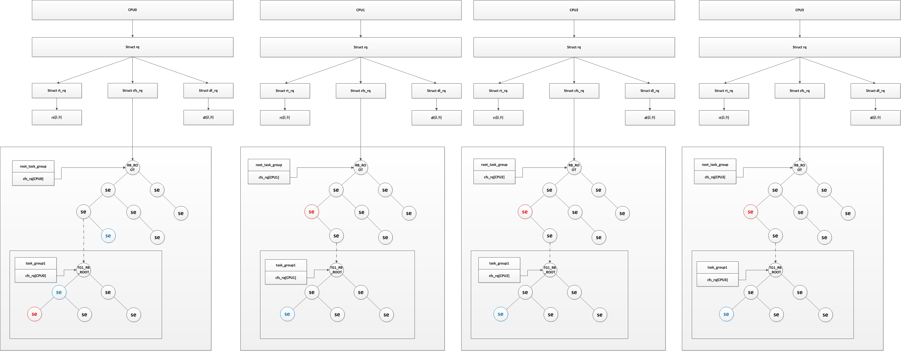

<!-- @import "[TOC]" {cmd="toc" depthFrom=1 depthTo=6 orderedList=false} -->

<!-- code_chunk_output -->

- [1 前景回顾](#1-前景回顾)
  - [1.1 进程调度](#11-进程调度)
  - [1.2 进程的分类](#12-进程的分类)
  - [1.3 不同进程采用不同的调度策略](#13-不同进程采用不同的调度策略)
  - [1.4 linux 调度器的演变](#14-linux-调度器的演变)
- [2 Linux 的调度器组成](#2-linux-的调度器组成)
  - [2.1 2 个调度器](#21-2-个调度器)
  - [2.2 6 种调度策略](#22-6-种调度策略)
  - [2.3 5 个调度器类](#23-5-个调度器类)
  - [2.4 3 个调度实体](#24-3-个调度实体)
  - [2.5 调度器类的就绪队列](#25-调度器类的就绪队列)
  - [2.6 调度器整体框架](#26-调度器整体框架)
  - [2.7 5 种调度器类为什么只有 3 种调度实体?](#27-5-种调度器类为什么只有-3-种调度实体)
- [3 进程调度的数据结构](#3-进程调度的数据结构)
  - [3.1 task\_struct 中调度相关的成员](#31-task_struct-中调度相关的成员)
    - [3.1.1 优先级](#311-优先级)
    - [3.1.2 调度策略](#312-调度策略)
    - [3.1.3 调度策略相关字段](#313-调度策略相关字段)
  - [3.2 调度类](#32-调度类)
  - [3.3 就绪队列](#33-就绪队列)
    - [3.3.1 CPU 就绪队列 struct rq](#331-cpu-就绪队列-struct-rq)
    - [3.3.2 CFS 公平调度器的就绪队列 cfs\_rq](#332-cfs-公平调度器的就绪队列-cfs_rq)
    - [3.3.3 实时进程就绪队列 rt\_rq](#333-实时进程就绪队列-rt_rq)
    - [3.3.4 deadline 就绪队列 dl\_rq](#334-deadline-就绪队列-dl_rq)
  - [3.4 调度实体](#34-调度实体)
    - [3.4.1 普通进程调度实体 sched\_entity](#341-普通进程调度实体-sched_entity)
    - [3.4.2 实时进程调度实体 sched\_rt\_entity](#342-实时进程调度实体-sched_rt_entity)
    - [3.4.3 EDF 调度实体 sched\_dl\_entity](#343-edf-调度实体-sched_dl_entity)
  - [3.5 组调度(struct task\_group)](#35-组调度struct-task_group)
- [4 总结](#4-总结)

<!-- /code_chunk_output -->

# 1 前景回顾

## 1.1 进程调度

内存中保存了对每个进程的唯一描述, 并通过若干结构与其他进程连接起来.

**调度器**面对的情形就是这样, 其任务是在程序之间共享 CPU 时间, 创造并行执行的错觉, 该任务分为两个不同的部分, 其中一个涉及**调度策略**, 另外一个涉及**上下文切换**.

内核必须提供一种方法, 在各个进程之间尽可能公平地共享 CPU 时间, 而同时又要考虑不同的任务优先级.

调度器的一个重要目标是有效地分配 CPU 时间片, 同时提供很好的用户体验. 调度器还需要面对一些互相冲突的目标, 例如既要为关键实时任务最小化响应时间, 又要最大限度地提高 CPU 的总体利用率.

调度器的一般原理是, 按所需分配的计算能力, 向系统中每个进程提供最大的公正性, 或者从另外一个角度上说, 他试图确保没有进程被亏待.

## 1.2 进程的分类

linux 把进程区分为实时进程和非实时进程, 其中非实时进程进一步划分为交互式进程和批处理进程

| 类型 | 描述 | 示例 |
| ------- |:-------|:-------|
| **交互式进程**(interactive process) | 此类进程经常与用户进行交互,因此需要花费**很多时间等待键盘和鼠标操作**. 当**接受了用户的输入**后, 进程**必须很快被唤醒**, 否则用户会感觉系统反应迟钝 | **shell**, **文本编辑程序**和**图形应用程序** |
| **批处理进程**(batch process) | 此类进程不必与用户交互, 因此经常**在后台运行**. 因为这样的进程**不必很快响应**, 因此常受到调度程序的怠慢 | 程序语言的**编译程序**, **数据库搜索引擎**以及科学计算 |
| **实时进程**(real-time process) | 这些进程有**很强的调度需要**,这样的进程绝不会被低优先级的进程阻塞.并且他们的**响应时间要尽可能的短** | **视频音频**应用程序,机器人控制程序以及从物理传感器上收集数据的程序|

在 linux 中, 调度算法可以明确的确认所有实时进程的身份, 但是没办法区分交互式程序和批处理程序, linux2.6 的调度程序实现了基于进程过去行为的启发式算法, 以确定进程应该被当做交互式进程还是批处理进程. 当然与批处理进程相比, 调度程序有偏爱交互式进程的倾向

## 1.3 不同进程采用不同的调度策略

根据**进程的不同分类**Linux 采用**不同的调度策略(！！！**).

对于**实时进程**, 采用**FIFO**或者**Round Robin**的**调度策略**.

对于**普通进程**, 则需要区分**交互式**和**批处理式**的不同. **传统 Linux**调度器**提高交互式应用的优先级**, 使得它们能**更快地被调度**. 而**CFS 和 RSDL 等新的调度器**的核心思想是"**完全公平**". 这个设计理念不仅大大简化了调度器的代码复杂度, 还对各种调度需求的提供了更完美的支持.

注意**Linux**通过**将进程和线程调度视为一个**, 同时包含二者. **进程**可以看做是**单个线程**, 但是进程可以包含共享一定资源(代码和/或数据)的多个线程. 因此进程调度也包含了线程调度的功能.

目前**实时进程**的**调度策略比较简单**,因为实时进程**只要求尽可能快的被响应**, 基于优先级, 每个进程根据它重要程度的不同被赋予不同的优先级, **调度器**在每次调度时, 总选择**优先级最高的进程开始执行**.**低优先级不可能抢占高优先级**, 因此**FIFO**或者**Round Robin**的**调度策略**即可满足实时进程调度的需求.

但是**普通进程的调度策略**就比较麻烦了,因为普通进程**不能简单的只看优先级**, 必须**公平的占有 CPU**,否则**很容易出现进程饥饿**,这种情况下用户会感觉操作系统很卡, 响应总是很慢.因此在 linux 调度器的发展历程中经过了多次重大变动,linux 总是希望寻找一个最接近于完美的调度策略来公平快速的调度进程.

## 1.4 linux 调度器的演变

一开始的调度器是复杂度为**O(n)的始调度算法**(实际上**每次会遍历所有任务**, 所以复杂度为 O(n)),这个算法的缺点是当**内核中有很多任务**时, 调度器本身就会**耗费不少时间**, 所以, 从 linux2.5 开始引入赫赫有名的**O(1)调度器**

然而, linux 是集全球很多程序员的聪明才智而发展起来的超级内核, 没有最好, 只有更好, 在$O(1)$调度器风光了没几天就又被另一个更优秀的调度器取代了, 它就是**CFS 调度器 Completely Fair Scheduler**.这个也是在**2.6 内核中引入**的, 具体为 2.6.23, 即从此版本开始, 内核使用**CFS 作为它的默认调度器**, $O(1)$调度器被抛弃了,其实**CFS 的发展**也是经历了很多阶段, 最早期的**楼梯算法(SD**),后来逐步对 SD 算法进行改进出**RSDL(Rotating Staircase Deadline Scheduler**),这个算法已经是"完全公平"的雏形了, **直至 CFS**是最终被内核采纳的调度器,它从 RSDL/SD 中吸取了完全公平的思想, **不再跟踪进程的睡眠时间**, 也**不再企图区分交互式进程**. 它将**所有的进程都统一对待**, 这就是公平的含义. CFS 的算法和实现都相当简单, 众多的测试表明其性能也非常优越

| 字段 | 版本 |
| ------------- |:-------------:|
| O(n)的始调度算法 | linux-0.11~2.4 |
| O(1)调度器 | linux-2.5 |
| CFS 调度器 | linux-2.6~至今 |

# 2 Linux 的调度器组成

## 2.1 2 个调度器

可以用**两种方法来激活调度**

- 一种是**直接的**, 比如**进程打算睡眠**或出于**其他原因放弃 CPU**

- 另一种是通过**周期性的机制**, 以**固定的频率运行**, 不时的检测是否有必要

因此当前**linux 的调度程序**由**两个调度器组成**:

- **主调度器**

- **周期性调度器**

两者又统称为**通用调度器(generic scheduler)**或**核心调度器(core scheduler)**

并且**每个调度器**包括两个内容: **调度框架**(其实质就是**两个函数框架**)及**调度器类**

## 2.2 6 种调度策略

linux 内核目前实现了**6 种调度策略**(即**调度算法**),用于**对不同类型的进程**进行调度,或者**支持某些特殊的功能**

比如**SCHED\_NORMAL**和**SCHED\_BATCH**调度普通的**非实时进程**,**SCHED\_FIFO**和**SCHED\_RR**和**SCHED\_DEADLINE**则采用不同的调度策略调度**实时进程**,**SCHED\_IDLE**则在系统**空闲时调用 idle 进程**.

>idle 的运行时机
>
>idle 进程优先级为**MAX\_PRIO**, 即**最低优先级**.
>
>**早先版本**中, **idle 是参与调度**的, 所以将其**优先级设为最低**, 当**没有其他进程可以运行**时, 才会**调度执行 idle**
>
>而目前的版本中**idle 并不在运行队列中参与调度**, 而是在**cpu 全局运行队列 rq 中含 idle 指针**, 指向 idle 进程, 在调度器发现**运行队列为空**的时候运行, 调入运行

| 字段 | 描述 | 所在调度器类 |
| ------------- |:-------------|:-------------|
| SCHED\_NORMAL | (也叫**SCHED\_OTHER**)用于**普通进程**, 通过**CFS 调度器**实现. **SCHED\_BATCH**用于**非交互的处理器消耗型进程**. **SCHED\_IDLE**是在**系统负载很低**时使用 | CFS |
| **SCHED\_BATCH** |  SCHED\_NORMAL 普通进程策略的分化版本. 采用分时策略, 根据动态优先级(可用 nice()API 设置), 分配 CPU 运算资源. 注意: 这类进程比上述两类实时进程优先级低, 换言之, 在有实时进程存在时, 实时进程优先调度. 但针对吞吐量优化,**除了不能抢占外与常规任务一样**, 允许任务运行更长时间, 更好地使用高速缓存, 适合于成批处理的工作 | CFS |
| **SCHED\_IDLE** | **优先级最低**, 在系统空闲时才跑这类进程(如利用闲散计算机资源跑地外文明搜索, 蛋白质结构分析等任务, 是此调度策略的适用者)| **CFS\-IDLE** |
| **SCHED\_FIFO** | **先入先出**调度算法(**实时调度策略**), **相同优先级**的任务**先到先服务**, **高优先级**的任务可以**抢占低优先级**的任务 | RT |
| **SCHED\_RR** | **轮流调度**算法(实时调度策略), 后者提供 Round\-Robin 语义, 采用**时间片**, **相同优先级**的任务当**用完时间片**会被放到**队列尾部**, 以保证公平性, 同样, **高优先级**的任务可以**抢占低优先级**的任务. 不同要求的实时任务可以根据需要用 sched\_setscheduler() API 设置策略 | RT |
| **SCHED\_DEADLINE** | 新支持的**实时进程调度策略**, 针对**突发型计算**, 且**对延迟和完成时间高度敏感**的任务适用. 基于**Earliest Deadline First (EDF**) 调度算法| **DL** |

linux 内核实现的**6 种调度策略**,前面**三种策略**使用的是**cfs 调度器类**, 后面**两种**使用**rt 调度器类**,最后**一个**使用**DL 调度器类**

## 2.3 5 个调度器类

而依据其**调度策略的不同**实现了**5 个调度器类**,**一个调度器类**可以用**一种**或者**多种调度策略**调度某一类进程, 也可以用于**特殊情况**或者**调度特殊功能**的进程.

| 调度器类 | 描述 | 对应调度策略 |
| ------- |:-------|:-------:|
| **stop\_sched\_class** | **优先级最高**的线程, 会**中断所有**其他线程, 且**不会被其他任务打断**<br>作用:<br>1.发生在**cpu\_stop\_cpu\_callback** 进行**cpu 之间任务 migration**<br>2.**HOTPLUG\_CPU**的情况下关闭任务 | 无, 不需要调度普通进程 |
| dl\_sched\_class | 采用 EDF**最早截至时间优先算法**调度实时进程 | SCHED\_DEADLINE |
| rt\_sched\_class | 采用提供**Roound\-Robin 算法**或者**FIFO 算法**调度实时进程<br>具体**调度策略**由进程的**task\_struct\->policy 指定** | SCHED\_FIFO, SCHED\_RR |
| fair\_sched\_clas  | 采用**CFS 算法调度普通的非实时进程** | SCHED\_NORMAL, SCHED\_BATCH |
| idle\_sched\_class | 采用**CFS 算法调度 idle 进程**,每个 cup 的第一个 pid=0 线程: swapper, 是一个静态线程. 调度类属于: idel\_sched\_class, 所以在**ps 里面是看不到**的. 一般运行在开机过程和 cpu 异常的时候做 dump | SCHED\_IDLE |

其所属进程的优先级顺序为

```c
stop_sched_class -> dl_sched_class -> rt_sched_class -> fair_sched_class -> idle_sched_class
```

## 2.4 3 个调度实体

**调度器不限于调度进程**,还可以**调度更大的实体**,比如实现**组调度**:可用的 CPU 时间首先在一半的进程组(比如, 所有进程按照所有者分组)之间分配, 接下来分配的时间再在组内进行二次分配.

这种一般性要求**调度器不直接操作进程**,而是**处理可调度实体**,因此需要一个通用的数据结构描述这个调度实体,即**seched\_entity 结构**,其实际上就**代表了一个调度对象**, 可以为**一个进程**, 也可以为**一个进程组**.

linux 中针对当前**可调度的实时和非实时进程**, 定义了类型为 seched\_entity 的 3 个调度实体

| 调度实体 | 名称 | 描述 | 对应调度器类 |
| ------- |:-------|:-------|:-------|
| sched\_dl\_entity | **DEADLINE 调度实体** | 采用**EDF 算法**调度的**实时调度实体** | dl\_sched\_class |
| sched\_rt\_entity |  **RT 调度实体** | 采用**Roound-Robin 或者 FIFO 算法**调度的**实时调度实体** | rt\_sched\_class |
| sched\_entity | **CFS 调度实体** | 采用**CFS**算法调度的**普通非实时进程的调度实体** | fair\_sched\_class |

## 2.5 调度器类的就绪队列

另外, 对于**调度框架**及**调度器类**, 它们都有自己管理的**运行队列**, **调度框架只识别 rq**(其实它也**不能算是运行队列**), 而对于**cfs 调度器类**它的运行队列则是**cfs\_rq**(内部使用**红黑树组织调度实体**), **实时 rt**的运行队列则为 rt\_rq(内部使用**优先级 bitmap\+双向链表组织调度实体**), 此外内核对**新增的 dl 实时调度策略**也提供了运行队列 dl\_rq

## 2.6 调度器整体框架

本质上, **通用调度器(核心调度器**)是一个**分配器**,与其他**两个组件**交互.

- 调度器用于判断**接下来运行哪个进程**.

内核支持不同的调度策略(完全公平调度,实时调度,在无事可做的时候调度空闲进程<即 0 号进程也叫 swapper 进程>,idle 进程), **调度类**使得能够以**模块化**的方法**实现这些策略**,即**一个类的代码不需要与其他类的代码交互**

当**调度器被调用**时, 他会**查询调度器类**, 得知接下来运行哪个进程

- 在选中将要运行的进程之后, 必须执行**底层的任务切换**.

这需要与 CPU 的紧密交互. **每个进程**刚好**属于某一调度类**,各个调度类负责管理所属的进程.**通用调度器**自身**不涉及进程管理**, 其工作都委托给调度器类.

**每个进程**都属于**某个调度器类**(由字段**task\_struct\->sched\_class**标识),由**调度器类(！！！**)采用进程对应的**调度策略调度**(由**task\_struct\->policy**)进行调度,**task\_struct**也存储了其对应的**调度实体标识**

linux 实现了**6 种调度策略**,依据其**调度策略的不同**实现了**5 个调度器类**,**一个调度器类**可以用**一种或者多种调度策略**调度某一类进程, 也可以用于特殊情况或者调度特殊功能的进程.

| 调度器类 | 调度策略 |  调度策略对应的调度算法 | 调度实体 | 调度实体对应的调度对象 |
| ------- |:-------:|:-------:|:-------:|:-------:|
| stop\_sched\_class | 无 | 无 | 无 | 特殊情况,发生在 cpu\_stop\_cpu\_callback 进行 cpu 之间任务迁移 migration 或者 HOTPLUG\_CPU 的情况下关闭任务 |
| dl\_sched\_class | SCHED\_DEADLINE | Earliest\-Deadline\-First 最早截至时间有限算法 | sched\_dl\_entity | 采用 DEF 最早截至时间有限算法调度实时进程 |
| rt\_sched\_class | SCHED\_RR<br><br>SCHED\_FIFO | Roound\-Robin 时间片轮转算法<br><br>FIFO 先进先出算法 | sched\_rt\_entity | 采用 Roound\-Robin 或者 FIFO 算法调度的实时调度实体 |
| fair\_sched\_class | SCHED\_NORMAL<br><br>SCHED\_BATCH | CFS 完全公平懂调度算法 |sched\_entity | 采用 CFS 算法普通非实时进程 |
| idle\_sched\_class | SCHED\_IDLE | **无** | **无** | **特殊进程**, 用于 cpu 空闲时调度空闲进程 idle |

**调度器组成**的关系如下图


## 2.7 5 种调度器类为什么只有 3 种调度实体?

正常来说一个调度器类应该对应一类调度实体, 但是 5 种调度器类却只有了 3 种调度实体?

这是因为**调度实体**本质是一个**可以被调度的对象**, 要么是一个**进程**(linux 中线程本质上也是进程), 要么是一个**进程组**, 只有**dl\_sched\_class**,**rt\_sched\_class**调度的**实时进程(组**)以及**fair\_sched\_class**调度的**非实时进程(组**)是**可以被调度的实体对象**,而 stop\_sched\_class 和 idle\_sched\_class 没有调度实体

**为什么采用 EDF 实时调度需要单独的调度器类, 调度策略和调度实体**

linux 针对**实时进程**实现了**Roound\-Robin**, **FIFO**和**Earliest-Deadline\-First(EDF)算法**, 但是为什么**SCHED\_RR**和**SCHED\_FIFO**两种调度算法都用**rt\_sched\_class 调度类**和**sched\_rt\_entity 调度实体**描述, 而**EDF 算法**却需要单独用**rt\_sched\_class 调度类**和**sched\_dl\_entity 调度实体**描述

为什么采用 EDF 实时调度不用 rt\_sched\_class 调度类调度, 而是单独实现调度类和调度实体?

# 3 进程调度的数据结构

调度器使用一系列数据结构来排序和管理系统中的进程. 调度器的工作方式的这些结构的涉及密切相关, 几个组件在许多方面

## 3.1 task\_struct 中调度相关的成员

```c
struct task_struct
{
    ........
    /* 表示是否在运行队列 */
    int on_rq;

    /* 进程优先级
     * prio: 动态优先级, 范围为 100~139, 与静态优先级和补偿(bonus)有关
     * static_prio: 静态优先级, static_prio = 100 + nice + 20 (nice 值为-20~19,所以 static_prio 值为 100~139)
     * normal_prio: 没有受优先级继承影响的常规优先级, 具体见 normal_prio 函数, 跟属于什么类型的进程有关
     */
    int prio, static_prio, normal_prio;
    /* 实时进程优先级 */
    unsigned int rt_priority;

    /* 调度类, 调度处理函数类 */
    const struct sched_class *sched_class;

 /* 调度实体(红黑树的一个结点) */
    struct sched_entity se;
    /* 调度实体(实时调度使用) */
    struct sched_rt_entity rt;
 struct sched_dl_entity dl;

#ifdef CONFIG_CGROUP_SCHED
    /* 指向其所在进程组 */
    struct task_group *sched_task_group;
#endif
    ........
}
```

### 3.1.1 优先级

```c
int prio, static_prio, normal_prio;
unsigned int rt_priority;
```

**动态优先级 静态优先级 实时优先级**

其中**task\_struct**采用了三个成员表示进程的优先级:**prio 和 normal\_prio 表示动态优先级**,**static\_prio 表示进程的静态优先级**.

>为什么表示**动态优先级**需要两个值**prio 和 normal\_prio**
>
>**调度器会考虑的优先级则保存在 prio**.由于在某些情况下内核需要**暂时提高进程的优先级**,因此需要用 prio 表示.由于这些改变不是持久的,因此**静态优先级 static\_prio 和普通优先级 normal\_prio**不受影响.

此外还用了一个字段 rt\_priority 保存了实时进程的优先级

|字段 | 描述 |
|:-------|:-------|
| static\_prio | 用于保存**静态优先级**, 是**进程启动时分配的优先级**, , 可以通过**nice**和**sched\_setscheduler 系统调用**来进行修改, 否则在进程运行期间会一直保持恒定 |
| prio | 保存进程的**动态优先级** |
| normal\_prio | 表示**基于进程的静态优先级 static\_prio 和调度策略**计算出的优先级. 因此即使**普通进程**和**实时进程**具有**相同的静态优先级**, 其**普通优先级也是不同**的, **进程分叉(fork**)时, **子进程会继承父进程的普通优先级** |
| rt\_priority | 用于保存实时优先级, **实时进程的优先级**用实时优先级 rt\_priority 来表示 |

实时进程的优先级用实时优先级 rt\_priority 来表示

linux2.**6 内核将任务优先级进行了一个划分**,实时进程优先级范围是 0 到 MAX\_RT\_PRIO-1(即 99), 而普通进程的静态优先级范围是从 MAX\_RT\_PRIO 到 MAX\_PRIO-1(即 100 到 139).
```c
/*  http://lxr.free-electrons.com/source/include/linux/sched/prio.h?v=4.6#L21  */
#define MAX_USER_RT_PRIO    100
#define MAX_RT_PRIO     MAX_USER_RT_PRIO

/* http://lxr.free-electrons.com/source/include/linux/sched/prio.h?v=4.6#L24  */
#define MAX_PRIO        (MAX_RT_PRIO + 40)
#define DEFAULT_PRIO        (MAX_RT_PRIO + 20)
```

| 优先级范围 | 描述 |
| ------------- |:-------------|
| 0 - 99 | 实时进程 |
| 100 - 139 | 非实时进程 |

关于优先级的详细信息可以参见[ Linux 进程优先级的处理--Linux 进程的管理与调度(二十二)](http://blog.csdn.net/gatieme/article/details/51719208)

### 3.1.2 调度策略

```c
unsigned int policy;
```

policy 保存了进程的调度策略, 目前主要有以下五种:

>参见
>
>http://lxr.free-electrons.com/source/include/uapi/linux/sched.h?v=4.6#L32

```c
/*
* Scheduling policies
*/
#define SCHED_NORMAL            0
#define SCHED_FIFO              1
#define SCHED_RR                2
#define SCHED_BATCH             3
/* SCHED_ISO: reserved but not implemented yet */
#define SCHED_IDLE              5
#define SCHED_DEADLINE          6
```

| 字段 | 描述 | 所在调度器类 |
| ------------- |:-------------|:-------------|
| SCHED\_NORMAL | (也叫**SCHED\_OTHER**)用于**普通进程**, 通过**CFS 调度器**实现. **SCHED\_BATCH**用于**非交互的处理器消耗型进程**. **SCHED\_IDLE**是在**系统负载很低**时使用 | CFS |
| **SCHED\_BATCH** |  SCHED\_NORMAL 普通进程策略的分化版本. 采用分时策略, 根据动态优先级(可用 nice()API 设置), 分配 CPU 运算资源. 注意: 这类进程比上述两类实时进程优先级低, 换言之, 在有实时进程存在时, 实时进程优先调度. 但针对吞吐量优化,**除了不能抢占外与常规任务一样**, 允许任务运行更长时间, 更好地使用高速缓存, 适合于成批处理的工作 | CFS |
| **SCHED\_IDLE** | **优先级最低**, 在系统空闲时才跑这类进程(如利用闲散计算机资源跑地外文明搜索, 蛋白质结构分析等任务, 是此调度策略的适用者)| **CFS\-IDLE** |
| **SCHED\_FIFO** | **先入先出**调度算法(**实时调度策略**), **相同优先级**的任务**先到先服务**, **高优先级**的任务可以**抢占低优先级**的任务 | RT |
| **SCHED\_RR** | **轮流调度**算法(实时调度策略), 后者提供 Round\-Robin 语义, 采用**时间片**, **相同优先级**的任务当**用完时间片**会被放到**队列尾部**, 以保证公平性, 同样, **高优先级**的任务可以**抢占低优先级**的任务. 不同要求的实时任务可以根据需要用 sched\_setscheduler() API 设置策略 | RT |
| **SCHED\_DEADLINE** | 新支持的**实时进程调度策略**, 针对**突发型计算**, 且**对延迟和完成时间高度敏感**的任务适用. 基于**Earliest Deadline First (EDF**) 调度算法| **DL** |

>SCHED\_BATCH 用于非交互的处理器消耗型进程
>
>SCHED\_IDLE 是在系统负载很低时使用 CFS

SCHED\_BATCH 用于非交互, CPU 使用密集型的批处理进程.调度决策对此类进程给予"冷处理":他们绝不会抢占 CFS 调度器处理的另一个进程, 因此不会干扰交互式进程.如果打算使用 nice 值降低进程的静态优先级,同时又不希望该进程影响系统的交互性, 此时最适合使用该调度类.

而 SCHED\_LDLE 进程的重要性则会进一步降低, 因此其权重总是最小的

>**注意**
>
>尽管名称是 SCHED\_IDLE 但是 SCHED\_IDLE 不负责调度空闲进程. 空闲进程由内核提供单独的机制来处理

SCHED\_RR 和 SCHED\_FIFO 用于实现软实时进程. SCHED\_RR 实现了轮流调度算法, 一种循环时间片的方法, 而 SCHED\_FIFO 实现了先进先出的机制, 这些并不是由完全贡品调度器类 CFS 处理的, 而是由实时调度类处理.

### 3.1.3 调度策略相关字段

```c
/*  http://lxr.free-electrons.com/source/include/linux/sched.h?v=4.6#L1431  */
unsigned int policy;

/*  http://lxr.free-electrons.com/source/include/linux/sched.h?v=4.6#L1413  */

const struct sched_class *sched_class;
struct sched_entity se;
struct sched_rt_entity rt;
struct sched_dl_entity dl;

cpumask_t cpus_allowed;
```

| 字段 | 描述 |
| ------------- |:-------------:|
| sched\_class | 调度类, 调度类, 调度处理函数类 |
| se | **普通进程的调用实体**, 每个进程都有其中之一的实体 |
| rt | **实时进程的调用实体**, 每个进程都有其中之一的实体 |
| dl | deadline 的调度实体 |
| cpus\_allowed | 用于控制进程可以**在哪里处理器上运行** |

调度器不限于调度进程, 还可以调度更大的实体, 比如实现组调度: 可用的 CPU 时间首先在一半的进程组(比如, 所有进程按照所有者分组)之间分配, 接下来分配的时间再在组内进行二次分配

cpus\_allows 是一个位域, 在多处理器系统上使用, 用来限制进程可以在哪些 CPU 上运行

## 3.2 调度类

**sched\_class 结构体表示调度类**, 类提供了**通用调度器和各个调度器之间的关联**, 调度器类和特定数据结构中汇集地几个函数指针表示, 全局调度器请求的各个操作都可以用一个指针表示, 这使得无需了解调度器类的内部工作原理即可创建通用调度器, 定义在[kernel/sched/sched.h](http://lxr.free-electrons.com/source/kernel/sched/sched.h?v=4.6#L1184)

```c
struct sched_class {
 /* 系统中多个调度类, 按照其调度的优先级排成一个链表
    下一优先级的调度类
     * 调度类优先级顺序: stop_sched_class -> dl_sched_class -> rt_sched_class -> fair_sched_class -> idle_sched_class
     */
    const struct sched_class *next;

    /*  将进程加入到运行队列中, 即将调度实体(进程)放入红黑树中, 并对 nr_running 变量加 1   */
    void (*enqueue_task) (struct rq *rq, struct task_struct *p, int flags);
    /*  从运行队列中删除进程, 并对 nr_running 变量中减 1  */
    void (*dequeue_task) (struct rq *rq, struct task_struct *p, int flags);
    /*  放弃 CPU, 在 compat_yield sysctl 关闭的情况下, 该函数实际上执行先出队后入队; 在这种情况下, 它将调度实体放在红黑树的最右端  */
    void (*yield_task) (struct rq *rq);
    bool (*yield_to_task) (struct rq *rq, struct task_struct *p, bool preempt);
 /*   检查当前进程是否可被新进程抢占 */
    void (*check_preempt_curr) (struct rq *rq, struct task_struct *p, int flags);

    /*
     * It is the responsibility of the pick_next_task() method that will
     * return the next task to call put_prev_task() on the @prev task or
     * something equivalent.
     *
     * May return RETRY_TASK when it finds a higher prio class has runnable
     * tasks.
     */
     /*  选择下一个应该要运行的进程运行  */
    struct task_struct * (*pick_next_task) (struct rq *rq,
                        struct task_struct *prev);
 /* 将进程放回运行队列 */
    void (*put_prev_task) (struct rq *rq, struct task_struct *p);

#ifdef CONFIG_SMP
 /* 为进程选择一个合适的 CPU */
    int  (*select_task_rq)(struct task_struct *p, int task_cpu, int sd_flag, int flags);
 /* 迁移任务到另一个 CPU */
 void (*migrate_task_rq)(struct task_struct *p);
 /* 用于进程唤醒 */
    void (*task_waking) (struct task_struct *task);
    void (*task_woken) (struct rq *this_rq, struct task_struct *task);
 /* 修改进程的 CPU 亲和力(affinity) */
    void (*set_cpus_allowed)(struct task_struct *p,
                 const struct cpumask *newmask);
 /* 启动运行队列 */
    void (*rq_online)(struct rq *rq);
     /* 禁止运行队列 */
    void (*rq_offline)(struct rq *rq);
#endif
 /* 当进程改变它的调度类或进程组时被调用 */
    void (*set_curr_task) (struct rq *rq);
 /* 该函数通常调用自 time tick 函数; 它可能引起进程切换. 这将驱动运行时(running)抢占 */
    void (*task_tick) (struct rq *rq, struct task_struct *p, int queued);
 /* 在进程创建时调用, 不同调度策略的进程初始化不一样 */
    void (*task_fork) (struct task_struct *p);
 /* 在进程退出时会使用 */
    void (*task_dead) (struct task_struct *p);

    /*
     * The switched_from() call is allowed to drop rq->lock, therefore we
     * cannot assume the switched_from/switched_to pair is serliazed by
     * rq->lock. They are however serialized by p->pi_lock.
     */
 /* 用于进程切换 */
    void (*switched_from) (struct rq *this_rq, struct task_struct *task);
    void (*switched_to) (struct rq *this_rq, struct task_struct *task);
 /* 改变优先级 */
    void (*prio_changed) (struct rq *this_rq, struct task_struct *task,
                 int oldprio);

    unsigned int (*get_rr_interval) (struct rq *rq,
                     struct task_struct *task);

    void (*update_curr) (struct rq *rq);

#ifdef CONFIG_FAIR_GROUP_SCHED
    void (*task_move_group) (struct task_struct *p);
#endif
};
```

| 成员 | 描述 |
| ------------- |:-------------:|
| enqueue\_task | 向**就绪队列**中**添加一个进程**,某个任务**进入可运行状态时**, 该函数将得到**调用**. 它将调度实体(进程)**放入红黑树**中, 并对**nr\_running**变量加 1 |
| dequeue\_task | 将一个进程从**就就绪队列**中**删除**,当某个任务**退出可运行状态**时调用该函数, 它将**从红黑树中去掉对应的调度实体**, 并从 **nr\_running** 变量中减 1 |
| yield\_task | 在进程想要资源**放弃对处理器的控制权**的时, 可使用在**sched\_yield 系统调用**, 会调用内核 API yield\_task 完成此工作. **compat\_yield sysctl 关闭**的情况下, 该函数实际上执行**先出队后入队**; 在这种情况下, 它将调度实体放在**红黑树的最右端** |
| check\_preempt\_curr | 该函数将**检查当前运行的任务是否被抢占**. 在**实际抢占正在运行的任务之前**, CFS 调度程序模块将**执行公平性测试**. 这**将驱动唤醒式(wakeup)抢占** |
| pick\_next\_task | 该函数**选择**接下来要运行的最合适的进程 |
| put\_prev\_task | 用另一个进程**代替当前运行的进程** |
| set\_curr\_task | 当任务**修改其调度类或修改其任务组**时, 将调用这个函数 |
| task\_tick | 在**每次激活周期调度器**时, 由**周期性调度器调用**, 该函数通常调用自 time tick 函数; 它**可能引起进程切换**. 这将驱动运行时(running)抢占 |
| task\_new | 内核调度程序为调度模块提供了管理新任务启动的机会,用于建立 fork 系统调用和调度器之间的关联, 每次**新进程建立**后,则用**new\_task 通知调度器**,CFS 调度模块使用它进行组调度, 而用于**实时任务的调度模块则不会使用**这个函数 |

对于各个调度器类, 都必须提供 struct sched\_class 的一个实例, 目前内核中有实现以下五种:

```c
// http://lxr.free-electrons.com/source/kernel/sched/sched.h?v=4.6#L1254
extern const struct sched_class stop_sched_class;
extern const struct sched_class dl_sched_class;
extern const struct sched_class rt_sched_class;
extern const struct sched_class fair_sched_class;
extern const struct sched_class idle_sched_class;
```

| 调度器类 | 描述 | 对应调度策略 |
| ------- |:-------|:-------:|
| **stop\_sched\_class** | **优先级最高**的线程, 会**中断所有**其他线程, 且**不会被其他任务打断**<br>作用:<br>1.发生在**cpu\_stop\_cpu\_callback** 进行**cpu 之间任务 migration**<br>2.**HOTPLUG\_CPU**的情况下关闭任务 | 无, 不需要调度普通进程 |
| dl\_sched\_class | 采用 EDF**最早截至时间优先算法**调度实时进程 | SCHED\_DEADLINE |
| rt\_sched\_class | 采用提供**Roound\-Robin 算法**或者**FIFO 算法**调度实时进程<br>具体**调度策略**由进程的**task\_struct\->policy 指定**. 作用: 实时线程 | SCHED\_FIFO, SCHED\_RR |
| fair\_sched\_clas  | 采用**CFS 算法调度普通的非实时进程**. 作用: 一般常规线程 | SCHED\_NORMAL, SCHED\_BATCH |
| idle\_sched\_class | 采用**CFS 算法调度 idle 进程**,每个 cup 的第一个 pid=0 线程: swapper, 是一个静态线程. 调度类属于: idel\_sched\_class, 所以在**ps 里面是看不到**的. 一般运行在开机过程和 cpu 异常的时候做 dump | SCHED\_IDLE |

目前系統中,Scheduling Class 的优先级顺序为
```c
stop_sched_class -> dl_sched_class -> rt_sched_class -> fair_sched_class -> idle_sched_class
```
**开发者**可以根据己的设计需求,來把**所属的 Task**配置到**不同的 Scheduling Class**中.

**用户层应用程序无法直接与调度类交互(！！！**),他们只知道上下文定义的常量 SCHED\_XXX(用 task_struct->policy 表示), 这些常量提供了**调度类之间的映射**.

## 3.3 就绪队列

**就绪队列**是核心调度器用于**管理活动进程**的主要数据结构.

**各个 CPU 都有自身的就绪队列**, 各个**活动进程只出现在一个就绪队列**中,在**多个 CPU 上同时运行一个进程是不可能(！！！**)的.

>**早期的内核**中**就绪队列是全局**的,即有**全局唯一的 rq**,但是在 Linux-2.6 内核时代, 为了**更好的支持多核**, Linux 调度器普遍采用了 per\-cpu 的 run queue, 从而克服了多 CPU 系统中, 全局唯一的 run queue 由于资源的竞争而成为了系统瓶颈的问题, 因为在同一时刻, 一个 CPU 访问 run queue 时, 其他的 CPU 即使空闲也必须等待, 大大降低了整体的 CPU 利用率和系统性能. 当使用 per-CPU 的 run queue 之后, 每个 CPU 不再使用大内核锁, 从而大大提高了并行处理的调度能力.
>
> 参照[CFS 调度的总结 - (单 rq vs 多 rq)](http://blog.csdn.net/ustc_dylan/article/details/7303851)

**就绪队列**是**全局调度器许多操作的起点**,但是**进程**并**不是由就绪队列直接管理**的,**调度管理**是各个**调度器的职责**, 因此在各个**就绪队列**中嵌入了**特定调度类的子就绪队列**(**cfs**的就绪队列 [**struct cfs\_rq**](http://lxr.free-electrons.com/source/kernel/sched/sched.h?v=4.6#L359), **实时调度类**的就绪队列[struct rt\_rq](http://lxr.free-electrons.com/source/kernel/sched/sched.h?v=4.6#L449)和**deadline 调度类**的就绪队列[struct dl\_rq](http://lxr.free-electrons.com/source/kernel/sched/sched.h?v=4.6#L490)

**每个 CPU(！！！**)都有自己的**struct rq 结构**, 其用于描述**在此 CPU 上所运行的所有进程**, 其包括一个**实时进程队列**和一个**根 CFS 运行队列**, 在**调度时**, 调度器首先会先去**实时进程队列**找是否有实时进程需要运行, 如果没有才会去**CFS 运行队列**找是否有进行需要运行, 这就是为什么常说的**实时进程优先级比普通进程高**, 不仅仅体现在**prio 优先级**上, 还体现在**调度器的设计**上, 至于 dl 运行队列, 我暂时还不知道有什么用处, 其**优先级比实时进程还高**, 但是创建进程时如果**创建的是 dl 进程创建会错误**(具体见 sys\_fork).

### 3.3.1 CPU 就绪队列 struct rq

就绪队列用 struct rq 来表示, 其定义在[kernel/sched/sched.h, line 566](http://lxr.free-electrons.com/source/kernel/sched/sched.h?v=4.6#L566)

```c
 /*每个处理器都会配置一个 rq*/
struct rq {
 /* runqueue lock: */
 spinlock_t lock;

 /*
  * nr_running and cpu_load should be in the same cacheline because
  * remote CPUs use both these fields when doing load calculation.
  */
  /*用以记录目前处理器 rq 中执行 task 的数量*/
 unsigned long nr_running;
#ifdef CONFIG_NUMA_BALANCING
    unsigned int nr_numa_running;
    unsigned int nr_preferred_running;
#endif

    #define CPU_LOAD_IDX_MAX 5
    /*用以表示处理器的负载, 在每个处理器的 rq 中都会有对应到该处理器的 cpu_load 参数配置,
    在每次处理器触发 scheduler tick 时, 都会调用函数 update_cpu_load_active,进行 cpu_load 的更新
    在系统初始化的时候会调用函数 sched_init 把 rq 的 cpu_load array 初始化为 0.
 了解他的更新方式最好的方式是通过函数 update_cpu_load,公式如下
 cpu_load[0]会直接等待 rq 中 load.weight 的值.
 cpu_load[1]=(cpu_load[1]*(2-1)+cpu_load[0])/2
 cpu_load[2]=(cpu_load[2]*(4-1)+cpu_load[0])/4
 cpu_load[3]=(cpu_load[3]*(8-1)+cpu_load[0])/8
 cpu_load[4]=(cpu_load[4]*(16-1)+cpu_load[0]/16
 调用函数 this_cpu_load 时, 所返回的 cpu load 值是 cpu_load[0]
 而在进行 cpu blance 或 migration 时, 就会呼叫函数
 source_load target_load 取得对该处理器 cpu_load index 值,
 来进行计算*/
 unsigned long cpu_load[CPU_LOAD_IDX_MAX];
 unsigned long last_load_update_tick;

#ifdef CONFIG_NO_HZ_COMMON
    u64 nohz_stamp;
    unsigned long nohz_flags;
#endif
#ifdef CONFIG_NO_HZ_FULL
    unsigned long last_sched_tick;
#endif

    /* capture load from *all* tasks on this cpu: */
 /*load->weight 值, 会是目前所执行的 schedule entity 的 load->weight 的总和
    也就是说 rq 的 load->weight 越高, 也表示所负责的排程单元 load->weight 总和越高
 表示处理器所负荷的执行单元也越重*/
 struct load_weight load;
 /*在每次 scheduler tick 中呼叫 update_cpu_load 时, 这个值就增加一,
    可以用来反馈目前 cpu load 更新的次数*/
 unsigned long nr_load_updates;
 /*用来累加处理器进行 context switch 的次数, 会在调用 schedule 时进行累加,
    并可以通过函数 nr_context_switches 统计目前所有处理器总共的 context switch 次数
    或是可以透过查看档案/proc/stat 中的 ctxt 位得知目前整个系统触发 context switch 的次数*/
 u64 nr_switches;

 /*为 cfs fair scheduling class 的 rq 就绪队列  */
 struct cfs_rq cfs;
 /*为 real-time scheduling class 的 rq 就绪队列  */
 struct rt_rq rt;
    /*  为 deadline scheduling class 的 rq 就绪队列  */

 /*   用以支援可以 group cfs tasks 的机制*/
#ifdef CONFIG_FAIR_GROUP_SCHED
 /* list of leaf cfs_rq on this cpu: */
 /*
    在有设置 fair group scheduling 的环境下,
    会基于原本 cfs rq 中包含有若干 task 的 group 所成的排程集合,
    也就是说当有一个 group a 就会有自己的 cfs rq 用来排程自己所属的 tasks,
 而属于这 group a 的 tasks 所使用到的处理器时间就会以这 group a 总共所分的的时间为上限.
 基于 cgroup 的 fair group scheduling 架构, 可以创造出有阶层性的 task 组织,
    根据不同 task 的功能群组化在配置给该群主对应的处理器资源,
    让属于该群主下的 task 可以透过 rq 机制使用该群主下的资源.
 这个变数主要是管理 CFS RQ list,
    操作上可以透过函数 list_add_leaf_cfs_rq 把一个 group cfs rq 加入到 list 中,
    或透过函数 list_del_leaf_cfs_rq 把一个 group cfs rq 移除,
    并可以透过 for_each_leaf_cfs_rq 把一个 rq 上得所有 leaf cfs_rq 走一遍
 */
 struct list_head leaf_cfs_rq_list;
#endif
 /*
  * This is part of a global counter where only the total sum
  * over all CPUs matters. A task can increase this counter on
  * one CPU and if it got migrated afterwards it may decrease
  * it on another CPU. Always updated under the runqueue lock:
  */
  /*一般来说, linux kernel 的 task 状态可以为
     TASK_RUNNING, TASK_INTERRUPTIBLE(sleep), TASK_UNINTERRUPTIBLE(Deactivate Task),
     此时 Task 会从 rq 中移除)或 TASK_STOPPED.
  透过这个变量会统计目前 rq 中有多少 task 属于 TASK_UNINTERRUPTIBLE 的状态.
     当调用函数 active_task 时, 会把 nr_uninterruptible 值减一,
     并透过该函数 enqueue_task 把对应的 task 依据所在的 scheduling class 放在对应的 rq 中
     并把目前 rq 中 nr_running 值加一  */
 unsigned long nr_uninterruptible;

 /*
    curr:指向目前处理器正在执行的 task;
 idle:指向属于 idle-task scheduling class 的 idle task;
 stop:指向目前最高等级属于 stop-task scheduling class
 的 task;  */
 struct task_struct *curr, *idle;
 /*
    基于处理器的 jiffies 值, 用以记录下次进行处理器 balancing 的时间点*/
 unsigned long next_balance;
 /*
    用以存储 context-switch 发生时,
    前一个 task 的 memory management 结构并可用在函数 finish_task_switch
    透过函数 mmdrop 释放前一个 task 的结构体资源  */
    struct mm_struct *prev_mm;

    unsigned int clock_skip_update;

 /*  用以记录目前 rq 的 clock 值,
    基本上该值会等于通过 sched_clock_cpu(cpu_of(rq))的返回值,
    并会在每次调用 scheduler_tick 时通过函数 update_rq_clock 更新目前 rq clock 值.
 函数 sched_clock_cpu 会通过 sched_clock_local 或 ched_clock_remote 取得
    对应的 sched_clock_data,而处理的 sched_clock_data 值,
    会通过函数 sched_clock_tick 在每次调用 scheduler_tick 时进行更新;
 */
 u64 clock;
    u64 clock_task;

 /*用以记录目前 rq 中有多少 task 处于等待 i/o 的 sleep 状态
 在实际的使用上, 例如当 driver 接受来自 task 的调用,
    但处于等待 i/o 回复的阶段时, 为了充分利用处理器的执行资源,
    这时就可以在 driver 中调用函数 io_schedule,
    此时就会把目前 rq 中的 nr_iowait 加一, 并设定目前 task 的 io_wait 为 1
 然后触发 scheduling 让其他 task 有机会可以得到处理器执行时间*/
 atomic_t nr_iowait;

#ifdef CONFIG_SMP
 /*root domain 是基于多核心架构下的机制,
 会由 rq 结构记住目前采用的 root domain,
    其中包括了目前的 cpu mask(包括 span,online rt overload), reference count 跟 cpupri
 当 root domain 有被 rq 参考到时, refcount 就加一, 反之就减一.
    而 cpumask span 表示 rq 可挂上的 cpu mask,noline 为 rq 目前已经排程的
 cpu mask cpu 上执行 real-time task.可以参考函数 pull_rt_task, 当一个 rq 中属于
 real-time 的 task 已经执行完毕, 就会透过函数 pull_rt_task 从该
 rq 中属于 rto_mask cpu mask 可以执行的处理器上, 找出是否有一个处理器
 有大于一个以上的 real-time task, 若有就会转到目前这个执行完成
 real-time task 的处理器上
 而 cpupri 不同于 Task 本身有区分 140 个(0-139)
 Task Priority (0-99 为 RT Priority 而 100-139 為 Nice 值 -20-19).
 CPU Priority 本身有 102 个 Priority (包括,-1 为 Invalid,
 0 为 Idle,1 为 Normal,2-101 对应到到 Real-Time Priority 0-99).
 参考函数 convert_prio, Task Priority 如果是 140 就会对应到
 CPU Idle,如果是>=100 就會对应到 CPU Normal,
 若是 Task Priority 介于 0-99 之间,就會对应到 CPU Real-Time Priority 101-2 之间.)
 在实际的操作上,例如可以通过函数 cpupri_find 传入入一个要插入的 Real-Time Task,
    此时就会依据 cpupri 中 pri_to_cpu 选择一个目前执行 Real-Time Task
    且该 Task 的优先级比目前要插入的 Task 更低的处理器,
 并通过 CPU Mask(lowest_mask)返回目前可以选择的处理器 Mask.
 可以參考 kernel/sched_cpupri.c.
 在初始化的过程中,通过函数 sched_init 调用函数 init_defrootdomain,
 对 Root Domain 和 CPU Priority 机制进行初始化.
 */
 struct root_domain *rd;

 /*Schedule Domain 是基于多核心架构下的机制.
 每个处理器都会有一个基础的 Scheduling Domain,
 Scheduling Domain 可以通过 parent 找到上一层的 Domain,
    或是通过 child 找到下一层的 Domain (NULL 表示結尾.).
    也可以通过 span 字段,表示这个 Domain 所能覆盖的处理器的范围.
 通常 Base Domain 会涵盖系統中所有处理器的个数,
 而 Child Domain 所能涵盖的处理器个火速不超过它的 Parent Domain.
    而当进行 Scheduling Domain 中的 Task Balance,就会以该 Domain 所涵盖的处理器为最大范围.
 同時,每个 Schedule Domain 都会包括一个或一个以上的
 CPU Groups (结构为 struct sched_group),并通过 next 字段把
 CPU Groups 链接在一起(成为一个单向的 Circular linked list),
 每个 CPU Group 都会有变量 cpumask 来定义 CPU Group
 可以参考 Linux Kernel 文件 Documentation/scheduler/sched-domains.txt.
 */
 struct sched_domain *sd;

    struct callback_head *balance_callback;

    unsigned char idle_balance;
    /* For active balancing */
    int active_balance;
    int push_cpu;
    struct cpu_stop_work active_balance_work;
    /* cpu of this runqueue: */
    int cpu;
    int online;

 /*当 RunQueue 中此值为 1,表示这个 RunQueue 正在进行
 Fair Scheduling 的 Load Balance,此時会调用 stop_one_cpu_nowait
 暂停该 RunQueue 所出处理器调度,
    并通过函数 active_load_balance_cpu_stop,
    把 Tasks 从最忙碌的处理器移到 Idle 的处理器器上执行.  */
 int active_balance;

 /*用以存储目前进入 Idle 且负责进行 Load Balance 的处理器 ID.
    调用的流程为,在调用函数 schedule 时,
 若该处理器 RunQueue 的 nr_running 為 0 (也就是目前沒有
 正在执行的 Task),就会调用 idle_balance,并触发 Load Balance  */
 int push_cpu;
 /* cpu of this runqueue: */
 /*用以存储前运作这个 RunQueue 的处理器 ID*/
 int cpu;

 /*为 1 表示目前此 RunQueue 有在对应的处理器上并执行  */
 int online;

 /*如果 RunQueue 中目前有 Task 正在执行,
    这个值会等等于该 RunQueue 的 Load Weight 除以目前 RunQueue 中 Task 數目的均值.
 (rq->avg_load_per_task = rq->load.weight / nr_running;).*/
 unsigned long avg_load_per_task;

 /*这个值会由 Real-Time Scheduling Class 调用函数 update_curr_rt,
    用以统计目前 Real-Time Task 执行时间的均值,
    在这个函数中会以目前 RunQueue 的 clock_task 减去目前 Task 执行的起始时间,
    取得执行时间的 Delta 值. (delta_exec = rq->clock_task – curr->se.exec_start; ).
 在通过函数 sched_rt_avg_update 把这个 Delta 值跟原本 RunQueue 中的 rt_avg 值取平均值.
    以运行的周期来看,这个值可反应目前系統中 Real-Time Task 平均被分配到的执行时间值  .*/
 u64 rt_avg;

 /* 这个值主要在函数 sched_avg_update 更新  */
 u64 age_stamp;

    /*這值会在处理 Scheduling 時,若判断目前处理器 runQueue 沒有正在运行的 Task,
    就会通过函数 idle_balance 更新这个值为目前 RunQueue 的 clock 值.
 可用以表示這個处理器何時进入到 Idle 的状态  */
 u64 idle_stamp;

 /*会在有 Task 运行且 idle_stamp 不为 0 (表示前一个转台是在 Idle)时
    以目前 RunQueue 的 clock 减去 idle_stmp 所计算出的 Delta 值为依据,
    更新这个值,  可反应目前处理器进入 Idle 状态的时间长短  */
 u64 avg_idle;

 /* This is used to determine avg_idle's max value */
 u64 max_idle_balance_cost;
#endif


#ifdef CONFIG_IRQ_TIME_ACCOUNTING
    u64 prev_irq_time;
endif
#ifdef CONFIG_PARAVIRT
    u64 prev_steal_time;
#endif
#ifdef CONFIG_PARAVIRT_TIME_ACCOUNTING
    u64 prev_steal_time_rq;
#endif

 /* calc_load related fields */
 /*用以记录下一次计算 CPU Load 的时间,
    初始值为目前的 jiffies 加上五秒与 1 次的 Scheduling Tick 的间隔
    (=jiffies + LOAD_FREQ,且 LOAD_FREQ=(5*HZ+1))*
    /
 unsigned long calc_load_update;

    /*等于 RunQueue 中 nr_running 与 nr_uninterruptible 的总和.
    (可參考函式 calc_load_fold_active).*/
 long calc_load_active;

#ifdef CONFIG_SCHED_HRTICK
#ifdef CONFIG_SMP
    int hrtick_csd_pending;
 /*在函数 it_rq_hrtick 初始化 RunQueue High-Resolution
 Tick 时,  此值设为 0.
 在函数 hrtick_start 中,会判断目前触发的 RunQueue 跟目前处理器所使用的 RunQueue 是否一致,
 若是,就直接呼叫函数 hrtimer_restart,反之就会依据 RunQueue 中 hrtick_csd_pending 的值,
    如果 hrtick_csd_pending 為 0,就会通过函数__smp_call_function_single 让 RunQueue 所在的另一個
 处理器执行 rq->hrtick_csd.func 和函数 __hrtick_start.
    并等待该处理器執行完毕后,才重新把 hrtick_csd_pending 设定为 1.
 也就是说, RunQueue 的 hrtick_csd_pending 是用来作为 SMP 架构下,
    由处理器 A 触发处理器 B 执行*/
 struct call_single_data hrtick_csd;
#endif
 /*为 gh-Resolution Tick 的结构,会通过 htimer_init 初始化.*/
 struct hrtimer hrtick_timer;
#endif

#ifdef CONFIG_SCHEDSTATS
 /* latency stats */
 /*為 Scheduling Info.的統計結構,可以參考
 include/linux/sched.h 中的宣告. 例如在每次觸發
 Schedule 時,呼叫函式 schedule_debug 對上一個 Task
 的 lock_depth 進行確認(Fork 一個新的 Process 時,
 會把此值預設為-1 就是 No-Lock,當呼叫
 Kernel Lock 時, 就會把 Current Task 的 lock_depth 加一.),
 若 lock_depth>=0,就會累加 Scheduling Info.的 bkl_count 值,
 用以代表 Task Blocking 的次數.*/
 struct sched_info rq_sched_info;
 /*可用以表示 RunQueue 中的 Task 所得到 CPU 執行
 時間的累加值.
 在發生 Task Switch 時,會透過 sched_info_switch 呼叫
 sched_info_arrive 並以目前 RunQueue Clock 值更新
 Task 的 sched_info.last_arrival 時間,而在 Task 所分配時間
 結束後,會在函式 sched_info_depart 中以現在的
 RunQueue Clock 值減去 Task 的 sched_info.last_arrival
 時間值,得到的 Delta 作為變數 rq_cpu_time 的累
 加值.*/
 unsigned long long rq_cpu_time;
 /* could above be rq->cfs_rq.exec_clock + rq->rt_rq.rt_runtime ? */

 /* sys_sched_yield() stats */
 /*用以統計呼叫 System Call sys_sched_yield 的次數.*/
 unsigned int yld_count;

 /* schedule() stats */
 /*可用以統計觸發 Scheduling 的次數. 在每次觸發
 Scheduling 時,會透過函式 schedule 呼叫 schedule_debug,
 呼叫 schedstat_inc 對這變數進行累加.*/
 unsigned int sched_count;
 /*可用以統計進入到 Idle Task 的次數. 會在函式
 pick_next_task_idle 中,呼叫 schedstat_inc 對這變數進行
 累加.*/
 unsigned int sched_goidle;

 /* try_to_wake_up() stats */
 /*用以統計 Wake Up Task 的次數.*/
 unsigned int ttwu_count;
 /*用以統計 Wake Up 同一個處理器 Task 的次數.*/
 unsigned int ttwu_local;

 /* BKL stats */
 unsigned int bkl_count;
#endif

#ifdef CONFIG_SMP
    struct llist_head wake_list;
#endif

#ifdef CONFIG_CPU_IDLE
    /* Must be inspected within a rcu lock section */
    struct cpuidle_state *idle_state;
#endif
};
```

| 字段 | 描述 |
| ------------- |:-------------|
| nr\_running | 队列上**可运行进程的数目**, **不考虑优先级和调度类** |
| load | 提供了**就绪队列当前负荷的度量**, 队列的负荷本质上**与队列上当前活动进程的数目成正比**, 其中的各个进程又有优先级作为权重. 每个就绪队列的**虚拟时钟的速度等于该信息** |
| cpu\_load | 用于跟踪**此前的负荷状态** |
| cfs,rt 和 dl | 嵌入的子就绪队列, 分别用于**完全公平调度器, 实时调度器和 deadline 调度器** |
| curr | **当前运行的进程的 task**\_struct 实例  |
| idle | 指向**空闲进程的 task\_struct 实例** |
| clock | **就绪队列自身的时钟** |

系统中**所有的就绪队列**都在**runqueues 数组(！！！**)中,该数组的**每个元素分别对应于系统中的一个 CPU**,如果是单处理器系统只有一个就绪队列, 则数组就只有一个元素

内核中也提供了一些宏, 用来**获取 cpu 上的就绪队列的信息**
```
//  http://lxr.free-electrons.com/source/kernel/sched/sched.h?v=4.6#L716
DECLARE_PER_CPU_SHARED_ALIGNED(struct rq, runqueues);


#define cpu_rq(cpu)             (&per_cpu(runqueues, (cpu)))
#define this_rq()               this_cpu_ptr(&runqueues)
#define task_rq(p)              cpu_rq(task_cpu(p))
#define cpu_curr(cpu)           (cpu_rq(cpu)->curr)
#define raw_rq()                raw_cpu_ptr(&runqueues)
```

### 3.3.2 CFS 公平调度器的就绪队列 cfs\_rq

在系统中**至少有一个 CFS 运行队列**, 其就是**根 CFS 运行队列**, 而其他的**进程组和进程**都**包含在此运行队列中(！！！**), 不同的是**进程组又有它自己的 CFS 运行队列**, 其运行队列中包含的是此**进程组中的所有进程**. 当调度器**从根 CFS 运行队列**中选择了一个**进程组**进行调度时, **进程组**会从**自己的 CFS 运行队列**中选择一个**调度实体进行调度**(这个调度实体**可能为进程, 也可能又是一个子进程组！！！**), 就这样一直深入, 直到**最后选出一个进程进行运行**为止

对于 **struct cfs\_rq** 结构没有什么好说明的, 只要确定其**代表着一个 CFS 运行队列**, 并且**包含有一个红黑树进行选择调度进程**即可.

其定义在[kernel/sched/sched.h#L359](http://lxr.free-electrons.com/source/kernel/sched/sched.h?v=4.6#L359)

```c
/* CFS-related fields in a runqueue */
/* CFS 调度的运行队列, 每个 CPU 的 rq 会包含一个 cfs_rq, 而每个组调度的 sched_entity 也会有自己的一个 cfs_rq 队列 */
struct cfs_rq {
 /* CFS 运行队列中所有进程的总负载 */
    struct load_weight load;
 /*
     *  nr_running: cfs_rq 中调度实体数量
     *  h_nr_running: 只对进程组有效, 其下所有进程组中 cfs_rq 的 nr_running 之和
 */
    unsigned int nr_running, h_nr_running;

    u64 exec_clock;

 /*
     * 当前 CFS 队列上最小运行时间, 单调递增
     * 两种情况下更新该值:
     * 1、更新当前运行任务的累计运行时间时
     * 2、当任务从队列删除去, 如任务睡眠或退出, 这时候会查看剩下的任务的 vruntime 是否大于 min_vruntime, 如果是则更新该值.
     */

    u64 min_vruntime;
#ifndef CONFIG_64BIT
    u64 min_vruntime_copy;
#endif
 /* 该红黑树的 root */
    struct rb_root tasks_timeline;
     /* 下一个调度结点(红黑树最左边结点, 最左边结点就是下个调度实体) */
    struct rb_node *rb_leftmost;

    /*
  * curr: 当前正在运行的 sched_entity(对于组虽然它不会在 cpu 上运行, 但是当它的下层有一个 task 在 cpu 上运行, 那么它所在的 cfs_rq 就把它当做是该 cfs_rq 上当前正在运行的 sched_entity)
     * next: 表示有些进程急需运行, 即使不遵从 CFS 调度也必须运行它, 调度时会检查是否 next 需要调度, 有就调度 next
     *
     * skip: 略过进程(不会选择 skip 指定的进程调度)
     */
    struct sched_entity *curr, *next, *last, *skip;

#ifdef  CONFIG_SCHED_DEBUG
    unsigned int nr_spread_over;
#endif

#ifdef CONFIG_SMP
    /*
     * CFS load tracking
     */
    struct sched_avg avg;
    u64 runnable_load_sum;
    unsigned long runnable_load_avg;
#ifdef CONFIG_FAIR_GROUP_SCHED
    unsigned long tg_load_avg_contrib;
#endif
    atomic_long_t removed_load_avg, removed_util_avg;
#ifndef CONFIG_64BIT
    u64 load_last_update_time_copy;
#endif

#ifdef CONFIG_FAIR_GROUP_SCHED
    /*
     *   h_load = weight * f(tg)
     *
     * Where f(tg) is the recursive weight fraction assigned to
     * this group.
     */
    unsigned long h_load;
    u64 last_h_load_update;
    struct sched_entity *h_load_next;
#endif /* CONFIG_FAIR_GROUP_SCHED */
#endif /* CONFIG_SMP */

#ifdef CONFIG_FAIR_GROUP_SCHED
    /* 所属于的 CPU rq */
    struct rq *rq;  /* cpu runqueue to which this cfs_rq is attached */

    int on_list;
    struct list_head leaf_cfs_rq_list;
    /* 拥有该 CFS 运行队列的进程组 */
    struct task_group *tg;  /* group that "owns" this runqueue */

#ifdef CONFIG_CFS_BANDWIDTH
    int runtime_enabled;
    u64 runtime_expires;
    s64 runtime_remaining;

    u64 throttled_clock, throttled_clock_task;
    u64 throttled_clock_task_time;
    int throttled, throttle_count;
    struct list_head throttled_list;
#endif /* CONFIG_CFS_BANDWIDTH */
#endif /* CONFIG_FAIR_GROUP_SCHED */
};
```

### 3.3.3 实时进程就绪队列 rt\_rq

其定义在[kernel/sched/sched.h#L449](http://lxr.free-electrons.com/source/kernel/sched/sched.h?v=4.6#L449)

```c
/* Real-Time classes' related field in a runqueue: */
struct rt_rq {
    struct rt_prio_array active;
    unsigned int rt_nr_running;
    unsigned int rr_nr_running;
#if defined CONFIG_SMP || defined CONFIG_RT_GROUP_SCHED
    struct {
            int curr; /* highest queued rt task prio */
#ifdef CONFIG_SMP
            int next; /* next highest */
#endif
    } highest_prio;
#endif
#ifdef CONFIG_SMP
    unsigned long rt_nr_migratory;
    unsigned long rt_nr_total;
    int overloaded;
    struct plist_head pushable_tasks;
#ifdef HAVE_RT_PUSH_IPI
    int push_flags;
    int push_cpu;
    struct irq_work push_work;
    raw_spinlock_t push_lock;
#endif
#endif /* CONFIG_SMP */
    int rt_queued;

    int rt_throttled;
    u64 rt_time;
    u64 rt_runtime;
    /* Nests inside the rq lock: */
    raw_spinlock_t rt_runtime_lock;

#ifdef CONFIG_RT_GROUP_SCHED
    unsigned long rt_nr_boosted;

    struct rq *rq;
    struct task_group *tg;
#endif
};
```

### 3.3.4 deadline 就绪队列 dl\_rq

其定义在[kernel/sched/sched.h#L490](http://lxr.free-electrons.com/source/kernel/sched/sched.h?v=4.6#L490)

```c
/* Deadline class' related fields in a runqueue */
struct dl_rq {
    /* runqueue is an rbtree, ordered by deadline */
    struct rb_root rb_root;
    struct rb_node *rb_leftmost;

    unsigned long dl_nr_running;

#ifdef CONFIG_SMP
    /*
     * Deadline values of the currently executing and the
     * earliest ready task on this rq. Caching these facilitates
     * the decision wether or not a ready but not running task
     * should migrate somewhere else.
     */
    struct {
            u64 curr;
            u64 next;
    } earliest_dl;

    unsigned long dl_nr_migratory;
    int overloaded;

    /*
     * Tasks on this rq that can be pushed away. They are kept in
     * an rb-tree, ordered by tasks' deadlines, with caching
     * of the leftmost (earliest deadline) element.
     */
    struct rb_root pushable_dl_tasks_root;
    struct rb_node *pushable_dl_tasks_leftmost;
#else
    struct dl_bw dl_bw;
#endif
};
```

## 3.4 调度实体

我们前面提到, **调度器不限于调度进程**,还可以调度更大的实体,比如实现**组调度**: **可用的 CPU 时间**首先在一半的**进程组(比如,所有进程按照所有者分组)之间分配**,接下来分配的时间再在**组内进行二次分配**.

这种一般性要求调度器**不直接操作进程**, 而是**处理可调度实体**, 因此需要一个通用的数据结构描述这个调度实体,即 seched\_entity 结构, 其实际上就代表了一个调度对象, 可以为一个进程, 也可以为一个进程组. 对于**根的红黑树**而言, 一个**进程组**就相当于一个**调度实体**, 一个**进程**也相当于一个**调度实体**.

我们可以先看看 sched\_entity 结构, 其定义在[include/linux/sched.h](http://lxr.free-electrons.com/source/include/linux/sched.h#L1256), 如下:

### 3.4.1 普通进程调度实体 sched\_entity

```c
[include/linux/sched.h]
/* 一个调度实体(红黑树的一个结点), 其包含一组或一个指定的进程, 包含一个自己的运行队列, 一个父亲指针, 一个指向需要调度的运行队列指针 */
struct sched_entity {
    /* 权重, 在数组 prio_to_weight[]包含优先级转权重的数值 */
    struct load_weight    load;        /* for load-balancing */
    /* 实体在红黑树对应的结点信息 */
    struct rb_node        run_node;
    /* 实体所在的进程组 */
    struct list_head    group_node;
    /* 实体是否处于红黑树运行队列中 */
    unsigned int        on_rq;

    /* 开始运行时间 */
    u64            exec_start;
    /* 总运行时间 */
    u64            sum_exec_runtime;
    /* 虚拟运行时间, 在时间中断或者任务状态发生改变时会更新
     * 其会不停增长, 增长速度与 load 权重成反比, load 越高, 增长速度越慢, 就越可能处于红黑树最左边被调度
     * 每次时钟中断都会修改其值
     * 具体见 calc_delta_fair()函数
     */
    u64            vruntime;
    /* 进程在切换进 CPU 时的 sum_exec_runtime 值 */
    u64            prev_sum_exec_runtime;

    /* 此调度实体中进程移到其他 CPU 组的数量 */
    u64            nr_migrations;

#ifdef CONFIG_SCHEDSTATS
    /* 用于统计一些数据 */
    struct sched_statistics statistics;
#endif

#ifdef CONFIG_FAIR_GROUP_SCHED
    /* 代表此进程组的深度, 每个进程组都比其 parent 调度组深度大 1 */
    int            depth;
    /* 父亲调度实体指针, 如果是进程则指向其运行队列的调度实体, 如果是进程组则指向其上一个进程组的调度实体
     * 在 set_task_rq 函数中设置
     */
    struct sched_entity    *parent;
    /* 实体所处红黑树运行队列 */
    struct cfs_rq        *cfs_rq;
    /* 实体的红黑树运行队列, 如果为 NULL 表明其是一个进程, 若非 NULL 表明其是调度组 */
    struct cfs_rq        *my_q;
#endif

#ifdef CONFIG_SMP
 struct sched_avg        avg ____cacheline_aligned_in_smp;
#endif
};
```

在 struct sched\_entity 结构中, 值得我们注意的成员是

| 字段 | 描述 |
| ------------- |:-------------|
| load | 指定了**权重**, 决定了各个**实体占队列总负荷的比重**, **计算负荷权重是调度器的一项重任**, 因为 CFS 所需的**虚拟时钟的速度最终依赖于负荷**, 权重通过**优先级转换而成**, 是 vruntime 计算的关键 |
| run\_node | 调度实体**在红黑树对应的结点信息**, 使得调度实体**可以在红黑树上排序** |
| sum\_exec\_runtime |  记录程序**运行所消耗的 CPU 时间**, 以用于完全公平调度器 CFS |
| on\_rq | 调度实体**是否在就绪队列上接受检查**,表明**是否处于 CFS 红黑树运行队列**中, 需要明确一个观点就是, **CFS 运行队列**里面包含有一个**红黑树**, 但这个**红黑树并不是 CFS 运行队列的全部**, 因为**红黑树仅仅是用于选择出下一个调度程序的算法**. 很简单的一个例子, **普通程序运行时**, 其**并不在红黑树中！！！**, 但是还是**处于 CFS 运行队列中**, 其 on\_rq 为真. 只有**准备退出**、**即将睡眠等待**和**转为实时进程**的进程其 CFS 运行队列的 on\_rq 为假 |
| vruntime | **虚拟运行时间**, 调度的关键, 其计算公式: **一次调度间隔的虚拟运行时间 = 实际运行时间 * (NICE\_0\_LOAD / 权重)**. 可以看出跟**实际运行时间和权重有关**, 红黑树就是以此作为**排序的标准**, **优先级越高**的进程在运行时**其 vruntime 增长的越慢**, 其可**运行时间相对就长**, 而且也**越有可能处于红黑树的最左结点**, **调度器**每次都选择**最左边的结点**为下一个调度进程. 注意其值为**单调递增**, 在**每个调度器的时钟中断时**当前进程的**虚拟运行时间都会累加**. 单纯的说就是进程们都在比**谁的 vruntime 最小, 最小的将被调度** |
| cfs\_rq | 此调度实体所处于的**CFS 运行队列** |
| my\_q | 如果此调度实体代表的是一个**进程组**, 那么此调度实体就包含有一个自己的 CFS 运行队列, 其**CFS 运行队列中存放的是此进程组中的进程**, 这些进程就不会在其他 CFS 运行队列的红黑树中被包含(包括顶层红黑树也不会包含他们, 他们**只属于这个进程组的红黑树**) |

- 在**进程运行**时,我们需要记录**消耗的 CPU 时间**,以用于**完全公平调度器**.**sum\_exec\_runtime**就用于该目的.

- 跟踪**运行时间**是由**update\_curr**不断**累积完成**的.内核中**许多地方**都会调用该函数,例如,新进程**加入就绪队列**时,或者**周期性调度器**中.每次调用时,会计算**当前时间**和**exec\_start 之间的差值**,**exec\_start 则更新到当前时间**.差值则被**加到 sum\_exec\_runtime**.

- 在进程**执行**期间**虚拟时钟上流逝的时间**数量由**vruntime**统计

- 在进程被**撤销**时,其**当前 sum\_exec\_runtime 值**保存到**prev\_sum\_exec\_runtime**, 此后,**进程抢占**的时候需要**用到该数据**,但是注意,在 prev\_sum\_exec\_runtime 中保存了 sum\_exec\_runtime 的值,而**sum\_exec\_runtime**并**不会被重置**,而是持续单调增长

每个进程的**task\_struct**中都嵌入了**sched\_entity 对象**,所以进程是可调度的实体,但是请注意,其逆命一般是不正确的,即**可调度的实体不一定是进程**.

对于**怎么理解一个进程组有它自己的 CFS 运行队列**, 其实很好理解, 比如在**根 CFS 运行队列**的**红黑树**上有**一个进程 A 一个进程组 B**, 各占 50%的 CPU, 对于根的红黑树而言, 他们就是**两个调度实体**. 调度器调度的不是进程 A 就是进程组 B, 而如果**调度到进程组 B**, 进程组 B 自己**选择一个程序交给 CPU 运行就可以**了, 而**进程组 B 怎么选择一个程序给 CPU**, 就是通过**自己的 CFS 运行队列的红黑树选择**, 如果进程组 B 还有个子进程组 C, 原理都一样, 就是一个层次结构.

### 3.4.2 实时进程调度实体 sched\_rt\_entity

其定义在[include/linux/sched.h](http://lxr.free-electrons.com/source/include/linux/sched.h#L1293), 如下:

```c
struct sched_rt_entity {
    struct list_head run_list;
    unsigned long timeout;
    unsigned long watchdog_stamp;
    unsigned int time_slice;
    unsigned short on_rq;
    unsigned short on_list;

    struct sched_rt_entity *back;
#ifdef CONFIG_RT_GROUP_SCHED
    struct sched_rt_entity  *parent;
    /* rq on which this entity is (to be) queued: */
    struct rt_rq            *rt_rq;
    /* rq "owned" by this entity/group: */
    struct rt_rq            *my_q;
#endif
};
```

### 3.4.3 EDF 调度实体 sched\_dl\_entity

其定义在[include/linux/sched.h](http://lxr.free-electrons.com/source/include/linux/sched.h#L1312), 如下:

```c
struct sched_dl_entity {
    struct rb_node  rb_node;

    /*
     * Original scheduling parameters. Copied here from sched_attr
     * during sched_setattr(), they will remain the same until
     * the next sched_setattr().
     */
    u64 dl_runtime;         /* maximum runtime for each instance    */
    u64 dl_deadline;        /* relative deadline of each instance   */
    u64 dl_period;          /* separation of two instances (period) */
    u64 dl_bw;              /* dl_runtime / dl_deadline             */

    /*
     * Actual scheduling parameters. Initialized with the values above,
     * they are continously updated during task execution. Note that
     * the remaining runtime could be < 0 in case we are in overrun.
     */
    s64 runtime;            /* remaining runtime for this instance  */
    u64 deadline;           /* absolute deadline for this instance  */
    unsigned int flags;     /* specifying the scheduler behaviour   */

    /*
     * Some bool flags:
     *
     * @dl_throttled tells if we exhausted the runtime. If so, the
     * task has to wait for a replenishment to be performed at the
     * next firing of dl_timer.
     *
     * @dl_boosted tells if we are boosted due to DI. If so we are
     * outside bandwidth enforcement mechanism (but only until we
     * exit the critical section);
     *
     * @dl_yielded tells if task gave up the cpu before consuming
     * all its available runtime during the last job.
     */
    int dl_throttled, dl_boosted, dl_yielded;

    /*
     * Bandwidth enforcement timer. Each -deadline task has its
     * own bandwidth to be enforced, thus we need one timer per task.
     */
    struct hrtimer dl_timer;
};
```

## 3.5 组调度(struct task\_group)

我们知道, linux 是一个**多用户系统**, 如果有**两个进程分别属于两个用户**, 而进程的**优先级不同**, 会导致**两个用户所占用的 CPU 时间不同**, 这样显然是**不公平！！！**的(如果优先级差距很大, 低优先级进程所属用户使用 CPU 的时间就很小), 所以内核引入组调度. 如果**基于用户分组**, 即使进程优先级不同, 这两个用户使用的 CPU 时间都为 50%.

如果**task\_group**中的**运行时间还没有使用完**, 而**当前进程运行时间使用完**后, 会**调度 task\_group 中的下一个被调度进程**; 相反, 如果 task\_group 的运行时间使用结束, 则调用上一层的下一个被调度进程. 需要注意的是, **一个组调度**中可能会有**一部分是实时进程**, **一部分是普通进程**, 这也导致这种组要能够满足即能在实时调度中进行调度, 又可以在 CFS 调度中进行调度.

linux 可以以以下**两种方式进行进程的分组**:

- **用户 ID**: 按照进程的 USER ID 进行分组, 在**对应的/sys/kernel/uid/目录下会生成一个 cpu.share 的文件**, 可以通过**配置该文件**来**配置用户所占 CPU 时间比例**.

- **cgourp(control group**): 生成组用于限制其所有进程, 比如我生成一个组(生成后此组为空, 里面没有进程), 设置其 CPU 使用率为 10%, 并把一个进程丢进这个组中, 那么这个进程最多只能使用 CPU 的 10%, 如果我们将多个进程丢进这个组, 这个组的所有进程平分这个 10%.

注意的是, 这里的**进程组概念**和**fork 调用所产生的父子进程组概念不一样**, **文章所使用的进程组概念**全为**组调度中进程组的概念**. 为了管理组调度, 内核引进了 struct task\_group 结构

其定义在[kernel/sched/sched.h?v=4.6#L240](http://lxr.free-electrons.com/source/kernel/sched/sched.h?v=4.6#L240), 如下:

```c
/* task group related information */
struct task_group {
    struct cgroup_subsys_state css;

#ifdef CONFIG_FAIR_GROUP_SCHED
    /* schedulable entities of this group on each cpu */
    struct sched_entity **se;
    /* runqueue "owned" by this group on each cpu */
    struct cfs_rq **cfs_rq;
    unsigned long shares;

#ifdef  CONFIG_SMP
    /*
     * load_avg can be heavily contended at clock tick time, so put
     * it in its own cacheline separated from the fields above which
     * will also be accessed at each tick.
     */
    atomic_long_t load_avg ____cacheline_aligned;
#endif
#endif

#ifdef CONFIG_RT_GROUP_SCHED
    struct sched_rt_entity **rt_se;
    struct rt_rq **rt_rq;

    struct rt_bandwidth rt_bandwidth;
#endif

    struct rcu_head rcu;
    struct list_head list;

    struct task_group *parent;
    struct list_head siblings;
    struct list_head children;

#ifdef CONFIG_SCHED_AUTOGROUP
    struct autogroup *autogroup;
#endif

    struct cfs_bandwidth cfs_bandwidth;
};
```

在 struct task\_group 结构中, 最重要的成员为 **struct sched\_entity** \*\* se 和 struct cfs\_rq \*\* cfs\_rq.

在**多核多 CPU**的情况下, **同一进程组的进程**有可能在**不同 CPU 上同时运行**, 所以**每个进程组**都必须**对每个 CPU 分配它的调度实体**(struct sched\_entity 和 struct sched\_rt\_entity)和**运行队列**(struct cfs\_rq 和 struct rt\_rq).

# 4 总结

进程调度器的框架如下图所示



从图中可以看出来, **每个 CPU**对应包含一个**运行队列结构**(**struct rq**), 而**每个运行队列**又包含有其自己的**实时进程运行队列(struct rt\_rq**)、**普通进程运行队列(struct cfs\_rq**)、和**deadline 实时调度的运行队列(struct dl\_rq**), 也就是说每个 CPU 都有他们自己的实时进程运行队列及普通进程运行队列

>为了方便, 我们在**图中只描述普通进程的组织结构**(最复杂的也是普通进程的组织结构), 而**红色 se 则为当前 CPU 上正在执行的程序**, **蓝色**为**下个将要执行的程序**, 其实图中并不规范, **实际上当进程运行**时, 会**从红黑树中剥离出来！！！**, 然后**设定下一个调度进程**, 当进程**运行时间结束**时, **再重新放入红黑树！！！**中. 而**为什么 CPU0 上有两个蓝色将被调度进程**, 将在**组调度中解释**. 而**为什么红黑树中又有一个子红黑树**, 我们将在**调度实体中解释**.
>
>参照 [linux 调度器源码分析 - 概述(一)](http://www.cnblogs.com/tolimit/p/4303052.html)

**通过的调度策略对象--调度类**

linux 下**每个进程**都有**自身所属的调度类**进行管理, **sched\_class**结构体表示**调度类**, 调度类提供了**通用调度器和各个调度器之间的关联**,调度器类和特定数据结构中汇集地几个函数指针表示,全局调度器请求的各个操作都可以用一个指针表示, 这使得无需了解调度器类的内部工作原理即可创建通用调度器, 定义在[kernel/sched/sched.h](http://lxr.free-electrons.com/source/kernel/sched/sched.h?v=4.6#L1184)

**开发者**可以根据己的设计需求,來把**所属的 Task 配置到不同的 Scheduling Class**中.

**用户层应用程序**无法直接与调度类交互,他们只知道上下文定义的常量 SCHED\_XXX(用 task\_struct\->policy 表示), 这些常量提供了调度类之间的映射.

目前系統中,Scheduling Class 的优先级顺序为
```c
stop_sched_class -> dl_sched_class -> rt_sched_class -> fair_sched_class -> idle_sched_class
```

**被调度的实体--进程或者进程组**

linux 下被调度的**不只是进程**,还可以是**进程组**.因此需要一种更加通用的形式组织被调度数据结构, 即调度实体, 同样不同的进程用不同的调度实体表示

| 普通进程 | 实时进程 |
| ------------- |:-------------:|
| sched\_entity | rt\_entity, sched\_dl\_entity |

**用就绪队列保存和组织调度进程**

**所有的就绪进程(TASK\_RUNNING**)都被组织在**就绪队列(！！！**),也叫运行队列中,**每个 CPU 对应包含一个运行队列结构(struct rq)(！！！**), 而**每个运行队列**又嵌入了有其自己的**实时进程运行队列(struct rt\_rq**)、**普通进程运行队列(struct cfs\_rq**)、和**EDF 实时调度的运行队列(struct dl\_rq**), 也就是说**每个 CPU 都有他们自己的实时进程运行队列及普通进程运行队列**

| 全局 | 普通进程 | 实时进程 |
| -------|------ |:-------------|
| rq |cfs\_rq | rt\_rq, dl\_rq |