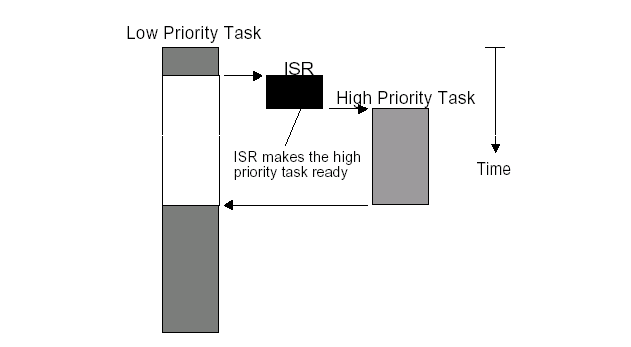

<!-- @import "[TOC]" {cmd="toc" depthFrom=1 depthTo=6 orderedList=false} -->

<!-- code_chunk_output -->

- [1 前景回顾](#1-前景回顾)
  - [1.1 Linux 的调度器组成](#11-linux-的调度器组成)
    - [1.1.1 2 个调度器](#111-2-个调度器)
    - [1.1.2 6 种调度策略](#112-6-种调度策略)
    - [1.1.3 5 个调度器类](#113-5-个调度器类)
    - [1.1.4 3 个调度实体](#114-3-个调度实体)
  - [1.2 主调度器与内核/用户抢占](#12-主调度器与内核用户抢占)
    - [1.2.1 调度过程中关闭内核抢占](#121-调度过程中关闭内核抢占)
    - [1.2.2 调度完成检查 need\_resched 看是否需要重新调度](#122-调度完成检查-need_resched-看是否需要重新调度)
- [2 非抢占式和可抢占式内核](#2-非抢占式和可抢占式内核)
  - [2.1 非抢占式内核](#21-非抢占式内核)
  - [2.2 抢占式内核](#22-抢占式内核)
- [3 linux 用户抢占](#3-linux-用户抢占)
  - [3.1 linux 用户抢占](#31-linux-用户抢占)
  - [3.2 need\_resched 标识](#32-need_resched-标识)
  - [3.3 用户抢占的发生时机(什么时候需要重新调度 need\_resched)](#33-用户抢占的发生时机什么时候需要重新调度-need_resched)
- [4 linux 内核抢占](#4-linux-内核抢占)
  - [4.1 内核抢占的概念](#41-内核抢占的概念)
  - [4.2 为什么 linux 需要内核抢占](#42-为什么-linux-需要内核抢占)
  - [4.3 内核抢占的发生时机](#43-内核抢占的发生时机)
- [5 内核抢占的实现](#5-内核抢占的实现)
  - [5.1 内核如何跟踪它能否被抢占?](#51-内核如何跟踪它能否被抢占)
  - [5.2 内核如何知道是否需要抢占?](#52-内核如何知道是否需要抢占)
    - [5.2.1 重新启用内核抢占时使用 preempt\_schedule 检查抢占](#521-重新启用内核抢占时使用-preempt_schedule-检查抢占)
    - [5.2.2 中断之后返回内核态时通过 preempt\_schedule\_irq 触发](#522-中断之后返回内核态时通过-preempt_schedule_irq-触发)
    - [5.2.3 PREEMPT\_ACTIVE 标识位和 PREEMPT\_DISABLE\_OFFSET](#523-preempt_active-标识位和-preempt_disable_offset)
- [6 总结](#6-总结)
  - [6.1 用户抢占](#61-用户抢占)
  - [6.2 内核抢占](#62-内核抢占)

<!-- /code_chunk_output -->

前面我们了解了 linux 进程调度器的设计思路和注意框架

- 周期调度器 scheduler\_tick 通过**linux 定时器周期性的被激活**, 进行程序调度

- 进程**主动放弃 CPU 或者发生阻塞**时, 则会调用主调度器 schedule 进行程序调度

在分析的过程中, 我们提到了内核抢占和用户抢占的概念, 但是并没有详细讲, 因此我们在这里详细分析一下子

CPU 抢占分两种情况, **用户抢占**, **内核抢占**

其中内核抢占是在 Linux2.5.4 版本发布时加入, 同 SMP(Symmetrical Multi-Processing, 对称多处理器), 作为**内核的可选配置**.

# 1 前景回顾

## 1.1 Linux 的调度器组成

### 1.1.1 2 个调度器

可以用**两种方法来激活调度**

- 一种是**直接的**, 比如**进程打算睡眠**或出于**其他原因放弃 CPU**

- 另一种是通过**周期性的机制**, 以**固定的频率运行**, 不时的检测是否有必要

因此当前**linux 的调度程序**由**两个调度器组成**:

- **主调度器**

- **周期性调度器**

两者又统称为**通用调度器(generic scheduler)**或**核心调度器(core scheduler)**

并且**每个调度器**包括两个内容: **调度框架**(其实质就是**两个函数框架**)及**调度器类**

### 1.1.2 6 种调度策略

linux 内核目前实现了**6 种调度策略(即调度算法**), 用于对不同类型的进程进行调度,或者支持某些特殊的功能

- **SCHED\_NORMAL**和**SCHED\_BATCH**调度**普通的非实时进程**

- **SCHED\_FIFO**和**SCHED\_RR**和**SCHED\_DEADLINE**则采用不同的调度策略**调度实时进程**

- **SCHED\_IDLE**则在**系统空闲时调用 idle 进程**.

### 1.1.3 5 个调度器类

而依据其调度策略的不同实现了**5 个调度器类**,一个调度器类可以用**一种或者多种调度策略**调度某一类进程, 也可以用于特殊情况或者调度特殊功能的进程.

其所属进程的优先级顺序为
```c
stop_sched_class -> dl_sched_class -> rt_sched_class -> fair_sched_class -> idle_sched_class
```

### 1.1.4 3 个调度实体

调度器**不限于调度进程**, 还可以调度更大的实体, 比如实现**组调度**.

这种一般性要求**调度器不直接操作进程**,而是**处理可调度实体**,因此需要一个通用的数据结构描述这个调度实体,即**seched\_entity 结构**,其实际上就代表了一个**调度对象**, 可以为**一个进程**, 也可以为**一个进程组**.

linux 中针对当前**可调度的实时**和**非实时进程**, 定义了类型为**seched\_entity 的 3 个调度实体**

- **sched\_dl\_entity** 采用**EDF 算法调度的实时调度实体**

- **sched\_rt\_entity** 采用**Roound-Robin 或者 FIFO 算法调度的实时调度实体**

- **sched\_entity** 采用 CFS 算法调度的**普通非实时进程的调度实体**

## 1.2 主调度器与内核/用户抢占

### 1.2.1 调度过程中关闭内核抢占

我们在分析主调度器的时候,我们会发现内核在进行**调度之前**都会通过**preempt\_disable**关闭内核抢占, 而在**完成调度**工作后, 又会重新**开启内核抢占**

```
do {
    preempt_disable();                  /*  关闭内核抢占 */
    __schedule(false);                  /*  完成调度 */
    sched_preempt_enable_no_resched();  /*  开启内核抢占 */
} while (need_resched());  /* 如果该进程被其他进程设置了 TIF_NEED_RESCHED 标志, 则函数重新执行进行调度   */
```

这个很容易理解, 我们在内核**完成调度器过程中**,这时候**如果**发生了**内核抢占**, 我们的**调度会被中断**,而**调度却还没有完成**,这样会**丢失我们调度的信息**.

### 1.2.2 调度完成检查 need\_resched 看是否需要重新调度

在调度完成后,内核会去判断 need\_resched 条件,如果这个时候为真,内核会重新进程一次调度.

这个的原因, 我们在前一篇博客中, 也已经说的很明白了,

内核在 thread\_info 的 flag 中设置了一个标识来标志进程是否需要重新调度, 即重新调度 need\_resched 标识 TIF\_NEED\_RESCHED,内核在即将返回用户空间时会检查标识 TIF\_NEED\_RESCHED 标志进程是否需要重新调度, 如果设置了, 就会发生调度, 这被称为**用户抢占**

# 2 非抢占式和可抢占式内核

为了简化问题, 我使用嵌入式实时系统 uC/OS 作为例子

首先要指出的是, **uC/OS 只有内核态**, 没有用户态, 这和 Linux 不一样

**多任务系统**中, 内核负责管理各个任务, 或者说为每个任务分配 CPU 时间, 并且负责任务之间的通讯.

内核提供的基本服务是任务切换. 调度(Scheduler),英文还有一词叫**dispatcher**, 也是调度的意思.

这是内核的主要职责之一, 就是要决定该轮到哪个任务运行了.**多数实时内核**是基于**优先级调度算法**的,每个任务根据其重要程度的不同被赋予一定的优先级.基于优先级的调度法指, CPU 总是让处在就绪态的优先级最高的任务先运行. 然而, 究竟何时让高优先级任务掌握 CPU 的使用权,有两种不同的情况,这要看用的是什么类型的内核, 是**不可剥夺型**的还是**可剥夺型内核**

## 2.1 非抢占式内核

**非抢占式内核**是**由任务主动放弃 CPU 的使用权**

非抢占式调度法也称作**合作型多任务**,各个任务彼此合作共享一个 CPU.**异步事件**还是由**中断服务**来处理.**中断服务**可以使一个**高优先级的任务**由**挂起状态**变为**就绪状态**.

但**中断服务以后**控制权还是回到原来被中断了的那个任务,直到**该任务主动放弃 CPU 的使用权**时, 那个高优先级的任务才能获得 CPU 的使用权. 非抢占式内核如下图所示.


**非抢占式内核**的优点有

- **中断响应快**(与抢占式内核比较);

- **允许使用不可重入函数**;

- 几乎不需要使用信号量保护共享数据,运行的任务占有 CPU, 不必担心被别的任务抢占. 这不是绝对的, 在打印机的使用上, 仍需要满足互斥条件.

非抢占式内核的缺点有

- 任务响应时间慢. 高优先级的任务已经进入就绪态, 但还不能运行, 要等到当前运行着的任务释放 CPU.
- 非抢占式内核的任务级响应时间是不确定的, 不知道什么时候最高优先级的任务才能拿到 CPU 的控制权, 完全取决于应用程序什么时候释放 CPU.

## 2.2 抢占式内核

使用抢占式内核可以**保证系统响应时间**.最高优先级的任务一旦就绪,总能得到 CPU 的使用权. 当一个运行着的任务使一个比它优先级高的任务进入了就绪态,**当前任务**的 CPU 使用权就会被剥夺, 或者说**被挂起**了, 那个**高优先级的任务**立刻得到了**CPU 的控制权**. 如果是中断服务子程序使一个高优先级的任务进入就绪态, 中断完成时, 中断了的任务被挂起, 优先级高的那个任务开始运行.

抢占式内核如下图所示



抢占式内核的优点有

- 使用抢占式内核, 最高优先级的任务什么时候可以执行, 可以得到 CPU 的使用权是可知的. 使用抢占式内核使得任务级响应时间得以最优化.

抢占式内核的缺点有:

- **不能直接使用不可重入型函数**. 调用不可重入函数时, 要满足互斥条件, 这点可以使用互斥型信号量来实现. 如果调用不可重入型函数时, 低优先级的任务 CPU 的使用权被高优先级任务剥夺, 不可重入型函数中的数据有可能被破坏.

# 3 linux 用户抢占

## 3.1 linux 用户抢占

当**内核即将返回用户空间时**,内核会检查 need\_resched 是否设置,如果设置,则调用 schedule(), 此时, 发生**用户抢占**.

## 3.2 need\_resched 标识

**内核如何检查一个进程是否需要被调度**呢?

内核在**即将返回用户空间**时**检查进程是否需要重新调度**, 如果设置了, 就会**发生调度**, 这被称为**用户抢占**, 因此**内核在 thread\_info**的**flag**中设置了**一个标识来标志**进程是否需要**重新调度**, 即重新调度 need\_resched 标识 TIF\_NEED\_RESCHED**

并提供了一些设置可检测的函数

| 函数 | 描述 | 定义 |
| ------- |:-------|:-------|
| set\_tsk\_need\_resched | 设置指定进程中的 need\_resched 标志 | [include/linux/sched.h, L2920](http://lxr.free-electrons.com/source/include/linux/sched.h?v=4.6#L2920) |
| clear\_tsk\_need\_resched | 清除指定进程中的 need\_resched 标志 | [include/linux/sched.h, L2926](http://lxr.free-electrons.com/source/include/linux/sched.h?v=4.6#L2931) |
| test\_tsk\_need\_resched | 检查指定进程 need\_resched 标志 | [include/linux/sched.h, L2931](http://lxr.free-electrons.com/source/include/linux/sched.h?v=4.6#L2931) |

而我们内核中调度时常用的**need\_resched**()函数**检查进程是否需要被重新调度**其实就是通过 test\_tsk\_need\_resched 实现的, 其定义如下所示

```c
// http://lxr.free-electrons.com/source/include/linux/sched.h?v=4.6#L3093
static __always_inline bool need_resched(void)
{
 return unlikely(tif_need_resched());
}

// http://lxr.free-electrons.com/source/include/linux/thread_info.h?v=4.6#L106
#define tif_need_resched() test_thread_flag(TIF_NEED_RESCHED)
```

## 3.3 用户抢占的发生时机(什么时候需要重新调度 need\_resched)

一般来说, 用户抢占发生几下情况:

- 从**系统调用返回用户空间**;

- 从**中断(异常)处理程序返回用户空间**

从这里我们可以看到, **用户抢占**是发生在**用户空间的抢占现象**.

**更详细的触发条件如下所示**, 其实不外乎就是前面所说的两种情况: **从系统调用或者中断返回用户空间**

1. **时钟中断处理例程**检查**当前任务的时间片**, 当任务的**时间片消耗完**时, scheduler\_tick()函数就会设置 need\_resched 标志;

2. **信号量**、**等待队列**、**completion 等机制唤醒**时都是**基于 waitqueue**的, 而**waitqueue 的唤醒**函数为**default\_wake\_function**, 其调用**try\_to\_wake\_up**将**被唤醒的任务更改为就绪状态**并设置 need\_resched 标志.

3. **设置用户进程的 nice 值**时, 可能会使高优先级的任务进入就绪状态;

4. **改变任务的优先级**时, 可能会使高优先级的任务进入就绪状态;

5. **新建一个任务**时, 可能会使高优先级的任务进入就绪状态;

6. **对 CPU(SMP)进行负载均衡**时, 当前任务可能需要放到另外一个 CPU 上运行

# 4 linux 内核抢占

## 4.1 内核抢占的概念

对比用户抢占, 顾名思义, 内核抢占就是指一个在**内核态运行的进程**,可能在执行内核函数期间被另一个进程取代.

## 4.2 为什么 linux 需要内核抢占

linux 系统中,进程在**系统调用后返回用户态之前**,或者是**内核中某些特定的点上**,都会**调用调度器**.这确保**除了一些明确指定的情况**之外, **内核是无法中断的(！！！**), 这不同于用户进程.

如果**内核处于相对耗时的操作**中,比如**文件系统**或者**内存管理相关的任务**,这种行为可能会带来问题.这种情况下,内核代替特定的进程执行相当长的时间,而其他进程无法执行,无法调度,这就造成了**系统的延迟增加**,用户体验到"缓慢"的响应.比如如果多媒体应用长时间无法得到 CPU, 则可能发生视频和音频漏失现象.

在编译内核时如果启用了对**内核抢占**的支持, 则可以解决这些问题. 如果**高优先级进程**有事情需要完成, 那么在启用了**内核抢占**的情况下, 不仅用户空间应用程序可以被中断, 内核也可以被中断

linux 内核抢占是在 Linux2.5.4 版本发布时加入的, 尽管使内核可抢占需要的改动特别少, 但是该机制不像抢占用户空间进程那样容易实现. 如果内核无法一次性完成某些操作(例如, 对数据结构的操作), 那么可能出现静态条件而使得系统不一致.

**内核抢占**和**用户层进程被其他进程抢占**是两个不同的概念,**内核抢占**主要是**从实时系统中引入**的, 在**非实时系统中的确也能提高系统的响应速度**,但也不是在所有情况下都是最优的, 因为**抢占也需要调度和同步开销**, 在**某些情况下甚至要关闭内核抢占**,比如前面我们将主调度器的时候,linux 内核在**完成调度的过程中是关闭了内核抢占(！！！**)的.

**内核不能在任意点被中断**,幸运的是,**大多数不能中断的点已经被 SMP 实现标识出来了**.并且在实现内核抢占时可以重用这些信息. 如果内核可以被抢占, 那么单处理器系统也会像是一个 SMP 系统

## 4.3 内核抢占的发生时机

要满足什么条件, kernel 才可以抢占**一个任务的内核态**呢?

- **没持有锁**. 锁是用于保护临界区的, 不能被抢占.

- **Kernel code 可重入(reentrant**). 因为 kernel 是 SMP-safe 的, 所以满足可重入性.

**内核抢占发生的时机**, 一般发生在:

1. 当从**中断处理程序正在执行**, 且**返回内核空间之前**. 当**一个中断处理例程退出**, 在返回到内核态时(kernel-space). 这是**隐式的调用 schedule**()函数, 当前任务没有主动放弃 CPU 使用权, 而是**被剥夺了 CPU 使用权**.

2. 当**内核代码再一次具有可抢占性**的时候, 如**解锁(spin\_unlock\_bh)及使能软中断(local\_bh\_enable)等**, 此时当 kernel code 从不可抢占状态变为可抢占状态时(preemptible again). 也就是 preempt\_count 从正整数变为 0 时. 这也是隐式的调用 schedule()函数

3. 如果**内核中的任务显式的调用 schedule**(), 任务主动放弃 CPU 使用权

4. 如果**内核中的任务阻塞**(这同样也会导致调用 schedule()),导致需要调用 schedule()函数. 任务**主动放弃 CPU 使用权**

内核抢占, 并不是在任何一个地方都可以发生, **以下情况不能发生**

1. **内核正进行中断处理**. 在 Linux 内核中**进程不能抢占中断(中断只能被其他中断中止、抢占, 进程不能中止、抢占中断！！！**), 在中断例程中不允许进行**进程调度**. **进程调度函数 schedule()会对此作出判断**, 如果是在中断中调用, 会打印出错信息.

2. 内核正在进行**中断上下文的 Bottom Half(中断下半部, 即软中断)处理**. **硬件中断返回前会执行软中断(！！！**), 此时仍然处于中断上下文中. 如果此时正在执行其它软中断, 则不再执行该软中断.

3. **内核的代码段**正持有**spinlock 自旋锁、writelock/readlock 读写锁等锁**, 处干这些锁的保护状态中. 内核中的这些锁是为了在 SMP 系统中短时间内保证不同 CPU 上运行的进程并发执行的正确性. 当持有这些锁时, 内核不应该被抢占.

4. 内核**正在执行调度程序 Scheduler**. 抢占的原因就是为了进行新的调度, 没有理由将调度程序抢占掉再运行调度程序.

5. 内核**正在对每个 CPU"私有"的数据结构操作(Per-CPU date structures**). 在 SMP 中, 对于**per-CPU 数据结构未用 spinlocks 保护**, 因为这些数据结构隐含地被保护了(不同的 CPU 有不一样的 per-CPU 数据, **其他 CPU 上运行的进程不会用到另一个 CPU 的 per-CPU 数据**). 但是如果**允许抢占**, 但**一个进程被抢占后重新调度**, 有**可能调度到其他的 CPU 上去(！！！**), 这时定义的 Per-CPU 变量就会有问题, 这时应禁抢占.

# 5 内核抢占的实现

## 5.1 内核如何跟踪它能否被抢占?

前面我们提到了, 系统中每个进程都有一个特定于体系结构的 struct thread\_info 结构,**用户层程序被调度**的时候会检查 struct thread\_info 中的**need\_resched 标识 TLF\_NEED\_RESCHED**标识来**检查自己是否需要被重新调度**.

自然**内核抢占**也可以应用同样的方法被实现, linux 内核在 thread\_info 结构中添加了一个**自旋锁标识 preempt\_count**, 称为**抢占计数器(preemption counter)**.

```c
struct thread_info
{
 /*  ......  */
 int preempt_count;  /* 0 => preemptable, <0 => BUG */
    /*  ......  */
}
```

| preempt\_count 值 | 描述 |
| ------- |:-------|
| 大于 0 | **禁止内核抢占**, 其值标记了**使用 preempt\_count 的临界区的数目** |
| 0 | **开启内核抢占** |
| 小于 0 | 锁为负值, 内核出现错误 |

内核自然也提供了一些函数或者宏, 用来**开启, 关闭以及检测抢占计数器 preempt\_count 的值**, 这些通用的函数定义在[include/asm-generic/preempt.h](http://lxr.free-electrons.com/source/include/asm-generic/preempt.h?v=4.6#L8), 而**某些架构也定义了自己的接口**,  比如 x86 架构[/arch/x86/include/asm/preempt.h](http://lxr.free-electrons.com/source/arch/x86/include/asm/preempt.h?v=4.6)

| 函数 | 描述 | 定义 |
| ------- |:-------|:-------|
| preempt\_count | 获取当前 current 进程抢占计数器的值 | [include/asm\-generic/preempt.h, line 8](http://lxr.free-electrons.com/source/include/asm-generic/preempt.h?v=4.6#L8) |
| preempt\_count\_ptr | 返回指向当前 current 进程的抢占计数器的指针 | [include/asm\-generic/preempt.h, line 13](http://lxr.free-electrons.com/source/include/asm-generic/preempt.h?v=4.6#L13) |
| preempt\_count\_set | 重设当前 current 进程的抢占计数器 | [include/asm\-generic/preempt.h, line 18](http://lxr.free-electrons.com/source/include/asm-generic/preempt.h?v=4.6#L18) |
| init\_task\_preempt\_count | 初始化 task 的抢占计数器为 FORK\_PREEMPT\_COUNT | [include/asm\-generic/preempt.h, line 26](http://lxr.free-electrons.com/source/include/asm-generic/preempt.h?v=4.6#L26) |
| init\_idle\_preempt\_count | 初始化 task 的抢占计数器为 PREEMPT\_ENABLED | [include/asm\-generic/preempt.h, line 30](http://lxr.free-electrons.com/source/include/asm-generic/preempt.h?v=4.6#L30) |
|  preempt\_count\_add | 将增加 current 的抢占计数器增加 val | [include/linux/preempt.h, line 132](http://lxr.free-electrons.com/source/include/linux/preempt.h?v=4.6#L32) |
| preempt\_count\_sub | 将增加 current 的抢占计数器减少 val | [include/linux/preempt.h, line 133](http://lxr.free-electrons.com/source/include/linux/preempt.h?v=4.6#L133) |
| preempt\_count\_dec\_and\_test | 将 current 的抢占计数器减少 1, 然后看是否可以进程内核抢占, 即检查抢占计数器是否为 0(允许抢占), 同时检查 tif_need_resched 标识是否为真 | [include/linux/preempt.h, line 134, 61](http://lxr.free-electrons.com/source/include/linux/preempt.h?v=4.6#L134) |
| preempt\_count\_inc | current 的抢占计数器增加 1 |  [include/linux/preempt.h, line 140](http://lxr.free-electrons.com/source/include/linux/preempt.h?v=4.6#L140) |
| preempt\_count\_dec | current 的抢占计数器减少 1 |  [include/linux/preempt.h, line 141](http://lxr.free-electrons.com/source/include/linux/preempt.h?v=4.6#L141) |

还有其他函数可用于**开启和关闭内核抢占**

| 函数 | 描述 | 定义 |
| ------- |:-------|:-------|
| preempt\_disable | 通过 preempt\_count\_inc 来**停用内核抢占**,并且通过**路障 barrier 同步**来避免编译器的优化 | [include/linux/preempt.h, line 145](http://lxr.free-electrons.com/source/include/linux/preempt.h?v=4.6#L145) |
| preempt\_enable | preempt\_count\_dec\_and\_test 启用内核抢占, 然后通过\_\_preempt\_schedule 检测是够有必要进行调度 | [include/linux/preempt.h, line 162](http://lxr.free-electrons.com/source/include/linux/preempt.h?v=4.6#L162) |
| preempt\_enable\_no\_resched | 开启抢占, 但是不进行重调度 | [include/linuxc/preempt.h, line 151](http://lxr.free-electrons.com/source/include/linux/preempt.h?v=4.6#L151) |
| preempt\_check\_resched | 调用\_\_preempt\_schedule 检测是够有必要进行调度 | [include/linux/preempt.h, line 176](http://lxr.free-electrons.com/source/include/linux/preempt.h?v=4.6#L176) |
| should\_resched | 检查 current 的抢占计数器是否为参数 preempt\_offset 的值, 同时检查 tif\_need\_resched 是否为真 | [include/linux/preempt.h, line 74](http://lxr.free-electrons.com/source/include/linux/preempt.h?v=4.6#L74) |
| preemptible | 检查是否可以内核抢占, 检查抢占计数器是否为 0, 以及是否停用了中断 | [/include/linux/preempt.h, line159](http://lxr.free-electrons.com/source/include/linux/preempt.h?v=4.6#L159) |

## 5.2 内核如何知道是否需要抢占?

**首先**必须**设置了 TLF\_NEED\_RESCHED 标识**来通知内核**有进程在等待得到 CPU 时间**,然后会**判断抢占计数器 preempt\_count 是否为 0**, 这个工作往往通过**preempt\_check\_resched**或者其相关来实现

### 5.2.1 重新启用内核抢占时使用 preempt\_schedule 检查抢占

在**内核停用抢占后重新启用时**, **检测是否有进程打算抢占当前执行的内核代码**, 是一个比较好的时机, 如果是这样, 应该尽快完成, 则无需等待下一次对调度器的例行调用.

**抢占机制**中主要的函数是**preempt\_schedule**,设置了 TIF\_NEED\_RESCHED 标志并**不能保证可以抢占内核**, 内核**可能处于临界区**, 不能被干扰

```c
//  http://lxr.free-electrons.com/source/kernel/sched/core.c?v=4.6#L3307

/*
 * this is the entry point to schedule() from in-kernel preemption
 * off of preempt_enable. Kernel preemptions off return from interrupt
 * occur there and call schedule directly.
 */
asmlinkage __visible void __sched notrace preempt_schedule(void)
{
    /*
     * If there is a non-zero preempt_count or interrupts are disabled,
     * we do not want to preempt the current task. Just return..
     */
     /* !preemptible() => preempt_count() != 0 || irqs_disabled()
      * 如果抢占计数器大于 0, 那么抢占被停用, 该函数立即返回
      * 如果
     */
    if (likely(!preemptible()))
        return;

    preempt_schedule_common();
}
NOKPROBE_SYMBOL(preempt\_schedule);
EXPORT_SYMBOL(preempt\_schedule);

// http://lxr.free-electrons.com/source/include/linux/preempt.h?v=4.6#L159
 #define preemptible()   (preempt_count() == 0 && !irqs_disabled())
```

>!preemptible => preempt\_count() != 0 || irqs\_disabled()表明

- 如果**抢占计数器大于 0**, 那么**抢占仍然是被停用**的, 因此内核不能被打断, 该**函数立即结束**.

- 如果**在某些重要的点上内核停用了硬件中断**,以保证一次性完成相关的处理,那么抢占也是不可能的.**irqs\_disabled 会检测是否停用了中断**. 如果**已经停用, 则内核不能被抢占**

接着如果**可以被抢占**, 则执行如下步骤

```c
static void __sched notrace preempt_schedule_common(void)
{
    do {
     /*
         preempt_disable_notrace 定义在
         http://lxr.free-electrons.com/source/include/linux/preempt.h?v=4.6#L198    等待于__preempt_count_inc();增加抢占计数器
        */
        preempt_disable_notrace();
        /*  完成一次调度  */
        __schedule(true);

        /*
         preempt_enable_no_resched_notrace
         http://lxr.free-electrons.com/source/include/linux/preempt.h?v=4.6#L204
            等价于__preempt_count_dec;减少抢占计数器
        */
        preempt_enable_no_resched_notrace();

        /*
         * Check again in case we missed a preemption opportunity
         * between schedule and now.
         * 再次检查, 以免在__scheudle 和当前点之间错过了抢占的时机
         */
    } while (need_resched());
}
```

我们可以看到, 内核在**增加了抢占计数器的计数**后, 用\_\_schedule 进行了一次调度, 参数传入**preempt = true**, 表明**调度不是以普通的方式引发的,而是由于内核抢占**.在内核重调度之后,代码**流程回到当前进程**, 那么就将**抢占计数器减少 1**.

### 5.2.2 中断之后返回内核态时通过 preempt\_schedule\_irq 触发

上面**preempt\_schedule**只是**触发内核抢占的一种方法**,另一种**激活抢占**的方式是在**处理了一个硬件中断请求之后**. 如果处理器在**处理中断请求后返回内核态(返回用户态则没有影响**),特定体系结构的汇编例程会**检查抢占计数器是否为 0**,即**是否允许抢占**,以及**是否设置了重调度标识**,**类似于 preempt\_schedule**的处理.如果**两个条件都满足(！！！**)则通过**preempt\_schedule\_irq 调用调度器**,此时**表明抢占请求发自中断上下文**

该函数**与 preempt\_schedule 的本质区别**在于:preempt\_schedule\_irq 调用时**停用了中断**,**防止终端造成的递归调用**, 其定义在[kernel/sched/core.c, line3360](http://lxr.free-electrons.com/source/kernel/sched/core.c?v=4.6#L3360)

```c
/*
 * this is the entry point to schedule() from kernel preemption
 * off of irq context.
 * Note, that this is called and return with irqs disabled. This will
 * protect us against recursive calling from irq.
 */
asmlinkage __visible void __sched preempt_schedule_irq(void)
{
    enum ctx_state prev_state;

    /* Catch callers which need to be fixed */
    BUG_ON(preempt_count() || !irqs_disabled());

    prev_state = exception_enter();

    do {
        preempt_disable();
        local_irq_enable();
        __schedule(true);
        local_irq_disable();
        sched_preempt_enable_no_resched();
    } while (need_resched());

    exception_exit(prev_state);
}
```

### 5.2.3 PREEMPT\_ACTIVE 标识位和 PREEMPT\_DISABLE\_OFFSET

**之前的内核**版本中, 抢占计数器中于一个**标识位 PREEMPT\_ACTIVE**,**这个位设置后即标识了可以进行内核抢占**, 使得 preempt\_count 有一个很大的值, 这样就不受普通的抢占计数器加 1 操作的影响了

>PREEMPT\_ACTIVE 的引入, 参见[PREEMPT_ACTIVE: add default defines](https://lkml.org/lkml/2009/7/20/19)

```c
//  http://lxr.free-electrons.com/source/include/linux/preempt.h?v=4.3#L58
#define PREEMPT_ACTIVE_BITS     1
#define PREEMPT_ACTIVE_SHIFT    (NMI_SHIFT + NMI_BITS)
#define PREEMPT_ACTIVE  (__IRQ_MASK(PREEMPT_ACTIVE_BITS) << PREEMPT_ACTIVE_SHIFT)
```

然后也为其提供了一些置位的函数, 其实就是**将 preempt\_count 加上/减去一个很大的数**, 参见[preempt: Disable preemption from preempt_schedule*() callers](https://lkml.org/lkml/2015/5/11/519)

但是在 linux-4.4 版本之后移除了这个标志, 取而代之的是在 linux-4.2 时引入的**PREEMPT\_DISABLE\_OFFSET**

>参见
>
>[Rename PREEMPT_CHECK_OFFSET to PREEMPT_DISABLE_OFFSET](https://lkml.org/lkml/2015/5/11/517)
>[ preempt: Rename PREEMPT_CHECK_OFFSET to PREEMPT_DISABLE_OFFSET](http://marc.info/?l=linux-kernel&m=143144178020323)
>
>[preempt: Remove PREEMPT_ACTIVE unmasking off in_atomic()](https://lkml.org/lkml/2015/5/11/521)
>
>[sched: Kill PREEMPT_ACTIVE](https://lkml.org/lkml/2015/9/30/108)
>
>[sched: Stop setting PREEMPT_ACTIVE](https://lkml.org/lkml/2015/9/29/224)

>参考
>
>[内核随记(二)——内核抢占与中断返回](http://www.cnblogs.com/hustcat/archive/2009/08/31/1557507.html)
>
>[PREEMPT_ACTIVE](http://www.cnblogs.com/openix/archive/2013/03/09/2952041.html)

# 6 总结

一般来说, **CPU 在任何时刻都处于以下三种情况之一(！！！**):

1. 运行于**用户空间**, 执行**用户进程**

2. 运行于**内核空间**, 处于**进程上下文**

3. 运行于**内核空间**, 处于**中断上下文**

## 6.1 用户抢占

一般来说, 当**进程**从**系统调用**或者从**中断(异常)处理程序**返回**用户空间时会触发主调度器**进行用户抢占

- 从系统调用返回用户空间

- 从中断(异常)处理程序返回用户空间

为了对一个进程需要被调度进行标记,内核在 thread\_info 的 flag 中设置了一个标识来标志进程是否需要重新调度, 即重新调度 need\_resched 标识 TIF\_NEED\_RESCHED,内核在即将返回用户空间时会检查标识 TIF\_NEED\_RESCHED 标志进程是否需要重新调度, 如果设置了, 就会发生调度, 这被称为**用户抢占**

## 6.2 内核抢占

如果内核处于相对耗时的操作中, 比如文件系统或者内存管理相关的任务,这种行为可能会带来问题.这种情况下, 内核代替特定的进程执行相当长的时间,而其他进程无法执行,无法调度,这就造成了系统的延迟增加,用户体验到"缓慢"的响应. 因此 linux 内核引入了内核抢占.

linux 内核通过在 thread\_info 结构中添加了一个**自旋锁标识 preempt\_count**,称为**抢占计数器(preemption counter**)来作为内核抢占的标记,

**内核抢占的触发大致也是两类**, 内核抢占关闭后重新开启时, 中断返回内核态时

- 内核**重新开启内核抢占**时使用**preempt\_schedule**检查内核抢占

- **中断之后返回内核态**时通过**preempt\_schedule\_irq**触发内核抢占

而内核抢占时, 通过调用\_\_schedule(true)传入的 preempt=true 来通知内核, 这是一个内核抢占