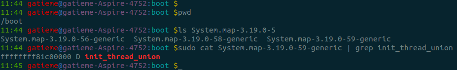

<!-- @import "[TOC]" {cmd="toc" depthFrom=1 depthTo=6 orderedList=false} -->

<!-- code_chunk_output -->

- [3 个特殊的进程](#3-个特殊的进程)
  - [idle 进程](#idle-进程)
  - [init 进程](#init-进程)
  - [kthreadd](#kthreadd)
- [idle 的创建](#idle-的创建)
  - [0 号进程上下文信息(init_task 描述符)](#0-号进程上下文信息init_task-描述符)
    - [进程堆栈 init_thread_union](#进程堆栈-init_thread_union)
    - [进程内存空间](#进程内存空间)
- [0 号进程的演化](#0-号进程的演化)
  - [rest_init 创建 init 进程(PID=1)和 kthread 进程(PID=2)](#rest_init-创建-init-进程pid1和-kthread-进程pid2)
    - [创建 kernel_init](#创建-kernel_init)
    - [创建 kthreadd](#创建-kthreadd)
  - [0 号进程演变为 idle](#0-号进程演变为-idle)
- [idle 的运行与调度](#idle-的运行与调度)
  - [idle 的 workload--cpu_idle_loop](#idle-的-workload-cpu_idle_loop)
  - [idle 的调度和运行时机](#idle-的调度和运行时机)
- [idle 进程总结](#idle-进程总结)
- [附录:rest_init 的执行解析](#附录rest_init-的执行解析)

<!-- /code_chunk_output -->

# 3 个特殊的进程

Linux 下有**3 个特殊的进程**, **idle**进程(`PID = 0`), init 进程(`PID = 1`)和**kthreadd**(`PID = 2`)

## idle 进程

idle 进程由 **系统自动创建**, 运行在**内核态**

进程 `pid = 0`, 其前身是**系统创建的第一个进程**, 也是**唯一一个**没有通过 `fork` 或者 `kernel_thread` 产生的进程.

完成加载系统后, 演变为**进程调度、交换**

## init 进程

init 进程由 **idle** 通过 `kernel_thread` 创建, 在**内核空间！！！完成初始化后**, 加载 **init 程序**, 并最终**用户空间**

由 **0 进程创建**, 完成**系统的初始化**. 是系统中**所有其它用户进程(！！！)的祖先进程**. Linux 中的**所有进程**都是有**init 进程创建并运行**的. 首先 Linux 内核启动, 然后**在用户空间中启动 init 进程**, 再**启动其他系统程**. 在**系统启动完成后**, **init**将变为**守护进程监视系统其他进程**

## kthreadd

kthreadd 进程由 **idle** 通过 `kernel_thread` 创建, 并始终运行在**内核空间**, 负责所有**内核线程(内核线程！！！)的调度和管理**

它的任务就是 **管理和调度其他内核线程** `kernel_thread`, 会**循环执行**一个**kthread 的函数**, 该函数的作用就是运行 **kthread\_create\_list 全局链表**中维护 kthread, 当我们调用 **kernel\_thread 创建的内核线程**会被**加入到此链表中**, 因此 **kthreadd 为父进程**

我们下面就详解分析 0 号进程的前世(`init_task`)今生(idle)

# idle 的创建

在**smp 系统**中, **每个处理器单元**有**独立的一个运行队列**, 而**每个运行队列**上又**有一个 idle 进程**, 即**有多少处理器单元**, 就**有多少 idle 进程**.

idle 进程其 `pid=0`, 其前身是系统创建的第一个进程, 也是唯一一个没有通过 `fork()` 产生的进程. 在 smp 系统中, **每个处理器单元**有独立的一个**运行队列**, 而**每个运行队列**上又有一个 **idle 进程**, 即有多少处理器单元, 就有多少 idle 进程. **系统的空闲时间**, 其实就是**指 idle 进程的"运行时间**". 既然是 idle 是进程, 那我们来看看 idle 是如何被创建, 又具体做了哪些事情?

我们知道系统是从 BIOS 加电自检, 载入 MBR 中的引导程序(`LILO/GRUB`), 再加载 linux 内核开始运行的, 一直到指定 shell 开始运行告一段落, 这时用户开始操作 Linux.

## 0 号进程上下文信息(init_task 描述符)

**init_task** 是内核中所有进程、线程的 `task_struct` 雏形, 在内核初始化过程中, 通过**静态定义**构造出了一个 `task_struct` 接口, 取名为 **init\_task**, 然后在**内核初始化的后期**, 通过**rest\_init**() 函数新建了**内核 init 线程, kthreadd 内核线程**

- **内核 init 线程**, 最终**执行 /sbin/init 进程**, 变为**所有用户态程序的根进程(pstree 命令显示**), 即**用户空间的 init 进程**

**开始的 init**是有 kthread\_thread 创建的**内核线程**, 他在**完成初始化工作后**, 转向**用户空间**, 并且生成**所有用户进程的祖先**

- **内核 kthreadd 内核线程**, 变为**所有内核态其他守护线程的父线程**.

它的任务就是**管理和调度其他内核线程 kernel\_thread**, 会循环执行一个 kthread 的函数, 该函数的作用就是运行 `kthread_create_list` 全局链表中维护的 kthread, 当我们调用 `kernel_thread` 创建的内核线程会被加入到此链表中, 因此**所有的内核线程**都是直接或者间接的以 kthreadd 为父进程


所以 **init\_task 决定了系统所有进程、线程的基因,它完成初始化后,最终演变为 0 号进程 idle,并且运行在内核态**

内核在初始化过程中, 当创建完 init 和 kthreadd 内核线程后, 内核会发生**调度执行**, 此时内核将使用该 init\_task 作为其 task\_struct 结构体描述符, 当**系统无事可做**时, 会**调度其执行**, 此时**该内核会变为 idle 进程, 让出 CPU, 自己进入睡眠, 不停的循环**, 查看**init\_task 结构体**, 其**comm 字段为 swapper**, 作为 idle 进程的**描述符**.

>idle 的运行时机
>
>idle **进程优先级**为 `MAX_PRIO - 20`.
>
>* **早先版本**中, **idle 是参与调度**的, 所以**将其优先级设低点**, 当**没有其他进程可以运行**时, 才会调度执行 idle;
>
>* **目前的版本**中, idle 并**不在运行队列中参与调度**, 而是在**运行队列结构中含 idle 指针**, 指向**idle 进程**, 在调度器发现**运行队列为空的时候运行**, 调入运行

简言之, **内核中 init\_task 变量就是是进程 0 使用的进程描述符**, 也是 Linux 系统中第一个进程描述符, **init\_task** 并**不是系统通过 kernel\_thread 的方式**(当然**更不可能是 fork**)创建的, 而是由内核**静态创建**的.

该进程的描述符在 `init/init_task.c` 中定义, 代码片段如下

```c
/* Initial task structure */
struct task_struct init_task = INIT_TASK(init_task);
EXPORT_SYMBOL(init_task);
```

**init\_task 描述符**使用**宏 INIT\_TASK**对 `init_task` 的**进程描述符进行初始化**, 宏 `INIT_TASK` 在[include/linux/init_task.h](http://lxr.free-electrons.com/source/include/linux/init_task.h?v=4.5#L186)文件中

init\_task 是 Linux 内核中的**第一个线程**, 它贯穿于整个 Linux 系统的初始化过程中, 该进程也是 Linux 系统中唯一一个没有用 kernel\_thread()函数创建的内核态进程(内核线程)

在**init\_task 进程执行后期**, 它会**调用 kernel\_thread**()函数创建**第一个核心进程 kernel\_init**, 同时 init\_task 进程**继续对 Linux 系统初始化**. 在**完成初始化后**, **init\_task**会**退化为 cpu_idle 进程**, 当**Core 0**的**就绪队列**中**没有其它进程**时, 该进程将会**获得 CPU 运行**. **新创建的 1 号进程 kernel\_init 将会逐个启动次 CPU**,并**最终创建用户进程**！

备注: **core 0**上的**idle 进程**由**init\_task 进程退化**而来, 而**AP 的 idle 进程**则是**BSP 在后面调用 fork()函数逐个创建**的

### 进程堆栈 init_thread_union

init\_task 进程使用**init\_thread\_union**数据结构**描述的内存区域**作为**该进程的堆栈空间**, 并且**和自身的 thread\_info**参数**共用这一内存空间空间**,

>请参见 http://lxr.free-electrons.com/source/include/linux/init_task.h?v=4.5#L193
>
>         .stack          = &init_thread_info,


而**init\_thread\_info**则是一段**体系结构相关的定义**, 被定义**在[/arch/对应体系/include/asm/thread_info.h**]中, 但是他们大多数为如下定义

```c
#define init_thread_info        (init_thread_union.thread_info)
#define init_stack              (init_thread_union.stack)
```

其中**init\_thread\_union**被定义在 init/init\_task.c

```c
/*
 * Initial thread structure. Alignment of this is handled by a special
 * linker map entry.
 */
union thread_union init_thread_union __init_task_data =
        { INIT_THREAD_INFO(init_task) };
```

我们可以发现 init\_task 是用 INIT\_THREAD\_INFO 宏进行初始化的,这个才是我们**真正体系结构相关的部分**,他与 init\_thread\_info 定义在一起, 被定义在[/arch/对应体系/include/asm/thread_info.h](http://lxr.free-electrons.com/ident?v=4.5;i=INIT_THREAD_INFO)中, 以下为[x86 架构的定义](http://lxr.free-electrons.com/source/arch/x86/include/asm/thread_info.h?v=4.5#L65)

> 参见
>
> http://lxr.free-electrons.com/source/arch/x86/include/asm/thread_info.h?v=4.5#L65

```c
#define INIT_THREAD_INFO(tsk)                   \
{                                               \
    .task           = &tsk,                 \
    .flags          = 0,                    \
    .cpu            = 0,                    \
    .addr_limit     = KERNEL_DS,            \
}
```

>其他体系结构的定义请参见
>
>[/arch/对应体系/include/asm/thread_info.h](http://lxr.free-electrons.com/ident?v=4.5;i=INIT_THREAD_INFO)中

| 架构 | 定义 |
| ------------- |:-------------:|
| x86 | [arch/x86/include/asm/thread_info.h](http://lxr.free-electrons.com/source/arch/x86/include/asm/thread_info.h?v=4.5#L65) |
| arm64 | [arch/arm64/include/asm/thread_info.h](http://lxr.free-electrons.com/source/arch/arm64/include/asm/thread_info.h?v=4.5#L55) |

init\_thread\_info 定义中**的\_\_init\_task\_data**表明该内核栈所在的区域**位于内核映像的 init data 区**, 我们可以通过**编译完内核后**所产生的**System.map**来看到该变量及其对应的逻辑地址

```
cat System.map-3.1.6 | grep init_thread_union
```



### 进程内存空间

**init\_task**的**虚拟地址空间**, 也采用同样的方法被定义

由于 init\_task 是一个**运行在内核空间的内核线程**,因此**其虚地址段 mm 为 NULL**,但是必要时他还是**需要使用虚拟地址**的, 因此**avtive\_mm 被设置为 init\_mm**

> 参见
>
> http://lxr.free-electrons.com/source/include/linux/init_task.h?v=4.5#L202

```cpp
.mm             = NULL,                                         \
.active_mm      = &init_mm,                                     \
```
其中 init\_mm 被定义为 init\-mm.c 中, 参见 http://lxr.free-electrons.com/source/mm/init-mm.c?v=4.5#L16

```cpp
struct mm_struct init_mm = {
    .mm_rb          = RB_ROOT,
    .pgd            = swapper_pg_dir,
    .mm_users       = ATOMIC_INIT(2),
    .mm_count       = ATOMIC_INIT(1),
    .mmap_sem       = __RWSEM_INITIALIZER(init_mm.mmap_sem),
    .page_table_lock =  __SPIN_LOCK_UNLOCKED(init_mm.page_table_lock),
    .mmlist         = LIST_HEAD_INIT(init_mm.mmlist),
    INIT_MM_CONTEXT(init_mm)
};
```

# 0 号进程的演化

## rest_init 创建 init 进程(PID=1)和 kthread 进程(PID=2)

Linux 在**无进程概念的情况下**将一直从初始化部分的代码执行到 `start_kernel`, 然后再到其**最后一个函数** `rest_init`

大致是在 vmlinux 的入口 `startup_32`(`head.S`)中为 pid 号为 0 的原始进程设置了执行环境, 然后**原始进程开始执行 start\_kernel**()完成 Linux 内核的初始化工作. 包括初始化页表, 初始化中断向量表, 初始化系统时间等.

从**rest\_init**开始, Linux 开始**产生进程**, 因为 init\_task 是静态制造出来的, pid=0, 它试图将**从最早的汇编代码**一直到**start\_kernel 的执行**都纳入到**init\_task 进程上下文**中.

这个**函数**其实是由**0 号进程执行**的, 他就是在这个函数中, 创建了**init 进程**和**kthreadd**进程

代码如下:

```cpp
// init/main.c
static noinline void __init_refok rest_init(void)
{
 int pid;

 rcu_scheduler_starting();
 smpboot_thread_init();

    /*
  * We need to spawn init first so that it obtains pid 1, however
  * the init task will end up wanting to create kthreads, which, if
  * we schedule it before we create kthreadd, will OOPS.
  */
 kernel_thread(kernel_init, NULL, CLONE_FS);
 numa_default_policy();
 pid = kernel_thread(kthreadd, NULL, CLONE_FS | CLONE_FILES);
 rcu_read_lock();
 kthreadd_task = find_task_by_pid_ns(pid, &init_pid_ns);
 rcu_read_unlock();
 complete(&kthreadd_done);

 /*
  * The boot idle thread must execute schedule()
  * at least once to get things moving:
  */
 init_idle_bootup_task(current);
 schedule_preempt_disabled();
 /* Call into cpu_idle with preempt disabled */
 cpu_startup_entry(CPUHP_ONLINE);
}
```

1. 调用 `kernel_thread()` 创建 **1 号内核线程**, 该线程**随后转向用户空间**, 演变为**init 进程**

2. 调用 `kernel\_thread()` 创建**kthreadd 内核线程**.

3. `init_idle_bootup_task()`: **当前 0 号进程** init_task 最终会**退化成 idle 进程**, 所以这里调用 `init_idle_bootup_task()` 函数, 让**init\_task 进程隶属到 idle 调度类**中. 即选择 idle 的调度相关函数.

4. 调用 `schedule()` 函数**切换当前进程**, 在**调用该函数之前**, Linux 系统中**只有两个进程**, 即 **0 号进程 init\_task** 和 **1 号进程 kernel\_init**, 其中 `kernel_init` 进程也是刚刚被创建的. **调用该函数后, 1 号进程 kernel_init 将会运行**！

5. 调用 `cpu_idle()`, 0 号线程进入 idle 函数的循环, 在该循环中会周期性地检查.

### 创建 kernel_init

在 rest\_init 函数中, 内核将通过下面的代码**产生第一个真正的进程(pid=1**):

```c
kernel_thread(kernel_init, NULL, CLONE_FS);
```

这个进程就是著名的 pid 为 1 的 init 进程, 它会继续完成剩下的初始化工作, 然后 execve(/sbin/init),成为系统中的其他所有进程的祖先.

但是这里我们发现一个问题,**init 进程**应该是一个**用户空间的进程**,但是这里却是**通过 kernel\_thread 的方式创建的**, 哪岂不是式一个永远运行在内核态的内核线程么,它是**怎么演变为真正意义上用户空间的 init 进程**的?

**1 号 kernel\_init 进程**完成**linux 的各项配置(包括启动 AP**)后, 就会**在/sbin,/etc,/bin 寻找 init 程序**来运行. **该 init 程序会替换 kernel\_init 进程**(注意: 并**不是创建一个新的进程来运行 init 程序**, 而是一次变身, **使用 sys\_execve 函数**改变**核心进程的正文段**, 将核心进程 kernel\_init**转换成用户进程 init**), 此时处于内核态的 1 号 kernel\_init 进程将会转换为用户空间内的 1 号进程 init. **用户进程 init**将**根据/etc/inittab**中提供的信息**完成应用程序的初始化调用**. 然后**init 进程会执行/bin/sh 产生 shell 界面**提供给用户来**与 Linux 系统进行交互**.
>
>调用 init_post()创建用户模式 1 号进程.

关于 init 其他的信息我们这次先不研究, 因为我们这篇旨在探究 0 号进程的详细过程,

### 创建 kthreadd

在 rest\_init 函数中, 内核将通过下面的代码产生**第一个 kthreadd(pid=2**)

```c
pid = kernel_thread(kthreadd, NULL, CLONE_FS | CLONE_FILES);
```

它的任务就是**管理和调度其他内核线程**kernel\_thread,会循环执行一个 kthread 的函数, 该函数的作用就是运行 kthread\_create\_list 全局链表中维护的 kthread,当我们调用 kernel\_thread 创建的内核线程会被加入到此链表中, 因此所有的内核线程都是直接或者间接的以 kthreadd 为父进程

## 0 号进程演变为 idle

```cpp
 init_idle_bootup_task(current);
 schedule_preempt_disabled();
 /* Call into cpu_idle with preempt disabled */
 cpu_startup_entry(CPUHP_ONLINE);
```

因此我们回过头来看 pid=0 的进程, 在**创建了 init 进程后**, pid=0 的进程**调用 cpu\_idle**()演变成了 **idle 进程**.

0 号进程首先执行 `init_idle_bootup_task`, **让 init_task 进程隶属到 idle 调度类中**. 即选择 idle 的调度相关函数.

```cpp
// kernel/sched/core.c
void init_idle_bootup_task(struct task_struct *idle)
{
    idle->sched_class = &idle_sched_class;
}
```

接着通过 `schedule_preempt_disabled` 来**执行调用 schedule() 函数切换当前进程**, 在调用该函数之前, Linux 系统中只有两个进程, 即 **0 号进程 init_task** 和 **1 号进程 kernel\_init**, 其中 `kernel_init` 进程也是刚刚被创建的. **调用该函数**后, **1 号进程 kernel_init 将会运行**

```cpp
// kernel/sched/core.c
/**
* schedule_preempt_disabled - called with preemption disabled
*
* Returns with preemption disabled. Note: preempt_count must be 1
*/
void __sched schedule_preempt_disabled(void)
{
 sched_preempt_enable_no_resched();
 schedule();
 preempt_disable();
}
```

最后 `cpu_startup_entry` 调用 `cpu_idle_loop()`, 0 号线程进入 idle 函数的循环, 在该循环中会周期性地检查

```cpp
// kernel/sched/idle.c
void cpu_startup_entry(enum cpuhp_state state)
{
    arch_cpu_idle_prepare();
    cpuhp_online_idle(state);
    while (1)
    do_idle();
}
```

`arch_cpu_idle_prepare()` 是一个可选接口, x86 并没有实现, 核心还是 `do_idle()`.


整个过程简单的说就是, **原始进程(pid=0**)创建 **init 进程(pid=1**),然后演化成 **idle 进程(pid=0**). **init 进程**为**每个从处理器(运行队列**)创建出一个 **idle 进程(pid=0**), 然后演化成 `/sbin/init`.

# idle 的运行与调度

## idle 的 workload--cpu_idle_loop

从上面的分析我们知道, **idle**在系统**没有其他就绪的进程可执行**的时候才会**被调度**. 不管是**主处理器**, 还是**从处理器**, 最后都是执行的 `do_idle()` 函数

其中 `cpu_idle_loop` 就是**idle 进程的事件循环**, 定义在 `kernel/sched/idle.c`, **早期的版本**中提供的是 `cpu_idle`, 但是**这个函数是完全依赖于体系结构**的, 不利用架构的分层, 因此在新的内核中更新为更加通用的 `cpu_idle_loop`, 由他来**调用体系结构相关的代码**

因为**idle 进程**中并不执行什么有意义的任务, 所以通常考虑的是两点

1. **节能**

2. **低退出延迟**.

其代码如下

```cpp
// kernel/sched/idle.c
/*
 * Generic idle loop implementation
 *
 * Called with polling cleared.
 */
static void do_idle(void)
{
 int cpu = smp_processor_id();

 /*
  * Check if we need to update blocked load
  */
 nohz_run_idle_balance(cpu);

 /*
  * If the arch has a polling bit, we maintain an invariant:
  *
  * Our polling bit is clear if we're not scheduled (i.e. if rq->curr !=
  * rq->idle). This means that, if rq->idle has the polling bit set,
  * then setting need_resched is guaranteed to cause the CPU to
  * reschedule.
  */

 __current_set_polling();
 tick_nohz_idle_enter();

 while (!need_resched()) {
  rmb();

  local_irq_disable();

  if (cpu_is_offline(cpu)) {
   tick_nohz_idle_stop_tick();
   cpuhp_report_idle_dead();
   arch_cpu_idle_dead();
  }

  arch_cpu_idle_enter();
  rcu_nocb_flush_deferred_wakeup();

  /*
   * In poll mode we reenable interrupts and spin. Also if we
   * detected in the wakeup from idle path that the tick
   * broadcast device expired for us, we don't want to go deep
   * idle as we know that the IPI is going to arrive right away.
   */
        // 在启动时强制 idle 模式为 poll
  if (cpu_idle_force_poll || tick_check_broadcast_expired()) {
   tick_nohz_idle_restart_tick();
   cpu_idle_poll();
  } else {
            // 真正的 idle 函数
   cpuidle_idle_call();
  }
  arch_cpu_idle_exit();
 }

 /*
  * Since we fell out of the loop above, we know TIF_NEED_RESCHED must
  * be set, propagate it into PREEMPT_NEED_RESCHED.
  *
  * This is required because for polling idle loops we will not have had
  * an IPI to fold the state for us.
  */
 preempt_set_need_resched();
 tick_nohz_idle_exit();
 __current_clr_polling();

 /*
  * We promise to call sched_ttwu_pending() and reschedule if
  * need_resched() is set while polling is set. That means that clearing
  * polling needs to be visible before doing these things.
  */
 smp_mb__after_atomic();

 /*
  * RCU relies on this call to be done outside of an RCU read-side
  * critical section.
  */
 flush_smp_call_function_queue();
 schedule_idle();

 if (unlikely(klp_patch_pending(current)))
  klp_update_patch_state(current);
}
```

**循环判断 need\_resched 以降低退出延迟**, 用 **idle()来节能**.

**默认的 idle 实现是 hlt 指令**, hlt 指令**使 CPU 处于暂停状态**, 等待**硬件中断发生的时候恢复**, 从而达到节能的目的. 即**从处理器 C0 态变到 C1 态**(见**ACPI 标准**). 这也是早些年 windows 平台上各种"处理器降温"工具的主要手段. 当然 idle 也可以是在别的 ACPI 或者 APM 模块中定义的, 甚至是自定义的一个 idle(比如说 nop).

1. idle 是一个进程, 其 pid 为 0.

2. **主处理器上的 idle 由原始进程(pid=0)演变**而来. **从处理器**上的 idle 由**init 进程 fork 得到**, 但是它们的**pid 都为 0**.

3. Idle 进程为最低优先级, 且不参与调度, 只是在运行队列为空的时候才被调度.

4. Idle **循环等待 need_resched 置位**. **默认使用 hlt 节能**.

在 smp 系统中 core0 以外的其它 core 也会通过 `start_secondary` 函数最终产生 0 号进程且调用 `cpu_startup_entry` 来进入 idle loop 之中.

## idle 的调度和运行时机

我们知道, linux 进程的**调度顺序**是按照**rt 实时进程(rt 调度器),normal 普通进程(cfs 调度器), 和 idle**的顺序来调度的

那么可以试想**如果 rt 和 cfs 都没有可以运行**的任务, 那么**idle 才可以被调度**, 那么他是通过**怎样的方式实现**的呢?

由于我们还没有讲解调度器的知识, 所有我们只是简单讲解一下

在**normal 的调度类,cfs 公平调度器**sched\_fair.c 中, 我们可以看到

```cpp
static const struct sched_class fair_sched_class = {
    .next = &idle_sched_class,
```

也就是说, 如果**系统中没有普通进程**, 那么会**选择下个调度类优先级的进程**, 即**使用 idle\_sched\_class 调度类进行调度的进程**

当**系统空闲**的时候, 最后就是**调用 idle 的 pick\_next\_task 函数**, 被定义在/kernel/sched/idle\_task.c 中

>参见
>
>http://lxr.free-electrons.com/source/kernel/sched/idle_task.c?v=4.5#L27

```c
static struct task_struct *pick_next_task_idle(struct rq *rq)
{
        schedstat_inc(rq, sched_goidle);
        calc_load_account_idle(rq);
        return rq->idle;    //可以看到就是返回 rq 中 idle 进程.
}
```

这**idle 进程**在**启动 start\_kernel 函数**的时候**调用 init\_idle 函数**的时候, 把**当前进程(0 号进程**)置为**每个 rq 运行队列的的 idle**上.

```
rq->curr = rq->idle = idle;
```

这里 idle 就是调用 start\_kernel 函数的进程, 就是**0 号进程**.

# idle 进程总结

系统允许一个进程创建新进程, 新进程即为子进程, 子进程还可以创建新的子进程, 形成进程树结构模型. 整个 linux 系统的所有进程也是一个树形结构. **树根是系统自动构造的(或者说是由内核黑客手动创建的)**, 即**在内核态下执行的 0 号进程**, 它是**所有进程的远古先祖**.

在 smp 系统中, 每个处理器单元有独立的一个运行队列, 而每个运行队列上又有一个 idle 进程, 即**有多少处理器单元, 就有多少 idle 进程**.

1. idle 进程其 pid=0, 其前身是系统创建的第一个进程(我们称之为 init\_task), 也是**唯一一个没有通过 fork 或者 kernel\_thread 产生的进程**.

2. **init\_task**是内核中所有进程、线程的 task\_struct 雏形, 它是在内核初始化过程中, 通过静态定义构造出了一个 task\_struct 接口, 取名为 init\_task, 然后在内核初始化的后期, 在 rest\_init()函数中通过 kernel\_thread 创建了两个内核线程**内核 init 线程, kthreadd 内核线程**,前者后来通过演变, 进入用户空间, 成为所有用户进程的先祖,而后者则成为所有内核态其他守护线程的父线程, 负责接手内核线程的创建工作

3. 然后 init\_task 通过变更调度类为 sched_idle 等操作演变成为**idle 进程**, 此时系统中只有 0(idle), 1(init), 2(kthreadd)3 个进程, 然后执行一次进程调度, 必然**切换当前进程到到 init**

# 附录:rest_init 的执行解析

| rest_init 流程 | 说明 |
| ------------- |:-------------|
| rcu\_scheduler\_starting | 启动 Read\-Copy Update,会调用 num\_online\_cpus 确认目前只有 bootstrap 处理器在运作,以及调用 nr\_context\_switches 确认在启动 RCU 前,没有进行过 Contex\-Switch,最后就是设定 rcu\_scheduler\_active=1 启动 RCU 机制. RCU 在多核心架构下,不同的行程要读取同一笔资料内容/结构,可以提供高效率的同步与正确性. 在这之后就可以使用 rcu\_read\_lock/rcu\_read\_unlock 了 |
| 产生 Kernel Thread kernel\_init | Kernel Thread 函式 kernel\_init 实例在 init/main.c 中, init Task PID=1,是内核第一个产生的 Task. 产生后,会阻塞在 wait\_for\_completion 处,等待 kthreadd\_done Signal,以便往后继续执行下去. |
|产生 Kernel Thread kthreadd | Kernel Thread 函式 kthreadd 实例在 kernel/kthread.c 中, kthreadd Task PID=2,是内核第二个产生的 Task. |
| find\_task\_by\_pid\_ns | 实例在 kernel/pid.c 中,调用函数 find\_task\_by\_pid\_ns,并传入参数 kthreadd 的 PID 2 与 PID NameSpace (struct pid\_namespace init\_pid\_ns)取回 PID 2 的 Task Struct. |
| complete | 实例在 kernel/sched.c 中, 会发送 kthreadd\_done Signal,让 kernel\_init(也就是 init task)可以往后继续执行. |
| init\_idle\_bootup\_task | 实例在 kernel/sched.c 中, 设定目前启动的 Task 为 IDLE Task.(idle\->sched\_class = &idle\_sched\_class), 而 struct sched\_class idle\_sched\_class 的定义在 kernel/sched\_idletask.c 中.在**Linux 下 IDLETask 并不占用 PID(也可以把它当作是 PID 0**),每个处理器都会有这样的 IDLE Task,用来在没有行程排成时,让处理器掉入执行的.而最基础的省电机制,也可透过 IDLE Task 来进行. (包括让系统可以关闭必要的周边电源与 Clock Gating). |
| schedule\_preempt\_disabled(); | 启动一次 Linux Kernel Process 的排成 Context\-Switch 调度机制, 从而使得 kernel\_init 即 1 号进程获得处理机 |
| cpu\_startup\_entry | 完成工作后, 调用 cpu\_idle\_loop()使得 idle 进程进入自己的事件处理循环 |