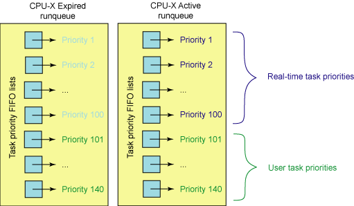
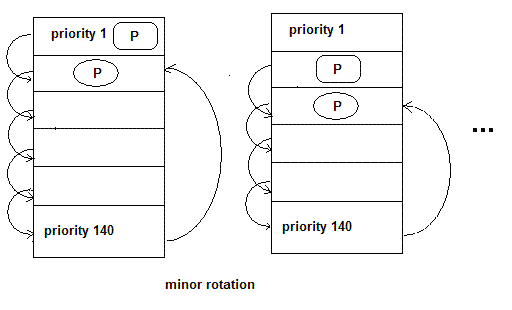

<!-- @import "[TOC]" {cmd="toc" depthFrom=1 depthTo=6 orderedList=false} -->

<!-- code_chunk_output -->

- [1 前言](#1-前言)
  - [1.1 进程调度](#11-进程调度)
  - [1.2 进程的分类](#12-进程的分类)
  - [1.3 不同进程采用不同的调度策略](#13-不同进程采用不同的调度策略)
  - [1.4 linux 调度器的演变](#14-linux-调度器的演变)
- [2 O(n)的始调度算法](#2-on的始调度算法)
  - [2.1 Linux2.4 之前的内核调度器](#21-linux24-之前的内核调度器)
  - [2.2 Linux2.4 的调度器](#22-linux24-的调度器)
    - [2.2.1 概述](#221-概述)
    - [2.2.2 详情](#222-详情)
- [3 O(1)的调度算法](#3-o1的调度算法)
  - [3.1 概述](#31-概述)
  - [3.2 详情](#32-详情)
    - [3.2.1 普通进程的优先级计算](#321-普通进程的优先级计算)
    - [3.2.2 实时进程的优先级计算](#322-实时进程的优先级计算)
    - [3.2.3 pick next 算法](#323-pick-next-算法)
- [4 Linux 2.6 的新一代调度器 CFS](#4-linux-26-的新一代调度器-cfs)
  - [4.1 楼梯调度算法 staircase scheduler(SD)](#41-楼梯调度算法-staircase-schedulersd)
  - [4.2 RSDL(Rotating Staircase Deadline Scheduler)](#42-rsdlrotating-staircase-deadline-scheduler)
  - [4.3 完全公平的调度器 CFS](#43-完全公平的调度器-cfs)
    - [4.3.1 CFS 如何实现 pick next](#431-cfs-如何实现-pick-next)
    - [4.3.2 tick 中断](#432-tick-中断)
    - [4.3.3 红黑树键值计算](#433-红黑树键值计算)
    - [4.3.4 调度器管理器](#434-调度器管理器)
    - [4.3.5 CFS 组调度](#435-cfs-组调度)
- [5 返璞归真的 Linux BFS 调度器](#5-返璞归真的-linux-bfs-调度器)
  - [5.1 BFS 的引入](#51-bfs-的引入)
  - [5.2 可配置型调度器的需求](#52-可配置型调度器的需求)
  - [5.3 问题在哪?](#53-问题在哪)
  - [5.4 回到 O(n)调度器](#54-回到-on调度器)
  - [5.5 BFS 调度器的原理](#55-bfs-调度器的原理)
  - [5.6 BFS 调度器初始版本的链表的非 O(n)遍历](#56-bfs-调度器初始版本的链表的非-on遍历)
  - [5.7 pick-next 算法](#57-pick-next-算法)
  - [5.8 去除了小手段的 BFS 调度器](#58-去除了小手段的-bfs-调度器)
  - [5.9 队列外部执行](#59-队列外部执行)
  - [5.10 结论](#510-结论)

<!-- /code_chunk_output -->

# 1 前言

## 1.1 进程调度

内存中保存了对每个进程的唯一描述, 并通过若干结构与其他进程连接起来.

**调度器**面对的情形就是这样, 其任务是在程序之间共享 CPU 时间, 创造并行执行的错觉, 该任务分为两个不同的部分, 其中一个涉及**调度策略**, 另外一个涉及**上下文切换**.

## 1.2 进程的分类

linux 把进程区分为**实时进程**和**非实时进程**, 其中**非实时进程**进一步划分为交互式进程和批处理进程

| 类型 | 描述 | 示例 |
| ------- |:-------|:-------|
| 交互式进程(interactive process) | 此类进程经常与用户进行交互, 因此需要花费很多时间等待键盘和鼠标操作. 当接受了用户的输入后, 进程必须很快被唤醒, 否则用户会感觉系统反应迟钝 | shell, 文本编辑程序和图形应用程序 |
| 批处理进程(batch process) | 此类进程不必与用户交互, 因此经常在后台运行. 因为这样的进程不必很快相应, 因此常受到调度程序的怠慢 | 程序语言的编译程序, 数据库搜索引擎以及科学计算 |
| 实时进程(real-time process) | 这些进程由很强的调度需要, 这样的进程绝不会被低优先级的进程阻塞. 并且他们的响应时间要尽可能的短 | 视频音频应用程序, 机器人控制程序以及从物理传感器上收集数据的程序|

在 linux 中, 调度算法可以明确的确认所有实时进程的身份, 但是没办法区分交互式程序和批处理程序, linux2.6 的调度程序实现了基于进程过去行为的启发式算法, 以确定进程应该被当做交互式进程还是批处理进程. 当然与批处理进程相比, 调度程序有偏爱交互式进程的倾向

## 1.3 不同进程采用不同的调度策略

根据进程的不同分类 Linux 采用不同的调度策略.

对于**实时进程**, 采用**FIFO**或者**Round Robin**的调度策略.

对于**普通进程**, 则需要**区分交互式和批处理式**的不同. **传统 Linux 调度器**提高**交互式应用的优先级**, 使得它们能更快地被调度. 而**CFS 和 RSDL**等新的调度器的核心思想是"**完全公平**". 这个设计理念不仅大大简化了调度器的代码复杂度, 还对各种调度需求的提供了更完美的支持.

注意 Linux 通过将进程和线程调度视为一个, 同时包含二者. 进程可以看做是单个线程, 但是进程可以包含共享一定资源(代码和/或数据)的多个线程. 因此进程调度也包含了线程调度的功能.

目前**实时进程的调度策略**比较简单,因为实时进程值只要求尽可能快的被响应,**基于优先级**,每个进程根据它重要程度的不同被赋予不同的优先级, 调度器在**每次调度**时,总选择**优先级最高的进程**开始执行.低优先级不可能抢占高优先级, 因此**FIFO**或者**Round Robin**的调度策略即可满足**实时进程调度**的需求.

但是**普通进程的调度策略**就比较麻烦了, 因为普通进程**不能简单的只看优先级**,必须**公平的占有 CPU**, 否则**很容易出现进程饥饿**,这种情况下用户会感觉操作系统很卡,响应总是很慢, 因此在 linux 调度器的发展历程中经过了多次重大变动, linux 总是希望寻找一个最接近于完美的调度策略来公平快速的调度进程.

## 1.4 linux 调度器的演变

一开始的调度器是复杂度为**O(n)的始调度算法**(实际上每次会遍历所有任务, 所以复杂度为 O(n)), 这个算法的缺点是当内核中有很多任务时, 调度器本身就会耗费不少时间, 所以, 从 linux2.5 开始引入赫赫有名的**O(1)调度器**

然而, linux 是集全球很多程序员的聪明才智而发展起来的超级内核, 没有最好, 只有更好, 在$O(1)$调度器风光了没几天就又被另一个更优秀的调度器取代了, 它就是**CFS 调度器 Completely Fair Scheduler**.这个也是在 2.6 内核中引入的, 具体为 2.6.23, 即从此版本开始, 内核使用 CFS 作为它的默认调度器, $O(1)$调度器被抛弃了.

所以完全有理由相信, 后续如果再会出现一个更优秀的调度器, CFS 也不会幸免. 因为 linux 只要最好的那个.

# 2 O(n)的始调度算法

## 2.1 Linux2.4 之前的内核调度器

早期的 Linux 进程调度器使用了最低的设计, 它显然不关注具有很多处理器的大型架构, 更不用说是超线程了.

Linux 调度器使用了**环形队列**用于可运行的任务管理, 使用循环调度策略.

此调度器添加和删除进程效率很高(具有保护结构的锁). 简而言之, 该调度器并不复杂但是简单快捷.

Linux 版本 2.2 引入了调度类的概念, 允许针对实时任务、非抢占式任务、非实时任务的调度策略. 调度器还包括对称多处理 (SMP) 支持.

## 2.2 Linux2.4 的调度器

### 2.2.1 概述

在 Linux2.4.18 中(linux-2.5)之前的内核,当很多任务都处于活动状态时,调度器有很明显的限制.这是由于调度器是使用一个**复杂度为 O(n)的算法**实现的.

调度器采用基于**优先级**的设计, 这个调度器和 Linus 在 1992 年发布的调度器没有大的区别. 该**调度器的 pick next 算法**非常简单: 对**runqueue 中所有进程**的**优先级**进行依次进行比较, 选择**最高优先级的进程**作为下一个被调度的进程. (Runqueue 是 Linux 内核中保存所有就绪进程的队列). pick next 用来指从所有候选进程中挑选下一个要被调度的进程的过程.

这种调度算法非常简单易懂: 在**每次进程切换**时,内核扫描**可运行进程的链表**,计算**优先级**,然后选择"**最佳"进程**来运行.

在这种调度器中, 调度任务所花费的时间是一个系统中任务个数的函数.换而言之,活动的任务越多,调度任务所花费的时间越长.在**任务负载非常重**时,处理器会因**调度消耗掉大量的时间**,用于任务本身的时间就非常少了. 因此, 这个**算法缺乏可伸缩性**

### 2.2.2 详情

每个进程被创建时都被**赋予一个时间片**. **时钟中断递减当前运行进程的时间片**, 当进程的**时间片被用完**时, 它必须等待**重新赋予时间片**才能有机会运行. Linux2.4 调度器保证只有当**所有 RUNNING 进程的时间片都被用完**之后, 才**对所有进程重新分配时间片**. 这段时间被称为一个**epoch**. 这种设计**保证了每个进程都有机会得到执行**. **每个 epoch**中, **每个进程**允许执行到其**时间切片用完**. 如果**某个进程**没有使用其所有的时间切片, 那么**剩余时间切片的一半**将被添加到**新时间切片**使其在**下个 epoch**中可以**执行更长时间**. 调度器只是迭代进程, 应用 goodness 函数(指标)决定下面执行哪个进程. 当然, 各种进程对调度的需求并不相同, **Linux 2.4 调度器**主要依靠**改变进程的优先级**, 来**满足不同进程的调度需求**. 事实上, 所有后来的调度器都主要依赖修改进程优先级来满足不同的调度需求.

**实时进程**: 实时进程的**优先级是静态设定**的, 而且**始终大于普通进程**的优先级. 因此只有当 runqueue 中**没有实时进程**的情况下, **普通进程才能够获得调度**.

>实时进程采用两种调度策略, **SCHED\_FIFO** 和 **SCHED\_RR**
>
>**FIFO** 采用**先进先出**的策略, 对于**所有相同优先级**的进程, **最先进入** runqueue 的进程总能**优先获得调度**; **Round Robin**采用更加公平的**轮转策略**, 使得**相同优先级的实时进程能够轮流获得调度**.

**普通进程**: 对于普通进程, 调度器**倾向于提高交互式进程的优先级**, 因为它们需要快速的用户响应. **普通进程的优先级**主要由**进程描述符**中的**Counter 字段决定** (还要**加上 nice 设定的静态优先级**) . 进程被创建时**子进程的 counter 值**为**父进程 counter 值的一半**, 这样保证了**任何进程不能依靠不断地 fork() 子进程从而获得更多的执行机会**.

Linux2.4 调度器是**如何提高交互式进程的优先级**的呢?如前所述, 当**所有 RUNNING 进程的时间片被用完**之后, 调度器将**重新计算所有进程的 counter 值**, 所有进程**不仅包括 RUNNING 进程**, 也包括处于**睡眠状态的进程(！！！**). 处于**睡眠状态的进程**的 counter 本来就没有用完, 在重新计算时, 他们的 counter 值会**加上这些原来未用完的部分**, 从而**提高了它们的优先级**. **交互式进程**经常因**等待用户输入**而**处于睡眠状态**, 当它们重新被唤醒并进入 runqueue 时, 就会**优先于其它进程而获得 CPU**. 从用户角度来看, 交互式进程的响应速度就提高了.

该调度器的主要缺点:

- **可扩展性**不好

调度器**选择进程**时需要**遍历整个 runqueue**从中选出最佳人选, 因此该**算法的执行时间与进程数成正比**. 另外每次重新计算 counter 所花费的时间也会随着系统中进程数的增加而线性增长, 当进程数很大时, 更新 counter 操作的代价会非常高, 导致系统整体的性能下降.

- **高负载系统**上的**调度性能比较低**

2.4 的调度器预分配给**每个进程的时间片比较大**, 因此在**高负载的服务器**上, 该调度器的效率比较低, 因为**平均每个进程**的**等待时间**与**该时间片的大小成正比**.

- **交互式进程**的优化并不完善

Linux2.4 识别交互式进程的原理**基于以下假设**, 即**交互式进程比批处理进程更频繁地处于 SUSPENDED 状态**. 然而现实情况往往并非如此, **有些批处理进程**虽然没有用户交互, 但是也会**频繁地进行 IO 操作**, 比如一个数据库引擎在处理查询时会经常地进行磁盘 IO, 虽然它们并不需要快速地用户响应, 还是**被提高了优先级**. 当系统中**这类进程的负载较重**时, 会**影响真正的交互式进程的响应时间**.

- 对**实时进程**的支持不够

Linux2.4**内核是非抢占**的, 当**进程处于内核态时不会发生抢占**, 这对于真正的实时应用是不能接受的.

为了解决这些问题, Ingo Molnar 开发了新的 O(1)调度器, 在 CFS 和 RSDL 之前, 这个调度器不仅被 Linux2.6 采用, 还被 backport 到 Linux2.4 中, 很多商业的发行版本都采用了这个调度器

# 3 O(1)的调度算法

## 3.1 概述

由于进程**优先级的最大值为 139**, 因此 MAX\_PRIO 的最大值取 140(具体的是, **普通进程使用 100 到 139 的优先级**, **实时进程使用 0 到 99 的优先级**).

因此, 该调度算法为**每个优先级**都设置**一个可运行队列**,即**包含 140 个可运行状态的进程链表**, 每一条优先级链表上的进程都具有相同的优先级, 而不同进程链表上的进程都拥有不同的优先级.

除此之外, 还包括一个**优先级位图 bitmap**. 该位图使用**一个位(bit)来代表一个优先级**, 而**140 个优先级最少需要 5 个 32 位**来表示, 因此**只需要一个 int[5]就可以表示位图**, 该位图中的**所有位都被置 0**, 当**某个优先级的进程**处于**可运行状态**时, 该**优先级所对应的位就被置 1**.

如果确定了优先级, 那么选取下一个进程就简单了, 只需在 queue 数组中对应的链表上选取一个进程即可.

最后, 在**早期的内核**中, **抢占是不可能**的; 这意味着如果有一个低优先级的任务在执行, 高优先级的任务只能等待它完成.

## 3.2 详情

从名字就可以看出 O(1)调度器主要解决了以前版本中的扩展性问题.

O(1)调度算法所花费的时间为常数, 与当前系统中的进程个数无关.

此外 Linux 2.6 内核支持内核态抢占, 因此更好地支持了实时进程.

相对于前任, O(1)调度器还更好地区分了交互式进程和批处理式进程.

Linux 2.6 内核也支持三种调度策略. 其中 SCHED\_FIFO 和 SCHED\_RR 用于实时进程, 而 SCHED\_NORMAL 用于普通进程.

O(1)调度器在两个方面修改了 Linux 2.4 调度器, 一是进程优先级的计算方法; 二是 pick next 算法.

O(1)调度器跟踪运行队列中可运行的任务(实际上, 每个优先级水平有两个运行队列, 一个用于活动任务, 一个用于过期任务), 这意味着要确定接下来执行的任务, 调度器只需按优先级将下一个任务从特定活动的运行队列中取出即可.

### 3.2.1 普通进程的优先级计算

**不同类型的进程**应该有**不同的优先级**. 每个进程与生俱来(即**从父进程那里继承**而来)都有一个优先级, 我们将其称为**静态优先级**. **普通进程**的**静态优先级**范围从**100 到 139**, 100 为最高优先级, 139 为最低优先级, **0－99 保留给实时进程**. 当进程**用完了时间片**后, 系统就会为该进程**分配新的时间片(即基本时间片**), **静态优先级本质上决定了时间片分配的大小(！！！**).

**静态优先级和基本时间片(！！！**)的关系如下:

- 静态优先级\<120, 基本时间片=max((140\-静态优先级)\*20, MIN\_TIMESLICE)

- 静态优先级\>=120, 基本时间片=max((140\-静态优先级)\*5, MIN\_TIMESLICE)

其中**MIN\_TIMESLICE**为**系统规定的最小时间片**. 从该计算公式可以看出, **静态优先级越高(值越低**), 进程得到的**时间片越长**. 其结果是, 优先级高的进程会获得更长的时间片, 而优先级低的进程得到的时间片则较短.

进程除了拥有静态优先级外, 还有**动态优先级**, 其取值范围是**100 到 139**. 当调度程序**选择新进程运行**时就会使用进程的**动态优先级**, 动态优先级和静态优先级的关系可参考下面的公式:

>**动态优先级**=max(100 , min(静态优先级 \– bonus + 5) , 139)

从上面看出, **动态优先级**的生成是以**静态优先级为基础**, 再加上相应的**惩罚或奖励(bonus**). 这个 bonus 并不是随机的产生, 而是根据进程**过去的平均睡眠时间**做相应的惩罚或奖励.

所谓**平均睡眠时间**(sleep\_avg, 位于 task\_struct 结构中)就是进程在**睡眠状态所消耗的总时间数**, 这里的平均并不是直接对时间求平均数. 平均睡眠时间随着**进程的睡眠而增长**, 随着**进程的运行而减少**. 因此, 平均睡眠时间记录了进程睡眠和执行的时间, 它是用来判断**进程交互性强弱的关键数据**. 如果一个进程的**平均睡眠时间很大**, 那么它很可能是一个**交互性很强**的进程. 反之, 如果一个进程的**平均睡眠时间很小**, 那么它**很可能一直在执行**.

另外, **平均睡眠时间**也记录着进程**当前的交互状态**, 有很快的反应速度. 比如一个进程在某一小段时间交互性很强, 那么 sleep\_avg 就有可能暴涨(当然它不能超过 MAX\_SLEEP\_AVG), 但如果之后都一直处于执行状态, 那么 sleep\_avg 就又可能一直递减. 理解了平均睡眠时间, 那么 bonus 的含义也就显而易见了. **交互性强的进程会得到调度程序的奖励(bonus 为正**), 而那些**一直霸占 CPU 的进程会得到相应的惩罚(bonus 为负**). 其实 bonus 相当于平均睡眠时间的缩影, 此时只是将 sleep\_avg 调整成 bonus 数值范围内的大小. 可见**平均睡眠时间可以用来衡量进程是否是一个交互式进程**. 如果满足下面的公式, 进程就**被认为是一个交互式进程**:

>动态优先级≤3\*静态优先级/4 + 28

**平均睡眠时间**是进程处于**等待睡眠状态下的时间**, 该值在进程进入睡眠状态时增加, 而进入 RUNNING 状态后则减少. **该值的更新**时机分布在很多内核函数内: **时钟中断 scheduler\_tick**(); **进程创建**; 进程从**TASK\_INTERRUPTIBLE 状态唤醒**; **负载平衡**等.

### 3.2.2 实时进程的优先级计算

**实时进程的优先级**由**sys\_sched\_setschedule**()设置. 该值**不会动态修改**, 而且总是比普通进程的优先级高. 在**进程描述符中用 rt\_priority 域**表示.

### 3.2.3 pick next 算法

普通进程的调度选择算法基于进程的优先级, 拥有最高优先级的进程被调度器选中.

2.4 中, 时间片 counter 同时也表示了一个进程的优先级. 2.6 中时间片用任务描述符中的 time\_slice 域表示, 而优先级用 prio(普通进程)或者 rt\_priority(实时进程)表示. 调度器为每一个 CPU 维护了两个进程队列数组: 指向活动运行队列的 active 数组和指向过期运行队列的 expire 数组. 数组中的元素着保存某一优先级的进程队列指针. 系统一共有 140 个不同的优先级, 因此这两个数组大小都是 140. 它们是按照先进先出的顺序进行服务的. 被调度执行的任务都会被添加到各自运行队列优先级列表的末尾. 每个任务都有一个时间片, 这取决于系统允许执行这个任务多长时间. 运行队列的前 100 个优先级列表保留给实时任务使用, 后 40 个用于用户任务, 参见下图:



当需要选择当前最高优先级的进程时, 2.6 调度器不用遍历整个 runqueue, 而是直接从 active 数组中选择当前最高优先级队列中的第一个进程. 假设当前所有进程中最高优先级为 50(换句话说, 系统中没有任何进程的优先级小于 50). 则调度器直接读取 active[49], 得到优先级为 50 的进程队列指针. 该队列头上的第一个进程就是被选中的进程. 这种算法的复杂度为 O(1), 从而解决了 2.4 调度器的扩展性问题. 为了实现 O(1)算法 active 数组维护了一个由 5 个 32 位的字(140 个优先级)组成的 bitmap, 当某个优先级别上有进程被插入列表时, 相应的比特位就被置位.  sched\_find\_first\_bit()函数查询该 bitmap, 返回当前被置位的最高优先级的数组下标. 在上例中 sched\_find\_first\_bit 函数将返回 49. 在 IA 处理器上可以通过 bsfl 等指令实现. 可见查找一个任务来执行所需要的时间并不依赖于活动任务的个数, 而是依赖于优先级的数量. 这使得 2.6 版本的调度器成为一个复杂度为 O(1) 的过程, 因为调度时间既是固定的, 而且也不会受到活动任务个数的影响.

为了提高交互式进程的响应时间, O(1)调度器不仅动态地提高该类进程的优先级, 还采用以下方法: 每次时钟 tick 中断时, 进程的时间片(time\_slice)被减一. 当 time\_slice 为 0 时, 表示当前进程的时间片用完, 调度器判断当前进程的类型, 如果是交互式进程或者实时进程, 则重置其时间片并重新插入 active 数组. 如果不是交互式进程则从 active 数组中移到 expired 数组, 并根据上述公式重新计算时间片. 这样实时进程和交互式进程就总能优先获得 CPU. 然而这些进程不能始终留在 active 数组中, 否则进入 expire 数组的进程就会产生饥饿现象. 当进程已经占用 CPU 时间超过一个固定值后, 即使它是实时进程或者交互式进程也会被移到 expire 数组中. 当 active 数组中的所有进程都被移到 expire 数组中后, 调度器交换 active 数组和 expire 数组. 因此新的 active 数组又恢复了初始情况, 而 expire 数组为空, 从而开始新的一轮调度.

Linux 2.6 调度器改进了前任调度器的可扩展性问题, schedule()函数的时间复杂度为 O(1). 这取决于两个改进:

- pick next 算法借助于 active 数组, 无需遍历 runqueue;

- 消了定期更新所有进程 counter 的操作, 动态优先级的修改分布在进程切换, 时钟 tick 中断以及其它一些内核函数中进行.

O(1)调度器区分交互式进程和批处理进程的算法与以前虽大有改进, 但仍然在很多情况下会失效. 有一些著名的程序总能让该调度器性能下降, 导致交互式进程反应缓慢. 例如 fiftyp.c, thud.c, chew.c, ring-test.c, massive_intr.c 等. 而且 O(1)调度器对 NUMA 支持也不完善. 为了解决这些问题, 大量难以维护和阅读的复杂代码被加入 Linux2.6.0 的调度器模块, 虽然很多性能问题因此得到了解决, 可是另外一个严重问题始终困扰着许多内核开发者, 那就是代码的复杂度问题. 很多复杂的代码难以管理并且对于纯粹主义者而言未能体现算法的本质.

为了解决 O(1)调度器面临的问题以及应对其他外部压力, 需要改变某些东西. 这种改变来自 Con Kolivas 的内核补丁 staircase scheduler(楼梯调度算法), 以及改进的 RSDL(Rotating Staircase Deadline Scheduler). 它为调度器设计提供了一个新的思路. Ingo Molnar 在 RSDL 之后开发了 CFS, 并最终被 2.6.23 内核采用. 接下来我们开始介绍这些新一代调度器.

# 4 Linux 2.6 的新一代调度器 CFS

## 4.1 楼梯调度算法 staircase scheduler(SD)

**楼梯算法(SD**)在思路上和 O(1)算法有很大不同, 它**抛弃了动态优先级的概念**. 而采用了一种**完全公平的思路**. 前任算法的主要**复杂性**来自**动态优先级的计算**, 调度器根据平均睡眠时间和一些很难理解的经验公式来修正进程的优先级以及区分交互式进程. 这样的代码很难阅读和维护. 楼梯算法思路简单, 但是实验证明它对应交互式进程的响应比其前任更好, 而且极大地简化了代码.

和 O(1)算法一样, **楼梯算法**也同样为**每一个优先级**维护一个**进程列表**, 并**将这些列表组织在 active 数组**中. 当选取下一个被调度进程时, SD 算法也同样**从 active 数组中直接读取**. 与 O(1)算法不同在于, 当进程**用完了自己的时间片**后, 并**不是被移到 expire 数组**中. 而是**被加入 active 数组的低一优先级列表**中, 即将其降低一个级别. 不过请注意这里只是将该任务插入低一级优先级任务列表中, **任务本身的优先级并没有改变(！！！**). 当时间片再次用完, 任务被再次放入更低一级优先级任务队列中. 就象一部楼梯, 任务**每次用完了自己的时间片**之后就**下一级楼梯**. 任务下到**最低一级楼梯**时, 如果**时间片再次用完**, 它会回到**初始优先级的下一级任务队列**中. 比如某进程的优先级为 1, 当它到达最后一级台阶 140 后, 再次用完时间片时将回到优先级为 2 的任务队列中, 即第二级台阶. 不过**此时分配给该任务的 time\_slice 将变成原来的 2 倍**. 比如原来该任务的时间片 time\_slice 为 10ms, 则现在变成了 20ms. 基本的原则是, 当任务下到楼梯底部时, 再次用完时间片就回到上次下楼梯的起点的下一级台阶. 并给予该任务相同于其最初分配的时间片.

总结如下: 设**任务本身优先级为 P**, 当它从**第 N 级台阶**开始下楼梯并**到达底部后**, 将回到**第 N+1 级台阶**. 并且赋予该任务**N+1 倍的时间片**.

以上描述的是普通进程的调度算法, **实时进程**还是采用**原来的调度策略**, 即**FIFO 或者 Round Robin**.

楼梯算法能**避免进程饥饿**现象, **高优先级**的进程会**最终**和**低优先级**的进程**竞争**, 使得**低优先级**进程**最终获得执行机会**. 对于**交互式应用**, 当**进入睡眠状态**时, 与它**同等优先级的其他进程**将一步一步地走下楼梯, 进入**低优先级进程队列**. 当该**交互式进程再次唤醒**后, 它还留在**高处的楼梯台阶**上, 从而能**更快地被调度器选中**, 加速了响应时间.

**楼梯算法的优点**: 从实现角度看, SD 基本上还是沿用了 O(1)的整体框架, 只是删除了 O(1)调度器中动态修改优先级的复杂代码; 还淘汰了 expire 数组, 从而简化了代码. 它最重要的意义在于证明了**完全公平**这个思想的可行性.

## 4.2 RSDL(Rotating Staircase Deadline Scheduler)

RSDL 也是由[Con Kolivas](https://en.wikipedia.org/wiki/Con_Kolivas)开发的, 它是**对 SD 算法的改进**. 核心的思想还是"**完全公平**". 没有复杂的**动态优先级调整策略**. RSDL 重新引入了**expire 数组**. 它为**每一个优先级**都分配了一个"**组时间配额**", 记为**Tg**; **同一优先级**的**每个进程**都拥有**同样的"优先级时间配额**", 用**Tp**表示. 当**进程用完了自身的 Tp**时, 就下降到**下一优先级进程组**中. 这个过程和 SD 相同, 在 RSDL 中这个过程叫做**minor rotation(次轮询**). 请注意**Tp 不等于进程的时间片**, 而是**小于进程的时间片**. 下图表示了 minor rotation. 进程从 priority1 的队列中一步一步下到 priority140 之后回到 priority2 的队列中, 这个过程如下图左边所示, 然后从 priority 2 开始再次一步一步下楼, 到底后再次**反弹到 priority3 队列(！！！**)中, 如下图所示.



在**SD 算法**中, 处于**楼梯底部**的**低优先级进程**必须等待所有的高优先级进程执行完才能获得 CPU. 因此**低优先级进程的等待时间无法确定**.

在**RSDL**中, 当高优先级进程组**用完**了它们的**Tg(即组时间配额**)时, 无论该组中是否还有**进程 Tp 尚未用完**, **所有属于该组的进程(！！！**)都被强制**降低到下一优先级进程组**中. 这样**低优先级任务**就可以在一个**可以预计的未来得到调度**. 从而改善了调度的公平性. 这就是**RSDL**中**Deadline 代表的含义**.

进程用完了自己的时间片 time\_slice 时(下图中 T2), 将放入 expire 数组指向的对应初始优先级队列中(priority 1).


当 active 数组为空, 或者所有的进程都降低到最低优先级时就会触发主轮询 major rotation. Major rotation 交换 active 数组和 expire 数组, 所有进程都恢复到初始状态, 再一次从新开始 minor rotation 的过程.

RSDL 对交互式进程的支持: 和 SD 同样的道理, 交互式进程在睡眠时间时, 它所有的竞争者都因为 minor rotation 而降到了低优先级进程队列中. 当它重新进入 RUNNING 状态时, 就获得了相对较高的优先级, 从而能被迅速响应.

## 4.3 完全公平的调度器 CFS

CFS 是最终被内核采纳的调度器. 它从 RSDL/SD 中吸取了完全公平的思想, **不再跟踪进程的睡眠时间(！！！**), 也**不再企图区分交互式进程(！！！**). 它将**所有的进程都统一对待**, 这就是公平的含义. CFS 的算法和实现都相当简单, 众多的测试表明其性能也非常优越.

按照作者[Ingo Molnar](https://en.wikipedia.org/wiki/Ingo_Moln%C3%A1r)的说法(参考 Documentation/scheduler/sched-design-CFS.txt),

**CFS 百分之八十的工作**可以用一句话概括: **CFS 在真实的硬件上模拟了完全理想的多任务处理器(！！！**). 在**真实的硬件**上, **同一时刻**我们**只能运行单个进程**, 因此当**一个进程占用 CPU**时, 其它进程就必须等待, 这就产生了**不公平**. 但是在"**完全理想的多任务处理器**"下, **每个进程**都能**同时获得 CPU 的执行时间**, 即并行地**每个进程占 1/nr\_running 的时间**. 例如当系统中有两个进程时, CPU 的计算时间被分成两份, 每个进程获得 50%. 假设**runqueue 中有 n 个进程**, 当前进程运行了 10ms. 在"完全理想的多任务处理器"中, 10ms 应该平分给 n 个进程(不考虑各个进程的 nice 值), 因此当前进程应得的时间是(10/n)ms, 但是它却运行了 10ms. 所以**CFS 将惩罚当前进程**, 使其它进程能够在下次调度时尽可能取代当前进程. 最终实现所有进程的公平调度.

与之前的 Linux 调度器不同, CFS 没有将任务维护在**链表式**的运行队列中, 它抛弃了 active/expire 数组, 而是**对每个 CPU 维护一个以时间为顺序的红黑树**.

该树方法能够良好运行的原因在于:

- **红黑树**可以**始终保持平衡**, 这意味着树上没有路径比任何其他路径长两倍以上.

- 由于红黑树是**二叉树**, **查找操作**的**时间复杂度为 O(logn**). 但是除了**最左侧查找**以外, 很难执行其他查找, 并且**最左侧的节点指针始终被缓存**.

- 对于**大多数操作(插入、删除、查找**等), 红黑树的执行时间为**O(logn**), 而**以前的调度程序**通过具有**固定优先级的优先级数组使用 O(1)**. O(logn)行为具有可测量的延迟, 但是对于较大的任务数无关紧要. Molnar 在尝试这种树方法时, 首先对这一点进行了测试.

- 红黑树可通过**内部存储实现**, 即不需要使用外部分配即可对数据结构进行维护.

要**实现平衡**, CFS 使用"**虚拟运行时间**"表示**某个任务的时间量**. 任务的**虚拟运行时越小**, 意味着任务**被允许访问服务器的时间越短**, 其对处理器的**需求越高**. CFS 还包含**睡眠公平概念**以便确保那些**目前没有运行的任务**(例如, 等待 I/O)在其**最终需要时获得相当份额的处理器**.

### 4.3.1 CFS 如何实现 pick next

下图是一个红黑树的例子.


所有可运行的任务通过**不断地插入操作**最终都存储在**以时间(虚拟运行时间)为顺序的红黑树**中(由 **sched\_entity 对象表示**), 对处理器**需求最多**的任务(**最低虚拟运行时**)存储在**树的左侧**, 处理器需求最少的任务(最高虚拟运行时)存储在树的右侧. 为了公平, **CFS 调度器**会选择**红黑树最左边的叶子节点**作为下一个将获得 cpu 的任务. 这样, 树左侧的进程就被给予时间运行了.

### 4.3.2 tick 中断

在 CFS 中, **tick 中断**首先**更新调度信息**. 然后**调整当前进程在红黑树中的位置**. 调整完成后如果发现**当前进程不再是最左边的叶子**, 就标记**need\_resched**标志, **中断返回**时就会**调用 scheduler()完成进程切换**. 否则当前进程继续占用 CPU. 从这里可以看到**CFS 抛弃了传统的时间片概念**. **Tick 中断只需更新红黑树**, **以前的所有调度器**都在**tick 中断中递减时间片**, 当时间片或者配额被用完时才触发优先级调整并重新调度.

### 4.3.3 红黑树键值计算

**理解 CFS 的关键**就是了解**红黑树键值的计算方法**. 该键值由**三个因子计算**而得:

- 一是进程**已经占用的 CPU 时间**;
- 二是当前**进程的 nice 值**;
- 三是当前的**cpu 负载**.

进程**已经占用的 CPU 时间**对键值的**影响最大**, 其实**很大程度上**我们在理解 CFS 时可以简单地认为键值就等于进程**已占用的 CPU 时间**. 因此该值越大, 键值越大, 从而使得当前进程向红黑树的右侧移动. 另外**CFS 规定**, **nice 值为 1 的进程**比**nice 值为 0**的进程**多获得 10%的 CPU 时间**. 在计算键值时也考虑到这个因素, 因此**nice 值越大, 键值也越大**.

CFS 为**每个进程**都维护两个重要变量: **fair\_clock**和**wait\_runtime**. 这里我们将**为每个进程维护的变量称为进程级变量**, 为**每个 CPU 维护的称作 CPU 级变量**, 为**每个 runqueue 维护的称为 runqueue 级变量**.

进程插入红黑树的**键值**即为**fair\_clock \– wait\_runtime**. 其中 fair\_clock 从其字面含义上讲就是**一个进程应获得的 CPU 时间**, 即**等于进程已占用的 CPU 时间除以当前 runqueue 中的进程总数**; wait\_runtime 是进程的**等待时间**. 它们的差值代表了一个进程的公平程度. 该值越大, 代表当前进程相对于其它进程越不公平. 对于**交互式任务**, **wait\_runtime 长时间得不到更新**, 因此它能拥有**更小的红黑树键值**, **更靠近红黑树的左边**. 从而得到快速响应.

红黑树是平衡树, 调度器每次总最左边读出一个叶子节点, 该读取操作的时间复杂度是 O(logN)

### 4.3.4 调度器管理器

为了支持实时进程, CFS 提供了调度器模块管理器. 各种不同的调度器算法都可以作为一个模块注册到该管理器中. 不同的进程可以选择使用不同的调度器模块. 2.6.23 中, CFS 实现了两个调度算法, CFS 算法模块和实时调度模块. 对应实时进程, 将使用实时调度模块. 对应普通进程则使用 CFS 算法. CFS 调度模块(在 kernel/sched\_fair.c 中实现)用于以下调度策略: SCHED\_NORMAL、SCHED\_BATCH 和 SCHED\_IDLE. 对于 SCHED\_RR 和 SCHED\_FIFO 策略, 将使用实时调度模块(该模块在 kernel/sched\_rt.c 中实现).

### 4.3.5 CFS 组调度

**CFS 组调度**(在 2.6.24 内核中引入)是**另一种**为调度带来公平性的**方式**, 尤其是在处理产生很多其他任务的任务时.  假设一个产生了很多任务的服务器要并行化进入的连接(HTTP 服务器的典型架构). 不是所有任务都会被统一公平对待,  CFS 引入了组来处理这种行为. 产生任务的服务器进程在**整个组**中(在一个层次结构中)**共享它们的虚拟运行时**, 而**单个任务**维持其自己独立的**虚拟运行时**. 这样单个任务会收到与组大致相同的调度时间. 您会发现**/proc 接口用于管理进程层次结构**, 让您对组的形成方式有完全的控制. 使用此配置, 您可以跨用户、跨进程或其变体分配公平性.

考虑一个两用户示例, 用户 A 和用户 B 在一台机器上运行作业. 用户 A 只有两个作业正在运行, 而用户 B 正在运行 48 个作业. 组调度使 CFS 能够对用户 A 和用户 B 进行公平调度, 而不是对系统中运行的 50 个作业进行公平调度. 每个用户各拥有 50% 的 CPU 使用. 用户 B 使用自己 50% 的 CPU 分配运行他的 48 个作业, 而不会占用属于用户 A 的另外 50% 的 CPU 分配.

>更多 CFS 的信息, 请参照
>
>http://www.ibm.com/developerworks/cn/linux/l-completely-fair-scheduler/index.html?ca=drs-cn-0125
>
>另外内核文档 sched-design-CFS.txt 中也有介绍.

# 5 返璞归真的 Linux BFS 调度器

**BFS 是一个进程调度器**, 可以解释为"脑残调度器". 这古怪的名字有多重含义, 比较容易被接受的一个说法为: 它如此简单, 却如此出色, 这会让人对自己的思维能力产生怀疑.

**BFS 不会被合并进入 Linus 维护的 Linux mainline**, BFS 本身也不打算这么做. 但 BFS 拥有众多的拥趸, 这只有一个原因: BFS 非常出色, 它让**用户的桌面环境达到了前所未有的流畅**. 在硬件越来越先进, 系统却依然常显得迟钝的时代, 这实在让人兴奋.

进入 2010 年, Android 开发一个分支使用 BFS 作为其操作系统的标准调度器, 这也证明了 BFS 的价值. 后来放弃.

## 5.1 BFS 的引入

前些天突然在网上看到了下面的图片


后来发现该图片是 BFS 调度器的引子, 太具有讽刺意义了.

## 5.2 可配置型调度器的需求

为了避免小手段, 那就要彻底抛弃"鱼与熊掌可兼得"的思想, 采用"**一种调度器只适用于一种场景**"的新思路. 如此我们可以设计多种调度器, 在安装操作系统的时候可以由管理员进行配置, 比如我们将其用于桌面, 那么就使用"交互调度器", 如果用于路由器, 那就使用"大吞吐调度器", ...消除了兼顾的要求, 调度器设计起来就更佳简单和纯粹了.

面对需要大吞吐量的网络操作系统, 我们有传统的 UNIX 调度器, 然而面对日益桌面化的操作系统比如 Android 手机, 我们是否能摒弃那种大而全的调度策略呢?

Con Kolivas 老大设计出的 BFS 调度器就是为桌面交互式应用量身打造的.

## 5.3 问题在哪?

Linux 2.6 内核实现了那么多的调度器, 然而其效果总是有美中不足的地方, 到底问题出在哪里?事实上, Linux 2.6 的**各种调度器的实现**都不是完全按照理论完成的, 其中都**添加了一些小手段**.比如虽然 CFS 号称支持大于 2048 的 CPU 个数, 然而实际应用中, 效果未必好, 因为**CFS 调度器继承了 O(1)调度器的 load\_balance 特性**, 因此在那么多处理器之间进行基于调度域的 load\_balance, 锁定以及独占的代价将会十分大, 从而抵消了每 CPU 队列带来的消除锁定的优势.

总之, 这些调度器太复杂了, 而且越来越复杂, 将 80%的精力消耗在了 20%的场景中.实际上, 做设计不要联想, 完全依照我们目前所知道的和所遇到的来, 在可用性和效率上被证明是明智的, 当然不考虑太多的可扩展性.

## 5.4 回到 O(n)调度器

BFS 调度器用一句话来总结就是"回到了 O(n)调度器", 它在 O(n)调度器的基础上进行了优化, 而没有引入看起来很好的 O(1)调度器, 这就是其实质.

O(n)调度器有什么不好么?有的,大不了就是**遍历的时间太长**, BFS 根据实际的测试数据忽略之; 每个处理器都要锁定整个队列, BFS 改之, 做到这些既可, 这才叫基于 O(n)调度器的优化而不是彻底颠覆 O(n)调度器而引入 O(1)调度器-当然前提是桌面环境. 如果说能回到原始的 O(n)调度器进行修改使之重新发挥其作用而不是彻底抛弃它, 这才是最佳的做法, 反之, 如果我们把问题的解决方案搞的越来越复杂, 最终就是陷入一个泥潭而不可自拔. 要知道方案复杂性的积累是一个笛卡儿积式的积累, 你必须考虑到每一种排列组合才能, 当你做不到这一点的时候, 你就需要返璞归真.

## 5.5 BFS 调度器的原理

BFS 的原理十分简单, 其实质正是使用了 O(1)调度器中的位图的概念, 所有进程被安排到 103 个 queue 中, 各个进程不是按照优先级而是按照优先级区间被排列到各自所在的区间, 每一个区间拥有一个 queue, 如下图所示:


内核在 pick-next 的时候, 按照 O(1)调度器的方式首先查找位图中不为 0 的那个 queue, 然后在该 queue 中执行 O(n)查找, 查找到 virtual deadline(如下所述)最小的那个进程投入执行. 过程很简单, 就像流水一样. 之所以规划 103 个队列而不是一个完全是为了进程按照其性质而分类, 这个和每 CPU 没有任何关系, 将进程按照其性质(RT?优先级?)分类而不是按照 CPU 分类是明智之举. 内核中只有一个"103 队列", m 个 CPU 和"103 队列"完全是一个"消费者-生产者"的关系. O(1)调度器, 内核中拥有 m(CPU 个数)个"消费者-生产者"的关系, 每一个 CPU 附带一个"生产者(140 队列组)".

只有统一的, 单一的"消费者-生产者"的关系才能做到调度的公平, 避免了多个关系之间踢皮球现象, 这是事实. 在结构单一, 功能确定且硬件简单的系统中, 正确的调度器架构如下图所示:


在结构单一, 功能确定且硬件简单的系统中, 不正确的调度器架构如下图所示:


**虚拟 Deadline ( Virtual Deadline )**

当一个进程被创建时, 它被赋予一个固定的时间片, 和一个虚拟 Deadline. 该虚拟 deadline 的计算公式非常简单:

```c
Virtual Deadline = jiffies + (user_priority * rr_interval)
```

其中 jiffies 是当前时间 , user\_priority 是进程的优先级, rr\_interval 代表 round-robin interval, 近似于一个进程必须被调度的最后期限, 所谓 Deadline 么. 不过在这个 Deadline 之前还有一个形容词为 Virtual, 因此这个 Deadline 只是表达一种愿望而已, 并非很多领导们常说的那种 deadline.

虚拟 Deadline 将用于调度器的 picknext 决策

**进程队列的表示方法和调度策略**

在操作系统内部, 所有的 Ready 进程都被存放在进程队列中, 调度器从进程队列中选取下一个被调度的进程. 因此如何设计进程队列是我们研究调度器的一个重要话题. BFS 采用了非常传统的进程队列表示方法, 即 bitmap 加 queue.

BFS 将所有进程分成 4 类, 分别表示不同的调度策略 :

Realtime, 实时进程 SCHED\_ISO, isochronous 进程, 用于交互式任务 SCHED\_NORMAL, 普通进程 SCHED\_IDELPRO, 低优先级任务 实时进程总能获得 CPU, 采用 Round Robin 或者 FIFO 的方法来选择同样优先级的实时进程. 他们需要 superuser 的权限, 通常限于那些占用 CPU 时间不多却非常在乎 Latency 的进程.

SCHED\_ISO 在主流内核中至今仍未实现, Con 早在 2003 年就提出了这个 patch, 但一直无法进入主流内核, 这种调度策略是为了那些 near-realtime 的进程设计的. 如前所述, 实时进程需要用户有 superuser 的权限, 这类进程能够独占 CPU, 因此只有很少的进程可以被配置为实时进程. 对于那些对交互性要求比较高的, 又无法成为实时进程的进程, BFS 将采用 SCHED\_ISO, 这些进程能够抢占 SCHED\_NORMAL 进程. 他们的优先级比 SCHED\_NORMAL 高, 但又低于实时进程. 此外当 SCHED\_ISO 进程占用 CPU 时间达到一定限度后, 会被降级为 SCHED\_NORMAL, 防止其独占整个系统资源.

SCHED\_NORMAL 类似于主流调度器 CFS 中的 SCHED\_OTHER, 是基本的分时调度策略.

SCHED\_IDELPRO 类似于 CFS 中的 SCHED\_IDLE, 即只有当 CPU 即将处于 IDLE 状态时才被调度的进程.
在这些不同的调度策略中, 实时进程分成 100 个不同的优先级, 加上其他三个调度策略, 一共有 103 个不

同的进程类型. 对于每个进程类型, 系统中都有可能有多个进程同时 Ready, 比如很可能有两个优先级为 10 的 RT 进程同时 Ready, 所以对于每个类型, 还需要一个队列来存储属于该类型的 ready 进程.
BFS 用 103 个 bitmap 来表示是否有相应类型的进程准备进行调度. 如图所示:
当任何一种类型的进程队列非空时, 即存在 Ready 进程时, 相应的 bitmap 位被设置为 1.
调度器如何在这样一个 bitmap 加 queue 的复杂结构中选择下一个被调度的进程的问题被称为 Task Selection 或者 pick next.

**Task Selection i.e. Pick Next**

当调度器决定进行进程调度的时候, BFS 将按照下面的原则来进行任务的选择:
首先查看 bitmap 是否有置位的比特. 比如上图, 对应于 SCHED\_NORMAL 的 bit 被置位, 表明有类型为 SCHED\_NORMAL 的进程 ready. 如果有 SCHED\_ISO 或者 RT task 的比特被置位, 则优先处理他们.
选定了相应的 bit 位之后, 便需要遍历其相应的子队列. 假如是一个 RT 进程的子队列, 则选取其中的第一个进程. 如果是其他的队列, 那么就采用 EEVDF 算法来选取合适的进程.
EEVDF, 即 earliest eligible virtual deadline first. BFS 将遍历该子队列, 一个双向列表, 比较队列中的每一个进程的 Virtual Deadline 值, 找到最小的那个. 最坏情况下, 这是一个 O(n) 的算法, 即需要遍历整个双向列表, 假如其中有 n 个进程, 就需要进行 n 此读取和比较.

但实际上, 往往不需要遍历整个 n 个进程, 这是因为 BFS 还有这样一个搜索条件:

当某个进程的 Virtual Deadline 小于当前的 jiffies 值时, 直接返回该进程. 并将其从就绪队列中删除, 下次再 insert 时会放到队列的尾部, 从而保证每个进程都有可能被选中, 而不会出现饥饿现象.

这条规则对应于这样一种情况, 即进程已经睡眠了比较长的时间, 以至于已经睡过了它的 Virtual Deadline,

## 5.6 BFS 调度器初始版本的链表的非 O(n)遍历

BFS 调度器的发展历程中也经历了一个为了优化性能而引入"小手段"的时期, 该"小手段"是如此合理, 以至于每一个细节都值得品味, 现表述如下:

大家都知道, 遍历一个链表的时间复杂度是 O(n), 然而这只是遍历的开销, 在 BFS 调度器中, 遍历的目的其实就是 pick-next, 如果该链表某种意义上是预排序的, 那么 pick-next 的开销可以减少到接近 O(1). BFS 如何做到的呢?

我们首先看一下 virtual deadline 的概念

```c
virtual deadline(VD)
VD=jiffies + (prio_ratio * rr_interval)
```

其中 prio\_ratio 为进程优先级, rr\_interval 为一个 Deadline, 表示该进程在最多多久内被调度, 链表中的每一个 entry 代表一个进程, 都有一个 VD 与之相关. VD 的存在使得 entry 在链表的位置得以预排序, 这里的预排序指的是 vitrual deadline expire 的影响下的预排序, BFS 和 O(n)的差别就在于这个 expire, 由于这个 expire 在, 一般都会在遍历的途中遇到 VD expire, 进而不需要 O(n). 基于 VD 的 O(n)和基于优先级的 O(n)是不同的, 其区别在于根据上述的计算公式, VD 是单调向前的, 而优先级几乎是不怎么变化的, 因此基于 VD 的 O(n)调度器某种程度上和基于红黑树的 CFS 是一样的, VD 也正类似于 CFS 中的虚拟时钟, 只是数据结构不同而已, BFS 用链表实现, CFS 用红黑树实现.

其实, O(n)并没有那么可怕, 特别是在桌面环境中, 你倒是有多少进程需要调度呢?理论上 O(n)会随着进程数量的增加而效率降低, 然而桌面环境下实际上没有太多的进程需要被调度, 所以采用了 BFS 而抛弃了诸多小手段的调度器效果会更好些. 理论上, CFS 或者 O(1)可以支持 SMP 下的诸多进程调度的高效性, 然而, 桌面环境下, 第一, SMP 也只是 2 到 4 个处理器, 进程数也大多不超过 1000 个, 进程在 CPU 之间蹦来蹦去, 很累, 何必杀鸡用牛刀呢?瓶颈不是鸡, 而是杀鸡的刀, 是吧！

## 5.7 pick-next 算法

BFS 的 pick-next 算法对于 SCHED\_ISO 进程依照以下的原则进行:

- 依照 FIFO 原则进行, 不再遍历链表

BFS 的 pick-next 算法对于 SCHED\_NORMAL 或者 SCHED\_IDLEPRIO 进程依照以下的原则进行:

- 遍历运行链表, 比较每一个 entry 的 VD, 找出最小的 entry, 从链表中删除, 投入运行

- 如果发现有 entry 的 VD 小于当前的 jiffers, 则停止遍历, 取出该 entry, 投入运行--小手段

以上的原则可以总结为"最小最负最优先"原则. 作者一席话如下:

>BFS has 103 priority queues. 100 of these are dedicated to the static priority of realtime tasks, and the remaining 3 are, in order of best to worst priority, SCHED_ISO (isochronous), SCHED_NORMAL, and SCHED_IDLEPRIO (idle priority scheduling). When a task of these priorities is queued, a bitmap of running priorities is set showing which of these priorities has tasks waiting for CPU time. When a CPU is made to reschedule, the lookup for the next task to get CPU time is performed in the following way:
>
>First the bitmap is checked to see what static priority tasks are queued. If any realtime priorities are found, the corresponding queue is checked and the first task listed there is taken (provided CPU affinity is suitable) and lookup is complete. If the priority corresponds to a SCHED_ISO task, they are also taken in FIFO order (as they behave like SCHED_RR). If the priority corresponds to either SCHED_NORMAL or SCHED_IDLEPRIO, then the lookup becomes O(n). At this stage, every task in the runlist that corresponds to that priority is checked to see which has the earliest set deadline, and (provided it has suitable CPU affinity) it is taken off the runqueue and given the CPU. If a task has an expired deadline, it is taken and the rest of the lookup aborted (as they are
chosen in FIFO order).
>
>Thus, the lookup is O(n) in the worst case only, where n is as described earlier, as tasks may be chosen before the whole task list is looked over.

使用 virtual deadline, 类似于 CFS 的 virtual runtime 的概念, 然而不要红黑树, 而采用了双向链表来实现, 因为红黑树的插入效率不如链表插入效率, 在 pick-next 算法上虽然红黑树占优势, 然而由于 VD expire 的存在也使得 pick-next 不再是 O(n)了

BFS 初始版本的小手段的意义在于减少 O(n)遍历比较时间复杂度带来的恐惧.

## 5.8 去除了小手段的 BFS 调度器

最终将小手段去除是重要的, 否则 BFS 最终还是会陷入类似 O(1), CFS 等复杂化的泥潭里面不可自拔, 因此在后续的 patch 中, BFS 去除了上述的小手段, 用统一的 O(n)复杂度来 pick-next, 毕竟前面已经说了 O(n)在特定环境下并不是问题的关键, 该 patch 在 2.6.31.14-bfs318-330test.patch 中体现.

## 5.9 队列外部执行

BFS 调度器和 CFS 是一样的, 都是队列外执行进程的, 这样可以减少锁争用带来的性能问题. 再列出作者的一席话:

>BFS has one single lock protecting the process local data of every task in the global queue. Thus every insertion, removal and modification of task data in the global runqueue needs to grab the global lock. However, once a task is taken by a CPU, the CPU has its own local data copy of the running process' accounting information which only that CPU accesses and modifies (such as during a timer tick) thus allowing the accounting data to be updated lockless. Once a CPU has taken a task to run, it removes it from the global queue. Thus the
global queue only ever has, at most,
>
>    (number of tasks requesting cpu time) - (number of logical CPUs) + 1
>
>tasks in the global queue. This value is relevant for the time taken to look up tasks during scheduling. This will increase if many tasks with CPU affinity set in their policy to limit which CPUs they're allowed to run on if they outnumber the number of CPUs. The +1 is because when rescheduling a task, the CPU's currently running task is put back on the queue. Lookup will be described after the virtual deadline mechanism is explained.

在 schedule 核心函数中, 使用 return_task 来把 prev 进程重新入队, 在 earliest_deadline_task 这个 pick-next 中, 使用 take_task 将选中的 next 从队列取出, 从而实现队列外执行.

## 5.10 结论

从上面的论述, 我们丝毫没有看到有任何的诸如"SMP 负载均衡", "CPU 亲和力", "补偿", "惩罚"之类的字眼, 是的, 这些字眼在 BFS 中完全不需要, BFS 也正是摒弃了这些字眼才获得成功的, 毕竟在一个一般人使用的桌面操作系统中, 没有这么多的套套, 大多数人使用的就是一个只有一个到两个处理器核心的系统, 难道有必要搞什么调度域么?难道有必要搞什么 NUMA 么?需求决定一切, 面对大型服务器, 有 UNIX 的机制站在那里, 而如果我们想把 Linux 推广到每一个掌上设备, 那就没必要复制 UNIX 的那套了, BFS 完全可以完美的搞定一切. 小手段的去除, 说明 BFS 调度器的发展方向起码是正确的.

BFS 对 SMP 的支持如何呢?答案是它仅仅支持少量 CPU 的 SMP 体系, 别忘了 BFS 的应用场合. 因为在调度过程中需要一个遍历所有 CPU 的 O(m)复杂度的计算, 这就明确告诉人们, 别指望 BFS 使用在拥有 4096 个 CPU 的系统上, 正如没人用这种系统看视频一样, 那样的话, 还是乖乖使用 CFS 吧.

BFS 调度器思想很简单: 集中精力做好一件事, 适应一种场景, 代码同样十分简单, 因此即使贴上代码整个文章也不会显得过于冗长, 你再也看不到诸如 load\_balance 或者 for\_each\_domain 之类的东西了, 至于 CPU cache 的亲和力智能判断, 如果你非要做, 那么就自己调用 sched\_setaffinity 系统调用设置吧, 把一个线程或者一组相关的进程设置到一个或者一组共享 Cache 的 CPU 上, 让内核这些, 在进程不那么多, CPU 个数不那么多, 没有 NUMA 的系统上, 真的太累了.