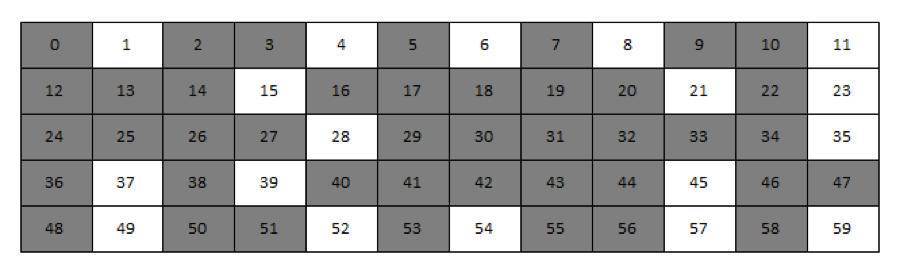
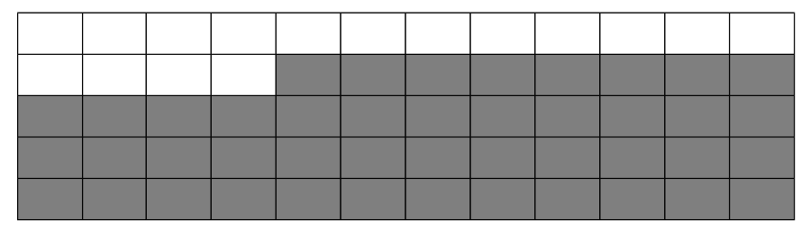

页面迁移其实是伙伴管理算法中的一部分, 鉴于其特殊性, 特地另行分析. 它是 2007 年的时候, 2.6.24 内核版本开发时, 新增碎片减少策略(the fragmentation reduction strategy)所引入的. 该策略也称之为反碎片技术(anti-gragmentation).

根据《深入 linux 内核架构》的描述, 反碎片的由来是因为 Linux 内存管理长期存在一个问题: 系统启动并长期运行后, 物理内存将会产生很多碎片. 暂且假设内存页面数为 60, 则长期运行后, 其页面的使用情况可能将会如下图(灰色为已分配).



虽然其未被分配的页面仍有 25%, 但能够申请到的最大页面仅为一页. 不过这对用户空间是没有影响的, 主要是由于用户态的内存是通过页面映射而得到的. 所以不在乎具体的物理页面分布, 其仍是可以将其映射为连续的一块内存提供给用户态程序使用. 于是用户态可以感知的内存则如下.



但是对于内核态, 碎片则是个严肃的问题, 因为大部分物理内存都直接映射到内核的永久映射区里面. 如果真的存在碎片, 将真的如第一张图所示, 无法映射到比一页更大的内存, 这长期是 linux 的短板之一. 于是为了解决该问题, 则引入了反碎片.

linux 内核在内存管理时, 将已分配的页面划分为三种类型:

不可移动页

——该类型页面在内存中位置固定, 不可移动. 内核核心大部分内存属于该类型;

可回收页

——不能够直接移动, 但是可以删除, 而内容则可以从某些源重新生成. 如文件数据映射的页面则归属此类;

可移动页

——可以随意移动, 分配给用户态程序运行的用户空间页面则为该类. 由于是通过页面映射而得, 将其复制到新位置后, 更新映射表项, 重新映射, 应用程序是不感知的.

页面的可迁移性则取决于它属于哪一类. 而内核使用的反碎片技术则是基于将具有相同可移动性的页分组的思想来实现的. 当出现碎片的情况时, 可移动页面将会迁移, 将为申请者腾出所需的连续页面空间, 由此避免了空闲页面空间过于零碎而无法申请到大块连续内存. 也由此, 不可移动页面不允许在可移动页面中申请, 避免因不可迁移而导致碎片.

其中具体迁移类型在头文件 include/linux/mmzone.h 中定义了:

```cpp
【file:/include/linux/mmzone.h】
enum {
	MIGRATE_UNMOVABLE,
	MIGRATE_RECLAIMABLE,
	MIGRATE_MOVABLE,
	MIGRATE_PCPTYPES,	/* the number of types on the pcp lists */
	MIGRATE_RESERVE = MIGRATE_PCPTYPES,
#ifdef CONFIG_CMA
	/*
	 * MIGRATE_CMA migration type is designed to mimic the way
	 * ZONE_MOVABLE works.  Only movable pages can be allocated
	 * from MIGRATE_CMA pageblocks and page allocator never
	 * implicitly change migration type of MIGRATE_CMA pageblock.
	 *
	 * The way to use it is to change migratetype of a range of
	 * pageblocks to MIGRATE_CMA which can be done by
	 * __free_pageblock_cma() function.  What is important though
	 * is that a range of pageblocks must be aligned to
	 * MAX_ORDER_NR_PAGES should biggest page be bigger then
	 * a single pageblock.
	 */
	MIGRATE_CMA,
#endif
#ifdef CONFIG_MEMORY_ISOLATION
	MIGRATE_ISOLATE,	/* can't allocate from here */
#endif
	MIGRATE_TYPES
};
```

各类型的说明则为:

MIGRATE_UNMOVABLE

——在内存当中有固定的位置, 不能移动. 内核的核心分配的内存大多属于这种类型;

MIGRATE_RECLAIMABLE

——不能直接移动, 但可以删除, 其内容页可以从其他地方重新生成, 例如, 映射自文件的数据属于这种类型, 针对这种页, 内核有专门的页面回收处理;

MIGRATE_MOVABLE

——可以随意移动, 用户空间应用程序所用到的页属于该类别. 它们通过页表来映射, 如果他们复制到新的位置, 页表项也会相应的更新, 应用程序不会注意到任何改变;

MIGRATE_PCPTYPES

——是 per_cpu_pageset, 即用来表示每 CPU 页框高速缓存的数据结构中的链表的迁移类型数目;

MIGRATE_RESERVE

——保留页, 是在前三种的列表中都没用可满足分配的内存块时, 就可以从 MIGRATE_RESERVE 分配;

MIGRATE_CMA

——连续内存分配, 用于避免预留大块内存导致系统可用内存减少而实现的, 即当驱动不使用内存时, 将其分配给用户使用, 而需要时则通过回收或者迁移的方式将内存腾出来.

MIGRATE_ISOLATE

——用于跨越 NUMA 节点移动物理内存页, 该索引的页不能分配, 在大型系统上, 它有益于将物理内存页移动到接近于是用该页最频繁地 CPU;

MIGRATE_TYPES

——表示迁移类型的数目.

至于迁移类型的页面管理实际上采用的还是伙伴管理算法的管理方式, 内存管理区 zone 的结构里面的 free_area 是用于管理各阶内存页面, 而其里面的 free_list 则是对各迁移类型进行区分的链表. 回顾内存页面释放的函数__free_pages, 其将空闲页面挂回去的时候, 是做了迁移类型区分的. 也就是意味着页面迁移类型是伴随着伙伴管理算法的内存管理构建, 根据迁移类型进行分而治之初始化.

那么各种迁移类型的页面分配是如何运转的?

页面分配函数入口__alloc_pages():

```cpp
【file:/include/linux/gfp.h】
static inline struct page *
__alloc_pages(gfp_t gfp_mask, unsigned int order,
		struct zonelist *zonelist)
{
	return __alloc_pages_nodemask(gfp_mask, order, zonelist, NULL);
}
```

其首入参在 `__alloc_pages_nodemask()` 里面会经过 `allocflags_to_migratetype(gfp_mask)` 转换获取到申请页面的类型. 该迁移类型会在其内部调用函数 `__rmqueue()` 中使用.

```cpp
【file:/mm/page_alloc.c】
/*
 * Do the hard work of removing an element from the buddy allocator.
 * Call me with the zone->lock already held.
 */
static struct page *__rmqueue(struct zone *zone, unsigned int order,
						int migratetype)
{
	struct page *page;

retry_reserve:
	page = __rmqueue_smallest(zone, order, migratetype);

	if (unlikely(!page) && migratetype != MIGRATE_RESERVE) {
		page = __rmqueue_fallback(zone, order, migratetype);

		/*
		 * Use MIGRATE_RESERVE rather than fail an allocation. goto
		 * is used because __rmqueue_smallest is an inline function
		 * and we want just one call site
		 */
		if (!page) {
			migratetype = MIGRATE_RESERVE;
			goto retry_reserve;
		}
	}

	trace_mm_page_alloc_zone_locked(page, order, migratetype);
	return page;
}
```

前面分析可以知道__rmqueue_smallest()仅是在指定迁移类型下自底向上进行各阶遍历查找所需的空闲页面, 而据上代码其如果在指定迁移类型下分配失败, 且类型不为 MIGRATE_RESERVE 时, 将会调用__rmqueue_fallback()进行分配.

接下来看一下__rmqueue_fallback()实现:

```cpp
【file:/mm/page_alloc.c】
/* Remove an element from the buddy allocator from the fallback list */
static inline struct page *
__rmqueue_fallback(struct zone *zone, int order, int start_migratetype)
{
	struct free_area *area;
	int current_order;
	struct page *page;
	int migratetype, new_type, i;

	/* Find the largest possible block of pages in the other list */
	for (current_order = MAX_ORDER-1; current_order >= order;
						--current_order) {
		for (i = 0;; i++) {
			migratetype = fallbacks[start_migratetype][i];

			/* MIGRATE_RESERVE handled later if necessary */
			if (migratetype == MIGRATE_RESERVE)
				break;

			area = &(zone->free_area[current_order]);
			if (list_empty(&area->free_list[migratetype]))
				continue;

			page = list_entry(area->free_list[migratetype].next,
					struct page, lru);
			area->nr_free--;

			new_type = try_to_steal_freepages(zone, page,
							  start_migratetype,
							  migratetype);

			/* Remove the page from the freelists */
			list_del(&page->lru);
			rmv_page_order(page);

			expand(zone, page, order, current_order, area,
			       new_type);

			trace_mm_page_alloc_extfrag(page, order, current_order,
				start_migratetype, migratetype, new_type);

			return page;
		}
	}

	return NULL;
}
```

可以看到其异于通常的伙伴管理算法, 内存页面是由最高阶开始进行查找的, 而查找的迁移类型是根据 fallbacks 备选类型中进行遍历获得并止于 MIGRATE_RESERVE 类型. 由此获得的阶号和迁移类型查找`zone->free_area[]->free_list[]`空闲页面管理链表, 如果查找到的话, 则将其摘除, 否则进入下一类型查找, 最后所有类型都查找不到的时候, 才会降阶查找.

其中`fallbacks[][]`是已确定的类型顺序结构, 其定义为:

```cpp
【file:/mm/page_alloc.c】
/*
 * This array describes the order lists are fallen back to when
 * the free lists for the desirable migrate type are depleted
 */
static int fallbacks[MIGRATE_TYPES][4] = {
	[MIGRATE_UNMOVABLE]   = { MIGRATE_RECLAIMABLE, MIGRATE_MOVABLE,     MIGRATE_RESERVE },
	[MIGRATE_RECLAIMABLE] = { MIGRATE_UNMOVABLE,   MIGRATE_MOVABLE,     MIGRATE_RESERVE },
#ifdef CONFIG_CMA
	[MIGRATE_MOVABLE]     = { MIGRATE_CMA,         MIGRATE_RECLAIMABLE, MIGRATE_UNMOVABLE, MIGRATE_RESERVE },
	[MIGRATE_CMA]         = { MIGRATE_RESERVE }, /* Never used */
#else
	[MIGRATE_MOVABLE]     = { MIGRATE_RECLAIMABLE, MIGRATE_UNMOVABLE,   MIGRATE_RESERVE },
#endif
	[MIGRATE_RESERVE]     = { MIGRATE_RESERVE }, /* Never used */
#ifdef CONFIG_MEMORY_ISOLATION
	[MIGRATE_ISOLATE]     = { MIGRATE_RESERVE }, /* Never used */
#endif
};
```

具体分析一下 try_to_steal_freepages()函数实现:

```cpp
【file:/mm/page_alloc.c】
/*
 * If breaking a large block of pages, move all free pages to the preferred
 * allocation list. If falling back for a reclaimable kernel allocation, be
 * more aggressive about taking ownership of free pages.
 *
 * On the other hand, never change migration type of MIGRATE_CMA pageblocks
 * nor move CMA pages to different free lists. We don't want unmovable pages
 * to be allocated from MIGRATE_CMA areas.
 *
 * Returns the new migratetype of the pageblock (or the same old migratetype
 * if it was unchanged).
 */
static int try_to_steal_freepages(struct zone *zone, struct page *page,
				  int start_type, int fallback_type)
{
	int current_order = page_order(page);

	/*
	 * When borrowing from MIGRATE_CMA, we need to release the excess
	 * buddy pages to CMA itself.
	 */
	if (is_migrate_cma(fallback_type))
		return fallback_type;

	/* Take ownership for orders >= pageblock_order */
	if (current_order >= pageblock_order) {
		change_pageblock_range(page, current_order, start_type);
		return start_type;
	}

	if (current_order >= pageblock_order / 2 ||
	    start_type == MIGRATE_RECLAIMABLE ||
	    page_group_by_mobility_disabled) {
		int pages;

		pages = move_freepages_block(zone, page, start_type);

		/* Claim the whole block if over half of it is free */
		if (pages >= (1 << (pageblock_order-1)) ||
				page_group_by_mobility_disabled) {

			set_pageblock_migratetype(page, start_type);
			return start_type;
		}

	}

	return fallback_type;
}
```

该函数主要实现了内存页面的迁移类型的变更, 将__rmqueue_fallback()查找到满足需要的内存页面空间类型转为申请的类型. 其中 MIGRATE_CMA 类型不做类型转换, 此外类型转换的页面数量为 pageblock_nr_pages 为单位的倍数, 还有就是对于阶较低的内存页面(小于 pageblock_order/2)、类型不为 MIGRATE_RECLAIMABLE 且未开启页面迁移的情况下, 是不做类型转换的. 完了, 在__rmqueue_fallback()里面根据其转换后的类型通过 expand()扩展到对应的迁移类型伙伴管理系统中.

小结一下, __rmqueue_fallback()是自高往低阶遍历 fallbacks 迁移类型表, 查找满足分配需要的内存页面, 然后将查找到的内存页面进行类型变更后合并到所申请的类型中, 以实现类型迁移. 值得注意的是, 之所以内存迁移都是以内存块的高阶进行的, 主要就是为了反碎片化, 避免当前类型无法满足需要的时候, 过于频繁地向备选类型进行小片内存申请和做迁移而导致备选类型的内存页面产生大量水平, 将问题控制在所申请的内存类型中.

最后看一下 set_pageblock_migratetype()的实现:

```cpp
【file:/mm/page_alloc.c】
/**
 * set_pageblock_flags_mask - Set the requested group of flags for a pageblock_nr_pages block of pages
 * @page: The page within the block of interest
 * @start_bitidx: The first bit of interest
 * @end_bitidx: The last bit of interest
 * @flags: The flags to set
 */
void set_pageblock_flags_mask(struct page *page, unsigned long flags,
					unsigned long end_bitidx,
					unsigned long mask)
{
	struct zone *zone;
	unsigned long *bitmap;
	unsigned long pfn, bitidx, word_bitidx;
	unsigned long old_word, word;

	BUILD_BUG_ON(NR_PAGEBLOCK_BITS != 4);

	zone = page_zone(page);
	pfn = page_to_pfn(page);
	bitmap = get_pageblock_bitmap(zone, pfn);
	bitidx = pfn_to_bitidx(zone, pfn);
	word_bitidx = bitidx / BITS_PER_LONG;
	bitidx &= (BITS_PER_LONG-1);

	VM_BUG_ON_PAGE(!zone_spans_pfn(zone, pfn), page);

	bitidx += end_bitidx;
	mask <<= (BITS_PER_LONG - bitidx - 1);
	flags <<= (BITS_PER_LONG - bitidx - 1);

	word = ACCESS_ONCE(bitmap[word_bitidx]);
	for (;;) {
		old_word = cmpxchg(&bitmap[word_bitidx], word, (word & ~mask) | flags);
		if (word == old_word)
			break;
		word = old_word;
	}
}
```

其中 get_pageblock_bitmap()用于取得 zone 结构体中 pageblock_flags 成员, 而后面则是基于此做位图操作. 通过该函数, 可以看到内存页面的类型管理是通过其所属的 zone 的结构体中的 pageblock_flags 所管理的位图进行标识该页面的迁移类型.

# 参考

[jeanleo](https://www.jeanleo.com/2018/09/06/%e3%80%90linux%e5%86%85%e5%ad%98%e6%ba%90%e7%a0%81%e5%88%86%e6%9e%90%e3%80%91%e9%a1%b5%e9%9d%a2%e8%bf%81%e7%a7%bb/)