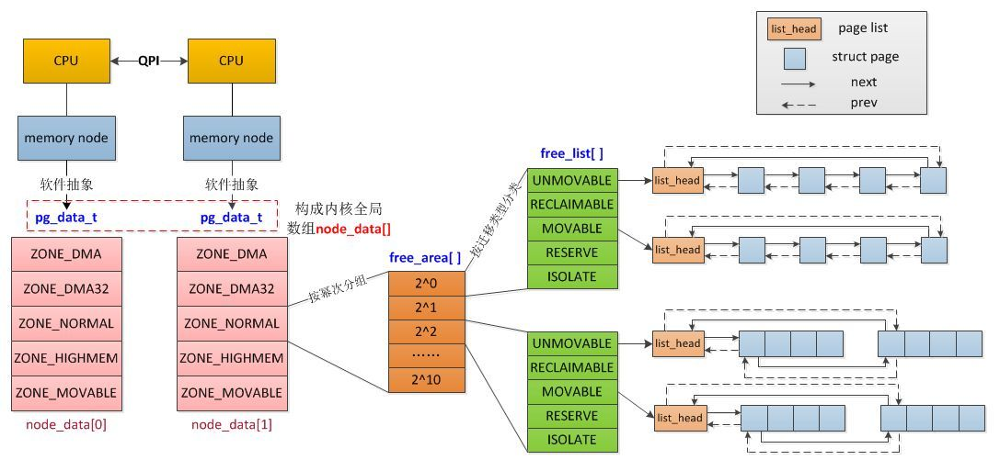

<!-- @import "[TOC]" {cmd="toc" depthFrom=1 depthTo=6 orderedList=false} -->

<!-- code_chunk_output -->

- [1. 前景回顾](#1-前景回顾)
  - [1.1. UMA 和 NUMA 两种模型](#11-uma-和-numa-两种模型)
  - [1.2. UMA 模型](#12-uma-模型)
  - [1.3. NUMA 模型](#13-numa-模型)
- [2. (N)UMA 模型中 linux 内存的机构](#2-numa-模型中-linux-内存的机构)
  - [2.1. NUMA 系统](#21-numa-系统)
  - [2.2. UMA 系统](#22-uma-系统)
- [3. Linux 物理内存的组织形式](#3-linux-物理内存的组织形式)
  - [3.1. 内存节点 node](#31-内存节点-node)
  - [3.2. 物理内存区域 zone](#32-物理内存区域-zone)
  - [3.3. 内存页 page](#33-内存页-page)
  - [3.4. 高端内存](#34-高端内存)
- [4. 参照](#4-参照)

<!-- /code_chunk_output -->

# 1. 前景回顾

前面我们讲到[服务器体系(SMP, NUMA, MPP)与共享存储器架构(UMA 和 NUMA)](http://blog.csdn.net/gatieme/article/details/52098615)

## 1.1. UMA 和 NUMA 两种模型

共享存储型多处理机有两种模型

- 均匀存储器存取(Uniform-Memory-Access, 简称 UMA)模型

- 非均匀存储器存取(Nonuniform-Memory-Access, 简称 NUMA)模型

## 1.2. UMA 模型

传统的多核运算是使用 SMP(Symmetric Multi-Processor )模式: 将**多个处理器**与**一个集中的存储器**和**I/O 总线**相连. **所有处理器只能访问同一个物理存储器**, 因此 SMP 系统有时也被称为**一致存储器访问(UMA)结构体系**, 一致性意指无论在什么时候, 处理器只能为内存的每个数据保持或共享**唯一一个数值**.

物理存储器被所有处理机**均匀共享**. 所有处理机对所有存储字具有**相同的存取时间**, 所以称为均匀存储器存取的原因. 每台处理机可以有**私用高速缓存**(**cache 可以是私有的！！！**),**外围设备**也以一定形式**共享**.

很显然, SMP 的缺点是可伸缩性有限, 因为在存储器和 I/O 接口达到饱和的时候, 增加处理器并不能获得更高的性能, 与之相对应的有 AMP 架构, 不同核之间有主从关系, 如一个核控制另外一个核的业务, 可以理解为多核系统中控制平面和数据平面.

## 1.3. NUMA 模型

NUMA 模式是一种分布式存储器访问方式, 处理器可以同时访问不同的存储器地址, 大幅度提高并行性.  NUMA 总是多处理器计算机,系统的 CPU 都有本地内存, 可支持快速的访问, 各个处理器之前通过总线链接起来, 以支持堆其他 CPU 的本地内存的访问, 当然访问要比本地内存慢.

>其访问时间随存储字的位置不同而变化. 其共享存储器物理上是分布在所有处理机的本地存储器上. **所有本地存储器的集合组成了全局地址空间, 可被所有的处理机访问**. 处理机访问本地存储器是比较快的, 但访问属于另一台处理机的远程存储器则比较慢, 因为**通过互连网络会产生附加时延**

NUMA 的主要优点是伸缩性. NUMA 体系结构在设计上已超越了 SMP 体系结构在伸缩性上的限制. 通过 SMP, 所有的内存访问都传递到相同的共享内存总线. 这种方式非常适用于 CPU 数量相对较少的情况, 但不适用于具有几十个甚至几百个 CPU 的情况, 因为这些 CPU 会相互竞争对共享内存总线的访问. NUMA 通过限制任何一条内存总线上的 CPU 数量并依靠高速互连来连接各个节点, 从而缓解了这些瓶颈状况.

# 2. (N)UMA 模型中 linux 内存的机构

Linux 适用于各种不同的体系结构,而不同体系结构在内存管理方面的差别很大.因此 linux 内核需要用一种体系结构无关的方式来表示内存.

Linux 内核通过插入一些兼容层,使得不同体系结构的差异很好的被隐藏起来,内核对一致和非一致内存访问使用相同的数据结构

## 2.1. NUMA 系统

- **处理器被划分成多个"节点"(node**),每个节点被分配有的**本地存储器空间**.所有节点中的处理器都可以访问全部的系统物理存储器, 但是访问本节点内的存储器所需要的时间, 比访问某些远程节点内的存储器所花的时间要少得多

- **内存被分割成多个区域(BANK, 也叫"簇**"), 依据**簇与处理器**的"**距离"不同**,**访问不同簇的代码也会不同**.比如, 可能把内存的一个簇指派给每个处理器, 或则某个簇和设备卡很近, 很适合 DMA, 那么就指派给该设备. 因此当前的多数系统会**把内存系统**分割成**2 块区域**, 一块是**专门给 CPU 去访问**, 一块是**给外围设备板卡的 DMA 去访问**

## 2.2. UMA 系统

内存就相当于一个**只使用一个 NUMA 节点来管理整个系统的内存**.而内存管理的其他地方则认为他们就是在处理一个(伪)NUMA 系统.

# 3. Linux 物理内存的组织形式

Linux 把**物理内存**划分为**三个层次**来管理

| 层次 | 描述 |
|:----|:----|
| **存储节点(Node**) |  CPU 被划分为**多个节点(node**), **内存则被分簇**, **每个 CPU**对应一个**本地物理内存**, 即**一个 CPU\-node**对应一个**内存簇 bank**, 即**每个内存簇**被认为是**一个节点** |
| **管理区(Zone**)   | **每个物理内存节点 node**被划分为**多个内存管理区域**, 用于表示**不同范围的内存**, 内核可以使用**不同的映射方式(！！！**)映射物理内存 |
| **页面(Page**) | 内存被细分为**多个页面帧**, **页面**是**最基本的页面分配的单位**　｜

为了支持 NUMA 模型, 也即 CPU 对不同内存单元的访问时间可能不同, 此时系统的物理内存被划分为几个节点(node), 一个 node 对应一个内存簇 bank, 即每个内存簇被认为是一个节点

- 首先, 内存被划分为**结点**. **每个节点**关联到系统中的**一个处理器**, 内核中表示为**pg\_data\_t 的实例**. 定义了一个**大小为 MAX\_NUMNODES 类型为 pg\_data\_t**的**数组 node\_data**,数组的大小根据**CONFIG\_NODES\_SHIFT**的配置决定. 对于 UMA 来说, NODES\_SHIFT 为 0, 所以 MAX\_NUMNODES 的值为 1.    而对于 PC 这种**UMA 结构**的机器来说, 只使用了一个成为**contig\_page\_data**的静态 pg\_data\_t 结构.

- 各个节点又被划分为内存管理区域, 一个**管理区域**通过**struct zone\_struct**描述, 其被定义为**zone\_t**, 用以表示内存的某个范围,**低端范围的 16MB**被描述为**ZONE\_DMA**,某些**工业标准体系结构中的(ISA)设备**需要用到它,然后是可**直接映射到内核**的**普通内存域 ZONE\_NORMAL**,最后是超出了内核段的物理地址域 ZONE\_HIGHMEM, 被称为高端内存. 是系统中预留的可用内存空间, 不能被内核直接映射.

- 最后**页帧(page frame**)代表了系统内存的最小单位, 堆内存中的每个页都会创建一个 struct page 的一个实例. 传统上, 把内存视为连续的字节, 即内存为字节数组, 内存单元的编号(地址)可作为字节数组的索引. 分页管理时, 将若干字节视为一页, 比如 4K byte. 此时, 内存变成了连续的页, 即内存为页数组, 每一页物理内存叫页帧, 以页为单位对内存进行编号, 该编号可作为页数组的索引, 又称为页帧号.

在一个**单独的节点**内, **任一给定 CPU**访问页面**所需的时间都是相同**的. 然而, 对**不同的 CPU**, 这个时间可能就不同. 对每个 CPU 而言, 内核都试图把耗时节点的访问次数减到最少这就要小心地选择 CPU 最常引用的内核数据结构的存放位置.

## 3.1. 内存节点 node

>CPU 被划分为多个节点(node),内存则被分簇,每个 CPU 对应一个本地物理内存,即一个 CPU-node 对应一个内存簇 bank, 即每个内存簇被认为是一个节点

在 LINUX 中引入一个数据结构`struct pglist_data`, 来描述一个 node, 定义在[`include/linux/mmzone.h`](http://lxr.free-electrons.com/source/include/linux/mmzone.h#L630) 文件中. (这个结构被 typedef pg\_data\_t).

- 对于 NUMA 系统来讲,  整个系统的内存由一个[**node\_data**](http://lxr.free-electrons.com/source/arch/s390/numa/numa.c?v=4.7#L23)的**pg\_data\_t 指针数组**来管理,

- 对于 UMA 系统, 使用`struct pglist_data contig_page_data`, 作为系统唯一的 node 管理所有的内存区域. (UMA 系统中中只有一个 node)

可以使用 NODE\_DATA(node\_id)来查找系统中编号为 node\_id 的结点, 参见[NODE\_DATA 的定义](http://lxr.free-electrons.com/ident?v=4.7;i=NODE_DATA)

```cpp
extern struct pglist_data *node_data[];
#define NODE_DATA(nid)          (node_data[(nid)])
```

UMA 结构下由于只有一个结点, 因此该宏总是返回全局的 contig\_page\_data, 而与参数 node\_id 无关. 参照[include/linux/mmzone.h?v=4.7, line 858](http://lxr.free-electrons.com/source/include/linux/mmzone.h?v=4.7#L858), 其中全局唯一的内存 node 结点 contig\_page\_data 定义在[mm/nobootmem.c?v=4.7, line 27](http://lxr.free-electrons.com/source/mm/nobootmem.c?v=4.7#L27), [linux-2.4.37](http://lxr.free-electrons.com/source/mm/numa.c?v=2.4.37#L15)


```cpp
#ifndef CONFIG_NEED_MULTIPLE_NODES
extern struct pglist_data contig_page_data;
#define NODE_DATA(nid)          (&contig_page_data)
#define NODE_MEM_MAP(nid)       mem_map
else
/*  ......  */
#endif
```

在**分配一个页面**时, Linux 采用节点**局部分配的策略**,从最靠近运行中的 CPU 的节点分配内存,由于**进程往往是在同一个 CPU 上运行**, 因此从**当前节点得到的内存很可能被用到**(**！！！**).

## 3.2. 物理内存区域 zone

因为实际的**计算机体系结构**有**硬件的诸多限制**, 这限制了页框可以使用的方式. 尤其是, Linux 内核必须处理**80x86 体系结构**的两种硬件约束.

- **ISA 总线的直接内存存储 DMA**(**DMA 操作！！！**)处理器有一个严格的限制 : 他们**只能对 RAM 的前 16MB 进行寻址**

- 在具有大容量 RAM 的现代**32 位计算机**中, CPU**不能**直接访问**所有的物理地址**, 因为**线性地址空间太小**, 内核不可能直接映射**所有物理内存**到**线性地址空间**, 我们会在后面典型架构(x86)上内存区域划分详细讲解 x86\_32 上的内存区域划分

因此 Linux 内核对**不同区域(即不同范围！！！)的内存**(**物理内存！！！**)需要采用**不同的管理方式和映射方式**,

为了解决这些制约条件, Linux 使用了三种区:

1. ZONE\_DMA: 这个区包含的**页**用来执行**DMA 操作**.

2. ZONE\_NOMAL: 这个区包含的都是能**正常映射的页**.

3. ZONE\_HIGHEM: 这个区"高端内存", 其中的**页**不能永久地映射到**内核地址空间**(**虚拟地址空间！！！**)

而为了兼容一些**设备的热插拔支持**以及**内存碎片化**的处理, 内核也引入一些**逻辑上**的内存区.

1. ZONE\_MOVABLE: 内核定义了一个**伪内存域 ZONE\_MOVABLE**, **在防止物理内存碎片的机制 memory migration**中需要使用该内存域. 供防止物理内存碎片的极致使用

2. ZONE\_DEVICE: 为支持**热插拔设备**而分配的 Non Volatile Memory 非易失性内存

内核将每个簇所对应的 node 又被分成的称为管理区(zone)的块, 它们各自描述在内存中的范围. 一个管理区(zone)由[**struct zone**](http://lxr.free-electrons.com/source/include/linux/mmzone.h#L326)结构体来描述, 在 linux-2.4.37 之前的内核中是用[`typedef  struct zone_struct zone_t `](http://lxr.free-electrons.com/source/include/linux/mmzone.h?v=2.4.37#L47)数据结构来描述)

对于 x86\_32 的机器, 管理区(内存区域)类型如下分布

| 类型 | 区域 |
| :------- | ----: |
| ZONE\_DMA | 0\~15MB |
| ZONE\_NORMAL | 16MB\~895MB |
| ZONE\_HIGHMEM | 896MB\~物理内存结束 |

内核在初始化内存管理区时, 首先建立**管理区表 zone\_table**. 参见[mm/page_alloc.c?v=2.4.37, line 38](http://lxr.free-electrons.com/source/mm/page_alloc.c?v=2.4.37#L38)


```cpp
/*
 *
 * The zone_table array is used to look up the address of the
 * struct zone corresponding to a given zone number (ZONE_DMA,
 * ZONE_NORMAL, or ZONE_HIGHMEM).
 */
zone_t *zone_table[MAX_NR_ZONES*MAX_NR_NODES];
EXPORT_SYMBOL(zone_table);
```

该表处理起来就像一个**多维数组**,

- MAX\_NR\_ZONES 是**一个节点**中所能包容纳的**管理区的最大数**, 如 3 个, 定义在[include/linux/mmzone.h?v=2.4.37, line 25](http://lxr.free-electrons.com/source/include/linux/mmzone.h?v=2.4.37#L25), 与 zone 区域的类型(ZONE\_DMA, ZONE\_NORMAL, ZONE\_HIGHMEM)定义在一起. 当然这时候我们这些标识都是通过宏的方式来实现的, 而不是如今的枚举类型

- MAX\_NR\_NODES 是可以存在的**节点的最大数**.

- 函数 EXPORT\_SYMBOL 使得**内核的变量或者函数**可以被载入的模块(比如我们的驱动模块)所**访问**.

## 3.3. 内存页 page

大多数内核(kernel)的操作**只使用 ZONE\_NORMAL 区域**, 系统内存由很多固定大小的内存块组成的, 这样的内存块称作为"页"(PAGE),

**x86 体系结构**中, page 的大小为 4096 个字节(4KB).

每个物理的页由一个`struct page`的数据结构对象来描述. 页的数据结构对象都保存在**mem\_map 全局数组**中, 该数组通常被存放在**ZONE\_NORMAL 的首部**, 或者就在小内存系统中**为装入内核映像而预留的区域之后**. 从载入内核的低地址内存区域的后面内存区域, 也就是**ZONE\_NORMAL 开始**的地方的**内存的页的数据结构对象**, 都保存在这个**全局数组中**.

## 3.4. 高端内存

由于能够被 Linux 内核直接访问的 ZONE_NORMAL 区域的内存空间也是有限的, 所以 LINUX 提出了高端内存(High memory)的概念, 并且允许对高端内存的访问


https://zhuanlan.zhihu.com/p/68465952




# 4. 参照

|   链接   |
|:-------:|
| [内存管理(一)内存模型之 Node](http://biancheng.dnbcw.info/linux/387391.html) |
| [Linux 内存管理 重要结构体](http://blog.chinaunix.net/uid-26009500-id-3078986.html) |
| [Bootmem 机制](http://blog.csdn.net/samssm/article/details/25064897) |
| [Linux-2.6.32 NUMA 架构之内存和调度](http://www.cnblogs.com/zhenjing/archive/2012/03/21/linux_numa.html) |
| [Linux 用户空间与内核空间——高端内存详解](http://blog.csdn.net/tommy_wxie/article/details/17122923) |
| [探索 Linux 内存模型](http://www.ibm.com/developerworks/cn/linux/l-memmod/) |
| [Linux 内存管理](http://blog.chinaunix.net/uid/21718047/cid-151509-list-2.html) |
| [内存管理-之内核内存管理-基于 linux3.10](http://blog.csdn.net/shichaog/article/details/45509917) |
| [内存管理(一)](http://www.cnblogs.com/openix/p/3334026.html) |
| [Linux 内存管理原理](http://www.cnblogs.com/zhaoyl/p/3695517.html) |
| [第 15 章 内存映射和 DMA](http://www.embeddedlinux.org.cn/ldd3/ch15.html) |
| [ 内存管理(二)struct page ](http://blog.chinaunix.net/uid-30282771-id-5176971.html) |
| [进程页表页和内核页表](http://guojing.me/linux-kernel-architecture/posts/thread-page-table-and-kernel-page-table/)
