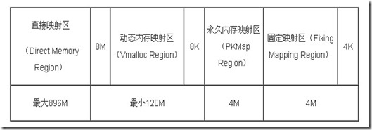
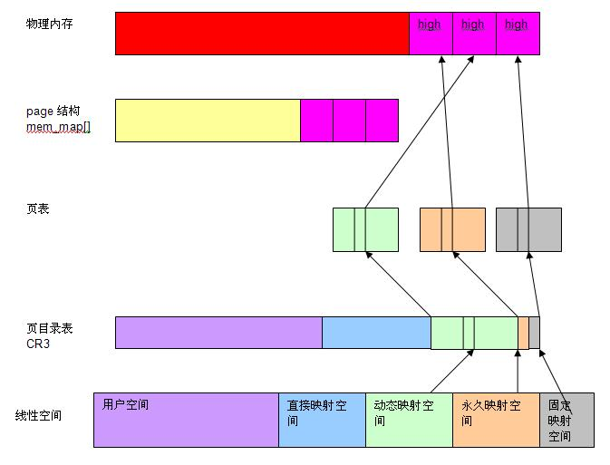

<!-- @import "[TOC]" {cmd="toc" depthFrom=1 depthTo=6 orderedList=false} -->

<!-- code_chunk_output -->

- [1 前景回顾](#1-前景回顾)
- [1.1 UMA 和 NUMA 两种模型](#11-uma-和-numa-两种模型)
  - [1.2 Linux 如何描述物理内存](#12-linux-如何描述物理内存)
  - [1.3 典型架构(x86)上内存区域划分](#13-典型架构x86上内存区域划分)
- [2 内核空间和用户空间](#2-内核空间和用户空间)
  - [2.1 把内核空间和用户空间分开](#21-把内核空间和用户空间分开)
  - [2.2 linux 为什么把内核映射到 3G-4G 这个地址呢](#22-linux-为什么把内核映射到-3g-4g-这个地址呢)
  - [2.3 应用程序线性地址和动态内存分配](#23-应用程序线性地址和动态内存分配)
  - [2.4 高端内存和低端内存的划分](#24-高端内存和低端内存的划分)
  - [2.5 低端内存和高端内存](#25-低端内存和高端内存)
  - [2.6 例子](#26-例子)
- [3 Linux 内核高端内存的由来](#3-linux-内核高端内存的由来)
  - [3.1 为什么需要高端内存?](#31-为什么需要高端内存)
  - [3.2 内核空间高端内存](#32-内核空间高端内存)
  - [3.3 Linux 内核高端内存的理解](#33-linux-内核高端内存的理解)
  - [4 Linux 内核高端内存的划分与映射](#4-linux-内核高端内存的划分与映射)
  - [4.1 映射到"内核动态映射空间"(noncontiguous memory allocation)](#41-映射到内核动态映射空间noncontiguous-memory-allocation)
  - [4.2 持久内核映射(permanent kernel mapping)](#42-持久内核映射permanent-kernel-mapping)
  - [4.3 临时映射(temporary kernel mapping)](#43-临时映射temporary-kernel-mapping)
- [5 页框管理](#5-页框管理)
  - [5.1 页框管理](#51-页框管理)
  - [5.2 保留的页框池](#52-保留的页框池)
- [6 常见问题](#6-常见问题)
  - [6.1 用户空间(进程)是否有高端内存概念?](#61-用户空间进程是否有高端内存概念)
  - [6.2 64 位内核中有高端内存吗?](#62-64-位内核中有高端内存吗)
  - [6.3 用户进程能访问多少物理内存?内核代码能访问多少物理内存?](#63-用户进程能访问多少物理内存内核代码能访问多少物理内存)
  - [6.4 高端内存和物理地址、逻辑地址、线性地址的关系?](#64-高端内存和物理地址-逻辑地址-线性地址的关系)
  - [6.5 为什么不把所有的地址空间都分配给内核?](#65-为什么不把所有的地址空间都分配给内核)
- [7 小结](#7-小结)
  - [7.1 虚拟内核空间到物理空间的映射](#71-虚拟内核空间到物理空间的映射)
  - [7.2 内核映像](#72-内核映像)
  - [7.3 高端内存映射方式](#73-高端内存映射方式)

<!-- /code_chunk_output -->

http://blog.csdn.net/vanbreaker/article/details/7579941

# 1 前景回顾

前面我们讲到[服务器体系(SMP,NUMA,MPP)与共享存储器架构(UMA 和 NUMA)](http://blog.csdn.net/gatieme/article/details/52098615)

# 1.1 UMA 和 NUMA 两种模型

共享存储型多处理机有两种模型

- 均匀存储器存取(Uniform-Memory-Access, 简称 UMA)模型

- 非均匀存储器存取(Nonuniform-Memory-Access, 简称 NUMA)模型

**UMA 模型**

物理存储器被所有处理机均匀共享. 所有处理机对所有存储字具有相同的存取时间, 这就是为什么称它为均匀存储器存取的原因. 每台处理机可以有私用高速缓存,外围设备也以一定形式共享.

**NUMA 模型**

NUMA 模式下, 处理器被划分成多个"节点"(node),  每个节点被分配有的本地存储器空间.  所有节点中的处理器都可以访问全部的系统物理存储器, 但是访问本节点内的存储器所需要的时间, 比访问某些远程节点内的存储器所花的时间要少得多.

## 1.2 Linux 如何描述物理内存

Linux 把物理内存划分为三个层次来管理

| 层次 | 描述 |
|:----|:----|
| 存储节点(Node) |  CPU 被划分为多个节点(node), 内存则被分簇, 每个 CPU 对应一个本地物理内存, 即一个 CPU-node 对应一个内存簇 bank, 即每个内存簇被认为是一个节点 |
| 管理区(Zone)   | 每个物理内存节点 node 被划分为多个内存管理区域, 用于表示不同范围的内存, 内核可以使用不同的映射方式映射物理内存 |
| 页面(Page) | 内存被细分为多个页面帧, 页面是最基本的页面分配的单位 |

## 1.3 典型架构(x86)上内存区域划分

对于 x86 机器, 管理区(内存区域)类型如下分布

| 类型 | 区域 |
| :------- | :---- |
| ZONE_DMA | 0\~15MB |
| ZONE_NORMAL | 16MB\~895MB |
| ZONE_HIGHMEM | 896MB\~物理内存结束 |

# 2 内核空间和用户空间

传统 32bit cpu 上, 最大寻址的物理内存空间是 4GByte, 线性地址空间也是 4GByte 的情况下, linux 内存管理会 : 应用程序 3G \+ 内核 1G 这样划分

## 2.1 把内核空间和用户空间分开

过去, CPU 的地址总线只有 32 位, 32 的地址总线无论是从逻辑上还是从物理上都只能描述 4G 的地址空间(2\^32=4Gbit), 在物理上理论上最多拥有 4G 内存(除了 IO 地址空间, 实际内存容量小于 4G), 逻辑空间也只能描述 4G 的线性地址空间.

为了合理的利用逻辑 4G 空间, Linux 采用了 3: 1 的策略, 即内核占用 1G 的线性地址空间, 用户占用 3G 的线性地址空间. 所以用户进程的地址范围从 0\~3G, 内核地址范围从 3G\~4G, 也就是说, 内核空间只有 1G 的逻辑线性地址空间.

把内核空间和用户空间分开是方便为了 MMU 映射.如果内核空间和用户空间都是 0\~4G 范围的话, 那么当从用户态切入到内核态时(系统调用或者中断), 就必须要切换 MMU 映射(程序里一个逻辑地址在用户态和内核态肯定被映射到不同的物理地址上)这种切换代价是很大, 但是用户态/内核态的切换却是非常频繁的. 而且从技术上你根本没法切换, 因为这个时候程序内的任何地址都被映射给用户进程, 你根本没法取到内核数据. 就算进入内核态时你切换 MMU 映射, 如果这个时候你要读写用户进程的数据怎么办呢?难道又去映射 MMU?把 0\~3G 分给用户进程、3\~4G 就能很好的解决这个问题

这样一来就是用户程序里的所有变量和函数的逻辑地址都是介于 0~3G 的

内核代码里所有变量和函数的逻辑地址都是介于 3~4G 的

所谓用户空间和内核空间, 从 cpu 角度来说, 只是运行的级别不一样, 是否处于特权级别而已

逻辑地址到物理地址的 MMU 映射是不变的.

不管是用户态还是内核态, 最终都是通过 MMU 映射到你的物理上的 896M 内存

mmap 就可以映射物理内存到用户空间, 你可以清楚的看到同一块物理内在用户态和内核态的不同逻辑地址

两个不同的逻辑地址(一个介于 0\~3G, 一个介于 3\-4G) 通过 MMU 映射到同一块物理内存

## 2.2 linux 为什么把内核映射到 3G-4G 这个地址呢

>假如 linux 把内核映射到 0-1G 的空间, 其他进程共享 1-4G 的空间不可以吗?

这个技术上也是可以的, 而且不难实现. 为什么不采用估计有历史原因吧

毕竟 cpu 和程序出来的年代比 MMU 早多了

没有 MMU 的年代里, 对于 x86, 逻辑地址就是物理地址. 物理地址从 0 开始, 那么程序的逻辑地址从一开始也是从 0 开始的

对于任何用户进程, 0\~3G 的映射都是不同的, 但是所有用户进程 3\~4G 的映射都是相同的

一个进程从用户态切入到内核态, MMU 映射不需要变. 你能很方便取得内核数据和用户进程的数据

## 2.3 应用程序线性地址和动态内存分配

应用程序能使用的最大线性地址就是 3G, 根据 linux 应用的分区方法:

```cpp
---------------------------- 4G

内核空间

---------------------------- 3G

栈 - 向下增长

mmap - 固定映射

堆 - 向上增长

数据段

代码段

---------------------------- 0G
```

应用层的动态内存分配,比如**malloc**,一般使用的是**dlmalloc 库**,具体见:http://opendevkit.com/?e=56

所以,低端内核和高端内存是内核的概念, 跟应用程序没有直接关系.

如果 Linux 物理内存小于 1G 的空间, 通常内核把物理内存与其地址空间做了线性映射, 也就是一一映射, 这样可以提高访问速度. 但是, 当 Linux 物理内存超过 1G 时, 线性访问机制就不够用了, 因为只能有 1G 的内存可以被映射, 剩余的物理内存无法被内核管理, 所以, 为了解决这一问题, Linux 把内核地址分为线性区和非线性区两部分, 线性区规定最大为 896M, 剩下的 128M 为非线性区. 从而, 线性区映射的物理内存成为低端内存, 剩下的物理内存被成为高端内存. 与线性区不同, 非线性区不会提前进行内存映射, 而是在使用时动态映射.

## 2.4 高端内存和低端内存的划分

那么既然内核态的地址范围只有 1G 的, 如果你有 4G 物理上的内存, 显然你没法一次性全部映射所有的物理内存到内核态地址. 所以才有了高端内存. 低 896M 的内存做直接映射, 剩下的 128M 根据需要动态的映射到剩下的物理内存.

**64 位的内核**就可以很好的解决这个问题, 但是 64 位系统**不是意味**着就有**64 根地址线**. 因为没必要, 实际不需要那么大内存. 假设你有 38 位地址线, 可以寻址到 2048G 的内存, 也按照 3:1 划分, 那么内核态就有 512G 范围, 你的 512G 物理内存可以一次性的全部映射到内核空间, 根本不需要高端内存

Linux 物理内存空间分为 DMA 内存区(DMA Zone)、低端内存区(Normal Zone)与高端内存区(Highmem Zone)三部分. DMA Zone 通常很小, 只有几十 M, 低端内存区与高端内存区的划分来源于 Linux 内核空间大小的限制.

## 2.5 低端内存和高端内存

我们知道, 内核空间有 1G 的线性地址可用, 内核会根据物理内存情况, 直接映射一部分物理内存到内核线性地址上, 这部分内存就是低端内存, 物理地址和虚拟地址(线性地址)只有一个偏移. 这样方便管理, 而且效率高.

当物理内存大于 1G 的时候, 内核是不能完全用低端内存管理全部物理内存的, 所以低端内存剩下的部分就是高端内存了, 高端内存没有直接映射的, 是动态映射到内核空间的.

一般 128M 给高端内存分配用, 因为很少, 所以不用要赶紧释放掉

64bit 的时候, 就不存在低端内存和高端内存的概念了, 因为空间很大都可以直接管理了.

## 2.6 例子

假设物理内存为 2G, 则低段的 896M 为低端内存, 通过线性映射给内核使用, 其他的 1128M 物理内存为高端内存, 可以被内核的非线性区使用. 由于要使用**128M 非线性区**来管理超过 1G 的**高端内存**, 所以通常都不会映射, 只有使用时才使**kmap 映射**, 使用完后要尽快用**kunmap 释放**.

对于物理内存为 1G 的内核, 系统**不会**真的分配 896M 给线性空间, **896M 是最大限制**(**不是说全分配！！只是最大限制**)

下面是一个 1.5G 物理内存 linux 系统的真实分配情况, 只有 721M 分配给了低端内存区, 如果是 1G 的 linxu 系统, 分配的就更少了.

| 区域 | 大小 |
|:-----|:-----|
| MemTotal | 1547MB |
| HighTotal  | 825MB |
| LowTotal   | 721MB |

申请高端内存时, 如果**高端内存不够**了, linux 也会去低端内存区申请, **反之则不行**.

# 3 Linux 内核高端内存的由来

## 3.1 为什么需要高端内存?

**高端内存**是指**物理地址(！！！**)大于 896M 的内存. 对于这样的内存, 无法在"内核直接映射空间"进行映射.

内核空间只有 1GB 线性地址, 如果使用大于 1GB 的物理内存就没法直接映射到内核线性空间了.

当系统中的内存大于 896MB 时, 把内核线性空间分为两部分, 内核中低于 896MB 线性地址空间直接映射到低 896MB 的物理地址空间; 高于 896MB 的 128MB 内核线性空间用于动态映射 ZONE_HIGHMEM 内存区域(即物理地址高于 896MB 的物理空间).

因为"内核直接映射空间"最多只能从 3G 到 4G, 只能直接映射 1G 物理内存, 对于大于 1G 的物理内存, 无能为力. 实际上, "内核直接映射空间"也达不到 1G,  还得留点线性空间给"内核动态映射空间" 呢. 因此, Linux 规定"内核直接映射空间" **最多映射 896M 物理内存**.

对于**高端内存(物理地址！！！**), 可以通过 **alloc\_page**() 或者其它函数获得**对应的 page**(这儿的 page 是**物理页！！！**), 但是要想访问实际物理内存, 还得把 **page 转为线性地址**才行(为什么?想想 MMU 是如何访问物理内存的), 也就是说, 我们需要为**高端内存**对应的 page 找一个**线性空间**, 这个过程称为**高端内存映射**.

## 3.2 内核空间高端内存

在传统的 x86\_32 系统中, 当内核模块代码或线程访问内存时, 代码中的内存地址都为逻辑地址, 而对应到真正的物理内存地址, 需要地址一对一的映射, 如逻辑地址 0xc0000003 对应的物理地址为 0×3, 0xc0000004 对应的物理地址为 0×4, ... ...,

逻辑地址与物理地址对应的关系为

>物理地址 = 逻辑地址 – 0xC0000000

这是内核地址空间的地址转换关系, 注意内核的**虚拟地址在"高端**", 但是映射的**物理内存地址在低端**.

```cpp
逻辑地址	物理内存地址
0xc0000000	0×0
0xc0000001	0×1
0xc0000002	0×2
0xc0000003	0×3
...	...
0xe0000000	0×20000000
...	...
0xffffffff	0×40000000 ??
```

假设按照上述简单的地址映射关系, 那么内核逻辑地址空间访问为 0xc0000000 \~ 0xffffffff, 那么对应的物理内存范围就为 0×0 \~ 0×40000000, 即只能访问 1G 物理内存. 若机器中安装 8G 物理内存, 那么内核就只能访问前 1G 物理内存, 后面 7G 物理内存将会无法访问, 因为内核 的地址空间已经全部映射到物理内存地址范围 0×0 \~ 0×40000000. 即使安装了 8G 物理内存, 那么物理地址为 0×40000001 的内存, 内核该怎么去访问呢?代码中必须要有内存逻辑地址 的, 0xc0000000 \~ 0xffffffff 的地址空间已经被用完了, 所以无法访问物理地址 0×40000000 以后的内存.

显然不能将内核地址空间 0xc0000000 \~ 0xfffffff 全部用来简单的地址映射. 因此 x86 架构中将**内核地址空间(这里是虚拟地址空间, 1GB 空间, 不是物理内存！！！**)划分三部分: ZONE\_DMA、ZONE\_NORMAL 和 ZONE\_HIGHMEM. ZONE\_HIGHMEM 即为高端内存, 这就是**内核高端内存(内核的, 不是物理高端内存！！！**)概念的由来.

在 x86 结构中, 三种类型的区域(从 3G 开始计算)如下:

| 区域 | 位置 |
|:-----|:-----|
| ZONE\_DMA | 内存开始的 16MB |
| ZONE\_NORMAL | 16MB\~896MB |
| ZONE\_HIGHMEM | 896MB\~结束(1G) |

## 3.3 Linux 内核高端内存的理解

前面我们解释了高端内存的由来.  Linux 将**内核地址空间**划分为三部分 ZONE\_DMA、ZONE\_NORMAL 和 ZONE\_HIGHMEM, 高端内存 HIGH\_MEM 地址空间范围为 0xF8000000 \~ 0xFFFFFFFF(896MB\~1024MB). 那么如内核是如何借助**128MB 高端内存地址空间**是如何实现访问可以**所有物理内存**?

当内核想访问高于 896MB 物理地址内存时, 从 0xF8000000\~0xFFFFFFFF**地址空间(内核虚拟地址空间, 1GB 中的 896\~1024MB 范围内**)范围内找一段**相应大小空闲的逻辑地址空间**, 借用一会. 借用这段逻辑地址空间, 建立映射到想访问的那段物理内存(即**填充内核 PTE 页面表**), 临时用一会, 用完后归还. 这样别人也可以借用这段地址空间访问其他物理内存, 实现了使用有限的地址空间, 访问所有所有物理内存.

例如内核想访问**2G 开始**的一段大小为**1MB**的**物理内存**, 即**物理地址范围**为 0×80000000 \~ 0x800FFFFF. 访问之前先找到一段**1MB 大小的空闲地址空间(相应大小！！！**), 假设找到的空闲地址空间为 0xF8700000 \~ 0xF87FFFFF, 用这**1MB 的逻辑地址空间**映射到**物理 1MB 地址空间**0×80000000 \~ 0x800FFFFF 的内存. 映射关系如下:

```cpp
逻辑地址	物理内存地址
0xF8700000	0×80000000
0xF8700001	0×80000001
0xF8700002	0×80000002
...	...
0xF87FFFFF	0x800FFFFF
```

当内核访问完 0×80000000 \~ 0x800FFFFF 物理内存后, 就将 0xF8700000 \~ 0xF87FFFFF 内核**线性空间释放**. 这样其他进程或代码也可以使用 0xF8700000 \~ 0xF87FFFFF 这段地址访问其他物理内存.

从上面的描述, 我们可以知道**高端内存的最基本思想**,借一段地址空间, 建立临时地址映射, 用完后释放, 达到这段地址空间可以循环使用, 访问所有物理内存.

看到这里, 不禁有人会问: 万一有内核进程或模块一直占用某段逻辑地址空间不释放, 怎么办?若真的出现的这种情况, 则内核的高端内存地址空间越来越紧张, 若都被占用不释放, 则没有建立映射到物理内存都无法访问了.

## 4 Linux 内核高端内存的划分与映射

在 32 位的系统上, 内核占有从第 3GB\~第 4GB 的线性地址空间, 共 1GB 大小

内核将其中的**前 896MB(3G 起的 896MB**)与**物理内存的 0\~896MB**进行**直接映射**,即线性映射,将剩余的 128M 线性地址空间作为访问高于 896M 的内存的一个窗口.引入高端内存映射这样一个概念的主要原因就是我们所安装的内存大于 1G 时, 内核的 1G 线性地址空间无法建立一个完全的直接映射来触及整个物理内存空间, 而对于 80x86**开启 PAE**的情况下, 允许的**最大物理内存可达到 64G**, 因此内核将自己的最后 128M 的线性地址空间腾出来, 用以完成对高端内存的暂时性映射. 而在 64 位的系统上就不存在这样的问题了, 因为可用的线性地址空间远大于可安装的内存.

下图描述了内核 1GB 线性地址空间是如何划分的





其中可以用来完成上述映射目的的区域为**vmalloc area**, **Persistent kernel mappings**区域和固定映射线性地址空间中的**FIX\_KMAP**区域, 这三个区域对应的映射机制分别为**非连续内存**分配, **永久内核**映射和**临时内核**映射.

内核将高端内存划分为 3 部分:

- VMALLOC\_START\~VMALLOC\_END

- KMAP\_BASE\~FIXADDR\_START

- FIXADDR\_START\~4G

对于高端内存, 可以通过**alloc\_page**()或者其它函数获得对应的**page(这里是物理页面！！！**), 但是要想访问实际物理内存, 还得把**page**转为**线性地址**才行(为什么?想想 MMU 是如何访问物理内存的), 也就是说, 我们需要为**高端内存对应的 page**找一个**线性空间**, 这个过程称为**高端内存映射**.


对应**高端内存的 3 部分(这里是物理高端内存！！！**), **高端内存映射(这儿指的是线性地址空间的高端内存！！！**)有三种方式:

## 4.1 映射到"内核动态映射空间"(noncontiguous memory allocation)

这种方式很简单, 因为通过**vmalloc**() , 在"内核动态映射空间"申请内存的时候, 就**可能从高端内存获得页面(可能是物理页面, 可能不连续！！！具体**参看 vmalloc 的实现), 因此说高端内存有可能映射到"内核动态映射空间"中

**虚拟内存中连续**、但**物理内存中不连续**的内存区

## 4.2 持久内核映射(permanent kernel mapping)

如果是通过**alloc\_page**获得了高端内存对应的**page**,如何给它找个线性空间?

内核专门为此留出一块线性空间, 从**PKMAP\_BASE**到**FIXADDR\_START**,用于映射高端内存

在**2.6 内核**上, 这个地址范围是**4G-8M**到**4G-4M**之间.这个空间起叫"**内核永久映射空间**"或者"**永久内核映射空间**",这个空间和其它空间使用同样的页目录表, 对于内核来说, 就是**swapper\_pg\_dir**, 对普通进程来说, 通过 CR3 寄存器指向. 通常情况下, 这个空间是 4M 大小, 因此仅仅需要一个页表即可, 内核通过来 pkmap\_page\_table 寻找这个页表. 通过 kmap(), 可以把一个 page 映射到这个空间来. 由于这个空间是 4M 大小, 最多能同时映射 1024 个 page. 因此, 对于不使用的的 page, 及应该时从这个空间释放掉(也就是解除映射关系), 通过 kunmap(), 可以把一个 page 对应的线性地址从这个空间释放出来.

## 4.3 临时映射(temporary kernel mapping)

内核在**FIXADDR\_START**到**FIXADDR\_TOP**之间保留了一些线性空间用于特殊需求. 这个空间称为"**固定映射空间**"在这个空间中, 有一部分用于高端内存的临时映射.

这块空间具有如下特点:

1. **每个 CPU**占用**一块空间**

2. 在每个 CPU 占用的那块空间中, 又分为多个小空间, **每个小空间**大小是**1 个 page**, 每个小空间用于一个目的, 这些目的定义在**kmap\_types.h**中的 km\_type 中.

当要进行一次**临时映射的时候**, 需要**指定映射的目的**, 根据映射目的, 可以找到**对应的小空间**, 然后把这个空间的地址作为映射地址. 这意味着一次临时映射会导致以前的映射被覆盖. 通过**kmap\_atomic**()可实现临时映射.



# 5 页框管理

## 5.1 页框管理

Linux 采用**4KB 页框大小**作为标准的内存分配单元. 内核必须记录每个页框的状态, 这种状态信息保存在一个类型为**page 的页描述符**中, **所有的页描述(也就是页结构体！！！**)存放在**mem\_map**中

virt\_to\_page(addr)产生**线性地址**对应的**页描述符地址(也就是页结构体！！！**). pfn\_to\_page(pfn)产生对应**页框号**的**页描述符地址(页结构体！！！**).

在页框描述符中, 几个关键的字段我认为: **flags**、**\_count**、**\_mapcount**.

由于 CPU 对内存的非一致性访问, 系统的物理内存被划分为几个**节点**(每个节点的描述符为**pg\_data\_t**), 每个节点的**物理内存**又可以分为**3 个管理区**: ZONE\_DMA(低于 16M 的页框地址), ZONE\_NORMAL(16MB-896MB 的页框地址)和 ZONE\_HIGHMEM(高于 896MB 的页框地址).

**每个管理区**又有自己的**描述符**, 描述了该管理区**空闲的页框**, **保留页数目**等.

**每个页描述符**都有到**内存节点**和到**节点管理区**的连接(被放在**flag 的高位字段**).

内核调用一个内存分配函数时, 必须指明请求**页框所在的管理区(物理内存管理区！！！**), 内核通常指明它愿意使用哪个管理区.

## 5.2 保留的页框池

如果有**足够的空闲内存**可用、请求就会被立刻满足. **否则**, 必须**回收一些内存**, 并且将**发出请求**的内核控制路径**阻塞**, 直到有**内存被释放**. 但是**有些控制路径不能被阻塞**, 例如一些内核路径产生一些**原子内存分配请求**. 尽管无法保证一个原子内存分配请求不失败, 但是内核会减少这中概率. 为了做到如此, 内核采取的方案**为原子内存分配请求**保留一个**页框池**, 只有在**内存不足**时才使用. **页框池**有**ZONE\_DMA**和**ZONE\_NORMAL**两个区贡献出一些页框.

常用的请求页框和释放页框函数:

alloc\_pages(gfp\_mask, order): 获得**连续的页框**, 返回**页描述符地址(物理页地址！！！**), 是其他类型内存分配的基础.

\_\_get\_free\_pages(gfp\_mask, order): 获得**连续的页框**, 返回**页框对应的线性地址**. 线性地址与物理地址是内核直接映射方式. **不能用于大于 896M 的高端内存**.

\_\_free\_pages(page,order);

\_\_free\_pages(addr,order);

# 6 常见问题

## 6.1 用户空间(进程)是否有高端内存概念?

用户进程没有高端内存概念. **只有在内核空间才存在高端内存**. **用户进程**最多只可以访问**3G 物理内存**, 而**内核进程**可以访问**所有物理内存**.

## 6.2 64 位内核中有高端内存吗?

目前现实中, 64 位 Linux 内核不存在高端内存, 因为 64 位内核可以支持超过 512GB 内存. 若机器安装的**物理内存**超过**内核地址空间范围(内核的虚拟地址空间范围！！！32 位系统只有 1GB**), 就会存在高端内存.

## 6.3 用户进程能访问多少物理内存?内核代码能访问多少物理内存?

**32**位系统**用户进程**最大可以访问**3GB**, **内核代码**可以访问**所有物理内存**.

**64**位系统**用户进程**最大可以访问超过**512GB**, **内核代码**可以访问**所有物理内存**.

## 6.4 高端内存和物理地址、逻辑地址、线性地址的关系?

高端内存只和逻辑地址有关系, 和逻辑地址、物理地址没有直接关系.

## 6.5 为什么不把所有的地址空间都分配给内核?

若把**所有地址空间**都给**内核**, 那么用户进程怎么使用内存?怎么保证内核使用内存和用户进程不起冲突?

1. 让我们忽略 Linux 对段式内存映射的支持. 在**保护模式**下, 我们知道无论 CPU 运行于用户态还是核心态, **CPU 执行程序**所访问的地址都是**虚拟地址(CPU 之行时候使用的地址全是虚拟地址, 只有需要访问物理地址<无非读写数据>时候才会通过 MMU<里面有 TLB 组件>获取物理地址, 然后访问物理地址！！！MMU 查看 CPU 指令执行过程即可了解！！！**), MMU 必须通过读取控制寄存器 CR3 中的值作为当前页面目录的指针, 进而根据分页内存映射机制(参看相关文档)将该虚拟地址转换为真正的物理地址才能让 CPU 真正的访问到物理地址.

2. 对于 32 位的 Linux, 其**每一个进程**都有**4G 的寻址空间**, 但当一个进程访问其虚拟内存空间中的某个地址时又是怎样实现不与其它进程的虚拟空间混淆 的呢?**每个进程**都有其自身的**页面目录 PGD**, Linux 将该目录的指针存放在与进程对应的内存结构 task\_struct.(struct mm\_struct)mm->pgd 中. 每当一个进程被调度(**schedule**())即将进入运行态时, Linux 内核都要用该进程的**PGD 指针设置 CR3**(**switch\_mm**()).

3. 当创建一个新的进程时, 都要为新进程创建一个**新的页面目录 PGD**, 并从**内核的页面目录 swapper\_pg_\dir**中复制**内核区间页面目录项**至新建进程页面目录 PGD 的相应位置, 具体过程如下:

do\_fork() --> copy\_mm() --> mm\_init() --> pgd\_alloc() --> set\_pgd\_fast() --> get\_pgd\_slow() --> memcpy(\&PGD + USER\_PTRS\_PER\_PGD, swapper\_pg\_dir + USER\_PTRS\_PER\_PGD, (PTRS\_PER\_PGD - USER\_PTRS\_PER\_PGD) * sizeof(pgd\_t))

这样一来, **每个进程**的**页面目录**就分成了**两部分**, 第一部分为"**用户空间**", 用来映射其**整个进程空间**(0x0000 0000－0xBFFF FFFF)即**3G 字节**的虚拟地址; 第二部分为"**系统空间**", 用来映射(0xC000 0000－0xFFFF FFFF)**1G 字节**的虚拟地址. 可以看出 Linux 系统中**每个进程**的页面目录的**第二部分是相同的**, 所以从进程的角度来看, 每个进程有**4G 字节的虚拟空间**,  较低的**3G 字节**是自己的用户空间, 最高的**1G**字节则为**与所有进程以及内核共享的系统空间**.

4. 现在假设我们有如下一个情景:

在进程 A 中通过**系统调用**sethostname(const char *name,seze_t len)设置计算机在网络中的"主机名".

在该情景中我们势必涉及到从**用户空间**向**内核空间**传递数据的问题, name 是**用户空间**中的**地址**, 它要通过**系统调用**设置到内核中的**某个地址**中. 让我们看看这个 过程中的一些细节问题: **系统调用**的**具体实现**是将系统调用的**参数**依次存入寄存器**ebx,ecx,edx,esi,edi**(**最多 5 个参数**, 该情景有两个 name 和 len), 接着将**系统调用号**存入**寄存器 eax**, 然后通过中断指令"**int 80(该操作数指向的 IDT 中的描述符是陷阱门！！！**)"使进程 A 进入**系统空间**. 由于进程的**CPU 运行级别**小于等于为系统调用设置的**陷阱门(发生控制转移, 但不影响中断, 中断门禁止其他中断！！！**)的准入级别 3, 所以可以畅通无阻的进入系统空间去执行为 int 80 设置的函数指针**system\_call**()(本质上是**从 IDT 中找到相应的陷阱门描述符, 然后根据里面的目标代码段描述符选择子找到对应的目标代码段描述符, 取出基地址, 加上该陷阱门描述符中的偏移量, 得到中断处理程序的 32 位线性地址！！！, 将其转换为物理地址, 然后去内存中查找程序入口位置, 也就是该函数入口！！！**). 由于 system\_call()属于内核空间, 其运行级别**DPL 为 0**, CPU 要将**堆栈切换到内核堆栈**, 即进程 A 的系统空间堆栈.

我们知道内核为**新建进程**创建 task\_struct 结构时, 共分配了**两个连续的页面**, 即**8K 的大小**, 并将**底部约 1k 的大小**用于 **task\_struct**(如#define alloc\_task\_struct() ((struct task\_struct \*) \_\_get\_free\_pages(GFP\_KERNEL,1))),而**其余部分内存**用于**系统空间**的**堆栈空间**, 即当从用户空间转入系统空间时, 堆栈指针**esp**变成了(alloc\_task\_struct()+**8192**), 这也是为什么**系统空间**通常用**宏定义 current**(参看其实现)获取当前进程的**task\_struct 地址**的原因. 每次在进程从用户空间进入系统空间之初, **系统堆栈**就已经被依次压入**用户堆栈 SS**、用户堆栈指针**ESP、EFLAGS**、 用户空间**CS、EIP**, 接着**system\_call()将 eax 压入(不是处理器行为！！！**), 再接着**调用 SAVE\_ALL(非处理器行为！！！**)依次压入 ES、DS、EAX、EBP、EDI、ESI、EDX、ECX、EBX, 然后**调用 sys\_call\_table+4\*%EAX(非处理器行为！！！**), 本情景为 sys\_sethostname().

5. 在 sys\_sethostname()中, 经过一些保护考虑后, 调用**copy\_from\_user**(to,from,n), 其中**to 指向内核空间 system\_utsname.nodename**, 譬如 0xE625A000, **from 指向用户空间**, 譬如 0x8010FE00. 现在进程 A 进入了内核, 在系统空间中运行, MMU 根据**其 PGD 将虚拟地址完成到物理地址的映射**, 最终完成从用户空间到系统空间数据的复制. 准备复制之前内核先要确定**用户空间地址和长度的合法性**, 至于从该用户空间地址开始的某个长度的整个区间是否已经映射并不去检查, 如果区间内某个地址未映射或读写权限等问题出现时, 则视为坏地址, 就产生一个页面异常, 让页面异常服务程序处理. 过程如 下: copy\_from\_user()->generic\_copy\_from\_user()->access\_ok()+\_\_copy\_user\_zeroing().

# 7 小结

- 进程寻址空间 0~4G

- 进程在用户态只能访问 0\~3G, 只有进入内核态才能访问 3G\~4G

- 进程通过系统调用进入内核态

- 每个进程虚拟空间的 3G\~4G 部分是相同的

- 进程从**用户态**进入**内核态**不会引起 CR3 的改变但会引起**堆栈的改变**

Linux 简化了分段机制, 使得**虚拟地址与线性地址总是一致**, 因此, Linux 的虚拟地址空间也为 0~4G. Linux 内核将这 4G 字节的空间分为两部分. 将最高的 1G 字节(从虚拟地址 0xC0000000 到 0xFFFFFFFF), 供内核使用, 称为"内核空间". 而将较低的**3G 字节**(从虚拟地址 0x00000000 到 0xBFFFFFFF), 供各个进程使用, 称为"用户空间). 因为每个进程可以通过系统调用进入内核, 因此, Linux 内核由系统 内的所有进程共享. 于是, 从具体进程的角度来看, 每个进程可以拥有 4G 字节的虚拟空间.

Linux 使用两级保护机制: 0 级供内核使用, 3 级供用户程序使用. 从图中可以看出(这里无法表示图), 每个进程有各自的私有用户空间(0~3G), 这个空间对系统中的其他进程是不可见的. 最高的 1GB 字节虚拟内核空间则为所有进程以及内核所共享.

## 7.1 虚拟内核空间到物理空间的映射

**内核空间**中存放的是**内核代码和数据**, 而进程的**用户空间**中存放的是**用户程序的代码和数据**. 不管是**内核空间**还是**用户空间**, 它们都处于**虚拟空间**中. 读者会问, **系统启动时**, 内核的**代码和数据**不是被装入到**物理内存**吗?它们**为什么也处于虚拟内存中呢(！！！**)?这和编译程序有关, 后面我们通过具体讨论就会明白这一点.

虽然**内核空间**占据了每个虚拟空间中的最高**1GB 字节**, 但**映射到物理内存**却总是从**最低地址**(0x00000000)开始. 对内核空间来说, 其地址映射是很简单 的线性映射, **0xC0000000**就是**物理地址**与**线性地址**之间的**位移量**, 在 Linux 代码中就叫做**PAGE\_OFFSET**.

我们来看一下在 include/asm/i386/page.h 中对内核空间中地址映射的说明及定义:

```cpp
/*
* This handles the memory map.. We could make this a config
* option, but too many people screw it up, and too few need
* it.
*
* A __PAGE_OFFSET of 0xC0000000 means that the kernel has
* a virtual address space of one gigabyte, which limits the
* amount of physical memory you can use to about 950MB.
*
* If you want more physical memory than this then see the CONFIG_HIGHMEM4G
* and CONFIG_HIGHMEM64G options in the kernel configuration.
*/

#define __PAGE_OFFSET           (0xC0000000)
......
#define PAGE_OFFSET             ((unsigned long)__PAGE_OFFSET)
#define __pa(x)                 ((unsigned long)(x)-PAGE_OFFSET)
#define __va(x)                 ((void *)((unsigned long)(x)+PAGE_OFFSET))
```

如果**物理内存大于 950MB**, 那么在编译内核时就需要加**CONFIG\_HIGHMEM4G**和**CONFIG\_HIGHMEM64G**选项, 这种情况我们暂不考虑.

如果**物理内存小于 950MB(下面的都是物理内存小于 950MB 的计算！！！**), 则对于内核空间而言, 给定一个虚地址 x, 其物理地址为"x \- PAGE\_OFFSET", 给定一个物理地址 x, 其虚地址为"x \+ PAGE\_OFFSET".
这里再次说明, 宏**\_\_pa()**仅仅把一个**内核**空间的**虚地址**映射到**物理地址**, 而决**不适用于用户空间(！！！**), 用户空间的地址映射要复杂得多.

## 7.2 内核映像


在下面的描述中, 我们把**内核的代码和数据**就叫**内核映像**(kernel image).

当**系统启动**时, Linux 内核映像被安装在**物理地址 0x00100000**开始的地方, 即**1MB 开始的区间**(第 1M 留作它用).

然而, 在**正常运行**时, 整个内核映像应该在**虚拟内核空间**中, 因此, 连接程序在连接内核映像时, 在所有的符号地址上加一个**偏移量 PAGE\_OFFSET**, 这样, 内核映像在内核空间的起始地址就为**0xC0100000**.

例如, 进程的**页目录 PGD**(属于**内核数据结构**)就处于**内核空间**中. 在进程切换时, 要将**寄存器 CR3**设置成指向**新进程的页目录 PGD**, 而该目录的起始地址在**内核空间中是虚地址**, 但**CR3**所需要的是**物理地址**, 这时候就要用\_\_pa()进行地址转换. 在 mm\_context.h 中就有这么一行语句:

```
asm volatile("movl %0,%%cr3": :"r" (\_\_pa(next\-pgd));
```

这是一行嵌入式汇编代码, 其含义是将下一个进程的页目录起始地址 next\_pgd, 通过**函数\_\_pa()转换成物理地址**, 存放在某个寄存器中, 然后用 mov 指令将其写入 CR3 寄存器中. 经过这行语句的处理, CR3 就指向新进程 next 的页目录表 PGD 了.

## 7.3 高端内存映射方式

高端内存映射有三种方式:

1. 映射到"**内核动态映射空间**"

这种方式很简单, 因为通过**vmalloc**()(这个是**申请的虚拟地址空间！！！**), 在"内核动态映射空间"**申请内存**的时候, 就**可能从高端内存获得页面**(**可能是物理页面**, 参看 vmalloc 的实现), 因此说高端内存有**可能映射**到"内核动态映射空间" 中.

**虚拟内存中连续**、但**物理内存中不连续**的内存区, 主要给用户进程使用, 因为**内核**自身会试图**尽力避免非连续的物理地址**.

2. **永久内核映射**

如果是通过**alloc\_page**()获得了**高端内存对应的 page(获得的是物理页面！！！**), 如何给它找个**线性空间**?

内核专门为此留出一块**线性空间**, 从**PKMAP\_BASE**到**FIXADDR\_START**, 用于映射**高端内存**. 在 2.4 内核上, 这个地址范围是(**4G-8M**)到(**4G\-4M**)之间. 这个空间起叫"内核永久映射空间"或者"永久内核映射空间"

这个空间和其它空间使用**同样的页目录表**, 对于内核来说, 就是**swapper\_pg\_dir**, 对普通进程来说, 通过**CR3 寄存器**指向.

通常情况下, 这个空间是**4M 大小**, 因此**仅仅需要一个页表**即可, 内核通过**pkmap\_page\_table**寻找这个页表.

通过**kmap**(), 可以把**一个 page(物理页**)映射到这个**空间(虚拟空间！！！**)来

由于这个空间是 4M 大小, 最多能同时映射 1024 个 page. 因此, 对于不使用的的 page, 应该**及时**从这个空间**释放**掉(解除映射关系就是解系), 通过**kunmap**(), 可以把一个 page 对应的**线性地址**从这个空间释放出来.

3. **临时映射**

内核在**FIXADDR\_START**到**FIXADDR\_TOP**之间保留了一些**线性空间**用于特殊需求. 这个空间称为"固定映射空间"

这个空间中, 有**一部分**用于**高端内存**的**临时映射**.

这块空间具有如下特点:

1. 每个 CPU 占用一块空间

2. 在每个 CPU 占用的那块空间中, 又分为多个小空间, 每个小空间大小是 1 个 page, 每个小空间用于一个目的, 这些目的定义在 kmap\_types.h 中的 km\_type 中.

当要进行一次临时映射的时候, 需要**指定映射的目的**, 根据映射目的, 可以找到对应的小空间, 然后把这个空间的地址作为映射地址. 这意味着一次临时映射会导致以前的映射被覆盖.

通过 kmap\_atomic()可实现临时映射.

下图简单简单表达如何对高端内存进行映射


Linux 内存线性地址空间大小为 4GB, 分为 2 个部分: 用户空间部分(通常是 3G)和内核空间部分(通常是 1G). 在此我们主要关注**内核地址空间部分**.

内核通过**内核页全局目录(内核的, 不是用户程序的, 这个所有进程都使用这个！！！一共 1024 项**)来管理**所有的物理内存**, 由于**线性地址**前**3G**空间为**用户使用**, 内核**页全局目录**前**768 项**(一个页目录项管理 4MB 大小空间, 4MB\*768=3GB, 刚好对应**3G**线性空间)除**0、1**两项外**全部为 0**, **后 256 项**(一个项对应 1024 个页表项, 每个页面 4KB, 一个页目录项对应 4MB 内存, 256 个对应一个**1G 线性空间**)用来管理**所有的物理内存**.

**内核页全局目录**在**编译**时**静态地定义**为**swapper\_pg\_dir 数组**, 该数组**从物理内存地址 0x101000 处开始存放(内核页全局目录放的物理内存位置！！！**).

由图可见, 内核线性地址空间部分从**PAGE\_OFFSET**(通常定义为 3G)开始, 为了**将内核装入内存**, 从 PAGE\_OFFSET 开始**8M 线性地址**用来映射**内核所在的物理内存地址**(也可以说是**内核所在虚拟地址是从 PAGE\_OFFSET 开始**的);

接下来是**mem\_map 数组**, mem\_map 的**起始线性地址**与**体系结构**相关, 比如对于 UMA 结构, 由于从 PAGE\_OFFSET 开始**16M 线性地址空间**对应的 16M 物理地址空间是**DMA 区**, **mem\_map 数组**通常开始于**PAGE\_OFFSET\+16M 的线性地址**;

从 PAGE\_OFFSET 开始到 VMALLOC\_START \- VMALLOC\_OFFSET 的线性地址空间**直接映射**到物理内存空间(**一一对应影射**, 物理地址<==>线性地址 \- PAGE\_OFFSET), 这段**区域的大小**和机器**实际拥有的物理内存大小有关**, 这儿**VMALLOC\_OFFSET 在 X86 上为 8M**, 主要用来**防止越界错误**;

在**内存比较小**的系统上, **余下的线性地址空间**(还要再减去空白区即**VMALLOC\_OFFSET**)被**vmalloc**()函数用来把**不连续的物理地址空间**映射到**连续的线性地址空间**上;

在内存比较大的系统上, **vmalloc**()使用从**VMALLOC\_START**到**VMALLOC\_END**(也即 PKMAP\_BASE 减去 2 页的空白页大小 PAGE\_SIZE(解释 VMALLOC\_END))的**线性地址空间**. 此时**余下的线性地址空间**(还要再减去 2 页的空白区即 VMALLOC\_OFFSET)又可以分成 2 部分: 第一部分从 PKMAP\_BASE 到 FIXADDR\_START 用来由 kmap()函数来建立永久映射高端内存; 第二部分, 从 FIXADDR\_START 到 FIXADDR\_TOP, 这是一个固定大小的临时映射线性地址空间, (引用: Fixed virtual addresses are needed for subsystems that need to know the virtual address at compile time such as the APIC), 在 X86 体系结构上, **FIXADDR\_TOP**被**静态定义**为**0xFFFFE000**,此时这个固定大小空间结束于整个线性地址空间最后 4K 前面, 该固定大小空间大小是在**编译时计算**出来并存储**在\_\_FIXADDR\_SIZE**变量中.

正是由于**vmalloc()使用区、kmap()使用区及固定大小区(kmap\_atomic()使用区**)的存在才使**ZONE\_NORMAL 区大小受到限制**, 由于内核在运行时需要这些函数, 因此在**线性地址空间中至少要 VMALLOC\_RESERVE 大小的空间**. VMALLOC\_RESERVE 的大小与体系结构相关, 在 X86 上, VMALLOC\_RESERVE 定义为 128M, 这就是为什么 ZONE\_NORMAL 大小通常是 16M 到 896M 的原因.