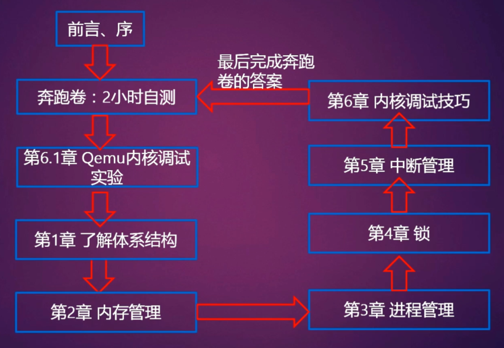

## 概述

- Linux 4.X 内核书籍
- 给予 ARM32 和 ARM64 的内核分析书籍
- "O0"内核调试实验

## 阅读建议

1. 奔跑卷

先做奔跑卷, 边阅读代码边做题, 奔跑卷基于 Linux 4.0 内核

2. 搭建"qemu+gdb+eclipse+O0"的内核调试环境.
3. 阅读相应章节内容之前, 先思考每章前面的思考题, 带着思考题来阅读相应章节内容.

## 《奔跑吧 Linux 内核》阅读脉络图

