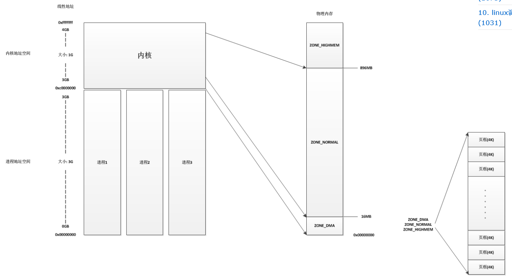
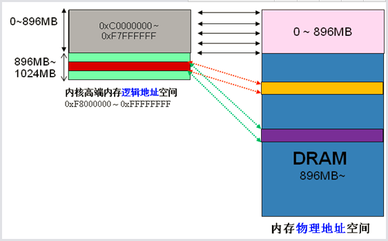

参考:

http://blog.csdn.net/u012398362/article/details/53366186

## 1. Linux 内存管理的主要内容

a. 虚拟内存管理

b. 内核空间内存管理

c. 用户空间内存管理

## 2. 虚拟内存和物理内存映射

`ZONE_HIGHMEM` 的主要作用: 通过非永久映射实现内核对 896M 之外的物理内存的访问, 比如: 实际物理内存为 4G, 内核直接映射了 896M, 之外的 897M-4G 内核都无法访问是无法接受的.

## 3. 内核内存管理的目标

