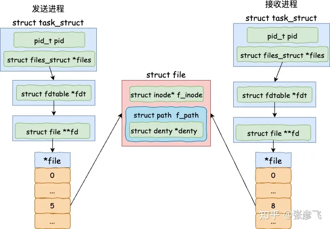
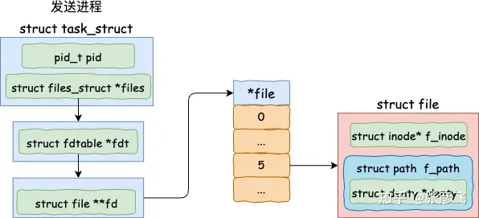
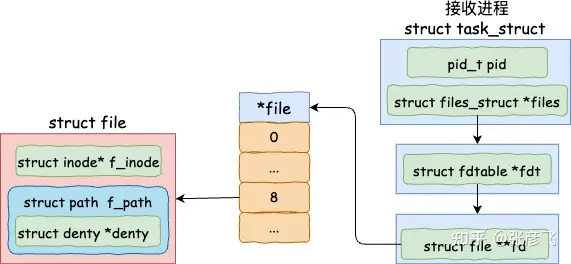

<!-- @import "[TOC]" {cmd="toc" depthFrom=1 depthTo=6 orderedList=false} -->

<!-- code_chunk_output -->

- [1. 共享内存的使用方式](#1-共享内存的使用方式)
- [2. 共享内存文件原理](#2-共享内存文件原理)
  - [2.1. 创建内存文件](#21-创建内存文件)
  - [2.2. mmap申请内存](#22-mmap申请内存)
- [3. 发送方发送文件句柄](#3-发送方发送文件句柄)
- [4. 接收方接收文件](#4-接收方接收文件)
- [5. 总结](#5-总结)
- [6. reference](#6-reference)

<!-- /code_chunk_output -->

在 Linux 系统的**进程虚拟内存**中, 一个重要的特性就是**不同进程**的**地址空间是隔离的**. A 进程的地址 `0x4000` 和 B 进程的 `0x4000` 之间没有任何关系. 这样确确实实是让各个进程的运行时互相之间的影响降到了最低. 某个进程有 bug 也只能自己崩溃, 不会影响其它进程的运行.

但是有的时候我们是想要跨进程传递一些数据的. 因为进程虚拟内存地址是隔离的. 所以目前业界最常用的做法是让**进程之间**通过 `127.0.0.1` 或者是 `Unix Domain Socket` 等**本机网络**手段进行数据的传输. 这个方案在传输的**数据量较小**的时候工作是很不错的.

但如果进程间想共享的数据特别大, 比如说几个 GB, 那如果使用网络 IO 方案的话, 就会涉及到**大量的内存拷贝的开销**, 导致比较低的程序性能. 这是可以采用**进程间共享内存**的方法来在通信时**避免内存拷贝**.

那么问题来了, 不同进程之间的虚拟地址是隔离的, 共享内存又是如何突破这个限制的呢? 我们今天就来深入地了解下共享内存的内部工作原理.

# 1. 共享内存的使用方式

共享内存发送方进程的开发基本过程是调用 `memfd_create` **创建一个内存文件**. 然后通过 **mmap** 系统调用**为这个内存文件申请一块虚拟地址空间**. 然后这个内存文件就可以写入数据了. 最后把**这个文件的句柄**通过 **Unix Domain Socket** 的方式给**接收方进程**发送过去.

> mmap 是一种**内存映射文件**的方法, 即将**一个文件**或者**其它对象**映射到**进程的地址空间**, 实现**文件磁盘地址**和**进程虚拟地址空间中一段虚拟地址**的**一一对映关系**.

下面是**发送方**的核心代码.

```cpp
// 发送方核心代码
int main(int argc, char **argv) {
 // 创建内存文件
 fd = memfd_create("Server memfd", ...);

 // 为内存文件申请 MAP_SHARED 类型的内存
 shm = mmap(NULL, shm_size, PROT_READ | PROT_WRITE, MAP_SHARED, fd, 0);

 // 向共享内存中写入数据
 sprintf(shm, "这段内容是保存在共享内存里的, 接收方和发送方都能根据自己的fd访问到这块内容");

 // 把共享内存文件的句柄给接收方进程发送过去
 struct msghdr msgh;
 *((int *) CMSG_DATA(CMSG_FIRSTHDR(&msgh))) = fd;
 sendmsg(conn, &msgh, 0);
 ......
}
```

共享内存**接收方**的工作过程是先用 `Unix Domain Socket` **连接上服务器**, 然后使用 **recvmsg** 就可以**接收到**发送方发送过来的**文件句柄**.

```cpp
// 接收方核心代码
int main(int argc, char **argv) {
 // 通过 Unix Domain Socket 连接发送方
 connect(conn, (struct sockaddr *)&address, sizeof(struct sockaddr_un));

 // 通过连接取出发送方发送过来的内存文件句柄
 int size = recvmsg(conn, &msgh, 0);
 fd = *((int *) CMSG_DATA(cmsgh));

 // 读取共享文件中的内容
 shm = mmap(NULL, shm_size, PROT_READ, MAP_PRIVATE, fd, 0);
 printf("共享内存中的文件内容是: %s\n", shm);
 ......
}
```

这样**这两个进程**都**各自有一个文件句柄**, 在底层上是**指向同一个内存文件**的. 这样就实现了发送方和接收方之间的内存文件共享了.



上面介绍的是开发基本过程. 接下来我们再深入地分析 memfd_create、 mmap、以及 Unix Domain socket sendmsg 和 recvmsg 的底层工作原理, 来看看它们是如何配合来实现跨进程共享内存的.

# 2. 共享内存文件原理

在发送方发送文件之前, 需要先通过 memfd_create 来创建一个**内存文件**, 然后再使用 mmap 为其**分配内存**.

## 2.1. 创建内存文件

其中 `memfd_create` 函数是一个系统调用. 内核中它的主要逻辑有两个, 一是调用 `get_unused_fd_flags` 申请一个**没使用过的文件句柄**, 二是调用 `shmem_file_setup` **创建一个共享内存文件**.



来看 memfd_create 的源码.

```cpp
// file:mm/memfd.c
SYSCALL_DEFINE2(memfd_create,
  const char __user *, uname,
  unsigned int, flags)
{
 ...
 // 申请一个未使用过的文件句柄
 fd = get_unused_fd_flags((flags & MFD_CLOEXEC) ? O_CLOEXEC : 0);

 // 创建一个共享内存的文件
 file = shmem_file_setup(name, 0, VM_NORESERVE);

 fd_install(fd, file);
 return fd;
}
```

其中在 `shmem_file_setup` 函数中又调用了 `__shmem_file_setup`.

```cpp
// file:mm/shmem.c
static struct file *__shmem_file_setup(struct vfsmount *mnt, const char *name, ...)
{
 ...
 // 申请一个 inode
 inode = shmem_get_inode(mnt->mnt_sb, NULL, S_IFREG | S_IRWXUGO, 0,
    flags);
 inode->i_flags |= i_flags;
 inode->i_size = size;

 ...
 // 创建一个文件
 res = alloc_file_pseudo(inode, mnt, name, O_RDWR,
    &shmem_file_operations);
 return res;
}
```

我们都知道磁盘文件在内核的实现中是由 inode 和 struct file 对象一起组成的. 其实共享内存文件也一样, `__shmem_file_setup` 中就是先申请了一个 inode, 然后再调用 `alloc_file_pseudo` 创建一个文件.

值得注意的是, 这个文件**并非是磁盘上的文件**, 而只是在**内存里**的.

## 2.2. mmap申请内存

mmap 也是一个系统调用, 注意我们在开篇处调用它的时候传入的**第三个 flag 参数**是 `MAP_SHARED`. 这表示的是要通过 mmap 申请一块跨进程可共享的内存出来. mmap 的实现入口在 `arch/x86/kernel/sys_x86_64.c`

```cpp
//file:arch/x86/kernel/sys_x86_64.c
SYSCALL_DEFINE6(mmap, unsigned long, addr, ...)
{
 return ksys_mmap_pgoff(addr, len, prot, flags, fd, off >> PAGE_SHIFT);
}
```

接下来的这个函数的调用链路如下

```cpp
SYSCALL_DEFINE6(mmap
-> ksys_mmap_pgoff
---> vm_mmap_pgoff
------> do_mmap_pgoff
--------> do_mmap
```

在 `do_mmap` 函数中, 对输入的 `MAP_SHARED` 进行了处理

```cpp
//file:mm/mmap.c
unsigned long do_mmap(struct file *file, unsigned long addr,
   unsigned long len, unsigned long prot,
   unsigned long flags, vm_flags_t vm_flags,
   unsigned long pgoff, unsigned long *populate,
   struct list_head *uf)
{
 struct mm_struct * mm = current->mm;
 ...

 // 如果包含 MAP_SHARED, 则对要申请的虚拟内存设置一个 VM_SHARED
 switch (flags & MAP_TYPE) {
  case MAP_SHARED:
  case MAP_SHARED_VALIDATE:
   vm_flags |= VM_SHARED | VM_MAYSHARE;
   ...
 }
 ...

 addr = mmap_region(file, addr, len, vm_flags, pgoff, uf);
 ......
}
```

如果 flag 包含了 `MAP_SHARED`, 则对要申请的**虚拟内存**设置一个 `VM_SHARED`. 该标记指明的是要申请一个**可以跨进程共享的内存块**. 接下来进入 `mmap_region` 中申请虚拟内存.

```cpp
//file:mm/mmap.c
unsigned long mmap_region(struct file *file, ...)
{
 struct mm_struct *mm = current->mm;
 ......

 // 申请虚拟内存vma
 vma = vm_area_alloc(mm);

 // vma初始化
 vma->vm_start = addr;
 vma->vm_end = addr + len;
 vma->vm_flags = vm_flags;
 vma->vm_page_prot = vm_get_page_prot(vm_flags);
 vma->vm_pgoff = pgoff;
 ......

 // 加入到进程的虚拟内存 vma 链表中来
 vma_link(mm, vma, prev, rb_link, rb_parent);
}
```

进程的虚拟内存地址空间在内核底层中就是由这样一个个的 vma 来组成的. 每一个 vma 都声明的是进程虚拟地址中的某一段地址范围已经分配出去了. 在 `mmap_region` 函数中申请了 vma, 并在内核中将其管理了起来.

这里注意我们在申请共享内存的时候, 给 vma 是带了 VM_SHARED 标记的. 带了这个标记的 vma和普通的虚拟内存不一样.  后面在发生缺页中断申请物理内存的时候, 在不同的进程间是可以对应到同一块物理内存的. 所以可以实现进程间的共享.


所以真正让进程之间可以共享内存的是这个带 VM_SHARED 的 vma.

# 3. 发送方发送文件句柄

发送方在使用 `memfd_create` 创建出来**内存文件**, 并用 mmap 为其申请可跨进程共享的内存后. 接着就可以通过 Unix Domain Socket 中对应的 sendmsg 方法将**这个共享内存文件的句柄**发送出来. 如下是发送的代码示例.

```cpp
static void send_fd(int conn, int fd) {
    struct msghdr msgh;
    struct iovec iov;
    ...

    // 把文件句柄放到消息中来
    *((int *) CMSG_DATA(CMSG_FIRSTHDR(&msgh))) = fd;

    // 发送出去
    sendmsg(conn, &msgh, 0);
}
```

**sendmsg** 又是一个内核提供的**系统调用**, 它位于 `net/socket.c` 文件中.

```cpp
//file:net/socket.c
SYSCALL_DEFINE3(sendmsg, int, fd, struct user_msghdr __user *, msg, unsigned int, flags)
{
 return __sys_sendmsg(fd, msg, flags, true);
}
```

该函数的调用路径如下

```cpp
SYSCALL_DEFINE3(sendmsg, ...)
-> __sys_sendmsg
---> ___sys_sendmsg
-----> ____sys_sendmsg
-------> sock_sendmsg
---------> sock_sendmsg_nosec
-----------> unix_stream_sendmsg
```

在 `unix_stream_sendmsg` 中执行了真正的发送.

```cpp
//file:net/unix/af_unix.c
static int unix_stream_sendmsg(struct socket *sock, struct msghdr *msg, ...)
{
 // 把文件描述符指向的文件信息复制到 scm_cookie 中
 struct scm_cookie scm;
 scm_send(sock, msg, &scm, false);

 // 不断构建数据包发送, 直到发送完毕
    while (sent < len) {
     // 申请一块缓存区
     skb = sock_alloc_send_pskb(sk, size - data_len, data_len,
        msg->msg_flags & MSG_DONTWAIT, &err,
        get_order(UNIX_SKB_FRAGS_SZ));

     // 拷贝数据到 skb
     err = unix_scm_to_skb(&scm, skb, !fds_sent);
     err = skb_copy_datagram_from_iter(skb, 0, &msg->msg_iter, size);

     // 直接把 skb 放到对端的接收队列中
     skb_queue_tail(&other->sk_receive_queue, skb);

  //发送完毕回调
  other->sk_data_ready(other);
  sent += size;
     ...
    }
}
```

在 `unix_stream_sendmsg` 中申请了个 skb 缓存区, 然后把要发送的文件句柄等数据都塞到里面, 最后调用 `skb_queue_tail` 直接把 skb 放到 Unix Domain Socket 连接另一端的接收队列中了.

这里注意**文件句柄**只有在当前进程内才是有意义的. 如果直接发送 fd 出去, 接收方是没有办法使用的. 所以在 `scm_send` 函数中, 重要的逻辑是把 **fd 对应的 struct file 的指针**给找了出来, 放到待发送的数据里面了. 只有 file 这种内核级的对象接收方才能使用.

```cpp
scm_send
-> __scm_send
---> scm_fp_copy
```

在 `scm_fp_copy` 中根据 fd 把 file 给找了出来. 它的指针会被放到发送数据中

```cpp
//file:net/core/scm.c
static int scm_fp_copy(struct cmsghdr *cmsg, struct scm_fp_list **fplp)
{
 ...
 //把每一个要发送的 fd 对应的 file 给找出来
 for (i=0; i< num; i++)
 {
  int fd = fdp[i];
  struct file *file;

  if (fd < 0 || !(file = fget_raw(fd)))
   return -EBADF;
  *fpp++ = file;
  fpl->count++;
 }
}
```

# 4. 接收方接收文件

接下来接收方就可以通过 recvmsg 来接收发送方发送过来的文件了. recvmsg 系统会调用到 `unix_stream_read_generic` 中, 然后在这个函数中把 skb 给取出来.



下面是接收函数核心 `unix_stream_read_generic` 的源码.

```cpp
//file:net/unix/af_unix.c
static int unix_stream_read_generic(struct unix_stream_read_state *state,
        bool freezable)
{
 do {
  // 拿出一个 skb
  last = skb = skb_peek(&sk->sk_receive_queue);
  ...
 }
 ...
 if (state->msg)
  scm_recv(sock, state->msg, &scm, flags);
 return copied ? : err;
}
```

在 skb 拿出来后, 还需要调用 `scm_recv` 来把 skb 中**包含的文件**给找出来. 在 `scm_recv` 中调用 `scm_detach_fds`.

```cpp
//file:net/core/scm.c
void scm_detach_fds(struct msghdr *msg, struct scm_cookie *scm)
{

 for (i = 0; i < fdmax; i++) {
  err = receive_fd_user(scm->fp->fp[i], cmsg_data + i, o_flags);
  if (err < 0)
   break;
 }
 ...
}
```

在 `scm->fp->fp[i]` 中包含的是发送方发送过来的 **struct file 指针**. 这样文件就取出来了. 当然 struct file 是个**内核态的对象**, 用户没有办法使用. 所以还需要再为其**在新的进程中申请一个文件句柄**, 然后返回.

```cpp
//file:fs/file.c
int __receive_fd(struct file *file, int __user *ufd, unsigned int o_flags)
{
 //申请一个新的文件描述符
 new_fd = get_unused_fd_flags(o_flags);
 ...

 //关联文件
 fd_install(new_fd, get_file(file));
 return new_fd;
}
```

# 5. 总结

共享内存发送方进程的开发过程基本分 `memfd_create` 创建内存文件、mmap 申请共享内存、Unix Domain Socket 发送文件句柄三步.

* 第一步, `memfd_create` 系统调用的主要逻辑有两个, 一是调用 `get_unused_fd_flags` 申请一个没使用过的文件句柄, 二是调用 `shmem_file_setup` 创建一个共享内存文件.

* 第二步, mmap 系统调用在调用它的时候传入的第三个 flag 参数是 `MAP_SHARED`, 该参数是申请一块跨进程可共享访问的物理内存.

* 第三步, 接着通过 Unix Domain Socket 中对应的 sendmsg 方法将这个共享内存文件的句柄发送出去. 在发送时, 把文件句柄对应的 struct file 指针找到并放到要封装的 skb 数据包中了.

接收方进程的主要实现原理是 recvmsg 系统调用. 在这个系统调用中, 内核会把发送方发送过来的 struct file 指针取出来, 然后再在当前进程下为其申请一个新的文件句柄. 这个文件句柄返回给用户进程后, 用户进程就可以用它来和另外一个进程共享地访问同一块内存了.

总体来看, 共享内存本质上共享的是内核对象 struct file, 通过在不同的进程之间使用同一个 struct file 来实现的共享. 当然也得需要在虚拟内存对象 vma 带上 `VM_SHARED` 标记来支持.

# 6. reference

跨进程共享内存 memfd 的内部工作原理: https://zhuanlan.zhihu.com/p/671507551
