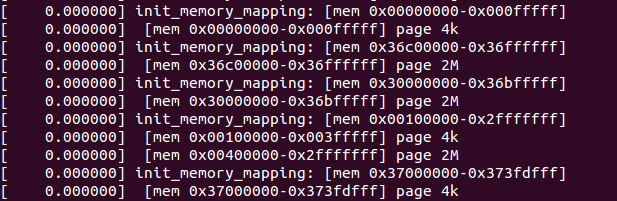

# 建立低端内存页表和高端内存固定映射区的页表

## init_mem_mapping()

有了总页面数、低端页面数、高端页面数这些信息, `setup_arch()` 接着调用 `arch/x86/mm/init.c:init_mem_mapping()` 来建立**低端内存页表和高端内存固定映射区的页表**.

该函数在 `PAGE_OFFSET` 处建立物理内存的直接映射, 即把**物理内存**中 `0 ~ (max_low_pfn<<12)`地址范围的**低端空间区**直接映射到**内核虚拟空间**(它是从 `PAGE_OFFSET` 即 0xc0000000 开始的 1GB 线性地址).

建立内核页表的关键函数 init\_mem\_mapping():

```cpp
# /arch/x86/mm/init.c

void __init init_mem_mapping(void)
{
    unsigned long end;
    /* 会设置 page_size_mask */
    probe_page_size_mask();

#ifdef CONFIG_X86_64
    /* 64 位不需要 */
    end = max_pfn << PAGE_SHIFT;
#else
    end = max_low_pfn << PAGE_SHIFT;
#endif

    /* the ISA range is always mapped regardless of memory holes */
    // ISA 总是映射无论有没有空洞
    init_memory_mapping(0, ISA_END_ADDRESS);

    /*
     * If the allocation is in bottom-up direction, we setup direct mapping
     * in bottom-up, otherwise we setup direct mapping in top-down.
     */
    if (memblock_bottom_up()) {
        unsigned long kernel_end = __pa_symbol(_end);

        /*
         * we need two separate calls here. This is because we want to
         * allocate page tables above the kernel. So we first map
         * [kernel_end, end) to make memory above the kernel be mapped
         * as soon as possible. And then use page tables allocated above
         * the kernel to map [ISA_END_ADDRESS, kernel_end).
         */
        memory_map_bottom_up(kernel_end, end);
        memory_map_bottom_up(ISA_END_ADDRESS, kernel_end);
    } else {
        memory_map_top_down(ISA_END_ADDRESS, end);
    }

#ifdef CONFIG_X86_64
    if (max_pfn > max_low_pfn) {
        /* can we preseve max_low_pfn ?*/
        max_low_pfn = max_pfn;
    }
#else
    /* 高端内存固定映射区的页表 */
    early_ioremap_page_table_range_init();
#endif

    /* 加载内核 PGD 地址到 cr3 寄存器
     * 这里 swapper_pg_dir 是线性地址, load_cr3 会将其转成物理地址
     */
    load_cr3(swapper_pg_dir);
    __flush_tlb_all();

    early_memtest(0, max_pfn_mapped << PAGE_SHIFT);
}
```

调用关系如下:

```cpp
setup_arch()
|
|-->init_mem_mapping()  //低端内存页表和高端内存固定映射区的页表
    |
    |-->probe_page_size_mask() //
    |
    |-->init_memory_mapping(0, ISA_END_ADDRESS);
    |
    |-->early_ioremap_page_table_range_init()  //
    |
    |-->load_cr3(swapper_pg_dir);  //将内核 PGD 地址加载到 cr3 寄存器
```

# 低端内存页表的建立

## probe_page_size_mask()

其中 probe\_page\_size\_mask()实现:

```cpp
# /arch/x86/mm/init.c

// 这是一个全局静态变量
static int page_size_mask;

static void __init probe_page_size_mask(void)
{
    /* 初始化直接映射变量 */
    init_gbpages();

#if !defined(CONFIG_DEBUG_PAGEALLOC) && !defined(CONFIG_KMEMCHECK)
    /*
     * For CONFIG_DEBUG_PAGEALLOC, identity mapping will use small pages.
     * This will simplify cpa(), which otherwise needs to support splitting
     * large pages into small in interrupt context, etc.
     */
    /* page_size_mask 在这里更新, 在后面设置页表时用到 */
    if (direct_gbpages)
        // 1GB 大页
        page_size_mask |= 1 << PG_LEVEL_1G;
    if (cpu_has_pse)
        // PSE 开启, 页大小是 2M, 这儿的是 PAE/IA-32e 下的 PSE, 32-bit 分页的 PSELinux 不支持！！！
        page_size_mask |= 1 << PG_LEVEL_2M;
#endif

    /* Enable PSE if available */
    /* 激活 PSE(如果可用) */
    if (cpu_has_pse)
        // 设置 CR4 的 PSE 位
        set_in_cr4(X86_CR4_PSE);

    /* Enable PGE if available */
    /* 激活 PGE(如果可用) */
    if (cpu_has_pge) {
        // 设置 CR4 的 PG 位
        set_in_cr4(X86_CR4_PGE);
        __supported_pte_mask |= _PAGE_GLOBAL;
    }
}

static void __init init_gbpages(void)
{
/* 64 位才会执行
#ifdef CONFIG_X86_64
	if (direct_gbpages && cpu_has_gbpages)
	    // 1GB 大页, 只有 IA-32e 才有<AMD64>
		printk(KERN_INFO "Using GB pages for direct mapping\n");
	else
		direct_gbpages = 0;
#endif
}


int direct_gbpages
#ifdef CONFIG_DIRECT_GBPAGES
				= 1
#endif
;

#define cpu_has_gbpages  boot_cpu_has(X86_FEATURE_GBPAGES)
```

`probe_page_size_mask()` 主要作用是**初始化直接映射变量**(在 `init_gbpages()` 里面)和**对 page\_size\_mask 变量**进行设置, 以及根据配置来**控制 CR4 寄存器的置位**, 用于后面**分页时的页面大小情况判定(！！！**).

注意, **这里的开启 PSE 不是 32-bit 分页的(页大小是 4MB, 这儿开启 PSE 后页表只能是 2MB, 很明显 32-bit 下的 PSE 不支持！！！), 而是 PAE 的或者 IA-32e, 这两个页大小可以是 2MB. 由此可见, 对于 32-bit 的 4K、4M 分页, PAE 的 4K、2M 分页、IA-32e 的 4K、2M、1G 分页, 除了 32-bit 的 4MB 不支持, 其他的都支持了！！！**

## init\_memory\_mapping()

回到 init\_mem\_mapping()继续往下走, 接着是 init\_memory\_mapping(), 其中入参**ISA\_END\_ADDRESS(0x100000, 2\^20, 1M)表示 ISA 总线上设备的地址末尾**.

init\_memory\_mapping()实现:

```cpp
init_memory_mapping(0, ISA_END_ADDRESS);

//arch/x86/include/uapi/asm/e820.h

#define ISA_END_ADDRESS 0x100000

// arch/x86/mm/init.c

#ifdef CONFIG_X86_32
#define NR_RANGE_MR 3
#else /* CONFIG_X86_64 */
#define NR_RANGE_MR 5
#endif

static int page_size_mask;

struct map_range {
	unsigned long start;
	unsigned long end;
	unsigned page_size_mask; //注意这个, 这是一个全局的静态变量
};

// arch/x86/mm/init.c

/*
 * Setup the direct mapping of the physical memory at PAGE_OFFSET.
 * This runs before bootmem is initialized and gets pages directly from
 * the physical memory. To access them they are temporarily mapped.
 */
unsigned long __init_refok init_memory_mapping(unsigned long start,
                           unsigned long end)
{
    struct map_range mr[NR_RANGE_MR];
    unsigned long ret = 0;
    int nr_range, i;

    pr_info("init_memory_mapping: [mem %#010lx-%#010lx]\n",
           start, end - 1);

    memset(mr, 0, sizeof(mr));
    nr_range = split_mem_range(mr, 0, start, end);

    for (i = 0; i < nr_range; i++)
        ret = kernel_physical_mapping_init(mr[i].start, mr[i].end,
                           mr[i].page_size_mask);

    add_pfn_range_mapped(start >> PAGE_SHIFT, ret >> PAGE_SHIFT);

    return ret >> PAGE_SHIFT;
}
```

**init\_memory\_mapping**()里面关键操作有三个**split\_mem\_range**()、**kernel\_physical\_mapping\_init**()和**add\_pfn\_range\_mapped**()函数.

### 2.2.1 split\_mem\_range()

首先分析一下 split\_mem\_range():

```cpp
// arch/x86/mm/init.c

#define ISA_END_ADDRESS 0x100000

static int __meminit split_mem_range(struct map_range *mr, int nr_range,
                     unsigned long start,
                     unsigned long end)
{
    unsigned long start_pfn, end_pfn, limit_pfn;
    unsigned long pfn;
    int i;

    limit_pfn = PFN_DOWN(end);

    /* head if not big page alignment ? */
    pfn = start_pfn = PFN_DOWN(start);
#ifdef CONFIG_X86_32
    /*
     * Don't use a large page for the first 2/4MB of memory
     * because there are often fixed size MTRRs in there
     * and overlapping MTRRs into large pages can cause
     * slowdowns.
     */
    if (pfn == 0)
        end_pfn = PFN_DOWN(PMD_SIZE);
    else
        end_pfn = round_up(pfn, PFN_DOWN(PMD_SIZE));
#else /* CONFIG_X86_64 */
    end_pfn = round_up(pfn, PFN_DOWN(PMD_SIZE));
#endif
    if (end_pfn > limit_pfn)
        end_pfn = limit_pfn;
    if (start_pfn < end_pfn) {
        nr_range = save_mr(mr, nr_range, start_pfn, end_pfn, 0);
        pfn = end_pfn;
    }

    /* big page (2M) range */
    start_pfn = round_up(pfn, PFN_DOWN(PMD_SIZE));
#ifdef CONFIG_X86_32
    end_pfn = round_down(limit_pfn, PFN_DOWN(PMD_SIZE));
#else /* CONFIG_X86_64 */
    end_pfn = round_up(pfn, PFN_DOWN(PUD_SIZE));
    if (end_pfn > round_down(limit_pfn, PFN_DOWN(PMD_SIZE)))
        end_pfn = round_down(limit_pfn, PFN_DOWN(PMD_SIZE));
#endif

    if (start_pfn < end_pfn) {
        nr_range = save_mr(mr, nr_range, start_pfn, end_pfn,
                page_size_mask & (1<<PG_LEVEL_2M));
        pfn = end_pfn;
    }

#ifdef CONFIG_X86_64
    /* big page (1G) range */
    start_pfn = round_up(pfn, PFN_DOWN(PUD_SIZE));
    end_pfn = round_down(limit_pfn, PFN_DOWN(PUD_SIZE));
    if (start_pfn < end_pfn) {
        nr_range = save_mr(mr, nr_range, start_pfn, end_pfn,
                page_size_mask &
                 ((1<<PG_LEVEL_2M)|(1<<PG_LEVEL_1G)));
        pfn = end_pfn;
    }

    /* tail is not big page (1G) alignment */
    start_pfn = round_up(pfn, PFN_DOWN(PMD_SIZE));
    end_pfn = round_down(limit_pfn, PFN_DOWN(PMD_SIZE));
    if (start_pfn < end_pfn) {
        nr_range = save_mr(mr, nr_range, start_pfn, end_pfn,
                page_size_mask & (1<<PG_LEVEL_2M));
        pfn = end_pfn;
    }
#endif

    /* tail is not big page (2M) alignment */
    start_pfn = pfn;
    end_pfn = limit_pfn;
    nr_range = save_mr(mr, nr_range, start_pfn, end_pfn, 0);

    if (!after_bootmem)
        adjust_range_page_size_mask(mr, nr_range);

    /* try to merge same page size and continuous */
    for (i = 0; nr_range > 1 && i < nr_range - 1; i++) {
        unsigned long old_start;
        if (mr[i].end != mr[i+1].start ||
            mr[i].page_size_mask != mr[i+1].page_size_mask)
            continue;
        /* move it */
        old_start = mr[i].start;
        memmove(&mr[i], &mr[i+1],
            (nr_range - 1 - i) * sizeof(struct map_range));
        mr[i--].start = old_start;
        nr_range--;
    }

    for (i = 0; i < nr_range; i++)
        printk(KERN_DEBUG " [mem %#010lx-%#010lx] page %s\n",
                mr[i].start, mr[i].end - 1,
            (mr[i].page_size_mask & (1<<PG_LEVEL_1G))?"1G":(
             (mr[i].page_size_mask & (1<<PG_LEVEL_2M))?"2M":"4k"));

    return nr_range;
}
```

split\_mem\_range()根据传入的内存 start(0)和 end(ISA\_END\_ADDRESS=0x100000)做四舍五入的**对齐操作**(即 round\_up 和 round\_down), 并根据对齐的情况, 把**开始、末尾的不对齐部分及中间部分分成了三段**, 使用**save\_mr**()将其存放在**init\_memory\_mapping**()的**局部变量数组 mr**中. 划分开来主要是为了**允许各部分可以映射不同页面大小**, 然后如果各**划分开来的部分**是**连续的**, 映射页面大小也是一致的, 则将其合并. 最后将映射的情况打印出来, 在 shell 上使用 dmesg 命令可以看到该打印信息, 样例:



### 2.2.2 kernel\_physical\_mapping\_init()

接下来看 kernel\_physical\_mapping\_init().

对 32 位系统, 该函数在 arch/x86/mm/init\_32.c 中. 它把**低端区**的**所有 max\_low\_pfn 个物理内存页**面映射到**内核虚拟地址空间**, 映射页表**从内核空间的起始地址处**开始创建, 即从**PAGE\_OFFSET(0xc0000000**)开始的整个内核空间, **直到物理内存映射完毕**. 理解了这个函数, 就能大概理解内核是如何建立页表的, 从而完整地弄清这个抽象模型. 如下:

```cpp
// arch/x86/mm/init_32.c
/*
 * This maps the physical memory to kernel virtual address space, a total
 * of max_low_pfn pages, by creating page tables starting from address
 * PAGE_OFFSET:
 */
unsigned long __init
kernel_physical_mapping_init(unsigned long start,
                 unsigned long end,
                 unsigned long page_size_mask)
{
    int use_pse = page_size_mask == (1<<PG_LEVEL_2M);
    unsigned long last_map_addr = end;
    unsigned long start_pfn, end_pfn;
    pgd_t *pgd_base = swapper_pg_dir;
    int pgd_idx, pmd_idx, pte_ofs;
    unsigned long pfn;
    pgd_t *pgd;
    pmd_t *pmd;
    pte_t *pte;
    unsigned pages_2m, pages_4k;
    int mapping_iter;

    /* 得到要映射的起始地址和终止地址所在页在页帧号 */
    start_pfn = start >> PAGE_SHIFT;
    end_pfn = end >> PAGE_SHIFT;

    /*
     * First iteration will setup identity mapping using large/small pages
     * based on use_pse, with other attributes same as set by
     * the early code in head_32.S
     *
     * Second iteration will setup the appropriate attributes (NX, GLOBAL..)
     * as desired for the kernel identity mapping.
     *
     * This two pass mechanism conforms to the TLB app note which says:
     *
     * "Software should not write to a paging-structure entry in a way
     * that would change, for any linear address, both the page size
     * and either the page frame or attributes."
     */
    mapping_iter = 1;

    if (!cpu_has_pse)
        use_pse = 0;

repeat:
    pages_2m = pages_4k = 0;
    pfn = start_pfn;
    /* 返回页框在 PGD 表中的索引,所有都有 */
    pgd_idx = pgd_index((pfn<<PAGE_SHIFT) + PAGE_OFFSET);
    pgd = pgd_base + pgd_idx;
    for (; pgd_idx < PTRS_PER_PGD; pgd++, pgd_idx++) {
        /* 创建该 pgd 目录项指向的 pmd 表 */
        pmd = one_md_table_init(pgd);

        if (pfn >= end_pfn)
            continue;
#ifdef CONFIG_X86_PAE
        /* 三级映射需要设置 pmd, 因此得到页框在 PMD 表中的索引 */
        pmd_idx = pmd_index((pfn<<PAGE_SHIFT) + PAGE_OFFSET);
        pmd += pmd_idx;
#else
        /* 两级映射则无需设置 */
        pmd_idx = 0;
#endif
        for (; pmd_idx < PTRS_PER_PMD && pfn < end_pfn;
             pmd++, pmd_idx++) {
            unsigned int addr = pfn * PAGE_SIZE + PAGE_OFFSET;

            /*
             * Map with big pages if possible, otherwise
             * create normal page tables:
             */
            // 如果可能, 用大页面来映射, 否则创建正常大小的页表
            if (use_pse) {
                unsigned int addr2;
                pgprot_t prot = PAGE_KERNEL_LARGE;
                /*
                 * first pass will use the same initial
                 * identity mapping attribute + _PAGE_PSE.
                 */
                pgprot_t init_prot =
                    __pgprot(PTE_IDENT_ATTR |
                         _PAGE_PSE);

                pfn &= PMD_MASK >> PAGE_SHIFT;
                addr2 = (pfn + PTRS_PER_PTE-1) * PAGE_SIZE +
                    PAGE_OFFSET + PAGE_SIZE-1;

                if (is_kernel_text(addr) ||
                    is_kernel_text(addr2))
                    prot = PAGE_KERNEL_LARGE_EXEC;

                pages_2m++;
                if (mapping_iter == 1)
                    set_pmd(pmd, pfn_pmd(pfn, init_prot));
                else
                    set_pmd(pmd, pfn_pmd(pfn, prot));

                pfn += PTRS_PER_PTE;
                continue;
            }
            /* 返回 PMD 中第一个 PTE */
            pte = one_page_table_init(pmd);
            /* PTE 的索引 */
            pte_ofs = pte_index((pfn<<PAGE_SHIFT) + PAGE_OFFSET);
            /* 定位带具体的 pte */
            pte += pte_ofs;
            for (; pte_ofs < PTRS_PER_PTE && pfn < end_pfn;
                 pte++, pfn++, pte_ofs++, addr += PAGE_SIZE) {
                pgprot_t prot = PAGE_KERNEL;
                /*
                 * first pass will use the same initial
                 * identity mapping attribute.
                 */
                pgprot_t init_prot = __pgprot(PTE_IDENT_ATTR);

                if (is_kernel_text(addr))
                    prot = PAGE_KERNEL_EXEC;
                /* 没有 PSE */
                pages_4k++;
                /* 设置页表,根据 MAPPING_ITER 变量的不同
                   对表设置不同的属性 */
                if (mapping_iter == 1) {
                    /* 第一次迭代, 属性设置都一样 */
                    set_pte(pte, pfn_pte(pfn, init_prot));
                    last_map_addr = (pfn << PAGE_SHIFT) + PAGE_SIZE;
                } else
                    /* 设置为具体的属性 */
                    set_pte(pte, pfn_pte(pfn, prot));
            }
        }
    }
    if (mapping_iter == 1) {
        /*
         * update direct mapping page count only in the first
         * iteration.
         */
        //只在第一次迭代中更新直接映射页的数量
        update_page_count(PG_LEVEL_2M, pages_2m);
        update_page_count(PG_LEVEL_4K, pages_4k);

        /*
         * local global flush tlb, which will flush the previous
         * mappings present in both small and large page TLB's.
         */
        __flush_tlb_all();

        /*
         * Second iteration will set the actual desired PTE attributes.
         */
        //第二次迭代将设置实际的 PTE 属性
        mapping_iter = 2;
        goto repeat;
    }
    /* 迭代两后返回 */
    return last_map_addr;
}
```

**kernel\_physical\_mapping\_init**()是建立内核页表的一个关键函数, 就是它负责**处理物理内存的映射**. **swapper\_pg\_dir**(来自于 arch/x86/kernel/head\_32.s)就是**页全局目录的空间(PGD！！！**)了. 而**页表目录的空间**则来自于调用 one\_page\_table\_init()申请而得, 而 one\_page\_table\_init()则是通过调用关系: one\_page\_table\_init()->alloc\_low\_page()->alloc\_low\_pages()->**memblock\_reserve**()最后申请而得, 同时页全局目录项的熟悉也在这里设置完毕, 详细代码这里就不分析了. 回到 kernel\_physical\_mapping\_init()代码中, 该函数里面有个标签 repeat, 通过 mapping\_iter 结合 goto 语句的控制, 该标签下的代码将会执行**两次**. 第一次执行时, 内存映射设置如同 head\_32.s 里面的一样, 将页面属性设置为 PTE\_IDENT\_ATTR; 第二次执行时, 会根据内核的情况设置具体的页面属性, 默认是设置为 PAGE\_KERNEL, 但如果经过 is\_kernel\_text 判断为内核代码空间, 则设置为 PAGE\_KERNEL\_EXEC. 最终建立内核页表的同时, 完成内存映射.

### 2.2.2 add\_pfn\_range\_mapped()

继续 init\_memory\_mapping()的最后一个关键调用函数 add\_pfn\_range\_mapped():

```
# /arch/x86/mm/init.c

struct range pfn_mapped[E820_X_MAX];
int nr_pfn_mapped;

static void add_pfn_range_mapped(unsigned long start_pfn, unsigned long end_pfn)
{
    nr_pfn_mapped = add_range_with_merge(pfn_mapped, E820_X_MAX,
                         nr_pfn_mapped, start_pfn, end_pfn);
    nr_pfn_mapped = clean_sort_range(pfn_mapped, E820_X_MAX);

    max_pfn_mapped = max(max_pfn_mapped, end_pfn);

    if (start_pfn < (1UL<<(32-PAGE_SHIFT)))
        max_low_pfn_mapped = max(max_low_pfn_mapped,
                     min(end_pfn, 1UL<<(32-PAGE_SHIFT)));
}
```

该函数主要是将新增内存映射的**物理页框范围**加入到全局数组**pfn\_mapped**中, 其中**nr\_pfn\_mapped**用于表示数组中的**有效项数量**. 由此一来, 则可以通过内核函数**pfn\_range\_is\_mapped**来判断指定的物理内存是否被映射, 避免了重复映射的情况.

回到 init\_mem\_mapping()继续往下, 此时 memblock\_bottom\_up()返回的 memblock.bottom\_up 值仍为 false, 所以接着走的是 else 分支, 调用 memory\_map\_top\_down(), 入参为**ISA\_END\_ADDRESS 和 end**. 其中 end 则是通过**max\_low\_pfn** << PAGE\_SHIFT 被设置为内核直接映射的**最后页框**所对应的地址.

memory\_map\_top\_down()代码实现:

```cpp
// arch/x86/mm/init.c
/**
 * memory_map_top_down - Map [map_start, map_end) top down
 * @map_start: start address of the target memory range
 * @map_end: end address of the target memory range
 *
 * This function will setup direct mapping for memory range
 * [map_start, map_end) in top-down. That said, the page tables
 * will be allocated at the end of the memory, and we map the
 * memory in top-down.
 */
static void __init memory_map_top_down(unsigned long map_start,
                       unsigned long map_end)
{
    unsigned long real_end, start, last_start;
    unsigned long step_size;
    unsigned long addr;
    unsigned long mapped_ram_size = 0;
    unsigned long new_mapped_ram_size;

    /* xen has big range in reserved near end of ram, skip it at first.*/
    addr = memblock_find_in_range(map_start, map_end, PMD_SIZE, PMD_SIZE);
    real_end = addr + PMD_SIZE;

    /* step_size need to be small so pgt_buf from BRK could cover it */
    step_size = PMD_SIZE;
    max_pfn_mapped = 0; /* will get exact value next */
    min_pfn_mapped = real_end >> PAGE_SHIFT;
    last_start = start = real_end;

    /*
     * We start from the top (end of memory) and go to the bottom.
     * The memblock_find_in_range() gets us a block of RAM from the
     * end of RAM in [min_pfn_mapped, max_pfn_mapped) used as new pages
     * for page table.
     */
    while (last_start > map_start) {
        if (last_start > step_size) {
            start = round_down(last_start - 1, step_size);
            if (start < map_start)
                start = map_start;
        } else
            start = map_start;
        new_mapped_ram_size = init_range_memory_mapping(start,
                            last_start);
        last_start = start;
        min_pfn_mapped = last_start >> PAGE_SHIFT;
        /* only increase step_size after big range get mapped */
        if (new_mapped_ram_size > mapped_ram_size)
            step_size = get_new_step_size(step_size);
        mapped_ram_size += new_mapped_ram_size;
    }

    if (real_end < map_end)
        init_range_memory_mapping(real_end, map_end);
}
```

memory\_map\_top\_down()首先使用**memblock\_find\_in\_range 尝试查找内存**, **PMD\_SIZE 大小(页中间目录的一个单独表项所映射的区域大小, 也就是一个页表的大小)的内存**(4M), 确认建立**页表(页表大小！！！**)的空间足够, 然后开始建立**页表**, 其关键函数是 init\_range\_memory\_mapping(), 该函数的实现:

```
# /arch/x86/mm/init.c

/*
 * We need to iterate through the E820 memory map and create direct mappings
 * for only E820_RAM and E820_KERN_RESERVED regions. We cannot simply
 * create direct mappings for all pfns from [0 to max_low_pfn) and
 * [4GB to max_pfn) because of possible memory holes in high addresses
 * that cannot be marked as UC by fixed/variable range MTRRs.
 * Depending on the alignment of E820 ranges, this may possibly result
 * in using smaller size (i.e. 4K instead of 2M or 1G) page tables.
 *
 * init_mem_mapping() calls init_range_memory_mapping() with big range.
 * That range would have hole in the middle or ends, and only ram parts
 * will be mapped in init_range_memory_mapping().
 */
static unsigned long __init init_range_memory_mapping(
                       unsigned long r_start,
                       unsigned long r_end)
{
    unsigned long start_pfn, end_pfn;
    unsigned long mapped_ram_size = 0;
    int i;

    for_each_mem_pfn_range(i, MAX_NUMNODES, &start_pfn, &end_pfn, NULL) {
        u64 start = clamp_val(PFN_PHYS(start_pfn), r_start, r_end);
        u64 end = clamp_val(PFN_PHYS(end_pfn), r_start, r_end);
        if (start >= end)
            continue;

        /*
         * if it is overlapping with brk pgt, we need to
         * alloc pgt buf from memblock instead.
         */
        can_use_brk_pgt = max(start, (u64)pgt_buf_end<<PAGE_SHIFT) >=
                    min(end, (u64)pgt_buf_top<<PAGE_SHIFT);
        init_memory_mapping(start, end);
        mapped_ram_size += end - start;
        can_use_brk_pgt = true;
    }

    return mapped_ram_size;
}
```

可以看到 init\_range\_memory\_mapping()调用了前面刚分析的**init\_memory\_mapping**()函数, 由此可知, 它将完成内核**直接映射区**(低端内存)的页表建立. 此外可以注意到 pgt\_buf\_end 和 pgt\_buf\_top 的使用, 在 init\_memory\_mapping()函数调用前, 变量 can\_use\_brk\_pgt 的设置主要是为了避免内存空间重叠, 仍然使用页表缓冲区空间. 不过这只是 64bit 系统上才会出现的情况, 而 32bit 系统上面则没有, 因为 32bit 系统的 kernel\_physical\_mapping\_init()并不使用 alloc\_low\_page()申请内存, 所以不涉及.

至此, 内核**低端内存页表**建立完毕.

# 3 链接

Linux 内存管理(4): 内存映射机制: https://blog.csdn.net/zhoudaxia/article/details/7909106

Linux 页表机制初始化: https://blog.csdn.net/vanbreaker/article/details/7549681