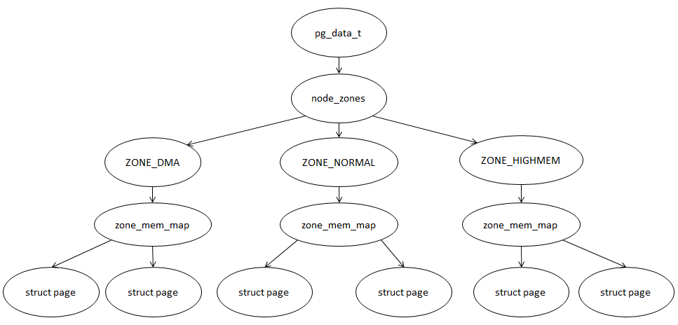

传统的计算机结构中, 整个物理内存都是一条线上的, CPU 访问整个内存空间所需要的时间都是相同的. 这种内存结构被称之为 UMA(Uniform Memory Architecture, 一致存储结构). 但是随着计算机的发展, 一些新型的服务器结构中, 尤其是多 CPU 的情况下, 物理内存空间的访问就难以控制所需的时间相同了. 在多 CPU 的环境下, 系统只有一条总线, 有多个 CPU 都链接到上面, 而且每个 CPU 都有自己本地的物理内存空间, 但是也可以通过总线去访问别的 CPU 物理内存空间, 同时也存在着一些多 CPU 都可以共同访问的公共物理内存空间. 于是乎这就出现了一个新的情况, 由于各种物理内存空间所处的位置不同, 于是访问它们的时间长短也就各异, 没法保证一致. 对于这种情况的内存结构, 被称之为 NUMA(Non-Uniform Memory Architecture, 非一致存储结构). 事实上也没有完全的 UMA, 比如常见的单 CPU 电脑, RAM、ROM 等物理存储空间的访问时间并非一致的, 只是纯粹对 RAM 而言, 是 UMA 的. 此外还有一种称之为 MPP 的结构(Massive Parallel Processing, 大规模并行处理系统), 是由多个 SMP 服务器通过一定的节点互联网络进行连接, 协同工作, 完成相同的任务. 从外界使用者看来, 它是一个服务器系统.

回归正题, 着重看一下 NUMA. 由于 NUMA 存储结构的引入, 这就需要相应的管理机制来支持,  linux 2.4 版本就已经开始对其支持了. 随着新增管理机制的支持, 也随之引入了 Node 的概念(存储节点), 把访问时间相同的存储空间归结为一个存储节点. 于是当前分析的 3.14.12 版本, linux 的物理内存管理机制将物理内存划分为三个层次来管理, 依次是: Node(存储节点)、Zone(管理区)和 Page(页面).



存储节点的数据结构为 pg\_data\_t, 每个 NUMA 节点都有一个 pg\_data\_t 负责记载该节点的内存布局信息. 其中 pg\_data\_t 结构体中存储管理区信息的为 node\_zones 成员, 其数据结构为 zone, 每个 pg\_data\_t 都有多个 node\_zones, 通常是三个: ZONE\_DMA、ZONE\_NORMAL、ZONE\_HIGHMEM.

- ZONE\_DMA 区通常是由于计算机中部分设备无法直接访问全部内存空间而特地划分出来给该部分设备使用的区, x86 环境中, 该区通常小于 16M.

- ZONE\_NORMAL 区位于 ZONE\_DMA 后面, 这个区域被内核直接映射到线性地址的高端部分, x86 环境中, 该区通常为 16M-896M.

- ZONE\_HIGHMEM 区则是系统除了 ZONE\_DMA 和 ZONE\_NORMAL 区后剩下的物理内存, 这个区不能直接被内核映射, x86 环境中, 该区通常为 896M 以后的内存.

为什么要有高端内存的存在?通常都知道内核空间的大小为 1G(线性空间为: 3-4G). 那么映射这 1G 内存需要多少页全局目录项?很容易可以算出来是 256 项, 内核有这么多线程在其中, 1G 够吗?很明显不够, 如果要使用超出 1G 的内存空间怎么办?如果要使用内存, 很明显必须要做映射, 那么腾出几个页全局目录项出来做映射?Bingo, 就是这样, 那么腾出多少来呢?**linux 内核的设计就是腾出 32 个页全局目录项, 256 的 1/8**. 那么 32 个页全局目录项对应多大的内存空间?算一下可以知道是 128M(物理地址空间, 32 个目录项, 一个目录项对应一个页表, 一个页表对应 2014 个页面, 也就是说 32 个目录项对应 32\*1024 个页面, 一个页面 4K, 共计 128MB), 也就是说直接映射的内存空间是 896M(线性地址空间, 32 位线性地址被分为 10PDT、10PT、12PGoffset, 32 个 PDT 项, 2\^5 个, ). 使用超过 896M 的内存空间视为高端内存, 一旦使用的时候, 就需要做映射转换, 这是一件很耗资源的事情. 所以不要常使用高端内存, 就是这么一个由来.

接着看一下内存管理框架的初始化实现, initmem\_init():

```
# /arch/x86/mm/init_32.c

#ifndef CONFIG_NEED_MULTIPLE_NODES
void __init initmem_init(void)
{
#ifdef CONFIG_HIGHMEM
    highstart_pfn = highend_pfn = max_pfn;
    if (max_pfn > max_low_pfn)
        highstart_pfn = max_low_pfn;
    printk(KERN_NOTICE "%ldMB HIGHMEM available.\n",
        pages_to_mb(highend_pfn - highstart_pfn));
    high_memory = (void *) __va(highstart_pfn * PAGE_SIZE - 1) + 1;
#else
    high_memory = (void *) __va(max_low_pfn * PAGE_SIZE - 1) + 1;
#endif

    memblock_set_node(0, (phys_addr_t)ULLONG_MAX, &memblock.memory, 0);
    sparse_memory_present_with_active_regions(0);

#ifdef CONFIG_FLATMEM
    max_mapnr = IS_ENABLED(CONFIG_HIGHMEM) ? highend_pfn : max_low_pfn;
#endif
    __vmalloc_start_set = true;

    printk(KERN_NOTICE "%ldMB LOWMEM available.\n",
            pages_to_mb(max_low_pfn));

    setup_bootmem_allocator();
}
#endif /* !CONFIG_NEED_MULTIPLE_NODES */
```

将 high\_memory 初始化为低端内存页框 max\_low\_pfn 对应的地址大小, 接着调用 memblock\_set\_node, 根据函数命名, 可以推断出该函数用于给早前建立的 memblock 算法设置 node 节点信息.

memblock\_set\_node 的实现:

```
# /mm/memblock.c

/**
 * memblock_set_node - set node ID on memblock regions
 * @base: base of area to set node ID for
 * @size: size of area to set node ID for
 * @type: memblock type to set node ID for
 * @nid: node ID to set
 *
 * Set the nid of memblock @type regions in [@base,@base+@size) to @nid.
 * Regions which cross the area boundaries are split as necessary.
 *
 * RETURNS:
 * 0 on success, -errno on failure.
 */
int __init_memblock memblock_set_node(phys_addr_t base, phys_addr_t size,
                      struct memblock_type *type, int nid)
{
    int start_rgn, end_rgn;
    int i, ret;

    ret = memblock_isolate_range(type, base, size, &start_rgn, &end_rgn);
    if (ret)
        return ret;

    for (i = start_rgn; i < end_rgn; i++)
        memblock_set_region_node(&type->regions[i], nid);

    memblock_merge_regions(type);
    return 0;
}
```

memblock\_set\_node 主要调用了三个函数做相关操作: memblock\_isolate\_range、memblock\_set\_region\_node 和 memblock\_merge\_regions.

其中 memblock\_isolate\_range:

```
# /mm/memblock.c
/**
 * memblock_isolate_range - isolate given range into disjoint memblocks
 * @type: memblock type to isolate range for
 * @base: base of range to isolate
 * @size: size of range to isolate
 * @start_rgn: out parameter for the start of isolated region
 * @end_rgn: out parameter for the end of isolated region
 *
 * Walk @type and ensure that regions don't cross the boundaries defined by
 * [@base,@base+@size). Crossing regions are split at the boundaries,
 * which may create at most two more regions. The index of the first
 * region inside the range is returned in *@start_rgn and end in *@end_rgn.
 *
 * RETURNS:
 * 0 on success, -errno on failure.
 */
static int __init_memblock memblock_isolate_range(struct memblock_type *type,
                    phys_addr_t base, phys_addr_t size,
                    int *start_rgn, int *end_rgn)
{
    phys_addr_t end = base + memblock_cap_size(base, &size);
    int i;

    *start_rgn = *end_rgn = 0;

    if (!size)
        return 0;

    /* we'll create at most two more regions */
    while (type->cnt + 2 > type->max)
        if (memblock_double_array(type, base, size) < 0)
            return -ENOMEM;

    for (i = 0; i < type->cnt; i++) {
        struct memblock_region *rgn = &type->regions[i];
        phys_addr_t rbase = rgn->base;
        phys_addr_t rend = rbase + rgn->size;

        if (rbase >= end)
            break;
        if (rend <= base)
            continue;

        if (rbase < base) {
            /*
             * @rgn intersects from below. Split and continue
             * to process the next region - the new top half.
             */
            rgn->base = base;
            rgn->size -= base - rbase;
            type->total_size -= base - rbase;
            memblock_insert_region(type, i, rbase, base - rbase,
                           memblock_get_region_node(rgn),
                           rgn->flags);
        } else if (rend > end) {
            /*
             * @rgn intersects from above. Split and redo the
             * current region - the new bottom half.
             */
            rgn->base = end;
            rgn->size -= end - rbase;
            type->total_size -= end - rbase;
            memblock_insert_region(type, i--, rbase, end - rbase,
                           memblock_get_region_node(rgn),
                           rgn->flags);
        } else {
            /* @rgn is fully contained, record it */
            if (!*end_rgn)
                *start_rgn = i;
            *end_rgn = i + 1;
        }
    }

    return 0;
}
```

该函数主要做分割操作, 在 memblock 算法建立时, 只是判断了 flags 是否相同, 然后将连续内存做合并操作, 而此时建立 node 节点, 则根据入参 base 和 size 标记节点内存范围将内存划分开来. 如果 memblock 中的 region 恰好以该节点内存范围末尾划分开来的话, 那么则将 region 的索引记录至 start\_rgn, 索引加 1 记录至 end\_rgn 返回回去; 如果 memblock 中的 region 跨越了该节点内存末尾分界, 那么将会把当前的 region 边界调整为 node 节点内存范围边界, 另一部分通过 memblock\_insert\_region()函数插入到 memblock 管理 regions 当中, 以完成拆分.

顺便看一下 memblock\_insert\_region()函数:

```
# /mm/memblock.c

/**
 * memblock_insert_region - insert new memblock region
 * @type: memblock type to insert into
 * @idx: index for the insertion point
 * @base: base address of the new region
 * @size: size of the new region
 * @nid: node id of the new region
 * @flags: flags of the new region
 *
 * Insert new memblock region [@base,@base+@size) into @type at @idx.
 * @type must already have extra room to accomodate the new region.
 */
static void __init_memblock memblock_insert_region(struct memblock_type *type,
                           int idx, phys_addr_t base,
                           phys_addr_t size,
                           int nid, unsigned long flags)
{
    struct memblock_region *rgn = &type->regions[idx];

    BUG_ON(type->cnt >= type->max);
    memmove(rgn + 1, rgn, (type->cnt - idx) * sizeof(*rgn));
    rgn->base = base;
    rgn->size = size;
    rgn->flags = flags;
    memblock_set_region_node(rgn, nid);
    type->cnt++;
    type->total_size += size;
}
```

这里一个 memmove()将后面的 region 信息往后移, 另外调用 memblock\_set\_region\_node()将原 region 的 node 节点号保留在被拆分出来的 region 当中.

而 memblock\_set\_region\_node()函数实现仅是赋值而已:

```
# /mm/memblock.h

static inline void memblock_set_region_node(struct memblock_region *r, int nid)
{
    r->nid = nid;
}
```

对应的 memblock\_get\_region\_node()则是获取 node 节点号:

```
# /mm/memblock.h

static inline int memblock_get_region_node(const struct memblock_region *r)
{
    return r->nid;
}
```

至此, 回到 memblock\_set\_node()函数, 里面接着 memblock\_isolate\_range()被调用的 memblock_set_region\_node()已知是获取 node 节点号, 而 memblock\_merge\_regions()则前面已经分析过了, 是用于将 region 合并的.

最后回到 initmem\_init()函数中, memblock\_set\_node()返回后, 接着调用的函数为 sparse\_memory\_present\_with\_active\_regions().

这里 sparse memory 涉及到 linux 的一个内存模型概念. linux 内核有三种内存模型: Flat memory、Discontiguous memory 和 Sparse memory. 其分别表示:

- Flat memory: 顾名思义, 物理内存是平坦连续的, 整个系统只有一个 node 节点.

- Discontiguous memory: 物理内存不连续, 内存中存在空洞, 也因而系统将物理内存分为多个节点, 但是每个节点的内部内存是平坦连续的. 值得注意的是, 该模型不仅是对于 NUMA 环境而言, UMA 环境上同样可能存在多个节点的情况.

- Sparse memory: 物理内存是不连续的, 节点的内部内存也可能是不连续的, 系统也因而可能会有一个或多个节点. 此外, 该模型是内存热插拔的基础.

看一下 sparse\_memory\_present\_with\_active\_regions()的实现:

```
# /mm/page_alloc.c

/**
 * sparse_memory_present_with_active_regions - Call memory_present for each active range
 * @nid: The node to call memory_present for. If MAX_NUMNODES, all nodes will be used.
 *
 * If an architecture guarantees that all ranges registered with
 * add_active_ranges() contain no holes and may be freed, this
 * function may be used instead of calling memory_present() manually.
 */
void __init sparse_memory_present_with_active_regions(int nid)
{
    unsigned long start_pfn, end_pfn;
    int i, this_nid;

    for_each_mem_pfn_range(i, nid, &start_pfn, &end_pfn, &this_nid)
        memory_present(this_nid, start_pfn, end_pfn);
}
```

里面的 for\_each\_mem_pfn\_range()是一个旨在循环的宏定义, 而 memory\_present()由于实验环境中没有定义 CONFIG\_HAVE\_MEMORY\_PRESENT, 所以是个空函数. 暂且搁置不做深入研究.

最后看一下 initmem\_init()退出前调用的函数 setup\_bootmem\_allocator():

```
# /arch/x86/mm/init_32.c

void __init setup_bootmem_allocator(void)
{
    printk(KERN_INFO " mapped low ram: 0 - %08lx\n",
         max_pfn_mapped<<PAGE_SHIFT);
    printk(KERN_INFO " low ram: 0 - %08lx\n", max_low_pfn<<PAGE_SHIFT);
}
```

原来该函数是用来初始化 bootmem 管理算法的, 但现在 x86 的环境已经使用了 memblock 管理算法, 这里仅作保留打印部分信息.