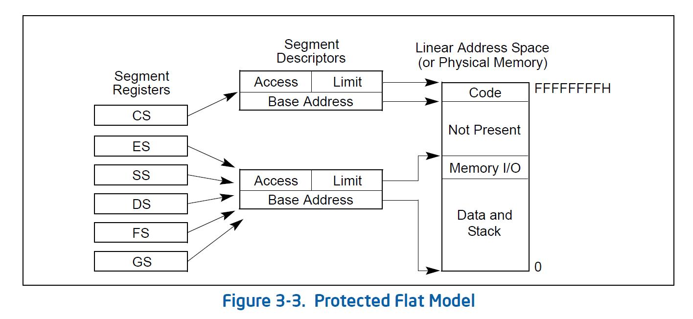
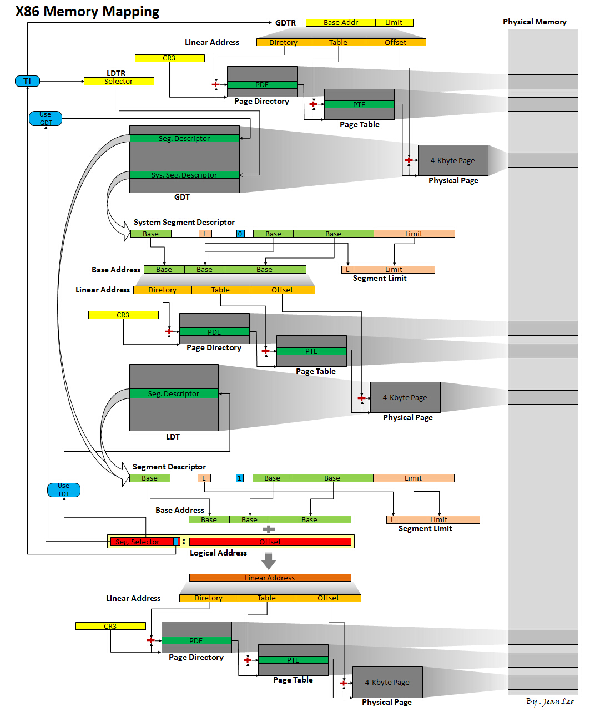
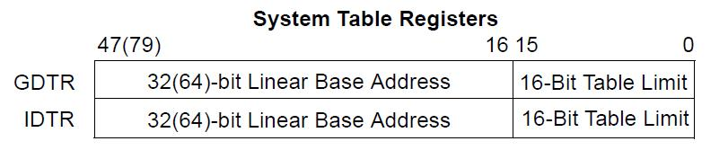
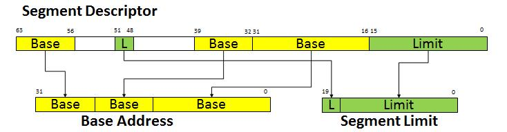
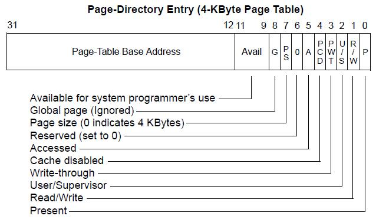
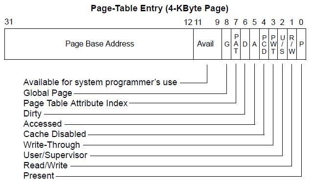
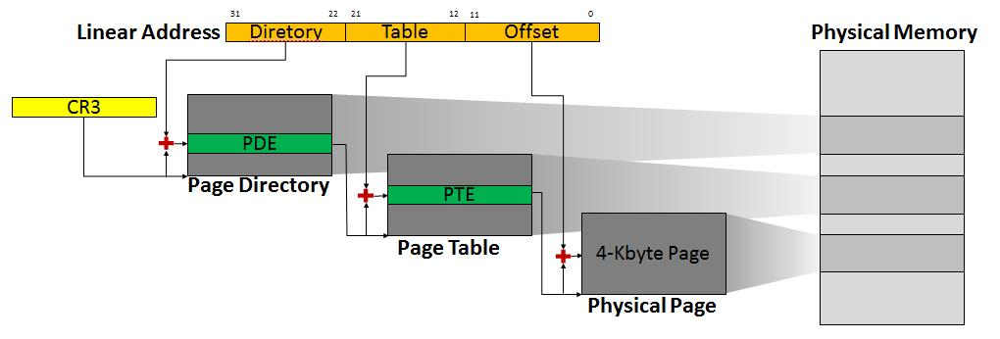
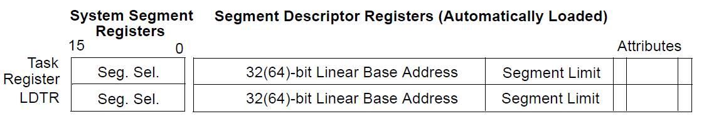
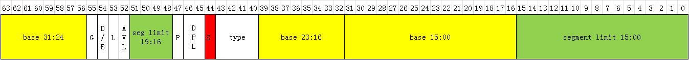

前面的分析只是侧重地讲解了 x86 32 位环境 4Kbytes 页面大小的情况, 但是实际上 x86 可支持的分页映射模式远不止于此. 所以特地总结一下.

这里先基于保护模式下 Intel IA-32 架构处理器非 PAE 下 4kbytes 页面映射的环境分析一下内存映射的整个过程, 后面再分析 x86 环境说支持的映射差异.

首先了解一下几个基本概念:

#### 逻辑地址(logical address)

逻辑地址是机器语言指令中用来指定一个操作数或者一条指令的地址, 它是由 16bit 的段选择符和 32bit 的偏移量构成的, 其中段选择符标明了段信息(也就是段描述符)的位置, 而偏移量则标明了从段开始的地方(也就是段基地址)到实际地址之间的距离. 通常记录为[段选择符: 偏移量](即[Segment Selector: Offset]).

#### 线性地址(linear address)(也成为虚拟地址 virtual address)

线性地址是一个 32bit 无符号整数, 表示的是处理器将逻辑地址转后用于表示处理器线性地址空间的 32bit 地址. 类似于物理地址空间, 线性地址空间是平坦的, 无分段的, 232byte 的地址空间(也就是 4G 大小的空间), 地址范围自 0x0 到 0xFFFFFFFF. 线性地址空间包含了所有系统定义的段描述符表和页表等.

#### 物理地址(physical address)

用于内存芯片级内存单元寻址, 也就是指处理器可通过其地址总线直接访问和操作的内存空间的地址了, 是地址转换的最终结果. 在保护模式下, IA-32 架构提供了 4G(232byte)大小的物理地址空间, 该地址空间是平坦无分段的, 且地址自 0 到 FFFFFFFFH 连续. **物理地址空间**可以被映射到**可读写存储器**、**只读存储器**和**存储器映射 I/O(PIO)**.

x86 内存映射是这么一个流程图:

也就是:

逻辑地址——(段映射)——>线性地址——(页映射)——>物理地址

整个流程很明了, 但是往往很容易出现几个问题: 逻辑地址转换到线性地址所需要的段描述符在哪里?是的, 通过 GDTR/LDTR 里面的基地址结合段选择符找到, 那么这个基地址是线性地址还是物理地址?再往后, 线性地址转换为物理地址所需的页全局目录在哪里?通过 CR3 寄存器找到, 那么这个寄存器存的值是线性地址还是物理地址?那么还有页表呢?

确实很容易出现疑问, 那么现在还是回到整个地址翻译过程来分析和解答上面的问题. 先来看一张图:

整个内存映射流程补全就是上面的这么一种情况了. 接下来文字说明一下:

(一) 逻辑地址[Seg.Selector: Offset]由段选择符(Seg.Selector, 通常是段寄存器)和偏移量构成, 而段选择符格式为:

其中 RPL 和 TI 是表示属性信息, RPL(Requested Privilege Level)表示特权级; TI(Table Indicator)表示指定描述符表, 为 0 时表示使用 GDT(全局描述符表), 为 1 时表示使用 LDT(局部描述符表). 而 Index 才为描述符索引. 通过段选择符可以知道的信息: 1、使用 GDT 还是 LDT; 2、描述符索引; 3、特权级. 段选择符的特权级较少使用, 这里就不分析了. 接下来的内存翻译需要段描述符里面的信息, 段描述符根据 TI 的指定来自 GDT 还是 LDT, GDT 的位置可以通过 GDTR 来找到, 而 LDT 却不如此. 所以这里需要分开说明一下.

(二) 优先分析一下 GDT 的物理内存定位. GDT 是通过 GDTR 寄存器里面的信息来确定位置的, GDTR 的格式如下图:

它是一个 48bit 的数据, 由 32bit 的线性地址(高 32bit)和 16bit 的全局描述符表大小(低 16bit)构成. 既然是线性地址, 那么在开启段页式映射的环境, 它必然需要经过一个页式转换. 页式转换详情稍后有描述, 这里仅需要知道即可. 经过页式转换后, 就可以找到 GDT 所在的物理内存了, 该内存里面有需要的段描述符.

(三) 通过段选择符里面的描述符索引可以找到目标段描述符, 运算公式: Index * 8 + Linear Base Address(每项段描述符的大小为 8, 所以乘 8). 接下来再看一下段描述符的格式:

段描述符是一个 64bit 的数据(8bytes), 包含了段基地址、段限长以及各项段属性. 段基地址并不是连续的, 而是被拆分开来的, 它由描述符的 63-56 和 39-16 位数据构成(如下图的黄色部分). 而段限长亦如此, 由 51-48 和 15-0 位数据构成(绿色部分).

组合形式:

人工分析映射的时候, 尤其需要注意这点, 另外留意一下段描述符中存在着 S 位(即: Descriptor type), 稍后用到.

(四) 现在已知段基地址(Base Address), 那么目标操作数据的线性地址则为: Base Address+Offset, 段基地址和逻辑地址中的偏移量相加的和值. 至此, 段式映射已经转换完毕, 这个和值就是逻辑地址转换后的线性地址. 接下来页式映射, 这个线性地址将会拆分为 3 部分: 页全局目录索引(前 10bit)、页表索引(中 10bit)和页偏移量(尾 12bit). 页式转换首先通过 CR3 寄存器找到全局页目录所在位置(注: **CR3 存放的是页全局目录的物理地址**), 通过页全局目录索引, 可以找到对应的**PDE**(页全局目录项); 页全局目录项的里面附带的信息有页表基地址和页表属性, 如图:

页表基地址是 32bit 的数据, 也就是将读取出来的 PDE 末尾属性标示位清 0 即可得到该基地址(该基地址是物理地址), 基地址结合页表索引就可以得到**PTE**(页表项); 页表项的内容类似于 PDE, 如图:

将 PTE 的属性标示位清 0 即可得到 4Kbytes 的物理页面的基地址了(物理地址), 该基地址加上页偏移量, 就得到了最终的物理地址. 至此, 线性地址转换物理地址完毕, 相关流程如下图:

使用 GDT 将逻辑地址转换物理地址的过程就此结束.

(五) 再绕回来讲一下前面遗留的, 关于 LDT 的物理内存定位. 先了解一下 LDTR 寄存器的情况:

**LDTR 和段寄存器类似**, 对程序员可见的仅是前面的**16bit 大小的段选择部分**而已, 后面的 32bit 的段基地址、段限长以及属性信息都是不可见的描述符高速缓冲部分. 操作加载 LDTR 的时候, 仅需将段选择符加载上去即可, 后面的描述符部分将会自动根据段选择符从 LDT 中找到对应的描述符并加载. 既然知道 LDTR 存放的也是一个段选择符, 那么这个段选择符用在哪里呢?它**用在 GDT 表中定位**. 那么整个 LDT 表的定位就是: 1、根据 LDTR 寄存器的段选择符信息, 查找 GDT 表, 将会在 GDT 中查找到一个 LDT 描述符; 2、根据描述符中的基地址信息和段限长, 由于基地址是线性地址, 所以仍需要页式转换, 就可以定位到 LDT 局部描述符表了. 貌似这么一来一去, 挺麻烦的, 不过由于 LDTR 有描述符高速缓冲区, 再加上 TLB 的配合, 实际上真正需要这么累赘去定位物理页面的机会不太多. 而且 GDT 和 LDT 在本质上是没区别的, 也可以理解为: GDT 是一级描述符表, LDT 是二级描述符表. 于是如此设计有了更好的扩展性. 顺带提一下, LDT 描述符表和普通的段描述符表的差异在于哪里, 就在于下面标红的 S 位, 也就是 Descriptor type, 为 0 的时候, 表示为系统段描述符(LDT 描述符是系统段描述符的一种), 为 1 的时候就表示代码段或者数据段了.

再啰嗦一下, 虽然 Intel 如此设计, 功能强大, 可谓用心良苦, 不过这个也在某些方面给程序员新增了负担, 毕竟如此设计在其他处理器上面是没有的, 就本人接触的**PPC、MIPS、ARM 处理器都没听说过有分段的做法**, 如果真心使用了 Intel 的这些功能, 真不敢想象环境移植的时候, 会有多痛苦. 所以 Linux 设计开发的时候, 往往是不使用这些功能的, 详细的以后再说明.

(六) 既然定位到 LDT 了, 那么再往后的内存地址转换就是根据逻辑地址的段选择符定位 LDT 中的段描述符, 通过描述符中的基地址信息加上逻辑地址的偏移量, 最终的和值得到了使用 LDT 转换后的线性地址了. 不可避免的就是线性地址再经过页式转换, 最后定位到具体的物理内存.

整个内存映射基本就这样了, 至于 4KBytes、2Mbytes 和 4Mbytes 的页面映射, 其实也只是线性地址转换物理地址存在差异罢了, 至于逻辑地址转换线性地址上面是不存在什么差异的. 再者就是几个控制寄存器的功能标志位设置上面的差异. 这些差异后续再统一列举分析.