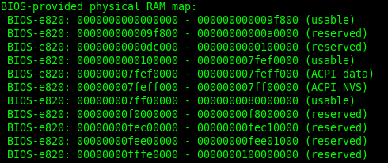

memblock 算法是 linux 内核初始化阶段的一个内存分配器(它取代了原来的 bootmem 算法), 实现较为简单. 负责 page allocator 初始化之前的内存管理和分配请求.

分析 memblock 算法, 可以从几点入手:

1、 memblock 算法初始化;

2、 memblock 算法管理内存的申请和释放;

memblock 算法前的准备:

前面已经分析了 linux 系统在初始化的过程中, 使用 int 15 中断探知了机器的内存分布图(e820 图), 其数据是存储在 boot\_params.e820\_map 里面, 这里面是没有经过整理的数据, 杂乱无章, 毕竟 BIOS 没有责任做整理内存的事情, 所以这部分事情由系统来实现. 那么看一下 linux 如何实现这部分功能的, 这部分功能是在 setup\_memory\_map 里面实现的.

该函数在初始化中的调用位置:

```
start_kernel()
|
└->setup_arch()
   |
   └->setup_memory_map();
```

函数实现:

```
#/arch/x86/kernel/e820.c

void __init setup_memory_map(void)
{
    char *who;

    who = x86_init.resources.memory_setup();
    memcpy(&e820_saved, &e820, sizeof(struct e820map));
    printk(KERN_INFO "e820: BIOS-provided physical RAM map:\n");
    e820_print_map(who);
}
```

可以看到实现很简单, 先是**调用了一个钩子函数**, 然后将**e820**保存到**e820\_saved**里面, 再往下就是 print 函数. 很明显可以看到关键点在于这个钩子函数的实现, 在 x86\_init.c 里面可以找到 x86\_init 该结构体变量的定义:

```
#/arch/x86/kernel/x86_init.c

/*
 * The platform setup functions are preset with the default functions
 * for standard PC hardware.
 */
struct x86_init_ops x86_init __initdata = {

    .resources = {
        .probe_roms = probe_roms,
        .reserve_resources = reserve_standard_io_resources,
        .memory_setup = default_machine_specific_memory_setup,
    },

    .mpparse = {
        .mpc_record = x86_init_uint_noop,
        .setup_ioapic_ids = x86_init_noop,
        .mpc_apic_id = default_mpc_apic_id,
        .smp_read_mpc_oem = default_smp_read_mpc_oem,
        .mpc_oem_bus_info = default_mpc_oem_bus_info,
        .find_smp_config = default_find_smp_config,
        .get_smp_config = default_get_smp_config,
    },

    .irqs = {
        .pre_vector_init = init_ISA_irqs,
        .intr_init = native_init_IRQ,
        .trap_init = x86_init_noop,
    },

    .oem = {
        .arch_setup = x86_init_noop,
        .banner = default_banner,
    },

    .paging = {
        .pagetable_init = native_pagetable_init,
    },

    .timers = {
        .setup_percpu_clockev = setup_boot_APIC_clock,
        .tsc_pre_init = x86_init_noop,
        .timer_init = hpet_time_init,
        .wallclock_init = x86_init_noop,
    },

    .iommu = {
        .iommu_init = iommu_init_noop,
    },

    .pci = {
        .init = x86_default_pci_init,
        .init_irq = x86_default_pci_init_irq,
        .fixup_irqs = x86_default_pci_fixup_irqs,
    },
};
```

由此可以看到该钩子函数挂的是 default\_machine\_specific\_memory\_setup().

进一步看一下该函数的实现:

```
#/arch/x86/kernel/e820.c

char *__init default_machine_specific_memory_setup(void)
{
    char *who = "BIOS-e820";
    u32 new_nr;
    /*
     * Try to copy the BIOS-supplied E820-map.
     *
     * Otherwise fake a memory map; one section from 0k->640k,
     * the next section from 1mb->appropriate_mem_k
     */
    new_nr = boot_params.e820_entries;
    sanitize_e820_map(boot_params.e820_map,
            ARRAY_SIZE(boot_params.e820_map),
            &new_nr);
    boot_params.e820_entries = new_nr;
    if (append_e820_map(boot_params.e820_map, boot_params.e820_entries)
      < 0) {
        u64 mem_size;

        /* compare results from other methods and take the greater */
        if (boot_params.alt_mem_k
            < boot_params.screen_info.ext_mem_k) {
            mem_size = boot_params.screen_info.ext_mem_k;
            who = "BIOS-88";
        } else {
            mem_size = boot_params.alt_mem_k;
            who = "BIOS-e801";
        }

        e820.nr_map = 0;
        e820_add_region(0, LOWMEMSIZE(), E820_RAM);
        e820_add_region(HIGH_MEMORY, mem_size << 10, E820_RAM);
    }

    /* In case someone cares... */
    return who;
}
```

在这个函数里面, 可以看到前面探测到的**内存布局信息 boot\_params.e820\_map**在这里被使用了.

首先分析一下 sanitize\_e820\_map 该函数把 e820 信息进行了如何处理, 函数实现:

```
#/arch/x86/kernel/e820.c

int __init sanitize_e820_map(struct e820entry *biosmap, int max_nr_map,
                 u32 *pnr_map)
{
    static struct change_member change_point_list[2*E820_X_MAX] __initdata;
    static struct change_member *change_point[2*E820_X_MAX] __initdata;
    static struct e820entry *overlap_list[E820_X_MAX] __initdata;
    static struct e820entry new_bios[E820_X_MAX] __initdata;
    unsigned long current_type, last_type;
    unsigned long long last_addr;
    int chgidx;
    int overlap_entries;
    int new_bios_entry;
    int old_nr, new_nr, chg_nr;
    int i;

    /* if there's only one memory region, don't bother */
    if (*pnr_map < 2)
        return -1;

    old_nr = *pnr_map;
    BUG_ON(old_nr > max_nr_map);

    /* bail out if we find any unreasonable addresses in bios map */
    for (i = 0; i < old_nr; i++)
        if (biosmap[i].addr + biosmap[i].size < biosmap[i].addr)
            return -1;

    /* create pointers for initial change-point information (for sorting) */
    for (i = 0; i < 2 * old_nr; i++)
        change_point[i] = &change_point_list[i];

    /* record all known change-points (starting and ending addresses),
       omitting those that are for empty memory regions */
    chgidx = 0;
    for (i = 0; i < old_nr; i++) {
        if (biosmap[i].size != 0) {
            change_point[chgidx]->addr = biosmap[i].addr;
            change_point[chgidx++]->pbios = &biosmap[i];
            change_point[chgidx]->addr = biosmap[i].addr +
                biosmap[i].size;
            change_point[chgidx++]->pbios = &biosmap[i];
        }
    }
    chg_nr = chgidx;

    /* sort change-point list by memory addresses (low -> high) */
    sort(change_point, chg_nr, sizeof *change_point, cpcompare, NULL);

    /* create a new bios memory map, removing overlaps */
    overlap_entries = 0; /* number of entries in the overlap table */
    new_bios_entry = 0; /* index for creating new bios map entries */
    last_type = 0; /* start with undefined memory type */
    last_addr = 0; /* start with 0 as last starting address */

    /* loop through change-points, determining affect on the new bios map */
    for (chgidx = 0; chgidx < chg_nr; chgidx++) {
        /* keep track of all overlapping bios entries */
        if (change_point[chgidx]->addr ==
            change_point[chgidx]->pbios->addr) {
            /*
             * add map entry to overlap list (> 1 entry
             * implies an overlap)
             */
            overlap_list[overlap_entries++] =
                change_point[chgidx]->pbios;
        } else {
            /*
             * remove entry from list (order independent,
             * so swap with last)
             */
            for (i = 0; i < overlap_entries; i++) {
                if (overlap_list[i] ==
                    change_point[chgidx]->pbios)
                    overlap_list[i] =
                        overlap_list[overlap_entries-1];
            }
            overlap_entries--;
        }
        /*
         * if there are overlapping entries, decide which
         * "type" to use (larger value takes precedence --
         * 1=usable, 2,3,4,4+=unusable)
         */
        current_type = 0;
        for (i = 0; i < overlap_entries; i++)
            if (overlap_list[i]->type > current_type)
                current_type = overlap_list[i]->type;
        /*
         * continue building up new bios map based on this
         * information
         */
        if (current_type != last_type) {
            if (last_type != 0) {
                new_bios[new_bios_entry].size =
                    change_point[chgidx]->addr - last_addr;
                /*
                 * move forward only if the new size
                 * was non-zero
                 */
                if (new_bios[new_bios_entry].size != 0)
                    /*
                     * no more space left for new
                     * bios entries ?
                     */
                    if (++new_bios_entry >= max_nr_map)
                        break;
            }
            if (current_type != 0) {
                new_bios[new_bios_entry].addr =
                    change_point[chgidx]->addr;
                new_bios[new_bios_entry].type = current_type;
                last_addr = change_point[chgidx]->addr;
            }
            last_type = current_type;
        }
    }
    /* retain count for new bios entries */
    new_nr = new_bios_entry;

    /* copy new bios mapping into original location */
    memcpy(biosmap, new_bios, new_nr * sizeof(struct e820entry));
    *pnr_map = new_nr;

    return 0;
}
```

第一个 for 循环:

```
/* bail out if we find any unreasonable addresses in bios map */

for (i = 0; i < old_nr; i++)

    if (biosmap[i].addr + biosmap[i].size < biosmap[i].addr)

        return -1;
```

这里是将 e820 做一个全面检测, 检测是否存在不合理的内存布局信息项, 存在不合理项则直接退出.

第二个 for 循环:

```
    /* create pointers for initial change-point information (for sorting) */

    for (i = 0; i < 2 * old_nr; i++)

        change_point[i] = &change_point_list[i];
```
将 change\_point 和 change\_point\_list 关联起来, 实际上 change\_point\_list 只是占用一个栈空间而已, 真正起到作用的是 change\_point.

第三个 for 循环和 sort 函数的调用一起来分析:

```
/* record all known change-points (starting and ending addresses),

   omitting those that are for empty memory regions */

chgidx = 0;

for (i = 0; i < old_nr; i++)    {

    if (biosmap[i].size != 0) {

        change_point[chgidx]->addr = biosmap[i].addr;

        change_point[chgidx++]->pbios = &biosmap[i];

        change_point[chgidx]->addr = biosmap[i].addr +

            biosmap[i].size;

        change_point[chgidx++]->pbios = &biosmap[i];

    }

}

chg_nr = chgidx;


/* sort change-point list by memory addresses (low -> high) */

sort(change_point, chg_nr, sizeof *change_point, cpcompare, NULL);
```

这里是把**change\_point 初始化**并与**boot\_params.e820\_map**各项的**起始地址**和**结束地址**分别关联起来, 继而**通过 sort 来进行排序**. 排序的结果就是将各项内存布局信息所标示的内存空间起始地址和结束地址由低往高进行排序. 如果两者地址值相等, 则以两者的 e820\_map 项信息所标示的内存空间尾做排序依据, 哪个空间尾更后, 则该项排在等值项后面.

每个 e820entry 由两个 change\_member 表述

```
e820entry                         change_member(变量名字是 change_point)
+-------------------+             +------------------------+
|addr, size         |             |start, e820entry        |
|                   |     ===>    +------------------------+
|type               |             |end,   e820entry        |
+-------------------+             +------------------------+
```

整个表形成了一个 change_member 的数组

```
change_member*[]                               change_member[]
+------------------------+                     +------------------------+
|*start1                 |      ------>        |start1, entry1          |
+------------------------+                     +------------------------+
|*end1                   |      ------>        |end1,   entry1          |
+------------------------+                     +------------------------+
|*start2                 |      ------>        |start2, entry2          |
+------------------------+                     +------------------------+
|*end2                   |      ------>        |end2,   entry2          |
+------------------------+                     +------------------------+
|*start3                 |      ------>        |start3, entry3          |
+------------------------+                     +------------------------+
|*end3                   |      ------>        |end3,   entry3          |
+------------------------+                     +------------------------+
|*start4                 |      ------>        |start4, entry4          |
+------------------------+                     +------------------------+
|*end4                   |      ------>        |end4,   entry4          |
+------------------------+                     +------------------------+
```

对 change\_member->addr 排序

```
change_member*[]
+------------------------+
|*start1                 |
+------------------------+
|*start2                 |
+------------------------+
|*end2                   |
+------------------------+
|*end1                   |
+------------------------+
|*start3                 |
+------------------------+
|*start4                 |
+------------------------+
|*end4                   |
+------------------------+
|*end3                   |
+------------------------+
```

遍历排序后的 change\_member\* 数组

因为 chage\_mamber 已经排序了, 所以遍历数组就得到了整个内存空间从小到大的顺序.

比如我们现在排序后是这样的结果.

```
(start1,   start2,   end2,   end1,   start3,   start4,   end4,   end3)
```

看一下最后的 for 循环:

```
/* loop through change-points, determining affect on the new bios map */

for (chgidx = 0; chgidx < chg_nr; chgidx++) {

    /* keep track of all overlapping bios entries */

    if (change_point[chgidx]->addr ==

        change_point[chgidx]->pbios->addr) {

        /*

         * add map entry to overlap list (> 1 entry

         * implies an overlap)

         */

        overlap_list[overlap_entries++] =

            change_point[chgidx]->pbios;

    } else {

        /*

         * remove entry from list (order independent,

         * so swap with last)

         */

        for (i = 0; i < overlap_entries; i++) {

            if (overlap_list[i] ==

                change_point[chgidx]->pbios)

                overlap_list[i] =

                    overlap_list[overlap_entries-1];

        }

        overlap_entries--;

    }

    /*

     * if there are overlapping entries, decide which

     * "type" to use (larger value takes precedence --

     * 1=usable, 2,3,4,4+=unusable)

     */

    current_type = 0;

    for (i = 0; i < overlap_entries; i++)

        if (overlap_list[i]->type > current_type)

            current_type = overlap_list[i]->type;

    /*

     * continue building up new bios map based on this

     * information

     */

    if (current_type != last_type)  {

        if (last_type != 0) {

            new_bios[new_bios_entry].size =

                change_point[chgidx]->addr - last_addr;

            /*

             * move forward only if the new size

             * was non-zero

             */

            if (new_bios[new_bios_entry].size != 0)

                /*

                 * no more space left for new

                 * bios entries ?

                 */

                if (++new_bios_entry >= max_nr_map)

                    break;

        }

        if (current_type != 0)  {

            new_bios[new_bios_entry].addr =

                change_point[chgidx]->addr;

            new_bios[new_bios_entry].type = current_type;

            last_addr = change_point[chgidx]->addr;

        }

        last_type = current_type;

    }

}
```

这个循环里面干了什么事情呢?其大概作用就是**把已经排序完了的 change\_point**做**整合**, 将**重叠的内存空间根据属性进行筛选**, 并将**同属性的相邻内存空间进行合并处理**. 具体实现流程为:

1、 最初第一次循环加入 change\_point 项, 将根据当前 change\_point 记录的地址项是否与其关联的 e820\_map 项的起始地址一致, 如果一致(第一次必然是一致的), **表示当前项是某内存块的起始地址, 将其加入到 overlap\_list 中去**, 然后该项将会添加到 new\_bios 中并更新 last\_addr, 最后更新当前内存块的内存类型到 last\_type 中(这个类型当做优先级理解, 会容易理解代码的, 0 优先级最低);

2、 第二次循环加入 change\_point 项, 就会开始遇到各种状况了:

A.   假设**change\_point 新加入项是第一项的内存尾, 那么 overlap\_list 将会移除该项**, new\_bios 将会更新当前项的内存块大小, 只要内存块大小不为 0, 那么 new\_bios\_entry 自加, new\_bios 开始新一项的内容记录;

B.   假设 change\_point 新加入项是新的内存块地址头, 那么 overlap\_list 将会新增一项, 然后 current\_type 将会更新到 overlap\_list 列表中的所有项的类型最大值(最高优先级), 接下来又出现新状况了:

a)   如果当前新加入 change\_point 的类型值等于前者, 继续开始下一循环;

b)   如果当前新加入 change\_point 的类型值大于前者, 那么 new\_bios 将会以该 change\_point 项纪录的地址作为 new\_bios 前一项的结束地址, 然后更新大小到 new\_bios 中, 开启 new_bios 的新一项的记录;

c)   如果当前新加入 change\_point 的类型值小于前者, 由于 current\_type 将会仍然保持前者的类型值, 后续将会跳过开始下一循环;

3、 第三次循环加入 change\_point 项, 基于前面第二次循环加入 change\_point 项的情况, 如果是情况 A, 那么问题很简单, 就是一个新开始而已; 如果是情况 B, 将会出现稍微复杂的情况:

A.   假设该 change\_point 新加入项又是新的内存块头, 将会涉及类型值不同的问题, 其实也就是重复前面类型第二次循环的情况 B 的场景, 这里就不细述了;

B.   假设该 change\_point 新加入项是前面的内存块尾, 那么可能的状况是:

a)   如果前面已加入的两项类型相同, 即 B.a 的情形, 当前作为内存尾新加入 change\_point 的类型值必然也是相同的, 这仅会把与 overlap\_list 中配对的那一项从队列中删除, 继续开始加入 change\_point 下一项;

b)   如果前面两项, 第一项类型值大于第二项, 即 B.c 的情形, 若当前项作为第一项的尾加入, 那么当前的 new\_bios 项将会以此作为结尾; 但是若当前项作为第二项的尾加入, 那么将把第二项从 overlap\_list 中删除;

c)   如果前面两项, 第二项类型值大于第一项, 即 B.b 的情形, 若当前项作为第一项的尾加入, 也仅是将第一项从 overlap\_list 中删除; 若当前项作为第一项的尾加入, 那么 new\_bios 将会就此作为尾完成当前项;

后续的循环加入 change\_point 项也仅是前面的场景演变而已, 这里不细述了. 那么从前面的信息来看, 这个函数的目的是什么基本明了, 也就是将 boot\_params.e820\_map 里面的内存布局根据顺序和重叠情况, 将连续的同类型的内存块合并, 将不同类型的内存块根据高低优先级进行内存块划分拆开.

#### 用 overlap_list 跟踪 "type"的变化

overlap\_list 保存了遍历过程中没有配对的 change\_member. 每次有变动都会计算一下**整个数组中的 type 属性**. 如果有变化, 则表明有内存区域的临界值出现.

下面是手动展开的一个例子:

```
* chgidx == 0

     change_member*[]                      overlap_list[]
     +------------------------+            +-------------------+
 --> |*start1                 |            |*start1            |
     +------------------------+            +-------------------+
     |*start2                 |
     +------------------------+
     |*end2                   |
     +------------------------+
     |*end1                   |
     +------------------------+
     |*start3                 |
     +------------------------+
     |*start4                 |
     +------------------------+
     |*end4                   |
     +------------------------+
     |*end3                   |
     +------------------------+


* chgidx == 1

     change_member*[]                      overlap_list[]
     +------------------------+            +-------------------+
     |*start1                 |            |*start1            |
     +------------------------+            +-------------------+
 --> |*start2                 |            |*start2            |
     +------------------------+            +-------------------+
     |*end2                   |
     +------------------------+
     |*end1                   |
     +------------------------+
     |*start3                 |
     +------------------------+
     |*start4                 |
     +------------------------+
     |*end4                   |
     +------------------------+
     |*end3                   |
     +------------------------+

* chgidx == 2

     change_member*[]                      overlap_list[]
     +------------------------+            +-------------------+
     |*start1                 |            |*start1            |
     +------------------------+            +-------------------+
     |*start2                 |            |                   |
     +------------------------+            +-------------------+
 --> |*end2                   |
     +------------------------+
     |*end1                   |
     +------------------------+
     |*start3                 |
     +------------------------+
     |*start4                 |
     +------------------------+
     |*end4                   |
     +------------------------+
     |*end3                   |
     +------------------------+
```

overlap\_list[]的变化一共有两种情况

> 遇见 "start", 则加入 overlap\_list[].
> 遇见 "end", 则将对应的"start"从 overlap\_list[]中删除

"current\_type" 整个 overlap\_list[]数组中 type 属性的最大值.而"last\_type"上一个循环中的"current_type". 当这两个值不同时, 表明了我们遇到了 e820 数组的边界, 这时候就需要添加一个或者设置适当的大小了.

让我再用下面这张图来解释一下这个过程.

```
0     type1      type2     type1    0      type3     type4    type4   type3
        |          |         |      |        |         |        |       |
        v          v         v      v        v         v        v       v
      (start1,   start2,   end2,   end1,   start3,   start4,   end4,   end3)
```

正如下描述的一样:

```
#/arch/x86/kernel/e820.c

/*
 * Sanitize the BIOS e820 map.
 *
 * Some e820 responses include overlapping entries. The following
 * replaces the original e820 map with a new one, removing overlaps,
 * and resolving conflicting memory types in favor of highest
 * numbered type.
 *
 * The input parameter biosmap points to an array of 'struct
 * e820entry' which on entry has elements in the range [0, *pnr_map)
 * valid, and which has space for up to max_nr_map entries.
 * On return, the resulting sanitized e820 map entries will be in
 * overwritten in the same location, starting at biosmap.
 *
 * The integer pointed to by pnr_map must be valid on entry (the
 * current number of valid entries located at biosmap) and will
 * be updated on return, with the new number of valid entries
 * (something no more than max_nr_map.)
 *
 * The return value from sanitize_e820_map() is zero if it
 * successfully 'sanitized' the map entries passed in, and is -1
 * if it did nothing, which can happen if either of (1) it was
 * only passed one map entry, or (2) any of the input map entries
 * were invalid (start + size < start, meaning that the size was
 * so big the described memory range wrapped around through zero.)
 *
 * Visually we're performing the following
 * (1,2,3,4 = memory types)...
 *
 * Sample memory map (w/overlaps):
 * ____22__________________
 * ______________________4_
 * ____1111________________
 * _44_____________________
 * 11111111________________
 * ____________________33__
 * ___________44___________
 * __________33333_________
 * ______________22________
 * ___________________2222_
 * _________111111111______
 * _____________________11_
 * _________________4______
 *
 * Sanitized equivalent (no overlap):
 * 1_______________________
 * _44_____________________
 * ___1____________________
 * ____22__________________
 * ______11________________
 * _________1______________
 * __________3_____________
 * ___________44___________
 * _____________33_________
 * _______________2________
 * ________________1_______
 * _________________4______
 * ___________________2____
 * ____________________33__
 * ______________________4_
 */
 ```

 为了方便理解, 整理出一张草图:

 

连续的同类型的合并到一块里面, 不同类型的各自为政, 不同类型重叠部分根据类型优先级高低拆分, 依高优先级顺序保证各类型的内存块的完整性. 额外废话一句: 目前玩虚拟机没有遇到过上面这么复杂的情况, 但是不能否认这段代码是设计来干这活的.

 从 sanitize\_e820\_map 出来后, 回到 default\_machine\_specific\_memory\_setup 中, 接下来是 append\_e820\_map 的函数, 加到全局变量数据 e820_map 里:

 ```
# /arch/x86/kernel/e820.c

static int __init append_e820_map(struct e820entry *biosmap, int nr_map)
{
    /* Only one memory region (or negative)? Ignore it */
    if (nr_map < 2)
        return -1;

    return __append_e820_map(biosmap, nr_map);
}
```

append\_e820\_map 封装调用\_\_append\_e820\_map:

```
# /arch/x86/kernel/e820.c

static int __init __append_e820_map(struct e820entry *biosmap, int nr_map)
{
    while (nr_map) {
        u64 start = biosmap->addr;
        u64 size = biosmap->size;
        u64 end = start + size;
        u32 type = biosmap->type;

        /* Overflow in 64 bits? Ignore the memory map. */
        if (start > end)
            return -1;

        e820_add_region(start, size, type);

        biosmap++;
        nr_map--;
    }
    return 0;
}
```

循环调用 e820\_add\_region 将整理后的 boot\_params.e820\_map 做添加操作:

```
# /arch/x86/kernel/e820.c

void __init e820_add_region(u64 start, u64 size, int type)
{
    __e820_add_region(&e820, start, size, type);
}
```

e820\_add\_region 封装\_\_e820\_add\_region:

```
# /arch/x86/kernel/e820.c

static void __init __e820_add_region(struct e820map *e820x, u64 start, u64 size,
                     int type)
{
    int x = e820x->nr_map;

    if (x >= ARRAY_SIZE(e820x->map)) {
        printk(KERN_ERR "e820: too many entries; ignoring [mem %#010llx-%#010llx]\n",
               (unsigned long long) start,
               (unsigned long long) (start + size - 1));
        return;
    }

    e820x->map[x].addr = start;
    e820x->map[x].size = size;
    e820x->map[x].type = type;
    e820x->nr_map++;
}
```

而\_\_e820\_add\_region 则是将各项信息往 e820 做添加操作. 说白了, 就是将 boot\_params.e820\_map 转入到 e820 图中.

最后顺便看一下 e820\_print\_map 函数的实现:

```
# /arch/x86/kernel/e820.c

void __init e820_print_map(char *who)
{
    int i;

    for (i = 0; i < e820.nr_map; i++) {
        printk(KERN_INFO "%s: [mem %#018Lx-%#018Lx] ", who,
               (unsigned long long) e820.map[i].addr,
               (unsigned long long)
               (e820.map[i].addr + e820.map[i].size - 1));
        e820_print_type(e820.map[i].type);
        printk(KERN_CONT "\n");
    }
}
```

它是将钩子函数返回的内容打印出来, 打印出来的内容可以在 shell 上面通过 dmesg 命令查看得到, 例如:



最后总结一下, 以上代码干了这么多活, 主要就是为了把通过 BIOS 中断探测到的内存布局信息 boot\_params.e820\_map 做整合处理, 完了转存到变量 e820 中.