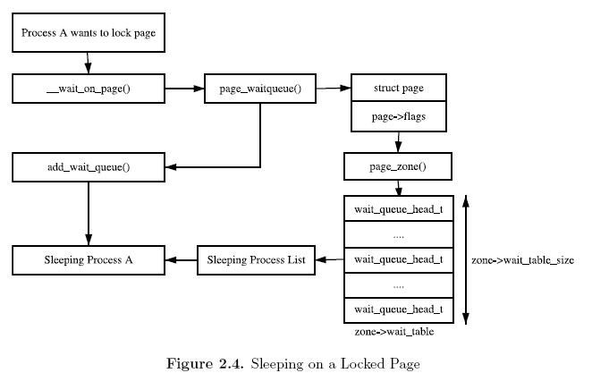
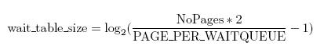
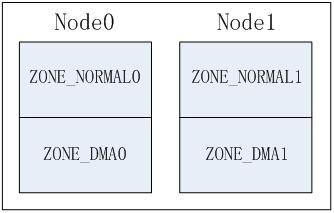
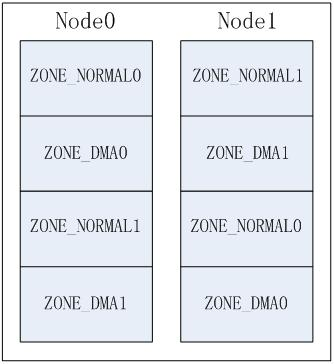
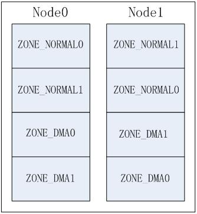
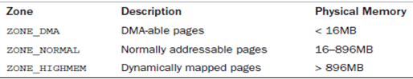

<!-- @import "[TOC]" {cmd="toc" depthFrom=1 depthTo=6 orderedList=false} -->

<!-- code_chunk_output -->

- [1. 前景回顾](#1-前景回顾)
  - [1.1. UMA 和 NUMA 两种模型](#11-uma-和-numa-两种模型)
    - [1.1.1. UMA 模型](#111-uma-模型)
    - [1.1.2. NUMA 模型](#112-numa-模型)
  - [1.2. (N)UMA 模型中 linux 内存的架构](#12-numa-模型中-linux-内存的架构)
    - [1.2.1. NUMA](#121-numa)
    - [1.2.2. UMA](#122-uma)
  - [1.3. Linux 如何描述物理内存](#13-linux-如何描述物理内存)
  - [1.4. 用 pd_data_t 描述内存节点 node](#14-用-pd_data_t-描述内存节点-node)
  - [1.5. 今日内容(内存管理域 zone)](#15-今日内容内存管理域-zone)
- [2. 为什么要将内存 node 分成不同的区域 zone](#2-为什么要将内存-node-分成不同的区域-zone)
- [3. 内存管理区类型 zone_type](#3-内存管理区类型-zone_type)
  - [3.1. 内存区域类型 zone_type](#31-内存区域类型-zone_type)
  - [3.2. 不同的内存区域的作用](#32-不同的内存区域的作用)
  - [3.3. 典型架构(x86)上内存区域划分](#33-典型架构x86上内存区域划分)
- [4. 管理区结构 zone_t](#4-管理区结构-zone_t)
  - [4.1. struct zone 管理域数据结构](#41-struct-zone-管理域数据结构)
- [5. ZONE_PADDING 将数据保存在高速缓冲行](#5-zone_padding-将数据保存在高速缓冲行)
- [6. 水位 watermark[NR_WMARK]与 kswapd 内核线程](#6-水位-watermarknr_wmark与-kswapd-内核线程)
- [7. 内存域标志](#7-内存域标志)
  - [7.1. 内存域统计信息 vm_stat](#71-内存域统计信息-vm_stat)
  - [7.2. zone 等待队列表(zone wait queue table)](#72-zone-等待队列表zone-wait-queue-table)
  - [7.3. zone 的初始化](#73-zone-的初始化)
  - [7.4. 冷热页与 Per-CPU 上的页面高速缓存](#74-冷热页与-per-cpu-上的页面高速缓存)
  - [7.5. 内存域的第一个页帧 zone_start_pfn(zone 大小的计算)](#75-内存域的第一个页帧-zone_start_pfnzone-大小的计算)
- [8. 管理区表 zone_table 与管理区节点的映射](#8-管理区表-zone_table-与管理区节点的映射)
- [9. zonelist 内存域存储层次](#9-zonelist-内存域存储层次)
  - [9.1. 内存域之间的层级结构](#91-内存域之间的层级结构)
  - [9.2. 备用节点内存域 zonelist 结构](#92-备用节点内存域-zonelist-结构)
  - [9.3. 内存域的排列方式](#93-内存域的排列方式)
  - [9.4. build_all_zonelists 初始化内存节点](#94-build_all_zonelists-初始化内存节点)
- [10. 总结](#10-总结)

<!-- /code_chunk_output -->

# 1. 前景回顾

前面我们讲到[服务器体系(SMP, NUMA, MPP)与共享存储器架构(UMA 和 NUMA)](http://blog.csdn.net/gatieme/article/details/52098615)

## 1.1. UMA 和 NUMA 两种模型

共享存储型多处理机有两种模型

- 均匀存储器存取(Uniform-Memory-Access, 简称 UMA)模型

- 非均匀存储器存取(Nonuniform-Memory-Access, 简称 NUMA)模型

### 1.1.1. UMA 模型

物理存储器被所有处理机均匀共享. 所有处理机对所有存储字具有相同的存取时间, 这就是为什么称它为均匀存储器存取的原因. 每台处理机可以有私用高速缓存,外围设备也以一定形式共享.

### 1.1.2. NUMA 模型

NUMA 模式下, 处理器被划分成多个"节点"(node),  每个节点被分配有的本地存储器空间.  所有节点中的处理器都可以访问全部的系统物理存储器, 但是访问本节点内的存储器所需要的时间, 比访问某些远程节点内的存储器所花的时间要少得多.

## 1.2. (N)UMA 模型中 linux 内存的架构

### 1.2.1. NUMA

- 处理器被划分成多个"节点"(node), 每个节点被分配有的本地存储器空间. 所有节点中的处理器都可以访问全部的系统物理存储器, 但是访问本节点内的存储器所需要的时间, 比访问某些远程节点内的存储器所花的时间要少得多

- 内存被分割成多个区域(BANK, 也叫"簇"), 依据簇与处理器的"距离"不同, 访问不同簇的代码也会不同. 比如, 可能把内存的一个簇指派给每个处理器, 或则某个簇和设备卡很近, 很适合 DMA, 那么就指派给该设备. 因此当前的多数系统会把内存系统分割成 2 块区域, 一块是专门给 CPU 去访问, 一块是给外围设备板卡的 DMA 去访问

### 1.2.2. UMA

内存就相当于一个只使用一个 NUMA 节点来管理整个系统的内存. 而内存管理的其他地方则认为他们就是在处理一个(伪)NUMA 系统.

## 1.3. Linux 如何描述物理内存

Linux 把物理内存划分为三个层次来管理

| 层次 | 描述 |
|:----:|:----:|
| 存储节点(Node) |  CPU 被划分为多个节点(node), 内存则被分簇, 每个 CPU 对应一个本地物理内存, 即一个 CPU-node 对应一个内存簇 bank, 即每个内存簇被认为是一个节点 |
| 管理区(Zone)   | 每个物理内存节点 node 被划分为多个内存管理区域, 用于表示不同范围的内存, 内核可以使用不同的映射方式映射物理内存 |
| 页面(Page) 	   |	内存被细分为多个页面帧, 页面是最基本的页面分配的单位　｜

## 1.4. 用 pd_data_t 描述内存节点 node

- 首先, 内存被划分为结点. 每个节点关联到系统中的一个处理器, 内核中表示为`pg_data_t`的实例.UMA 结构,只使用了一个成为 contig\_page\_data 的静态 pg\_data\_t 结构.

内存中的每个节点都是由 pg\_data\_t 描述,而 pg\_data\_t 由 struct pglist\_data 定义而来, 该数据结构定义在[include/linux/mmzone.h, line 615](http://lxr.free-electrons.com/source/include/linux/mmzone.h#L615)

在**分配一个页面**时, Linux 采用**节点局部分配**的策略, 从最靠近运行中的 CPU 的节点分配内存, 由于进程往往是在同一个 CPU 上运行, 因此从当前节点得到的内存很可能被用到

## 1.5. 今日内容(内存管理域 zone)

为了支持 NUMA 模型, 也即**CPU 对不同内存单元的访问时间可能不同**, 此时系统的物理内存被划分为几个节点(node),一个 node 对应一个内存簇 bank, 即每个内存簇被认为是一个节点

- 首先, **内存被划分为结点**. 每个节点关联到系统中的一个处理器, 内核中表示为`pg_data_t`的实例. 系统中每个节点被链接到一个以 NULL 结尾的`pgdat_list`链表中<而其中的每个节点利用`pg_data_tnode_next`字段链接到下一节. 而对于 PC 这种 UMA 结构的机器来说, 只使用了一个成为 contig\_page\_data 的静态 pg\_data\_t 结构.

- 接着**各个节点又被划分为内存管理区域**, 一个管理区域通过**struct zone\_struct**描述,其被定义为**zone\_t**,用以表示内存的某个范围,低端范围的 16MB 被描述为 ZONE\_DMA, 某些工业标准体系结构中的(ISA)设备需要用到它, 然后是可直接映射到内核的普通内存域 ZONE\_NORMAL,最后是超出了内核段的物理地址域 ZONE\_HIGHMEM, 被称为高端内存.是系统中预留的可用内存空间,不能被**内核直接映射**.

下面我们就来详解讲讲内存管理域的内容 zone

# 2. 为什么要将内存 node 分成不同的区域 zone

NUMA 结构下, 每个处理器 CPU 与一个本地内存直接相连,而不同处理器之前则通过总线进行进一步的连接, 因此相对于任何一个**CPU 访问本地内存的速度比访问远程内存的速度要快**, 而 Linux 为了兼容 NUMA 结构,把物理内存相依照 CPU 的不同 node 分成簇, 一个 CPU-node 对应一个本地内存 pgdata\_t.

这样已经很好的表示物理内存了,在一个理想的计算机系统中,**一个页框就是一个内存的分配单元**, 可用于任何事情:存放内核数据,用户数据和缓冲磁盘数据等等.**任何(！！！)种类的数据页**都可以存放在**任何页框中**(**理想计算机系统中**),没有任何限制.

<font color=0x00ffff>
但是 Linux 内核又把各个物理内存节点分成个不同的管理区域 zone, 这是为什么呢?
</font>


因为实际的**计算机体系结构有硬件的诸多限制**,这**限制了页框可以使用的方式**.尤其是,Linux 内核必须处理 80x86 体系结构的两种硬件约束.

- ISA 总线的直接内存存储 DMA 处理器有一个严格的限制: 他们**只能对 RAM 的前 16MB 进行寻址**

- 在具有**大容量 RAM 的现代 32 位计算机**(**32 位才有这个问题！！！**)中,CPU 不能直接访问所有的物理地址,因为**线性地址空间太小**,内核不可能直接映射所有物理内存到线性地址空间,我们会在后面典型架构(x86)上内存区域划分详细讲解 x86\_32 上的内存区域划分

因此 Linux 内核对**不同区域的内存**需要采用**不同的管理方式和映射方式**,因此内核将物理地址用**zone\_t**表示的**不同地址区域**

# 3. 内存管理区类型 zone_type

前面我们说了由于硬件的一些约束,低端的一些地址被用于 DMA,而在实际内存大小超过了内核所能使用的现行地址的时候,一些高地址处的物理地址不能简单持久的直接映射到内核空间. 因此内核将内存的节点 node 分成了不同的内存区域方便管理和映射.

Linux 使用 enum zone\_type 来标记内核所支持的所有内存区域

## 3.1. 内存区域类型 zone_type

zone_type 结构定义在[include/linux/mmzone.h](http://lxr.free-electrons.com/source/include/linux/mmzone.h?v=4.7#L267), 其基本信息如下所示

```cpp
enum zone_type
{
#ifdef CONFIG_ZONE_DMA
    ZONE_DMA,
#endif
#ifdef CONFIG_ZONE_DMA32
    ZONE_DMA32,
#endif
    ZONE_NORMAL,
#ifdef CONFIG_HIGHMEM
    ZONE_HIGHMEM,
#endif
    ZONE_MOVABLE,
#ifdef CONFIG_ZONE_DEVICE
    ZONE_DEVICE,
#endif
    __MAX_NR_ZONES
};
```

不同的管理区的用途是不一样的,

ZONE\_DMA 类型的内存区域在物理内存的低端, 主要是 ISA 设备只能用低端的地址做 DMA 操作.

ZONE\_NORMAL 类型的内存区域**直接被内核映射到线性地址空间上面的区域(line address space**),

ZONE\_HIGHMEM 将保留给系统使用, 是系统中预留的可用内存空间, 不能被内核直接映射.

## 3.2. 不同的内存区域的作用

在内存中, **每个簇(BANK,内存的概念)所对应的 node**又被分成的称为管理区(zone)的块, 它们各自描述**在内存中的范围**. 一个管理区(zone)由[struct zone](http://lxr.free-electrons.com/source/include/linux/mmzone.h#L326)结构体来描述, 在 linux-2.4.37 之前的内核中是用[`typedef  struct zone_struct zone_t `](http://lxr.free-electrons.com/source/include/linux/mmzone.h?v=2.4.37#L47)数据结构来描述)

管理区的类型用 zone_type 表示, 有如下几种

| 管理内存域 | 描述 |
|:---------|:-------|
| ZONE\_DMA | 标记了适合 DMA 的内存域.该区域的**长度依赖于处理器类型**.这是由于古老的 ISA 设备强加的边界. 但是为了兼容性,现代的计算机也可能受此影响 |
| ZONE\_DMA32 | 标记了**使用 32 位地址字可寻址,适合 DMA 的内存域**(**4GB???**).显然,只有在**53 位系统中 ZONE\_DMA32 才和 ZONE\_DMA 有区别**,在**32 位系统中,本区域是空的**, 即长度为 0MB,在 Alpha 和 AMD64 系统上,该内存的长度可能是从 0 到 4GB |
| ZONE\_NORMAL | 标记了可**直接映射到内存段的普通内存域**.这是在**所有体系结构上保证会存在的唯一内存区域**(**任何体系结构中都会有 ZONE\_NORMAL,但是可能是空的!!!**),但**无法保证该地址范围对应了实际的物理地址**(**!!!**). 例如,如果**AMD64 系统只有两 2G 内存**,那么**所有的内存都属于 ZONE\_DMA32 范围**,而**ZONE\_NORMAL 则为空** |
| ZONE\_HIGHMEM | 标记了**超出内核虚拟地址空间**的**物理内存段**,因此这段地址**不能被内核直接映射** |
| ZONE\_MOVABLE | 内核定义了一个伪内存域 ZONE\_MOVABLE,在**防止物理内存碎片的机制 memory migration 中需要使用**该内存域.供防止**物理内存碎片的极致使用** |
| ZONE\_DEVICE | 为支持**热插拔设备**而分配的 Non Volatile Memory 非易失性内存 |
| MAX\_NR\_ZONES | 充当结束标记, 在内核中想要迭代系统中所有内存域, 会用到该常量 |

根据编译时候的配置, 可能无需考虑某些内存域. 例如**在 64 位系统**中, 并**不需要高端内存**, 因为**AMD64**的 linux 采用**4 级页表**, 支持的**最大物理内存为 64TB**(**AMD64 的物理内存最大值！！！**), 对于**虚拟地址空间**的划分, 将 0x0000,0000,0000,0000 – 0x0000,7fff,ffff,f000 这**128T 地址用于用户空间**; 而 0xffff,8000,0000,0000 以上的**128T 为系统空间地址**, **这远大于当前我们系统中的内存空间**, 因此**所有的物理地址都可以直接映射到内核中**, 不需要高端内存的特殊映射. 可以参见[Documentation/x86/x86_64/mm.txt](https://www.kernel.org/doc/Documentation/x86/x86_64/mm.txt)

ZONE\_MOVABLE 和 ZONE\_DEVICE 其实是和其他的 ZONE 的用途有异,

- ZONE\_MOVABLE 在防止物理内存碎片的机制中需要使用该内存区域,

- ZONE\_DEVICE 笔者也第一次知道了, 理解有错的话欢迎大家批评指正, 这个应该是为**支持热插拔设备**而分配的 Non Volatile Memory 非易失性内存,

>关于 ZONE\_DEVICE, 具体的信息可以参见[ATCH v2 3/9] mm: ZONE_DEVICE for "device memory"](https://lkml.org/lkml/2015/8/25/844)
>
>While pmem is usable as a block device or via DAX mappings to userspace
there are several usage scenarios that can not target pmem due to its
lack of struct page coverage. In preparation for "hot plugging" pmem
into the vmemmap add ZONE_DEVICE as a new zone to tag these pages
separately from the ones that are subject to standard page allocations.
Importantly "device memory" can be removed at will by userspace
unbinding the driver of the device.

## 3.3. 典型架构(x86)上内存区域划分

对于**x86 机器**(**32 位！！！**), 管理区(内存区域)类型如下分布

| 类型 | 区域 |
| :------- | :------ |
| ZONE_DMA | 0\~15MB |
| ZONE_NORMAL | 16MB\~895MB |
| ZONE_HIGHMEM | 896MB\~物理内存结束 |

而由于**32 位系统**中,Linux 内核**虚拟地址空间只有 1G**(**虚拟地址空间！！！**),而 0~895M 这个**896MB**被用于 DMA 和直接映射(**这个既说的是物理内存空间, 也说的是虚拟地址空间！！！**),**剩余的物理内存**(**物理内存！！！**)被成为高端内存.

内核是如何借助剩余**128MB 高端内存地址空间**是如何实现访问可以**所有物理内存**?

当内核想**访问高于 896MB 物理地址**(**物理内存！！！**)内存时, 从 0xF8000000 \~ 0xFFFFFFFF 地址空间范围内找一段相应大小空闲的**逻辑地址空间**(**虚拟地址空间！！！**), 借用一会. 借用这段**逻辑地址空间**, **建立映射到想访问的那段物理内存**(即**填充内核 PTE 页面表,这段空间用来建立页框表！！！**), 临时用一会, **用完后归还**(**虚拟地址空间！！！**). 这样别人也可以借用这段地址空间访问其他物理内存, 实现了使用**有限的地址空间**, 访问**所有物理内存**.

>关于高端内存的内容, 我们后面会专门抽出一章进行讲解

因此, 传统**x86\_32 位系统**中,前 16M 划分给 ZONE\_DMA,该区域**包含的页框**可以由老式的基于 ISAS 的设备通过 DMA 使用"**直接内存访问**(DMA)",ZONE\_DMA 和 ZONE\_NORMAL 区域包含了**内存的常规页框**,通过把他们线性的映射到现行地址的第 4 个 GB,内核就可以直接进行访问,相反 ZONE\_HIGHME 包含的内存页不能由内核直接访问, 尽管他们也线性地映射到了现行地址空间的第 4 个 GB.

在 64 位体系结构中,线性地址空间的大小远远好过了系统的实际物理地址,内核可知直接将所有的物理内存映射到线性地址空间,因此**64 位体系结构上 ZONE\_HIGHMEM 区域总是空的**.

# 4. 管理区结构 zone_t

>一个管理区(zone)由[`struct zone`](http://lxr.free-electrons.com/source/include/linux/mmzone.h#L326)结构体来描述(linux-3.8~目前 linux4.5), 而在 linux-2.4.37 之前的内核中是用[`struct zone_struct `](http://lxr.free-electrons.com/source/include/linux/mmzone.h?v=2.4.37#L47)数据结构来描述), 他们都通过 typedef 被重定义为 zone\_t 类型

zone 对象用于跟踪诸如**页面使用情况的统计数**, **空闲区域信息和锁信息**

>里面保存着内存使用状态信息, 如 page 使用统计, 未使用的内存区域, 互斥访问的锁(LOCKS)等.

## 4.1. struct zone 管理域数据结构

`struct zone`在`linux/mmzone.h`中定义, 在 linux-4.7 的内核中可以使用[include/linux/mmzone.h](http://lxr.free-electrons.com/source/include/linux/mmzone.h?v=4.7#L324)来查看其定义

```cpp
struct zone
{
    /* Read-mostly fields */

    /* zone watermarks, access with *_wmark_pages(zone) macros */
    unsigned long watermark[NR_WMARK];

    unsigned long nr_reserved_highatomic;

    /*
     * We don't know if the memory that we're going to allocate will be
     * freeable or/and it will be released eventually, so to avoid totally
     * wasting several GB of ram we must reserve some of the lower zone
     * memory (otherwise we risk to run OOM on the lower zones despite
     * there being tons of freeable ram on the higher zones).  This array is
     * recalculated at runtime if the sysctl_lowmem_reserve_ratio sysctl
     * changes.
     * 分别为各种内存域指定了若干页
     * 用于一些无论如何都不能失败的关键性内存分配.
     */
    long lowmem_reserve[MAX_NR_ZONES];

#ifdef CONFIG_NUMA
    int node;
#endif

    /*
     * The target ratio of ACTIVE_ANON to INACTIVE_ANON pages on
     * this zone's LRU.  Maintained by the pageout code.
     * 不活动页的比例,
     * 接着是一些很少使用或者大部分情况下是只读的字段:
     * wait_table wait_table_hash_nr_entries wait_table_bits
     * 形成等待列队, 可以等待某一页可供进程使用  */
    unsigned int inactive_ratio;

    /*  指向这个 zone 所在的 pglist_data 对象  */
    struct pglist_data      *zone_pgdat;
    /*/这个数组用于实现每个 CPU 的热/冷页帧列表. 内核使用这些列表来保存可用于满足实现的"新鲜"页. 但冷热页帧对应的高速缓存状态不同: 有些页帧很可能在高速缓存中, 因此可以快速访问, 故称之为热的; 未缓存的页帧与此相对, 称之为冷的. */
    struct per_cpu_pageset __percpu *pageset;

    /*
     * This is a per-zone reserve of pages that are not available
     * to userspace allocations.
     * 每个区域保留的不能被用户空间分配的页面数目
     */
    unsigned long       totalreserve_pages;

#ifndef CONFIG_SPARSEMEM
    /*
     * Flags for a pageblock_nr_pages block. See pageblock-flags.h.
     * In SPARSEMEM, this map is stored in struct mem_section
     */
    unsigned long       *pageblock_flags;
#endif /* CONFIG_SPARSEMEM */

#ifdef CONFIG_NUMA
    /*
     * zone reclaim becomes active if more unmapped pages exist.
     */
    unsigned long       min_unmapped_pages;
    unsigned long       min_slab_pages;
#endif /* CONFIG_NUMA */

    /* zone_start_pfn == zone_start_paddr >> PAGE_SHIFT
     * 只内存域的第一个页帧 */
    unsigned long       zone_start_pfn;

    /*
     * spanned_pages is the total pages spanned by the zone, including
     * holes, which is calculated as:
     *      spanned_pages = zone_end_pfn - zone_start_pfn;
     *
     * present_pages is physical pages existing within the zone, which
     * is calculated as:
     *      present_pages = spanned_pages - absent_pages(pages in holes);
     *
     * managed_pages is present pages managed by the buddy system, which
     * is calculated as (reserved_pages includes pages allocated by the
     * bootmem allocator):
     *      managed_pages = present_pages - reserved_pages;
     *
     * So present_pages may be used by memory hotplug or memory power
     * management logic to figure out unmanaged pages by checking
     * (present_pages - managed_pages). And managed_pages should be used
     * by page allocator and vm scanner to calculate all kinds of watermarks
     * and thresholds.
     *
     * Locking rules:
     *
     * zone_start_pfn and spanned_pages are protected by span_seqlock.
     * It is a seqlock because it has to be read outside of zone->lock,
     * and it is done in the main allocator path.  But, it is written
     * quite infrequently.
     *
     * The span_seq lock is declared along with zone->lock because it is
     * frequently read in proximity to zone->lock.  It's good to
     * give them a chance of being in the same cacheline.
     *
     * Write access to present_pages at runtime should be protected by
     * mem_hotplug_begin/end(). Any reader who can't tolerant drift of
     * present_pages should get_online_mems() to get a stable value.
     *
     * Read access to managed_pages should be safe because it's unsigned
     * long. Write access to zone->managed_pages and totalram_pages are
     * protected by managed_page_count_lock at runtime. Idealy only
     * adjust_managed_page_count() should be used instead of directly
     * touching zone->managed_pages and totalram_pages.
     */
    unsigned long       managed_pages;
    unsigned long       spanned_pages;             /*  总页数, 包含空洞  */
    unsigned long       present_pages;              /*  可用页数, 不包哈空洞  */

    /*  指向管理区的传统名字, "DMA", "NROMAL"或"HIGHMEM" */
    const char          *name;

#ifdef CONFIG_MEMORY_ISOLATION
    /*
     * Number of isolated pageblock. It is used to solve incorrect
     * freepage counting problem due to racy retrieving migratetype
     * of pageblock. Protected by zone->lock.
     */
    unsigned long       nr_isolate_pageblock;
#endif

#ifdef CONFIG_MEMORY_HOTPLUG
    /* see spanned/present_pages for more description */
    seqlock_t           span_seqlock;
#endif

    /*
     * wait_table       -- the array holding the hash table
     * wait_table_hash_nr_entries   -- the size of the hash table array
     * wait_table_bits      -- wait_table_size == (1 << wait_table_bits)
     *
     * The purpose of all these is to keep track of the people
     * waiting for a page to become available and make them
     * runnable again when possible. The trouble is that this
     * consumes a lot of space, especially when so few things
     * wait on pages at a given time. So instead of using
     * per-page waitqueues, we use a waitqueue hash table.
     *
     * The bucket discipline is to sleep on the same queue when
     * colliding and wake all in that wait queue when removing.
     * When something wakes, it must check to be sure its page is
     * truly available, a la thundering herd. The cost of a
     * collision is great, but given the expected load of the
     * table, they should be so rare as to be outweighed by the
     * benefits from the saved space.
     *
     * __wait_on_page_locked() and unlock_page() in mm/filemap.c, are the
     * primary users of these fields, and in mm/page_alloc.c
     * free_area_init_core() performs the initialization of them.
     */
    /*  进程等待队列的散列表, 这些进程正在等待管理区中的某页  */
    wait_queue_head_t       *wait_table;
    /*  等待队列散列表中的调度实体数目  */
    unsigned long       wait_table_hash_nr_entries;
    /*  等待队列散列表数组大小, 值为 2^order  */
    unsigned long       wait_table_bits;

    ZONE_PADDING(_pad1_)

    /* free areas of different sizes
       页面使用状态的信息, 以每个 bit 标识对应的 page 是否可以分配
       是用于伙伴系统的, 每个数组元素指向对应阶也表的数组开头
       以下是供页帧回收扫描器(page reclaim scanner)访问的字段
       scanner 会跟据页帧的活动情况对内存域中使用的页进行编目
       如果页帧被频繁访问, 则是活动的, 相反则是不活动的,
       在需要换出页帧时, 这样的信息是很重要的:    */
    struct free_area    free_area[MAX_ORDER];

    /* zone flags, see below 描述当前内存的状态, 参见下面的 enum zone_flags 结构 */
    unsigned long       flags;

    /* Write-intensive fields used from the page allocator, 保存该描述符的自旋锁  */
    spinlock_t          lock;

    ZONE_PADDING(_pad2_)

    /* Write-intensive fields used by page reclaim */

    /* Fields commonly accessed by the page reclaim scanner */
    spinlock_t          lru_lock;   /* LRU(最近最少使用算法)活动以及非活动链表使用的自旋锁  */
    struct lruvec       lruvec;

    /*
     * When free pages are below this point, additional steps are taken
     * when reading the number of free pages to avoid per-cpu counter
     * drift allowing watermarks to be breached
     * 在空闲页的数目少于这个点 percpu_drift_mark 的时候
     * 当读取和空闲页数一样的内存页时, 系统会采取额外的工作,
     * 防止单 CPU 页数漂移, 从而导致水印被破坏.
     */
    unsigned long percpu_drift_mark;

#if defined CONFIG_COMPACTION || defined CONFIG_CMA
    /* pfn where compaction free scanner should start */
    unsigned long       compact_cached_free_pfn;
    /* pfn where async and sync compaction migration scanner should start */
    unsigned long       compact_cached_migrate_pfn[2];
#endif

#ifdef CONFIG_COMPACTION
    /*
     * On compaction failure, 1<<compact_defer_shift compactions
     * are skipped before trying again. The number attempted since
     * last failure is tracked with compact_considered.
     */
    unsigned int        compact_considered;
    unsigned int        compact_defer_shift;
    int                       compact_order_failed;
#endif

#if defined CONFIG_COMPACTION || defined CONFIG_CMA
    /* Set to true when the PG_migrate_skip bits should be cleared */
    bool            compact_blockskip_flush;
#endif

    bool            contiguous;

    ZONE_PADDING(_pad3_)
    /* Zone statistics 内存域的统计信息, 参见后面的 enum zone_stat_item 结构 */
    atomic_long_t       vm_stat[NR_VM_ZONE_STAT_ITEMS];
} ____cacheline_internodealigned_in_smp;
```

| 字段| 描述 |
| :------- | :---- |
| watermark | 每个 zone 在系统启动时会计算出 `3` 个水位值, 分别为 `WMAKR_MIN`, `WMARK_LOW`, `WMARK_HIGH` 水位, 这在**页面分配器**和 `kswapd` **页面回收**中会用到 |
| lowmem\_reserve[MAX\_NR\_ZONES] | `zone` 中**预留的内存**, 为了防止一些代码**必须运行在低地址区域**, 所以事先保留一些低地址区域的内存 |
| pageset | **page 管理**的数据结构对象, 内部有一个 page 的列表(list)来管理. **每个 CPU 维护一个 page list**, 避免自旋锁的冲突. 这个数组的大小和**NR\_CPUS(CPU 的数量**)有关, 这个值是**编译的时候确定的** |
| lock | **对 zone 并发访问的保护的自旋锁** |
| free\_area[MAX\_ORDER] | **页面使用状态**的信息, 以**每个 bit 标识对应的 page**是否可以分配 |
| lru\_lock | **LRU(最近最少使用算法)的自旋锁** |
| wait\_table | **待一个 page 释放的等待队列哈希表**. 它会被 wait\_on\_page(), unlock\_page()函数使用.用哈希表, 而**不用一个等待队列**的原因, 防止进程**长期等待资源** |
| wait\_table\_hash\_nr\_entries | **哈希表**中的**等待队列的数量** |
| zone\_pgdat | 指向这个 zone 所在的 pglist\_data 对象 |
| zone\_start\_pfn | 和 node\_start\_pfn 的含义一样. 这个成员是用于表示 zone 中的**开始那个 page 在物理内存中的位置的 present\_pages**,  spanned\_pages: 和 node 中的类似的成员含义一样 |
| name | **zone 的名字**, 字符串表示:  "DMA", "Normal" 和"HighMem" |
| totalreserve\_pages | 每个区域保留的**不能被用户空间分配**的页面数目 |
| ZONE\_PADDING | 由于自旋锁频繁的被使用, 因此为了性能上的考虑, **将某些成员对齐到 cache line 中**, 有助于提高执行的性能. 使用这个宏, 可以确定 zone->lock, zone->lru_lock, zone->pageset 这些成员使用不同的 cache line. |
| managed\_pages | zone 中被**伙伴系统管理**的页面数量 |
| spanned\_pages | zone 中包含的**页面数量** |
| present\_pages | zone 中**实际管理的页面数量**. 对一些体系结构来说, 其值和 spanned\_pages 相等 |
| lruvec | **LRU 链表集合** |
| vm_stat | **zone 计数** |

# 5. ZONE_PADDING 将数据保存在高速缓冲行

该结构比较特殊的地方是它由 ZONE\_PADDING 分隔的几个部分.这是因为对 zone 结构的访问非常频繁. 在**多处理器系统**中,通常会有**不同的 CPU**试图**同时访问结构成员**. 因此使用锁可以防止他们彼此干扰,避免错误和不一致的问题.由于内核堆该结构的访问非常频繁, 因此会经常性地获取该结构的两个自旋锁`zone->lock`和`zone->lru_lock`

>由于 `struct zone` 结构经常被访问到, 因此这个数据结构要求以 `L1 Cache` 对齐. 另外, 这里的 ZONE\_PADDING()让 zone->lock 和 zone\_lru\_lock 这两个很热门的锁可以分布在不同的 Cahe Line 中. 一个内存 `node` 节点最多也就几个 `zone`, 因此 zone 数据结构**不需要**像 struct page 一样**关心数据结构的大小**, 因此这里的 `ZONE_PADDING( )` 可以理解为**用空间换取时间**(性能). 在内存管理开发过程中, 内核开发者逐渐发现有一些自选锁竞争会非常厉害, 很难获取. 像 `zone->lock` 和 `zone->lru_lock` 这两个锁有时需要同时获取锁. 因此保证他们使用不同的 `Cache Line` 是内核常用的一种优化技巧.

那么数据保存在 CPU 高速缓存中, 那么会处理得更快速. 高速缓冲分为行, 每一行负责不同的内存区. 内核使用 ZONE\_PADDING 宏生成"填充"字段添加到结构中, 以确保**每个自旋锁**处于**自身的缓存行**中

ZONE\_PADDING 宏定义在[include/linux/mmzone.h?v4.7, line 105](http://lxr.free-electrons.com/source/include/linux/mmzone.h?v4.7#L105)

```cpp
/*
 * zone->lock and zone->lru_lock are two of the hottest locks in the kernel.
 * So add a wild amount of padding here to ensure that they fall into separate
 * cachelines.  There are very few zone structures in the machine, so space
 * consumption is not a concern here.
     */
#if defined(CONFIG_SMP)
    struct zone_padding
    {
            char x[0];
    } ____cacheline_internodealigned_in_smp;
    #define ZONE_PADDING(name)      struct zone_padding name;

#else
    #define ZONE_PADDING(name)
 #endif
```

内核还用了`____cacheline_internodealigned_in_smp`,来实现**最优的高速缓存行对齐方式**.

该宏定义在[include/linux/cache.h](http://lxr.free-electrons.com/source/include/linux/cache.h?v=4.7#L68)

```cpp
#if !defined(____cacheline_internodealigned_in_smp)
	#if defined(CONFIG_SMP)
		#define ____cacheline_internodealigned_in_smp \
        __attribute__((__aligned__(1 << (INTERNODE_CACHE_SHIFT))))
	#else
		#define ____cacheline_internodealigned_in_smp
	#endif
#endif
```

# 6. 水位 watermark[NR_WMARK]与 kswapd 内核线程

Zone 的管理调度的一些参数 watermarks 水印,**水存量很小(MIN)增加进水量**, **水存量达到一个标准(LOW**)**减小进水量**, 当**快要满(HIGH**)的时候, **可能就关闭了进水口**

**WMARK\_LOW**, **WMARK\_LOW**, **WMARK\_HIGH**就是这个标准

```cpp
enum zone_watermarks
{
        WMARK_MIN,
        WMARK_LOW,
        WMARK_HIGH,
        NR_WMARK
};

#define min_wmark_pages(z) (z->watermark[WMARK_MIN])
#define low_wmark_pages(z) (z->watermark[WMARK_LOW])
#define high_wmark_pages(z) (z->watermark[WMARK_HIGH])
```

在**linux-2.4**中, zone 结构中使用如下方式表示水位, 参照[include/linux/mmzone.h?v=2.4.37, line 171](http://lxr.free-electrons.com/source/include/linux/mmzone.h?v=2.4.37#L171)

``` c
// include/linux/mmzone.h
typedef struct zone_watermarks_s
{
	unsigned long min, low, high;
} zone_watermarks_t;


typedef struct zone_struct {
	zone_watermarks_t       watermarks[MAX_NR_ZONES];
```

在 Linux-2.6.x 中标准是直接通过成员 pages\_min,  pages\_low and pages\_high 定义在 zone 结构体中的, 参照[include/linux/mmzone.h?v=2.6.24, line 214](http://lxr.free-electrons.com/source/include/linux/mmzone.h?v=2.6.24#L214)

当系统中**可用内存很少**的时候, 系统**进程 kswapd 被唤醒**,开始**回收释放 page**, 水印这些参数(WMARK\_MIN, WMARK\_LOW, WMARK\_HIGH)影响着这个代码的行为

每个 zone 有三个水平标准: `watermark[WMARK_MIN]`, `watermark[WMARK_LOW]`, `watermark[WMARK_HIGH]`, 帮助确定**zone 中内存分配使用**的压力状态

| 标准 | 描述 |
|:----:|:---|
| `watermark[WMARK_MIN]` | 当空闲页面的数量达到 page\_min 所标定的数量的时候,  说明**页面数非常紧张**, **分配页面的动作**和**kswapd 线程同步运行**.<br><br>WMARK\_MIN 所表示的 page 的数量值, 是在内存初始化的过程中调用[**free\_area\_init\_core**](http://lxr.free-electrons.com/source/mm/page_alloc.c?v=4.7#L5932)中计算的. 这个数值是根据 zone 中的 page 的数量除以一个大于 1 的系数来确定的. <br><br>通常是这样初始化的**ZoneSizeInPages/12** |
| `watermark[WMARK_LOW]` | 当空闲页面的数量达到`WMARK_LOW`所标定的数量的时候, 说明页面**刚开始紧张**, 则**kswapd 线程将被唤醒**, 并开始**释放回收页面** |
| `watermark[WMARK_HIGH]` | 当空闲页面的数量达到 page\_high 所标定的数量的时候, 说明内存页面数充足, 不需要回收, kswapd 线程将**重新休眠**, **通常这个数值是 page_min 的 3 倍** |

- 如果空闲页多于`pages_high = watermark[WMARK_HIGH]`, 则说明内存页面充足, 内存域的状态是理想的.

- 如果空闲页的数目低于`pages_low = watermark[WMARK_LOW]`, 则说明内存页面开始紧张, 内核开始**将页换出到硬盘**.

- 如果空闲页的数目低于`pages_min = watermark[WMARK_MIN]`, 则内存页面非常紧张, 页回收工作的压力就比较大

kswapd 和这 3 个参数的互动关系如下图:


# 7. 内存域标志

[内存管理域 zone\_t 结构中的 flags 字段](http://lxr.free-electrons.com/source/include/linux/mmzone.h?v4.7#L475)描述了内存域的当前状态

```cpp
//  http://lxr.free-electrons.com/source/include/linux/mmzone.h#L475
struct zone
{
	/* zone flags, see below */
	unsigned long           flags;
}
```

它允许使用的标识用[`enum zone_flags`](http://lxr.free-electrons.com/source/include/linux/mmzone.h?v4.7#L525)标识, 该枚举标识定义在[include/linux/mmzone.h?v4.7, line 525](http://lxr.free-electrons.com/source/include/linux/mmzone.h?v4.7#L525), 如下所示

```cpp
enum zone_flags
{
    ZONE_RECLAIM_LOCKED, /* prevents concurrent reclaim */
    ZONE_OOM_LOCKED, /* zone is in OOM killer zonelist 内存域可被回收*/
    ZONE_CONGESTED, /* zone has many dirty pages backed by a congested BDI */
    ZONE_DIRTY, /* reclaim scanning has recently found many dirty file pages at the tail of the LRU. */
    ZONE_WRITEBACK, /* reclaim scanning has recently found
                   * many pages under writeback
                   */
    ZONE_FAIR_DEPLETED, /* fair zone policy batch depleted */
};
```


| flag 标识 |  描述   |
|:-------:|:-------:|
| ZONE\_RECLAIM\_LOCKED | **防止并发回收**,在 SMP 上系统,**多个 CPU**可能**试图并发的回收这个内存域**.ZONE\_RECLAIM\_LCOKED 标志可防止这种情况: 如果**一个 CPU 在回收某个内存域**, 则设置该标识. 这**防止了其他 CPU**的尝试 |
| ZONE\_OOM\_LOCKED | 用于某种不走运的情况: 如果**进程消耗了大量的内存**,致使必要的操作都无法完成, 那么内核会**试图杀死消耗内存最多的进程**, 以获取**更多的空闲页**, 该标志可以防止多个 CPU 同时进行这种操作 |
| ZONE\_CONGESTED | 标识当前区域中**有很多脏页** |
| ZONE\_DIRTY | 用于标识**最近的一次页面扫描**中,**LRU 算法**发现了**很多脏的页面** |
| ZONE\_WRITEBACK | 最近的**回收扫描**发现有**很多页在写回** |
| ZONE\_FAIR\_DEPLETED | 公平区策略耗尽(没懂) |

## 7.1. 内存域统计信息 vm_stat

内存域 struct zone 的 vm\_stat 维护了大量有关该内存域的**统计信息**.由于其中维护的大部分信息没有多大意义

```cpp
//  http://lxr.free-electrons.com/source/include/linux/mmzone.h#L522
struct zone
{
	  atomic_long_t vm_stat[NR_VM_ZONE_STAT_ITEMS];
}
```

vm\_stat 的统计信息由 enum zone\_stat\_item 枚举变量标识, 定义在[include/linux/mmzone.h?v=4.7, line 110](http://lxr.free-electrons.com/source/include/linux/mmzone.h?v=4.7#L110)

```cpp
enum zone_stat_item
{
    /* First 128 byte cacheline (assuming 64 bit words) */
    NR_FREE_PAGES,
    NR_ALLOC_BATCH,
    NR_LRU_BASE,
    NR_INACTIVE_ANON = NR_LRU_BASE, /* must match order of LRU_[IN]ACTIVE */
    NR_ACTIVE_ANON,         /*  "     "     "   "       "         */
    NR_INACTIVE_FILE,       /*  "     "     "   "       "         */
    NR_ACTIVE_FILE,         /*  "     "     "   "       "         */
    NR_UNEVICTABLE,         /*  "     "     "   "       "         */
    NR_MLOCK,               /* mlock()ed pages found and moved off LRU */
    NR_ANON_PAGES,  /* Mapped anonymous pages */
    NR_FILE_MAPPED, /* pagecache pages mapped into pagetables.
                       only modified from process context */
    NR_FILE_PAGES,
    NR_FILE_DIRTY,
    NR_WRITEBACK,
    NR_SLAB_RECLAIMABLE,
    NR_SLAB_UNRECLAIMABLE,
    NR_PAGETABLE,           /* used for pagetables */
    NR_KERNEL_STACK,
    /* Second 128 byte cacheline */
    NR_UNSTABLE_NFS,        /* NFS unstable pages */
    NR_BOUNCE,
    NR_VMSCAN_WRITE,
    NR_VMSCAN_IMMEDIATE,    /* Prioritise for reclaim when writeback ends */
    NR_WRITEBACK_TEMP,      /* Writeback using temporary buffers */
    NR_ISOLATED_ANON,       /* Temporary isolated pages from anon lru */
    NR_ISOLATED_FILE,       /* Temporary isolated pages from file lru */
    NR_SHMEM,               /* shmem pages (included tmpfs/GEM pages) */
    NR_DIRTIED,             /* page dirtyings since bootup */
    NR_WRITTEN,             /* page writings since bootup */
    NR_PAGES_SCANNED,       /* pages scanned since last reclaim */
#ifdef CONFIG_NUMA
    NUMA_HIT,               /* allocated in intended node */
    NUMA_MISS,              /* allocated in non intended node */
    NUMA_FOREIGN,           /* was intended here, hit elsewhere */
    NUMA_INTERLEAVE_HIT,    /* interleaver preferred this zone */
    NUMA_LOCAL,             /* allocation from local node */
    NUMA_OTHER,             /* allocation from other node */
#endif
    WORKINGSET_REFAULT,
    WORKINGSET_ACTIVATE,
    WORKINGSET_NODERECLAIM,
    NR_ANON_TRANSPARENT_HUGEPAGES,
    NR_FREE_CMA_PAGES,
    NR_VM_ZONE_STAT_ITEMS
};
```

内核提供了很多方式来获取当前内存域的状态信息, 这些函数大多定义在[include/linux/vmstat.h?v=4.7](http://lxr.free-electrons.com/source/include/linux/vmstat.h?v=4.7)

## 7.2. zone 等待队列表(zone wait queue table)

struct zone 中实现了一个**等待队列**,可用于**等待某一页的进程**,内核**将进程排成一个列队**,等待某些条件. 在条件变成真时, 内核会通知进程恢复工作.

```cpp
struct zone
{
	wait_queue_head_t *wait_table;
	unsigned long      wait_table_hash_nr_entries;
	unsigned long      wait_table_bits;
}
```

| 字段 | 描述 |
|:-----:|:-----:|
| wait\_table | 待一个 page 释放的**等待队列哈希表**. 它会被 wait\_on\_page(), unlock\_page()函数使用. 用哈希表, 而不用一个等待队列的原因, 防止进程长期等待资源 |
| wait\_table\_hash\_nr\_entries | 哈希表中的等待队列的数量 |
| wait\_table\_bits | 等待队列散列表数组大小, wait\_table\_size == (1 << wait\_table\_bits)  |

当对**一个 page 做 I/O 操作**的时候, I/O 操作需要**被锁住**, 防止不正确的数据被访问. **进程在访问 page 前**, **wait\_on\_page\_locked 函数**, 使进程**加入一个等待队列**

访问完成后, **unlock\_page 函数解锁**其他进程对 page 的访问. 其他正在**等待队列**中的进程**被唤醒**.

- **每个 page**都**可以有一个等待队列**, 但是太多的**分离的等待队列**使得花费**太多的内存访问周期**. 替代的解决方法, 就是将**所有的队列**放在**struct zone 数据结构**中

- 也可以有一种可能, 就是**struct zone 中只有一个队列**, 但是这就意味着, 当**一个 page unlock**的时候, 访问这个 zone 里**内存 page 的所有休眠的进程**(**所有的, 而不管是不是访问这个 page 的进程！！！**)将都**被唤醒**, 这样就会出现拥堵(thundering herd)的问题. 建立**一个哈希表**管理**多个等待队列**, 能解决这个问题, zone->wait_table 就是这个哈希表. 哈希表的方法**可能**还是会**造成一些进程不必要的唤醒**. 但是这种事情发生的机率不是很频繁的. 下面这个图就是进程及等待队列的运行关系:



**等待队列的哈希表的分配和建立**在 free\_area\_init\_core 函数中进行. 哈希表的表项的数量在 wait\_table\_size() 函数中计算, 并且保持在**zone\->wait\_table\_size 成员**中. 最大**4096 个等待队列**. 最小是 NoPages / PAGES\_PER\_WAITQUEUE 的 2 次方, NoPages 是 zone 管理的**page 的数量**, PAGES\_PER\_WAITQUEUE 被定义**256**

下面这个公式可以用于计算这个值:



`zone->wait_table_bits`用于计算: 根据**page 地址**得到需要使用的**等待队列**在**哈希表中的索引**的算法因子. page\_waitqueue()函数负责返回**zone 中 page 所对应等待队列**. 它用一个基于 struct page 虚拟地址的简单的**乘法哈希算法**来确定等待队列的.

page\_waitqueue()函数用 GOLDEN\_RATIO\_PRIME 的地址和"右移 zone -> wait\_table\_bits 一个索引值"的一个乘积来确定等待队列在哈希表中的索引的.

## 7.3. zone 的初始化

在**kernel page table**(**内核页表！！！**)通过**paging\_init**()函数完全**建立起来以后**, **zone 被初始化**. 下面章节将描述这个. 当然**不同的体系结构这个过程**肯定也是**不一样**的, 但它们的**目的是相同的**: 确定**什么参数**需要传递给**free\_area\_init()函数**(对于**UMA**体系结构)或者**free\_area\_init\_node**()函数(对于**NUMA**体系结构). 这里省略掉 NUMA 体系结构的说明.

free\_area\_init()函数的参数:

unsigned long \*zones\_sizes: 系统中每个 zone**所管理的 page 的数量的数组**. 这个时候, 还**没能确定**zone 中那些 page 是**可以分配使用**的(free). 这个信息直到**boot memory allocator 完成之前**还无法知道.

来源:  http://www.uml.org.cn/embeded/201208071.asp

## 7.4. 冷热页与 Per-CPU 上的页面高速缓存

内核经常**请求和释放单个页框**.为了提升性能,**每个内存管理区**(**zone 级别定义！！！**)都定义了一个每 CPU(Per\-CPU)的**页面高速缓存**.所有"每 CPU 高速缓存"包含一些**预先分配的页框**,他们被定义满足**本地 CPU 发出的单一内存请求**.

struct zone 的**pageset**成员用于实现**冷热分配器(hot\-cold allocator**)

```cpp
struct zone
{
    struct per_cpu_pageset __percpu *pageset;
};
```
内核说**页面是热的**, 意味着**页面**已经加载到**CPU 的高速缓存**,与在内存中的页相比,其数据访问速度更快. 相反,**冷页**则**不在高速缓存**中.在多处理器系统上**每个 CPU**都有**一个或者多个高速缓存**.各个**CPU 的管理必须是独立**的.

>尽管**内存域**可能属于一个**特定的 NUMA 结点**,因而**关联**到某个**特定的 CPU**. 但**其他 CPU**的**高速缓存**仍然可以包含**该内存域中的页面**(也就是说**CPU 的高速缓存可以包含其他 CPU 的内存域的页！！！**). 最终的效果是, **每个处理器**都可以访问系统中的**所有页**,尽管速度不同.因而,**特定于内存域的数据结构**不仅要考虑到**所属 NUMA 结点相关的 CPU**, 还必须照顾到系统中**其他的 CPU**.

pageset 是一个指针, 其容量与系统能够容纳的**CPU 的数目的最大值相同**(该数组大小是编译时确定的).

数组元素类型为**per\_cpu\_pageset**, 定义在[include/linux/mmzone.h?v4.7, line 254](http://lxr.free-electrons.com/source/include/linux/mmzone.h?v4.7#L254), 如下所示

```cpp
struct per_cpu_pageset {
       struct per_cpu_pages pcp;
#ifdef CONFIG_NUMA
       s8 expire;
#endif
#ifdef CONFIG_SMP
       s8 stat_threshold;
       s8 vm_stat_diff[NR_VM_ZONE_STAT_ITEMS];
#endif
};
```

该结构由一个 per\_cpu\_pages pcp 变量组成, 该数据结构定义如下, 位于[include/linux/mmzone.h?v4.7, line 245](http://lxr.free-electrons.com/source/include/linux/mmzone.h?v4.7#L245)

```cpp
struct per_cpu_pages {
	int count;              /* number of pages in the list 列表中的页数  */
	int high;               /* high watermark, emptying needed 页数上限水印, 在需要的情况清空列表  */
    int batch;              /* chunk size for buddy add/remove,  添加/删除多页块的时候, 块的大小  */

	/* Lists of pages, one per migrate type stored on the pcp-lists 页的链表*/
       struct list_head lists[MIGRATE_PCPTYPES];
};
```

| 字段 | 描述 |
|:---:|:----:|
| count | 记录了与该列表相关的**页的数目** |
| high  | 是一个**水位**. 如果 count 的值超过了 high, 则表明列表中的页太多了 |
| batch | 如果可能, **CPU 的高速缓存**不是用**单个页**来填充的,而是**多个页组成的块**,batch 作为每次添加/删除页时多个页组成的**块大小**的一个参考值 |
| list | 一个**双链表**, 保存了当前 CPU 的冷页或热页, 可使用内核的标准方法处理 |

在内核中只有一个子系统会积极的尝试为任何对象**维护 per\-cpu 上的 list 链表**,这个子系统就是**slab 分配器**.

- struct per\_cpu\_pageset 具有一个字段, 该字段

- struct per\_cpu\_pages 则维护了链表中目前已有的一系列页面, 高极值和低极值决定了何时填充该集合或者释放一批页面, 变量决定了一个块中应该分配多少个页面, 并最后决定在页面前的实际链表中分配多少个页面

## 7.5. 内存域的第一个页帧 zone_start_pfn(zone 大小的计算)

setup\_memory()函数计算每个 zone 的大小

struct zone 中通过 zone\_start\_pfn 成员标记了内存管理区的页面地址.

然后内核也通过一些**全局变量**标记了**物理内存所在页面的偏移**,这些变量定义在[mm/nobootmem.c?v4.7, line 31](http://lxr.free-electrons.com/source/mm/nobootmem.c?v4.7#L31)

```cpp
unsigned long max_low_pfn;
unsigned long min_low_pfn;
unsigned long max_pfn;
unsigned long long max_possible_pfn;
```

PFN 是物理内存以 Page 为单位的偏移量

| 变量 | 描述 |
|:----:|:---:|
| max\_low\_pfn 		|  x86 中, max\_low\_pfn 变量是由**find\_max\_low\_pfn 函数**计算并且初始化的, 它被初始化成**ZONE\_NORMAL**的**最后一个 page 的位置**. 这个位置是 kernel 直接访问的物理内存,也是关系到**kernel/userspace**通过"**PAGE_OFFSET 宏**"把线性地址内存空间**分开**的内存地址位置 |
| min\_low\_pfn 		| 系统可用的**第一个 pfn**是[min_low_pfn 变量](http://lxr.free-electrons.com/source/include/linux/bootmem.h?v4.7#L16),开始于\_end 标号的后面,也就是 kernel 结束的地方.在文件 mm/bootmem.c 中对这个变量作初始化 |
| max\_pfn 			| 系统可用的**最后一个 PFN**是[max_pfn 变量](http://lxr.free-electrons.com/source/include/linux/bootmem.h?v4.7#L21), 这个变量的初始化**完全依赖与硬件的体系结构**. |
| max\_possible\_pfn 	|

x86 的系统中, **find\_max\_pfn 函数**通过读取**e820 表**获得**最高的 page frame 的数值**,同样在文件 mm/bootmem.c 中对这个变量作初始化. e820 表是由 BIOS 创建的

>This is the physical memory directly accessible by the kernel and is related to the kernel/userspace split in the linear address space marked by PAGE OFFSET.

我理解为这段地址 kernel 可以直接访问, 可以通过 PAGE\_OFFSET 宏直接将 kernel 所用的虚拟地址转换成物理地址的区段. 在文件 mm/bootmem.c 中对这个变量作初始化. 在**内存比较小**的系统中 max\_pfn 和 max\_low\_pfn 的值相同

min\_low\_pfn,  max\_pfn 和 max\_low\_pfn 这 3 个值, 也要用于对**高端内存**(high memory)的**起止位置**的计算. 在 arch/i386/mm/init.c 文件中会对类似的 highstart\_pfn 和 highend\_pfn 变量作初始化. 这些变量用于对高端内存页面的分配. 后面将描述.

# 8. 管理区表 zone_table 与管理区节点的映射

系统中的**所有管理域**都存储在一个**多维的数组 zone\_table**.内核在初始化内存管理区时,必须要建立管理区表 zone\_table.

内核在**初始化内存管理区**时, 首先**建立管理区表 zone\_table**. 参见[mm/page_alloc.c?v=2.4.37, line 38](http://lxr.free-electrons.com/source/mm/page_alloc.c?v=2.4.37#L38)

```cpp
/*
 *
 * The zone_table array is used to look up the address of the
 * struct zone corresponding to a given zone number (ZONE_DMA,
 * ZONE_NORMAL, or ZONE_HIGHMEM).
 */
zone_t *zone_table[MAX_NR_ZONES*MAX_NR_NODES];
EXPORT_SYMBOL(zone_table);
```

MAX\_NR\_ZONES 是**一个节点**中所能包容纳的**管理区的最大数**,如 3 个,定义在[include/linux/mmzone.h?v=2.4.37, line 25](http://lxr.free-electrons.com/source/include/linux/mmzone.h?v=2.4.37#L25), 与 zone 区域的类型(ZONE\_DMA,ZONE\_NORMAL,ZONE\_HIGHMEM)定义在一起.当然这时候我们这些标识都是通过宏的方式来实现的, 而不是如今的枚举类型

MAX\_NR\_NODES 是可以存在的**节点的最大数**.

函数 EXPORT\_SYMBOL 使得内核的变量或者函数可以被载入的模块(比如我们的驱动模块)所访问.

该表处理起来就像一个多维数组, 在**函数 free\_area\_init\_core**中, **一个节点**的**所有页面**都会被**初始化**.

# 9. zonelist 内存域存储层次

## 9.1. 内存域之间的层级结构

**当前结点**与系统中**其他结点**的**内存域**之间存在一种等级次序

我们考虑一个例子, 其中内核想要**分配高端内存**.

1.	它首先企图在**当前结点的高端内存域**找到一个大小适当的空闲段.如果**失败**,则查看**该结点**的**普通内存域**. 如果还失败, 则试图在**该结点**的**DMA 内存域**执行分配.

2.	如果在 3 个本地内存域都无法找到空闲内存, 则查看**其他结点**. 在这种情况下, **备选结点**应该**尽可能靠近主结点**, 以最小化由于访问非本地内存引起的性能损失.

内核定义了内存的一个**层次结构**, 首先试图分配"廉价的"内存. 如果失败, 则根据访问速度和容量, 逐渐尝试分配"更昂贵的"内存.

**高端内存是最廉价的**, 因为内核**没有**任何部分**依赖**于从该内存域分配的内存. 如果**高端内存域用尽**, 对内核**没有任何副作用**, 这也是优先分配高端内存的原因.

**其次是普通内存域**, 这种情况有所不同. **许多内核数据结构必须保存在该内存域**, 而不能放置到高端内存域.

因此如果普通内存完全用尽, 那么内核会面临紧急情况. 所以只要高端内存域的内存没有用尽, 都不会从普通内存域分配内存.

**最昂贵的是 DMA 内存域**, 因为它用于外设和系统之间的数据传输. 因此从该内存域分配内存是最后一招.

## 9.2. 备用节点内存域 zonelist 结构

内核还针对**当前内存结点**的**备选结点**,定义了一个**等级次序**.这有助于在**当前结点所有内存域**的内存都**用尽**时, 确定一个**备选结点**

内核使用 pg\_data\_t 中的**zonelist 数组**, 来**表示所描述的层次结构**.

```cpp
typedef struct pglist_data {
	struct zonelist node_zonelists[MAX_ZONELISTS];
	/*  ......  */
}pg_data_t;
```

>关于该结构 zonelist 的所有相关信息定义[include/linux/mmzone.h?v=4.7, line 568](http://lxr.free-electrons.com/source/include/linux/mmzone.h?v=4.7#L568), 我们下面慢慢来讲.

node\_zonelists**数组**对每种可能的**内存域类型**, 都配置了一个**独立的数组项**.

该**数组项的大小 MAX\_ZONELISTS**用一个匿名的**枚举常量定义**, 定义在[include/linux/mmzone.h?v=4.7, line 571](http://lxr.free-electrons.com/source/include/linux/mmzone.h?v=4.7#L571)

```cpp
enum
{
    ZONELIST_FALLBACK,      /* zonelist with fallback */
#ifdef CONFIG_NUMA
    /*
     * The NUMA zonelists are doubled because we need zonelists that
     * restrict the allocations to a single node for __GFP_THISNODE.
     */
    ZONELIST_NOFALLBACK,    /* zonelist without fallback (__GFP_THISNODE) */
#endif
    MAX_ZONELISTS
};
```

我们会发现在**UMA 结构**下, 数组大小**MAX\_ZONELISTS = 1**,因为只有一个内存结点,zonelist 中只会存储一个`ZONELIST_FALLBACK`类型的结构,但是 NUMA 下需要多余的 ZONELIST\_NOFALLBACK 用以表示**当前结点**的信息

pg\_data\_t->node\_zonelists 数组项用**struct zonelist**结构体定义, 该结构包含了类型为 struct zoneref 的一个**备用列表**.由于该**备用列表**必须包括**所有结点**的**所有内存域(！！！**), 因此**由 MAX\_NUMNODES * MAX\_NZ\_ZONES 项**组成, 外加一个**用于标记列表结束的空指针**

struct zonelist 结构的定义在[include/linux/mmzone.h?v=4.7, line 606](http://lxr.free-electrons.com/source/include/linux/mmzone.h?v=4.7#L606)


```cpp
/*
 * One allocation request operates on a zonelist. A zonelist
 * is a list of zones, the first one is the 'goal' of the
 * allocation, the other zones are fallback zones, in decreasing
 * priority.
 *
 * To speed the reading of the zonelist, the zonerefs contain the zone index
 * of the entry being read. Helper functions to access information given
 * a struct zoneref are
 *
 * zonelist_zone()      - Return the struct zone * for an entry in _zonerefs
 * zonelist_zone_idx()  - Return the index of the zone for an entry
 * zonelist_node_idx()  - Return the index of the node for an entry
 */
struct zonelist {
    struct zoneref _zonerefs[MAX_ZONES_PER_ZONELIST + 1];
};
```

而 struct zoneref 结构的定义如下[include/linux/mmzone.h?v=4.7, line 583](http://lxr.free-electrons.com/source/include/linux/mmzone.h?v=4.7#L583)

```cpp
/*
 * This struct contains information about a zone in a zonelist. It is stored
 * here to avoid dereferences into large structures and lookups of tables
 */
struct zoneref {
    struct zone *zone;      /* Pointer to actual zone */
    int zone_idx;       /* zone_idx(zoneref->zone) */
};
```

## 9.3. 内存域的排列方式

那么我们内核是如何组织在**zonelist**中**组织内存域**的呢?

NUMA 系统中存在**多个节点**, 每个节点对应一个`struct pglist_data`结构, **每个结点**中可以包含**多个 zone**, 如: ZONE\_DMA, ZONE\_NORMAL, 这样就产生几种排列顺序, 以 2 个节点 2 个 zone 为例(zone 从高到低排列, ZONE\_DMA0 表示节点 0 的 ZONE_DMA, 其它类似).

- Legacy 方式, **每个节点只排列自己的 zone**;



- Node 方式, 按**节点顺序**依次排列, 先排列本地节点的所有 zone, 再排列其它节点的所有 zone.



- Zone 方式, 按**zone 类型**从高到低依次排列各节点的相同类型 zone



可通过启动参数"**numa\_zonelist\_order**"来配置**zonelist order**, 内核定义了 3 种配置, 这些顺序定义在[mm/page_alloc.c?v=4.7, line 4551](http://lxr.free-electrons.com/source/mm/page_alloc.c?v=4.7#L4551)

```cpp
// http://lxr.free-electrons.com/source/mm/page_alloc.c?v=4.7#L4551
#define ZONELIST_ORDER_DEFAULT  0 /* 智能选择 Node 或 Zone 方式 */

#define ZONELIST_ORDER_NODE     1 /* 对应 Node 方式 */

#define ZONELIST_ORDER_ZONE     2 /* 对应 Zone 方式 */
```

>注意
>
>在**非 NUMA 系统**中(比如 UMA),由于只有一个内存结点,因此 ZONELIST\_ORDER\_ZONE 和 ZONELIST\_ORDER\_NODE 选项会配置相同的内存域排列方式, 因此, 只有 NUMA 可以配置这几个参数

**全局的 current\_zonelist\_order**变量标识了系统中的**当前使用的内存域排列方式**, 默认配置为**ZONELIST\_ORDER\_DEFAULT**, 参见[`mm/page_alloc.c?v=4.7, line 4564`](http://lxr.free-electrons.com/source/mm/page_alloc.c?v=4.7#L4564)

```cpp
//  http://lxr.free-electrons.com/source/mm/page_alloc.c?v=4.7#L4564
/* zonelist order in the kernel.
 * set_zonelist_order() will set this to NODE or ZONE.
 */
static int current_zonelist_order = ZONELIST_ORDER_DEFAULT;
static char zonelist_order_name[3][8] = {"Default", "Node", "Zone"};
```

而 zonelist\_order\_name 方式分别对应了 Legacy 方式, Node 方式和 Zone 方式. 其 zonelist\_order\_name[current\_zonelist\_order]就标识了**当前系统中所使用的内存域排列方式**的名称"Default", "Node", "Zone".

| 宏 | zonelist\_order\_name[宏](排列名称) | 排列方式 | 描述 |
|:--:|:-------------------:|:------:|:----:|
| ZONELIST\_ORDER\_DEFAULT | Default |  | 由系统智能选择 Node 或 Zone 方式 |
| ZONELIST\_ORDER\_NODE | Node | Node 方式 | 按节点顺序依次排列, 先排列本地节点的所有 zone, 再排列其它节点的所有 zone |
| ZONELIST\_ORDER\_ZONE | Zone | Zone 方式 | 按 zone 类型从高到低依次排列各节点的同相类型 zone |

内核就通过通过**set\_zonelist\_order 函数**设置当前系统的内存域排列方式 current\_zonelist\_order, 其定义依据系统的 NUMA 结构还是 UMA 结构有很大的不同. 该函数定义在[mm/page_alloc.c?v=4.7, line 4571](http://lxr.free-electrons.com/source/mm/page_alloc.c?v=4.7#L4571)

## 9.4. build_all_zonelists 初始化内存节点

内核通过 build\_all\_zonelists 初始化了内存结点的**zonelists 域**

- 首先内核通过**set\_zonelist\_order 函数**设置了`zonelist_order`,如下所示, 参见[mm/page_alloc.c?v=4.7, line 5031](http://lxr.free-electrons.com/source/mm/page_alloc.c?v=4.7#L5031)

- 建立备用**层次结构**的任务委托给**build\_zonelists**,该函数为**每个 NUMA 结点**都创建了相应的数据结构. 它需要指向相关的 pg\_data\_t 实例的指针作为参数

# 10. 总结

在 linux 中, 内核也不是对所有物理内存都一视同仁, 内核而是把页分为不同的区,使用区来对具有相似特性的页进行分组.

Linux 必须处理如下两种硬件存在缺陷而引起的内存寻址问题:

1. 一些硬件只能用某些特定的内存地址来执行 DMA

2. 一些体系结构其内存的物理寻址范围比虚拟寻址范围大的多. 这样, 就有一些内存不能永久地映射在内核空间上.

为了解决这些制约条件, Linux 使用了三种区:

1. ZONE\_DMA: 这个区包含的页用来执行 DMA 操作.

2. ZONE\_NOMAL: 这个区包含的都是能正常映射的页.

3. ZONE\_HIGHEM: 这个区包"高端内存", 其中的页能不永久地映射到内核地址空间

而为了兼容一些设备的热插拔支持以及内存碎片化的处理, 内核也引入一些逻辑上的内存区.

1. ZONE\_MOVABLE: 内核定义了一个伪内存域 ZONE_MOVABLE, 在防止物理内存碎片的机制 memory migration 中需要使用该内存域. 供防止物理内存碎片的极致使用

2. ZONE\_DEVICE: 为支持热插拔设备而分配的 Non Volatile Memory 非易失性内存

区的实际使用与体系结构是相关的. linux 把系统的内存结点划分区, 一个区包含了若干个内存页面, 形成不同的内存池, 这样就可以根据用途进行分配了

需要说明的是, 区的划分没有任何物理意义, 只不过是内核为了管理页而采取的一种逻辑上的分组. 尽管某些分配可能需要从特定的区中获得页, 但这并不是说, 某种用途的内存一定要从对应的区来获取, 如果这种可供分配的资源不够用了, 内核就会占用其他可用去的内存.

下表给出每个区及其在 X86 上所占的列表

