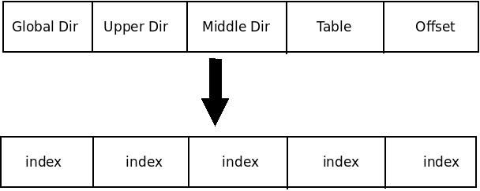
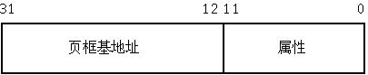
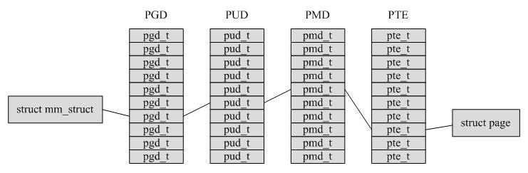
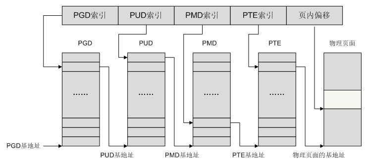

# linux 的分页机制

## 四级分页机制

前面我们提到 Linux 内核仅使用了较少的分段机制, 但是却对分页机制的依赖性很强, 其使用一种适合 32 位和 64 位结构的通用分页模型, 该模型使用**四级分页机制**, 即

- 页全局目录(**Page Global Directory**)
- 页上级目录(**Page Upper Directory**)
- 页中间目录(**Page Middle Directory**)
- 页表(**Page Table**)

>*  **页全局目录**包含若干**页上级目录**的地址;
>*  **页上级目录**又依次包含若干**页中间目录**的地址;
>*  而**页中间目录**又包含若干****页表****的地址;
>*  每一个**页表项**指向一个**页框**.

因此线性地址因此被分成五个部分, 而每一部分的大小与具体的计算机体系结构有关.


## 不同架构的分页机制

对于不同的体系结构, Linux 采用的**四级页表目录**的大小有所不同(**页大小**都是**4KB**情况下):

- 对于**i386**而言, 仅采用**二级页表**, 即**页上层目录**和**页中层目录**长度为 0.

`10(PGD) + 0(PUD) + 0(PMD) + 10(PTE) + 12(offset)`

- 对于启用**PAE**的**i386**, 采用了**三级页表**, 即**页上层目录**长度为 0

`2(PGD) + 0(PUD) + 9(PMD) + 9(PTE) + 12(offset)`

- 对于**64 位**体系结构, 可以采用三级或四级页表, 具体选择由**硬件决定**.

**x86_64** 下, `9(PGD) + 9(PUD) + 9(PMD) + 9(PTE) + 12(offset)`

对于**没有启用物理地址扩展**的**32 位系统**, **两级页表**已经足够了. 从本质上说 Linux 通过使"**页上级目录**"位和"**页中间目录**"位**全为 0(！！！**), 彻底取消了页上级目录和页中间目录字段. 不过, 页上级目录和页中间目录在**指针序列中**的位置被**保留**, 以便同样的代码在 32 位系统和 64 位系统下都能使用. 内核为**页上级目录**和**页中间目录**保留了一个位置, 这是通过把它们的**页目录项数**设置为**1**, 并把这**两个目录项**映射到**页全局目录**的一个合适的**目录项**而实现的.

启用了**物理地址扩展**的 32 位系统使用了**三级页表**. Linux 的**页全局目录**对应 80x86 的**页目录指针表**(PDPT), **取消**了**页上级目录**, **页中间目录**对应 80x86 的**页目录**, Linux 的**页表**对应 80x86 的**页表**.

最终, 64 位系统使用三级还是四级分页取决于**硬件对线性地址的位的划分**.

## 为什么 linux 热衷: 分页 > 分段

那么, 为什么 Linux 是如此地热衷使用分页技术而对分段机制表现得那么地冷淡呢, 因为 Linux 的**进程处理**很大程度上**依赖于分页**. 事实上, **线性地址到物理地址的自动转换**使下面的设计目标变得可行:

- 给**每一个进程**分配一块**不同的物理地址空间**, 这确保了可以有效地防止寻址错误.
- 区别**页**(即**一组数据**)和**页框**(即主存中的**物理地址**)之不同. 这就允许存放在**某个页框**中的一个**页**, 然后保存到**磁盘**上, 以后重新装入这**同一页(！！！**)时又被装在**不同的页框(！！！**)中. 这就是**虚拟内存机制的基本要素**.

**每一个进程**有它自己的**页全局目录**和自己的**页表集**. 当发生**进程切换**时, Linux 把**cr3 控制寄存器**的内容保存在**前一个执行进程的描述符(实际上保存在新 TSS 中的是前一任务 TSS 选择符, TSS 描述符必须保存在 GDT 中**)中, 然后把下一个要执行进程的描述符的值装入 cr3 寄存器中. 因此, 当新进程重新开始在 CPU 上执行时, 分页单元指向一组正确的页表.

把线性地址映射到物理地址虽然有点复杂, 但现在已经成了一种机械式的任务.

# linux 中页表处理数据结构

## 页表类型

Linux 分别采用 `pgd_t`、`pud_t`、`pmd_t` 和 `pte_t` 四种数据结构来表示 **页全局目录项**、**页上级目录项**、**页中间目录项** 和 **页表项**. 这四种 数据结构本质上都是**无符号长整型 unsigned long**

Linux 为了**更严格数据类型检查**, 将无符号长整型 unsigned long 分别封装成**四种不同的页表项**. 如果不采用这种方法, 那么一个无符号长整型数据可以传入任何一个与四种页表相关的函数或宏中, 这将大大**降低程序的健壮性**.

>`pgprot_t` 是另一个 64 位(PAE 激活时)或 32 位(PAE 禁用时)的数据类型, 它表示与一个单独表项相关的保护标志.

首先我们查看一下子这些类型是如何定义的

### 定义

pteval_t, pmdval_t, pudval_t, pgdval_t

>参照[arch/x86/include/asm/**pgtable\_64\_types.h**](http://lxr.free-electrons.com/source/arch/x86/include/asm/pgtable_64_types.h#L227)

```cpp
#ifndef __ASSEMBLY__
#include <linux/types.h>

/*
 * These are used to make use of C type-checking..
 */
typedef unsigned long   pteval_t;
typedef unsigned long   pmdval_t;
typedef unsigned long   pudval_t;
typedef unsigned long   pgdval_t;
typedef unsigned long   pgprotval_t;

typedef struct { pteval_t pte; } pte_t;

#endif  /* !__ASSEMBLY__ */
```
### 结构体

pgd_t、pud_t、pmd_t 和 pte_t

>参照 [/arch/x86/include/asm/pgtable_types.h](http://lxr.free-electrons.com/source/arch/x86/include/asm/pgtable_types.h#L227)

```cpp
typedef struct { pgdval_t pgd; } pgd_t;

static inline pgd_t native_make_pgd(pgdval_t val)
{
        return (pgd_t) { val };
}

static inline pgdval_t native_pgd_val(pgd_t pgd)
{
        return pgd.pgd;
}

static inline pgdval_t pgd_flags(pgd_t pgd)
{
        return native_pgd_val(pgd) & PTE_FLAGS_MASK;
}

#if CONFIG_PGTABLE_LEVELS > 3
typedef struct { pudval_t pud; } pud_t;

static inline pud_t native_make_pud(pmdval_t val)
{
        return (pud_t) { val };
}

static inline pudval_t native_pud_val(pud_t pud)
{
        return pud.pud;
}
#else
#include <asm-generic/pgtable-nopud.h>

static inline pudval_t native_pud_val(pud_t pud)
{
        return native_pgd_val(pud.pgd);
}
#endif

#if CONFIG_PGTABLE_LEVELS > 2
typedef struct { pmdval_t pmd; } pmd_t;

static inline pmd_t native_make_pmd(pmdval_t val)
{
        return (pmd_t) { val };
}

static inline pmdval_t native_pmd_val(pmd_t pmd)
{
        return pmd.pmd;
}
#else
#include <asm-generic/pgtable-nopmd.h>

static inline pmdval_t native_pmd_val(pmd_t pmd)
{
        return native_pgd_val(pmd.pud.pgd);
}
#endif

static inline pudval_t pud_pfn_mask(pud_t pud)
{
        if (native_pud_val(pud) & _PAGE_PSE)
                return PHYSICAL_PUD_PAGE_MASK;
        else
                return PTE_PFN_MASK;
}

static inline pudval_t pud_flags_mask(pud_t pud)
{
        return ~pud_pfn_mask(pud);
}

static inline pudval_t pud_flags(pud_t pud)
{
        return native_pud_val(pud) & pud_flags_mask(pud);
}

static inline pmdval_t pmd_pfn_mask(pmd_t pmd)
{
        if (native_pmd_val(pmd) & _PAGE_PSE)
                return PHYSICAL_PMD_PAGE_MASK;
        else
                return PTE_PFN_MASK;
}

static inline pmdval_t pmd_flags_mask(pmd_t pmd)
{
        return ~pmd_pfn_mask(pmd);
}

static inline pmdval_t pmd_flags(pmd_t pmd)
{
        return native_pmd_val(pmd) & pmd_flags_mask(pmd);
}

static inline pte_t native_make_pte(pteval_t val)
{
        return (pte_t) { .pte = val };
}

static inline pteval_t native_pte_val(pte_t pte)
{
        return pte.pte;
}

static inline pteval_t pte_flags(pte_t pte)
{
        return native_pte_val(pte) & PTE_FLAGS_MASK;
}
```

### 类型转换

xxx_val 和 __xxx

>参照[/arch/x86/include/asm/pgtable.h](http://lxr.free-electrons.com/source/arch/x86/include/asm/pgtable.h#L227)

五个**类型转换宏**(`__pte`、`__pud`、`__pmd`、`__pgd` 和 `__pgprot`)把一个**无符号整数**转换成**所需的类型**.

另外的五个类型转换宏(`pte_val`, `pud_val`, `pmd_val`, `pgd_val` 和 `pgprot_val`)执行相反的转换, 即把上面提到的**四种特殊的类型**转换成一个**无符号整数**.

```cpp
#define pgd_val(x)      native_pgd_val(x)
#define __pgd(x)        native_make_pgd(x)

#ifndef __PAGETABLE_PUD_FOLDED
#define pud_val(x)      native_pud_val(x)
#define __pud(x)        native_make_pud(x)
#endif

#ifndef __PAGETABLE_PMD_FOLDED
#define pmd_val(x)      native_pmd_val(x)
#define __pmd(x)        native_make_pmd(x)
#endif

#define pte_val(x)      native_pte_val(x)
#define __pte(x)        native_make_pte(x)
```

这里需要区别指向**页表项的指针**和**页表项所代表的数据**.

以 `pgd_t` 类型为例子, 如果已知一个 `pgd_t` 类型的**指针 pgd**, 那么通过 `pgd_val(*pgd)` 即可获得该页表项(也就是一个无符号长整型数据), 这里利用了面向对象的思想.

## 页表描述宏

对于不同的体系结构, Linux 采用的**四级页表目录**的大小有所不同(**页大小**都是**4KB**情况下):

- 对于**i386(32-bit 分页**)而言, 仅采用**二级页表**, 即**页上层目录**和**页中层目录**长度为 0; **10(PGD)\+0(PUD)\+0(PMD)\+10(PTE)\+12(offset)**.

- 对于启用**PAE**的**i386(PAE 分页模式**), 采用了**三级页表**, 即**页上层目录**长度为 0; **2(PGD)\+0(PUD)\+9(PMD)\+9(PTE)\+12(offset)**.

- 对于**64 位**体系结构, 可以采用三级或四级页表, 具体选择由**硬件决定**. **x86\_64(IA-32e 分页模式)下, 9(PGD)\+9(PUD)\+9(PMD)\+9(PTE)\+12(offset)**.

参照[arch/x86/include/asm/pgtable\_64\_types.h](http://lxr.free-electrons.com/source/arch/x86/include/asm/pgtable_64_types.h#L227)

linux 中使用下列宏简化了页表处理, 对于**每一级页表**都使用有以下三个关键描述宏:

| 宏字段| 描述 |
| ------------- |:-------------|
| XXX\_SHIFT| 指定**一个相应级别页表项可以映射的区域大小的位数** |
| XXX\_SIZE| **一个相应级别页表项可以映射的区域大小** |
| XXX\_MASK| 用以**屏蔽一个相应级别页表项可以映射的区域大小的所有位数**.  |

我们的**四级页表**, 对应的宏分别由**PAGE, PMD, PUD, PGDIR**

| 宏字段前缀| 描述 |
| ------------- |:-------------|
| PGDIR | 页全局目录(Page Global Directory) |
| PUD   | 页上级目录(Page Upper Directory) |
| PMD   | 页中间目录(Page Middle Directory) |
| PAGE  | 页表(Page Table) |

### PAGE 宏--页表 (Page Table)

| 字段| 描述 |
| ------------- |:-------------|
| PAGE\_SHIFT| 指定**Offset 字段的位数**, 即**一个页表项**可以映射的**区域大小的位数** |
| PAGE\_SIZE| **页的大小, 即一个页表项可以映射的区域的大小** |
| PAGE\_MASK| 用以**屏蔽 Offset**字段的**所有位**, 即屏蔽一个页表项可以映射的区域大小的所有位数.  |

定义如下, 在`/arch/x86/include/asm/page_types.h` 文件中

```
/* PAGE_SHIFT determines the page size */
 #define PAGE_SHIFT      12
 #define PAGE_SIZE       (_AC(1,UL) << PAGE_SHIFT)
 #define PAGE_MASK       (~(PAGE_SIZE-1))
```

- 当用于 80x86 处理器时, PAGE\_SHIFT 返回的值为**12(这个值是写死的！！！**), **页表项**中存放的是**一个页的基地址**, 所以**页表项能映射的区域大小的位数自然就取决于页的位数！！！**.

- 由于**页内所有地址都必须放在 offset 字段**, 因此 80x86 系统的页的大小**PAGE\_SIZE**是**2\^{12}**=**4096 字节**.

- PAGE\_MASK 宏产生的值为 0xfffff000, 用以**屏蔽 Offset 字段的所有位(低 12 位全为 0**).

### PMD-Page Middle Directory (页目录)

| 字段| 描述 |
| ------------- |:-------------|
| PMD\_SHIFT| 指定**线性地址的 Offset 和 Table 字段**的总位数; 换句话说, 是**页中间目录项**可以映射的**区域大小的位数** |
| PMD\_SIZE| 用于计算由页中间目录的**一个单独表项**所映射的区域大小, 也就是一个**页表的大小** |
| PMD\_MASK| 用于**屏蔽 Offset 字段与 Table 字段的所有位** |

**页中间目录项**存放的是**一个页表的基地址**, 所以**一个页中间目录项所能映射的区域大小位数自然取决于页表项位数\+页大小位数！！！**

**当 PAE 被禁用时**, 32\-bit 分页(`10+10+12`)的情况下

- `PMD_SHIFT` 产生的值为 **22**(来自**Offset 的 12 位**加上来自**Page Table<页表> 的 10 位**)
- `PMD_SIZE` 产生的值为 `2^22` 或 **4MB**
- `PMD_MASK` 产生的值为 **0xffc00000(低 22 位为 0**).

**当 PAE 被激活**时(`2+9+9+12` 或 IA-32e 的 `2+9+9+9+12`),

- `PMD_SHIFT` 产生的值为 **21** (来自 **Offset 的 12**位加上来自**Table 的 9**位)
- `PMD_SIZE` 产生的值为 `2^{21}`或 **2MB**
- `PMD_MASK` 产生的值为 **0xffe00000**.

**大型页(无论 32-bit 分页的 4MB 页、PAE 分页的 2MB 页, IA-32e 分页的 2MB 页！！！Linux 是支持这个的！！！**)不使用**最后一级页表**, 所以产生大型页尺寸的**LARGE\_PAGE\_SIZE 宏**等于**PMD\_SIZE**(**2\^{PMD\_SHIFT}**), 而在大型页地址中用于**屏蔽 Offset 字段和 Table 字段的所有位**的**LARGE\_PAGE\_MASK**宏, 就等于**PMD\_MASK**.

```cpp
#define HPAGE_SHIFT     PMD_SHIFT
#define HPAGE_SIZE      (_AC(1,UL) << HPAGE_SHIFT)
#define HPAGE_MASK      (~(HPAGE_SIZE - 1))
```

### PUD_SHIFT-页上级目录 (Page Upper Directory)

| 字段| 描述 |
| ------------- |:-------------|
| PUD\_SHIFT| 确定**页上级目录项**能映射的**区域大小的位数** |
| PUD\_SIZE| 用于计算**页全局目录**中的**一个单独表项**所能映射的**区域大小** |
| PUD\_MASK| 用于屏蔽 Offset 字段, Table 字段, Middle Air 字段的所有位 |

**页上级目录项**存放的是**一个页中间目录的基地址**, 所以**一个页上级目录项所能映射的区域大小自然取决于 2 的(页中间目录项\+页表项\+页大小)位数的平方！！！**.

对于 i386 而言, 仅采用二级页表, 即**页上层目录**和**页中层目录长度**为**0**, 所以**PUD\_SHIFT 总是等价于 PMD\_SHIFT(22=10<PTE>\+12(offset**), 而**PUD\_SIZE**则等于**4MB**.

对于启用 PAE 的 i386, 采用了三级页表, 即**页上层目录**长度为**0**,页中层目录长度为 9, 所以**PUD\_SHIFT 总是等价于 30(=9<PMD>\+9<PTE>\+12<offset**>), 而**PUD\_SIZE**则等于**1GB**

### PGDIR_SHIFT-页全局目录 (Page Global Directory)

| 字段| 描述 |
| ------------- |:-------------|
| PGDIR\_SHIFT| 确定**一个全局页目录项**能映射的区域大小的位数 |
| PGDIR\_SIZE| 用于计算页全局目录中一个单独表项所能映射区域的大小 |
| PGDIR\_MASK| 用于屏蔽 Offset, Table, Middle Air 及 Upper Air 的所有位 |

**当 PAE 被禁止时**,

- PGDIR\_SHIFT 产生的值为**22**(与 PMD\_SHIFT 和 PUD\_SHIFT 产生的值相同),
- PGDIR\_SIZE 产生的值为 2\^22 或 4 MB,
- PGDIR\_MASK 产生的值为 0xffc00000.

相反, **当 PAE 被激活时**,

- PGDIR\_SHIFT 产生的值为**30** (**12 位 Offset** 加**9 位 Table**再加**9 位 Middle** Air),
- PGDIR\_SIZE 产生的值为 2\^30 或 1 GB
- PGDIR\_MASK 产生的值为 0xc0000000

**PTRS\_PER\_PTE**,**PTRS\_PER\_PMD**,PTRS\_PER\_PUD 以及 PTRS\_PER\_PGD 用于计算**页表**、**页中间目录、页上级目录**和**页全局目录表**中**表项的个数**.

- 当**PAE 被禁止**时, 它们产生的值分别为**1024**, **1**, **1**和**1024**.
- 当**PAE 被激活(页上级目录长度为 0**)时, 产生的值分别为**512**, **512**, **1**和**4**.

## 页表处理函数

>**[注意]**
> 以下内容主要参见 [深入理解 linux 内核第二章内存寻址中页表处理](http://www.bubuko.com/infodetail-1185213.html)

内核还提供了许多宏和函数用于**读或修改页表表项**:

- 判断为 0: 如果相应的**表项值为 0**, 那么, 宏 pte\_none、pmd\_none、pud\_none 和 pgd\_none 产生的**值为 1**, 否则产生的值为 0.

- 清除: 宏 pte\_clear、pmd\_clear、pud\_clear 和 pgd\_clear**清除相应页表的一个表项**, 由此**禁止进程使用由该页表项映射的线性地址**. ptep\_get\_and\_clear( )函数**清除一个页表项并返回前一个值**.

- 设置: set\_pte, set\_pmd, set\_pud 和 set\_pgd 向一个页表项中**写入指定的值**. set\_pte\_atomic 与 set\_pte 作用相同, 但是当 PAE 被激活时它同样能保证 64 位的值能被原子地写入.

- 判断相同: 如果 a 和 b 两个页表项指向**同一页(物理页**)并且指定**相同访问优先级**, pte\_same(a,b)返回 1, 否则返回 0.

- 判断大型页: 如果页中间目录项指向一个**大型页(2MB 或 4MB**), pmd\_large(e)返回 1, 否则返回 0.

**宏 pmd\_bad**由函数使用并通过输入参数传递来**检查页中间目录项(中间目录项！！！**). 如果目录项指向一个**不能使用的页表**, 也就是说, 如果至少出现以下条件中的一个, 则这个宏产生的**值为 1**:

- 页不在主存中(**Present 标志被清除**).

- 页只允许读访问(**Read/Write 标志被清除**).

- **Acessed 或者 Dirty 位被清除**(对于每个现有的页表, Linux 总是强制设置这些标志).

**pud\_bad 宏**和**pgd\_bad 宏**总是产生 0. 没有定义 pte\_bad 宏, 因为页表项引用一个不在主存中的页, 一个不可写的页或一个根本无法访问的页都是合法的.

如果一个页表项的 Present 标志或者 Page Size 标志等于 1, 则 pte\_present 宏产生的值为 1, 否则为 0.

前面讲过页表项的 Page Size 标志对微处理器的分页部件来讲没有意义, 然而, 对于当前在主存中却又没有读、写或执行权限的页, 内核将其 Present 和 Page Size 分别标记为 0 和 1.

这样, 任何试图对此类页的访问都会引起一个缺页异常, 因为页的 Present 标志被清 0, 而内核可以通过检查 Page Size 的值来检测到产生异常并不是因为缺页.

如果相应表项的 Present 标志等于 1, 也就是说, 如果对应的页或页表被装载入主存, pmd\_present 宏产生的值为 1. pud\_present 宏和 pgd\_present 宏产生的值总是 1.

### 查询页表项中任意一个标志的当前值

下表中列出的函数用来查询页表项中任意一个标志的当前值; 除了 pte\_file()外, 其他函数只有在 pte\_present 返回 1 的时候, 才能正常返回页表项中任意一个标志.

| 函数名称 | 说明 |
| ------------- |:-------------|
| pte\_user( ) | 读 User/Supervisor 标志 |
| pte\_read( ) | 读 User/Supervisor 标志(表示 80x86 处理器上的页不受读的保护)|
| pte\_write( ) | 读 Read/Write 标志 |
| pte\_exec( ) | 读 User/Supervisor 标志( 80x86 处理器上的页不受代码执行的保护)|
| pte\_dirty( ) | 读 Dirty 标志 |
| pte\_young( ) | 读 Accessed 标志 |
| pte\_file( ) | 读 Dirty 标志(当 Present 标志被清除而 Dirty 标志被设置时, 页属于一个非线性磁盘文件映射)|

### 设置页表项中各标志的值

下表列出的另一组函数用于设置页表项中各标志的值

| 函数名称 | 说明 |
| ------------- |:-------------|
| mk\_pte\_huge( ) | 设置页表项中的 Page Size 和 Present 标志 |
| pte\_wrprotect( ) | 清除 Read/Write 标志 |
| pte\_rdprotect( ) | 清除 User/Supervisor 标志 |
| pte\_exprotect( ) | 清除 User/Supervisor 标志 |
| pte\_mkwrite( ) | 设置 Read/Write 标志 |
| pte\_mkread( ) | 设置 User/Supervisor 标志 |
| pte\_mkexec( ) | 设置 User/Supervisor 标志 |
| pte\_mkclean( ) | 清除 Dirty 标志 |
| pte\_mkdirty( ) | 设置 Dirty 标志 |
| pte\_mkold( ) | 清除 Accessed 标志(把此页标记为未访问)|
| pte\_mkyoung( ) | 设置 Accessed 标志(把此页标记为访问过)|
| pte\_modify(p,v) | 把页表项 p 的所有访问权限设置为指定的值 |
| ptep\_set\_wrprotect() | 与 pte\_wrprotect( ) 类似, 但作用于指向页表项的指针 |
| ptep\_set\_access\_flags( ) | 如果 Dirty 标志被设置为 1 则将页的访问权设置为指定的值, 并调用 flush\_tlb\_page() 函数 |
| ptep\_mkdirty() | 与 pte\_mkdirty( ) 类似, 但作用于指向页表项的指针. |
| ptep\_test\_and\_clear\_dirty( ) |  与 pte\_mkclean( ) 类似, 但作用于指向页表项的指针并返回 Dirty 标志的旧值 |
| ptep\_test\_and\_clear\_young( ) | 与 pte\_mkold( ) 类似, 但作用于指向页表项的指针并返回 Accessed 标志的旧值 |

### 宏函数-把一个页地址和一组保护标志组合成页表项, 或者执行相反的操作

现在, 我们来讨论下表中列出的宏, 它们把一个页地址和一组保护标志组合成页表项, 或者执行相反的操作, 从一个页表项中提取出页地址. 请注意这其中的一些宏对页的引用是通过 "**页描述符"的线性地址**, 而**不是通过该页本身的线性地址**.

| 宏名称 | 说明 |
| ------------- |:-------------|
| pgd\_index(addr) | 找到**线性地址 addr**对应的的**目录项**在**页全局目录中的索引**(相对位置)|
| pgd\_offset(mm, addr) | 接收**内存描述符地址 mm**和**线性地址 addr**作为参数. 这个宏产生**地址 addr**在**页全局目录**中**相应表项的线性地址**; 通过内存描述符 mm 内的一个指针可以找到这个页全局目录 |
| pgd\_offset\_k(addr) | 产生主内核页全局目录中的某个项的线性地址, 该项对应于地址 addr |
| pgd\_page(pgd) | 通过页全局目录项 pgd 产生页上级目录所在页框的页描述符地址. 在两级或三级分页系统中, 该宏等价于 pud\_page() , 后者应用于页上级目录项 |
| pud\_offset(pgd, addr) |  参数为指向页全局目录项的指针 pgd 和线性地址 addr . 这个宏产生页上级目录中目录项 addr 对应的线性地址. 在两级或三级分页系统中, 该宏产生 pgd , 即一个页全局目录项的地址 |
| pud\_page(pud) | 通过页上级目录项 pud 产生相应的页中间目录的线性地址. 在两级分页系统中, 该宏等价于 pmd\_page() , 后者应用于页中间目录项 |
| pmd\_index(addr) | 产生线性地址 addr 在页中间目录中所对应目录项的索引(相对位置)|
| pmd\_offset(pud, addr) | 接收指向页上级目录项的指针 pud 和线性地址 addr 作为参数. 这个宏产生目录项 addr 在页中间目录中的偏移地址. 在两级或三级分页系统中, 它产生 pud , 即页全局目录项的地址 |
| pmd\_page(pmd) | 通过页中间目录项 pmd 产生相应页表的页描述符地址. 在两级或三级分页系统中,  pmd 实际上是页全局目录中的一项 |
| mk\_pte(p,prot) | 接收页描述符地址 p 和一组访问权限 prot 作为参数, 并创建相应的页表项 |
| pte\_index(addr) | 产生线性地址 addr 对应的表项在页表中的索引(相对位置)|
| pte\_offset_kernel(dir,addr) | 线性地址 addr 在页中间目录 dir 中有一个对应的项, 该宏就产生这个对应项, 即页表的线性地址. 另外, 该宏只在主内核页表上使用 |
| pte\_offset\_map(dir, addr) | 接收指向一个页中间目录项的指针 dir 和线性地址 addr 作为参数, 它产生与线性地址 addr 相对应的页表项的线性地址. 如果页表被保存在高端存储器中, 那么内核建立一个临时内核映射, 并用 pte\_unmap 对它进行释放.  pte\_offset\_map\_nested 宏和 pte\_unmap\_nested 宏是相同的, 但它们使用不同的临时内核映射 |
| pte\_page( x ) | 返回页表项 x 所引用页的描述符地址 |
| pte\_to\_pgoff( pte ) | 从一个页表项的 pte 字段内容中提取出文件偏移量, 这个偏移量对应着一个非线性文件内存映射所在的页 |
| pgoff\_to\_pte(offset ) | 为非线性文件内存映射所在的页创建对应页表项的内容|

### 简化页表项的创建和撤消

下面我们罗列最后一组函数来简化**页表项**的**创建**和**撤消**.

当使用**两级页表**时, 创建或删除一个**页中间目录项**是不重要的. 如本节前部分所述, **页中间目录仅含有一个指向下属页表的目录项**. 所以, **页中间目录项**只是**页全局目录中的一项**而已. 然而当处理页表时, **创建一个页表项**可能很复杂, 因为包含页表项的那个页表可能就不存在. 在这样的情况下, 有必要**分配一个新页框, 把它填写为 0, 并把这个表项加入**.

如果**PAE**被激活, 内核使用**三级页表**. 当内核创建一个新的**页全局目录**时, 同时也**分配四个相应的页中间目录**; 只有当**父页全局目录被释放**时, 这**四个页中间目录才得以释放**. 当使用**两级**或**三级**分页时, **页上级目录项**总是被映射为**页全局目录**中的**一个单独项**. 与以往一样, 下表中列出的函数描述是针对 80x86 构架的.

| 函数名称 | 说明 |
| ------------- |:-------------|
| pgd\_alloc(mm) | 分配一个**新的页全局目录**. 如果**PAE 被激活**, 它还分配三个对应用户态线性地址的**子页中间目录**. 参数 mm(内存描述符的地址)在 80x86 构架上被忽略 |
| pgd\_free( pgd) | 释放页全局目录中地址为 pgd 的项. 如果 PAE 被激活, 它还将释放用户态线性地址对应的三个页中间目录 |
| pud\_alloc(mm, pgd, addr) | 在两级或三级分页系统下, 这个函数什么也不做: 它仅仅返回页全局目录项 pgd 的线性地址 |
| pud\_free(x) | 在两级或三级分页系统下, 这个宏什么也不做 |
| pmd_alloc(mm, pud, addr) | 定义这个函数以使普通三级分页系统可以为线性地址 addr 分配一个新的页中间目录. 如果 PAE 未被激活, 这个函数只是返回输入参数 pud 的值, 也就是说, 返回页全局目录中目录项的地址. 如果 PAE 被激活, 该函数返回线性地址 addr 对应的页中间目录项的线性地址. 参数 mm 被忽略 |
| pmd\_free(x) | 该函数什么也不做, 因为页中间目录的分配和释放是随同它们的父全局目录一同进行的 |
| pte\_alloc\_map(mm, pmd, addr) | 接收页中间目录项的地址 pmd 和线性地址 addr 作为参数, 并返回与 addr 对应的页表项的地址. 如果页中间目录项为空, 该函数通过调用函数 pte\_alloc\_one( ) 分配一个新页表. 如果分配了一个新页表,  addr 对应的项就被创建, 同时 User/Supervisor 标志被设置为 1 . 如果页表被保存在高端内存, 则内核建立一个临时内核映射, 并用 pte\_unmap 对它进行释放 |
| pte\_alloc\_kernel(mm, pmd, addr) | 如果与地址 addr 相关的页中间目录项 pmd 为空, 该函数分配一个新页表. 然后返回与 addr 相关的页表项的线性地址. 该函数仅被主内核页表使用 |
| pte\_free(pte) | 释放与页描述符指针 pte 相关的页表 |
| pte\_free\_kernel(pte) | 等价于 pte\_free( ) , 但由主内核页表使用 |
| clear\_page\_range(mmu, start,end) | 从线性地址 start 到 end 通过反复释放页表和清除页中间目录项来清除进程页表的内容 |

# 线性地址转换

## 分页模式下的的线性地址转换

线性地址、页表和页表项线性地址不管系统采用多少级分页模型, **线性地址**本质上都是**索引\+偏移量**的形式, 甚至你可以将整个线性地址看作**N\+1 个索引**的组合, **N 是系统采用的分页级数**. 在四级分页模型下, 线性地址被分为 5 部分, 如下图:



在线性地址中, 每个页表索引即代表线性地址在对应级别的页表中中关联的页表项. 正是这种索引与页表项的对应关系形成了整个页表映射机制.

### 页表

**多个页表项**的集合则为**页表**, **一个页表**内的**所有页表项**是**连续存放(！！！**)的. **页表**本质上是一堆**数据**, 因此也是**以页为单位存放在主存中**的. 因此, 在**虚拟地址转化物理地址**的过程中, **每访问一级页表**就会**访问一次内存(！！！**).

### 页表项

页表项从四种页表项的数据结构可以看出, 每个页表项其实就是一个无符号长整型数据. 每个页表项分两大类信息: 页框基地址和页的属性信息. 在 x86-32 体系结构中, 每个页表项的结构图如下:



这个图是一个通用模型, 其中页表项的前 20 位是物理页的基地址. 由于 32 位的系统采用 4kb 大小的页, 因此每个页表项的后 12 位均为 0. 内核将后 12 位充分利用, 每个位都表示对应虚拟页的相关属性.

不管是那一级的页表, 它的功能就是建立虚拟地址和物理地址之间的映射关系, 一个页和一个页框之间的映射关系体现在页表项中. 上图中的物理页基地址是 个抽象的说明, 如果当前的页表项位于页全局目录中, 这个物理页基址是指页上级目录所在物理页的基地址; 如果当前页表项位于页表中, 这个物理页基地址是指最 终要访问数据所在物理页的基地址.

### 地址转换过程

地址转换过程有了上述的基本知识, 就很好理解四级页表模式下如何将虚拟地址转化为逻辑地址了. 基本过程如下:

- 1.从**CR3 寄存器**中读取**页目录所在物理页面的基址**(即所谓的页目录基址), 从线性地址的第一部分获取页目录项的索引, 两者相加得到**页目录项的物理地址(！！！**).

- 2.**第一次读取内存**得到**pgd\_t 结构的目录项**, 从中取出物理页基址取出(具体位数与平台相关, 如果是 32 系统, 则为 20 位), 即页上级页目录的物理基地址.

- 3.从线性地址的第二部分中取出页上级目录项的索引, 与页上级目录基地址相加得到**页上级目录项的物理地址(！！！**).

- 4.**第二次读取内存**得到**pud\_t 结构的目录项**, 从中取出页中间目录的物理基地址.

- 5.从线性地址的第三部分中取出页中间目录项的索引, 与页中间目录基址相加得到**页中间目录项的物理地址(！！！**).

- 6.**第三次读取内存**得到**pmd\_t 结构的目录项**, 从中取出页表的物理基地址.

- 7.从线性地址的第四部分中取出页表项的索引, 与页表基址相加得到**页表项的物理地址(！！！**).

- 8.**第四次读取内存**得到**pte\_t 结构的目录项**, 从中取出物理页的基地址.

- 9.从线性地址的第五部分中取出物理页内偏移量, 与物理页基址相加得到**最终的物理地址(！！！**).

- 10.**第五次读取内存**得到最终要访问的数据.

整个过程是比较机械的, 每次转换先获取物理页基地址, 再从线性地址中获取索引, 合成物理地址后再访问内存. 不管是**页表**还是要访问的**数据**都是**以页为单位存放在主存中**的, 因此每次访问内存时都要先获得基址, 再通过索引(或偏移)在页内访问数据, 因此可以将线性地址看作是若干个索引的集合.





## Linux 中通过 4 级页表访问物理内存

linux 中**每个进程**有它自己的**PGD**( Page Global Directory), 它是**一个物理页(一个物理页！！！**), 并包含一个**pgd\_t 数组**.

进程的 pgd\_t 数据见 task\_struct \-\> mm\_struct \-\> pgd\_t \* pgd;

PTEs, PMDs 和 PGDs 分别由 pte\_t,pmd\_t 和 pgd\_t 来描述. 为了**存储保护位**, **pgprot\_t 被定义**, 它拥有相关的**flags**并经常被存储在**page table entry(页表项)低位(lower bits**), 其具体的存储方式依赖于 CPU 架构.

前面我们讲了页表处理的大多数函数信息, 在上面我们又讲了线性地址如何转换为物理地址, 其实就是不断索引的过程.

通过如下几个函数, 不断向下索引, 就可以从进程的**页表**中搜索**特定地址对应的页面对象**

| 宏函数| 说明 |
| ------------- |:-------------|
| pgd\_offset  | 根据当前虚拟地址和当前进程的 mm\_struct 获取 pgd 项 |
| pud\_offset | 参数为指向页全局目录项的指针 pgd 和线性地址 addr . 这个宏产生页上级目录中目录项 addr 对应的线性地址. 在两级或三级分页系统中, 该宏产生 pgd , 即一个页全局目录项的地址 |
| pmd\_offset | 根据通过 pgd\_offset 获取的 pgd 项和虚拟地址, 获取相关的 pmd 项(即 pte 表的起始地址) |
| pte\_offset | 根据通过 pmd\_offset 获取的 pmd 项和虚拟地址, 获取相关的 pte 项(即物理页的起始地址) |

根据虚拟地址获取物理页的示例代码详见 mm/memory.c 中的函数 follow\_page

>不同的版本可能有所不同, 早起内核中存在 follow\_page, 而后来的内核中被 follow\_page\_mask 替代, 目前最新的发布 4.4 中为查找到此函数

我们从早期的 linux-3.8 的源代码中, 截取的代码如下

```cpp
/**
 * follow_page - look up a page descriptor from a user-virtual address
 * @vma: vm_area_struct mapping @address
 * @address: virtual address to look up
 * @flags: flags modifying lookup behaviour
 *
 * @flags can have FOLL_ flags set, defined in <linux/mm.h>
 *
 * Returns the mapped (struct page *), %NULL if no mapping exists, or
 * an error pointer if there is a mapping to something not represented
 * by a page descriptor (see also vm_normal_page()).
 */
struct page *follow_page(struct vm_area_struct *vma, unsigned long address,
            unsigned int flags)
{
    pgd_t *pgd;
    pud_t *pud;
    pmd_t *pmd;
    pte_t *ptep, pte;
    spinlock_t *ptl;
    struct page *page;
    struct mm_struct *mm = vma->vm_mm;

    page = follow_huge_addr(mm, address, flags & FOLL_WRITE);
    if (!IS_ERR(page)) {
        BUG_ON(flags & FOLL_GET);
        goto out;
    }

    page = NULL;
    pgd = pgd_offset(mm, address);
    if (pgd_none(*pgd) || unlikely(pgd_bad(*pgd)))
        goto no_page_table;

    pud = pud_offset(pgd, address);
    if (pud_none(*pud))
        goto no_page_table;
    if (pud_huge(*pud) && vma->vm_flags & VM_HUGETLB) {
        BUG_ON(flags & FOLL_GET);
        page = follow_huge_pud(mm, address, pud, flags & FOLL_WRITE);
        goto out;
    }
    if (unlikely(pud_bad(*pud)))
        goto no_page_table;

    pmd = pmd_offset(pud, address);
    if (pmd_none(*pmd))
        goto no_page_table;
    if (pmd_huge(*pmd) && vma->vm_flags & VM_HUGETLB) {
        BUG_ON(flags & FOLL_GET);
        page = follow_huge_pmd(mm, address, pmd, flags & FOLL_WRITE);
        goto out;
    }
    if (pmd_trans_huge(*pmd)) {
        if (flags & FOLL_SPLIT) {
            split_huge_page_pmd(mm, pmd);
            goto split_fallthrough;
        }
        spin_lock(&mm->page_table_lock);
        if (likely(pmd_trans_huge(*pmd))) {
            if (unlikely(pmd_trans_splitting(*pmd))) {
                spin_unlock(&mm->page_table_lock);
                wait_split_huge_page(vma->anon_vma, pmd);
            } else {
                page = follow_trans_huge_pmd(mm, address,
                                 pmd, flags);
                spin_unlock(&mm->page_table_lock);
                goto out;
            }
        } else
            spin_unlock(&mm->page_table_lock);
        /* fall through */
    }
split_fallthrough:
    if (unlikely(pmd_bad(*pmd)))
        goto no_page_table;

    ptep = pte_offset_map_lock(mm, pmd, address, &ptl);

    pte = *ptep;
    if (!pte_present(pte))
        goto no_page;
    if ((flags & FOLL_WRITE) && !pte_write(pte))
        goto unlock;

    page = vm_normal_page(vma, address, pte);
    if (unlikely(!page)) {
        if ((flags & FOLL_DUMP) ||
            !is_zero_pfn(pte_pfn(pte)))
            goto bad_page;
        page = pte_page(pte);
    }

    if (flags & FOLL_GET)
        get_page(page);
    if (flags & FOLL_TOUCH) {
        if ((flags & FOLL_WRITE) &&
            !pte_dirty(pte) && !PageDirty(page))
            set_page_dirty(page);
        /*
         * pte_mkyoung() would be more correct here, but atomic care
         * is needed to avoid losing the dirty bit: it is easier to use
         * mark_page_accessed().
         */
        mark_page_accessed(page);
    }
    if ((flags & FOLL_MLOCK) && (vma->vm_flags & VM_LOCKED)) {
        /*
         * The preliminary mapping check is mainly to avoid the
         * pointless overhead of lock_page on the ZERO_PAGE
         * which might bounce very badly if there is contention.
         *
         * If the page is already locked, we don't need to
         * handle it now - vmscan will handle it later if and
         * when it attempts to reclaim the page.
         */
        if (page->mapping && trylock_page(page)) {
            lru_add_drain();  /* push cached pages to LRU */
            /*
             * Because we lock page here and migration is
             * blocked by the pte's page reference, we need
             * only check for file-cache page truncation.
             */
            if (page->mapping)
                mlock_vma_page(page);
            unlock_page(page);
        }
    }
unlock:
    pte_unmap_unlock(ptep, ptl);
out:
    return page;

bad_page:
    pte_unmap_unlock(ptep, ptl);
    return ERR_PTR(-EFAULT);

no_page:
    pte_unmap_unlock(ptep, ptl);
    if (!pte_none(pte))
        return page;

no_page_table:
    /*
     * When core dumping an enormous anonymous area that nobody
     * has touched so far, we don't want to allocate unnecessary pages or
     * page tables.  Return error instead of NULL to skip handle_mm_fault,
     * then get_dump_page() will return NULL to leave a hole in the dump.
     * But we can only make this optimization where a hole would surely
     * be zero-filled if handle_mm_fault() actually did handle it.
     */
    if ((flags & FOLL_DUMP) &&
        (!vma->vm_ops || !vma->vm_ops->fault))
        return ERR_PTR(-EFAULT);
    return page;
}
```

以上代码可以精简为

```cpp
unsigned long v2p(int pid unsigned long va)
{
        unsigned long pa = 0;
        struct task_struct *pcb_tmp = NULL;
        pgd_t *pgd_tmp = NULL;
        pud_t *pud_tmp = NULL;
        pmd_t *pmd_tmp = NULL;
        pte_t *pte_tmp = NULL;

        printk(KERN_INFO"PAGE_OFFSET = 0x%lx\n",PAGE_OFFSET);
        printk(KERN_INFO"PGDIR_SHIFT = %d\n",PGDIR_SHIFT);
        printk(KERN_INFO"PUD_SHIFT = %d\n",PUD_SHIFT);
        printk(KERN_INFO"PMD_SHIFT = %d\n",PMD_SHIFT);
        printk(KERN_INFO"PAGE_SHIFT = %d\n",PAGE_SHIFT);

        printk(KERN_INFO"PTRS_PER_PGD = %d\n",PTRS_PER_PGD);
        printk(KERN_INFO"PTRS_PER_PUD = %d\n",PTRS_PER_PUD);
        printk(KERN_INFO"PTRS_PER_PMD = %d\n",PTRS_PER_PMD);
        printk(KERN_INFO"PTRS_PER_PTE = %d\n",PTRS_PER_PTE);

        printk(KERN_INFO"PAGE_MASK = 0x%lx\n",PAGE_MASK);

        //if(!(pcb_tmp = find_task_by_pid(pid)))
        if(!(pcb_tmp = findTaskByPid(pid)))
        {
                printk(KERN_INFO"Can't find the task %d .\n",pid);
                return 0;
        }
        printk(KERN_INFO"pgd = 0x%p\n",pcb_tmp->mm->pgd);

        /* 判断给出的地址 va 是否合法(va&lt;vm_end)*/
        if(!find_vma(pcb_tmp->mm,va))
        {
                printk(KERN_INFO"virt_addr 0x%lx not available.\n",va);
                return 0;
        }

        pgd_tmp = pgd_offset(pcb_tmp->mm,va);
        printk(KERN_INFO"pgd_tmp = 0x%p\n",pgd_tmp);
        printk(KERN_INFO"pgd_val(*pgd_tmp) = 0x%lx\n",pgd_val(*pgd_tmp));
        if(pgd_none(*pgd_tmp))
        {
                printk(KERN_INFO"Not mapped in pgd.\n");
                return 0;
        }

        pud_tmp = pud_offset(pgd_tmp,va);
        printk(KERN_INFO"pud_tmp = 0x%p\n",pud_tmp);
        printk(KERN_INFO"pud_val(*pud_tmp) = 0x%lx\n",pud_val(*pud_tmp));
        if(pud_none(*pud_tmp))
        {
                printk(KERN_INFO"Not mapped in pud.\n");
                return 0;
        }

        pmd_tmp = pmd_offset(pud_tmp,va);
        printk(KERN_INFO"pmd_tmp = 0x%p\n",pmd_tmp);
        printk(KERN_INFO"pmd_val(*pmd_tmp) = 0x%lx\n",pmd_val(*pmd_tmp));
        if(pmd_none(*pmd_tmp))
        {
                printk(KERN_INFO"Not mapped in pmd.\n");
                return 0;
        }

        /*在这里, 把原来的 pte_offset_map()改成了 pte_offset_kernel*/
        pte_tmp = pte_offset_kernel(pmd_tmp,va);

        printk(KERN_INFO"pte_tmp = 0x%p\n",pte_tmp);
        printk(KERN_INFO"pte_val(*pte_tmp) = 0x%lx\n",pte_val(*pte_tmp));
        if(pte_none(*pte_tmp))
        {
                printk(KERN_INFO"Not mapped in pte.\n");
                return 0;
        }
        if(!pte_present(*pte_tmp)){
                printk(KERN_INFO"pte not in RAM.\n");
                return 0;
        }

        pa = (pte_val(*pte_tmp) & PAGE_MASK) | (va & ~PAGE_MASK);
        printk(KERN_INFO"virt_addr 0x%lx in RAM is 0x%lx t .\n",va,pa);
        printk(KERN_INFO"contect in 0x%lx is 0x%lx\n", pa, *(unsigned long *)((char *)pa + PAGE_OFFSET)
}
```