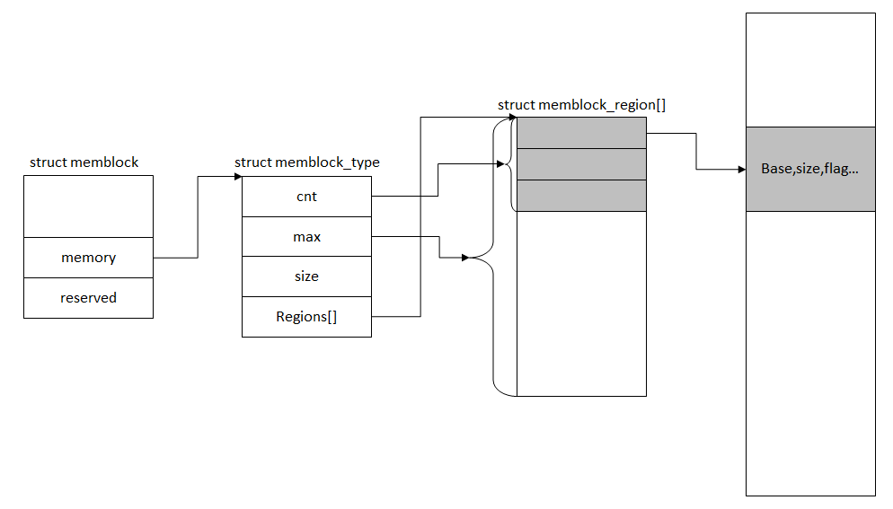

<!-- @import "[TOC]" {cmd="toc" depthFrom=1 depthTo=6 orderedList=false} -->

<!-- code_chunk_output -->

- [1 非 bootmem 下的 memblock 内存管理](#1-非-bootmem-下的-memblock-内存管理)
- [2 memblock 的数据结构](#2-memblock-的数据结构)
  - [2.1 struct memblock 结构](#21-struct-memblock-结构)
  - [2.2 struct memblock\_type](#22-struct-memblock_type)
  - [2.3 内存区域 memblock\_region](#23-内存区域-memblock_region)
  - [2.4 内存区域标识](#24-内存区域标识)
  - [2.5 结构总体布局](#25-结构总体布局)
  - [2.6 初始化 memblock 静态变量](#26-初始化-memblock-静态变量)
- [3 Memblock-API 函数接口](#3-memblock-api-函数接口)
  - [3.1 Memblock-API 函数接口](#31-memblock-api-函数接口)
  - [3.2 memblock\_add 将内存区域加入到 memblock 中](#32-memblock_add-将内存区域加入到-memblock-中)
    - [3.2.1 memblock\_add 函数](#321-memblock_add-函数)
    - [3.2.2 memblock\_add\_range 函数代码](#322-memblock_add_range-函数代码)
    - [3.2.3 memblock\_add\_range 函数流程解析](#323-memblock_add_range-函数流程解析)
  - [3.3 memblock_remove 删除内存区域](#33-memblock_remove-删除内存区域)
  - [3.4 memblock\_alloc 申请内存](#34-memblock_alloc-申请内存)
    - [3.4.1 memblock_alloc 函数代码](#341-memblock_alloc-函数代码)
    - [3.4.2 memblock\_alloc\_range_nid 函数](#342-memblock_alloc_range_nid-函数)
    - [3.4.3 memblock\_find\_in\_range\_node 函数](#343-memblock_find_in_range_node-函数)
    - [3.4.4 \_\_memblock\_find\_range\_top\_down 查找内存区域](#344-__memblock_find_range_top_down-查找内存区域)
    - [3.4.5 memblock\_reserve 标记申请的内存](#345-memblock_reserve-标记申请的内存)
  - [3.5 memblock\_free 释放内存区域](#35-memblock_free-释放内存区域)
- [4 兼容 bootmem 的接口 API](#4-兼容-bootmem-的接口-api)
  - [4.1 memblock 与 bootmem](#41-memblock-与-bootmem)
  - [4.2 memblock 与 bootmem 接口对比](#42-memblock-与-bootmem-接口对比)
  - [4.3 实现差异](#43-实现差异)
- [5 memblock 初始化](#5-memblock-初始化)
  - [5.1 x86 架构下的 memblock 初始化](#51-x86-架构下的-memblock-初始化)
  - [5.2 arm 架构下的 memblock 初始化](#52-arm-架构下的-memblock-初始化)
  - [5.3 arm64 下的 memblock 初始化](#53-arm64-下的-memblock-初始化)
- [6 总结](#6-总结)
- [7 链接](#7-链接)

<!-- /code_chunk_output -->

# 1 非 bootmem 下的 memblock 内存管理

前面我们讲解了引导内存管理 bootmem 机制,它基于**最先适配算法**,早期的 Linux 内核在引导阶段都是通过 bootmem 来完成初期的内存管理的.但是后来的版本(笔者分析的是 3.19)开始把**bootmem 弃用**了,`__alloc_memory_core_early()`取代了 bootmem 的`__alloc_memory_core()`来完成内存分配,而前者其实就是调用的 memblock 来分配内的.

memblock 算法是 linux 内核初始化阶段的一个内存分配器,本质上是取代了原来的 bootmem 算法.

memblock 实现比较简单,而它的作用就是在 page allocator 初始化之前来管理内存,完成分配和释放请求.

为了保证系统的兼容性, 内核为 bootmem 和 memblock 提供了相同的 API 接口.

这样在编译 Kernel 的时候可以选择 nobootmem 或者 bootmem 来在 buddy system 起来之前管理 memory.这两种机制对提供的 API 是一致的, 因此对用户是透明的

参见[mm/Makefile](http://lxr.free-electrons.com/source/mm/Makefile#L44)

```cpp
ifdef CONFIG_NO_BOOTMEM
	obj-y           += nobootmem.o
else
	obj-y           += bootmem.o
endif
```

由于接口是一致的, 那么他们共同使用一份头文件

| 头文件 | bootmem 接口 | nobootmem 接口 |
|:-------:|:----------------:|:-------------------:|
| [include/linux/bootmem.h](http://lxr.free-electrons.com/source/include/linux/bootmem.h) | [mm/bootmem.c](http://lxr.free-electrons.com/source/mm/bootmem.c) | [mm/nobootmem.c](http://lxr.free-electrons.com/source/mm/nobootmem.c) |

Memblock 是在早期引导过程中管理内存的方法之一, 此时内核内存分配器还没运行.Memblock 以前被定义为 Logical Memory Block( 逻辑内存块), 但根据[Yinghai Lu 的补丁](https://lkml.org/lkml/2010/7/13/68), 它被重命名为 memblock.


# 2 memblock 的数据结构

## 2.1 struct memblock 结构

首先来看下 memblock 结构的定义,文件是[include/linux/memblock.h](http://lxr.free-electrons.com/source/include/linux/memblock.h?v=4.7)

```cpp
struct memblock {
    bool bottom_up;  /* is bottom up direction?
    如果 true, 则允许由下而上地分配内存*/
    phys_addr_t current_limit; /*指出了内存块的大小限制*/
    /*  接下来的三个域描述了内存块的类型, 即预留型, 内存型和物理内存*/
    struct memblock_type memory;
    struct memblock_type reserved;
#ifdef CONFIG_HAVE_MEMBLOCK_PHYS_MAP
    struct memblock_type physmem;
#endif
};
```

该结构体包含五个域.

| 字段 | 描述 |
|:---:|:----|
| bottom\_up | 表示分配器分配内存的方式<br>true:从**低地址(内核映像的尾部**)向高地址分配<br>false:也就是 top-down,从高地址向地址分配内存. |
| current\_limit | 指出了内存块的大小限制, 用于**限制通过 memblock\_alloc 等函数的内存申请** |
| memory | **可用内存的集合(不是说未分配的！！！**) |
| reserved | **已分配内存的集合** |
| physmem | **物理内存的集合**(需要配置 CONFIG\_HAVE\_MEMBLOCK\_PHYS\_MAP 参数) |

接下来的三个域描述了内存块的类型

- 预留型

- 内存型

- 物理内存型(需要配置宏 CONFIG\_HAVE\_MEMBLOCK\_PHYS\_MAP)

## 2.2 struct memblock\_type

我们现在又接触到了一个数据结构[**memblock\_type**](http://lxr.free-electrons.com/source/include/linux/memblock.h?v=4.7#L40), 它的定义在[include/linux/memblock.h?v=4.7, line 40](http://lxr.free-electrons.com/source/include/linux/memblock.h?v=4.7#L40)

```cpp
struct memblock_type
{
    unsigned long cnt;      /* number of regions */
    unsigned long max;      /* size of the allocated array */
    phys_addr_t total_size; /* size of all regions */
    struct memblock_region *regions;
};
```

该结构体存储的是**内存类型信息**

| 字段 | 描述 |
|:---:|:----:|
| cnt | 当前集合(memory 或者 reserved)中记录的**内存区域个数** |
| max | 当前集合(memory 或者 reserved)中可记录的**内存区域的最大个数** |
| total\_size | 集合记录**区域信息大小(region 的 size 和, 不是个数**) |
| regions | 内存区域结构指针 |

它包含的域分别描述了当前内存块含有的内存区域数量, 所有内存区域的总共大小, 已经分配的内存区域大小和一个指向 memblock\_region 结构体的数组指针

## 2.3 内存区域 memblock\_region

memblock_region 结构体描述了内存区域, 它的定义在它的定义在[include/linux/memblock.h?v=4.7, line 31](http://lxr.free-electrons.com/source/include/linux/memblock.h?v=4.7#L31)


```cpp
struct memblock_region
{
    phys_addr_t base;
    phys_addr_t size;
    unsigned long flags;
#ifdef CONFIG_HAVE_MEMBLOCK_NODE_MAP
    int nid;
#endif
};
```
| 字段 | 描述 |
|:---:|:----:|
| base | 内存区域起始地址 |
| size | 内存区域大小 |
| flags | 标记 |
| nid | **node 号** |

## 2.4 内存区域标识

memblock\_region 的 flags 字段存储了**当前内存域的标识信息**, 标识用**enum 变量**来定义, 参见[include/linux/memblock.h?v=4.7, line 23](http://lxr.free-electrons.com/source/include/linux/memblock.h?v=4.7#L23)

```cpp

/* Definition of memblock flags. */
enum {
    MEMBLOCK_NONE       = 0x0,  /* No special request */
    MEMBLOCK_HOTPLUG    = 0x1,  /* hotpluggable region */
    MEMBLOCK_MIRROR     = 0x2,  /* mirrored region */
    MEMBLOCK_NOMAP      = 0x4,  /* don't add to kernel direct mapping */
};
```

## 2.5 结构总体布局

图示法可以用来展示以上结构体之间的关系:

```
+---------------------------+   +---------------------------+
|         memblock          |   |                           |
|  _______________________  |   |                           |
| |        memory         | |   |       Array of the        |
| |      memblock_type    |-|-->|      membock_region       |
| |_______________________| |   |                           |
|                           |   +---------------------------+
|  _______________________  |   +---------------------------+
| |       reserved        | |   |                           |
| |      memblock_type    |-|-->|       Array of the        |
| |_______________________| |   |      memblock_region      |
|                           |   |                           |
+---------------------------+   +---------------------------+
```



一个 memblock 有 3 个 memblock\_type, 每个 memblock\_type 有一个 memblock\_region 指针

Memblock 主要包含三个结构体: **memblock**,**memblock\_type**和**memblock\_region**. 现在我们已了解了 Memblock, 接下来我们将看到 Memblock 的初始化过程.

## 2.6 初始化 memblock 静态变量

在**编译(编译时确定！！！**)时,会分配好**memblock 结构所需要的内存空间**,文件是[mm/memblock.c](http://lxr.free-electrons.com/source/mm/memblock.c?v=4.7#L28)

结构体 memblock 的初始化变量名和结构体名相同 memblock

```cpp
static struct memblock_region memblock_memory_init_regions[INIT_MEMBLOCK_REGIONS] __initdata_memblock;
static struct memblock_region memblock_reserved_init_regions[INIT_MEMBLOCK_REGIONS] __initdata_memblock;
#ifdef CONFIG_HAVE_MEMBLOCK_PHYS_MAP
static struct memblock_region memblock_physmem_init_regions[INIT_PHYSMEM_REGIONS] __initdata_memblock;
#endif

struct memblock memblock __initdata_memblock = {
    .memory.regions     = memblock_memory_init_regions,
    .memory.cnt         = 1,    /* empty dummy entry */
    .memory.max         = INIT_MEMBLOCK_REGIONS,

    .reserved.regions       = memblock_reserved_init_regions,
    .reserved.cnt       = 1,    /* empty dummy entry */
    .reserved.max       = INIT_MEMBLOCK_REGIONS,

#ifdef CONFIG_HAVE_MEMBLOCK_PHYS_MAP
    .physmem.regions    = memblock_physmem_init_regions,
    .physmem.cnt        = 1,    /* empty dummy entry */
    .physmem.max        = INIT_PHYSMEM_REGIONS,
#endif

    .bottom_up          = false,
    .current_limit      = MEMBLOCK_ALLOC_ANYWHERE,
};
```

**\_\_initdata\_memblock 宏指定存储位置**

我们可以注意到初始化使用了\_\_initdata\_memblock 宏, 它的定义在[include/linux/memblock.h?v=4.7, line 64](http://lxr.free-electrons.com/source/include/linux/memblock.h?v=4.7#L64), 如下所示

```cpp
#ifdef CONFIG_ARCH_DISCARD_MEMBLOCK
#define __init_memblock __meminit
#define __initdata_memblock __meminitdata
#else
#define __init_memblock
#define __initdata_memblock
#endif
```

如果启用 CONFIG\_ARCH\_DISCARD\_MEMBLOCK 宏配置选项, memblock 代码会被放**到\.init 代码段**,在内核启动完成后 memblock 代码会从.init 代码段释放.

**3 个 memblock\_type 的初始化**

接下来的是 memblock 结构体中 3 个 memblock\_type 类型数据 **memory**, **reserved**和**physmem**的初始化

它们的**memblock\_type cnt 域**(当前集合中区域个数)被初始化为**1**. **memblock\_type max 域**(当前集合中**最大区域个数**)被初始化为`INIT_MEMBLOCK_REGIONS`和`INIT_PHYSMEM_REGIONS`

其中`INIT_MEMBLOCK_REGIONS`为 128, 参见[include/linux/memblock.h?v=4.7, line 20](http://lxr.free-electrons.com/source/include/linux/memblock.h?v=4.7#L20)

```cpp
#define INIT_MEMBLOCK_REGIONS   128
#define INIT_PHYSMEM_REGIONS    4
```

而**memblock\_type.regions**域都是通过 memblock\_region 数组初始化的,所有的数组定义都带有\_\_initdata\_memblock 宏

memblock 结构体中最后两个域**bottom\_up**,**内存分配模式(从低地址往高地址！！！)被禁用**(bottom\_up = **false**, 因此内存分配方式为 top-down.), 当前 memblock 的大小限制(memblock\_alloc 等的)是`MEMBLOCK\_ALLOC_ANYWHERE`为\~(phys\_addr\_t)0 即为**0xffffffff(32 个 1**).

```cpp
/* Flags for memblock_alloc_base() amd __memblock_alloc_base() */
#define MEMBLOCK_ALLOC_ANYWHERE (~(phys_addr_t)0)
#define MEMBLOCK_ALLOC_ACCESSIBLE       0
```

# 3 Memblock-API 函数接口

## 3.1 Memblock-API 函数接口

既然内核**静态创建并初始化**了\_\_initdata\_memblock 这个变量, 那么 memblock 又是怎么运作的呢?

在上文中我提到过所有关于 memblock 的实现都在[mm/memblock.c](http://lxr.free-electrons.com/source/mm/memblock.c?v=4.7)源文件中

抛开其他的先不谈,如果要使用 memblock,最上层函数一共就 4 个

```cpp
/////////////////////////////////////////
//   基本接口
/////////////////////////////////////////
//  向 memory 区中添加内存区域.
memblock_add(phys_addr_t base, phys_addr_t size)
//  向 memory 区中删除区域.
memblock_remove(phys_addr_t base, phys_addr_t size)
//  申请内存
memblock_alloc(phys_addr_t size, phys_addr_t align)
//  释放内存
memblock_free(phys_addr_t base, phys_addr_t size)


/////////////////////////////////////////
//   查找 & 遍历
/////////////////////////////////////////
//  在给定的范围内找到未使用的内存
phys_addr_t memblock_find_in_range(phys_addr_t start, phys_addr_t end, phys_addr_t size, phys_addr_t align)
//  反复迭代 memblock
for_each_mem_range(i, type_a, type_b, nid, flags, p_start, p_end, p_nid)


/////////////////////////////////////////
//   获取信息
/////////////////////////////////////////
//  获取内存区域信息
phys_addr_t get_allocated_memblock_memory_regions_info(phys_addr_t *addr);
//  获取预留内存区域信息
phys_addr_t get_allocated_memblock_reserved_regions_info(phys_addr_t *addr);

/////////////////////////////////////////
//   获取信息
/////////////////////////////////////////
#define memblock_dbg(fmt, ...) \
	if (memblock_debug) printk(KERN_INFO pr_fmt(fmt), ##__VA_ARGS__)
```

大致翻看了一下内核代码,发现很少使用 memblock\_free(),因为很多地方都是申请了**内存做永久使用**的. 再者,其实在内核中通过**memblock\_alloc**来分配内存其实比较少,一般都是在调用 memblock 底层的一些函数来简单粗暴的分配的.

## 3.2 memblock\_add 将内存区域加入到 memblock 中

### 3.2.1 memblock\_add 函数

memblock\_add 函数负责向 memory 区中添加内存区域,有两个参数: **物理基址**和**内存区域大小**, 并且把该内存区域添加到 memblock.

memblock\_add 函数本身并没有什么, 它只是调用了[memblock\_add\_range 函数](http://lxr.free-electrons.com/source/mm/memblock.c?v=4.7#L609)来完成工作, 定义在[mm/memblock.c?v=4.7, line 609](http://lxr.free-electrons.com/source/mm/memblock.c?v=4.7#L609)

```cpp
int __init_memblock memblock_add(phys_addr_t base, phys_addr_t size)
{
    memblock_dbg("memblock_add: [%#016llx-%#016llx] flags %#02lx %pF\n",
             (unsigned long long)base,
             (unsigned long long)base + size - 1,
             0UL, (void *)_RET_IP_);
	return memblock_add_range(&memblock.memory, base, size, MAX_NUMNODES, 0);


// include/linux/numa.h
#ifdef CONFIG_NODES_SHIFT
#define NODES_SHIFT     CONFIG_NODES_SHIFT
#else
#define NODES_SHIFT     0
#endif

#define MAX_NUMNODES    (1 << NODES_SHIFT)
```

memblock\_ad\_range 传递的参数依次是 : **内存块类型(memory**), **物理基址**, **内存区域大小**, **最大节点数**(0 如果 CONFIG\_NODES\_SHIFT 没有在配置文件中设置, 不然就是**2\^CONFIG\_NODES\_SHIFT**)和标志

```cpp
// arch/x86/Kconfig

config NODES_SHIFT
    int "Maximum NUMA Nodes (as a power of 2)" if !MAXSMP
    range 1 10
    default "10" if MAXSMP
    default "6" if X86_64
    default "3"
    depends on NEED_MULTIPLE_NODES
    ---help---
      Specify the maximum number of NUMA Nodes available on the target
      system.  Increases memory reserved to accommodate various tables.
```

这样配置的结果就是生成的 autoconf.h(**include/generated/autoconf.h**)定义了#define CONFIG\_NODES\_SHIFT 10 等值, 所以**所有的调用 memblock\_add 函数的都是属于 node: 2\^CONFIG\_NODES\_SHIFT(还有一个函数叫 memblock\_add\_node,会传入 nid！！！不是这儿使用！！！**).

### 3.2.2 memblock\_add\_range 函数代码

1、 如果 memblock 算法**管理内存为空**的时候, 则将当前空间**添加**进去;

2、 **不为空**的情况下, 则先检查**是否存在内存重叠**的情况, 如果**有**的话, 则**剔除重叠部分**, 然后将其余**非重叠的部分添加**进去;

3、 如果出现**region[]数组空间不够**的情况, 则通过**memblock\_double\_array()添加新的 region[]空间**;

4、 最后通过**memblock\_merge\_regions**()把紧挨着的**内存合并**了.

memblock\_add\_range 函数添加新的**内存区域到内存块**中, 定义在[mm/memblock.c?v=4.7, line 504](http://lxr.free-electrons.com/source/mm/memblock.c?v=4.7#L504)

- 首先, 该函数**检查给定的内存区域大小**, 如果是**0 就返回**.

- 在这之后,memblock\_add\_range 用给定的**memblock\_type**检查 memblock 结构体中**是否存在**内存区域

- 如果**没有**,我们就用给定的值**填充**新的**memory\_region**然后返回

- 如果**memblock\_type 不为空**, 我们就把新的内存区域添加到 memblock\_type 类型的 memblock 中.

```cpp
/**
 * memblock_add_range - add new memblock region
 * @type: memblock type to add new region into
 * @base: base address of the new region
 * @size: size of the new region
 * @nid: nid of the new region
 * @flags: flags of the new region
 *
 * Add new memblock region [@base,@base+@size) into @type.  The new region
 * is allowed to overlap with existing ones - overlaps don't affect already
 * existing regions.  @type is guaranteed to be minimal (all neighbouring
 * compatible regions are merged) after the addition.
 *
 * RETURNS:
 * 0 on success, -errno on failure.
 */
int __init_memblock memblock_add_range(struct memblock_type *type,
                phys_addr_t base, phys_addr_t size,
                int nid, unsigned long flags)
{
    bool insert = false;
    phys_addr_t obase = base;
    ／*  获取内存区域的结束位置,
      *  memblock_cap_size 函数会设置 size 大小确保 base + size 不会溢出  */
    phys_addr_t end = base + memblock_cap_size(base, &size);
    int idx, nr_new;
    struct memblock_region *rgn;

    if (!size)
        return 0;

    /* special case for empty array */
    if (type->regions[0].size == 0) {
        WARN_ON(type->cnt != 1 || type->total_size);
        type->regions[0].base = base;
        type->regions[0].size = size;
        type->regions[0].flags = flags;
        memblock_set_region_node(&type->regions[0], nid);
        type->total_size = size;
        return 0;
    }
repeat:
    /*
     * The following is executed twice.  Once with %false @insert and
     * then with %true.  The first counts the number of regions needed
     * to accomodate the new area.  The second actually inserts them.
     */
    base = obase;
    nr_new = 0;

    for_each_memblock_type(type, rgn) {
        phys_addr_t rbase = rgn->base;
        phys_addr_t rend = rbase + rgn->size;

        if (rbase >= end)
            break;
        if (rend <= base)
            continue;
        /*
         * @rgn overlaps.  If it separates the lower part of new
         * area, insert that portion.
         */
        if (rbase > base) {
#ifdef CONFIG_HAVE_MEMBLOCK_NODE_MAP
            WARN_ON(nid != memblock_get_region_node(rgn));
#endif
            WARN_ON(flags != rgn->flags);
            nr_new++;
            if (insert)
                memblock_insert_region(type, idx++, base,
                               rbase - base, nid,
                               flags);
        }
        /* area below @rend is dealt with, forget about it */
        base = min(rend, end);
    }

    /* insert the remaining portion */
    if (base < end) {
        nr_new++;
        if (insert)
            memblock_insert_region(type, idx, base, end - base,
                           nid, flags);
    }

    /*
     * If this was the first round, resize array and repeat for actual
     * insertions; otherwise, merge and return.
     */
    if (!insert) {
        while (type->cnt + nr_new > type->max)
            if (memblock_double_array(type, obase, size) < 0)
                return -ENOMEM;
        insert = true;
        goto repeat;
    } else {
        memblock_merge_regions(type);
        return 0;
    }
}
```

### 3.2.3 memblock\_add\_range 函数流程解析

**首先**, 我们用如下代码**获得内存区域的结束位置**:

```cpp
phys_addr_t end = base + memblock_cap_size(base, &size);
```

memblock\_cap\_size 函数会设置 size 大小**确保 base + size 不会溢出**. 该函数实现相当简单, 参见[mm/memblock.c?v=4.7, line 79](http://lxr.free-electrons.com/source/mm/memblock.c?v=4.7#L79)

```cpp
/* adjust *@size so that (@base + *@size) doesn't overflow, return new size */
static inline phys_addr_t memblock_cap_size(phys_addr_t base, phys_addr_t *size)
{
    return *size = min(*size, (phys_addr_t)ULLONG_MAX - base);
}
```

memblock\_cap\_size 返回 size 和 ULLONG_MAX \- base 中的最小值

在那之后我们**得到**了**新内存区域**的**结束地址**, 然后

- 查内存区域**是否重叠**
- 将新的**添加**到 memblock
- 看**是否能**和已经添加到 memblock 中的内存区域进行**合并**

首先**遍历所有已经存储的内存区域**并检查有没有和新的内存区域**重叠**

```cpp
for_each_memblock_type(type, rgn) {
    phys_addr_t rbase = rgn->base;
    phys_addr_t rend = rbase + rgn->size;

    if (rbase >= end)
        break;
    if (rend <= base)
        continue;
    /*  ......  */
     /* area below @rend is dealt with, forget about it */
	base = min(rend, end);
}
```

如果新内存区域**没有**和已经存储在 memblock 的内存区域**重叠**,把该新内存区域插入到 memblock 中.

如果有重叠通通过一个小巧的来完成冲突处理

```cpp
base = min(rend, end);
```

重叠检查完毕后, **新的内存区域**已经是一块干净的**不包含重叠区域的内存**,把新的内存区域插入到 memblock 中包含两步:

- 把新的内存区域中非重叠的部分作为**独立的区域**加入到**memblock**

- **合并所有相邻的内存区域**

这个过程分为**两次循环**来完成, 由一个[标识变量 insert](http://lxr.free-electrons.com/source/mm/memblock.c?v=4.7#L582)和[repeat 代码跳转标签](http://lxr.free-electrons.com/source/mm/memblock.c?v=4.7#L543)控制

- 第一次**循环**的时候,检查**新内存区域是否可以放入内存块**中,region 数组不够就调用 memblock\_double\_array, 而由于[insert = false](http://lxr.free-electrons.com/source/mm/memblock.c?v=4.7#L524), 则执行[!insert 条件语句标记的代码块](http://lxr.free-electrons.com/source/mm/memblock.c?v=4.7#L591), 并设置[insert = true](http://lxr.free-electrons.com/source/mm/memblock.c?v=4.7#L595), 然后[goto 跳转到 report 标签](http://lxr.free-electrons.com/source/mm/memblock.c?v=4.7#L596)继续开始第二次循环

- 第二次循环中, insert = true, 则执行相应的 insert == true 的代码块, 并且执行[memblock\_insert\_region 将新内存区域插入](http://lxr.free-electrons.com/source/mm/memblock.c?v=4.7#L583), 最后执行[memblock\_merge\_regions(type)](http://lxr.free-electrons.com/source/mm/memblock.c?v=4.7#L598)合并内存区域

这是第一次循环, 我们需要**检查新内存区域是否可以放入内存块**中并调用 memblock\_double\_array:

```cpp
/*
 * If this was the first round, resize array and repeat for actual
 * insertions; otherwise, merge and return.
 */
if (!insert) {	/*  第一次执行的的时候 insert == false  */
    while (type->cnt + nr_new > type->max)
        if (memblock_double_array(type, obase, size) < 0)
            return -ENOMEM;
    insert = true;
    goto repeat;
} else {
	/*  ......  */
}
```
memblock\_double\_array 函数**加倍给定的内存区域大小**, 然后把 insert 设为 true 再转到 repeat 标签.

第二次循环, 从 repeat 标签开始经过同样的循环然后用 memblock\_insert\_region 函数把当前内存区域插入到内存块:

```cpp
/* insert the remaining portion */
if (base < end) {
    nr_new++;
    if (insert)
        memblock_insert_region(type, idx, base, end - base,
                       nid, flags);
}
```

由于我们在第一次循环中把 insert 设为 true,现在 memblock\_insert\_region 函数将会被调用

[memblock\_insert\_region 函数](http://lxr.free-electrons.com/source/mm/memblock.c?v=4.7#L476)几乎和把新内存区域插入到空的 memblock\_type 代码块有同样的实现, 定义在[mm/memblock.c?v=4.7, line 476](http://lxr.free-electrons.com/source/mm/memblock.c?v=4.7#L476)该函数获得最后一个内存区域:

```cpp
struct memblock_region *rgn = &type->regions[idx];
```

然后调用 memmove 函数移动该内存区域:

```cpp
memmove(rgn + 1, rgn, (type->cnt - idx) * sizeof(*rgn));
```

紧接着填充新内存区域 memblock\_region 的 base 域, size 域等等, 然后增大 memblock\_type 的大小.

最后 memblock\_add\_range 函数调用[memblock\_merge\_regions](http://lxr.free-electrons.com/source/mm/memblock.c?v=4.7#L444)**合并所有相邻且兼容的内存区域**, 定义在[mm/memblock.c?v=4.7, line 444](http://lxr.free-electrons.com/source/mm/memblock.c?v=4.7#L444)


```cpp
/*
 * If this was the first round, resize array and repeat for actual
 * insertions; otherwise, merge and return.
 */
if (!insert) {
    /*  ......  */
} else {
    memblock_merge_regions(type);
    return 0;
}
```

## 3.3 memblock_remove 删除内存区域

memblock\_remove 用来完成**删除内存区域**的工作, 该函数定义在[mm/memblock.c?v=4.7, line 710](http://lxr.free-electrons.com/source/mm/memblock.c?v=4.7#L710)

```cpp
//  http://lxr.free-electrons.com/source/mm/memblock.c?v=4.7#L710
int __init_memblock memblock_remove(phys_addr_t base, phys_addr_t size)
{
    return memblock_remove_range(&memblock.memory, base, size);
}
```

## 3.4 memblock\_alloc 申请内存

而相比来说, 申请内存的函数 memblock\_alloc 实现方式就比较麻烦了, 如下所示

`memblock_alloc(phys_addr_t size, phys_addr_t align`)其实就是在**当前 NODE**的内存范围 0-MEMBLOCK\_ALLOC\_ACCESSIBLE(其实是**current\_limit**)中分配一个大小为 size 的内存区域.

### 3.4.1 memblock_alloc 函数代码

```cpp
//  http://lxr.free-electrons.com/source/mm/memblock.c?v=4.7#L727
phys_addr_t __init memblock_alloc(phys_addr_t size, phys_addr_t align)
{
    return memblock_alloc_base(size, align, MEMBLOCK_ALLOC_ACCESSIBLE);
}


//  http://lxr.free-electrons.com/source/mm/memblock.c?v=4.7#L1192
phys_addr_t __init memblock_alloc_base(phys_addr_t size, phys_addr_t align, phys_addr_t max_addr)
{
    phys_addr_t alloc;

    alloc = __memblock_alloc_base(size, align, max_addr);

    if (alloc == 0)
        panic("ERROR: Failed to allocate 0x%llx bytes below 0x%llx.\n",
              (unsigned long long) size, (unsigned long long) max_addr);

    return alloc;
}

//  http://lxr.free-electrons.com/source/mm/memblock.c?v=4.7#L1186
phys_addr_t __init __memblock_alloc_base(phys_addr_t size, phys_addr_t align, phys_addr_t max_addr)
{
    return memblock_alloc_base_nid(size, align, max_addr, NUMA_NO_NODE,
                       MEMBLOCK_NONE);
}

//  http://lxr.free-electrons.com/source/mm/memblock.c?v=4.7#L1163
phys_addr_t __init memblock_alloc_base_nid(phys_addr_t size,
                    phys_addr_t align, phys_addr_t max_addr,
                    int nid, ulong flags)
{
    return memblock_alloc_range_nid(size, align, 0, max_addr, nid, flags);
}
```
memblock\_alloc()很粗暴的**从能用的内存里分配**,而有些情况下**需要从特定的内存范围内分配**内存.解决方法就是通过 memblock\_alloc\_range\_nid 函数或者实现类似机制的函数

最终 memblock\_alloc 的也是通过 memblock\_alloc\_range\_nid 函数来完成内存分配的

注意这里使用的是**NUMA\_NO\_NODE**, 值为-1,NUMA\_NO\_NODE 入参表示**无 NUMA 的节点**, 毕竟当前**还没初始化**到那一步

```cpp
//include/linux/numa.h
#define NUMA_NO_NODE    (-1)
```

### 3.4.2 memblock\_alloc\_range_nid 函数

下面我们就来看看 memblock\_alloc\_range\_nid 函数的实现, 该函数定义在[mm/memblock.c?v=4.7, line 1133](http://lxr.free-electrons.com/source/mm/memblock.c?v=4.7#L1133)

```cpp
//  http://lxr.free-electrons.com/source/mm/memblock.c?v=4.7#L1133
static phys_addr_t __init memblock_alloc_range_nid(phys_addr_t size,
                    phys_addr_t align, phys_addr_t start,
                    phys_addr_t end, int nid, ulong flags)
{
    phys_addr_t found;

    if (!align)
        align = SMP_CACHE_BYTES;

    found = memblock_find_in_range_node(size, align, start, end, nid,
                        flags);
    if (found && !memblock_reserve(found, size)) {
        /*
         * The min_count is set to 0 so that memblock allocations are
         * never reported as leaks.
         */
        kmemleak_alloc(__va(found), size, 0, 0);
        return found;
    }
    return 0;
}
```

memblock\_alloc\_range\_nid 函数的主要工作如下

- 首先使用 memblock\_find\_in\_range\_node 指定**内存区域**和**大小**查找内存区域

- memblock\_reserve 后将其**标为已经分配**

### 3.4.3 memblock\_find\_in\_range\_node 函数

该函数定义在[mm/memblock.c?v=4.7, lien 178](http://lxr.free-electrons.com/source/mm/memblock.c?v=4.7#L178)

```cpp
//  http://lxr.free-electrons.com/source/mm/memblock.c?v=4.7#L178
phys_addr_t __init_memblock memblock_find_in_range_node(phys_addr_t size,
                    phys_addr_t align, phys_addr_t start,
                    phys_addr_t end, int nid, ulong flags)
{
    phys_addr_t kernel_end, ret;

    /* pump up @end */
    if (end == MEMBLOCK_ALLOC_ACCESSIBLE)
        end = memblock.current_limit;

    /* avoid allocating the first page */
    start = max_t(phys_addr_t, start, PAGE_SIZE);
    end = max(start, end);
    kernel_end = __pa_symbol(_end);

    /*
     * try bottom-up allocation only when bottom-up mode
     * is set and @end is above the kernel image.
     */
    if (memblock_bottom_up() && end > kernel_end) {
        phys_addr_t bottom_up_start;

        /* make sure we will allocate above the kernel */
        bottom_up_start = max(start, kernel_end);

        /* ok, try bottom-up allocation first */
        ret = __memblock_find_range_bottom_up(bottom_up_start, end,
                              size, align, nid, flags);
        if (ret)
            return ret;

        /*
         * we always limit bottom-up allocation above the kernel,
         * but top-down allocation doesn't have the limit, so
         * retrying top-down allocation may succeed when bottom-up
         * allocation failed.
         *
         * bottom-up allocation is expected to be fail very rarely,
         * so we use WARN_ONCE() here to see the stack trace if
         * fail happens.
         */
        WARN_ONCE(1, "memblock: bottom-up allocation failed, memory hotunplug may be affected\n");
    }

    return __memblock_find_range_top_down(start, end, size, align, nid,
                          flags);
}
```

- 如果从 memblock\_alloc 过来,**end**就是 MEMBLOCK\_ALLOC\_ACCESSIBLE,这个时候会设置为**current\_limit**.

- 如果不通过 memblock\_alloc 分配,内存范围就是**指定的范围**.紧接着对 start 做调整, 为的是**避免申请到第一个页面**

memblock\_bottom\_up 返回的是 memblock.bottom\_up, 前面初始化的时候也知道这个值是 false(**在 numa 初始化时会设置为 true**), 所以初始化前期应该调用的是\_\_memblock\_find\_range\_top\_down 函数去查找内存:

### 3.4.4 \_\_memblock\_find\_range\_top\_down 查找内存区域

最后通过[\_\_memblock\_find\_range\_top\_down](http://lxr.free-electrons.com/source/mm/memblock.c?v=4.7#L140)函数去查找内存

```cpp
//  http://lxr.free-electrons.com/source/mm/memblock.c?v=4.7#L140
static phys_addr_t __init_memblock
__memblock_find_range_top_down(phys_addr_t start, phys_addr_t end,
                   phys_addr_t size, phys_addr_t align, int nid,
                   ulong flags)
{
    phys_addr_t this_start, this_end, cand;
    u64 i;

    for_each_free_mem_range_reverse(i, nid, flags, &this_start, &this_end,
                    NULL) {
        this_start = clamp(this_start, start, end);
        this_end = clamp(this_end, start, end);

        if (this_end < size)
            continue;

        cand = round_down(this_end - size, align);
        if (cand >= this_start)
            return cand;
    }

    return 0;
}

// include/linux/memblock.h
#define for_each_free_mem_range_reverse(i, nid, flags, p_start, p_end,  \
                    p_nid)              \
    for_each_mem_range_rev(i, &memblock.memory, &memblock.reserved, \
                   nid, flags, p_start, p_end, p_nid)

#define for_each_mem_range_rev(i, type_a, type_b, nid, flags,       \
                    p_start, p_end, p_nid)           \
    for (i = (u64)ULLONG_MAX,                   \
             __next_mem_range_rev(&i, nid, flags, type_a, type_b,\
                      p_start, p_end, p_nid);   \
         i != (u64)ULLONG_MAX;                  \
         __next_mem_range_rev(&i, nid, flags, type_a, type_b,   \
                  p_start, p_end, p_nid))

// include/linux/kernel.h
#define ULLONG_MAX  (~0ULL)
```

- 函数通过使用 for\_each\_free\_mem\_range\_reverse 宏封装调用\_\_next\_free\_mem\_range\_rev()函数, 此函数**逐一**将**memblock.memory**里面的**内存块信息**提取出来与**memblock.reserved**的**各项信息**进行检验, **确保**返回的**this\_start 和 this\_end**不会是分配过的内存块.

- 然后通过**clamp 取中间值**, 判断**大小是否满足**, **满足**的情况下, 将**自末端向前**(因为这是**top-down 申请方式**)的 size 大小的空间的**起始地址(从 down 到 up 的起始地址**, 不是从 up 到 down 的, 而且前提该地址不会超出 this\_start)**返回**回去

至此满足要求的内存块算是找到了.

### 3.4.5 memblock\_reserve 标记申请的内存

现在我们回到[**memblock\_alloc\_range\_nid**函数](http://lxr.free-electrons.com/source/mm/memblock.c?v=4.7#L1133), 我们说该函数完成了两项工作

- 首先通过 memblock\_find\_in\_range\_node 指定内存区域和大小查找内存区域

- 找到内存区域后, 调用 memblock\_reserve 后**将其标为已经分配**

现在我们已经找到了内存区域了,那么我们继续看看 memblock\_reserve 函数是如何对内存进行标记的, 该函数定义在[mm/memblock.c?v=4.7, line 727](http://lxr.free-electrons.com/source/mm/memblock.c?v=4.7#L727)

```cpp
//  http://lxr.free-electrons.com/source/mm/memblock.c?v=4.7#L727
int __init_memblock memblock_reserve(phys_addr_t base, phys_addr_t size)
{
    memblock_dbg("memblock_reserve: [%#016llx-%#016llx] flags %#02lx %pF\n",
             (unsigned long long)base,
             (unsigned long long)base + size - 1,
             0UL, (void *)_RET_IP_);

    return memblock_add_range(&memblock.reserved, base, size, MAX_NUMNODES, 0);
}

//  http://lxr.free-electrons.com/source/mm/memblock.c?v=4.7#L609
int __init_memblock memblock_add(phys_addr_t base, phys_addr_t size)
{
    memblock_dbg("memblock_add: [%#016llx-%#016llx] flags %#02lx %pF\n",
             (unsigned long long)base,
             (unsigned long long)base + size - 1,
             0UL, (void *)_RET_IP_);

    return memblock_add_range(&memblock.memory, base, size, MAX_NUMNODES, 0);
}
```

我们会发现首先**memblock\_reserve**函数也是通过**memblock\_add\_range**来**实现的**, 我们把 memblock\_add 的实现贴出来进行对比,我们会发现他们就**第一个参数不一样**

- memblock\_reserve 使用**全局变量 memblock**的**reserved 域**,最终将分配到的内存块信息添加到 reserved 区域中

- memblock\_add 则使用了**全局变量的 memory 域**,最终将内存块添加到了 memory 区域

memblock\_add\_range 函数的流程我们前面已经将的很详细了,这里只简单的叙述一下子

- 如果 memblock 算法管理内存为空的时候, 则将当前空间添加进去

- 不为空的情况下, 则先检查是否存在内存重叠的情况, 如果有的话, 则剔除重叠部分, 然后将其余非重叠的部分添加进去

- 如果出现 region[]数组空间不够的情况, 则通过 memblock\_double\_array()添加新的 region[]空间

- 最后通过 memblock\_merge\_regions()把紧挨着的内存合并了

## 3.5 memblock\_free 释放内存区域

```cpp
//  http://lxr.free-electrons.com/source/mm/memblock.c?v=4.7#L695
static int __init_memblock memblock_remove_range(struct memblock_type *type,
                      phys_addr_t base, phys_addr_t size)
{
    int start_rgn, end_rgn;
    int i, ret;

    ret = memblock_isolate_range(type, base, size, &start_rgn, &end_rgn);
    if (ret)
        return ret;

    for (i = end_rgn - 1; i >= start_rgn; i--)
        memblock_remove_region(type, i);
}

//  http://lxr.free-electrons.com/source/mm/memblock.c?v=4.7#L716
int __init_memblock memblock_free(phys_addr_t base, phys_addr_t size)
{
    memblock_dbg("   memblock_free: [%#016llx-%#016llx] %pF\n",
             (unsigned long long)base,
             (unsigned long long)base + size - 1,
             (void *)_RET_IP_);

    kmemleak_free_part(__va(base), size);
    return memblock_remove_range(&memblock.reserved, base, size);
}
```

# 4 兼容 bootmem 的接口 API

## 4.1 memblock 与 bootmem

我们了解到 memblock 是作为 bootmem 的替代品而引入内核的

在**编译 Kernel 的时候可以选择**nobootmem 或者 bootmem 来在 buddy system 起来之前管理 memory.这两种机制对提供的 API 是一致的, 因此对用户是透明的

参见[mm/Makefile](http://lxr.free-electrons.com/source/mm/Makefile#L44)

```cpp
ifdef CONFIG_NO_BOOTMEM
	obj-y           += nobootmem.o
else
	obj-y           += bootmem.o
endif
```

为了保证系统的兼容性, 内核为 bootmem 和 memblock 提供了相同的 API 接口.

## 4.2 memblock 与 bootmem 接口对比

由于接口是一致的, 那么他们共同使用一份头文件

| 头文件 | bootmem 接口 | nobootmem 接口 |
|:-------:|:----------------:|:-------------------:|
| [include/linux/bootmem.h](http://lxr.free-electrons.com/source/include/linux/bootmem.h) | [mm/bootmem.c](http://lxr.free-electrons.com/source/mm/bootmem.c) | [mm/nobootmem.c](http://lxr.free-electrons.com/source/mm/nobootmem.c) |

我们知道 memblock 自己的接口都在自己的头文件和源文件中

| memblock 头文件 | memblock 接口 |
|:--------------:|:------------:|
| [include/linux/memblock.h](http://lxr.free-electrons.com/source/include/linux/memblock.h?v=4.7) | [mm/memblock.c](http://lxr.free-electrons.com/source/mm/memblock.c?v=4.7)

为了实现接口兼容, 内核用[mm/memblock.c](http://lxr.free-electrons.com/source/mm/memblock.c?v=4.7)定义的 memblock 接口, 实现了一套 bootmem 的接口机制,而 bootmem 的接口我们在上一篇引导内存管理 bootmem 机制中已经讲过了, 这些实现的 bootmem 函数接口 API,就定义在[mm/nobootmem.c](http://lxr.free-electrons.com/source/mm/nobootmem.c)文件中, 然后内核把他们进行了封装, 然后提供了与 bootmem 相同功能和函数的接口, **这些接口**都在[**include/linux/memblock.h**](http://lxr.free-electrons.com/source/include/linux/memblock.h?v=4.7).

在 NUMA 系统上, 基本的 API 是相同的, 但是函数增加了\_node 后缀, 与 UMA 系统的函数相比,还**需要一些额外的参数**,用于**指定内存分配的结点(！！！**).

| 函数 | bootmem 定义 | nobootmem 定义 |
|:-----:|:------------------|:----------------------:|
| **ZONE\_NORMAL 的分配函数** | 按照指定大小在 ZONE\_NORMAL 内存域分配函数. 数据是对齐的, 这使得内存或者从可适用于 L1 高速缓存的理想位置开始| |
| alloc\_bootmem(size) |  [alloc\_bootmem](http://lxr.free-electrons.com/source/include/linux/bootmem.h?v=4.7#L122)<br>[\_\_alloc\_bootmem](http://lxr.free-electrons.com/source/mm/bootmem.c?v=4.7#L700)<br>[\_\_\_alloc\_bootmem](http://lxr.free-electrons.com/source/mm/bootmem.c?=4.7#L672) | [alloc\_bootmem](http://lxr.free-electrons.com/source/include/linux/bootmem.h?v=4.7#L122)<br>[\_\_alloc\_bootmem](http://lxr.free-electrons.com/source/mm/nobootmem.c?v=4.7#L309)<br>[\_\_\_alloc\_bootmem](http://lxr.free-electrons.com/source/mm/nobootmem.c?v=4.7#L281)  |
| alloc\_bootmem\_align(size) | [alloc\_bootmem\_align](http://lxr.free-electrons.com/source/include/linux/bootmem.h?v=4.7#L124)<br>基于\_\_alloc\_bootmem 实现 | [alloc\_bootmem\_align](http://lxr.free-electrons.com/source/include/linux/bootmem.h?v=4.7#L124)<br>[\_\_alloc\_bootmem](http://lxr.free-electrons.com/source/mm/nobootmem.c?v=4.7#L309)<br>[\_\_\_alloc\_bootmem](http://lxr.free-electrons.com/source/mm/nobootmem.c?v=4.7#L281)  |
| alloc\_bootmem\_pages(size)) | [alloc\_bootmem\_pages](http://lxr.free-electrons.com/source/include/linux/bootmem.h?v=4.7#L128)<br>基于\_\_alloc\_bootmem 实现 | [alloc\_bootmem\_pages](http://lxr.free-electrons.com/source/include/linux/bootmem.h?v=4.7#L128)<br>基于\_\_alloc\_bootmem 实现 |
|alloc\_bootmem\_nopanic(size) | [alloc\_bootmem\_nopanic](http://lxr.free-electrons.com/source/include/linux/bootmem.h?v=4.7#L126)<br>[\_\_alloc\_bootmem\_nopanic](http://lxr.free-electrons.com/source/mm/bootmem.c?v=4.7#L664)<br>[\_\_\_alloc\_bootmem\_nopanic](http://lxr.free-electrons.com/source/mm/bootmem.c?v=4.7#L632) | [alloc\_bootmem\_nopanic](http://lxr.free-electrons.com/source/include/linux/bootmem.h?v=4.7#L126)<br>[\_\_alloc\_bootmem\_nopanic](http://lxr.free-electrons.com/source/mm/nobootmem.c?v=4.7#L261)<br>[\_\_\_alloc\_bootmem\_nopanic](http://lxr.free-electrons.com/source/mm/nobootmem.c?v=4.7#L235) |
| **ZONE\_DMA 区域的分配函数** |  |
| alloc\_bootmem\_low(size) | [alloc\_bootmem\_low](http://lxr.free-electrons.com/source/include/linux/bootmem.h?v=4.7#L141)<br>[\_\_alloc\_bootmem\_low](http://lxr.free-electrons.com/source/include/linux/bootmem.h?v=4.7#L415)底层基于\_\_\_alloc\_bootmem | [alloc\_bootmem\_low](http://lxr.free-electrons.com/source/include/linux/bootmem.h?v=4.7#L141)<br>底层基于\_\_\_alloc\_bootmem  |
|alloc\_bootmem\_low\_pages\_nopanic(size) | [alloc\_bootmem\_low\_pages\_nopanic](http://lxr.free-electrons.com/source/include/linux/bootmem.h?v=4.7#L143)<br>底层基于[\_\_alloc\_bootmem\_low\_nopanic](http://lxr.free-electrons.com/source/mm/bootmem.c?v=4.7#L838)<br>[\_\_\_alloc\_bootmem\_nopanic](http://lxr.free-electrons.com/source/mm/bootmem.c?v=4.7#L632) | [alloc\_bootmem\_low\_pages\_nopanic](http://lxr.free-electrons.com/source/include/linux/bootmem.h?v=4.7#L143)<br>底层基于[\_\_alloc\_bootmem\_low\_nopanic](http://lxr.free-electrons.com/source/mm/nobootmem.c?v=4.7#L421)<br>[\_\_\_alloc\_bootmem\_nopanic](http://lxr.free-electrons.com/source/mm/nobootmem.c?v=4.7#L235) |
|alloc\_bootmem\_low\_pages(size) | [alloc\_bootmem\_low\_pages](http://lxr.free-electrons.com/source/mm/bootmem.c?v=4.7#L832)<br>底层基于[\_\_alloc\_bootmem\_low\_nopanic](http://lxr.free-electrons.com/source/mm/bootmem.c?v=4.7#L838) | [alloc\_bootmem\_low\_pages](http://lxr.free-electrons.com/source/mm/bootmem.c?v=4.7#L832)<br>底层基于[\_\_alloc\_bootmem\_low\_nopanic](http://lxr.free-electrons.com/source/mm/nobootmem.c?v=4.7#L421) |
| **NUMA 结构的分配函数** | | |
| alloc\_bootmem\_node(pgdat, size) |  [alloc\_bootmem\_node](http://lxr.free-electrons.com/source/include/linux/bootmem.h?v=4.7#L132)<br>[\_\_alloc\_bootmem\_node](http://lxr.free-electrons.com/source/mm/bootmem.c?v=4.7#L777)<br>[ \_\_\_alloc\_bootmem\_node](http://lxr.free-electrons.com/source/mm/bootmem.c?v=4.7#L708) | [alloc\_bootmem\_node](http://lxr.free-electrons.com/source/include/linux/bootmem.h?v=4.7#L132)<br>[\_\_alloc\_bootmem\_node](http://lxr.free-electrons.com/source/mm/nobootmem.c?v=4.7#L383)<br>[ \_\_\_alloc\_bootmem\_node](http://lxr.free-electrons.com/source/mm/nobootmem.c?v=4.7#L317) |
| alloc\_bootmem\_node\_nopanic(pgdat, size) |  [alloc\_bootmem\_node\_nopanic](http://lxr.free-electrons.com/source/include/linux/bootmem.h?v=4.7#L134)<br>[\_\_alloc\_bootmem\_node\_nopanic](http://lxr.free-electrons.com/source/mm/bootmem.c?v=4.7#L738)<br>[\_\_\_alloc\_bootmem\_node\_nopanic](http://lxr.free-electrons.com/source/mm/bootmem.c?v=4.7#L708) | [alloc\_bootmem\_node\_nopanic](http://lxr.free-electrons.com/source/include/linux/bootmem.h?v=4.7#L134)<br>[\_\_alloc\_bootmem\_node\_nopanic](http://lxr.free-electrons.com/source/mm/nobootmem.c?v=4.7#L344)<br>[\_\_\_alloc\_bootmem\_node\_nopanic](http://lxr.free-electrons.com/source/mm/nobootmem.c?v=4.7#L317) |
| alloc\_bootmem\_pages\_node(pgdat, size) |  [alloc\_bootmem\_pages\_node](http://lxr.free-electrons.com/source/include/linux/bootmem.h?v=4.7#L136)<br>[\_\_alloc\_bootmem\_node](http://lxr.free-electrons.com/source/mm/bootmem.c?v=4.7#L747)<br>[\_\_\_alloc\_bootmem\_node\_nopanic](http://lxr.free-electrons.com/source/mm/bootmem.c?v=4.7#L708) | [alloc\_bootmem\_pages\_node](http://lxr.free-electrons.com/source/include/linux/bootmem.h?v=4.7#L136)<br>[\_\_alloc\_bootmem\_node](http://lxr.free-electrons.com/source/mm/nobootmem.c?v=4.7#L344)<br>[\_\_\_alloc\_bootmem\_node\_nopanic](http://lxr.free-electrons.com/source/mm/nobootmem.c?v=4.7#L317) |
|alloc\_bootmem\_pages\_node\_nopanic(pgdat, size) |  [alloc\_bootmem\_pages\_node\_nopanic](http://lxr.free-electrons.com/source/include/linux/bootmem.h?v=4.7#L138)<br>[\_\_alloc\_bootmem\_node\_nopanic](http://lxr.free-electrons.com/source/mm/nobootmem.c?v=4.7#L344)<br>[\_\_\_alloc\_bootmem\_node\_nopanic](http://lxr.free-electrons.com/source/mm/nobootmem.c?v=4.7#L317) |
| alloc\_bootmem\_low\_pages\_node(pgdat, size) | [alloc\_bootmem\_low\_pages\_node](http://lxr.free-electrons.com/source/include/linux/bootmem.h?v=4.7#L14)<br>[\_\_alloc\_bootmem\_low\_node](http://lxr.free-electrons.com/source/mm/bootmem.c?v=4.7#L861)<br>[\_\_\_alloc\_bootmem\_node](http://lxr.free-electrons.com/source/mm/bootmem.c?v=4.7#L747)<br>[\_\_\_alloc\_bootmem\_node\_nopanic](http://lxr.free-electrons.com/source/mm/bootmem.c?v=4.7#L707) | [alloc\_bootmem\_low\_pages\_node](http://lxr.free-electrons.com/source/include/linux/bootmem.h?v=4.7#L14)<br>[\_\_alloc\_bootmem\_low\_node](http://lxr.free-electrons.com/source/mm/bootmem.c?v=4.7#L444)<br>[\_\_\_alloc\_bootmem\_node](http://lxr.free-electrons.com/source/mm/nobootmem.c?v=4.7#L353)<br>[\_\_\_alloc\_bootmem\_node\_nopanic](http://lxr.free-electrons.com/source/mm/nobootmem.c?v=4.7#L317) |

我们可以看到最基本的实现思路都是一样的, 只是最底层的实现函数有细微的区别.

## 4.3 实现差异

- UMA 结构下这些函数最终都是通过\_\_\_alloc\_bootmem\_nopanic 函数来实现的

- NUMA 架构下, 最终这些函数都是简介的调用\_\_\_alloc\_bootmem\_node\_nopanic 函数来实现的,

| 函数 | bootmem | memblock |
|:-----:|:-----------:|:------------:|
| \_\_\_alloc\_bootmem\_nopanic | [mm/bootmem.c?v=4.7, line 632](http://lxr.free-electrons.com/source/mm/bootmem.c?v=4.7#L632), 通过[alloc\_bootmem\_core](http://lxr.free-electrons.com/source/mm/bootmem.c?v=4.7#L607)函数来实现 | [mm/nobootmem.c?v=4.7, line 235](http://lxr.free-electrons.com/source/mm/nobootmem.c?v=4.7#L235), 通过[\_\_alloc\_memory\_core\_early](http://lxr.free-electrons.com/source/mm/nobootmem.c?v=4.7#L36) |
| \_\_\_alloc\_bootmem\_node\_nopanic | [mm/bootmem.c?v=4.7, line 708](http://lxr.free-electrons.com/source/mm/bootmem.c?v=4.7#L708), 通过调用[alloc\_bootmem\_core](http://lxr.free-electrons.com/source/mm/bootmem.c?v=4.7#L607)和[alloc\_bootmem\_bdata](http://lxr.free-electrons.com/source/mm/bootmem.c?v=4.7#L500)来实现 | [mm/nobootmem.c?v=4.7, line 317](http://lxr.free-electrons.com/source/mm/nobootmem.c?v=4.7#L317), 通过调用[\_\_alloc\_memory\_core\_early](http://lxr.free-electrons.com/source/mm/nobootmem.c?v=4.7#L36)来实现 |

bootmem 的**核心函数\_\_alloc\_memory\_core()**的实现机制我们前一篇文章[**引导分配器 bootmem**]已经讲过了,那么 memblock 下 nobootmem 的**核心函数\_\_alloc\_memory\_core\_early**是怎么实现的呢?

前面[**3.4.1 节 memblock\_alloc 函数代码**]我们分析 memblock\_alloc 函数的时候提到, 该函数最终通过 memblock\_alloc\_range\_nid 函数粗暴粗暴的进行内存分配, 而有些情况下需要从特定的内存范围内分配内存.解决方法就是通过 memblock\_alloc\_range\_nid 函数或者实现类似机制的函数,这里**的\_\_alloc\_memory\_core\_early 函数**就是基于 memblock\_alloc\_range\_nid 同样的思路实现的函数

- 首先使用 memblock\_find\_in\_range\_node 指定内存区域和大小查找内存区域

- memblock\_reserve 后将其标为已经分配

我们列出 memblock\_alloc\_range\_nid 函数与\_\_alloc\_memory\_core\_early 函数的实现对比

| memblock\_alloc\_range\_nid | \_\_alloc\_memory\_core\_early |
|:------------------------------:|:------------------------------:|
| [mm/memblock.c?v=4.7, line 1133](http://lxr.free-electrons.com/source/mm/memblock.c?v=4.7#L1133) | [mm/nobootmem.c?v=4.7, line 36](http://lxr.free-electrons.com/source/mm/nobootmem.c?v=4.7#L36) |

# 5 memblock 初始化

## 5.1 x86 架构下的 memblock 初始化

要**理解 memblock 是如何工作和实现**的, 我们首先看一下**它的用法**.

在 Linux 内核中有几处用到了 memblock,例如**arch/x86/kernel/e820.c**中的函数**memblock\_x86\_fill**,该函数**遍历**由 e820 提供的**内存映射表**并且通过**memblock\_add**函数把**内核预留的内存区域**添加到 memblock. 既然我们首先遇到了 memblock\_add 函数, 那就从它开始吧.

在内核初始化初期,**物理内存**会通过**int 0x15**来被探测和整理,存放到**e820**中.而**初始化**就发生在**这个以后**.参见[arch/x86/kernel/setup.c?v=4.7, line 1096](http://lxr.free-electrons.com/source/arch/x86/kernel/setup.c?v=4.7#L1096)

```cpp
void __init setup_arch(char **cmdline_p)
{
    /*
     * Need to conclude brk, before memblock_x86_fill()
     *  it could use memblock_find_in_range, could overlap with
     *  brk area.
     */
    reserve_brk();

    cleanup_highmap();

    memblock_set_current_limit(ISA_END_ADDRESS);
    memblock_x86_fill();
}
```

首先**内核建立内核页表**需要**扩展\_\_brk**,而**扩展后的 brk**就立即**被声明为已分配**. 这项工作是由**reserve\_brk**通过调用**memblock\_reserve**完成的, 而其实**并不是真正通过 memblock 分配**的,因为此时**memblock 还没有完成初始化**

[reserve\_brk](http://lxr.free-electrons.com/source/arch/x86/kernel/setup.c?v=4.9#L209)函数定义在[arch/x86/kernel/setup.c?v=4.7, line 209](http://lxr.free-electrons.com/source/arch/x86/kernel/setup.c?v=4.9#L209), 此时 memblock 还没有初始化,只能通过[memblock\_reserve](http://lxr.free-electrons.com/source/mm/memblock.c?v=4.7#L727)来完成内存的分配

```cpp
static void __init reserve_brk(void)
{
    if (_brk_end > _brk_start)
        memblock_reserve(__pa_symbol(_brk_start),
                 _brk_end - _brk_start);

    /* Mark brk area as locked down and no longer taking any
       new allocations */
    _brk_start = 0;
}
```

设置完\_\_brk 后,可以看到,setup\_arch()函数通过**memblock\_x86\_fill**(),依据**e820 中的信息**来**初始化 memblock**.

```cpp
void __init memblock_x86_fill(void)
{
    int i;
    u64 end;

    /*
     * EFI may have more than 128 entries
     * We are safe to enable resizing, beause memblock_x86_fill()
     * is rather later for x86
     */
    memblock_allow_resize();

    for (i = 0; i < e820.nr_map; i++) {
        struct e820entry *ei = &e820.map[i];

        end = ei->addr + ei->size;
        if (end != (resource_size_t)end)
            continue;

        if (ei->type != E820_RAM && ei->type != E820_RESERVED_KERN)
            continue;

        memblock_add(ei->addr, ei->size);
    }

    /* throw away partial pages */
    memblock_trim_memory(PAGE_SIZE);

    memblock_dump_all();
}
```

比较简单,通过 e820 中的信息**memblock\_add**(),将内存添加到 memblock 中的**memory**中(**这儿参见上面 memblock\_add, 其实现中使用 nid 是 2\^CONFIG\_NODES\_SHIFT！！！初始化这儿是不区分 node 的！！！**),当做可分配内存.**后两个函数**主要是修剪内存**使之对齐和输出信息**.

**参见 memblock\_add 实现, 我们知道 e820 信息添加到 memblock 阶段是不涉及区分 node 的！！！**

至此, 我们的 memblock 就初始化好了, 简单而且粗暴

## 5.2 arm 架构下的 memblock 初始化

arm 下的 memblock 初始化也是从 start\_kernel()->[setup\_arch()](http://lxr.free-electrons.com/source/arch/arm/kernel/setup.c#L1034)开始的, 在 setup\_arch()中 arm 架构通过**arm\_memblock\_init**完成了**memblock 的初始化**工作.

```cpp
void __init setup_arch(char **cmdline_p)
{
	arm_memblock_init(mdesc);
}
```

arm\_memblock\_init 定义在[arch/arm/mm/init.c](http://lxr.free-electrons.com/source/arch/arm/mm/init.c?v=4.7#L230), 如下所示

```cpp
void __init arm_memblock_init(const struct machine_desc *mdesc)
{
    /* Register the kernel text, kernel data and initrd with memblock. */
#ifdef CONFIG_XIP_KERNEL
    memblock_reserve(__pa(_sdata), _end - _sdata);
#else
    memblock_reserve(__pa(_stext), _end - _stext);
#endif
#ifdef CONFIG_BLK_DEV_INITRD
    /* FDT scan will populate initrd_start */
    if (initrd_start && !phys_initrd_size) {
        phys_initrd_start = __virt_to_phys(initrd_start);
        phys_initrd_size = initrd_end - initrd_start;
    }
    initrd_start = initrd_end = 0;
    if (phys_initrd_size &&
        !memblock_is_region_memory(phys_initrd_start, phys_initrd_size)) {
        pr_err("INITRD: 0x%08llx+0x%08lx is not a memory region - disabling initrd\n",
               (u64)phys_initrd_start, phys_initrd_size);
        phys_initrd_start = phys_initrd_size = 0;
    }
    if (phys_initrd_size &&
        memblock_is_region_reserved(phys_initrd_start, phys_initrd_size)) {
        pr_err("INITRD: 0x%08llx+0x%08lx overlaps in-use memory region - disabling initrd\n",
               (u64)phys_initrd_start, phys_initrd_size);
        phys_initrd_start = phys_initrd_size = 0;
    }
    if (phys_initrd_size) {
        memblock_reserve(phys_initrd_start, phys_initrd_size);

        /* Now convert initrd to virtual addresses */
        initrd_start = __phys_to_virt(phys_initrd_start);
        initrd_end = initrd_start + phys_initrd_size;
    }
#endif

    arm_mm_memblock_reserve();

    /* reserve any platform specific memblock areas */
    if (mdesc->reserve)
        mdesc->reserve();

    early_init_fdt_reserve_self();
    early_init_fdt_scan_reserved_mem();

    /* reserve memory for DMA contiguous allocations */
    dma_contiguous_reserve(arm_dma_limit);

    arm_memblock_steal_permitted = false;
    memblock_dump_all();
}
```

## 5.3 arm64 下的 memblock 初始化

前面我们的内核从 start\_kernel 开始,进入 setup\_arch(),并完成了早期内存分配器的初始化和设置工作.

```cpp
void __init setup_arch(char **cmdline_p)
{
	/*  初始化 memblock  */
	arm64_memblock_init( );

	/*  分页机制初始化  */
	paging_init();

	bootmem_init();
}
```

| 流程 | 描述 |
|:---:|:----:|
| [arm64_memblock_init](http://lxr.free-electrons.com/source/arch/arm64/kernel/setup.c?v=4.7#L229) | 初始化 memblock 内存分配器 |
| [paging_init](http://lxr.free-electrons.com/source/arch/arm64/mm/mmu.c?v=4.7#L538) | 初始化分页机制 |
| [bootmem_init](http://lxr.free-electrons.com/source/arch/arm64/mm/init.c?v=4.7#L306) | 初始化内存管理 |

其中 arm64\_memblock\_init 就完成了 arm64 架构下的 memblock 的初始化

与 arm 架构类似, arm64 的 memblock 初始化没有意外,只是初始化函数成为[arm64\_memblock\_init()](http://lxr.free-electrons.com/source/arch/arm64/kernel/setup.c?v=4.7#L261), 该函数定义在[arch/arm64/mm/init.c?v=4.7, line 192](http://lxr.free-electrons.com/source/arch/arm64/mm/init.c?v=4.7#L192)

# 6 总结

memblock 内存管理是将**所有的物理内存**放到**memblock.memory**中作为可用内存来管理, **分配过**的内存**只加入**到**memblock.reserved**中,并**不从 memory 中移出**.

同理**释放内存**仅仅从**reserved**中移除.也就是说,**memory**在**fill 过后**基本就是**不动**的了. 申请和分配内存仅仅修改 reserved 就达到目的.

在初始化阶段没有那么多复杂的内存操作场景,甚至**很多地方**都是**申请了内存做永久使用**的, 所以这样的内存管理方式已经足够凑合着用了,毕竟内核也不指望用它一辈子. 在系统完成初始化之后所有的工作会移交给强大的`buddy`系统来进行内存管理

# 7 链接

>参考
>
>[Linux 内核内存管理(1)](http://blog.jobbole.com/88452)
>
>[Linux 内核初期内存管理---memblock](http://www.maxwellxxx.com/linuxmemblock)
>
>[Linux kernel memory management Part 1.](https://0xax.gitbooks.io/linux-insides/content/mm/linux-mm-1.html)