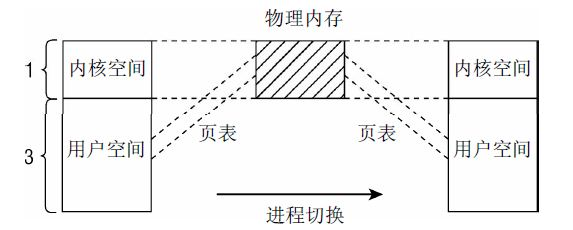
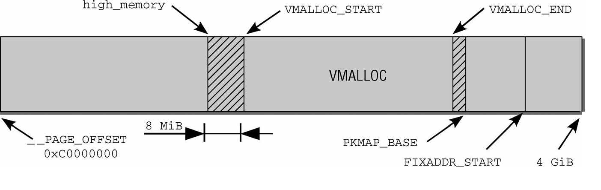

# 今日内容(分页机制初始化)

在初始化内存的结点和内存区域之前, 内核先通过 pagging\_init 初始化了内核的分页机制.

在**分页机制完成**后, 才会开始初始化系统的**内存数据结构**(包括内存**节点数据**和**内存区域**), 并在随后**初始化 buddy 伙伴系统**来接管内存管理的工作

# 分页机制初始化

arm64 架构下, 内核在 `start_kernel()->setup_arch()` 中通过 `arm64_memblock_init()` 完成了**memblock 的初始化**之后, 接着通过`setup\_arch()` -> `paging_init()` 开始**初始化分页机制**

**paging\_init** 负责建立**只能用于内核的页表,用户空间是无法访问**的.

## 虚拟地址空间(以 x86_32 位系统为例)

因此在仔细考察其实现之前, 很重要的一点是解释该函数的目的

在 **x86_32 系统**上内核通常将总的 4GB 可用虚拟地址空间按 3:1 的比例划分给用户空间和内核空间, 虚拟地址空间的低端 3GB 用于用户状态应用程序,而高端的 1GB 则专用于内核.尽管在分配内核的虚拟地址空间时,当前系统上下文是不相干的, 但**每个进程都有自身特定的地址空间**.

这些划分主要的动机如下所示

- 在用户应用程序的执行**切换到核心态**时(这总是会发生, 例如在使用**系统调用**或发生**周期性的时钟中断**时), 内核必须装载在一个可靠的环境中. 因此有必要将地址空间的**一部分分配给内核专用**.

- **物理内存页**则映射到**内核地址空间的起始处**, 以便内核直接访问, 而无需复杂的页表操作.

如果**所有物理内存页**都映射到**用户空间进程能访问的地址空间**中,如果在系统上有**几个应用程序**在运行,将导致**严重的安全问题.每个应用程序**都能够**读取和修改其他进程在物理内存中的内存区(！！！**).显然必须不惜任何代价**防止**这种情况出现.

虽然用于**用户层进程的虚拟地址**部分**随进程切换而改变**, 但是**内核部分总是相同的**.

出于内存保护等一系列的考虑,内核将整个进程的虚拟运行空间划分为内核虚拟运行空间和内核虚拟运行空间



按 3:1 的比例划分地址空间,只是约略反映了内核中的情况, **内核地址空间**作为内核的**常驻虚拟地址空间**, 自身又分为各个段



**地址空间**的**第一段**用于将系统的**所有物理内存页**映射到**内核的虚拟地址空间**中. 由于内核地址空间从**偏移量 0xC0000000**开始, 即经常提到的 3GiB, 每个虚拟地址 x 都对应于物理地址 x—0xC0000000, 因此这是一个简单的线性平移.

**直接映射区域**从 **0xC0000000** 到 **high\_memory** 地址, high_memory 准确的数值稍后讨论. 第 1 章提到过, 这种方案有一问题. 由于内核的虚拟地址空间只有 1 GiB, 最多只能映射 1 GiB 物理内存. IA-32 系统(没有 PAE)最大的内存配置可以达到 4GiB, 引出的一个问题是, 如何处理剩下的内存?

这里有个坏消息. 如果物理内存超过 896MiB, 则内核无法直接映射全部物理内存. 该值甚至比此前提到的最大限制 1GiB 还小, 因为内核必须保留地址空间最后的 128MiB 用于其他目的, 我会稍后解释. 将这 128MiB 加上直接映射的 896MiB 内存, 则得到内核虚拟地址空间的总数为 1024MiB=1GiB. 内核使用两个经常使用的缩写 normal 和 highmem, 来区分是否可以直接映射的页帧.

内核地址空间的最后 128 MiB 用于何种用途呢?如图所示, 该部分有 3 个用途.

- **虚拟内存中连续**、但**物理内存中不连续**的内存区, 可以在**vmalloc 区域分配**. 该机制通常**用于用户过程**, **内核自身**会试图尽力**避免非连续的物理地址**. **内核通常会成功**, 因为**大部分大的内存块**都在**启动时分配给内核**, 那时**内存的碎片尚不严重**. 但在已经运行了很长时间的系统上, 在内核需要物理内存时, 就可能出现可用空间不连续的情况. 此类情况, 主要出现在动态加载模块时

- **持久映射**用于将**高端内存域**中的**非持久页(物理页！！！**)映射到内核中

- **固定映射**是与**物理地址空间**中的**固定页关联的虚拟地址空间项**, 但具体关联的页帧可以自由选择. 它与通过固定公式与物理内存关联的直接映射页相反, **虚拟固定映射地址**与**物理内存位置**之间的**关联可以自行定义**, 关联建立后内核总是会注意到的

同样我们的[**用户空间**](http://www.360doc.com/content/14/1020/21/19947352_418512226.shtml), 也被划分为几个段, 包括从高地址到低地址分别为 :


| 区域 | 存储内容 |
|:---:|:------|
|  栈   | 局部变量, 函数参数, 返回地址等 |
|  堆   | 动态分配的内存 |
| BSS 段 | 未初始化或初值为 0 的全局变量和静态局部变量|
| 数据段 | 一初始化且初值非 0 的全局变量和静态局部变量|
| 代码段 | 可执行代码, 字符串面值, 只读变量 |

## paging_init 初始化分页机制

paging\_init 函数定义在[**arch/arm64/mm/mmu.c**?v=4.7, line 538](http://lxr.free-electrons.com/source/arch/arm64/mm/mmu.c?v=4.7#L538)

```cpp
/*
 * paging_init() sets up the page tables, initialises the zone memory
 * maps and sets up the zero page.
 */
void __init paging_init(void)
{
    phys_addr_t pgd_phys = early_pgtable_alloc();
    pgd_t *pgd = pgd_set_fixmap(pgd_phys);

    map_kernel(pgd);
    map_mem(pgd);

    /*
     * We want to reuse the original swapper_pg_dir so we don't have to
     * communicate the new address to non-coherent secondaries in
     * secondary_entry, and so cpu_switch_mm can generate the address with
     * adrp+add rather than a load from some global variable.
     *
     * To do this we need to go via a temporary pgd.
     */
    cpu_replace_ttbr1(__va(pgd_phys));
    memcpy(swapper_pg_dir, pgd, PAGE_SIZE);
    cpu_replace_ttbr1(swapper_pg_dir);

    pgd_clear_fixmap();
    memblock_free(pgd_phys, PAGE_SIZE);

    /*
     * We only reuse the PGD from the swapper_pg_dir, not the pud + pmd
     * allocated with it.
     */
    memblock_free(__pa(swapper_pg_dir) + PAGE_SIZE,
              SWAPPER_DIR_SIZE - PAGE_SIZE);
}
```

# 参考链接

[Linux 节点和内存管理区的初始化](//blog.csdn.net/vanbreaker/article/details/7554977)

[linux 内存管理之初始化 zonelists](http://blog.csdn.net/yuzhihui_no1/article/details/50759567)

[Linux-2.6.32 NUMA 架构之内存和调度](http://www.cnblogs.com/zhenjing/archive/2012/03/21/linux_numa.html)

[Linux 节点和内存管理区的初始化](http://www.linuxidc.com/Linux/2012-05/60230.htm)