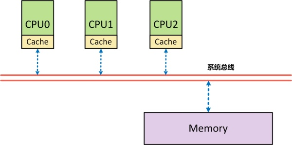
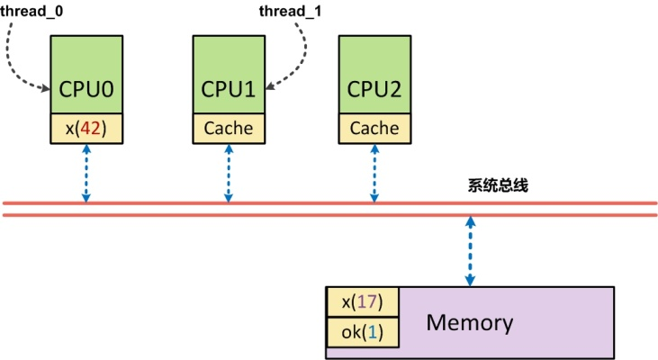
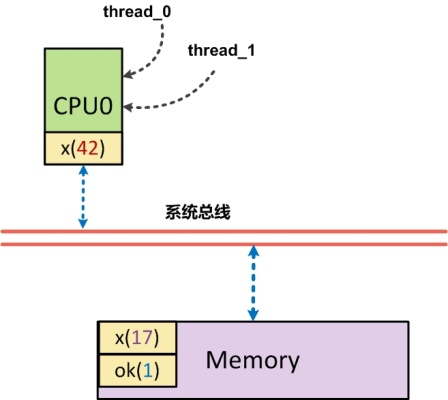
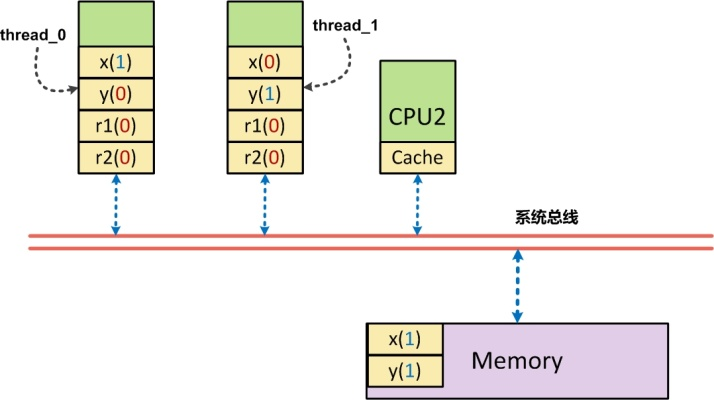
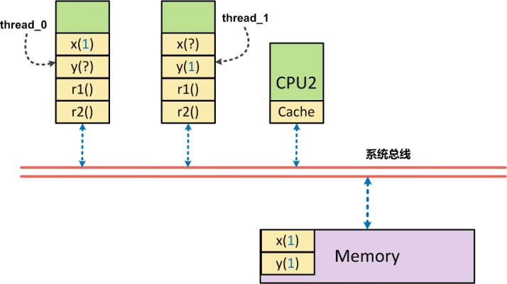
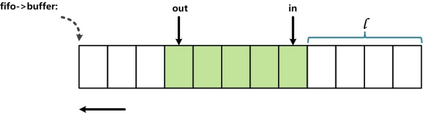

内存屏障是一种底层原语, 在不同计算机架构下有不同的实现细节. 本文主要在`x86_64`处理器下, 通过 Linux 及其内核代码来分析和使用内存屏障

对大多数应用层开发者来说, "内存屏障"(memory barrier)是一种陌生, 甚至有些诡异的技术. 实际上, 他常被用在操作系统内核中, 用于实现同步机制、驱动程序等. 

利用它, 能实现高效的无锁数据结构, 提高多线程程序的性能表现. 本文首先探讨了内存屏障的必要性, 之后介绍如何使用内存屏障实现一个无锁唤醒缓冲区(队列), 用于在多个线程间进行高效的数据交换. 

# 理解内存屏障

程序实际运行时很可能并不完全按照开发者编写的顺序访问内存. 例如: 

```cpp
x = r;
y = 1;
```

这里, y = 1 很可能先于 x = r 执行. 这就是**内存乱序访问**. 内存乱序访问行为出现的理由是为了提升**程序运行时的性能**.

**编译器**和**CPU**都可能引起**内存乱序访问**: 

* 编译时, 编译器优化进行**指令重排**而导致内存乱序访问; 
* 运行时, **多 CPU 间交互**引入内存乱序访问. 

编译器和 CPU 引入内存乱序访问通常不会带来什么问题, 但在一些特殊情况下(主要是**多线程程序中**), **逻辑的正确性**依赖于**内存访问顺序**, 这时, 内存乱序访问会带来逻辑上的错误, 例如: 

```cpp
// thread 1
while(!ok);
do(x);

// thread 2
x = 42;
ok = 1;
```

ok 初始化为 0,  线程 1 等待 ok 被设置为 1 后执行 do 函数. 假如, **线程 2**对内存的**写操作乱序执行**, 也就是**x 赋值晚于 ok 赋值**完成, 那么 do 函数接受的实参很有可能出乎开发者的意料, 不为 42. 

我们可以引入内存屏障来避免上述问题的出现. 内存屏障能让**CPU 或者编译器**在**内存访问上有序**. 一个内存屏障之前的内存访问操作必定先于其之后的完成. 内存屏障包括两类: **编译器屏障**和**CPU 内存屏障**. 

# 编译时内存乱序访问

编译器对代码做出优化时, 可能改变**实际执行指令的顺序**(例如`g++`下 O2 或者 O3 都会改变实际执行指令的顺序), 看一个例子:

```cpp
int x, y, r;
void f()
{
    x = r;
    y = 1;
}
```

首先直接编译次源文件: `g++ -S test.cpp`. 我们得到相关的汇编代码如下: 

```
movl    r(%rip), %eax
movl    %eax, x(%rip)
movl    $1, y(%rip)
```

这里我们可以看到, `x = r`和`y = 1`并**没有乱序执行**. 

现使用**优化选项**O2(或 O3)编译上面的代码(`g++ -O2 –S test.cpp`), 生成汇编代码如下: 

```
movl    r(%rip), %eax
movl    $1, y(%rip)
movl    %eax, x(%rip)
```

我们可以清楚地看到经过编译器优化之后, movl $1, y(%rip)先于 movl %eax, x(%rip)执行, 这意味着, 编译器优化导致了内存乱序访问. 避免次行为的办法就是使用编译器屏障(又叫优化屏障). Linux 内核提供了函数 barrier(), 用于让编译器保证其之前的内存访问先于其之后的内存访问完成. (这个强制保证顺序的需求在哪里?换句话说乱序会带来什么问题内? – 一个线程执行了 y =1 , 但实际上 x=r 还没有执行完成, 此时被另一个线程抢占, 另一个线程执行, 发现 y=1, 以为此时 x 必定=r, 执行相应逻辑, 造成错误)内核实现 barrier()如下: 

```cpp
#define barrier() __asm__ __volatile__("": : :"memory")
```

现在把此编译器 barrier 加入代码中: 

```cpp
int x, y, r;
void f()
{
    x = r;
    __asm__ __volatile__("": : :"memory")
    y = 1;
}
```

再编译, 就会发现内存乱序访问已经不存在了. 除了 barrier()函数外, 本例还可以使用 volatile 这个关键字来避免编译时内存乱序访问(且仅能避免编译时的乱序访问, 为什么呢, 可以参考前面部分的说明, 编译器对于 volatile 声明究竟做了什么 – volatile 关键字对于编译器而言, 是开发者告诉编译器, 这个变量内存的修改, 可能不再你可视范围内, 不要对这个变量相关的代码进行优化). volatile 关键字能让 volatile 变量之间的内存访问上有序, 这里可以修改 x 和 y 的定义来解决问题: 

```cpp
volatile int x, y, r;
```

通过 volatile 关键字, 使得 x 相对 y、y 相对 x 在内存访问上是有序的. 实际上, Linux 内核中, 宏 ACCESS_ONCE 能避免编译器对于连续的 ACCESS_ONCE 实例进行指令重排, 其就是通过 volatile 实现的: 

```cpp
#define ACCESS_ONCE(x) (*(volatile typeof(x) *)&(x))
```

此代码只是将变量 x 转换为 volatile 的而已. 现在我们就有了第三个修改方案: 

```cpp
int x, y, r;
void f()
{
	ACCESS_ONCE(x) = r;
    ACCESS_ONCE(y) = 1;
}
```

到此, 基本上就阐述完成了编译时内存乱序访问的问题. 下面看看 CPU 会有怎样的行为. 

# 运行时内存乱序访问

运行时, CPU 本身是会乱序执行指令的. 早期的处理器为有序处理器(in-order processors),总是按开发者编写的顺序执行指令, 如果指令的输入操作对象(input operands)不可用(通常由于需要从内存中获取), 那么处理器不会转而执行那些输入操作对象可用的指令, 而是等待当前输入操作对象可用. 

相比之下, **乱序处理器**(`out-of-order processors`)会先处理那些有**可用输入操作对象**的指令(而**非顺序执行**)从而避免了等待, 提高了效率. 现代计算机上, 处理器运行的速度比内存快很多, 有序处理器花在等待可用数据的时间里已可处理大量指令了. 

即便现代处理器会**乱序执行**, 但在**单个 CPU 上**, 指令能通过**指令队列顺序获取并执行**, 结果利用**队列顺序返回寄存器堆**(详情可参考 http://en.wikipedia.org/wiki/Out-of-order_execution ), 这使得程序执行时所有的内存访问操作看起来像是按程序**代码编写的顺序执行**的, 因此内存屏障是没有必要使用的(前提是**不考虑编译器优化**的情况下). 

SMP 架构需要内存屏障的进一步解释: 从体系结构上来看, 首先在**SMP 架构**下, **每个 CPU**与**内存**之间, 都配有**自己的高速缓存**(Cache), 以减少访问内存时的冲突



采用**高速缓存**的**写操作**有两种模式: 

(1). **穿透(Write through)模式**, 每次写时, 都**直接将数据写回内存**中, 效率相对较低; 

(2). **回写(Write back)模式**, 写的时候先写回告诉缓存, 然后由**高速缓存的硬件**再周转**复用缓冲线**(Cache Line)时自动将数据写回内存, 或者由软件主动地"冲刷"有关的缓冲线(Cache Line). 

出于性能的考虑, 系统往往采用的是**模式 2**来完成**数据写入**. 正是由于存在**高速缓存**这一层, 正是由于采用了`Write back`模式的数据写入, 才导致在**SMP 架构**下, 对高速缓存的运用可能改变对内存操作的顺序. 

以上面的一个简短代码为例: 

```cpp
// thread 0 -- 在 CPU0 上运行
x = 42;
ok = 1;

// thread 1 – 在 CPU1 上运行
while(!ok);
print(x);
```

这里 CPU1 执行时,  **x 一定是打印出 42**吗?让我们来看看以下图为例的说明: 



假设, 正好**CPU0 的高速缓存**中有**x**, 此时**CPU0**仅仅是将**x=42**写入到了**高速缓存中**, 另外一个**ok 也在高速缓存**中, 但由于**周转复用高速缓冲线**(Cache Line)而导致将**ok=1 刷回到了内存**中, 此时**CPU1**首先执行**对 ok 内存的读取操作**, 他读到了**ok 为 1 的结果**, 进而**跳出循环**, 读取**x 的内容**, 而此时, 由于**实际写入的 x(42**)还只在**CPU0 的高速缓存**中, 导致**CPU1 读到的数据为 x(17**). 

**程序**中编排好的**内存访问顺序**(**指令序**:  program ordering)是**先写入 x**, **再写入 y**. 而实际上出现在该 CPU 外部, 即**系统总线上的次序**(**处理器序**:  processor ordering), 却是**先写入 y**, **再写入 x**(这个例子中 x 还未写入). 

在 SMP 架构中, **每个 CPU**都只知道**自己何时会改变内存**的内容, 但是都**不知道别的 CPU**会在**什么时候改变内存**的内容, 也不知道**自己本地的高速缓存**中的内容是否与**内存**中的**内容不一致**. 反过来, **每个 CPU**都可能因为**改变了内存内容**, 而使得**其他 CPU 的高速缓存**变的**不一致**了. 

在 SMP 架构下, 由于**高速缓存**的存在而导致的**内存访问次序**(读或写都有可能书序被改变)的改变很有可能影响到**CPU 间的同步与互斥**. 因此需要有一种手段, 使得在**某些操作之前**, 把这种"欠下"的内存操作(本例中的**x=42 的内存写入**)全都最终地、物理地完成, 就好像把欠下的债都结清, 然后再开始新的(通常是比较重要的)活动一样. 这种手段就是内存屏障, 其**本质原理**就是**对系统总线加锁**. 

回过头来, 我们再来看看为什么**非 SMP 架构**(UP 架构)下, 运行时**内存乱序访问不存在**. 在单处理器架构下, **各个进程**在**宏观**上是**并行**的, 但是在**微观**上却是**串行**的, 因为在同一时间点上, 只有一个进程真正在运行(系统中只有一个处理器). 在这种情况下, 我们再来看看上面提到的例子: 



**线程 0**和**线程 1**的指令都将在**CPU0**上按照指令序执行. **thread0**通过**CPU0**完成**x=42**的**高速缓存写入**后, 再将**ok=1**写入内存, 此后**串行**的将**thread0 换出**, **thread1 换入**, 即使此时**x=42 并未写入内存**, 但由于**thread1 的执行**仍然是在**CPU0**上执行, 他仍然访问的是**CPU0 的高速缓存**, 因此, 即使**x=42 还未写回到内存**中, **thread1**势必还是**先从高速缓存**中读到**x=42**, 再从**内存中读到 ok=1**

综上所述, 在单 CPU 上, 多线程执行不存在运行时内存乱序访问, 我们从内核源码也可得到类似结论(代码不完全摘录)

```cpp
#define barrier() __asm__ __volatile__("": : :"memory") 
#define mb() alternative("lock; addl $0,0(%%esp)", "mfence", X86_FEATURE_XMM2) 
#define rmb() alternative("lock; addl $0,0(%%esp)", "lfence", X86_FEATURE_XMM2)
#ifdef CONFIG_SMP 
#define smp_mb() mb() 
#define smp_rmb() rmb() 
#define smp_wmb() wmb() 
#define smp_read_barrier_depends() read_barrier_depends() 
#define set_mb(var, value) do { (void) xchg(&var, value); } while (0) 
#else 
#define smp_mb() barrier() 
#define smp_rmb() barrier() 
#define smp_wmb() barrier() 
#define smp_read_barrier_depends() do { } while(0) 
#define set_mb(var, value) do { var = value; barrier(); } while (0) 
#endif
```

这里可看到对内存屏障的定义, 如果是**SMP 架构**, `smp_mb`定义为`mb()`, mb()为**CPU 内存屏障**(接下来要谈的), 而**非 SMP 架构**时(也就是 UP 架构), 直接使用**编译器屏障**, **运行时内存乱序访问并不存在**. 

为什么**多 CPU**情况下会存在**内存乱序访问**?我们知道**每个 CPU 都存在 Cache**, 当一个特定数据**第一次**被**其他 CPU 获取**时, 此数据显然**不在其他 CPU 的 Cache**中(这就是`Cache Miss`). 这意味着 CPU 要从**内存中获取数据**(这个过程需要 CPU 等待数百个周期), 此数据将**被加载到 CPU 的 Cache**中, 这样后续就能**直接从 Cache 上快速访问**. 当**某个 CPU 进行写操作**时, 他**必须**确保**其他 CPU**已将**此数据从他们的 Cache 中移除**(以便保证一致性), 只有在**移除操作完成后**, 此 CPU 才能安全地**修改数据**. 显然, 存在**多个 Cache**时, 必须通过一个**Cache 一致性协议！！！** 来避免数据不一致的问题, 而**这个通信的过程！！！** 就可能导致**乱序访问的出现**, 也就是**运行时内存乱序访问**. 受篇幅所限, 这里不再深入讨论整个细节, 有兴趣的读者可以研究《Memory Barriers: a Hardware View for Software Hackers》这边文章, 它详细地分析了整个过程. 

现在通过一个例子来直观地说明**多 CPU 下内存乱序访问**的问题: 

```cpp
volatile int x, y, r1, r2;
//thread 1
void run1()
{
    x = 1;
    r1 = y;
}
//thread 2
void run2
{
    y = 1;
    r2 = x;
}
```

变量 x、y、r1、r2 均被初始化为 0, **run1**和**run2**运行在**不同的线程**中. 如果 run1 和 run2 在**同一个 cpu**下执行完成, 那么就如我们所料, **r1 和 r2**的值**不会同时为 0**.

而假如 run1 和 run2 在**不同的 CPU**下执行完成后, 由于存在**内存乱序访问**的可能, 这时**r1 和 r2 可能同时为 0**. 

我们可以使用**CPU 内存屏障**来避免**运行时内存乱序访问**(`x86_64`): 

```cpp
void run1()
{
    x = 1;
    //CPU 内存屏障, 保证 x=1 在 r1=y 之前执行
    __asm__ __volatile__("mfence":::"memory");
    r1 = y;
}
//thread 2
void run2
{
    y = 1;
    //CPU 内存屏障, 保证 y = 1 在 r2 = x 之前执行
    __asm__ __volatile__("mfence":::"memory");
    r2 = x;
}
```

这里 mfence 的含义是什么?

x86/64 系统架构提供了**三种内存屏障指令**: (1) sfence; (2) lfence; (3) mfence. (参考介绍: http://peeterjoot.wordpress.com/2009/12/04/intel-memory-ordering-fence-instructions-and-atomic-operations/ 以及 Intel 文档: http://www.intel.com/content/dam/www/public/us/en/documents/manuals/64-ia-32-architectures-software-developer-vol-3a-part-1-manual.pdf 和 http://www.intel.com/content/www/us/en/processors/architectures-software-developer-manuals.html)

1. sfence: 写

Performs a serializing operation on all store-to-memory instructions that were issued prior the SFENCE instruction. This serializing operation guarantees that every store instruction that precedes in program order the SFENCE instruction is globally visible before any store instruction that follows the SFENCE instruction is globally visible. The SFENCE instruction is ordered with respect store instructions, other SFENCE instructions, any MFENCE instructions, and any serializing instructions (such as the CPUID instruction). It is not ordered with respect to load instructions or the LFENCE instruction.

也就是说 sfence 确保: sfence**指令前后**的**写入**(store/release)指令, 按照在**sfence 前后的指令序进行执行**. **写内存屏障**提供这样的保证: 所有出现在屏障**之前的 STORE 操作**都将先于所有出现在屏障**之后的 STORE 操作**被系统中的**其他组件所感知**.

注意, 写屏障一般需要与读屏障或数据依赖屏障配对使用; 参阅"SMP 内存屏障配对"章节. (译注: 因为写屏障只保证自己提交的顺序, 而无法干预其他代码读内存的顺序. 所以配对使用很重要. 其他类型的屏障亦是同理.)

2. lfence: 读

Performs a serializing operation on all load-from-memory instructions that were issued prior the LFENCE instruction. This serializing operation guarantees that every load instruction that precedes in program order the LFENCE instruction is globally visible before any load instruction that follows the LFENCE instruction is globally visible. The LFENCE instruction is ordered with respect to load instructions, other LFENCE instructions, any MFENCE instructions, and any serializing instructions (such as the CPUID instruction). It is not ordered with respect to store instructions or the SFENCE instruction.

也就是说 lfence 确保: lfence**指令前后**的**读取**(load/acquire)指令, 按照在 mfence 前后的指令序进行执行. 读屏障包含数据依赖屏障的功能, 并且保证所有出现在屏障之前的 LOAD 操作都将先于所有出现在屏障之后的 LOAD 操作被系统中的其他组件所感知.

[!] 注意, 读屏障一般要跟写屏障配对使用; 参阅"SMP 内存屏障的配对使用"章节.

3. mfence: 读写

Performs a serializing operation on all load-from-memory and store-to-memory instructions that were issued prior the MFENCE instruction. This serializing operation guarantees that every load and store instruction that precedes in program order the MFENCE instruction is globally visible before any load or store instruction that follows the MFENCE instruction is globally visible. The MFENCE instruction is ordered with respect to all load and store instructions, other MFENCE instructions, any SFENCE and LFENCE instructions, and any serializing instructions (such as the CPUID instruction).

也就是说 mfence 指令: 确保所有 mfence 指令之前的**写入**(store/release)指令, 都在**该 mfence 指令之后的写入**(store/release)指令**之前**(指令序, Program Order)执行; 同时, 他还确保所有 mfence 指令之后的**读取**(load/acquire)指令, 都在该 mfence 指令之前的读取(load/acquire)指令之后执行. 即: 既确保**写者**能够按照**指令序完成数据写入**, 也确保**读者**能够按照**指令序**完成**数据读取**. 通用内存屏障保证所有出现在屏障之前的 LOAD 和 STORE 操作都将先于所有出现在屏障之后的 LOAD 和 STORE 操作被系统中的其他组件所感知.

- **sfence**我认为其动作, 可以看做是**一定将数据写回内存！！！**, 而**不是写到高速缓存！！！**中. 
- **lfence**的动作, 可以看做是**一定将数据从高速缓存中抹掉！！！**, 从**内存中读出来！！！**, 而**不是直接从高速缓存**中读出来. 
- mfence 则正好结合了两项操作. 

**sfence**只确保**写者**在将**数据(A->B)写入内存的顺序**, 并**不确保其他人读(A,B)数据**时, 一定是按照**先读 A**更新后的数据, **再读 B**更新后的数据这样的顺序, 很有可能读者读到的顺序是**A 旧数据**, **B 更新后的数据**, **A 更新后的数据**(只是这个更新后的数据出现在读者的后面, 他并**没有"实际"去读**); 同理, **lfence**也就只能确保**读者在读入顺序**时, 按照**先读 A 最新的在内存中的数据**, 再读**B 最新的在内存中的数据的顺序**, 但如果没有写者 sfence 的配合, 显然, 即使顺序一致, 内容还是有可能乱序. 

为什么仅通过保证了**写者的写入顺序**(sfence), 还是有**可能有问题**?还是之前的例子

```cpp
// CPU 0
void run1()
{
    x = 1;
    //CPU 内存屏障, 保证 x=1 在 r1=y 之前执行
    __asm__ __volatile__("sfence":::"memory");
    r1 = y;
}

//CPU 1
void run2
{
    y = 1;
    //CPU 内存屏障, 保证 y = 1 在 r2 = x 之前执行
    __asm__ __volatile__("sfence":::"memory");
    r2 = x;
}
```

如果仅仅是对"写入"操作进行顺序化, 实际上, 还是有可能使的上面的代码出现 r1, r2 同时为 0(初始值)的场景: 



当**CPU0**上的**thread0**执行时, **x 被先行写回到内存**中, 但如果此时**y 在 CPU0 的高速缓存**中, 这时**y 从缓存中读出**, 并**被赋予 r1 写回内存！！！**, 此时**r1 为 0**. 

同理, **CPU1**上的**thread1**执行时, **y 被先行写回到内存**中, 如果此时**x 在 CPU1 的高速缓存**中存在, 则此时**r2 被赋予了 x 的(过时)值 0**, 同样存在了 r1, r2 同时为 0. 

这个现象实际上就是所谓的**r1=y**的**读顺序！！！**与**x=1**的**写顺序！！！**存在**逻辑上的乱序所致**(或者是**r2 = x**与**y=1**存在乱序) – **读操作**与**写操作**之间存在**乱序**. 而 mfence 就是将这类乱序也屏蔽掉

如果是通过 mfence, 是怎样解决该问题的呢?



当 thread1 在 CPU0 上对`x=1`进行写入时, **x=1 被刷新到内存**中, 由于是**mfence**, 他要求**r1 的读取操作**从**内存读取**数据, 而**不是从缓存中读取**数据, 因此, 此时如果**y 更新为 1**, 则**r1 = 1**; 如果**y 没有更新为 1**, 则**r1 = 0**,  同时此时由于 x 更新为 1,  r2 必须从内存中读取数据, 则此时 r2 = 1. 

总而言之是 r1, r2, 一个=0,  一个=1. 

# 关于内存屏障的一些补充

在实际的应用程序开发中, 开发者可能完全不知道内存屏障就写出了正确的多线程程序, 这主要是因为各种同步机制中已隐含了内存屏障(但和实际的内存屏障有细微差别), 使得不直接使用内存屏障也不会存在任何问题. 但如果你希望编写诸如**无锁数据结构**, 那么内存屏障意义重大. 

在 Linux 内核中, 除了前面说到的**编译器屏障**`—barrier()`和`ACESS_ONCE()`, 还有 CPU 内存屏障: 

* 通用屏障, 保证读写操作有序, 包括 mb()和 smp_mb();
* 写操作屏障, 仅保证写操作有序, 包括 wmb()和 smp_wmb();
* 读操作屏障, 仅保证读操作有序, 包括 rmb()和 smp_rmb();

注意, 所有的 CPU 内存屏障(除了数据依赖屏障外)都隐含了编译器屏障(也就是使用 CPU 内存屏障后就无需再额外添加编译器屏障了). 这里的 smp 开通的内存屏障会根据配置在**单处理器**上直接使用**编译器屏障**, 而在**SMP**上才使用**CPU 内存屏障**(即 mb()、wmb()、rmb()). 

还需要注意一点是, **CPU 内存屏障**中某些类型的屏障需要成对使用, 否则会出错, 详细来说就是: 一个写操作屏障需要和读操作(或者数据依赖)屏障一起使用(当然, 通用屏障也是可以的), 反之亦然. 

通常, 我们是希望在**写屏障之前出现的 STORE 操作**总是匹配**读屏障**或者**数据依赖屏障**之后出现的**LOAD 操作**. 以之前的代码示例为例: 

```cpp
// thread 1
x = 42;
smb_wmb();
ok = 1;
// thread 2
while(!ok);
smb_rmb();
do(x);
```

我们这么做, 是希望在 thread2 执行到 do(x)时(在 ok 验证的确=1 时), x = 42 的确是有效的(写屏障之前出现的 STORE 操作), 此时 do(x), 的确是在执行 do(42)(读屏障之后出现的 LOAD 操作)

# 利用内存屏障实现无锁环形缓冲区

最后, 以一个使用内存屏障实现的无锁环形缓冲区(只有一个读线程和一个写线程时)来结束本文. 本代码源于内核 FIFO 的一个实现, 内容如下(略去了非关键代码): 

代码来源: linux-2.6.32.63\kernel\kfifo.c

```cpp
unsigned int __kfifo_put(struct kfifo *fifo,
			const unsigned char *buffer, unsigned int len)
{
	unsigned int l;
	len = min(len, fifo->size - fifo->in + fifo->out);
	/*
	 * Ensure that we sample the fifo->out index -before- we
	 * start putting bytes into the kfifo.
     * 通过内存屏障确保先读取 fifo->out 后, 才将 buffer 中数据拷贝到
     * 当前 fifo 中
	 */
	smp_mb();
	/* first put the data starting from fifo->in to buffer end */
    /* 将数据拷贝至 fifo->in 到 fifo 结尾的一段内存中 */
	l = min(len, fifo->size - (fifo->in & (fifo->size - 1)));
	memcpy(fifo->buffer + (fifo->in & (fifo->size - 1)), buffer, l);
	/* then put the rest (if any) at the beginning of the buffer */
    /* 如果存在剩余未拷贝完的数据(此时 len – l > 0)则拷贝至 
    * fifo 的开始部分
    */
	memcpy(fifo->buffer, buffer + l, len - l);
	/*
	 * Ensure that we add the bytes to the kfifo -before-
	 * we update the fifo->in index.
	 */
     
    /*
     * 通过写操作屏障确保数据拷贝完成后才更新 fifo->in
     */
	smp_wmb();
	fifo->in += len;
	return len;
}

unsigned int __kfifo_get(struct kfifo *fifo,
			 unsigned char *buffer, unsigned int len)
{
	unsigned int l;
	len = min(len, fifo->in - fifo->out);
	/*
	 * Ensure that we sample the fifo->in index -before- we
	 * start removing bytes from the kfifo.
	 */
    /*
     * 通过读操作屏障确保先读取 fifo->in 后, 才执行另一个读操作: 
     * 将 fifo 中数据拷贝到 buffer 中去
     */
	smp_rmb();
	/* first get the data from fifo->out until the end of the buffer */
    /* 从 fifo->out 开始拷贝数据到 buffer 中 */
	l = min(len, fifo->size - (fifo->out & (fifo->size - 1)));
	memcpy(buffer, fifo->buffer + (fifo->out & (fifo->size - 1)), l);
	/* then get the rest (if any) from the beginning of the buffer */
    /* 如果需要数据长度大于 fifo->out 到 fifo 结尾长度, 
     * 则从 fifo 开始部分拷贝(此时 len – l > 0)
     */
	memcpy(buffer + l, fifo->buffer, len - l);
	/*
	 * Ensure that we remove the bytes from the kfifo -before-
	 * we update the fifo->out index.
	 */
    /* 通过内存屏障确保数据拷贝完后, 才更新 fifo->out */
	smp_mb();
	fifo->out += len;
	return len;
}
```

这里`__kfifo_put`被一个线程用于向 fifo 中写入数据, 另外一个线程可以安全地调用`__kfifo_get`, 从此 fifo 中读取数据. 代码中 in 和 out 的索引用于指定环形缓冲区实际的头和尾. 具体的 in 和 out 所指向的缓冲区的位置通过与操作来求取(例如: fifo->in & (fifo->size -1)), 这样相比取余操作来求取下表的做法效率要高不少. 使用与操作求取下表的前提是环形缓冲区的大小必须是 2 的 N 次方, 换而言之, 就是说环形缓冲区的大小为一个仅有一个 1 的二进制数, 那么 index & (size – 1)则为求取的下标(这不难理解). 



索引 in 和 out 被两个线程访问. in 和 out 指明了缓冲区中实际数据的边界, 也就是 in 和 out 同缓冲区数据存在访问上的顺序关系, 由于不适用同步机制, 那么保证顺序关系就需要使用到内存屏障了. 索引 in 和 out 都分别只被一个线程修改, 而被两个线程读取. __kfifo_put 先通过 in 和 out 来确定可以向缓冲区中写入数据量的多少, 这时, out 索引应该先被读取, 才能真正将用户 buffer 中的数据写入缓冲区, 因此这里使用到了 smp_mb(), 对应的, __kfifo_get 也使用 smp_mb()来确保修改 out 索引之前缓冲区中数据已被成功读取并写入用户 buffer 中了. (我认为在__kfifo_put 中添加的这个 smp_mb()是没有必要的. 理由如下, kfifo 仅支持一写一读, 这是前提. 在这个前提下, in 和 out 两个变量是有着依赖关系的, 这的确没错, 并且我们可以看到在 put 中, in 一定会是最新的, 因为 put 修改的是 in 的值, 而在 get 中, out 一定会是最新的, 因为 get 修改 out 的值. 这里的 smp_mb()显然是希望在运行时, 遵循 out 先 load 新值, in 再 load 新值. 的确, 这样做是没错, 但这是否有必要呢?out 一定要是最新值吗?out 如果不是最新值会有什么问题?如果 out 不是最新值, 实际上并不会有什么问题, 仅仅是在 put 时, fifo 的实际可写入空间要大于 put 计算出来的空间(因为 out 是旧值, 导致 len 在计算时偏小), 这并不影响程序执行的正确性. 从最新 linux-3.16-rc3 kernel 的代码: lib\kfifo.c 的实现: __kfifo_in 中也可以看出 memcpy(fifo->data + off, src, l); memcpy(fifo->data, src + l, len - l);之前的那次 smb_mb()已经被省去了, 当然更新 in 之前的 smb_wmb()还是在 kfifo_copy_in 中被保留了. 之所以省去这次 smb_mb()的调用, 我想除了省去调用不影响程序正确性外, 是否还有对于性能影响的考虑, 尽量减少不必要的 mb 调用)对于 in 索引, 在__kfifo_put 中, 通过 smp_wmb()保证先向缓冲区写入数据后才修改 in 索引, 由于这里只需要保证写入操作有序, 所以选用写操作屏障, 在__kfifo_get 中, 通过 smp_rmb()保证先读取了 in 索引(这时 in 索引用于确定缓冲区中实际存在多少可读数据)才开始读取缓冲区中数据(并写入用户 buffer 中), 由于这里指需要保证读取操作有序, 故选用读操作屏障. 

# 什么时候需要注意考虑内存屏障

从上面的介绍我们已经可以看出, 在 SMP 环境下, 内存屏障是如此的重要, 在**多线程并发执行的程序**中, 一个数据读取与写入的乱序访问, 就有可能导致逻辑上错误, 而显然这不是我们希望看到的. 作为系统程序的实现者, 我们涉及到内存屏障的场景主要集中在**无锁编程时的原子操作**. 执行这些操作的地方, 就是我们需要考虑内存屏障的地方. 

从我自己的经验来看, 使用原子操作, 一般有如下三种方式: (1). 直接对 int32、int64 进行赋值; (2). 使用 gcc 内建的原子操作内存访问接口; (3). 调用第三方 atomic 库: libatomic 实现内存原子操作. 

对于第一类原子操作方式, 显然内存屏障是需要我们考虑的, 例如 kernel 中 kfifo 的实现, 就必须要显示的考虑在数据写入和读取时插入必要的内存屏障, 以保证程序执行的顺序与我们设定的顺序一致. 

对于使用 gcc 内建的原子操作访问接口, 基本上大多数 gcc 内建的原子操作都自带内存屏障, 他可以确保在执行原子内存访问相关的操作时, 执行顺序不被打断. "In most cases, these builtins are considered a full barrier. That is, no memory operand will be moved across the operation, either forward or backward. Further, instructions will be issued as necessary to prevent the processor from speculating loads across the operation and from queuing stores after the operation."(http://gcc.gnu.org/onlinedocs/gcc-4.4.5/gcc/Atomic-Builtins.html). 当然, 其中也有几个并未实现 full barrier, 具体情况可以参考 gcc 文档对对应接口的说明. 同时, gcc 还提供了对内存屏障的封装接口: __sync_synchronize (...), 这可以作为应用程序使用内存屏障的接口(不用写汇编语句). 

对于使用 libatomic 库进行原子操作, 原子访问的程序. Libatomic 在接口上对于内存屏障的设置粒度更新, 他几乎是对每一个原子操作的接口针对不同平台都有对应的不同内存屏障的绑定. "Provides implementations for atomic memory update operations on a number of architectures. This allows direct use of these in reasonably portable code. Unlike earlier similar packages, this one explicitly considers memory barrier semantics, and allows the construction of code that involves minimum overhead across a variety of architectures."接口实现上分别添加了_release/_acquire/_full 等各个后缀, 分别代表的该接口的内存屏障类型, 具体说明可参见 libatomic 的 README 说明. 如果是调用最顶层的接口, 已 AO_compare_and_swap 为例, 最终会根据平台的特性以及宏定义情况调用到: AO_compare_and_swap_full 或者 AO_compare_and_swap_release 或者 AO_compare_and_swap_release 等. 我们可以重点关注 libatomic 在 x86_64 上的实现, libatomic 中, 在 x86_64 架构下, 也提供了应用层的内存屏障接口: AO_nop_full

综合上述三点, 总结下来便是: 如果你在程序中是裸着写内存, 读内存, 则需要显式的使用内存屏障确保你程序的正确性, gcc 内建不提供简单的封装了内存屏障的内存读写, 因此, 如果只是使用 gcc 内建函数, 你仍然存在裸读, 裸写, 此时你还是必须显式使用内存屏障. 如果你通过 libatomic 进行内存访问, 在 x86_64 架构下, 使用 AO_load/AO_store, 你可以不再显式的使用内存屏障(但从实际使用的情况来看, libatomic 这类接口的效率不是很高)

# 参考

http://lday.me/2017/11/04/0016_what_is_memory_barriers/