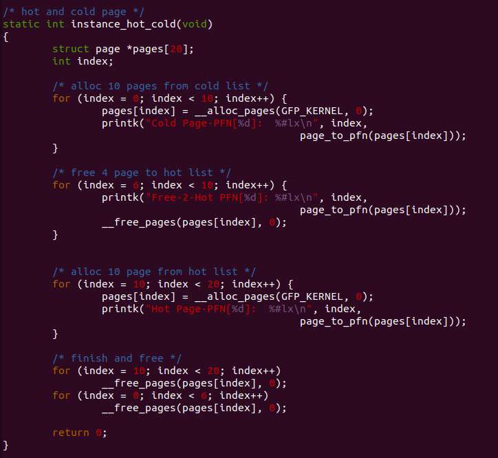
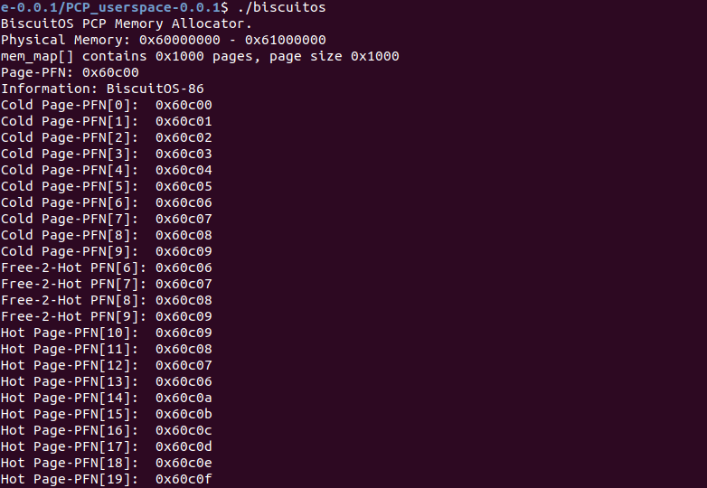

@All
大家好, 今晚给大家分享的是我在用户空间实现的一个 PCP 内存分配器. 在 Linux 中, PCP 内存分配器用来加快分配和回收一个物理页, 也就是书上通常所说的冷热页表. 项目中给出实际例子演示 PCP 的冷热页管理逻辑. 需要的小伙伴可以参考 GITHUB: https://github.com/BiscuitOS/HardStack/tree/master/Memory-Allocator/Buddy/PCP_userspace

这是 PCP 内存分配时冷热页的使用例子:

这是 PCP 内存分配器运行的结果

