# 概述

**通用异步收发器**(Universal Asynchronous Receiver/Transmitter, 通常称作 UART) 是一种**串行异步收发协议**, 应用十分广泛.

在19世纪60年代, 为了解决计算机和电传打字机通信, Bell发明了 UART协议, 将并行输入信号转换成串行输出信号. 因为UART简单实用的特性, 其已经成为一种使用非常广泛的通讯协议. 我们日常接触到的**串口**, **RS232**, **RS485** 等**总线**, **内部**使用的基本都是 **UART 协议** .

为了更好的理解和分析**协议与总线的关系**, 我们通常把一个**完整的通讯规范划**分成物理层, 协议层以及应用层.

* **物理层**只定义真实的信号特性(比如电压, 电流, 驱动能力等), 以及电信号与逻辑信号 0 和 1 的对应关系;

* **协议层**不关心底层的 0 和 1 具体怎么实现, 只规定逻辑信号的协议规范以及通讯过程(例如起始, 数据以及结束等);

* **应用层不关心数据是怎么获取**的, 只定义**数据表示的意义**, 以及如何实现具体的业务逻辑.

通讯协议的分层实现:

最简单的UART协议应用, 通常物理层只需要两根传输线, 一根用于发送, 一根用于接收, 从而实现全双工通讯. 对于单向传输, 也可以只使用一根传输线. 此类应用最典型的实例就是单片机的RX/TX端口互相连接, 从而实现基于TTL电平的UART通讯. 对于不同的传输距离以及可靠性的要求, 替换不同的物理层实现既可以得到我们常见的 RS232、RS485 等通讯总线.

UART是用于控制计算机与串行设备的芯片. 有一点要注意的是, 它提供了 RS-232C 数据终端设备接口, 这样计算机就可以和调制解调器或其它使用 RS-232C 接口的串行设备通信了.

作为接口的一部分, UART还提供以下功能: 将由计算机内部传送过来的并行数据转换为输出的串行数据流. 将计算机外部来的串行数据转换为字节, 供计算机内部使用并行数据的器件使用. 在输出的串行数据流中加入奇偶校验位, 并对从外部接收的数据流进行奇偶校验. 在输出数据流中加入启停标记, 并从接收数据流中删除启停标记. 处理由键盘或鼠标发出的中断信号(键盘和鼠票也是串行设备). 可以处理计算机与外部串行设备的同步管理问题. 有一些比较高档的UART还提供输入输出数据的缓冲区, 现在比较新的 UART 是 16550, 它可以在计算机需要处理数据前在其缓冲区内存储16字节数据, 而通常的 UART是 8250. 现在如果您购买一个内置的调制解调器, 此调制解调器内部通常就会有 16550 UART.

UART 工作原理是将**数据**的二进制位**一位一位**的进行传输. 在 UART 通讯协议中**信号线**上的状态位高电平代表 '1' 低电平代表 '0'. 当然两个设备使用 UART 串口通讯时, 必须先约定好**传输速率**和一些**数据位**.

通信中两个字符间的时间间隔多少是不固定的,  然而在同一个字符中的两个相邻位间的时间间隔是固定的

数据传送速率用波特率来表示, 指单位时间内载波参数变化的次数,  或每秒钟传送的二进制位数

如每秒钟传送 240 个字符, 而每个字符包含 10 位(1 个起始位,  1 个停止位, 8 个数据位), 这时的波特率为 2400Bd

# 硬件连接

硬件连接比较简单, **仅需要3条线**, 注意连接时两个设备 UART 电平, 如电平范围不一致请做电平转换后再连接, 如下图所示:

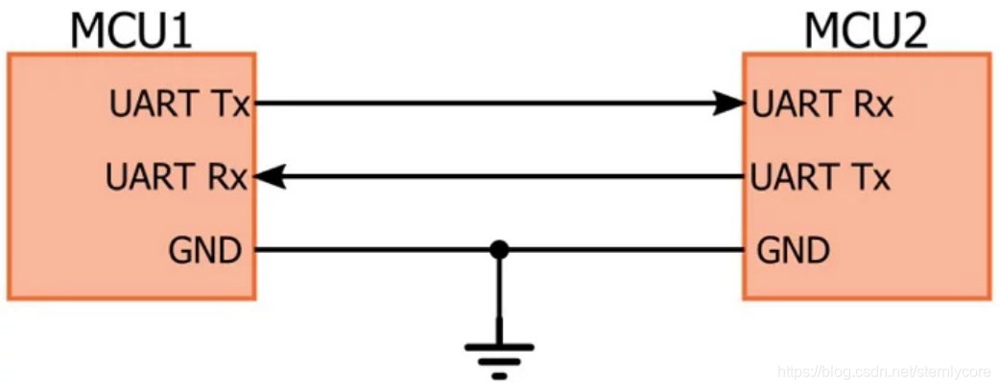

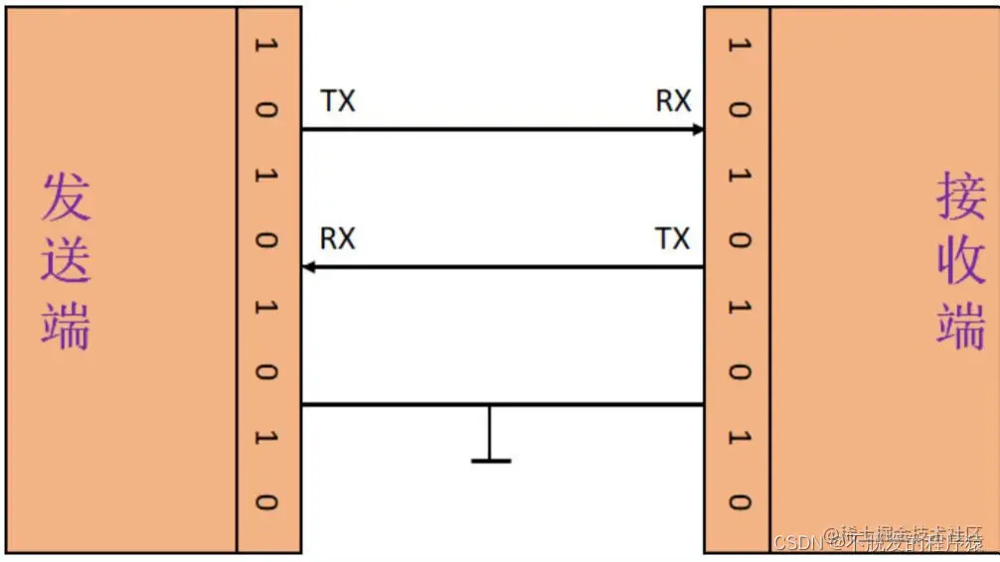

* TX: 发送数据端, 要接对面设备的 RX

* RX: 接收数据端, 要接对面设备的 TX

* GND: 保证两设备共地, 有统一的参考平面

# 特性

UART接口**不使用时钟信号**来同步发送器和接收器设备, 而是以**异步方式**传输数据. 发送器根据其时钟信号生成的位流取代了时钟信号, 接收器使用其内部时钟信号对输入数据进行采样.  同步点是通过两个设备的相同波特率(UART和大多数串行通信一样, 发送和接收设备需要将波特率(波特率是指信息传输到信道的速率)设置为相同的值. 对于串行端口, 设定的波特率将用作每秒传输的最大位数)来管理的.  如果波特率不同, 发送和接收数据的时序可能会受影响, 导致数据处理过程出现不一致. 允许的波特率差异最大值为10%, 超过此值, 位的时序就会脱节.

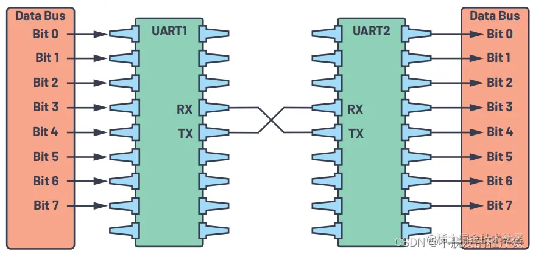

下面总结了关于UART必须了解的几点:

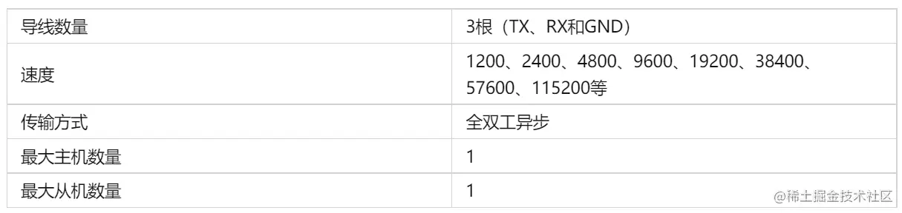

# 软件通信协议

UART 作为异步串口通信协议的一种, 工作原理是将数据的字节一位接一位地传输.

在UART中, 传输模式为数据包形式. 数据包由起始位、数据帧、奇偶校验位和停止位组成.

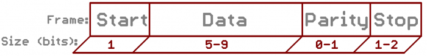

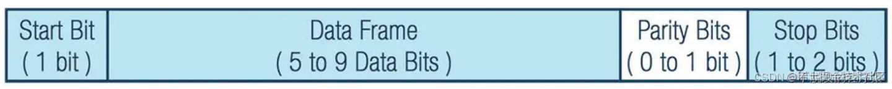

## 起始位

UART协议规定, 当总线处于空闲状态时信号线的状态应该保持为 '1', 即高电平

当不传输数据时, UART 数据传输线通常保持高电压电平. 若要开始数据传输, 发送UART会将传输线从高电平拉到低电平并保持1个时钟周期.

开始进行数据传输时, 发送方要先发出一个低电平 '0' 来表示传输字符的**开始**. 因为空闲位一直是高电平所以开始第一次通讯时先发送一个明显区别于空闲状态的信号, 即低电平.

当接收UART检测到高到低电压跃迁时, 便开始以波特率对应的频率读取数据帧中的位.

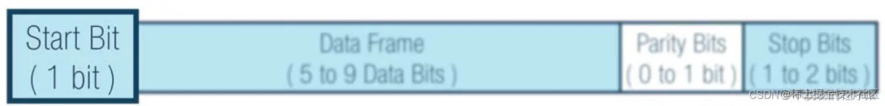

## 数据位

数据帧包含所传输的实际数据. 如果使用奇偶校验位, 数据帧长度可以是 5 位到 8 位, 一般都是 8 位. 如果不使用奇偶校验位, 数据帧长度可以是9位.

先发送最低位最后发送最高位.

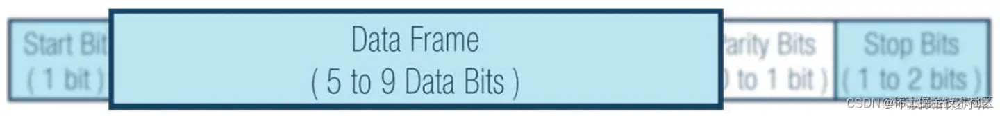

## 奇偶校验位

数据位传送完成后, 要进行奇偶校验, 校验位其实是调整个数, 串口校验分几种方式:

1. 无校验(no parity)

2. 奇校验(odd parity): 如果数据位中'1'的数目是偶数, 则校验位为'1', 如果'1'的数目是奇数, 校验位为'0'.

3. 偶校验(even parity): 如果数据为中'1'的数目是偶数, 则校验位为'0', 如果为奇数, 校验位为'1'.

4. mark parity: 校验位始终为1

5. space parity: 校验位始终为0

奇偶性描述数字是偶数还是奇数. 通过奇偶校验位, 接收UART判断传输期间是否有数据发生改变. 电磁辐射、不一致的波特率或长距离数据传输都可能改变数据位.
校验位可以配置成 1 位偶校验或 1 位奇校验或无校验位.
接收UART读取数据帧后, 将统计数值为1的位, 检查总数是偶数还是奇数. 如果奇偶校验位为0(偶数奇偶校验), 则数据帧中的1或逻辑高位总计应为偶数. 如果奇偶校验位为1(奇数奇偶校验), 则数据帧中的1或逻辑高位总计应为奇数.
当奇偶校验位与数据匹配时, UART认为传输未出错. 但是, 如果奇偶校验位为0, 而总和为奇数, 或者奇偶校验位为1, 而总和为偶数, 则UART认为数据帧中的位已改变.

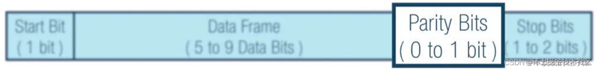

## 停止位

数据结束标志, 可以是1位, 1.5位, 2位的高电平.

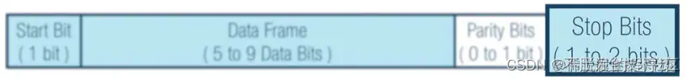

## 波特率

数据传输速率使用波特率来表示, 单位 bps(bits per second), 常见的波特率9600bps, 115200bps等等, 其他标准的波特率是1200, 2400, 4800, 19200, 38400, 57600. 举个例子, 如果串口波特率设置为9600bps, 那么传输一个比特需要的时间是1/9600≈104.2us.

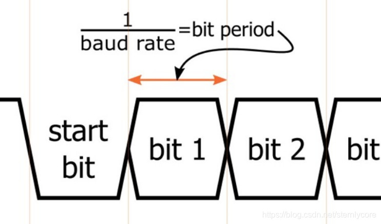

以 9600 8N1(9600波特率, 8个数据位, 没有校验位, 1位停止位)为例, 这是目前最常用的串口配置, 现在我们传输 ’O’ 'K' 两个ASCII值, 'O' 的ASCII为79, 对应的二进制数据为01001111, 'K' 对应的二进制数据为01001011 , 传输的格式数据如下图所示:

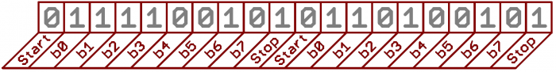

串口波特率为9600, 1bit传输时间大约为104us, 传送一个数据实际是10个比特(开始位, 8个数据位, 停止位), 一个bytes传输速率实际为9600*8/10=7680bps.

# UART 和 COM

嵌入式里面说的串口, 一般是指UART口,  但是我们经常搞不清楚它和COM口的区别,  以及RS232,  TTL等关系,  实际上UART, COM指的物理接口形式(硬件),  而TTL、RS-232是指的电平标准(电信号).

UART有4个pin(VCC, GND, RX, TX), 用的 TTL 电平,  低电平为0(0V), 高电平为1(3.3V或以上).

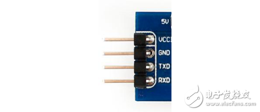

COM口是我们台式机上面常用的口(下图), 9个pin,  用的 RS232 电平,  它是负逻辑电平, 它定义 `+5 ~ +12V` 为低电平, 而 `-12 ~ -5V` 为高电平

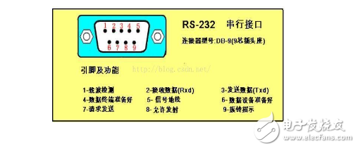

# UART 通信步骤

第1步: 数据从数据总线到发送器.

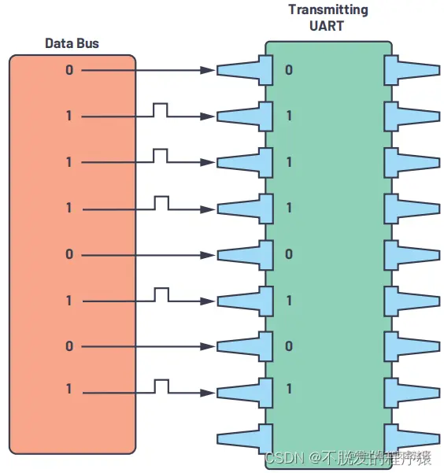

第2步: 发送UART将起始位、奇偶校验位和停止位添加到数据帧.

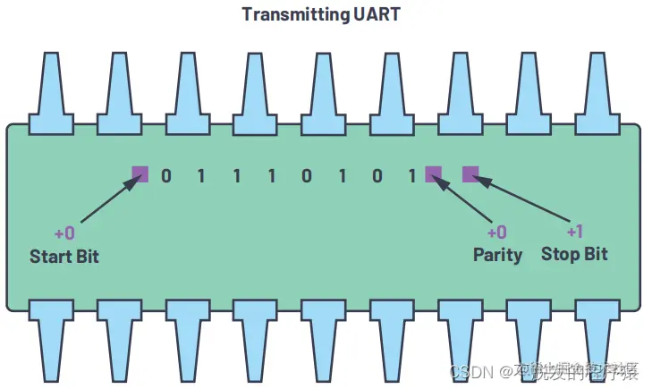

第3步: 从起始位到结束位, 整个数据包以串行方式从发送器送至接收器.

接收UART以预配置的波特率对数据线进行采样.

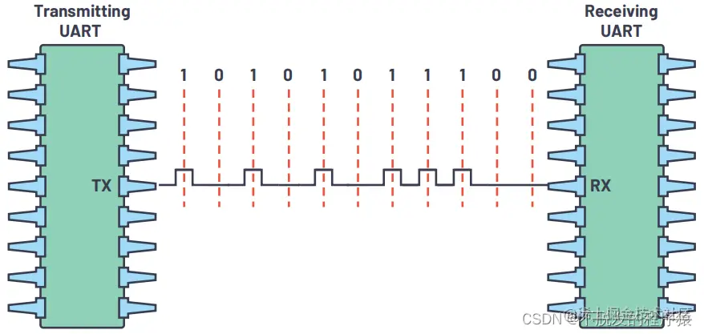

第4步: 接收器丢弃数据帧中的起始位、奇偶校验位和停止位.

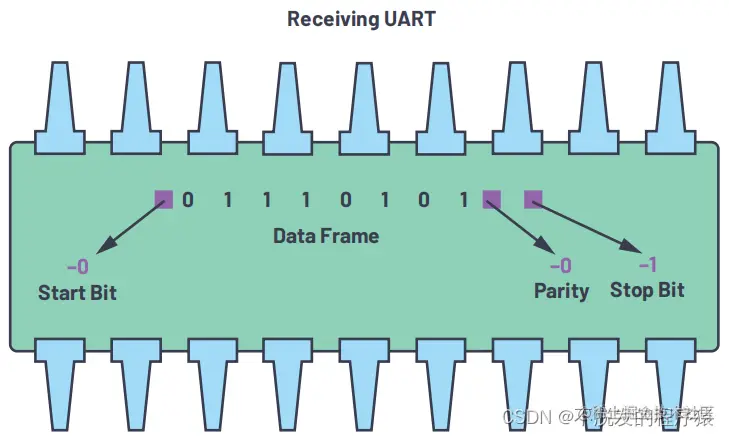

第5步: 接收器将串行数据转换回并行数据, 并将其传输到接收端的数据总线.

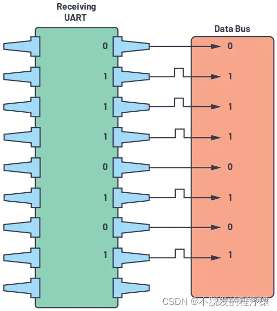

# reference

https://juejin.cn/post/7139901793999749134
