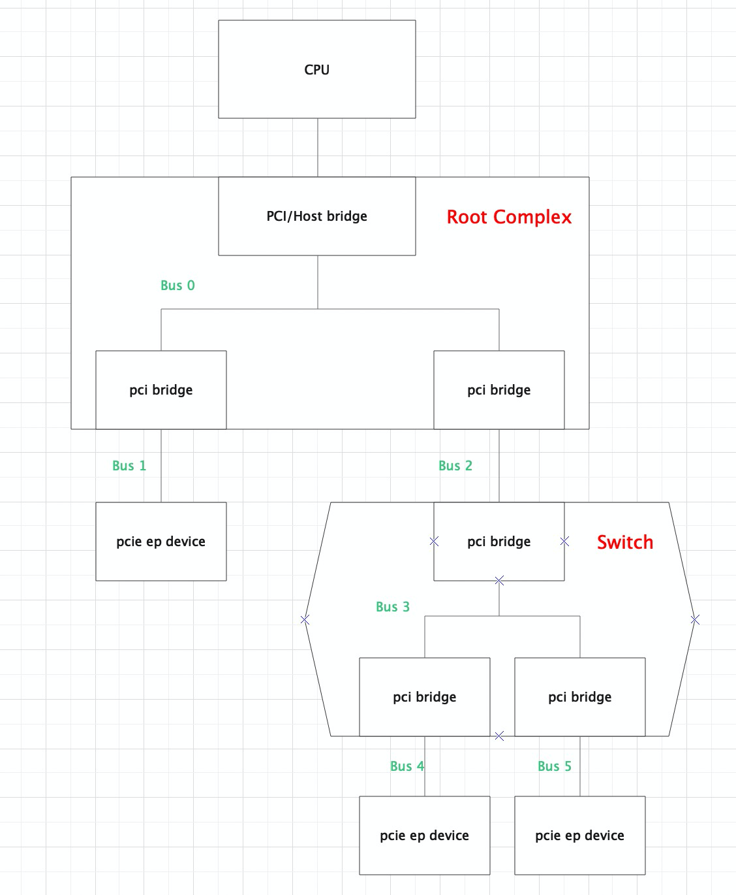
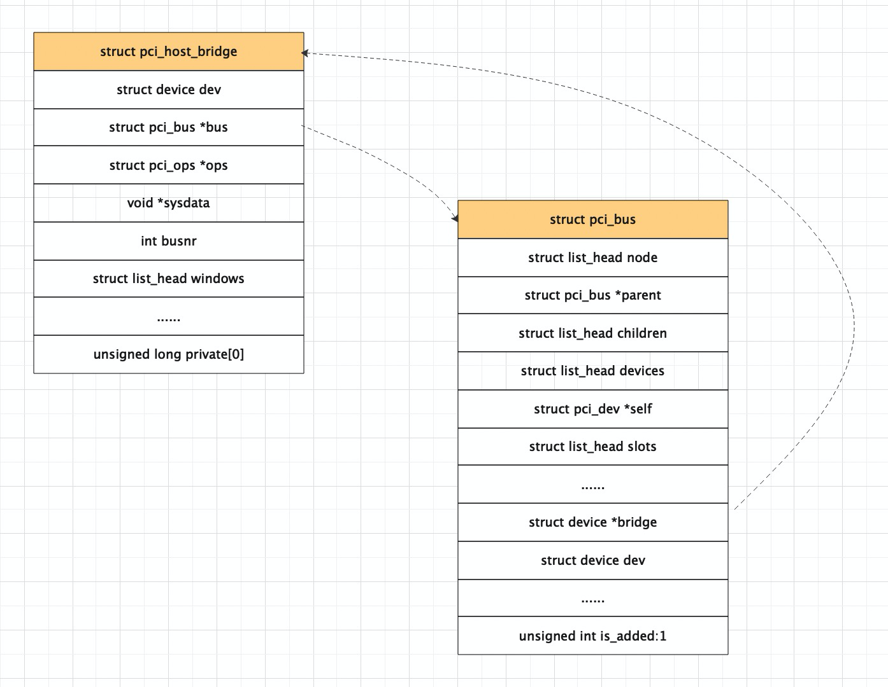
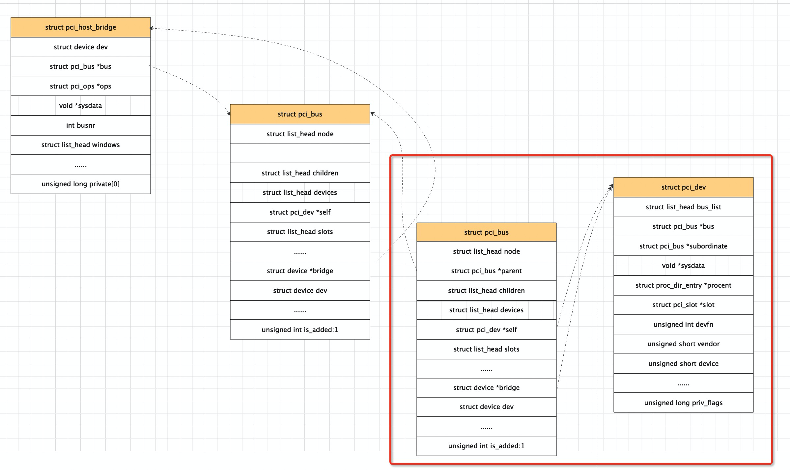

<!-- @import "[TOC]" {cmd="toc" depthFrom=1 depthTo=6 orderedList=false} -->

<!-- code_chunk_output -->

- [1. PCIe architecture](#1-pcie-architecture)
  - [1.1. pcie 的拓扑结构](#11-pcie-的拓扑结构)
  - [1.2. PCIe 的软件层次](#12-pcie-的软件层次)
- [2. Linux 内核实现](#2-linux-内核实现)
  - [2.1. pcie 初始化流程](#21-pcie-初始化流程)
  - [2.2. pcie 枚举流程](#22-pcie-枚举流程)
  - [2.3. pcie 的资源分配](#23-pcie-的资源分配)
- [3. 参考资料](#3-参考资料)

<!-- /code_chunk_output -->

本文主要是对 PCIe 的初始化枚举, 资源分配流程进行分析, 代码对应的是 alikernel-4.19, 平台是 arm64

# 1. PCIe architecture

## 1.1. pcie 的拓扑结构

在分析 PCIe 初始化枚举流程之前, 先描述下 pcie 的拓扑结构.



整个 PCIe 是一个树形的拓扑:

* Root Complex 是树的根, 它一般实现了一个**主桥设备** (`host bridge`), 一条内部 PCIe 总线 (BUS 0), 以及通过若干个 PCI bridge 扩展出一些 root port. host bridge 可以完成 CPU 地址到 PCI 域地址的转换, pci bridge 用于系统的扩展, 没有地址转换功能;

* Swich 是转接器设备, 目的是扩展 PCIe 总线. switch 中有一个 upstream port 和若干个 downstream port, 每一个端口都相当于一个 pci bridge

* PCIe ep device 是叶子节点设备, 比如 pcie 网卡, 显卡, nvme 卡等.

每个 PCIe 设备, 包括 host bridge, pci bridge 和 ep 设备都有一个 4k 的配置空间. arm 使用 ecam 的方式访问 pcie 配置空间.

## 1.2. PCIe 的软件层次

PCIe 模块涉及到的代码文件很多, 在分析 pcie 的代码前, 先对 pcie 的涉及到的代码梳理下.

这里以 arm64 架构为例, pcie 代码主要分散在三个目录:

```
drivers/pci/*
driver/acpi/pci*
arch/arm64/kernel/pci.c
```

将 pcie 代码按如下层次划分:

```
    |-->+ pcie hp service driver  +
    |-->+ pcie aer service driver +
    |-->+ pcie pme service driver +
    |-->+ pcie dpc service driver +
    |
+---------------------+   +----------------+
| pcie port bus driver|   | pcie ep driver |
+---------------------+   +----------------+
+------------------------------------------+
|              pcie core driver            |
+------------------------------------------+
+------------------+   +-------------------+
| arch pcie driver |   | acpi pcie driver  |
+------------------+   +-------------------+
____________________________________________
+------------------------------------------+
|               pcie hardware              |
+------------------------------------------+
```

* arch pcie driver: 放一些和架构强相关的 pcie 的函数实现, 对应 `arch/arm64/kernel/pci.c`
* acpi pcie driver: acpi 扫描时所涉及到的 pcie 代码, 包括 host bridge 的解析初始化, pcie bus 的创建, ecam 的映射等, 对应 `drivers/acpi/pci*.c`
* pcie core driver: pcie 的子系统代码, 包括 pcie 的枚举流程, 资源分配流程, 中断流程等, 主要对应 `drivers/pci/*. c`
* pcie port bus driver: 是 pcie port 的四个 service 代码的整合, 四个 service 主要指的是 pcie dpc/pme/hotplug/aer, 对应的是 `drivers/pci/pcie/*`
* pcie ep driver: 是叶子节点的设备驱动, 比如显卡, 网卡, nvme 等.

# 2. Linux 内核实现

## 2.1. pcie 初始化流程

pcie 的代码文件这么多, 初始化涉及的调用也很多, 从哪一个开始看呢?

内核通过 initcore 的 level 决定模块的启动顺序

```
cat System.map | grep pci | grep initcall
```

再结合 Makefile 中 object 定义的先后顺序

```
# cat drivers/pci/Makefile

obj-$(CONFIG_PCI)               += access.o bus.o probe.o host-bridge.o \
                                   remove.o pci.o pci-driver.o search.o \
                                   pci-sysfs.o rom.o setup-res.o irq.o vpd.o \
                                   setup-bus.o vc.o mmap.o setup-irq.o msi.o
```

可以看出关键 symbol 的调用顺序如下:

```
|-->pcibus_class_init () /* postcore_initcall (pcibus_class_init) */
|
|-->pci_driver_init () /* postcore_initcall (pci_driver_init) */
|
|-->acpi_pci_init () /* arch_initcall (acpi_pci_init) */
|
|-->acpi_init () /* subsys_initcall (acpi_init) */
```

* `pcibus_class_init()`: 注册 `pci_bus class`, 完成后创建了 `/sys/class/pci_bus` 目录.
* `pci_driver_init()`: 注册 `pci_bus_type`, 完成后创建了 `/sys/bus/pci` 目录.
* `acpi_pci_init()`: 注册 `acpi_pci_bus`, 并 **设置电源管理相应的操作**.
* `acpi_init()`: apci 启动所涉及到的初始化流程, PCIe 基于 acpi 的启动流程从该接口进入.

在 `linux/Documentation/acpi/namespace.txt` 中定义了 acpi 解析的流程

```
     +---------+    +-------+    +--------+    +------------------------+
     |  RSDP   | +->| XSDT  | +->|  FADT  |    |  +-------------------+ |
     +---------+ |  +-------+ |  +--------+  +-|->|       DSDT        | |
     | Pointer | |  | Entry |-+  | ...... |  | |  +-------------------+ |
     +---------+ |  +-------+    | X_DSDT |--+ |  | Definition Blocks | |
     | Pointer |-+  | ..... |    | ...... |    |  +-------------------+ |
     +---------+    +-------+    +--------+    |  +-------------------+ |
                    | Entry |------------------|->|       SSDT        | |
                    +- - - -+                  |  +-------------------| |
                    | Entry | - - - - - - - -+ |  | Definition Blocks | |
                    +- - - -+                | |  +-------------------+ |
                                             | |  +- - - - - - - - - -+ |
                                             +-|->|       SSDT        | |
                                               |  +-------------------+ |
                                               |  | Definition Blocks | |
                                               |  +- - - - - - - - - -+ |
                                               +------------------------+
                                                           |
                                              OSPM Loading |
                                                          \|/
                                                    +----------------+
                                                    | ACPI Namespace |
                                                    +----------------+
```

ACPI Namespace 就是表示系统上所有可枚举的 ACPI 设备的层次结构.

现在对 `acpi_init ()` 流程展开, 主要找和 pci 初始化相关的调用:

```cpp
acpi_init () /* subsys_initcall (acpi_init) */
    +-> mmcfg_late_init ()
    +-> acpi_scan_init ()
        +-> acpi_pci_root_init ()
            +-> acpi_scan_add_handler_with_hotplug (&pci_root_handler, "pci_root");
                +-> .attach = acpi_pci_root_add
        /*
         * register pci_link_handler to list: acpi_scan_handlers_list.
         * this handler has relationship with PCI IRQ.
         */
        +-> acpi_pci_link_init ()
        /* we facus on PCI-ACPI, ignore other handlers' init */
        ...
        +-> acpi_bus_scan ()
            /* create struct acpi_devices for all device in this system */
            --> acpi_walk_namespace ()
            --> acpi_bus_attach ()
                --> acpi_scan_attach_handler ()
                    --> acpi_scan_match_handler ()
                    --> handler->attach /* attach is acpi_pci_root_add */
```

`mmcfg_late_init ()`, acpi 先扫描 **MCFG 表**, MCFG 表定义了 ecam 的相关资源.

`acpi_pci_root_init ()`, 定义 pcie host bridge device 的 attach 函数, ACPI 的 Definition Block 中使用 PNP0A03 表示一个 PCI Host Bridge.

`acpi_pci_link_init ()`, 注册 pci_link_handler, 主要和 pcie IRQ 相关.

`acpi_bus_scan ()`, 会通过 acpi_walk_namespace () 会遍历 system 中所有的 device, 并为这些 acpi device 创建数据结构, 执行对应 device 的 attatch 函数. 根据 ACPI spec 定义, **pcie host bridge device** 定义在 DSDT 表中, acpi 在扫描过程中扫描 DSDT, 如果发现了 pcie host bridge, 就会执行 device 对应的 attach 函数, 调用到 `acpi_pci_root_add ()`.

`acpi_pci_root_add` 的函数很长, 完整代码就不贴了, 它主要做了几个动作

(1) 通过 ACPI 的 `_SEG` 参数, 获取 host bridge 使用的 segment 号, segment 指的就是 pcie domain, 主要目的是为了突破 pcie 最大 256 条 bus 的限制.

(2) 通过 ACPI 的 `_CRS` 里的 BusRange 类型资源取得该 Host Bridge 的 Secondary 总线范围, 保存在 root->secondary 这个 resource 中

(3) 通过 ACPI 的_BNN 参数获取 host bridge 的根总线号.
执行到这里如果没有返回失败, 硬件设备上会有如下打印:

```
pr_info (PREFIX "% s [% s](domain %04x % pR)\n",
        acpi_device_name (device), acpi_device_bid (device),
        root->segment, &root->secondary);
...

[    4.683355] ACPI: PCI Root Bridge [PCI0] (domain 0000 [bus 00-7e])
```

(4) pci_acpi_scan_root, pcie 枚举流程的入口

## 2.2. pcie 枚举流程

```cpp
166 struct pci_bus *pci_acpi_scan_root (struct acpi_pci_root *root)
167 {
168         int node = acpi_get_node (root->device->handle);
169         struct acpi_pci_generic_root_info *ri;
170         struct pci_bus *bus, *child;
171         struct acpi_pci_root_ops *root_ops;
172
173         ri = kzalloc_node (sizeof (*ri), GFP_KERNEL, node);
174         if (! ri)
175                 return NULL;
176
177         root_ops = kzalloc_node (sizeof (*root_ops), GFP_KERNEL, node);
178         if (! root_ops) {
179                 kfree (ri);
180                 return NULL;
181         }
182
183         ri->cfg = pci_acpi_setup_ecam_mapping (root);    -------(1)
184         if (! ri->cfg) {
185                 kfree (ri);
186                 kfree (root_ops);
187                 return NULL;
188         }
189
190         root_ops->release_info = pci_acpi_generic_release_info;
191         root_ops->prepare_resources = pci_acpi_root_prepare_resources;
192         root_ops->pci_ops = &ri->cfg->ops->pci_ops;     ----- (2)
193         bus = acpi_pci_root_create (root, root_ops, &ri->common, ri->cfg);  ---- (3)
194         if (! bus)
195                 return NULL;
196
            ....
202
203         return bus;
204 }
```

(1) `pci_acpi_setup_ecam_mapping ()`, 建立 ecam 映射. arm64 上访问 pcie 的配置空间都是通过 ecam 机制进行访问, 将 ecam 的空间进行映射, 这样 cpu 就可以通过访问内存访问到相应设备的配置空间.

```cpp
118 static struct pci_config_window *
119 pci_acpi_setup_ecam_mapping (struct acpi_pci_root *root)
120 {
121         struct device *dev = &root->device->dev;
122         struct resource *bus_res = &root->secondary;
123         u16 seg = root->segment;
124         struct pci_ecam_ops *ecam_ops;
125         struct resource cfgres;
126         struct acpi_device *adev;
127         struct pci_config_window *cfg;
128         int ret;
129
130         ret = pci_mcfg_lookup (root, &cfgres, &ecam_ops);
131         if (ret) {
132                 dev_err (dev, "%04x: % pR ECAM region not found\n", seg, bus_res);
133                 return NULL;
134         }
135
136         adev = acpi_resource_consumer (&cfgres);
137         if (adev)
138                 dev_info (dev, "ECAM area % pR reserved by % s\n", &cfgres,
139                          dev_name (&adev->dev));
140         else
141                 dev_warn (dev, FW_BUG "ECAM area % pR not reserved in ACPI namespace\n",
142                          &cfgres);
143
144         cfg = pci_ecam_create (dev, &cfgres, bus_res, ecam_ops);
145         if (IS_ERR (cfg)) {
146                 dev_err (dev, "%04x: % pR error % ld mapping ECAM\n", seg, bus_res,
147                         PTR_ERR (cfg));
148                 return NULL;
149         }
150
151         return cfg;
152 }
```

130 行: pci_mcfg_lookup (), 通过该接口可以获取 ecam 的资源以及访问配置空间的操作 ecam_ops.

ecam_ops 默认是 pci_generic_ecam_ops, 定义在 drivers/pci/ecam.c 中, 但也可以由厂商自定义, 厂商自定义的 ecam_ops 实现在 drivers/pci/controller/ 目录下, 比如 hisi_pcie_ops 和 ali_pcie_ops, 厂商会依据实际的硬件对 ecam 进行限制.

```cpp
107 struct pci_ecam_ops ali_pcie_ops = {
108         .bus_shift    = 20,
109         .init         =  ali_pcie_init,
110         .pci_ops      = {
111                 .map_bus    = ali_pcie_map_bus,
112                 .read       = ali_pcie_rd_conf,
113                 .write      = ali_pcie_wr_conf,
114         }
115 };
```

144 行: pci_ecam_create (), 对 ecam 的地址进行 ioremap, 如果定义了 ecam_ops->init, 还会执行到相应的初始化函数中

(2) 设置 root_ops 的 pci_ops, 这里的 pci_ops 就是对应上面说的 ecam_ops->pci_ops, 即配置空间的访问接口

(3) bus = acpi_pci_root_create (root, root_ops, &ri->common, ri->cfg);

```cpp
struct pci_bus *acpi_pci_root_create (struct acpi_pci_root *root,
878                                      struct acpi_pci_root_ops *ops,
879                                      struct acpi_pci_root_info *info,
880                                      void *sysdata)
881 {
882         int ret, busnum = root->secondary.start;
883         struct acpi_device *device = root->device;
884         int node = acpi_get_node (device->handle);
885         struct pci_bus *bus;
886         struct pci_host_bridge *host_bridge;
887
            ...
906         bus = pci_create_root_bus (NULL, busnum, ops->pci_ops,
907                                   sysdata, &info->resources);
908         if (! bus)
909                 goto out_release_info;
910
911         host_bridge = to_pci_host_bridge (bus->bridge);
            ...
923         pci_scan_child_bus (bus);
924         pci_set_host_bridge_release (host_bridge, acpi_pci_root_release_info,
925                                     info);
926         if (node != NUMA_NO_NODE)
927                 dev_printk (KERN_DEBUG, &bus->dev, "on NUMA node % d\n", node);
928         return bus;
929
930 out_release_info:
931         __acpi_pci_root_release_info (info);
932         return NULL;
933 }
```

906 行: pci_create_root_bus () 用来创建该 {segment: busnr} 下的根总线. 传递的参数: NULL 是 host bridge 设备的 parent 节点; busnum 是总线号; ops->pci_ops 对应的是 ecam->pci_ops, 即配置空间的操作接口; sysdata 私有数据, 对应的是 pcie_create_ecam () 所返回的 pci_cfg_window, 包括 ecam 的地址范围, 映射地址等; info->resource 是一个 resource_list, 用来保存总线号, I/O 空间, mem 空间等信息.

```cpp
2914 struct pci_bus *pci_create_root_bus (struct device *parent, int bus,
2915                 struct pci_ops *ops, void *sysdata, struct list_head *resources)
2916 {
2917         int error;
2918         struct pci_host_bridge *bridge;
2919
2920         bridge = pci_alloc_host_bridge (0);
2921         if (! bridge)
2922                 return NULL;
2923
2924         bridge->dev.parent = parent;
2925
2926         list_splice_init (resources, &bridge->windows);
2927         bridge->sysdata = sysdata;
2928         bridge->busnr = bus;
2929         bridge->ops = ops;
2930
2931         error = pci_register_host_bridge (bridge);
2932         if (error < 0)
2933                 goto err_out;
2934
2935         return bridge->bus;
2936
2937 err_out:
2938         kfree (bridge);
2939         return NULL;
2940 }
```

2920 行: 分配 struct pci_host_bridge, 一个 pci_host_bridge 对应一个 pci host bridge 设备.

2924 行: 设置该 bridge 的 parent 为 NULL, 说明 host bridge device 是最上层设备.

2931 行: pci_register_host_bridge (). 注册 host bridge device. 该函数比较长, 就不贴具体实现了, 主要是为 host bridge 数据结构注册对应的设备, 创建了一个根总线 pci_bus, 也为该 pci_bus 数据结构注册一个设备并填充初始化的数据.

```cpp
         dev_set_name (&bridge->dev, "pci%04x: %02x", pci_domain_nr (bus),
                      bridge->busnr);
         err = device_register (&bridge->dev);
         dev_set_name (&bus->dev, "%04x: %02x", pci_domain_nr (bus), bus->number);
         err = device_register (&bus->dev);
```

2935 行: 返回 root_bus, 即 pci_host_bridge 的 bus 成员.

到该函数结束我们已经有了一个 root_bus device, 一个 host bridge device, 也知道了他们的关系:



回到上面 acpi_pci_root_create () 函数中, 看 923 行 pci_scan_child_bus (), 现在开始遍历 host bridge 主桥下的所有 pci 设备

函数也比较长, 列一些关键的函数调用:

```cpp
pci_scan_child_bus ()
    +-> pci_scan_child_bus_extend ()
        +-> for dev range (0, 256)
               pci_scan_slot ()
                    +-> pci_scan_single_device ()
                        +-> pci_scan_device ()
                            +-> pci_bus_read_dev_vendor_id ()
                            +-> pci_alloc_dev ()
                            +-> pci_setup_device ()
                        +-> pci_add_device ()
        +-> for each pci bridge
            +-> pci_scan_bridge_extend ()
```

pci_scan_slot (): 一条 pcie 总线最多 32 个设备, 每个设备最多 8 个 function, 所以这里 pci_scan_child_bus 枚举了所有的 pcie function, 调用了 pci_scan_slot 256 次, pci_scan_slot 调用 pci_scan_single_device () 配置当前总线下的所有 pci 设备.

pci_scan_single_device (): 进一步调用 pci_scan_device () 和 pci_add_device (). pci_scan_device 先去通过配置空间访问接口读取设备的 vendor id, 如果 60s 没读到, 说明没有找到该设备. 如果找到该设备, 则通过 pci_alloc_dev 创建 pci_dev 数据结构, 并对 pci 的配置空间进行一些配置. pci_add_device, 软件将 pci dev 添加到设备 list 中.

pci_setup_device (): 获取 pci 设备信息, 中断号, BAR 地址和大小 (使用 pci_read_bases, 就是往 BAR 地址写 1 来计算的), 并保存到 pci_dev->resources 中.

现在我们已经扫描完了 host bridge 下的 bus 和 dev, 现在开始扫描 bridge, 一个 bridge 也对应一个 pci_dev.比如 switch 中的每一个 port 对应一个 pci bridge.

pci_scan_bridge_extend () 就是用于扫描 pci 桥和 pci 桥下的所有设备, 这个函数会被调用 2 次, 第一次是处理 BIOS 已经配置好的 pci 桥, 这个是为了兼容各个架构所做的妥协. 通过 2 次调用 pci_scan_bridge_extend 函数, 完成所有的 pci 桥的处理.

```cpp
1061 static int pci_scan_bridge_extend (struct pci_bus *bus, struct pci_dev *dev,
1062                                   int max, unsigned int available_buses,
1063                                   int pass)
1064 {
1065         struct pci_bus *child;
             ......
1078         pci_read_config_dword (dev, PCI_PRIMARY_BUS, &buses);
1079         primary = buses & 0xFF;
1080         secondary = (buses >> 8) & 0xFF;
1081         subordinate = (buses >> 16) & 0xFF;
1082
1083         pci_dbg (dev, "scanning [bus %02x-%02x] behind bridge, pass % d\n",
1084                 secondary, subordinate, pass);
1085
             ......
1110         if ((secondary || subordinate) && !pcibios_assign_all_busses () &&
1111             !is_cardbus && !broken) {
                    .......
1145         } else {
1146
1151                 if (! pass) {
1152                         if (pcibios_assign_all_busses () || broken || is_cardbus)
1153
1162                                 pci_write_config_dword (dev, PCI_PRIMARY_BUS,
1163                                                        buses & ~0xffffff);
1164                         goto out;
1165                 }
1166
1167                 /* Clear errors */
1168                 pci_write_config_word (dev, PCI_STATUS, 0xffff);
1169
1175                 child = pci_find_bus (pci_domain_nr (bus), max+1);
1176                 if (! child) {
1177                         child = pci_add_new_bus (bus, dev, max+1);
1178                         if (! child)
1179                                 goto out;
1180                         pci_bus_insert_busn_res (child, max+1,
1181                                                 bus->busn_res.end);
1182                 }
1183                 max++;
1184                 if (available_buses)
1185                         available_buses--;
1186
1187                 buses = (buses & 0xff000000)
1188                       | ((unsigned int)(child->primary)     <<  0)
1189                       | ((unsigned int)(child->busn_res.start)   <<  8)
1190                       | ((unsigned int)(child->busn_res.end) << 16);
1191
                    ......
1200
1201                 /* We need to blast all three values with a single write */
1202                 pci_write_config_dword (dev, PCI_PRIMARY_BUS, buses);
1203
1204                 if (! is_cardbus) {
1205                         child->bridge_ctl = bctl;
1206                         max = pci_scan_child_bus_extend (child, available_buses);
1207                 } else {
                            .......
1239                 }
1240
1241                 /* Set subordinate bus number to its real value */
1242                 pci_bus_update_busn_res_end (child, max);
1243                 pci_write_config_byte (dev, PCI_SUBORDINATE_BUS, max);
1244         }
1245         .......
1268         return max;
1269 }
```

1078 行: 一开始读取 pci bridge 的主 bus 号, 是因为有的体系结构可能已经在 BIOS 中对这些做过配置. 如果需要在 kernel 中进行 scan bridge, 就不会进 1110 行的那个 if 分支.

1151 行: 第一次 pci_scan_bridge 的 pass 参数为 0, 在这里直接返回.

1187 行: 生成新的 BUS 号, 准备写入 pci 配置空间.

1202 行: 将该 pci bridge 的 primary bus, secondary bus, subordinate bus 写入配置空间.

1206 行: 这里又递归调用了 pci_scan_child_bus, 扫描该子总线下所有设备.

1242 行: 比较关键, 每次递归结束把实际的 subordinate bus 写入 pci 桥的配置空间. subordinate bus 表示该 pci 桥下最大的总线号.

最后, 在 PCIe 总线树枚举完成后, 返回 PCIe 总线树中的最后一个 pci 总线号, PCIe 的枚举流程至此结束.



总的来说, 枚举流程分为 3 步:

1. 发现主桥设备和根总线;
2. 发现主桥设备下的所有 pci 设备
3. 如果主桥下面的设备是 pci bridge, 那么再次遍历这个 pci bridge 桥下的所有 pci 设备, 并以此递归, 直到将当前的 pci 总线树遍历完毕, 并且返回 host bridge 的 subordinate 总线号.

## 2.3. pcie 的资源分配

pcie 枚举完成后, pci 总线号已经分配, pcie ecam 的映射, pcie 设备信息, BAR 的个数及大小等也已经 ready, 但此时并没有给各个 pci device 的 BAR, pci bridge 的 mem, I/O, prefetch mem 的 base/limit 寄存器分配资源.
这时就需要走到 pcie 的资源分配流程, 整个资源分配的过程就是从系统的总资源里给每个 pci device 的 bar 分配资源, 给每个 pci 桥的 base, limit 的寄存器分配资源.

pcie 的资源分配流程整体比较复杂, 主要介绍下总体的流程, 对关键的函数再做展开.

pcie 资源分配的入口在 `pci_acpi_scan_root ()->pci_bus_assign_resources ()`

在调用 pci_bus_assign_resources () 之前, 先调用 pci_bus_size_bridges ()

pci_bus_size_bridges (): 用深度优先递归确定各级 pci 桥上 base/limit 的大小, 会记录在 `pci_dev->resource [PCI_BRIDGE_RESOURCES]` 中.

再进行资源分配 pci_bus_assign_resources ():

```cpp
1376 void __pci_bus_assign_resources (const struct pci_bus *bus,
1377                                 struct list_head *realloc_head,
1378                                 struct list_head *fail_head)
1379 {
1380         struct pci_bus *b;
1381         struct pci_dev *dev;
1382
1383         pbus_assign_resources_sorted (bus, realloc_head, fail_head);
1384
1385         list_for_each_entry (dev, &bus->devices, bus_list) {
1386                 pdev_assign_fixed_resources (dev);
1387
1388                 b = dev->subordinate;
1389                 if (! b)
1390                         continue;
1391
1392                 __pci_bus_assign_resources (b, realloc_head, fail_head);
1393
1394                 switch (dev->class >> 8) {
1395                 case PCI_CLASS_BRIDGE_PCI:
1396                         if (! pci_is_enabled (dev))
1397                                 pci_setup_bridge (b);
1398                         break;
1399
1400                 case PCI_CLASS_BRIDGE_CARDBUS:
1401                         pci_setup_cardbus (b);
1402                         break;
1403
1404                 default:
1405                         pci_info (dev, "not setting up bridge for bus %04x: %02x\n",
1406                                  pci_domain_nr (b), b->number);
1407                         break;
1408                 }
1409         }
1410 }
```

1383 行: pbus_assign_resources_sorted, 这个函数先对当前总线下设备请求的资源进行排序

```cpp
+-> pbus_assign_resources_sorted ()
    +-> list_for_each_entry (dev, &bus->devices, bus_list)
            __dev_sort_resources (dev, &head);
+-> __assign_resources_sorted (&head, realloc_head, fail_head);
    +-> assign_requested_resources_sorted (head, fail_head);
        +-> list_for_each_entry (dev_res, head, list)
            pci_assign_resource (dev_res->dev, idx)
                +-> pci_bus_alloc_resource ()
                    +-> allocate_resource ()
                        +-> find_resource ()
                        +-> request_resource ()
            +->pci_update_resource ()
```

`__dev_sort_resources` 将 pci 设备使用的资源进行对齐和排序, 然后加入到 head 流程中.

`__assign_resources_sorted` 中先调用 find_resource () 获取上游 pci bridge 的所管理的空间资源范围. 再调用 request_resource () 为当前 pci 设备分配 pcie 地址空间, 最后调用 pci_update_resource () 将初始化 pcie bar 寄存器, 将更新的资源区间写到寄存器.

1392 行: 和枚举流程一样, 这里也是用深度优先遍历的方法, 依次分配各个 pcie ep 设备的 bar 资源.

1397 行: pci_setup_bridge (), 某个总线下所有设备 BAR 空间分配之后, 将初始化该总线桥的配置空间中的 memory base 寄存器(该总线子树下所有设备使用的 PCI 总线域地址空间的基地址)和 memory limit 寄存器(总线子树使用的总地址空间的大小).

总而言之, pcie 的资源枚举过程可以概况如下:

1. 获取上游 pci 桥设备所管理的系统资源范围

2. 使用 DFS 对所有的 pci ep device 进行 bar 资源的分配

3. 使用 DFS 对当前 pci 桥设备的 base 和 limit 的值, 并对这些寄存器进行更新.


至此, pci 树中所有 pci 设备的 BAR 寄存器, 以及 pci 桥的 base, limit 寄存器都已经初始化完毕.

# 3. 参考资料

https://blog.csdn.net/yhb1047818384/article/details/106676548

https://developer.aliyun.com/article/770782


PCI Express 体系结构导读


