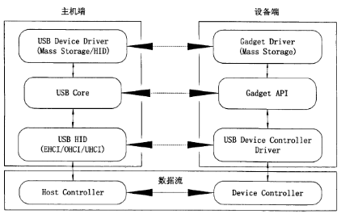
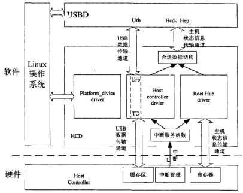
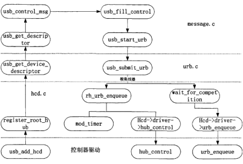
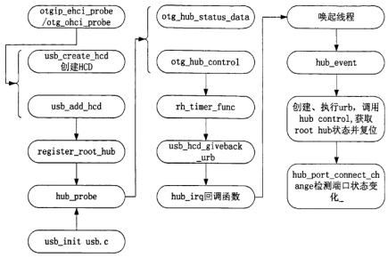
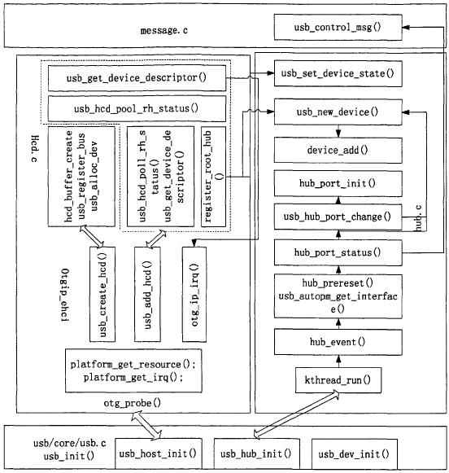

本文介绍了Siflower的USB驱动的流程

# 2. USB驱动

## 2.1. USB驱动目录结构

drivers/usb目录下有很多个子文件夹, 具体每个文件夹的介绍可参看该目录下的README文件. 对于SF19A2890来讲, 最重要的是core文件夹和dwc2文件夹, 其中core是USB驱动的核心代码, dwc2是USB Controller的驱动代码, 包含host和gadget两种模式. 

## 2.2. USB系统架构

下图是USB系统的拓扑图, 4个部分构成: USB主机控制器, 根集线器, 集线器, 设备. 其中Root Hub是一个虚拟的hub, 与USB主机控制器是绑定在一起的

图 1 USB系统拓扑图

通常情况下主机控制器的物理端口由一个虚拟的root hub来管理. 这个hub是有主机控制器(host controller)的设备驱动虚拟的, 用来统一管理总线拓扑, 因此USB子系统的驱动能够用同样的方法管理每个端口. 

USB通信都是由host端发起的. USB设备驱动程序分配并初始化一个URB发给USB Core,USB Core改一改, 发给USB主机控制器驱动, USB主机控制器驱动把它解析成包, 在总线上进行传送. 

USB Core是由内核实现的, 其实也就是把host control driver里的功能更集中的向上抽象了一层, 它是用来对最上层的USB设备驱动屏蔽掉host control的不同. 

USB通信最基本的形式是通过一个名为端点(endpoint)的东西. 它是真实存在的. 端点只能往一个方向传送数据(端点0除外, 端点0使用message管道, 它既可以IN又可以OUT), 或者IN, 或者OUT(前面已经介绍过). 除了端点0, 低速设备只能有2个端点, 高速设备也只能有15个IN端点和15个OUT端点. 主机和端点之间的数据传输是通过管道. 端点只有在device上才有, 协议说端点代表在主机和设备端点之间移动数据的能力. 
Linux系统下的usb部分分为四个部门或者叫做四大家族, 他们是host控制器驱动、hub驱动、usb core、设备类驱动, 他们共同配合着完成了对usb设备的访问操作. 

USB总线和USB设备使用软件进行抽象描述起来是非常复杂的, 一方面是协议使然, 一方面也是因为它们使用太广泛了, 抽象时考虑很太多情况. 幸运的是, 内核开发者们抽象出来的内核USB 子系统把很多复杂性都隐藏了. 
为了理解什么是USB子系统, 我们要做以下说明: 

1. USB 驱动都是跨kernel子系统的, 因为最终USB设备是要通过BLCOCK 或CHAR设备的方式呈现给我们的, 所以USB Driver之上还有一层. 
2. USB driver利用USB Core提供的API来简单优雅的完成驱动工作, 这里USB Core抽象了复杂的USB协议. 
3. 主机控制器驱动位于USB软件的最下层, 提供主机控制器硬件的抽象, 隐藏硬件的细节, 在主机控制器之下是物理的USB及所有与之连接的USB设备. 主机控制器驱动只和USB Core进行关联, USB Core将用户的请求映射到相关的主机控制器驱动, 从而使用户无需去访问主机控制器. 
4. USB Core和USB主机控制器驱动就构成了我们的USB子系统, USB Core负责实现一些核心的功能, 例如协议之类, 提供一个用于访问和控制USB硬件的接口, 使设备驱动不用去考虑系统当前使用哪种主机控制器. 自从有了USB子系统, 写USB驱动的时候, 只需要调用USB Core export的接口, 就几乎能完成所有工作. 
5. USB总线将USB设备和USB驱动关联起来. 

## 2.3. USB设备模型

众所周知, Linux系统里每个设备都对应一个`struct device`结构, 而在USB子系统里每一个USB实体设备还会衍生出N(N>=3)个`struct device`. 这是因为在USB子系统里, 除了USB设备本身对应了一个`struct device`之外, 这个设备的每个interface也会被当成一个`struct device`来对待, 并且每个endpoint也会对应一个`struct device`. 当然, 每个port也会对应一个`struct device`. 这几种设备类型之间的区别由结构体中的type变量来区分, 代码如下(`drivers/usb/core/usb.h`): 
```cpp
    extern struct device_type usb_device_type;
    extern struct device_type usb_if_device_type;
    extern struct device_type usb_ep_device_type;
    extern struct device_type usb_port_device_type;

    static inline int is_usb_device(const struct device *dev)
    {
        return dev->type == &usb_device_type;
    }

    static inline int is_usb_interface(const struct device *dev)
    {
        return dev->type == &usb_if_device_type;
    }

    static inline int is_usb_endpoint(const struct device *dev)
    {
    return dev->type == &usb_ep_device_type;
    }

    static inline int is_usb_port(const struct device *dev)
    {
        return dev->type == &usb_port_device_type;
    }
```
## 2.4. USB子系统初始化
USB子系统在运行之前会先进行初始化. USB初始化函数定义在`drivers/usb/core/usb.c`里: 
```cpp
    /*
     * Init
     */
    static int __init usb_init(void)
    {
        int retval;
        if (nousb) {
            pr_info("%s: USB support disabled\n", usbcore_name);
            return 0;
        }
        usb_init_pool_max();

        retval = usb_debugfs_init();
        if (retval)
            goto out;

        usb_acpi_register();
        retval = bus_register(&usb_bus_type);
        if (retval)
            goto bus_register_failed;
        retval = bus_register_notifier(&usb_bus_type, &usb_bus_nb);
        if (retval)
            goto bus_notifier_failed;
        retval = usb_major_init();
        if (retval)
            goto major_init_failed;
        retval = usb_register(&usbfs_driver);
        if (retval)
            goto driver_register_failed;
        retval = usb_devio_init();
        if (retval)
            goto usb_devio_init_failed;
        retval = usb_hub_init();
        if (retval)
            goto hub_init_failed;
        retval = usb_register_device_driver(&usb_generic_driver, THIS_MODULE);
        if (!retval)
            goto out;

        usb_hub_cleanup();
    hub_init_failed:
        usb_devio_cleanup();
    usb_devio_init_failed:
        usb_deregister(&usbfs_driver);
    driver_register_failed:
        usb_major_cleanup();
    major_init_failed:
        bus_unregister_notifier(&usb_bus_type, &usb_bus_nb);
    bus_notifier_failed:
        bus_unregister(&usb_bus_type);
    bus_register_failed:
        usb_acpi_unregister();
        usb_debugfs_cleanup();
    out:
        return retval;
    }
    ……
    subsys_initcall(usb_init);
```
### 2.4.1. usb_debugfs_init
DebugFS, 顾名思义, 是一种用于内核调试的虚拟文件系统, 内核开发者通过debugfs和用户空间交换数据. 类似的虚拟文件系统还有procfs和sysfs等, 这几种虚拟文件系统都并不实际存储在硬盘上, 而是Linux内核运行起来后, 执行`mount -t debugfs none /media/mmcblk0p2/` 才建立起来. 在/media/mmcblk0p2/目录下创建usb目录并在下面创建devices文件. 

当我们执行`cat devices`会调用`usbfs_devices_fops->read(usb_device_read)`函数去搜寻`usb_bus_list`链表下的usb设备信息, 也就是所有总线下的设备. 
### 2.4.2. bus_register
　　　是将usb总线注册到系统中, 总线可是linux设备模型中的领导者, 不管是多大的领导, 也是领导, 如PCI、USB、I2C, 即使他们在物理上有从属关系, 但是在模型的世界里, 都是总线, 拥有一样的待遇, 所以任何一个子系统只要管理自己的设备和驱动, 就需要向内核注册一个总线, 注册报到. 
### 2.4.3. bus_register_notifier
大多数内核子系统都是相互独立的, 因此某个子系统可能对其它子系统产生的事件感兴趣. 为了满足这个需求, 也即是让某个子系统在发生某个事件时通知其它的子系统, Linux内核提供了通知链的机制. 通知链表只能够在内核的子系统之间使用, 而不能够在内核与用户空间之间进行事件的通知. 

通知链表是一个函数链表, 链表上的每一个节点都注册了一个函数. 当某个事情发生时, 链表上所有节点对应的函数就会被执行. 所以对于通知链表来说有一个通知方与一个接收方. 在通知这个事件时所运行的函数由被通知方决定, 实际上也即是被通知方注册了某个函数, 在发生某个事件时这些函数就得到执行. 其实和系统调用signal的思想差不多. 

`bus_register->BLOCKING_INIT_NOTIFIER_HEAD(&priv->bus_notifier)`, 已经初始化了`usb_bus_type->p->bus_notifier`通过`blocking_notifier_chain_register`函数注册到通知链表. 

那什么时候usb总线收到通知呢?

- 当总线发现新的设备调用`device_add->blocking_notifier_call_chain(&dev->bus->p->bus_notifier, BUS_NOTIFY_ADD_DEVICE, dev)`

- 当总线卸载设备时调用`device_del->blocking_notifier_call_chain(&dev->bus->p->bus_notifier,BUS_NOTIFY_DEL_DEVICE, dev);`

则调用`usb_bus_nb`的回调成员函数`notifier_call(usb_bus_notify)`, 函数定义如下(drivers/usb/core/usb.c): 
```cpp
    /*
     * Notifications of device and interface registration
     */
    static int usb_bus_notify(struct notifier_block *nb, unsigned long action,
            void *data)
    {
        struct device *dev = data;

        switch (action) {
        case BUS_NOTIFY_ADD_DEVICE:
            if (dev->type == &usb_device_type)	//USB设备
                (void) usb_create_sysfs_dev_files(to_usb_device(dev));
            else if (dev->type == &usb_if_device_type)	//接口设备
                usb_create_sysfs_intf_files(to_usb_interface(dev));
            break;

        case BUS_NOTIFY_DEL_DEVICE:
            if (dev->type == &usb_device_type)
                usb_remove_sysfs_dev_files(to_usb_device(dev));
            else if (dev->type == &usb_if_device_type)
                usb_remove_sysfs_intf_files(to_usb_interface(dev));
            break;
        }
        return 0;
    }
```
### 2.4.4. usb_major_init
注册字符设备, 主设备号180.
### 2.4.5. usb_register(&usbfs_driver):
```cpp
    struct usb_driver usbfs_driver = {
        .name =		"usbfs",
        .probe =	driver_probe,
        .disconnect =	driver_disconnect,
        .suspend =	driver_suspend,
        .resume =	driver_resume,
    };
```
`usb_register->usb_register_driver()`:
```cpp
    /**
     * usb_register_driver - register a USB interface driver
     * @new_driver: USB operations for the interface driver
     * @owner: module owner of this driver.
     * @mod_name: module name string
     *
     * Registers a USB interface driver with the USB core.  The list of
     * unattached interfaces will be rescanned whenever a new driver is
     * added, allowing the new driver to attach to any recognized interfaces.
     *
     * Return: A negative error code on failure and 0 on success.
     *
     * NOTE: if you want your driver to use the USB major number, you must call
     * usb_register_dev() to enable that functionality.  This function no longer
     * takes care of that.
     */
    int usb_register_driver(struct usb_driver *new_driver, struct module *owner,
                const char *mod_name)
    {
        int retval = 0;

        if (usb_disabled())
            return -ENODEV;

        new_driver->drvwrap.for_devices = 0;
        new_driver->drvwrap.driver.name = new_driver->name;
        new_driver->drvwrap.driver.bus = &usb_bus_type;
        new_driver->drvwrap.driver.probe = usb_probe_interface;
        new_driver->drvwrap.driver.remove = usb_unbind_interface;
        new_driver->drvwrap.driver.owner = owner;
        new_driver->drvwrap.driver.mod_name = mod_name;
        spin_lock_init(&new_driver->dynids.lock);
        INIT_LIST_HEAD(&new_driver->dynids.list);

        retval = driver_register(&new_driver->drvwrap.driver);
        if (retval)
            goto out;

        retval = usb_create_newid_files(new_driver);
        if (retval)
            goto out_newid;

        pr_info("%s: registered new interface driver %s\n",
                usbcore_name, new_driver->name);

    out:
        return retval;

    out_newid:
        driver_unregister(&new_driver->drvwrap.driver);

        printk(KERN_ERR "%s: error %d registering interface "
                "	driver %s\n",
                usbcore_name, retval, new_driver->name);
        goto out;
    }
    EXPORT_SYMBOL_GPL(usb_register_driver);
```

这个函数是用来注册一个接口驱动到usb_bus上, 而无论是接口驱动还是设备驱动, 使用的都是`struct usb_driver`这一个结构体, 然后通过`drvwrap.for_devices`来具体区分. 所以在初始化的时候将`usbfs_driver`当做一个接口驱动注册进了`usb_bus`. 
同时这个函数还需要注意的就是`drvwrap.driver.probe = usb_probe_interface`, 这表明接口驱动在匹配成功之后都会先去调用`usb_probe_interface`这个函数, 这个函数在进行了一些必要的处理之后会去调用接口驱动真正的的probe函数, 并且会将传入的参数由`struct device`改为`struct usb_interface`和`struct usb_device_id`, 可以说是为了方便接口驱动的编写而存在的. 
### 2.4.6. usb_creat_newid_file
创建newid属性文件, 在/sys/bus/usb/drivers/usbfs下面可以看到此文件. 根据传入的id值增加一个新的动态USB驱动到驱动. 
### 2.4.7. usb_devio_init
注册字符设备, 主设备189.
### 2.4.8. usb_hub_init
drivers/usb/core/hub.c:
```cpp
    /* workqueue to process hub events */
    static struct workqueue_struct *hub_wq;
    ……
    static struct usb_driver hub_driver = {
        .name =		"hub",
        .probe =	hub_probe,
        .disconnect =	hub_disconnect,
        .suspend =	hub_suspend,
        .resume =	hub_resume,
        .reset_resume =	hub_reset_resume,
        .pre_reset =	hub_pre_reset,
        .post_reset =	hub_post_reset,
        .unlocked_ioctl = hub_ioctl,
        .id_table =	hub_id_table,
        .supports_autosuspend =	1,
    };

    int usb_hub_init(void)
    {
        if (usb_register(&hub_driver) < 0) {
            printk(KERN_ERR "%s: can't register hub driver\n",
                usbcore_name);
            return -1;
        }

        /*
         * The workqueue needs to be freezable to avoid interfering with
         * USB-PERSIST port handover. Otherwise it might see that a full-speed
         * device was gone before the EHCI controller had handed its port
         * over to the companion full-speed controller.
         */
        hub_wq = alloc_workqueue("usb_hub_wq", WQ_FREEZABLE, 0);
        if (hub_wq)
            return 0;

        /* Fall through if kernel_thread failed */
        usb_deregister(&hub_driver);
        pr_err("%s: can't allocate workqueue for usb hub\n", usbcore_name);

        return -1;
    }
```
`hub_init`首先将`hub_driver`作为接口驱动注册进`usb_bus`, 然后申请了一个`workqueue`, 而在`hub_probe`函数中有这么一行: `INIT_WORK(&hub->events, hub_event);`在`kick_hub_wq`中有这么一行: `if (queue_work(hub_wq, &hub->events))`, 因此`hub_wq`最终就是用来执行`hub_event()`这个函数的一个`workqueue`. `hub_event()`是用来监视hub状态的一个函数. 
### 2.4.9. usb_register_device_driver
和`usb_register_driver`类似, 除了`drvwrap.for_devices = 1`, 然后注册`drvwrap.driver`. probe函数为`usb_probe_device`, 这个函数就直接调用了设备驱动里的probe函数. 这一步将`usb_generic_driver`作为一个设备驱动注册进usb_bus.
```cpp
    struct usb_device_driver usb_generic_driver = {
        .name =	"usb",
        .probe = generic_probe,
        .disconnect = generic_disconnect,
    #ifdef	CONFIG_PM
        .suspend = generic_suspend,
        .resume = generic_resume,
    #endif
        .supports_autosuspend = 1,
    };
```
## 2.5. 驱动匹配过程
由上面的USB初始化过程我们可以知道USB的驱动被分为了设备驱动和接口驱动两大类(当然还有后面的host controller的驱动另说), 为了弄清代码的执行顺序, 我们需要先了解这么多probe是如何触发的. 
### 2.5.1. usb_bus_type
```cpp
    struct bus_type usb_bus_type = {
        .name =		"usb",
        .match =	usb_device_match,
        .uevent =	usb_uevent,
    };
```
在USB系统初始化的时候, 我们通过`bus_register(&usb_bus_type)`将usb_bus注册进了系统, 我们注意到usb_bus提供了一个match函数和一个uevent函数, 其中match函数会在任何设备或驱动被添加进该bus的时候被调用到uevent. 
当`device_add`函数被调用的时候, dev会被添加到bus的device list里, 然后会遍历bus的驱动链表, 并调用bus的match函数来用每一个driver对这个dev进行匹配, 如果match函数返回1,则表示匹配成功, 然后就会将driver指针指向这个driver, 然后调用这个driver的probe函数. 如果probe函数执行失败, 则会继续遍历bus的驱动链表, 寻找下一个match成功的驱动. 同理, 当有新的驱动添加进bus的时候, 就会遍历bus上的设备链表, 调用match函数来进行匹配. 
`usb_device_match`函数实现如下(drivers/usb/core/driver.c): 
```cpp
    static int usb_device_match(struct device *dev, struct device_driver *drv)
    {
        /* devices and interfaces are handled separately */
        if (is_usb_device(dev)) {

            /* interface drivers never match devices */
            if (!is_usb_device_driver(drv))
                return 0;

            /* TODO: Add real matching code */
            return 1;

        } else if (is_usb_interface(dev)) {
            struct usb_interface *intf;
            struct usb_driver *usb_drv;
            const struct usb_device_id *id;

            /* device drivers never match interfaces */
            if (is_usb_device_driver(drv))
                return 0;

            intf = to_usb_interface(dev);
            usb_drv = to_usb_driver(drv);

            id = usb_match_id(intf, usb_drv->id_table);
            if (id)
                return 1;

            id = usb_match_dynamic_id(intf, usb_drv);
            if (id)
                return 1;
        }

        return 0;
    }
```
由1.3节的介绍我们知道这个match函数只对`dev->type==&usb_device_type`或者`&usb_if_device_type`的设备才有可能匹配成功(返回值为1), 也就是只匹配USB设备和接口设备. 在USB系统初始化的时候, 我们注册了两个接口驱动(`usbfs_driver`和`hub_driver`)和一个设备驱动(`usb_generic_driver`), 其中`usbfs_driver`的probe函数直接返回-ENODEV, 因此有用的就是`hub_driver`和`usb_generic_driver`. 
当传入的是一个USB设备时, 只要驱动是设备驱动就会匹配上, 因此USB设备始终会与`usb_generic_driver`匹配上; 而对于接口设备来说, 只要驱动不是设备驱动, 就会调用`usb_match_id`及`usb_match_dynamic_id`来进行匹配id. 查看具体的match函数我们可以知道它是通过接口描述符和驱动的id table进行比较来match的. 
### 2.5.2. usb_generic_driver
当一个USB设备新添加进系统时, USB子系统会先对其进行读描述符然后设置地址, 然后调用`device_add`将其添加进系统, 此时触发usb_bus的match函数, 判断是一个USB设备, 匹配到`usb_generic_driver`, 调用`usb_probe_device`, 再调用`generic_probe`. USB设备的发现过程在后面会讲, 到`generic_probe`这一步设备已经是被分配好了地址的一个状态, 我们先看此时会发生什么. 
```cpp
    static int generic_probe(struct usb_device *udev)
    {
        int err, c;

        /* Choose and set the configuration.  This registers the interfaces
         * with the driver core and lets interface drivers bind to them.
         */
        if (udev->authorized == 0)
            dev_err(&udev->dev, "Device is not authorized for usage\n");
        else {
            c = usb_choose_configuration(udev);
            if (c >= 0) {
                err = usb_set_configuration(udev, c);
                if (err && err != -ENODEV) {
                    dev_err(&udev->dev, "can't set config #%d, error %d\n",
                        c, err);
                    /* This need not be fatal.  The user can try to
                     * set other configurations. */
                }
            }
        }
        /* USB device state == configured ... usable */
        usb_notify_add_device(udev);

        return 0;
    }
```
这个probe函数相对简单, 调用了两个函数`usb_choose_configuration`和`usb_set_configuration`. `usb_choose_configuration`函数就是根据预设的策略选择一个最合适的配置, 并返回配置号, 然后调用`usb_set_configuration`设置成该配置. 
```cpp
    int usb_set_configuration(struct usb_device *dev, int configuration)
    {
        int i, ret;
        struct usb_host_config *cp = NULL;
        struct usb_interface **new_interfaces = NULL;
        struct usb_hcd *hcd = bus_to_hcd(dev->bus);
        int n, nintf;

        //找到对应的config并赋值给cp
    ……
        if ((!cp && configuration != 0))
            return -EINVAL;

        /* The USB spec says configuration 0 means unconfigured.
         * But if a device includes a configuration numbered 0,
         * we will accept it as a correctly configured state.
         * Use -1 if you really want to unconfigure the device.
         */
        if (cp && configuration == 0)
            dev_warn(&dev->dev, "config 0 descriptor??\n");

        /* Allocate memory for new interfaces before doing anything else,
         * so that if we run out then nothing will have changed. */
        n = nintf = 0;
        if (cp) {
            //接口总数
            nintf = cp->desc.bNumInterfaces;
            //申请空间
            new_interfaces = kmalloc(nintf * sizeof(*new_interfaces),
                    GFP_NOIO);
            ……

            for (; n < nintf; ++n) {
                new_interfaces[n] = kzalloc(
                        sizeof(struct usb_interface),
                        GFP_NOIO);
                ……
            }

            i = dev->bus_mA - usb_get_max_power(dev, cp);
            ……
        }

        /* Wake up the device so we can send it the Set-Config request */
        ret = usb_autoresume_device(dev);
        if (ret)
            goto free_interfaces;

        /* if it's already configured, clear out old state first.
         * getting rid of old interfaces means unbinding their drivers.
         */
        if (dev->state != USB_STATE_ADDRESS)
            usb_disable_device(dev, 1);	/* Skip ep0 */

        /* Get rid of pending async Set-Config requests for this device */
        cancel_async_set_config(dev);

        /* Make sure we have bandwidth (and available HCD resources) for this
         * configuration.  Remove endpoints from the schedule if we're dropping
         * this configuration to set configuration 0.  After this point, the
         * host controller will not allow submissions to dropped endpoints.  If
         * this call fails, the device state is unchanged.
         */
        mutex_lock(hcd->bandwidth_mutex);
        /* Disable LPM, and re-enable it once the new configuration is
         * installed, so that the xHCI driver can recalculate the U1/U2
         * timeouts.
         */
        if (dev->actconfig && usb_disable_lpm(dev)) {
            ……
        }
        //alloc bandwidth用不到
        ……

        /*
         * Initialize the new interface structures and the
         * hc/hcd/usbcore interface/endpoint state.
         */
        for (i = 0; i < nintf; ++i) {
            ……
           intf->dev.parent = &dev->dev;
            intf->dev.driver = NULL;
            intf->dev.bus = &usb_bus_type;
            intf->dev.type = &usb_if_device_type;
            intf->dev.groups = usb_interface_groups;
            intf->dev.dma_mask = dev->dev.dma_mask;
            INIT_WORK(&intf->reset_ws, __usb_queue_reset_device);
            intf->minor = -1;
            device_initialize(&intf->dev);
           ……
        }
        kfree(new_interfaces);
        //控制传输, SET_CONFIGURATION
        ret = usb_control_msg(dev, usb_sndctrlpipe(dev, 0),
                      USB_REQ_SET_CONFIGURATION, 0, configuration, 0,
                      NULL, 0, USB_CTRL_SET_TIMEOUT);
        ……

        dev->actconfig = cp;
        mutex_unlock(hcd->bandwidth_mutex);

        ……
        //USB状态设置为CONFIGURED
        usb_set_device_state(dev, USB_STATE_CONFIGURED);

        if (cp->string == NULL &&
                !(dev->quirks & USB_QUIRK_CONFIG_INTF_STRINGS))
            cp->string = usb_cache_string(dev, cp->desc.iConfiguration);

        /* Now that the interfaces are installed, re-enable LPM. */
        usb_unlocked_enable_lpm(dev);
        /* Enable LTM if it was turned off by usb_disable_device. */
        usb_enable_ltm(dev);

        /* Now that all the interfaces are set up, register them
         * to trigger binding of drivers to interfaces.  probe()
         * routines may install different altsettings and may
         * claim() any interfaces not yet bound.  Many class drivers
         * need that: CDC, audio, video, etc.
         */
        for (i = 0; i < nintf; ++i) {
            struct usb_interface *intf = cp->interface[i];

            dev_dbg(&dev->dev,
                "adding %s (config #%d, interface %d)\n",
                dev_name(&intf->dev), configuration,
                intf->cur_altsetting->desc.bInterfaceNumber);
            device_enable_async_suspend(&intf->dev);
            ret = device_add(&intf->dev);
            if (ret != 0) {
                dev_err(&dev->dev, "device_add(%s) --> %d\n",
                    dev_name(&intf->dev), ret);
                continue;
            }
            create_intf_ep_devs(intf);
        }

        usb_autosuspend_device(dev);
        return 0;
    }
    EXPORT_SYMBOL_GPL(usb_set_configuration);
```
可以看到`usb_set_configuration`里会根据配置描述符中的接口数量对每个接口都配了一个设备, 且`dev.bus=&usb_bus_type`, `dev.type=&usb_if_device_type`, 然后在SET_CONFIGURATION完成之后, 调用`device_add`将这些接口设备添加到系统中, 这就会触发USB bus的match函数, 如果匹配到对应的接口驱动, 就会去调用相应的接口驱动的probe函数, 从而完成接口设备的添加. 
### 2.5.3. hub_driver
作为例子, 我们使用hub_driver来看接口驱动是如何匹配的. 
```cpp
    static const struct usb_device_id hub_id_table[] = {
        { .match_flags = USB_DEVICE_ID_MATCH_VENDOR
                | USB_DEVICE_ID_MATCH_INT_CLASS,
          .idVendor = USB_VENDOR_GENESYS_LOGIC,
          .bInterfaceClass = USB_CLASS_HUB,
          .driver_info = HUB_QUIRK_CHECK_PORT_AUTOSUSPEND},
        { .match_flags = USB_DEVICE_ID_MATCH_DEV_CLASS,
          .bDeviceClass = USB_CLASS_HUB},
        { .match_flags = USB_DEVICE_ID_MATCH_INT_CLASS,
          .bInterfaceClass = USB_CLASS_HUB},
        { }						/* Terminating entry */
    };

    MODULE_DEVICE_TABLE (usb, hub_id_table);

    static struct usb_driver hub_driver = {
        .name =		"hub",
        .probe =	hub_probe,
        .disconnect =	hub_disconnect,
        .suspend =	hub_suspend,
        .resume =	hub_resume,
        .reset_resume =	hub_reset_resume,
        .pre_reset =	hub_pre_reset,
        .post_reset =	hub_post_reset,
        .unlocked_ioctl = hub_ioctl,
        .id_table =	hub_id_table,
        .supports_autosuspend =	1,
    };
```
在bus->match里, `hub_driver`的`id_table`就是用来进行匹配的对象, 这个`id_table`会和接口设备的接口描述符进行比较, 看`id_table`里`match_flags`对应的需要比较的元素是否均一样, 如果都一样则匹配成功. 因此我们若要写USB device侧的接口描述符, 就需要先看host端对应的接口驱动的`id_table`, 才能保证返回的接口描述符能够匹配上对应的接口驱动. 我们可以看到hub的`id_table`除了第一个是罗技特有的以外, 另两个分别表示`DeviceClass`和`InterfaceClass`, 都是HUB类. 
当匹配成功之后, 先调用注册进bus的driver的probe, 即`hub_driver.drvwrap.driver.probe = usb_probe_interface`, 这个函数做了一些准备工作之后就去调用了接口驱动的probe函数, 即`hub_driver`对应的hub_probe:
```cpp
    static int hub_probe(struct usb_interface *intf, const struct usb_device_id *id)
    {
        struct usb_host_interface *desc;
        struct usb_endpoint_descriptor *endpoint;
        struct usb_device *hdev;
        struct usb_hub *hub;

        desc = intf->cur_altsetting;
        hdev = interface_to_usbdev(intf);
        ……
        if (hdev->level == MAX_TOPO_LEVEL) {
            dev_err(&intf->dev,
                "Unsupported bus topology: hub nested too deep\n");
            return -E2BIG;
        }

        ……
        /* Multiple endpoints? What kind of mutant ninja-hub is this? */
        if (desc->desc.bNumEndpoints != 1)
            goto descriptor_error;

        endpoint = &desc->endpoint[0].desc;

        /* If it's not an interrupt in endpoint, we'd better punt! */
        if (!usb_endpoint_is_int_in(endpoint))
            goto descriptor_error;

        /* We found a hub */
        dev_info (&intf->dev, "USB hub found\n");

        hub = kzalloc(sizeof(*hub), GFP_KERNEL);
        if (!hub) {
            dev_dbg (&intf->dev, "couldn't kmalloc hub struct\n");
            return -ENOMEM;
        }

        kref_init(&hub->kref);
        hub->intfdev = &intf->dev;
        hub->hdev = hdev;
        INIT_DELAYED_WORK(&hub->leds, led_work);
        INIT_DELAYED_WORK(&hub->init_work, NULL);
        INIT_WORK(&hub->events, hub_event);
        usb_get_intf(intf);
        usb_get_dev(hdev);

        usb_set_intfdata (intf, hub);
        intf->needs_remote_wakeup = 1;
        pm_suspend_ignore_children(&intf->dev, true);

        if (hdev->speed == USB_SPEED_HIGH)
            highspeed_hubs++;

        if (id->driver_info & HUB_QUIRK_CHECK_PORT_AUTOSUSPEND)
            hub->quirk_check_port_auto_suspend = 1;

        if (hub_configure(hub, endpoint) >= 0)
            return 0;

        hub_disconnect (intf);
        return -ENODEV;
    }
```
我们看到, `hub_probe`函数里就是针对hub这个interface来进行的特定操作(`Hub_probe`里最重要的就是`INIT_WORK`和`hub_configure`函数, 这两个函数的具体作用会在下面注册root_hub里讲到, 此处先略过), 当该函数成功返回之后, 就表明interface设备和interface驱动匹配上了. 再次回到`usb_set_configuration`函数里, 由一个for循环来对所有的interface都执行一次`device_add`, interface设备有可能能找到驱动, 也有可能找不到合适的驱动, 因此返回error之后使用的是continue来继续添加下一个, 而不是直接报错退出. 没有找到驱动的设备可以在有新驱动添加进系统的时候再次进行匹配. 当所有的interface设备都添加完成之后, `generic_probe`函数返回0, USB设备probe完成, 新设备添加完毕. 
## 2.6. USB Host Controller驱动
现在, 让我们回到子系统刚初始化完成的时候. 此时, usb_bus注册完成, 还有一个设备驱动`usb_generic_driver`和一个接口驱动`hub_driver`. 为了与别的USB设备进行通信, 我们还需要一个USB controller, 对于SF19A2890来说我们使用的是DesignWare USB 2.0 Hi-Speed On-The-Go, 一个可以在主从模式间进行切换的controller. 有了controller自然也要有对应的驱动, 其驱动位于drivers/usb/dwc2目录下, 这个驱动是一个platform_driver, 会在扫描设备树的时候进行匹配并执行对应的probe. 
### 2.6.1. dwc2_platform_driver
```cpp
    static const struct of_device_id dwc2_of_match_table[] = {
        { .compatible = "brcm,bcm2835-usb", .data = &params_bcm2835 },
        { .compatible = "rockchip,rk3066-usb", .data = &params_rk3066 },
        { .compatible = "snps,dwc2", .data = NULL },
        { .compatible = "samsung,s3c6400-hsotg", .data = NULL},
        { .compatible = "siflower,sfax8-usb", .data = &params_sfax8 },
        {},
    };
    MODULE_DEVICE_TABLE(of, dwc2_of_match_table);
    static struct platform_driver dwc2_platform_driver = {
        .driver = {
            .name = dwc2_driver_name,
            .of_match_table = dwc2_of_match_table,
            .pm = &dwc2_dev_pm_ops,
        },
        .probe = dwc2_driver_probe,
        .remove = dwc2_driver_remove,
    };

    module_platform_driver(dwc2_platform_driver);
```
这个驱动的probe函数除了常规的从设备树中取出所需数据之外, 还做了`lowlevel_hw_init`以及分析硬件参数. `Dwc2_of_match_table`里的data参数也是用来提供硬件参数的. Gadget模式下的DMA enable好像只能通过`params_sfax8`来开启, 所以这个参数好像也无法去掉, 否则可以直接使用从硬件里读出的数据. 硬件参数读取之后又用`dwc2_set_parameters(hsotg, params);`来将`hsotg->core_params`设置为合适的值. 然后重点在于`dwc2_gadget_init(hsotg, irq)`和`dwc2_hcd_init(hsotg, irq)`这两个函数, 其中第一个函数实现了gadget模式的驱动初始化工作, 第二个函数实现了host模式的驱动初始化工作. 
### 2.6.2. dwc2_hcd_init
```cpp
    /*
     * Initializes the HCD. This function allocates memory for and initializes the
     * static parts of the usb_hcd and dwc2_hsotg structures. It also registers the
     * USB bus with the core and calls the hc_driver->start() function. It returns
     * a negative error on failure.
     */
    int dwc2_hcd_init(struct dwc2_hsotg *hsotg, int irq)
    {
        struct usb_hcd *hcd;
        struct dwc2_host_chan *channel;
        u32 hcfg;
        int i, num_channels;
        int retval;
        ……
        hcd = usb_create_hcd(&dwc2_hc_driver, hsotg->dev, dev_name(hsotg->dev));
        ……
        /*
         * Disable the global interrupt until all the interrupt handlers are
         * installed
         */
        dwc2_disable_global_interrupts(hsotg);

        /* Initialize the DWC_otg core, and select the Phy type */
        retval = dwc2_core_init(hsotg, true, irq);
        ……
        /* Create new workqueue and init work */
        retval = -ENOMEM;
        hsotg->wq_otg = create_singlethread_workqueue("dwc2");
        if (!hsotg->wq_otg) {
            dev_err(hsotg->dev, "Failed to create workqueue\n");
            goto error2;
        }
        INIT_WORK(&hsotg->wf_otg, dwc2_conn_id_status_change);

        setup_timer(&hsotg->wkp_timer, dwc2_wakeup_detected,
                (unsigned long)hsotg);

        /* Initialize the non-periodic schedule */
        ……
        /* Initialize the periodic schedule */
        ……
        /*
         * Create a host channel descriptor for each host channel implemented
         * in the controller. Initialize the channel descriptor array.
         */
        ……
        /* Initialize hsotg start work */
        INIT_DELAYED_WORK(&hsotg->start_work, dwc2_hcd_start_func);

        /* Initialize port reset work */
        INIT_DELAYED_WORK(&hsotg->reset_work, dwc2_hcd_reset_func);
        ……
        /*
         * Finish generic HCD initialization and start the HCD. This function
         * allocates the DMA buffer pool, registers the USB bus, requests the
         * IRQ line, and calls hcd_start method.
         */
        retval = usb_add_hcd(hcd, irq, IRQF_SHARED);
        ……
        return 0;
        ……
    }
```
在`dwc2_hcd_init`里面, 先调用`usb_create_hcd`创建了`dwc2_hc_driver`对应的`usb_hcd`, 然后对core进行初始化, 最后调用`usb_add_hcd`将hcd添加进系统并开始运行. 
`usb_create_hcd->usb_create_shared_hcd`里对结构体的必要字段进行了初始化, 然后设置了一个timer: drivers/usb/core/hcd.c +2476
```cpp
　　　	init_timer(&hcd->rh_timer);
　　　	hcd->rh_timer.function = rh_timer_func;
　　　	hcd->rh_timer.data = (unsigned long) hcd;
```
这个timer其实是给root hub用的, 具体是怎么使用的在下面`register_root_hub`里会看到. 
创建完hcd之后, dwc2还初始化了很多WORK, 这是由于controller的很多操作都比较费时间, 因此使用workqueue来安排这些工作以最大化系统使用效率且避免占用CPU太多时间. 
### 2.6.3. usb_add_hcd
```cpp
    /**
     * usb_add_hcd - finish generic HCD structure initialization and register
     * @hcd: the usb_hcd structure to initialize
     * @irqnum: Interrupt line to allocate
     * @irqflags: Interrupt type flags
     *
     * Finish the remaining parts of generic HCD initialization: allocate the
     * buffers of consistent memory, register the bus, request the IRQ line,
     * and call the driver's reset() and start() routines.
     */
    int usb_add_hcd(struct usb_hcd *hcd,
            unsigned int irqnum, unsigned long irqflags)
    {
        int retval;
        struct usb_device *rhdev;
        ……
        /* authorized_default定义在drivers/usb/core/hcd.c+367, 是一个static
        * 的全局变量, 默认值为-1
        */
        /* Keep old behaviour if authorized_default is not in [0, 1]. */
        if (authorized_default < 0 || authorized_default > 1)
            hcd->authorized_default = hcd->wireless ? 0 : 1;
        else
            hcd->authorized_default = authorized_default;
        set_bit(HCD_FLAG_HW_ACCESSIBLE, &hcd->flags);

        /* HC is in reset state, but accessible.  Now do the one-time init,
         * bottom up so that hcds can customize the root hubs before hub_wq
         * starts talking to them.  (Note, bus id is assigned early too.)
         */
        if ((retval = hcd_buffer_create(hcd)) != 0) {
            dev_dbg(hcd->self.controller, "pool alloc failed\n");
            goto err_create_buf;
        }
        //分配bus number, 并将usb_bus添加到usb_bus_list中
        if ((retval = usb_register_bus(&hcd->self)) < 0)
            goto err_register_bus;
        //申请root hub设备
        if ((rhdev = usb_alloc_dev(NULL, &hcd->self, 0)) == NULL) {
            dev_err(hcd->self.controller, "unable to allocate root hub\n");
            retval = -ENOMEM;
            goto err_allocate_root_hub;
        }
        mutex_lock(&usb_port_peer_mutex);
        hcd->self.root_hub = rhdev;
        mutex_unlock(&usb_port_peer_mutex);
        ……
        hcd->rh_pollable = 1;

        /* NOTE: root hub and controller capabilities may not be the same */
        if (device_can_wakeup(hcd->self.controller)
                && device_can_wakeup(&hcd->self.root_hub->dev))
            dev_dbg(hcd->self.controller, "supports USB remote wakeup\n");

        /* initialize tasklets */
        init_giveback_urb_bh(&hcd->high_prio_bh);
        init_giveback_urb_bh(&hcd->low_prio_bh);

        /* enable irqs just before we start the controller,
         * if the BIOS provides legacy PCI irqs.
         */
        if (usb_hcd_is_primary_hcd(hcd) && irqnum) {
            retval = usb_hcd_request_irqs(hcd, irqnum, irqflags);
            if (retval)
                goto err_request_irq;
        }

        hcd->state = HC_STATE_RUNNING;
        retval = hcd->driver->start(hcd);
        if (retval < 0) {
            dev_err(hcd->self.controller, "startup error %d\n", retval);
            goto err_hcd_driver_start;
        }

        /* starting here, usbcore will pay attention to this root hub */
        //注册root hub
        if ((retval = register_root_hub(hcd)) != 0)
            goto err_register_root_hub;

        retval = sysfs_create_group(&rhdev->dev.kobj, &usb_bus_attr_group);
        if (retval < 0) {
            printk(KERN_ERR "Cannot register USB bus sysfs attributes: %d\n",
                   retval);
            goto error_create_attr_group;
        }
        if (hcd->uses_new_polling && HCD_POLL_RH(hcd))
            usb_hcd_poll_rh_status(hcd);

        return retval;
    ……
    }
    EXPORT_SYMBOL_GPL(usb_add_hcd);
```
注意这个函数里有一个`usb_register_bus`, 这个函数注册的是`struct usb_bus`, 用来表示设备的树状结构, 每个host controller都可表示为一个`usb_bus`, 其余设备以树状形式连接到这个bus上. 这个bus和之前系统初始化时的`bus_register`的bus是两个东西, `bus_register`注册的是`struct bus_type`, 表示linux设备模型中的一个类型, 用来将同一类型的device和driver联系起来. 
`usb_alloc_dev`是hub用来申请新USB设备时使用的, 创建root hub时也能用这个函数. 这个函数会申请一个新的usb_device, 将dev的bus设为`usb_bus_type`, type设为`usb_device_type`, 然后设置endpoint0的描述符, 最后返回指向这个usb_device的指针. 从这我们可以知道root hub其实是一个虚拟的设备. 
`hcd->driver->start=_dwc2_hcd_start`, 这个函数初始化controller和root hub, 并做好host模式的初始化操作, 该函数成功返回后就可进行host模式的操作了. 
然后会把root hub注册进系统, 完成之后整个驱动的probe过程就算结束了, 可以开始进行正常的USB操作了. 
## 2.7. Root Hub
### 2.7.1. register_root_hub
```cpp
    static int register_root_hub(struct usb_hcd *hcd)
    {
        struct device *parent_dev = hcd->self.controller;
        struct usb_device *usb_dev = hcd->self.root_hub;
        const int devnum = 1;
        int retval;
        //root hub的设备地址始终为1
        usb_dev->devnum = devnum;
        usb_dev->bus->devnum_next = devnum + 1;
        memset (&usb_dev->bus->devmap.devicemap, 0,
                sizeof usb_dev->bus->devmap.devicemap);
        set_bit (devnum, usb_dev->bus->devmap.devicemap);
        usb_set_device_state(usb_dev, USB_STATE_ADDRESS);

        mutex_lock(&usb_bus_list_lock);
        //读设备描述符
        usb_dev->ep0.desc.wMaxPacketSize = cpu_to_le16(64);
        retval = usb_get_device_descriptor(usb_dev, USB_DT_DEVICE_SIZE);
        if (retval != sizeof usb_dev->descriptor) {
            mutex_unlock(&usb_bus_list_lock);
            dev_dbg (parent_dev, "can't read %s device descriptor %d\n",
                    dev_name(&usb_dev->dev), retval);
            return (retval < 0) ? retval : -EMSGSIZE;
        }
        if (usb_dev->speed == USB_SPEED_SUPER) {
            ……
        }
        //进行设备初始化设置
        retval = usb_new_device (usb_dev);
        if (retval) {
            dev_err (parent_dev, "can't register root hub for %s, %d\n",
                    dev_name(&usb_dev->dev), retval);
        } else {
            spin_lock_irq (&hcd_root_hub_lock);
            hcd->rh_registered = 1;
            spin_unlock_irq (&hcd_root_hub_lock);

            /* Did the HC die before the root hub was registered? */
            if (HCD_DEAD(hcd))
                usb_hc_died (hcd);	/* This time clean up */
        }
        mutex_unlock(&usb_bus_list_lock);

        return retval;
    }
```
这个函数首先读取了root hub的设备描述符, 这个描述符定义在drivers/usb/core/hcd.c里, 该文件还包含root hub的其他几种描述符. 既然root hub是一个虚拟设备, 那么它的描述符是怎么读的呢?其实读取root hub的上层函数和其余设备一样, 只是到了`usb_hcd_submit_urb()`这一步之后, 里面有一个判断: 
```cpp
        if (is_root_hub(urb->dev)) {
            status = rh_urb_enqueue(hcd, urb);
        } else {
            status = map_urb_for_dma(hcd, urb, mem_flags);
            if (likely(status == 0)) {
                status = hcd->driver->urb_enqueue(hcd, urb, mem_flags);
                if (unlikely(status))
                    unmap_urb_for_dma(hcd, urb);
            }
        }
```
表明root hub的transfer和其它设备的transfer完全不一样. 如果是root hub就直接去调用`rh_urb_enqueue`, 否则就用controller的`urb_enqueue`函数. 去看一下`rh_urb_enqueue`这个函数就很容易知道root hub的描述符是如何返回的. 
### 2.7.2. usb_new_device
设备描述符读完之后会调用`usb_new_device`函数, 传进去的`usb_dev`就是root_hub对应的设备: 
```cpp
    /**
     * usb_new_device - perform initial device setup (usbcore-internal)
     * @udev: newly addressed device (in ADDRESS state)
     *
     * This is called with devices which have been detected but not fully
     * enumerated.  The device descriptor is available, but not descriptors
     * for any device configuration.  The caller must have locked either
     * the parent hub (if udev is a normal device) or else the
     * usb_bus_list_lock (if udev is a root hub).  The parent's pointer to
     * udev has already been installed, but udev is not yet visible through
     * sysfs or other filesystem code.
     *
     * This call is synchronous, and may not be used in an interrupt context.
     *
     * Only the hub driver or root-hub registrar should ever call this.
     *
     * Return: Whether the device is configured properly or not. Zero if the
     * interface was registered with the driver core; else a negative errno
     * value.
     *
     */
    int usb_new_device(struct usb_device *udev)
    {
        int err;
        ……
        //读取所有的描述符
        err = usb_enumerate_device(udev);	/* Read descriptors */
        ……
        /* export the usbdev device-node for libusb */
        udev->dev.devt = MKDEV(USB_DEVICE_MAJOR,
                (((udev->bus->busnum-1) * 128) + (udev->devnum-1)));

        /* Tell the world! */
        announce_device(udev);
        ……
        /* Register the device.  The device driver is responsible
         * for configuring the device and invoking the add-device
         * notifier chain (used by usbfs and possibly others).
         */
        err = device_add(&udev->dev);
        if (err) {
            dev_err(&udev->dev, "can't device_add, error %d\n", err);
            goto fail;
        }

        /* Create link files between child device and usb port device. */
        ……
        (void) usb_create_ep_devs(&udev->dev, &udev->ep0, udev);
        usb_mark_last_busy(udev);
        pm_runtime_put_sync_autosuspend(&udev->dev);
        return err;
        ……
    }
```
到这一步, root hub的设备描述符已经得到了, 但是还有设置描述符, `usb_enumerate_device`会先读取完整的设置描述符(包括接口描述符和端点描述符), 然后会继续读字符串描述符. 读完之后放在`struct usb_device`的对应地方. 然后直接调用`device_add`将设备添加进系统. 
根据之前的分析, 当`device_add`被调用的时候, 系统会调用bus的match函数, 由于我们之前将root hub的type赋值为`usb_device_type`, 因此match的时候就会和`usb_generic_driver`匹配上, 然后去调用`generic_probe`, 由`usb_choose_configuration`和`usb_set_configuration`完成后续设置. 
从root hub的设置描述符中我们可以知道root hub只有一个interface和一个endpoint, 因此在`usb_set_configuration`里这个interface会匹配到`hub_driver`并执行`hub_probe`. 
`hub_probe`里有两个需要注意的地方, 一个是`INIT_WORK(&hub->events, hub_event)`, 一个是`hub_configure(hub, endpoint)`. 首先, `INIT_WORK`把`hub->events`初始化成`hub_event`, 我们再去看一下`hub_event`这个函数, 发现是用来处理port/hub status change的一个函数, 那么这个函数什么时候会被调到呢?答案在`hub_configure`这个函数里. 
### 2.7.3. hub_configure
```cpp
    static int hub_configure(struct usb_hub *hub,
        struct usb_endpoint_descriptor *endpoint)
    {
        ……
        /* Request the entire hub descriptor.
         * hub->descriptor can handle USB_MAXCHILDREN ports,
         * but the hub can/will return fewer bytes here.
         */
        //这个描述符是在drivers/usb/dwc2/hcd.c里的dwc2_hcd_hub_control
    　　//函数里返回的
        ret = get_hub_descriptor(hdev, hub->descriptor);
        ……
        switch (wHubCharacteristics & HUB_CHAR_LPSM) {
        case HUB_CHAR_COMMON_LPSM:
            dev_dbg(hub_dev, "ganged power switching\n");
            break;
            ……
        }

        switch (wHubCharacteristics & HUB_CHAR_OCPM) {
        ……
        case HUB_CHAR_INDV_PORT_OCPM:
            dev_dbg(hub_dev, "individual port over-current protection\n");
            break;
        ……
        }

        spin_lock_init (&hub->tt.lock);
        INIT_LIST_HEAD (&hub->tt.clear_list);
        INIT_WORK(&hub->tt.clear_work, hub_tt_work);
        switch (hdev->descriptor.bDeviceProtocol) {
        case USB_HUB_PR_FS:
            break;
        ……
        }
        ……
        /* power budgeting mostly matters with bus-powered hubs,
         * and battery-powered root hubs (may provide just 8 mA).
         */
        ……
        //hubstatus和hubchange返回值永远是0
        ret = hub_hub_status(hub, &hubstatus, &hubchange);
        ……

        /* set up the interrupt endpoint
         * We use the EP's maxpacket size instead of (PORTS+1+7)/8
         * bytes as USB2.0[11.12.3] says because some hubs are known
         * to send more data (and thus cause overflow). For root hubs,
         * maxpktsize is defined in hcd.c's fake endpoint descriptors
         * to be big enough for at least USB_MAXCHILDREN ports. */
        pipe = usb_rcvintpipe(hdev, endpoint->bEndpointAddress);
        maxp = usb_maxpacket(hdev, pipe, usb_pipeout(pipe));

        if (maxp > sizeof(*hub->buffer))
            maxp = sizeof(*hub->buffer);

        hub->urb = usb_alloc_urb(0, GFP_KERNEL);
        ……

        usb_fill_int_urb(hub->urb, hdev, pipe, *hub->buffer, maxp, hub_irq,
            hub, endpoint->bInterval);

        /* maybe cycle the hub leds */
        if (hub->has_indicators && blinkenlights)
            hub->indicator[0] = INDICATOR_CYCLE;
        //注册port设备
        mutex_lock(&usb_port_peer_mutex);
        for (i = 0; i < maxchild; i++) {
            ret = usb_hub_create_port_device(hub, i + 1);
            ……
        }
        hdev->maxchild = i;
        ……

        mutex_unlock(&usb_port_peer_mutex);
        if (ret < 0)
            goto fail;

        /* Update the HCD's internal representation of this hub before hub_wq
         * starts getting port status changes for devices under the hub.
         */
        if (hcd->driver->update_hub_device) {
            ……
        }

        usb_hub_adjust_deviceremovable(hdev, hub->descriptor);

        hub_activate(hub, HUB_INIT);
        return 0;
    　　……
    }
```
这个函数给hub->urb设置成了一个中断传输, 且传输完成之后的回调函数设置为`hub_irq`. 最后调用`hub_activate`来激活hub. `hub_activate`函数是一个分段初始化hub的函数, 使用workqueue来进行不同的初始化阶段, 目的是推迟hub初始化动作, 加快系统启动速度. 前两段INIT比较清晰, 主要看INIT3: 
```cpp
     init3:
        hub->quiescing = 0;

        status = usb_submit_urb(hub->urb, GFP_NOIO);
        if (status < 0)
            dev_err(hub->intfdev, "activate --> %d\n", status);
        if (hub->has_indicators && blinkenlights)
            queue_delayed_work(system_power_efficient_wq,
                    &hub->leds, LED_CYCLE_PERIOD);

        /* Scan all ports that need attention */
        kick_hub_wq(hub);

        /* Allow autosuspend if it was suppressed */
        if (type <= HUB_INIT3)
            usb_autopm_put_interface_async(to_usb_interface(hub->intfdev));
```
这里首先用`usb_submit_urb`来发送刚才填充好的终端urb, 然后调用了`kick_hub_wq`. 我们先来看一下`submit_urb`时会发生什么. 
### 2.7.4. rh_queue_status
跟随`usb_submit_urb`的调用过程我们可以找到对于`root_hub`的中断urb, 最终是调用到了`rh_queue_status`这个函数: 
```cpp
    static int rh_queue_status (struct usb_hcd *hcd, struct urb *urb)
    {
        ……
        retval = usb_hcd_link_urb_to_ep(hcd, urb);
        if (retval)
            goto done;

        hcd->status_urb = urb;
        urb->hcpriv = hcd;	/* indicate it's queued */
        if (!hcd->uses_new_polling)
            mod_timer(&hcd->rh_timer, (jiffies/(HZ/4) + 1) * (HZ/4));

        /* If a status change has already occurred, report it ASAP */
        else if (HCD_POLL_PENDING(hcd))
            mod_timer(&hcd->rh_timer, jiffies);
        retval = 0;
     done:
        spin_unlock_irqrestore (&hcd_root_hub_lock, flags);
        return retval;
    }
```
可以看到这个函数虽然是root hub中断传输时最终调用到的, 但是它并没有任何的数据传输, 而是调用`mod_timer`把`hcd->rh_timer`的到期时间改了, 而    `hcd->rh_timer=rh_timer_func=usb_hcd_poll_rh_status`, 
```cpp
    /*
     * Root Hub interrupt transfers are polled using a timer if the
     * driver requests it; otherwise the driver is responsible for
     * calling usb_hcd_poll_rh_status() when an event occurs.
     *
     * Completions are called in_interrupt(), but they may or may not
     * be in_irq().
     */
    void usb_hcd_poll_rh_status(struct usb_hcd *hcd)
    {
        struct urb	*urb;
        int		length;
        unsigned long	flags;
        char		buffer[6];	/* Any root hubs with > 31 ports? */

        if (unlikely(!hcd->rh_pollable))
            return;
        if (!hcd->uses_new_polling && !hcd->status_urb)
            return;

        length = hcd->driver->hub_status_data(hcd, buffer);
        if (length > 0) {

            /* try to complete the status urb */
            spin_lock_irqsave(&hcd_root_hub_lock, flags);
            urb = hcd->status_urb;
            if (urb) {
                clear_bit(HCD_FLAG_POLL_PENDING, &hcd->flags);
                hcd->status_urb = NULL;
                urb->actual_length = length;
                memcpy(urb->transfer_buffer, buffer, length);

                usb_hcd_unlink_urb_from_ep(hcd, urb);
                usb_hcd_giveback_urb(hcd, urb, 0);
            } else {
                length = 0;
                set_bit(HCD_FLAG_POLL_PENDING, &hcd->flags);
            }
            spin_unlock_irqrestore(&hcd_root_hub_lock, flags);
        }

        /* The USB 2.0 spec says 256 ms.  This is close enough and won't
         * exceed that limit if HZ is 100. The math is more clunky than
         * maybe expected, this is to make sure that all timers for USB devices
         * fire at the same time to give the CPU a break in between */
        if (hcd->uses_new_polling ? HCD_POLL_RH(hcd) :
                (length == 0 && hcd->status_urb != NULL))
            mod_timer (&hcd->rh_timer, (jiffies/(HZ/4) + 1) * (HZ/4));
    }
    EXPORT_SYMBOL_GPL(usb_hcd_poll_rh_status);
```
这样当`hub_status_data`返回0时, `hcd->rh_timer`每秒会触发4次, 这就是正常情况下root hub检测hub状态的过程. 
如果port状态有变化, 那么在dwc2的中断处理函数里面就会把`hsotg->flags`相应位置1, 然后`hcd->driver->hub_status_data=_dwc2_hcd_hub_status_data`:
```cpp
    /*
     * Creates Status Change bitmap for the root hub and root port. The bitmap is
     * returned in buf. Bit 0 is the status change indicator for the root hub. Bit 1
     * is the status change indicator for the single root port. Returns 1 if either
     * change indicator is 1, otherwise returns 0.
     */
    static int _dwc2_hcd_hub_status_data(struct usb_hcd *hcd, char *buf)
    {
        struct dwc2_hsotg *hsotg = dwc2_hcd_to_hsotg(hcd);

        buf[0] = dwc2_hcd_is_status_changed(hsotg, 1) << 1;
        return buf[0] != 0;
    }
```
`dwc2_hcd_is_status_changed`返回值就是`hsotg->flags`里port状态对应的值, 因此buf[0]是port0的change bitmap, `hub_status_data`返回值也就变成了1, `usb_hcd_poll_rh_status`里length不为0, 调用到`usb_hcd_giveback_urb`, 把urb添加到hcd->*_prio_bh里, 再用`tasklet_hi_schedule`执行, hcd->*_prio_bh在前面usb_add_hcd里被初始化, 对应的函数是`usb_giveback_urb_bh`, 这个函数会调用`urb->complete`, 也就是`hub_irq`, `hub_irq`在进行错误处理之后又调用了`kick_hub_wq`, 来对hub events进行真正的处理. 
### 2.7.5. hub_event
`kick_hub_wq`里真正做的事情只有一件, 就是`queue_work(hub_wq, &hub->events)`, 前面在`hub_probe`里使用`INIT_WORK(&hub->events, hub_event)`将`hub->events`初始化为了`hub_event`函数, 因此`kick_hub_wq`时就会调用到`hub_event`: 
```cpp
    static void hub_event(struct work_struct *work)
    {
        ……
        /* Lock the device, then check to see if we were
         * disconnected while waiting for the lock to succeed. */
        usb_lock_device(hdev);
        if (unlikely(hub->disconnected))
            goto out_hdev_lock;

        /* If the hub has died, clean up after it */
        ……
        /* Autoresume */
        ……
        /* If this is an inactive hub, do nothing */
        ……
        if (hub->error) {
            ……
        }

        /* deal with port status changes */
        for (i = 1; i <= hdev->maxchild; i++) {
            struct usb_port *port_dev = hub->ports[i - 1];

            if (test_bit(i, hub->event_bits)
                    || test_bit(i, hub->change_bits)
                    || test_bit(i, hub->wakeup_bits)) {
                /*
                 * The get_noresume and barrier ensure that if
                 * the port was in the process of resuming, we
                 * flush that work and keep the port active for
                 * the duration of the port_event().  However,
                 * if the port is runtime pm suspended
                 * (powered-off), we leave it in that state, run
                 * an abbreviated port_event(), and move on.
                 */
                pm_runtime_get_noresume(&port_dev->dev);
                pm_runtime_barrier(&port_dev->dev);
                usb_lock_port(port_dev);
                port_event(hub, i);
                usb_unlock_port(port_dev);
                pm_runtime_put_sync(&port_dev->dev);
            }
        }

        /* deal with hub status changes */
        ……

    out_autopm:
        /* Balance the usb_autopm_get_interface() above */
        usb_autopm_put_interface_no_suspend(intf);
    out_hdev_lock:
        usb_unlock_device(hdev);

        /* Balance the stuff in kick_hub_wq() and allow autosuspend */
        usb_autopm_put_interface(intf);
        kref_put(&hub->kref, hub_release);
    }
```
`hub_event`会先对每个port调用`port_event`处理port status change, 然后再处理hub status change, 对root hub来说不存在hub status change. `port_event`里面对针对port不同的情况进行不同的处理, 如果有connect_change就会用`hub_port_connect_change->hub_port_connect`来进行新设备的处理, 里面也是先后用了`usb_alloc_dev`和`usb_new_device`, 至此, 就重复之前添加新设备的过程, 完成新设备的添加. 
# 3. 总结
USB驱动架构如下图所示: 

图 2 USB驱动结构图
## 3.1. USB主机端驱动


图 3 主机驱动架构

　　　 USB核心(USBD)是整个USB驱动的核心部分, 从上图可知, 一方面USBD对接收到USB主机控制器的数据进行处理, 并传递给上层的设备端驱动软件; 同时也接收来自上层的非USB格式数据流, 进行相应的数据处理后传递给USB主机控制器驱动. 


图 4 主机驱动调度流程

USB数据传输都以URB(USB Request Block)请求、URB生成、URB递交、URB释放为主线. 从上图可知, 当加载控制器驱动之后, 注册根据集线器, hub和hcd驱动成为一个整体. 接着, 主机通过控制传输获取设备的控制描述符等信息, 接着详述整个控制传输的流程. `usb_submit_urb`依据是否连接到根集线器来决定调用`urb_enqueue`或`rh_urb_enqueue`函数. 

USB从设备通过集线器或根集线器连接到USB主机上. 比如: 主机通过根集线器与外界进行数据交互, 根集线器通过探测数据线状态的变化来通知USB主机是否有USB外围设备接入. 
在主机端控制器驱动加载的过程中, 注册了根集线器, 然后匹配了相应的hub驱动程序, 同时完成了对Hub的轮询函数和状态处理函数的设置. 这样, 一旦hub集线器的状态发生变化, 就会产生相应的中断, 主机端控制器就会执行相应的中断处理函数, 下图为hub驱动程序的流程图. 

图 5 集线器驱动注册流程

USB Core中的`usb_init()`函数中完成了对hub线程(`hub_wq`, 在`usb_hub_init`函数中真正地创建)的创建, 然后完成相应设备的探测. 主机端控制器驱动进行探测时, 将hub驱动和主机端控制器驱动结合在一起, 相互之间完成调用.  相对于大容量存储设备与主机之间通过控制/批量传输, 集线器与主机之间通过中断/控制方式完成数据交互. 
## 3.2. USB初始化过程
 USB驱动作为一个系统, 集成了众多的驱动模块, 注册过程非常复杂. 从USB系统的角度来说, USB主机驱动主要包含: 
1. USB核驱动
2. 主机控制器驱动
3. 集线器驱动

驱动的加载执行流程如下图所示: 



图 6 USB初始化过程

### 3.2.1. USB Core的初始化
 USB驱动从USB子系统的初始化开始, USB子系统的初始化在文件driver/usb/core/usb.c
```cpp
    subsys_initcall(usb_init);
    module_exit(usb_exit);
```
`subsys_initcall()`是一个宏, 可以理解为`module_init()`. 由于此部分代码非常重要, 开发者把它看作一个子系统, 而不仅仅是一个模块. USB Core这个模块代表的不是某一个设备, 而是所有USB设备赖以生存的模块. 在Linux中, 像这样一个类别的设备驱动被归结为一个子系统. `subsys_initcall(usb_init)`告诉我们, `usb_init`才是真正的初始化函数, 而`usb_exit`将是整个USB子系统结束时的清理函数. 
### 3.2.2. 注册集线器
```cpp
    register_root_hub(hcd);
```
在USB系统驱动加载的过程中, 创建了集线器的线程(`hub_wq`), 并且一直查询相应的线程事务. HCD驱动中, 将集线器作为一个设备添加到主机控制器驱动中, 然后进行集线器端口的初始化. 在USB主机看来, 根集线器本身也是USB主机的设备. USB主机驱动加载完成之后, 即开始注册根集线器, 并且作为一个设备加载到主机驱动之中. 
USB主机和USB设备之间进行数据交互, USB设备本身并没有总线控制权, U盘被动地接收USB主机发送过来的信息并做出响应. USB主机控制器与根集线器构成了主机系统, 然后外接其它的USB设备. 
为了更好地探测到根集线器的状态变化, USB主机控制器驱动增加了状态轮询函数, 以一定的时间间隔轮询根集线器状态是否发生变化. 一旦根集线器状态发生变化, 主机控制器就会产生相应的响应. 
USB主机和USB设备之间的数据传输以URB(USB Request Block)的形式进行. 

## 3.3. URB传输过程
USB初始化过程中, 无论是主机控制器驱动还是根集线器驱动, 都是通过URB传输获取设备信息. 
### 3.3.1. 申请URB
```cpp
    struct urb *usb_alloc_urb(int iso_packets, gfp_t mem_flags)
```
为urb分配内存并执行初始化. 
### 3.3.2. 初始化URB
初始化具体的urb包
```cpp
    static inline void usb_fill_control_urb(struct urb *urb,
                        struct usb_device *dev,
                        unsigned int pipe,
                        unsigned char *setup_packet,
                        void *transfer_buffer,
                        buffer_length,
                        complete_fn,
                        void *context)
    static inline void usb_fill_bulk_urb(struct urb *urb,
                         struct usb_device *dev,
                          unsigned int pipe,
                          void *transfer_buffer,
                          int buffer_length,
                          usb_complete_t complete_fn,
                          void *context)
    static inline void usb_fill_int_urb(struct urb *urb,
                         struct usb_device *dev,
                         unsigned int pipe,
                         void *transfer_buffer,
                         int buffer_length,
                         usb_complete_t complete_fn,
                        void *context,
                        int interval)
```
不同的传输模式下, 驱动为之申请不同的URB. 其中, Linux内核只支持同步传输外的三种传输事件, ISO事务需要手工进行初始化工作. 控制传输事务、批量传输事务、中断传输事务API如上所示. 
三种事务传输模式下的URB初始化函数有很多相似之处, 主要参数含义如下: 

- urb: 事务传输中的urb
- dev: 事务传输的目的设备
- pipe: USB主机与USB设备之间数据传输的通道
- transfer_buffer: 发送数据所申请的内存缓冲区首地址
- length: 发送数据缓冲区的长度
- context: complete函数的上下文
- complete_fn: 调用完成函数
- usb_fill_control_urb()的setup_packet: 即将被发送的设备数据包
- usb_fill_int_urb()的interval: 中断传输中两个URB调度的时间间隔

### 3.3.3. 提交URB
URB初始化完成之后, USBD开始通过`usb_start_wait_urb()`提交urb请求(它调用`usb_submit_urb`来真正的发送URB请求), 添加completition函数. 
接下来, 从message.c传到主机控制器(hcd.c), 开始真正的`usb_hcd_submit_urb()`. 此时, 根据是否为根集线器, 进入不同的工作队列. 
```cpp
    usb_start_wait_urb -> usb_submit_urb -> usb_hcd_submit_urb
```
#### 3.3.3.1. root_hub传输
若为root hub, 将调用`rh_urb_enqueue()`, 共有两种传输事务(控制传输和中断传输)
```cpp
    static int rh_urb_enqueue (struct usb_hcd *hcd, struct urb *urb)
    {
        if (usb_endpoint_xfer_int(&urb->ep->desc))
            return rh_queue_status (hcd, urb);
        if (usb_endpoint_xfer_control(&urb->ep->desc))
            return rh_call_control (hcd, urb);
        return -EINVAL;
    }
```
#### 3.3.3.2. 非root_hub传输
对于非root_hub传输, 它调用:
```cpp
    status = hcd->driver->urb_enqueue(hcd, urb, mem_flags);
```
#### 3.3.3.3. 批量传输
`root_hub`本身没有批量传输流程, 按照控制传输流程, 控制传输最终要通过switch语句跳转到Bulk-Only传输流程中. 

# 4. USB驱动配置选项
## 4.1. kernel config
修改target/linux/siflower/sf19a28-fullmask/config-3.18_$(board)
添加如下config:
CONFIG_GENERIC_PHY=y
CONFIG_PHY_SFAX8_USB=y
CONFIG_USB=y
CONFIG_USB_COMMON=y
CONFIG_USB_DWC2=y
CONFIG_USB_DWC2_HOST=y
CONFIG_USB_EHCI_HCD=y
CONFIG_USB_OHCI_HCD=y
CONFIG_USB_OHCI_HCD_PLATFORM=y
CONFIG_USB_STORAGE=y
CONFIG_USB_SUPPORT=y
### 4.1.1. kernel dts
修改linux-4.14.90/arch/mips/boot/dts/siflower/sf18a28_fullmask_$(board).dts
打开usb: 
```
&usb_phy{
       status = "okay";
};

&usb {
       status = "okay";
};
```
## 4.2. USB 自动挂载配置
修改target/linux/siflower/sf19a28_$(board)_fullmask_def.config
添加如下config:
CONFIG_DEFAULT_badblocks=y
CONFIG_DEFAULT_block-mount=y
CONFIG_DEFAULT_kmod-fs-ext4=y
CONFIG_DEFAULT_kmod-fs-ntfs=y
CONFIG_DEFAULT_kmod-fs-vfat=y
CONFIG_DEFAULT_kmod-nls-base=y
CONFIG_DEFAULT_kmod-nls-cp437=y
CONFIG_DEFAULT_kmod-nls-cp850=y
CONFIG_DEFAULT_kmod-nls-cp936=y
CONFIG_DEFAULT_kmod-nls-cp950=y
CONFIG_DEFAULT_kmod-nls-iso8859-1=y
CONFIG_DEFAULT_kmod-nls-iso8859-15=y
CONFIG_DEFAULT_kmod-nls-utf8=y
CONFIG_DEFAULT_kmod-scsi-core=y
CONFIG_PACKAGE_block-mount=y
CONFIG_PACKAGE_kmod-scsi-core=y
CONFIG_PACKAGE_kmod-fs-ext4=y
CONFIG_PACKAGE_kmod-fs-ntfs=y
CONFIG_PACKAGE_kmod-fs-vfat=y
CONFIG_PACKAGE_kmod-nls-base=y
CONFIG_PACKAGE_kmod-nls-cp437=y
CONFIG_PACKAGE_kmod-nls-cp850=y
CONFIG_PACKAGE_kmod-nls-cp936=y
CONFIG_PACKAGE_kmod-nls-iso8859-1=y
CONFIG_PACKAGE_kmod-nls-iso8859-15=y
CONFIG_PACKAGE_kmod-nls-utf8=y
CONFIG_PACKAGE_badblocks=y
