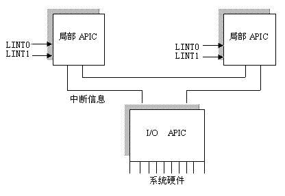

<!-- @import "[TOC]" {cmd="toc" depthFrom=1 depthTo=6 orderedList=false} -->

<!-- code_chunk_output -->

- [1 概述](#1-概述)
- [2 中断](#2-中断)
  - [2.1 x86 中断子系统](#21-x86-中断子系统)
    - [2.1.1 Intel 8259A 芯片](#211-intel-8259a-芯片)
    - [2.1.2 APIC](#212-apic)
  - [2.2 ARM 中断子系统](#22-arm-中断子系统)
  - [2.3 SMP IRQ affinity](#23-smp-irq-affinity)

<!-- /code_chunk_output -->

# 1 概述

**中断**是穿透**Hardware**和**Software**之间的一种**媒介**. 这边是磁盘, 鼠标, 键盘等等实体; 而在另一端是操作系统, 驱动或者某个简单的嵌入式程序. 当然, 中断并不是唯一的方式, 具体而言, 有**三种经典的方式**:

**轮询**: **周期性的查询外部设备**是否可用. 缺点是**浪费是 CPU 资源**. 但是在 CPU 资源富裕(非计算密集型)或者 careful design 的情况下, 能提供比中断更佳好的性能. 比如 network 中的 NAPI(new API)就会在收集到足够多的报文以后, 一次性中断 CPU, 防止每次报文 reach 都需要中断 CPU

**中断**: 通过设备的**中断线路**来提醒 CPU, sth happends. 中断的实现需要**硬件级别的支持**, 包括设备, 中断芯片和 CPU. CPU 会在每个 cycle 的末尾作一次中断的 check(硬件级别的 check, 任何 cycle 都会有, 所以没有性能影响)

**DMA**: **单独的 DMA 芯片**去负责**数据传输**. 对于磁盘之间大数据量的交换非常有效果. DMA 会**首先去申请总线**, if 成功, 那么会使用总线, 用完归还. DMA 只会在**所有数据处理完毕**后, 通过**中断通知 CPU**.

早期嵌入式设备的端口可能支持轮询, 而更加**新的端口**可以使用**DMA 的模式**在完成大块数据的传输工作.

# 2 中断

对于 Linux 而言, 中断进一步准确的分为:

- 异常(excepption): 由 CPU 内部引起, 也叫同步中断, 不能被 CPU 屏蔽, 细分分为:

    - Fault(出错): 可恢复, 恢复后回到出发 Fault 的那条指令继续执行, 比如 Page Fault, 在 page 被 load 进内存后继续执行刚才执行的命令
    - Trap(陷入): 可恢复, 恢复后执行触发 Trap 指令的后一条指令. 比如除 0 错误, 或者 Invalid Memory Address Reference. 也称为硬陷入(Hardware Trap), 对比软陷入(Software Trap)
    - Abort(中止): 无法恢复, 比如发生了硬件问题.

- 中断: 也叫异步中断, 由外部设备引起, 细分为可屏蔽中断(INTR)和非可屏蔽中断(NMI)

以上是真正意义上的中断, 有各自的 IRQ 向量和处理函数, 也称为硬中断(Hardware Interrupt). 对于 X86 有两根中断的引脚, 一根非屏蔽中断线(包括异常), 一根可中断线(接到中断处理芯片). 其中非屏蔽中断线多半是 intel 内部保留; 可中断线一般给外设使用.

对于 Liunx 而言, 它提供了一些的**syscall(INT 0x80**), 通过**类似中断的机制陷入到 Kernel Space**完成需要的工作(比如读取文件), 一般称之为**软中断(Software Interrupt**).

基于 Intel 芯片的 Linux 对于中断按照: 异常 -> 非可屏蔽中断 -> 可屏蔽中断 -> 软中断的顺序进行中断向量的分布:

- 0\-15 异常, intel 内部保留, 不可屏蔽
- 16\-31 非屏蔽中断, intel 内部保留, 不可屏蔽
- 32\-47 可屏蔽中断, 可屏蔽
- 47\-255 软中断, linux 系统本身使用 128(0x80)来作为系统调用软中断, 可屏蔽

## 2.1 x86 中断子系统

X86 通过(Intel 8259A)两级芯片或者新的 APIC(Advanced Programmable Interrupt Controller )来注册设备. 在 real mode 支持 15 个中断 IRQ0 - IRQ15 (IRQ2 被占用). 其中部分的中断号已经被固定(比如给键盘), 无法改变, 其他的映射到系统中的各个设备(端口)上.

Intel 8259A 芯片只适用于**uniprocessor 的系统**, 对于 SMP 系统, 新的 APIC 芯片被引入. 在 APIC 中, 原有的 IRQ0 \- IRQ15 分配**不一定保留**.

Intel 8259A 的 IRQ0 - IRQ15 一个典型分配如下:

Master PIC

- IRQ 0 – system timer (cannot be changed)
- IRQ 1 – keyboard controller (cannot be changed)
- IRQ 2 – cascaded signals from IRQs 8–15 (any devices configured to use IRQ 2 will actually be using IRQ 9)
- IRQ 3 – serial port controller for serial port 2 (shared with serial port 4, if present)
- IRQ 4 – serial port controller for serial port 1 (shared with serial port 3, if present)
- IRQ 5 – parallel port 2 and 3 or sound card
- IRQ 6 – floppy disk controller
- IRQ 7 – parallel port 1. It is used for printers or for any parallel port if a printer is not present. It can also be potentially be shared with a secondary sound card with careful management of the port.

Slave PIC

- IRQ 8 – real-time clock (RTC)
- IRQ 9 – Advanced Configuration and Power Interface (ACPI) system control interrupt on Intel chipsets.[1] Other chipset manufacturers might use another interrupt for this purpose, or make it available for the use of peripherals (any devices configured to use IRQ 2 will actually be using IRQ 9)
- IRQ 10 – The Interrupt is left open for the use of peripherals (open interrupt/available, SCSI or NIC)
- IRQ 11 – The Interrupt is left open for the use of peripherals (open interrupt/available, SCSI or NIC)
- IRQ 12 – mouse on PS/2 connector
- IRQ 13 – CPU co-processor or integrated floating point unit or inter-processor interrupt (use depends on OS)
- IRQ 14 – primary ATA channel (ATA interface usually serves hard disk drives and CD drives)
- IRQ 15 – secondary ATA channel

其中**IRQ0(时钟中断**)和**IRQ1(键盘中断**)这两个中断即使在**APIC 中依然被保留**.

```
[root@centos7 ~]# cat /proc/interrupts
           CPU0       CPU1       CPU2       CPU3
  0:         45          0          0          0   IO-APIC-edge      timer
  1:          1          1          1          0   IO-APIC-edge      i8042
  8:          1          0          0          0   IO-APIC-edge      rtc0
  9:          4          0          0          0   IO-APIC-fasteoi   acpi
 12:          1          0          2          1   IO-APIC-edge      i8042
 16:         10          1         12          2   IO-APIC-fasteoi   ehci_hcd:usb1
 23:         13          1         14          1   IO-APIC-fasteoi   ehci_hcd:usb2
 24:          0          0          0          0   PCI-MSI-edge      PCIe PME, pciehp
 25:          0          0          0          0   PCI-MSI-edge      PCIe PME
 26:        117         14        290          5   PCI-MSI-edge      xhci_hcd
 27:      12853          5         57          0   PCI-MSI-edge      p4p1
 28:       1085        488       3997       2156   PCI-MSI-edge      0000:00:1f.2
 29:          3          2         24         10   PCI-MSI-edge      i915
 30:         38          5        420          0   PCI-MSI-edge      snd_hda_intel
 31:          0          0         10          1   PCI-MSI-edge      mei_me
 32:         26          9         23          0   PCI-MSI-edge      snd_hda_intel
NMI:          0          0          0          0   Non-maskable interrupts
LOC:      66556      45656      22277      19634   Local timer interrupts
SPU:          0          0          0          0   Spurious interrupts
PMI:          0          0          0          0   Performance monitoring interrupts
IWI:       3765        552        416        338   IRQ work interrupts
RTR:          1          0          0          0   APIC ICR read retries
RES:       1541       1212       1102        713   Rescheduling interrupts
CAL:        949       1092       1070       1171   Function call interrupts
TLB:         79        120        226        131   TLB shootdowns
TRM:          0          0          0          0   Thermal event interrupts
THR:          0          0          0          0   Threshold APIC interrupts
DFR:          0          0          0          0   Deferred Error APIC interrupts
MCE:          0          0          0          0   Machine check exceptions
MCP:          4          4          4          4   Machine check polls
ERR:          0
MIS:          0
PIN:          0          0          0          0   Posted-interrupt notification event
PIW:          0          0          0          0   Posted-interrupt wakeup event
```

可以看到**IRQ0**, **IRQ1**, **IRQ8**和**IRQ9**和 Intel 8259A 中**提供一样的功能**, **其他的 IRQ 都没有被分配**. **i8042 是键盘中断(PS/2**), 有两个是因为**设计时候兼容鼠标**, 所以**IRQ1 给键盘**, 一个**IRQ12 给鼠标**.

### 2.1.1 Intel 8259A 芯片

Intel 8259A 芯片通过 2 级桥接(slave 芯片接在 master 的 IRQ2 上), 提供总共 15 个中断. 可用的其实更加少, 因此在某个阶段(APIC 还没出现), Intel 提供了 IRQ 共享的概念, 通过添加额外的线路(PIRQ)来使得多个 PCI 设备使用同一个 IRQ 随后通过软件的模式来具体区分是哪一个设备触发了中断. 单个 IRQ 最多可以有 8 个共享(PIRQA - PIRQH).


注意芯片本身也是有时钟的, 默认是. 芯片通过引脚 INTR 来告知 CPU 有中断到来(CPU 通过引脚 INTA 来反馈信息); 通过 D0 - D7 来传输数据. 芯片的可写寄存器通过 IN/OUT 指令来操作.

IRQ 同时也代表了中断的优先级, 数字越小, 优先级越高.

### 2.1.2 APIC

伴随着 SMP 系统的诞生, APIC 芯片被引入. APIC 包括两种类型芯片:

- local APIC, 本地(局部)APIC 芯片和 CPU Core 一一对应
- I/O APIC, 负责链接设备, 并发送给 local APIC. 最多有 8 个, 所有 CPU Core 共享.



local APIC 和 I/O APIC 之间通过**FSB(系统总线！！！**)相互连接(早期有单独的 APIC 总线).

Intel 8259A 也可以和 APIC 桥接:

>In systems containing an 8259 PIC, the 8259 may be connected to the LAPIC in the system's bootstrap processor (BSP), or to one of the system's I/O APICs, or both. Logically, however, the 8259 is only connected once at any given time.

APIC 有两种模式:

- 作为一种**标准的 8259A 工作方式**. **Local APIC 被禁止**, 外部 **I/O APIC 连接到 CPU**, 两条 **LINT0 和 LINT1 分别连接到 INTR 和 NMI 引脚**.
- 作为一种**标准外部 I/O APIC**. **本地 APIC 被激活**, 且**所有的外部中断**都通过 **I/O APIC 接收**.

**APIC**提供**更加多的 IRQ**, **单个 I/O APIC 芯片**支持**24 个 IRQ**. I/O APIC 类似于一个**dispatcher**, 通过一定的规则, 按照**中断的 affinity 设置**来**派发每个中断**.

同时 APIC 还提供了 IPI(Inter Processor Interrupt)功能, 用于发送中断给其他 Core, 可软件触发.

- send\_IPI\_all() : Sends an IPI to all CPUs (including the sender)
- send\_IPI\_allbutself() : Sends an IPI to all CPUs except the sender
- send\_IPI\_self() : Sends an IPI to the sender CPU
- send\_IPI\_mask() : Sends an IPI to a group of CPUs specified by a bit mask

APIC 定义的中断触发的时机有两种: **Edge triggered(边缘触发**) or **Level triggered(水平触发**)

Edge triggered(边缘触发)意味着中断信息的发送是通过电平转换来触发的(**上升沿**或者**下降沿**), 也就是类似于脉冲信号. 这意味着信号**如果没有被接受就会丢掉**. 多个统一中断向量的中断触发会产生多个中断信息.

Level triggered(水平触发)是通过**维持电平来触发**的. 系统会**周期性的检查引线的电平**, 如果符合要求(比如高电平), 那么就认为中断向量被触发. 在电平未清除之前, 重复触发会被 ignore 掉(因为一直在高电平).

准确的说**edge**分为 low\-to\-high edge triggered(**上升沿**)和 high\-to\-low edge triggered(**下降沿**); **level**分为 active high level\-sensitive(**高电平维持**)和 active low level\-sensitive(**低电平维持**). 具体需要查看**各个芯片的文档**.

查看/proc/interrupts, 会发现**两种不同 APIC**的设置: apic\-edge 和 apic\-fasteoi. 前者如其名字, 代表**edge triggered**; 后者是**level trigger**, 并且**中断的状态(ISR)会保持**, 直到**EOI(end of interrupt, 代表中断处理完毕**)被**PIC(programmable Interrupt Controller)接收到**, 才会**被清除**.

## 2.2 ARM 中断子系统

**ARM 中断**依赖于**Generic Interrupt Controller(GIC**), 每一代都会有不停的演进, 支持的中断数目也不同: 比如 A15 的 CoreLink GIC-400 Generic Interrupt Controller, 支持 256 个中断向量. 具体分区需要参考各个芯片的文档, 以下 GICv2 为例子. (后续的 GICv3, GICv4 文档 ARM 没有公布, 当然也可以使用其他类型的中断芯片)

GICv2 可以管理四类中断类型(CPU 内部中断它不管):

- Peripheral Interrupt(外围中断)
    - Private Peripheral Interrupt (PPI) : 发送给特定 CPU 的中断
    - Shared Peripheral Interrupt (SPI) : 可以 route 给任何一个 CPU 处理的中断
- Software\-generated interrupt (SGI) : 类似 APIC 的 IPI 中断, 负责 Processor 之间交互
- Virtual Interrupt: 给 Virtual Machine 使用的, 比较少见.
- Maintenance Interrupt: 类似于 GIC 内部的中断, 用来 enable/disable GIC 一些功能.

GICv2 指定 ID0 - ID31 为 PPI, ID32 往上时 SPI, 根据芯片类型, 甚至支持上千的 SPI(虽然 A15 只有 224 个).

ARM 没有向前兼容的需求, 所以很多时候可以设计的更加激进一些.

另外 ARM Core 的 state 要比 x86 多很多(多达 7 个), 其中有两个专门给 interrupt 提供的 state(知乎表格的功能什么时候能提供呢?！):


其中 FIQ(快速中断)和 IRQ 是 ARM 专门提供来处理中断. FIQ 的优先级高于 IRQ, 并且处理时排斥其他 FIQ 或者 IRQ.

ARM 的 Vector Table 一共 7 格:

```
Interrupt/Exception/Reset	Mode	Address
Reset				SVC	0x00000000
Undefined instruction		UND	0x00000004
Software interrupt (SWI)	SVC	0x00000008
Prefetch abort			ABT	0x0000000c
Data abort			ABT	0x00000010
Reserved			N/A	0x00000014
IRQ				IRQ	0x00000018
FIQ				FIQ	0x0000001c
```

对于 FIQ/IRQ, 多个 handler 通过类似 link list 的方式串起来, 一个中断会按照顺序从头搜索 handler, 直到找到可以识别和处理的 handler.

## 2.3 SMP IRQ affinity

类似于**CPU core 的 affinity**, 中断也可以指定的**绑定**到**一个或者一批特定的 core**上执行.

```
/proc/irq/IRQ#/smp_affinity and /proc/irq/IRQ#/smp_affinity_list specify
which target CPUs are permitted for a given IRQ source. It's a bitmask
(smp_affinity) or cpu list (smp_affinity_list) of allowed CPUs. It's not
allowed to turn off all CPUs, and if an IRQ controller does not support
IRQ affinity then the value will not change from the default of all cpus.
```

通过查看 `/proc/interrupts`, 如果发现**某个 core busying handle 某个中断**, 那可以改变这个中断变量的 affinity, 让其他 core 分担中断的压力.

不过, SMP IRQ affinity 需要 kernel 和 APIC 的合作, 所以如果可能太老, 不一定能够 work. 这种情况下, 请询问是否可以升级 kernel.