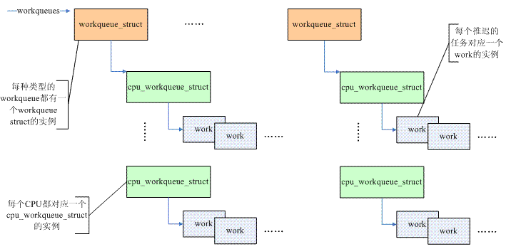

<!-- @import "[TOC]" {cmd="toc" depthFrom=1 depthTo=6 orderedList=false} -->

<!-- code_chunk_output -->

- [1. 前言](#1-前言)
- [2 为何需要 workqueue](#2-为何需要-workqueue)
  - [2.1 什么是中断上下文和进程上下文?](#21-什么是中断上下文和进程上下文)
  - [2.2 如何判定当前的 context?](#22-如何判定当前的-context)
  - [2.3 为何中断上下文不能 sleep?](#23-为何中断上下文不能-sleep)
  - [2.4 为何需要 workqueue](#24-为何需要-workqueue)
- [3 数据抽象](#3-数据抽象)
  - [3.1 workqueue](#31-workqueue)
  - [3.2 work](#32-work)
  - [3.3 总结](#33-总结)
- [4 接口以及内部实现](#4-接口以及内部实现)
  - [4.1 初始化一个 work](#41-初始化一个-work)
  - [4.2 调度一个 work 执行](#42-调度一个-work-执行)
  - [4.3 创建 workqueue](#43-创建-workqueue)
  - [4.4 work 执行的时机](#44-work-执行的时机)

<!-- /code_chunk_output -->

# 1. 前言

workqueue 是一个驱动工程师常用的工具, 在旧的内核中(指 2.6.36 之前的内核版本)workqueue 代码比较简单(大概 800 行), 在 2.6.36 内核版本中引入了 CMWQ(Concurrency Managed Workqueue), workqueue.c 的代码膨胀到 5000 多行, 为了深入的理解 CMWQ, 单单一份文档很难将其描述的清楚, 因此 CMWQ 作为一个主题将会产生一系列的文档, 本文是这一系列文档中的第一篇, 主要是基于 2.6.23 内核的代码实现来讲述 workqueue 的一些基本概念(之所以选择较低版本的内核, 主要是因为代码简单, 适合理解基本概念).

# 2 为何需要 workqueue

## 2.1 什么是中断上下文和进程上下文?

在继续描述 workqueue 之前, 我们先梳理一下**中断上下文**和**进程上下文**.

对于**中断上下文**, 主要包括**两种情况**:

(1)执行该中断的处理函数(我们一般称之**interrupt handler**或者叫做**top half**), 也就是**hard interrupt context**

(2)执行**软中断处理函数**, 执行**tasklet 函数**, 执行**timer callback 函数**. (或者统称**bottom half**), 也就是**software interrupt context**.

**top half**当然是**绝对的 interrupt context**, 但对于上面的**第二种情况**, 稍微有些复杂, 其**执行的现场**包括:

(1)执行**完 top half**, **立刻启动 bottom half**的执行

(2)当**负荷比较重**的时候(中断产生的比较多), 系统在一段时间内都在处理 interrupt handler 以及相关的 softirq, 从而导致无法调度到进程执行, 这时候, linux kernel 采用了将 softirq 推迟到 softirqd 这个内核线程中执行

(3)进程在内核态运行的时候, 由于内核同步的需求, 需要使用 local_bh_disable/local_bh_enable 来保护临界区. 在临界区代码执行的时候, 有可能中断触发并 raise softirq, 但是由于 softirq 处于 disable 状态从而在中断返回的时候没有办法 invoke softirq 的执行, 当调用 local_bh_enable 的时候, 会调用已经触发的那个 softirq handler.

对于上面的情况 1 和情况 3, 毫无疑问, 绝对的中断上下文, 执行现场的 current task 和 softirq handler 没有任何的关系. 对于情况 2, 虽然是在专属的内核线程中执行, 但是我也倾向将其归入 software interrupt context.

对于 linux 而言, 中断上下文都是惊鸿一瞥, 只有进程(线程、或者叫做 task)是永恒的. 整个 kernel 都是在各种进程中切来切去, 一会儿运行在进程的用户空间, 一会儿通过系统调用进入内核空间. 当然, 系统不是封闭的, 还是需要通过外设和 User 或者其他的系统进行交互, 这里就需要中断上下文了, 在中断上下文中, 完成硬件的交互, 最终把数据交付进程或者进程将数据传递给外设. 进程上下文有丰富的、属于自己的资源: 例如有硬件上下文, 有用户栈、有内核栈, 有用户空间的正文段、数据段等等. 而中断上下文什么也没有, 只有一段执行代码及其附属的数据. 那么问题来了: 中断执行 thread 中的临时变量应该保存在栈上, 那么中断上下文的栈在哪里?中断上下文没有属于自己的栈, 肿么办?那么只能借了, 当中断发生的时候, 遇到哪一个进程就借用哪一个进程的资源(遇到就是缘分呐).

## 2.2 如何判定当前的 context?

OK, 上一节描述中断上下文和进程上下文的含义, 那么代码如何知道自己的上下文呢?下面我们结合代码来进一步分析. in\_irq()是用来判断是否在 hard interrupt context 的, 我们一起来来看看 in\_irq()是如何定义的:

```c
#define in_irq()        (hardirq_count())
#define hardirq_count()    (preempt_count() & HARDIRQ_MASK)
```

top half 的处理是被 irq\_enter()和 irq\_exit()所包围, 在 irq\_enter 函数中会调用 preempt\_count\_add(HARDIRQ\_OFFSET), 为 hardirq count 的 bit field 增加 1. 在 irq\_exit 函数中, 会调用 preempt\_count\_sub(HARDIRQ\_OFFSET), 为 hardirq count 的 bit field 减去 1. 因此, 只要 in\_irq 非零, 则说明在中断上下文并且处于 top half 部分.

解决了 hard interrupt context, 我们来看 software interrupt context. 如何判定代码当前正在执行 bottom half(softirq、tasklet、timer)呢?in\_serving\_softirq 给出了答案:

```c
#define in_serving_softirq()    (softirq_count() & SOFTIRQ_OFFSET)
```

需要注意的是: 在 2.6.23 内核中没有这个定义(上面的代码来自 4.0 的内核). 内核中还有一个类似的定义:

```c
#define in_softirq()        (softirq_count())
#define softirq_count()    (preempt_count() & SOFTIRQ_MASK)
```

in\_softirq 定义了更大的一个区域, 不仅仅包括了 in\_serving\_softirq 上下文, 还包括了 disable bottom half 的场景. 我们用下面一个图片来描述:


我们知道, 在进程上下文中, 由于内核同步的要求可能会禁止 softirq. 这时候, kernel 提供了 local\_bf\_enable 和 local\_bf\_disable 这样的接口函数, 这种场景下, 在 local\_bf\_enable 函数中会执行软中断 handler(在临界区中, 虽然 raise 了 softirq, 但是由于 disable 了 bottom half, 因此无法执行, 只有等到 enable 的时候第一时间执行该 softirq handler). in\_softirq 包括了进程上下文中 disable bottom half 的临界区部分, 而 in\_serving\_softirq 精准的命中了 software interrupt context.

内核中还有一个 in\_interrupt 的宏定义, 从它的名字上看似乎是定义了 hard interrupt context 和 software interrupt context, 到底是怎样的呢?我们来看看定义:

```c
#define in_interrupt()        (irq_count())
#define irq_count()    (preempt_count() & (HARDIRQ_MASK | SOFTIRQ_MASK \
                 | NMI_MASK))
```

注: 上面的代码来自 4.0 的内核. HARDIRQ\_MASK 定义了 hard interrupt contxt, NMI\_MASK 定义了 NMI(对于 ARM 是 FIQ)类型的 hard interrupt context, SOFTIRQ\_MASK 包括 software interrupt context 加上禁止 softirq 情况下的进程上下文. 因此, in\_interrupt()除了包括了中断上下文的场景, 还包括了进程上下文禁止 softirq 的场景.

还有一个 in\_atomic 的宏定义, 大家可以自行学习, 这里不再描述了.

## 2.3 为何中断上下文不能 sleep?

linux 驱动工程师应该都会听说过这句话: 中断上下文不能 sleep, 但是为什么呢?这个问题可以仔细思考一下. 所谓 sleep 就是调度器挂起当前的 task, 然后在 run queue 中选择另外一个合适的 task 运行. 规则很简单, 不过实际操作就没有那么容易了. 有一次, 我们调试 wifi 驱动的时候, 有一个 issue 很有意思: 正常工作的时候一切都是 OK 的, 但是当进行压力测试的时候, 系统就会 down 掉. 最后发现是在 timer 的 callback 函数中辗转多次调用了 kmalloc 函数, 我们都知道, 在某些情况下, kmalloc 会导致当前进程被 block.

从操作系统设计的角度来看, 大部分的 OS 都规定中断上下文不能 sleep, 有些是例外的, 比如 solaris, 每个中断的 handler 都是在它自己的 task 中处理的, 因此可以在中断 handler 中 sleep. 不过在这样的系统中(很多 RTOS 也是如此处理的), 实际的中断上下文非常的薄, 可能就是向该中断 handler 对应的 task 发送一个 message, 所有的处理(ack 中断、mask 中断、copy FIFO 等)都是在该中断的 task 中处理. 这样的系统中, 当然可以在中断 handler 中 sleep, 不过这有点偷换概念, 毕竟这时候的上下文不是 interrupt context, 更准确的说是中断处理的 process context, 这样的系统 interrupt context 非常非常的简单, 几乎没有.

当然, linux 的设计并非如此(其实在 rt linux 中已经有了这样的苗头, 可以参考中断线程化的文章), 中断 handler 以及 bottom half(不包括 workqueue)都是在 interrupt context 中执行. 当然一提到 context, 各种资源还是要存在的, 例如说内核栈、例如说 memory space 等, interrupt context 虽然单薄, 但是可以借尸还魂. 当中断产生的那一个时刻, 当前进程有幸成为 interrupt context 的壳, 提供了内核栈, 保存了 hardware context, 此外各种资源(例如 mm\_struct)也是借用当前进程的. 本来呢 interrupt context 身轻如燕, 没有依赖的 task, 调度器其实是不知道如何调度 interrupt context 的(它处理的都是 task), 在 interrupt context 借了一个外壳后, 从理论上将, 调度器是完全可以 block 该 interrupt context 执行, 并将其他的 task 调入进入 running 状态. 然而, block 该 interrupt context 执行也就 block 其外壳 task 的执行, 多么的不公平, 多么的不确定, 中断命中你, 你就活该被 schedule out, 拥有正常思维的 linux 应该不会这么做的.

因此, 在中断上下文中(包括 hard interrupt context 和 software interrupt context)不能睡眠.

## 2.4 为何需要 workqueue

workqueue 和其他的 bottom half 最大的不同是它是运行在进程上下文中的, 它可以睡眠, 这和其他 bottom half 机制有本质的不同, 大大方便了驱动工程师撰写中断处理代码. 当然, 驱动模块也可以自己创建一个 kernel thread 来解决 defering work, 但是, 如果每个 driver 都创建自己的 kernel thread, 那么内核线程数量过多, 这会影响整体的性能. 因此, 最好的方法就是把这些需求汇集起来, 提供一个统一的机制, 也就是传说中的 work queue 了.

# 3 数据抽象

## 3.1 workqueue

定义如下:

```c
struct workqueue_struct {
    struct cpu_workqueue_struct *cpu_wq; －－－－－per-cpu work queue struct
    struct list_head list; －－－workqueue list
    const char *name;
    int singlethread; －－－－single thread or multi thread
    int freezeable;  －－－－和电源管理相关的一个 flag
};
```

我们知道, workqueue 就是一种把某些任务(work)推迟到一个或者一组内核线程中去执行, 那个内核线程被称作 worker thread(每个 processor 上有一个 work thread). 系统中所有的 workqueue 会挂入一个全局链表, 链表头定义如下:

```c
static LIST_HEAD(workqueues);
```

list 成员就是用来挂入 workqueue 链表的. singlethread 是 workqueue 的一个特殊模式, 一般而言, 当创建一个 workqueue 的时候会为每一个系统内的 processor 创建一个内核线程, 该线程处理本 cpu 调度的 work. 但是有些场景中, 创建 per-cpu 的 worker thread 有些浪费(或者有一些其他特殊的考量), 这时候创建 single-threaded workqueue 是一个更合适的选择. freezeable 成员是一个和电源管理相关的一个 flag, 当系统 suspend 的时候, 有一个阶段会将所有的用户空间的进程冻结, 那么是否也冻结内核线程(包括 workqueue)呢?缺省情况下, 所有的内核线程都是 nofrezable 的, 当然也可以调用 set\_freezable 让一个内核线程是可以被冻结的. 具体是否需要设定该 flag 是和程序逻辑相关的, 具体情况具体分析. OK, 上面描述的都是 workqueue 中各个 processor 共享的成员, 下面我们看看 per-cpu 的数据结构:

```c
struct cpu_workqueue_struct {

    spinlock_t lock; －－－－用来保护 worklist 资源的访问

    struct list_head worklist;
    wait_queue_head_t more_work; －－－－－等待队列头
    struct work_struct *current_work; －－－－当前正在处理的 work

    struct workqueue_struct *wq; －－－－－－指向 work queue struct
    struct task_struct *thread; －－－－－－－worker thread task

    int run_depth;        /* Detect run_workqueue() recursion depth */
} ____cacheline_aligned;
```

worker thread 要处理 work, 这些 work 被挂入 work queue 中的链表结构. 由于每个 processor 都需要处理自己的 work, 因此这个 work list 是 per cpu 的. worklist 成员就是这个 per cpu 的链表头, 当 worker thread 被调度到的时候, 就从这个队列中一个个的摘下 work 来处理.

## 3.2 work

定义如下:

```c
struct work_struct {
    atomic_long_t data;
    struct list_head entry;
    work_func_t func;
};
```

所谓 work 就是异步执行的函数. 你可能会觉得, 反正是函数, 直接调用不就 OK 了吗?但是, 事情没有那么简单, 如果该函数的代码中有些需要 sleep 的场景的时候, 那么在中断上下文中直接调用将产生严重的问题. 这时候, 就需要到进程上下文中异步执行. 下面我们仔细看看各个成员: func 就是这个异步执行的函数, 当 work 被调度执行的时候其实就是调用 func 这个 callback 函数, 该函数的定义如下:

```c
typedef void (*work_func_t)(struct work_struct *work);
```

work 对应的 callback 函数需要传递该 work 的 struct 作为 callback 函数的参数. work 是被组织成队列的, entry 成员就是挂入队列的那个节点, data 包含了该 work 的状态 flag 和挂入 workqueue 的信息.

## 3.3 总结

我们把上文中描述的各个数据结构集合在一起, 具体请参考下图:



我们自上而下来描述各个数据结构. 首先, 系统中包括若干的 workqueue, 最著名的 workqueue 就是系统缺省的的 workqueue 了, 定义如下:

```c
static struct workqueue_struct *keventd_wq __read_mostly;
```

如果没有特别的性能需求, 那么一般驱动使用 keventd\_wq 就 OK 了, 毕竟系统创建太多内核线程也不是什么好事情(消耗太多资源). 当然, 如果有需要, 驱动模块可以创建自己的 workqueue. 因此, 系统中存在一个 workqueues 的链表, 管理了所有的 workqueue 实例. 一个 workqueue 对应一组 work thread(先不考虑 single thread 的场景), 每个 cpu 一个, 由 cpu\_workqueue\_struct 来抽象, 这些 cpu\_workqueue\_struct 们共享一个 workqueue, 毕竟这些 worker thread 是同一种 type.

从底层驱动的角度来看, 我们只关心如何处理 deferable task(由 work\_struct 抽象). 驱动程序定义了 work\_struct, 其 func 成员就是 deferred work, 然后挂入 work list 就 OK 了(当然要唤醒 worker thread 了), 系统的调度器调度到 worker thread 的时候, 该 work 自然会被处理了. 当然, 挂入哪一个 workqueue 的那一个 worker thread 呢?如何选择 workqueue 是 driver 自己的事情, 可以使用系统缺省的 workqueue, 简单, 实用. 当然也可以自己创建一个 workqueue, 并把 work 挂入其中. 选择哪一个 worker thread 比较简单: work 在哪一个 cpu 上被调度, 那么就挂入哪一个 worker thread.

# 4 接口以及内部实现

## 4.1 初始化一个 work

我们可以静态定义一个 work, 接口如下:

```c
#define DECLARE_WORK(n, f)                    \
    struct work_struct n = __WORK_INITIALIZER(n, f)

#define DECLARE_DELAYED_WORK(n, f)                \
    struct delayed_work n = __DELAYED_WORK_INITIALIZER(n, f)
```

一般而言, work 都是推迟到 worker thread 被调度的时刻, 但是有时候, 我们希望在指定的时间过去之后再调度 worker thread 来处理该 work, 这种类型的 work 被称作 delayed work, DECLARE\_DELAYED\_WORK 用来初始化 delayed work, 它的概念和普通 work 类似, 本文不再描述.

动态创建也是 OK 的, 不过初始化的时候需要把 work 的指针传递给 INIT\_WORK, 定义如下:

```c
#define INIT_WORK(_work, _func)                        \
    do {                                \
        (_work)->data = (atomic_long_t) WORK_DATA_INIT();    \
        INIT_LIST_HEAD(&(_work)->entry);            \
        PREPARE_WORK((_work), (_func));                \
    } while (0)
```

## 4.2 调度一个 work 执行

调度 work 执行有两个接口, 一个是 schedule\_work, 将 work 挂入缺省的系统 workqueue(keventd\_wq), 另外一个是 queue\_work, 可以将 work 挂入指定的 workqueue. 具体代码如下:

```c
int fastcall queue_work(struct workqueue_struct *wq, struct work_struct *work)
{
    int ret = 0;

    if (!test_and_set_bit(WORK_STRUCT_PENDING, work_data_bits(work))) {
        __queue_work(wq_per_cpu(wq, get_cpu()), work);－－－挂入 work list 并唤醒 worker thread
        put_cpu();
        ret = 1;
    }
    return ret;
}
```

处于 pending 状态的 work 不会重复挂入 workqueue. 我们假设 A 驱动模块静态定义了一个 work, 当中断到来并分发给 cpu0 的时候, 中断 handler 会在 cpu0 上执行, 我们在 handler 中会调用 schedule\_work 将该 work 挂入 cpu0 的 worker thread, 也就是 keventd 0 的 work list. 在 worker thread 处理 A 驱动的 work 之前, 中断很可能再次触发并分发给 cpu1 执行, 这时候, 在 cpu1 上执行的 handler 在调用 schedule\_work 的时候实际上是没有任何具体的动作的, 也就是说该 work 不会挂入 keventd 1 的 work list, 因为该 work 还 pending 在 keventd 0 的 work list 中.

到底插入 workqueue 的哪一个 worker thread 呢?这是由 wq\_per\_cpu 定义的:

```c
static struct cpu_workqueue_struct *wq_per_cpu(struct workqueue_struct *wq, int cpu)
{
    if (unlikely(is_single_threaded(wq)))
        cpu = singlethread_cpu;
    return per_cpu_ptr(wq->cpu_wq, cpu);
}
```

普通情况下, 都是根据当前的 cpu id, 通过 per\_cpu\_ptr 获取 cpu\_workqueue\_struct 的数据结构, 对于 single thread 而言, cpu 是固定的.

## 4.3 创建 workqueue

接口如下:

```c
#define create_workqueue(name) __create_workqueue((name), 0, 0)
#define create_freezeable_workqueue(name) __create_workqueue((name), 1, 1)
#define create_singlethread_workqueue(name) __create_workqueue((name), 1, 0)
```

create\_workqueue 是创建普通 workqueue, 也就是每个 cpu 创建一个 worker thread 的那种. 当然, 作为"普通"的 workqueue, 在 freezeable 属性上也是跟随缺省的行为, 即在 suspend 的时候不冻结该内核线程的 worker thread. create\_freezeable\_workqueue 和 create\_singlethread\_workqueue 都是创建 single thread workqueue, 只不过一个是 freezeable 的, 另外一个是 non\-freezeable 的. 的代码如下:

```c
struct workqueue_struct *__create_workqueue(const char *name, int singlethread, int freezeable)
{
    struct workqueue_struct *wq;
    struct cpu_workqueue_struct *cwq;
    int err = 0, cpu;

    wq = kzalloc(sizeof(*wq), GFP_KERNEL);－－－－分配 workqueue 的数据结构

    wq->cpu_wq = alloc_percpu(struct cpu_workqueue_struct);－－－分配 worker thread 的数据结构

    wq->name = name;－－－－－－－－－－初始化 workqueue
    wq->singlethread = singlethread;
    wq->freezeable = freezeable;
    INIT_LIST_HEAD(&wq->list);

    if (singlethread) {－－－－－－－－－－－－－－－－－－－－－－－(1)
        cwq = init_cpu_workqueue(wq, singlethread_cpu); －－－初始化 cpu_workqueue_struct
        err = create_workqueue_thread(cwq, singlethread_cpu); －－－创建 worker thread
        start_workqueue_thread(cwq, -1); －－－－wakeup worker thread
    } else { －－－－－－－－－－－－－－－－－－－－－－－－－－－－－(2)
        mutex_lock(&workqueue_mutex);
        list_add(&wq->list, &workqueues);

        for_each_possible_cpu(cpu) {
            cwq = init_cpu_workqueue(wq, cpu);
            if (err || !cpu_online(cpu)) －－－－没有 online 的 cpu 就不需要创建 worker thread 了
                continue;
            err = create_workqueue_thread(cwq, cpu);
            start_workqueue_thread(cwq, cpu);
        }
        mutex_unlock(&workqueue_mutex);
    }
    return wq;
}
```

(1)不管是否是 single thread workqueue, worker thread(cpu\_workqueue\_struct)的数据结构总是 per cpu 分配的(稍显浪费), 不过实际上对于 single thread workqueue 而言, 只会使用其中之一, 那么问题来了: 使用哪一个 processor 的 cpu\_workqueue\_struct 呢?workqueue 代码定义了一个 singlethread\_cpu 的变量, 如下:

```c
static int singlethread_cpu __read_mostly;
```

该变量会在 init\_workqueues 函数中进行初始化. 实际上, 使用哪一个 cpu 的 cpu\_workqueue\_struct 是无所谓的, 选择其一就 OK 了. 由于是 single thread workqueue, 因此创建的 worker thread 并不绑定在任何的 cpu 上, 调度器可以自由的调度该内核线程在任何的 cpu 上运行.

(2)对于普通的 workqueue, 和 single thread 的处理有所有不同. 一方面, single thread 的 workqueue 没有挂入 workqueues 的全局链表, 另外一方面 for\_each\_possible\_cpu 确保在每一个 cpu 上创建了一个 worker thread 并通过 start\_workqueue\_thread 启动其运行, 具体代码如下:

```c
static void start_workqueue_thread(struct cpu_workqueue_struct *cwq, int cpu)
{
    struct task_struct *p = cwq->thread;

    if (p != NULL) {
        if (cpu >= 0)
            kthread_bind(p, cpu);
        wake_up_process(p);
    }
}
```

对于 single thread, kthread\_bind 不会执行, 对于普通的 workqueue, 我们必须调用 kthread\_bind 以便让 worker thread 在特定的 cpu 上执行.

## 4.4 work 执行的时机

work 执行的时机是和调度器相关的, 当系统调度到 worker thread 这个内核线程后, 该 thread 就会开始工作. 每个 cpu 上执行的 worker thread 的内核线程的代码逻辑都是一样的, 在 worker\_thread 中实现:

```c
static int worker_thread(void *__cwq)
{
    struct cpu_workqueue_struct *cwq = __cwq;
    DEFINE_WAIT(wait);

    if (cwq->wq->freezeable)－－－如果是 freezeable 的内核线程, 那么需要清除 task flag 中的
        set_freezable();                    PF_NOFREEZE 标记, 以便在系统 suspend 的时候冻结该 thread

    set_user_nice(current, -5); －－－－提高进程优先级, 呵呵, worker thread 还是有些特权的哦

    for (;;) {
        prepare_to_wait(&cwq->more_work, &wait, TASK_INTERRUPTIBLE);
        if (!freezing(current) &&  !kthread_should_stop() &&  list_empty(&cwq->worklist))
            schedule();－－－－－－－－－－－－－－(1)
        finish_wait(&cwq->more_work, &wait);

        try_to_freeze(); －－－－－－处理来自电源管理模块的冻结请求

        if (kthread_should_stop()) －－－－－处理停止该 thread 的请求
            break;

        run_workqueue(cwq); －－－－－－依次处理 work list 上的各个 work
    }

    return 0;
}
```

(1)导致 worker thread 进入 sleep 状态有三个条件:

(a)电源管理模块没有请求冻结该 worker thread.

(b)该 thread 没有被其他模块请求停掉.

(c)work list 为空, 也就是说没有 work 要处理