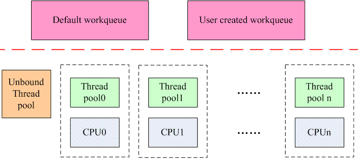

<!-- @import "[TOC]" {cmd="toc" depthFrom=1 depthTo=6 orderedList=false} -->

<!-- code_chunk_output -->

- [1 前言](#1-前言)
- [2 为何需要 CMWQ?](#2-为何需要-cmwq)
- [3 CMWQ 如何解决问题的呢?](#3-cmwq-如何解决问题的呢)
  - [3.1 设计原则](#31-设计原则)
  - [3.2 CMWQ 的整体架构](#32-cmwq-的整体架构)
  - [3.3 如何解决线程数目过多的问题?](#33-如何解决线程数目过多的问题)
  - [3.4 如何解决并发问题?](#34-如何解决并发问题)
- [4 接口 API](#4-接口-api)

<!-- /code_chunk_output -->

# 1 前言

一种新的机制出现的原因往往是为了解决实际的问题, 虽然 linux kernel 中已经提供了 workqueue 的机制, 那么为何还要引入 cmwq 呢?也就是说: 旧的 workqueue 机制存在什么样的问题?在新的 cmwq 又是如何解决这些问题的呢?它接口是如何呈现的呢(驱动工程师最关心这个了)?如何兼容旧的驱动呢?本文希望可以解开这些谜题.

本文的代码来自 linux kernel 4.0.

# 2 为何需要 CMWQ?

内核中很多场景需要异步执行环境(在驱动中尤其常见), 这时候, 我们需要定义一个 work(执行哪一个函数)并挂入 workqueue. 处理该 work 的线程叫做 worker, 不断的处理队列中的 work, 当处理完毕后则休眠, 队列中有 work 的时候就醒来处理, 如此周而复始. 一切看起来比较完美, 问题出在哪里呢?

(1)内核线程数量太多. 如果没有足够的内核知识, 程序员有可能会错误的使用 workqueue 机制, 从而导致这个机制被玩坏. 例如明明可以使用 default workqueue, 偏偏自己创建属于自己的 workqueue, 这样一来, 对于那些比较大型的系统(CPU 个数比较多), 很可能内核启动结束后就耗尽了 PID space(default 最大值是 65535), 这种情况下, 你让 user space 的程序情何以堪?虽然 default 最大值是可以修改的, 从而扩大 PID space 来解决这个问题, 不过系统太多的 task 会对整体 performance 造成负面影响.

(2)尽管消耗了很多资源, 但是并发性如何呢?我们先看 single threaded 的 workqueue, 这种情况完全没有并发的概念, 任何的 work 都是排队执行, 如果正在执行的 work 很慢, 例如 4~5 秒的时间, 那么队列中的其他 work 除了等待别无选择. multi threaded(更准确的是 per-CPU threaded)情况当然会好一些(毕竟多消耗了资源), 但是对并发仍然处理的不是很好. 对于 multi threaded workqueue, 虽然创建了 thread pool, 但是 thread pool 的数目是固定的: 每个 oneline 的 cpu 上运行一个, 而且是严格的绑定关系. 也就是说本来线程池是一个很好的概念, 但是传统 workqueue 上的线程池(或者叫做 worker pool)却分割了每个线程, 线程之间不能互通有无. 例如 cpu0 上的 worker thread 由于处理 work 而进入阻塞状态, 那么该 worker thread 处理的 work queue 中的其他 work 都阻塞住, 不能转移到其他 cpu 上的 worker thread 去, 更有甚者, cpu0 上随后挂入的 work 也接受同样的命运(在某个 cpu 上 schedule 的 work 一定会运行在那个 cpu 上), 不能去其他空闲的 worker thread 上执行. 由于不能提供很好的并发性, 有些内核模块(fscache)甚至自己创建了 thread pool(slow work 也曾经短暂的出现在 kernel 中).

(3)dead lock 问题. 我们举一个简单的例子: 我们知道, 系统有 default workqueue, 如果没有特别需求, 驱动工程师都喜欢用这个 workqueue. 我们的驱动模块在处理 release(userspace close 该设备)函数的时候, 由于使用了 workqueue, 那么一般会 flush 整个 workqueue, 以便确保本 driver 的所有事宜都已经处理完毕(在 close 的时候很有可能有 pending 的 work, 因此要 flush), 大概的代码如下:

```c
获取锁 A

flush workqueue

释放锁 A
```

flush work 是一个长期过程, 因此很有可能被调度出去, 这样调用 close 的进程被阻塞, 等到 keventd\_wq 这个内核线程组完成 flush 操作后就会 wakeup 该进程. 但是这个 default workqueue 使用很广, 其他的模块也可能会 schedule work 到该 workqueue 中, 并且如果这些模块的 work 也需要获取锁 A, 那么就会 deadlock(keventd\_wq 阻塞, 再也无法唤醒等待 flush 的进程). 解决这个问题的方法是创建多个 workqueue, 但是这样又回到了内核线程数量大多的问题上来.

我们再看一个例子: 假设某个驱动模块比较复杂, 使用了两个 work struct, 分别是 A 和 B, 如果 work A 依赖 work B 的执行结果, 那么, 如果这两个 work 都 schedule 到一个 worker thread 的时候就出现问题, 由于 worker thread 不能并发的执行 work A 和 work B, 因此该驱动模块会死锁. Multi threaded workqueue 能减轻这个问题, 但是无法解决该问题, 毕竟 work A 和 work B 还是有机会调度到一个 cpu 上执行. 造成这些问题的根本原因是众多的 work 竞争一个执行上下文导致的.

(4)二元化的线程池机制. 基本上 workqueue 也是 thread pool 的一种, 但是创建的线程数目是二元化的设定: 要么是 1, 要么是 number of CPU, 但是, 有些场景中, 创建 number of CPU 太多, 而创建一个线程又太少, 这时候, 勉强使用了 single threaded workqueue, 但是不得不接受串行处理 work, 使用 multi threaded workqueue 吧, 占用资源太多. 二元化的线程池机制让用户无所适从.

# 3 CMWQ 如何解决问题的呢?

## 3.1 设计原则

在进行 CMWQ 的时候遵循下面两个原则:

(1)和旧的 workqueue 接口兼容.

(2)明确的划分了 workqueue 的前端接口和后端实现机制.

## 3.2 CMWQ 的整体架构



对于 workqueue 的用户而言, 前端的操作包括二种, 一个是创建 workqueue. 可以选择创建自己的 workqueue, 当然也可以不创建而是使用系统缺省的 workqueue. 另外一个操作就是将指定的 work 添加到 workqueue. 在旧的 workqueue 机制中, workqueue 和 worker thread 是密切联系的概念, 对于 single workqueue, 创建一个系统范围的 worker thread, 对于 multi workqueue, 创建 per-CPU 的 worker thread, 一切都是固定死的. 针对这样的设计, 我们可以进一步思考其合理性. workqueue 用户的需求就是一个异步执行的环境, 把创建 workqueue 和创建 worker thread 绑定起来大大限定了资源的使用, 其实具体后台是如何处理 work, 是否否启动了多个 thread, 如何管理多个线程之间的协调, workqueue 的用户并不关心.

基于这样的思考, 在 CMWQ 中, 将这种固定的关系被打破, 提出了 worker pool 这样的概念(其实就是一种 thread pool 的概念), 也就是说, 系统中存在若干 worker pool, 不和特定的 workqueue 关联, 而是所有的 workqueue 共享. 用户可以创建 workqueue(不创建 worker pool)并通过 flag 来约束挂入该 workqueue 上 work 的处理方式. workqueue 会根据其 flag 将 work 交付给系统中某个 worker pool 处理. 例如如果该 workqueue 是 bounded 类型并且设定了 high priority, 那么挂入该 workqueue 的 work 将由 per cpu 的 highpri worker\-pool 来处理.

让所有的 workqueue 共享系统中的 worker pool, 即减少了资源的浪费(没有创建那么多的 kernel thread), 又保证了灵活的并发性(worker pool 会根据情况灵活的创建 thread 来处理 work).

## 3.3 如何解决线程数目过多的问题?

在 CMWQ 中, 用户可以根据自己的需求创建 workqueue, 但是已经和后端的线程池是否创建 worker 线程无关了, 是否创建新的 work 线程是由 worker 线程池来管理. 系统中的线程池包括两种:

(1)和特定 CPU 绑定的线程池. 这种线程池有两种, 一种叫做 normal thread pool, 另外一种叫做 high priority thread pool, 分别用来管理普通的 worker thread 和高优先级的 worker thread, 而这两种 thread 分别用来处理普通的和高优先级的 work. 这种类型的线程池数目是固定的, 和系统中 cpu 的数目相关, 如果系统有 n 个 cpu, 如果都是 online 的, 那么会创建 2n 个线程池.

(2)unbound 线程池, 可以运行在任意的 cpu 上. 这种 thread pool 是动态创建的, 是和 thread pool 的属性相关, 包括该 thread pool 创建 worker thread 的优先级(nice value), 可以运行的 cpu 链表等. 如果系统中已经有了相同属性的 thread pool, 那么不需要创建新的线程池, 否则需要创建.

OK, 上面讲了线程池的创建, 了解到创建 workqueue 和创建 worker thread 这两个事件已经解除关联, 用户创建 workqueue 仅仅是选择一个或者多个线程池而已, 对于 bound thread pool, 每个 cpu 有两个 thread pool, 关系是固定的, 对于 unbound thread pool, 有可能根据属性动态创建 thread pool. 那么 worker thread pool 如何创建 worker thread 呢?是否会数目过多呢?

缺省情况下, 创建 thread pool 的时候会创建一个 worker thread 来处理 work, 随着 work 的提交以及 work 的执行情况, thread pool 会动态创建 worker thread. 具体创建 worker thread 的策略为何?本质上这是一个需要在并发性和系统资源消耗上进行平衡的问题, CMWQ 使用了一个非常简单的策略: 当 thread pool 中处于运行状态的 worker thread 等于 0, 并且有需要处理的 work 的时候, thread pool 就会创建新的 worker 线程. 当 worker 线程处于 idle 的时候, 不会立刻销毁它, 而是保持一段时间, 如果这时候有创建新的 worker 的需求的时候, 那么直接 wakeup idle 的 worker 即可. 一段时间过去仍然没有事情处理, 那么该 worker thread 会被销毁.

## 3.4 如何解决并发问题?

我们用某个 cpu 上的 bound workqueue 来描述该问题. 假设有 A B C D 四个 work 在该 cpu 上运行, 缺省的情况下, thread pool 会创建一个 worker 来处理这四个 work. 在旧的 workqueue 中, A B C D 四个 work 毫无疑问是串行在 cpu 上执行, 假设 B work 阻塞了, 那么 C D 都是无法执行下去, 一直要等到 B 解除阻塞并执行完毕.

对于 CMWQ, 当 B work 阻塞了, thread pool 可以感知到这一事件, 这时候它会创建一个新的 worker thread 来处理 C D 这两个 work, 从而解决了并发的问题. 由于解决了并发问题, 实际上也解决了由于竞争一个 execution context 而引入的各种问题(例如 dead lock).

# 4 接口 API

1、初始化 work 的接口保持不变, 可以静态或者动态创建 work.

2、调度 work 执行也保持和旧的 workqueue 一致.

3、创建 workqueue. 和旧的 create\_workqueue 接口不同, CMWQ 采用了 alloc\_workqueue 这样的接口符号, 相关的接口定义如下:

```c
#define alloc_workqueue(fmt, flags, max_active, args...)        \
    __alloc_workqueue_key((fmt), (flags), (max_active),  NULL, NULL, ##args)

#define alloc_ordered_workqueue(fmt, flags, args...)            \
    alloc_workqueue(fmt, WQ_UNBOUND | __WQ_ORDERED | (flags), 1, ##args)

#define create_freezable_workqueue(name)                \
    alloc_workqueue("%s", WQ_FREEZABLE | WQ_UNBOUND | WQ_MEM_RECLAIM, 1, (name))

#define create_workqueue(name)                        \
    alloc_workqueue("%s", WQ_MEM_RECLAIM, 1, (name))

#define create_singlethread_workqueue(name)                \
    alloc_ordered_workqueue("%s", WQ_MEM_RECLAIM, name)
```

在描述这些 workqueue 的接口之前, 我们需要准备一些 workqueue flag 的知识.

标有 WQ_UNBOUND 这个 flag 的 workqueue 说明其 work 的处理不需要绑定在特定的 CPU 上执行, workqueue 需要关联一个系统中的 unbound worker thread pool. 如果系统中能找到匹配的线程池(根据 workqueue 的属性(attribute)), 那么就选择一个, 如果找不到适合的线程池, workqueue 就会创建一个 worker thread pool 来处理 work.

WQ\_FREEZABLE 是一个和电源管理相关的内容. 在系统 Hibernation 或者 suspend 的时候, 有一个步骤就是冻结用户空间的进程以及部分(标注 freezable 的)内核线程(包括 workqueue 的 worker thread). 标记 WQ_FREEZABLE 的 workqueue 需要参与到进程冻结的过程中, worker thread 被冻结的时候, 会处理完当前所有的 work, 一旦冻结完成, 那么就不会启动新的 work 的执行, 直到进程被解冻.

和 WQ\_MEM\_RECLAIM 这个 flag 相关的概念是 rescuer thread. 前面我们描述解决并发问题的时候说到: 对于 A B C D 四个 work, 当正在处理的 B work 被阻塞后, worker pool 会创建一个新的 worker thread 来处理其他的 work, 但是, 在 memory 资源比较紧张的时候, 创建 worker thread 未必能够成功, 这时候, 如果 B work 是依赖 C 或者 D work 的执行结果的时候, 系统进入 dead lock. 这种状态是由于不能创建新的 worker thread 导致的, 如何解决呢?对于每一个标记 WQ\_MEM\_RECLAIM flag 的 work queue, 系统都会创建一个 rescuer thread, 当发生这种情况的时候, C 或者 D work 会被 rescuer thread 接手处理, 从而解除了 dead lock.

WQ_HIGHPRI 说明挂入该 workqueue 的 work 是属于高优先级的 work, 需要高优先级(比较低的 nice value)的 worker thread 来处理.

WQ\_CPU\_INTENSIVE 这个 flag 说明挂入该 workqueue 的 work 是属于特别消耗 cpu 的那一类. 为何要提供这样的 flag 呢?我们还是用老例子来说明. 对于 A B C D 四个 work, B 是 cpu intersive 的, 当 thread 正在处理 B work 的时候, 该 worker thread 一直执行 B work, 因为它是 cpu intensive 的, 特别吃 cpu, 这时候, thread pool 是不会创建新的 worker 的, 因为当前还有一个 worker 是 running 状态, 正在处理 B work. 这时候 C Dwork 实际上是得不到执行, 影响了并发.

了解了上面的内容, 那么基本上 alloc\_workqueue 中 flag 参数就明白了, 下面我们转向 max\_active 这个参数. 系统不能允许创建太多的 thread 来处理挂入某个 workqueue 的 work, 最多能创建的线程数目是定义在 max\_active 参数中.

除了 alloc\_workqueue 接口 API 之外, 还可以通过 alloc\_ordered\_workqueue 这个接口 API 来创建一个严格串行执行 work 的一个 workqueue, 并且该 workqueue 是 unbound 类型的. create\_\*的接口都是为了兼容过去接口而设立的, 大家可以自行理解, 这里就不多说了.