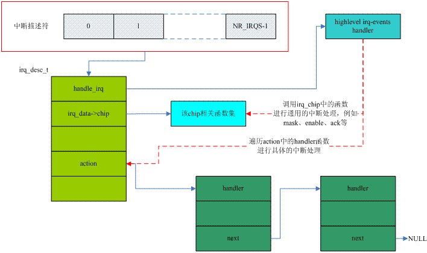

<!-- @import "[TOC]" {cmd="toc" depthFrom=1 depthTo=6 orderedList=false} -->

<!-- code_chunk_output -->

- [1 前言](#1-前言)
- [2 基本概念](#2-基本概念)
  - [2.1 通用中断的代码处理示意图](#21-通用中断的代码处理示意图)
  - [2.2 中断的打开和关闭](#22-中断的打开和关闭)
  - [2.3 IRQ number](#23-irq-number)
- [3 中断描述符数据结构](#3-中断描述符数据结构)
  - [3.1 底层 irq chip 相关的数据结构](#31-底层-irq-chip-相关的数据结构)
  - [3.2 irq chip 数据结构](#32-irq-chip-数据结构)
  - [3.3 中断描述符](#33-中断描述符)
- [4 初始化相关的中断描述符的接口](#4-初始化相关的中断描述符的接口)
  - [4.1 静态定义的中断描述符初始化](#41-静态定义的中断描述符初始化)
  - [4.2 使用 Radix tree 的中断描述符初始化](#42-使用-radix-tree-的中断描述符初始化)
  - [4.3 分配和释放中断描述符](#43-分配和释放中断描述符)
- [5 和中断控制器相关的中断描述符的接口](#5-和中断控制器相关的中断描述符的接口)
  - [5.1 接口调用时机](#51-接口调用时机)
  - [5.2 irq\_set\_chip](#52-irq_set_chip)
  - [5.3 irq\_set\_irq\_type](#53-irq_set_irq_type)
  - [5.4 irq\_set\_chip\_data](#54-irq_set_chip_data)
  - [5.5 设定 high level handler](#55-设定-high-level-handler)

<!-- /code_chunk_output -->

# 1 前言

本文主要围绕**IRQ number**和**中断描述符(interrupt descriptor**)这两个概念描述**通用中断处理过程**. 第二部分主要描述基本概念, 包括什么是 IRQ number, 什么是中断描述符等. 第三部分描述中断描述符数据结构的各个成员. 第四部分描述了初始化中断描述符相关的接口 API. 第五部分描述中断描述符相关的接口 API.

# 2 基本概念

## 2.1 通用中断的代码处理示意图

一个关于通用中断处理的示意图如下:



在 linux kernel 中, 对于**每一个外设**的**IRQ**都用**struct irq\_desc**来描述, 我们称之**中断描述符**(struct irq\_desc). linux kernel 中会有一个**数据结构**保存了关于**所有 IRQ 的中断描述符信息**, 我们称之中断描述符 DB(上图红色框中). 当**发生中断**后, 首先**获取**触发中断的**HW interupt ID**, 然后**通过 irq domain(！！！**)翻译(通过**irq\_find\_mapping**)成**IRQ number**, 然后通过**IRQ number**就可以获取**对应的中断描述符**. 调用**中断描述符**中的**highlevel irq\-events handler**来进行中断处理就 OK 了. 而 highlevel irq\-events handler 主要进行下面**两个操作**:

(1)调用**中断描述符**的**底层 irq chip driver**进行**mask**, **ack 等 callback 函数**, 进行**interrupt flow control**.

(2)调用该**中断描述符**上的**action list**中的**specific handler**(我们用这个**术语**来区分**具体中断 handler**和**high level 的 handler**). 这个步骤**不一定会执行**, 这是和中断描述符的当前状态相关, 实际上, **interrupt flow control 是软件**(设定一些标志位, 软件根据标志位进行处理)和**硬件**(mask 或者 unmask interrupt controller 等)一起控制完成的.

## 2.2 中断的打开和关闭

我们再来看看整个通用**中断处理过程**中的开关中断情况, **开关中断**有**两种(！！！**):

(1)开关**local CPU**的中断. 对于 UP, **关闭 CPU 中断**就**关闭了一切**, 永远不会被抢占. 对于**SMP**, 实际上, **没有关全局中断**这一说, 只能**关闭 local CPU**(代码运行的那个 CPU)

(2)控制 interrupt controller, 关闭**某个 IRQ number**对应的中断. 更准确的术语是**mask 或者 unmask 一个 IRQ**.

本节主要描述的是第一种, 也就是**控制 CPU 的中断**. 当**进入 high level handler**的时候, **CPU 的中断是关闭**的(**硬件！！！**在进入 IRQ processor mode 的时候设定的).

对于**外设的 specific handler**, 旧的内核(**2.6.35 版本之前**)认为有**两种**: **slow handler**和**fast handler**. 在**request irq**的时候, 对于**fast handler**, 需要**传递 IRQF\_DISABLED 的参数**, 确保其中断处理过程中是**关闭 CPU 的中断**, 因为是 fast handler, 执行很快, 即便是关闭 CPU 中断不会影响系统的性能. 但是, 并不是每一种外设中断的 handler 都是那么快(例如磁盘), 因此就有 slow handler 的概念, 说明其在中断处理过程中会耗时比较长. 对于这种情况, 如果在**整个 specific handler**中**关闭 CPU 中断**, 对系统的**performance 会有影响**. 因此, **对于 slow handler**, 在**从 high level handler**转入**specific handler**中间会根据**IRQF\_DISABLED 这个 flag**来决定**是否打开中断**, 具体代码如下(来自 2.6.23 内核):

```c
irqreturn_t handle_IRQ_event(unsigned int irq, struct irqaction *action)
{
    ......
    if (!(action->flags & IRQF_DISABLED))
        local_irq_enable_in_hardirq();
    ......
}
```

如果没有设定 IRQF\_DISABLED(slow handler), 则打开本 CPU 的中断. 然而, 随着软硬件技术的发展:

(1)硬件方面, CPU 越来越快, 原来 slow handler 也可以很快执行完毕

(2)软件方面, linux kernel 提供了更多更好的 bottom half 的机制

因此, 在**新的内核**中, 比如 3.14, **IRQF\_DISABLED 被废弃(！！！**)了. 我们可以思考一下, 为何要有 slow handler?每一个 handler 不都是应该迅速执行完毕, 返回中断现场吗?此外, **任意中断**可以**打断 slow handler**执行, 从而导致**中断嵌套加深**, 对内核栈也是考验. 因此, **新的内核**中在**interrupt specific handler**中是**全程关闭 CPU 中断(！！！**)的.

## 2.3 IRQ number

从 CPU 的角度看, 无论外部的 Interrupt controller 的结构是多么复杂, I do not care, 我只关心发生了一个指定外设的中断, 需要调用相应的外设中断的 handler 就 OK 了. 更准确的说是**通用中断处理模块不关心外部 interrupt controller 的组织细节**(电源管理模块当然要关注具体的设备(interrupt controller 也是设备)的拓扑结构). 一言以蔽之, 通用中断处理模块可以用一个**线性的 table**来管理一个个的**外部中断**, 这个表的每个元素就是一个**irq 描述符**, 在 kernel 中定义如下:

```c
struct irq_desc irq_desc[NR_IRQS] __cacheline_aligned_in_smp = {
    [0 ... NR_IRQS-1] = {
        .handle_irq    = handle_bad_irq,
        .depth        = 1,
        .lock        = __RAW_SPIN_LOCK_UNLOCKED(irq_desc->lock),
    }
};
```

系统中**每一个连接外设的中断线(irq request line**)用一个**中断描述符**来描述, 每一个外设的 interrupt request line 分配一个**中断号(irq number**), 系统中有**多少个中断线(或者叫做中断源**)就有多少个中断描述符(struct irq\_desc). NR\_IRQS 定义了该硬件平台 IRQ 的最大数目.

总之, 一个静态定义的表格, irq number 作为 index, 每个描述符都是紧密的排在一起, 一切看起来很美好, 但是现实很残酷的. 有些系统可能会定义一个很大的 NR\_IRQS, 但是只是想用其中的若干个, 换句话说, 这个静态定义的表格不是每个 entry 都是有效的, 有空洞, 如果使用**静态定义的表格**就会导致了**内存很大的浪费**. 为什么会有这种需求?我猜是和各个 interrupt controller 硬件的**interrupt ID 映射到 irq number 的算法有关**. 在这种情况下, **静态表格不适合**了, 我们改用一个**radix tree 来保存中断描述符(HW interrupt 作为索引**). 这时候, **每一个中断描述符**都是****动态分配****, 然后**插入到 radix tree**中. 如果你的系统采用这种策略, 那么需要打开**CONFIG\_SPARSE\_IRQ 选项(！！！**). 上面的示意图描述的是静态表格的中断描述符 DB, 如果打开 CONFIG\_SPARSE\_IRQ 选项, 系统使用 Radix tree 来保存中断描述符 DB, 不过概念和静态表格是类似的.

此外, 需要注意的是, 在旧内核中, IRQ number 和硬件的连接有一定的关系, 但是, 在引入 irq domain 后, IRQ number 已经变成一个单纯的 number, 和硬件没有任何关系.

# 3 中断描述符数据结构

## 3.1 底层 irq chip 相关的数据结构

**中断描述符**中应该会包括**底层 irq chip**相关的数据结构, linux kernel 中把这些数据组织在一起, 形成**struct irq\_data**, 具体代码如下:

```c
struct irq_data {
    u32            mask;－－－－－－－－－－TODO
    unsigned int        irq;－－－－－－－－IRQ number
    unsigned long        hwirq;－－－－－－－HW interrupt ID
    unsigned int        node;－－－－－－－NUMA node index
    unsigned int        state_use_accessors;－－－－－－－－底层状态, 参考 IRQD_xxxx
    struct irq_chip        *chip;－－－－－－－－－－该中断描述符对应的 irq chip 数据结构
    struct irq_domain    *domain;－－－－－－－－该中断描述符对应的 irq domain 数据结构
    void            *handler_data;－－－－－－－－和外设 specific handler 相关的私有数据
    void            *chip_data;－－－－－－－－－和中断控制器相关的私有数据
    struct msi_desc        *msi_desc;
    cpumask_var_t        affinity;－－－－－－－和 irq affinity 相关
};
```

**中断**有**两种形态**, 一种就是**直接通过 signal 相连**, 用**电平**或者**边缘触发**. 另外一种是**基于消息**的, 被称为**MSI (Message Signaled Interrupts**). msi\_desc 是 MSI 类型的中断相关, 这里不再描述.

**node 成员**用来**保存中断描述符**的**内存**位于**哪一个 memory node**上.  对于支持 NUMA(Non Uniform Memory Access Architecture)的系统, 其内存空间并不是均一的, 而是被划分成不同的 node, 对于不同的 memory node, CPU 其访问速度是不一样的. **如果一个 IRQ 大部分**(或者固定)由**某一个 CPU**处理, 那么在**动态分配中断描述符**的时候, 应该考虑**将内存分配在该 CPU 访问速度比较快的 memory node**上.

## 3.2 irq chip 数据结构

**Interrupt controller 描述符**(**struct irq\_chip**)包括了若干和具体 Interrupt controller 相关的 callback 函数, 我们总结如下:

成员名字 | 描述
---|---
name | 该**中断控制器的名字**, 用于/**proc/interrupts**中的显示
irq\_startup | start up 指定的**irq domain**上的 HW interrupt ID. 如果不设定的话, default 会被设定为 enable 函数
irq\_shutdown | shutdown 指定的 irq domain 上的 HW interrupt ID. 如果不设定的话, default 会被设定为 disable 函数
irq\_enable | enable 指定的 irq domain 上的 HW interrupt ID. 如果不设定的话, default 会被设定为 unmask 函数
irq\_disable | disable 指定的 irq domain 上的 HW interrupt ID.
irq\_ack | 和具体的硬件相关, 有些中断控制器必须在 Ack 之后(清除 pending 的状态)才能接受到新的中断.
irq\_mask | mask 指定的 irq domain 上的 HW interrupt ID
irq\_mask\_ack | mask 并 ack 指定的 irq domain 上的 HW interrupt ID.
irq\_unmask | mask 指定的 irq domain 上的 HW interrupt ID
irq\_eoi | 有些 interrupt controler(例如 GIC)提供了这样的寄存器接口, 让 CPU 可以通知 interrupt controller, 它已经处理完一个中断
irq\_set\_affinity | 在 SMP 的情况下, 可以通过该 callback 函数设定 CPU affinity
irq\_retrigger | 重新触发一次中断, 一般用在中断丢失的场景下. 如果硬件不支持 retrigger, 可以使用软件的方法.
irq\_set\_type | 设定指定的 irq domain 上的 HW interrupt ID 的触发方式, 电平触发还是边缘触发
irq\_set\_wake | 和电源管理相关, 用来 enable/disable 指定的 interrupt source 作为唤醒的条件.
irq\_bus\_lock | 有些 interrupt controller 是连接到慢速总线上(例如一个 i2c 接口的 IO expander 芯片), 在访问这些芯片的时候需要 lock 住那个慢速 bus(只能有一个 client 在使用 I2C bus)
irq\_bus\_sync\_unlock | 	unlock 慢速总线
irq\_suspend  | 电源管理相关的 callback 函数
irq\_resume  |
irq\_pm\_shutdown |
irq\_calc\_mask |
irq\_print\_chip | /proc/interrupts 中的信息显示

## 3.3 中断描述符

在 linux kernel 中, 使用**struct irq\_desc**来描述一个**外设的中断**, 我们称之中断描述符, 具体代码如下:

```c
struct irq_desc {
    struct irq_data        irq_data;
    unsigned int __percpu    *kstat_irqs;－－－－－－IRQ 的统计信息
    irq_flow_handler_t    handle_irq;－－－－－－－－(1)
    struct irqaction    *action; －－－－－－－－－－－(2)
    unsigned int        status_use_accessors;－－－－－中断描述符的状态, 参考 IRQ_xxxx
    unsigned int        core_internal_state__do_not_mess_with_it;－－－－(3)
    unsigned int        depth;－－－－－－－－－－(4)
    unsigned int        wake_depth;－－－－－－－－(5)
    unsigned int        irq_count;  －－－－－－－－－(6)
    unsigned long        last_unhandled;
    unsigned int        irqs_unhandled;
    raw_spinlock_t        lock;－－－－－－－－－－－(7)
    struct cpumask        *percpu_enabled;－－－－－－－(8)
#ifdef CONFIG_SMP
    const struct cpumask    *affinity_hint;－－－－和 irq affinity 相关, 后续单独文档描述
    struct irq_affinity_notify *affinity_notify;
#ifdef CONFIG_GENERIC_PENDING_IRQ
    cpumask_var_t        pending_mask;
#endif
#endif
    unsigned long        threads_oneshot; －－－－－(9)
    atomic_t        threads_active;
    wait_queue_head_t       wait_for_threads;
#ifdef CONFIG_PROC_FS
    struct proc_dir_entry    *dir;－－－－－－－－该 IRQ 对应的 proc 接口
#endif
    int            parent_irq;
    struct module        *owner;
    const char        *name;
} ____cacheline_internodealigned_in_smp
```

(1)**handle\_irq**就是**high level irq\-events handler(！！！**), 何谓 high level?站在高处自然看不到细节. 我认为 high level 是和 specific 相对, specific handler 处理具体的事务, 例如处理一个按键中断、处理一个磁盘中断. 而**high level**则是对处理各种**中断交互过程的一个抽象**, 根据下列硬件的不同:

(a)**中断控制器**

(b)**IRQ trigger type**

**highlevel irq\-events handler**可以分成:

(a)处理**电平触发**类型的中断 handler(**handle\_level\_irq**)

(b)处理**边缘触发**类型的中断 handler(**handle\_edge\_irq**)

(c)处理**简单类型**的中断 handler(**handle\_simple\_irq**)

(d)处理**EOI 类型**的中断 handler(**handle\_fasteoi\_irq**)

会另外有一份文档对 high level handler 进行更详细的描述.

(2)**action**指向一个**struct irqaction 的链表(！！！**). 如果**一个 interrupt request line 允许共享(即一个中断号被共享！！！**), 那么该**链表中的成员**可以是**多个**, 否则, 该链表只有一个节点.

(3)这个有着很长名字的符号**core\_internal\_state\_\_do\_not\_mess\_with\_it**在具体使用的时候被被简化成 istate, 表示**internal state**. 就像这个名字定义的那样, 我们最好不要直接修改它.

```c
#define istate core_internal_state__do_not_mess_with_it
```

(4)我们可以通过 enable 和 disable 一个指定的 IRQ 来控制内核的并发, 从而保护临界区的数据. 对一个 IRQ 进行 enable 和 disable 的操作可以嵌套(当然一定要成对使用), **depth**是描述**嵌套深度**的信息.

(5)wake\_depth 是和电源管理中的 wake up source 相关. 通过 irq\_set\_irq\_wake 接口可以 enable 或者 disable 一个 IRQ 中断是否可以把系统从 suspend 状态唤醒. 同样的, 对一个 IRQ 进行 wakeup source 的 enable 和 disable 的操作可以嵌套(当然一定要成对使用), wake\_depth 是描述嵌套深度的信息.

(6)irq\_count、last\_unhandled 和 irqs\_unhandled 用于处理 broken IRQ 的处理. 所谓 broken IRQ 就是由于种种原因(例如错误 firmware), IRQ handler 没有定向到指定的 IRQ 上, 当一个 IRQ 没有被处理的时候, kernel 可以为这个没有被处理的 handler 启动 scan 过程, 让系统中所有的 handler 来认领该 IRQ.

(7)保护该**中断描述符**的 spin lock.

(8)一个中断描述符可能会有**两种情况**, 一种是该**IRQ 是 global**, 一旦 disable 了该 irq, 那么对于所有的 CPU 而言都是 disable 的. 还有一种情况, 就是该**IRQ 是 per CPU 的**, 也就是说, 在某个 CPU 上 disable 了该 irq 只是 disable 了本 CPU 的 IRQ 而已, 其他的 CPU 仍然是 enable 的. **percpu\_enabled**是一个描述**该 IRQ 在各个 CPU 上是否 enable 成员**.

(9)threads\_oneshot、threads\_active 和 wait\_for\_threads 是和 IRQ thread 相关, 后续文档会专门描述.

# 4 初始化相关的中断描述符的接口

## 4.1 静态定义的中断描述符初始化

```c
int __init early_irq_init(void)
{
    int count, i, node = first_online_node;
    struct irq_desc *desc;

    init_irq_default_affinity();

    desc = irq_desc;
    count = ARRAY_SIZE(irq_desc);
    // 遍历整个 lookup table, 对每一个 entry 进行初始化
    for (i = 0; i < count; i++) {
        // 分配 per cpu 的 irq 统计信息需要的内存
        desc[i].kstat_irqs = alloc_percpu(unsigned int);
        // 分配中断描述符中需要的 cpu mask 内存
        alloc_masks(&desc[i], GFP_KERNEL, node);
        // 初始化 spin lock
        raw_spin_lock_init(&desc[i].lock);
        lockdep_set_class(&desc[i].lock, &irq_desc_lock_class);
        // 设定 default 值
        desc_set_defaults(i, &desc[i], node, NULL);
    }
    // 调用 arch 相关的初始化函数
    return arch_early_irq_init();
}
```

## 4.2 使用 Radix tree 的中断描述符初始化

```c
int __init early_irq_init(void)
{......
    // 体系结构相关的代码来决定预先分配的中断描述符的个数
    initcnt = arch_probe_nr_irqs();
    // initcnt 是需要在初始化的时候预分配的 IRQ 的个数
    if (initcnt > nr_irqs)
        // nr_irqs 是当前系统中 IRQ number 的最大值
        nr_irqs = initcnt;
    // 预先分配 initcnt 个中断描述符
    for (i = 0; i < initcnt; i++) {
        // 分配中断描述符
        desc = alloc_desc(i, node, NULL);
        // 设定已经 alloc 的 flag
        set_bit(i, allocated_irqs);
        // 插入 radix tree
        irq_insert_desc(i, desc);
    }
  ......
}
```

即便是配置了**CONFIG\_SPARSE\_IRQ 选项**, 在**中断描述符初始化**的时候, 也有机会**预先分配一定数量的 IRQ**. 这个数量由**arch\_probe\_nr\_irqs**决定, 对于 ARM 而言, 其 arch\_probe\_nr\_irqs 定义如下:

```c
int __init arch_probe_nr_irqs(void)
{
    nr_irqs = machine_desc->nr_irqs ? machine_desc->nr_irqs : NR_IRQS;
    return nr_irqs;
}
```

## 4.3 分配和释放中断描述符

对于使用 Radix tree 来保存中断描述符 DB 的 linux kernel, 其**中断描述符是动态分配**的, 可以使用**irq\_alloc\_descs**和**irq\_free\_descs**来**分配和释放中断描述符**. alloc\_desc 函数也会对中断描述符进行初始化, 初始化的内容和静态定义的中断描述符初始化过程是一样的. **最大可以分配的 ID**是**IRQ\_BITMAP\_BITS**, 定义如下:

```c
#ifdef CONFIG_SPARSE_IRQ
// 对于 Radix tree, 除了预分配的, 还可以动态分配 8196 个中断描述符
# define IRQ_BITMAP_BITS    (NR_IRQS + 8196)
#else
// 对于静态定义的, IRQ 最大值就是 NR_IRQS
# define IRQ_BITMAP_BITS    NR_IRQS
#endif
```

# 5 和中断控制器相关的中断描述符的接口

这部分的接口主要有两类, irq\_desc\_get\_xxx 和 irq\_set\_xxx, 由于 get 接口 API 非常简单, 这里不再描述, 主要描述 set 类别的接口 API. 此外, 还有一些**locked 版本的 set 接口 API**, 定义**为\_\_irq\_set\_xxx**, 这些 API 的**调用者**应该已经**持有保护 irq desc 的 spinlock**, 因此, 这些 locked 版本的接口没有中断描述符的 spin lock 进行操作. 这些接口有自己特定的使用场合, 这里也不详细描述了.

## 5.1 接口调用时机

kernel 提供了若干的接口 API 可以让内核其他模块可以**操作指定 IRQ number 的描述符结构**. 中断描述符中有**很多的成员**是和**底层的中断控制器**相关, 例如:

(1)该中断描述符对应的**irq chip**

(2)该中断描述符对应的**irq trigger type**

(3)**high level handler**

在**过去**, 系统中**各个 IRQ number**是**固定分配**的, 各个 IRQ 对应的中断控制器、触发类型等也都是清楚的, 因此, 一般都是在**machine driver 初始化**的时候**一次性**的进行设定. **machine driver 的初始化**过程会包括**中断系统的初始化**, 在 machine driver 的中断初始化函数中, 会调用本文定义的这些接口对各个 IRQ number 对应的中断描述符进行 irq chip、触发类型的设定.

在**引入了 device tree**、**动态分配 IRQ number**以及**irq domain**这些概念之后, 这些接口的**调用时机**移到各个**中断控制器的初始化**以及各个具体**硬件驱动初始化过程**中, 具体如下:

(1)各个**中断控制器**定义好自己的**struct irq\_domain\_ops callback 函数**, 主要是**map**和**translate**函数.

(2)在各个具体的**硬件驱动初始化过程**中, 通过 device tree 系统可以知道自己的**中断信息**(连接到哪一个 interrupt controler、使用该 interrupt controller 的那个 HW interrupt ID, trigger type 为何), 调用**对应的 irq domain**的 translate 进行翻译、解析. 之后可以**动态申请一个 IRQ number**并和**该硬件外设**的**HW interrupt ID 进行映射**, 调用**irq domain 对应的 map 函数**. 在**map 函数**中, 可以调用本节定义的接口进行**中断描述符底层 interrupt controller 相关信息的设定**.

## 5.2 irq\_set\_chip

这个接口函数用来设定中断描述符中 desc\->**irq\_data.chip 成员**, 具体代码如下:

```c
int irq_set_chip(unsigned int irq, struct irq_chip *chip)
{
    unsigned long flags;
    struct irq_desc *desc = irq_get_desc_lock(irq, &flags, 0); －－－－(1)

    desc->irq_data.chip = chip;
    irq_put_desc_unlock(desc, flags);－－－－(2)

    irq_reserve_irq(irq);－－－(3)
    return 0;
}
```

(1)获取**irq number**对应的**中断描述符**. 这里用**关闭中断**＋**spin lock**来保护中断描述符, **flag**中就是保存的**关闭中断之前的状态 flag**, 后面在(2)中会**恢复中断 flag**.

(3)前面我们说过, **irq number**有**静态表格定义**的, 也有**radix tree 类型**的. 对于**静态定义**的**中断描述符**, **没有 alloc**的概念. 但是, 对于**radix tree**类型, 需要首先**irq\_alloc\_desc**或者**irq\_alloc\_descs**来分配**一个或者一组 IRQ number**, 在这些 alloc 函数值, 就会 set 那些那些已经分配的 IRQ. 对于**静态表格**而言, 其 IRQ 没有分配, 因此, 这里通过**irq\_reserve\_irq**函数**标识该 IRQ 已经分配**, 虽然对于 CONFIG\_SPARSE\_IRQ(使用 radix tree)的配置而言, 这个操作重复了(在 alloc 的时候已经设定了).

## 5.3 irq\_set\_irq\_type

这个函数是用来设定**该 irq number**的**trigger type**的.

```c
int irq_set_irq_type(unsigned int irq, unsigned int type)
{
    unsigned long flags;
    struct irq_desc *desc = irq_get_desc_buslock(irq, &flags, IRQ_GET_DESC_CHECK_GLOBAL);
    int ret = 0;

    type &= IRQ_TYPE_SENSE_MASK;
    ret = __irq_set_trigger(desc, irq, type);
    irq_put_desc_busunlock(desc, flags);
    return ret;
}
```

来到这个接口函数, 第一个问题就是: 为何**irq\_set\_chip 接口**函数使用**irq\_get\_desc\_lock**来**获取中断描述符**, 而**irq\_set\_irq\_type**这个函数却需要**irq\_get\_desc\_buslock**呢?其实也很简单, **irq\_set\_chip**不需要访问底层的**irq chip(也就是 interrupt controller**), 但是 irq\_set\_irq\_type 需要. 设定一个**IRQ 的 trigger type**最终要调用**desc\->irq\_data.chip->irq\_set\_type**函数对底层的**interrupt controller 进行设定**. 这时候, 问题来了, 对于**嵌入 SOC 内部**的**interrupt controller**, 当然没有问题, 因为访问这些中断控制器的寄存器**memory map 到了 CPU 的地址空间**, 访问非常的**快**, 因此, **关闭中断**＋**spin lock**来保护中断描述符当然没有问题, 但是, 如果**该 interrupt controller**是一个**I2C 接口**的 IO expander 芯片(这类芯片是**扩展的 IO**, 也可以提供中断功能), 这时, 让其他 CPU 进行 spin 操作太**浪费 CPU 时间**了(**bus 操作太慢**了, 会 spin 很久的). 肿么办?当然只能是用其他方法**lock 住 bus**了(例如 mutex, 具体实现是和 irq chip 中的 irq\_bus\_lock 实现相关). 一旦 lock 住了 slow bus, 然后就可以关闭中断了(中断状态保存在 flag 中).

解决了 bus lock 的疑问后, 还有一个看起来奇奇怪怪的宏: **IRQ\_GET\_DESC\_CHECK\_GLOBAL**. 为何在 irq\_set\_chip 函数中不设定检查(check 的参数是 0), 而在 irq\_set\_irq\_type 接口函数中要设定 global 的 check, 到底是什么意思呢?既然要检查, 那么检查什么呢?和"**global**"对应的**不是 local**而是"**per CPU**", 内核中的宏定义是: IRQ\_GET\_DESC\_CHECK\_PERCPU. **SMP 情况**下, 从系统角度看, 中断有**两种形态(或者叫 mode**):

(1)1\-N mode. **只有 1 个 processor 处理中断**

(2)N\-N mode. **所有的 processor**都是**独立的收到中断**, 如果有 N 个 processor 收到中断, 那么就有 N 个处理器来处理该中断.

听起来有些抽象, 我们还是用 GIC 作为例子来具体描述. 在**GIC**中, **SPI 使用 1\-N 模型**, 而**PPI 和 SGI 使用 N\-N 模型**.

对于 SPI, 由于采用了 1\-N 模型, 系统(硬件加上软件)必须保证**一个中断被一个 CPU 处理**. 对于 GIC, **一个 SPI 的中断**可以 trigger**多个 CPU**的**interrupt line**(如果 Distributor 中的**Interrupt Processor Targets Registers 有多个 bit 被设定**), 但是, 该 interrupt source 和 CPU 的**接口寄存器**(例如 ack register)**只有一套**, 也就是说, **这些寄存器接口是全局**的, 是 global 的, 一旦一个 CPU ack(读 Interrupt Acknowledge Register, 获取 interrupt ID)了该中断, 那么其他的 CPU 看到的该 interupt source 的状态也是已经 ack 的状态. 在这种情况下, 如果第二个 CPU ack 该中断的时候, 将获取一个 spurious interrupt ID.

对于**PPI 或者 SGI**, 使用**N\-N mode**, 其**interrupt source 的寄存器**是**per CPU**的, 也就是**每个 CPU**都有**自己的**、针对该 interrupt source 的寄存器接口(这些寄存器叫做 banked register). **一个 CPU **清除了**该**interrupt source 的 pending 状态**, 其他的 CPU**感知不到**这个变化, 它们仍然认为该中断是 pending 的.

对于**irq\_set\_irq\_type**这个接口函数, 它是为**1\-N mode 的 interrupt source 使用**的. 如果**底层设定**该 interrupt 是**per CPU 的**, 那么**irq\_set\_irq\_type 要返回错误(！！！**).

## 5.4 irq\_set\_chip\_data

**每个 irq chip**总有自己**私有的数据**, 我们称之**chip data**. 具体设定 chip data 的代码如下:

```c
int irq_set_chip_data(unsigned int irq, void *data)
{
    unsigned long flags;
    struct irq_desc *desc = irq_get_desc_lock(irq, &flags, 0);
    desc->irq_data.chip_data = data;
    irq_put_desc_unlock(desc, flags);
    return 0;
}
```

多么清晰、多么明了, 需要文字继续描述吗?

## 5.5 设定 high level handler

这是中断处理的**核心内容**, \_\_irq\_set\_handler 就是设定 high level handler 的接口函数, 不过一般不会直接调用, 而是通过**irq\_set\_chip\_and\_handler\_name**或者**irq\_set\_chip\_and\_handler**来进行设定. 具体代码如下:

```c
void __irq_set_handler(unsigned int irq, irq_flow_handler_t handle, int is_chained, const char *name)
{
    unsigned long flags;
    struct irq_desc *desc = irq_get_desc_buslock(irq, &flags, 0);

......
    desc->handle_irq = handle;
    desc->name = name;

    if (handle != handle_bad_irq && is_chained) {
        irq_settings_set_noprobe(desc);
        irq_settings_set_norequest(desc);
        irq_settings_set_nothread(desc);
        irq_startup(desc, true);
    }
out:
    irq_put_desc_busunlock(desc, flags);
}
```
理解这个函数的关键是在**is\_chained**这个参数. 这个参数是用在**interrupt 级联**的情况下. 例如**中断控制器 B**级联到中断控制器**A 的第 x 个 interrupt source**上. 那么对于**A 上的 x 这个 interrupt**而言, 在设定其 IRQ handler 参数的时候要设定**is\_chained 参数等于 1**, 由于**这个 interrupt source**用于**级联**, 因此**不能 probe**、**不能被 request**(已经被中断控制器 B 使用了), **不能被 threaded**(具体中断线程化的概念在其他文档中描述)