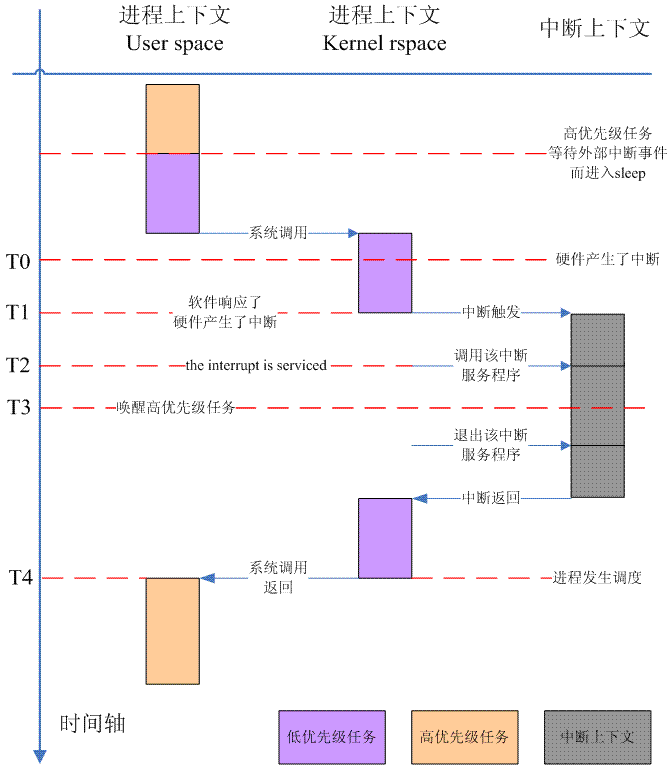

<!-- @import "[TOC]" {cmd="toc" depthFrom=1 depthTo=6 orderedList=false} -->

<!-- code_chunk_output -->

- [1 前言](#1-前言)
- [2 和中断相关的 linux 实时性分析以及中断线程化的背景介绍](#2-和中断相关的-linux-实时性分析以及中断线程化的背景介绍)
  - [2.1 非抢占式 linux 内核的实时性](#21-非抢占式-linux-内核的实时性)
  - [2.2 抢占式 linux 内核的实时性](#22-抢占式-linux-内核的实时性)
  - [2.3 进一步提高 linux 内核的实时性](#23-进一步提高-linux-内核的实时性)
- [3 request\_threaded\_irq 的接口规格](#3-request_threaded_irq-的接口规格)
  - [3.1 输入参数描述](#31-输入参数描述)
  - [3.2 输出参数描述](#32-输出参数描述)
  - [3.3 Interrupt type flags](#33-interrupt-type-flags)
- [4 request\_threaded\_irq 代码分析](#4-request_threaded_irq-代码分析)
  - [4.1 request\_threaded\_irq 主流程](#41-request_threaded_irq-主流程)
  - [4.2 注册 irqaction](#42-注册-irqaction)
    - [4.2.1 nested IRQ 的处理代码](#421-nested-irq-的处理代码)
    - [4.2.2 forced irq threading 处理](#422-forced-irq-threading-处理)
    - [4.2.3 创建 interrupt 线程](#423-创建-interrupt-线程)
  - [4.2.4 共享中断的检查](#424-共享中断的检查)
    - [4.2.5 thread mask 的设定](#425-thread-mask-的设定)
    - [4.2.6 用户 IRQ flag 和底层 interrupt flag 的同步](#426-用户-irq-flag-和底层-interrupt-flag-的同步)

<!-- /code_chunk_output -->

# 1 前言

本文主要的议题是作为一个普通的驱动工程师, 在撰写自己负责的驱动的时候, 如何向 Linux Kernel 中的中断子系统注册中断处理函数?为了理解注册中断的接口, 必须了解一些中断线程化(threaded interrupt handler)的基础知识, 这些在第二章描述. 第三章主要描述了驱动申请 interrupt line 接口 API request\_threaded\_irq 的规格. 第四章是进入 request\_threaded\_irq 的实现细节, 分析整个代码的执行过程.

# 2 和中断相关的 linux 实时性分析以及中断线程化的背景介绍

## 2.1 非抢占式 linux 内核的实时性

在遥远的过去, **linux2.4 之前的内核**是**不支持抢占**特性的, 具体可以参考下图:



事情的开始源自**高优先级任务**(橘色 block)由于要**等待外部事件**(例如网络数据)而**进入睡眠**, 调度器调度了某个**低优先级的任务**(紫色 block)执行. 该低优先级任务欢畅的执行, 直到触发了一次系统调用(例如通过 read()文件接口读取磁盘上的文件等)而进入了内核态. 仍然是熟悉的配方, 仍然是熟悉的味道, 低优先级任务正在执行不会变化, 只不过从 user space 切换到了 kernel space. 外部事件总是在你不想让它来的时候到来, T0 时刻, **高优先级**任务等待的那个**中断事件发生**了.

中断虽然发生了, 但软件不一定立刻响应, 可能由于在内核态执行的某些操作不希望被外部事件打断而**主动关闭了中断**(或是**关闭了 CPU 的中断**, 或者**MASK 了该 IRQ number**), 这时候, 中断信号没有立刻得到响应, 软件仍然在内核态执行低优先级任务系统调用的代码. 在 T1 时刻, 内核态代码由于退出临界区而打开中断(注意: 上图中的比例是不协调的, 一般而言, linux kernel 不会有那么长的关中断时间, 上面主要是为了表示清楚, 同理, 从中断触发到具体中断服务程序的执行也没有那么长, 都是为了表述清楚), 中断一旦打开, 立刻跳转到了异常向量地址, interrupt handler 抢占了低优先级任务的执行, 进入中断上下文(虽然这时候的 current task 是低优先级任务, 但是中断上下文和它没有任何关系).

从 CPU 开始处理中断到具体中断服务程序被执行还需要一个分发的过程. 这个期间系统要做的主要操作包括确定 HW interrupt ID, 确定 IRQ Number, ack 或者 mask 中断, 调用中断服务程序等. T0 到 T2 之间的 delay 被称为中断延迟(Interrupt Latency), 主要包括两部分, 一部分是 HW 造成的 delay(硬件的中断系统识别外部的中断事件并 signal 到 CPU), 另外一部分是软件原因(内核代码中由于要保护临界区而关闭中断引起的).

该中断的服务程序执行完毕(在其执行过程中, T3 时刻, 会唤醒高优先级任务, 让它从 sleep 状态进入 runable 状态), 返回低优先级任务的系统调用现场, 这时候并不存在一个抢占点, 低优先级任务要完成系统调用之后, 在返回用户空间的时候才出现抢占点. 漫长的等待之后, T4 时刻, 调度器调度高优先级任务执行. 有一个术语叫做任务响应时间(Task Response Time)用来描述 T3 到 T4 之间的 delay.

## 2.2 抢占式 linux 内核的实时性

2.6 内核和 2.4 内核显著的不同是提供了一个**CONFIG\_PREEMPT**的选项, 打开该选项后, linux kernel 就支持了**内核代码的抢占(当然不能在临界区**), 其行为如下:


T0 到 T3 的操作都是和上一节的描述一样的, 不同的地方是在 T4. 对于 2.4 内核, 只有返回用户空间的时候才有抢占点出现, 但是对于抢占式内核而言, 即便是从中断上下文返回内核空间的进程上下文, **只要内核代码不在临界区内**, 就可以**发生调度**, 让**最高优先级的任务调度执行**.

在非抢占式 linux 内核中, 一个任务的内核态是不可以被其他进程抢占的. 这里并不是说 kernel space 不可以被抢占, 只是说进程通过系统调用陷入到内核的时候, 不可以被其他的进程抢占. 实际上, 中断上下文当然可以抢占进程上下文(无论是内核态还是用户态), 更进一步, **中断上下文是拥有至高无上的权限**, 它甚至可以**抢占其他的中断上下文**. 引入抢占式内核后, 系统的平均任务响应时间会缩短, 但是, 实时性更关注的是: 无论在任何的负载情况下, 任务响应时间是确定的. 因此, 更需要关注的是 worst\-case 的任务响应时间. 这里有两个因素会影响 worst case latency:

(1)为了**同步**, 内核中总有些代码需要持有**自旋锁资源**, 或者**显式的调用 preempt\_disable**来**禁止抢占**, 这时候不允许抢占

(2)**中断上下文**(并非只是**中断 handler**, 还包括**softirq**、**timer**、**tasklet！！！中断上下文！！！**)总是可以抢占**进程上下文**

因此, 即便是**打开了 PREEMPT 的选项**, 实际上 linux 系统的**任务响应时间仍然是不确定**的. 一方面**内核代码的临界区非常多**, 我们需要找到, 系统中持有锁, 或者禁止抢占的最大的时间片. 另外一方面, 在上图的 T4 中, 能顺利的调度高优先级任务并非易事, 这时候可能有触发的软中断, 也可能有新来的中断, 也可能某些 driver 的 tasklet 要执行, 只有在没有任何 bottom half 的任务要执行的时候, 调度器才会启动调度.

## 2.3 进一步提高 linux 内核的实时性

通过上一个小节的描述, 相信大家都确信**中断对 linux 实时性是最大的敌人**. 那么怎么破?我曾经接触过一款 RTOS, 它的中断 handler 非常简单, 就是发送一个 inter\-task message 到该 driver thread, 对任何的一个驱动都是如此处理. 这样, 每个中断上下文都变得非常简短, 而且每个中断都是一致的. 在这样的设计中, 外设中断的处理线程化了, 然后, 系统设计师要仔细的为每个系统中的 task 分配优先级, 确保整个系统的实时性.

在 Linux kernel 中, 一个**外设的中断处理**被分成**top half**和**bottom half**, top half 进行最关键, 最基本的处理, 而比较**耗时的操作**被放到**bottom half(softirq、tasklet**)中**延迟执行**. 虽然 bottom half 被延迟执行, 但**始终都是先于进程执行**的. 为何不让这些耗时的 bottom half 和普通进程公平竞争呢?因此, linux kernel 借鉴了 RTOS 的某些特性, 对那些**耗时的驱动 interrupt handler**进行**线程化处理**, 在内核的抢占点上, 让线程(无论是内核线程还是用户空间创建的线程, 还是驱动的 interrupt thread)在一个舞台上竞争 CPU.

# 3 request\_threaded\_irq 的接口规格

## 3.1 输入参数描述

输入参数 | 描述
---|---
irq | 要注册 handler 的那个**IRQ number**. 这里要注册的**handler 包括两个**, 一个是传统意义的中断 handler, 我们称之**primary handler**, 另外一个是**threaded interrupt handler**
handler | **primary handler**. 需要注意的是 primary handler 和 threaded interrupt handler**不能同时为空**, 否则会出错
thread\_fn | threaded interrupt handler. 如果该参数**不是 NULL**, 那么系统会**创建一个 kernel thread**, 调用的 function 就是 thread\_fn
irqflags | 参见第三节
devname |
dev\_id | 参见第四章, 第一节中的描述.

## 3.2 输出参数描述

**0 表示成功执行**, 负数表示各种错误原因.

## 3.3 Interrupt type flags

flag 定义 | 描述
---|---
IRQF\_TRIGGER\_XXX | 描述该 interrupt line 触发类型的 flag
IRQF\_DISABLED | 首先要说明的是这是一个废弃的 flag, 在新的内核中, 该 flag 没有任何的作用了. 具体可以参考: [Disabling IRQF\_DISABLED](http://lwn.net/Articles/380931/) <br>旧的内核(2.6.35 版本之前)认为有两种 interrupt handler: slow handler 和 fast handle. 在 request irq 的时候, 对于 fast handler, 需要传递 IRQF_DISABLED 的参数, 确保其中断处理过程中是关闭 CPU 的中断, 因为是 fast handler, 执行很快, 即便是关闭 CPU 中断不会影响系统的性能. 但是, 并不是每一种外设中断的 handler 都是那么快(例如磁盘), 因此就有 slow handler 的概念, 说明其在中断处理过程中会耗时比较长. 对于这种情况, 在执行 interrupt handler 的时候不能关闭 CPU 中断, 否则对系统的 performance 会有影响. <br>新的内核已经不区分 slow handler 和 fast handle, 都是 fast handler, 都是需要关闭 CPU 中断的, 那些需要后续处理的内容推到 threaded interrupt handler 中去执行.
IRQF\_SHARED | 这是 flag 用来描述一个 interrupt line 是否允许在多个设备中共享. 如果中断控制器可以支持足够多的 interrupt source, 那么在两个外设间共享一个 interrupt request line 是不推荐的, 毕竟有一些额外的开销(发生中断的时候要逐个询问是不是你的中断, 软件上就是遍历 action list), 因此外设的 irq handler 中最好是一开始就启动判断, 看看是否是自己的中断, 如果不是, 返回 IRQ\_NONE,表示这个中断不归我管.  早期 PC 时代, 使用 8259 中断控制器, 级联的 8259 最多支持 15 个外部中断, 但是 PC 外设那么多, 因此需要 irq share. 现在, ARM 平台上的系统设计很少会采用外设共享 IRQ 方式, 毕竟一般 ARM SOC 提供的有中断功能的 GPIO 非常的多, 足够用的.  当然, 如果确实需要两个外设共享 IRQ, 那也只能如此设计了. 对于 HW, 中断控制器的一个 interrupt source 的引脚要接到两个外设的 interrupt request line 上, 怎么接?直接连接可以吗?当然不行, 对于低电平触发的情况, 我们可以考虑用与门连接中断控制器和外设.
IRQF\_PROBE\_SHARED | IRQF\_SHARED 用来表示该 interrupt action descriptor 是允许和其他 device 共享一个 interrupt line(IRQ number), 但是实际上是否能够 share 还是需要其他条件: 例如触发方式必须相同. 有些驱动程序可能有这样的调用场景: 我只是想 scan 一个 irq table, 看看哪一个是 OK 的, 这时候, 如果即便是不能和其他的驱动程序 share 这个 interrupt line, 我也没有关系, 我就是想 scan 看看情况. 这时候, caller 其实可以预见 sharing mismatche 的发生, 因此, 不需要内核打印"Flags mismatch irq......"这样冗余的信息
IRQF\_PERCPU | 在 SMP 的架构下, 中断有两种 mode, 一种中断是在所有 processor 之间共享的, 也就是 global 的, 一旦中断产生, interrupt controller 可以把这个中断送达多个处理器. 当然, 在具体实现的时候不会同时将中断送达多个 CPU, 一般是软件和硬件协同处理, 将中断送达一个 CPU 处理. 但是一段时间内产生的中断可以平均(或者按照既定的策略)分配到一组 CPU 上. 这种 interrupt mode 下, interrupt controller 针对该中断的 operational register 是 global 的, 所有的 CPU 看到的都是一套寄存器, 一旦一个 CPU ack 了该中断, 那么其他的 CPU 看到的该 interupt source 的状态也是已经 ack 的状态. <br>和 global 对应的就是 per cpu interrupt 了, 对于这种 interrupt, 不是 processor 之间共享的, 而是特定属于一个 CPU 的. 例如 GIC 中 interrupt ID 等于 30 的中断就是 per cpu 的(这个中断 event 被用于各个 CPU 的 local timer), 这个中断号虽然只有一个, 但是, 实际上控制该 interrupt ID 的寄存器有 n 组(如果系统中有 n 个 processor), 每个 CPU 看到的是不同的控制寄存器. 在具体实现中, 这些寄存器组有两种形态, 一种是 banked, 所有 CPU 操作同样的寄存器地址, 硬件系统会根据访问的 cpu 定向到不同的寄存器, 另外一种是 non banked, 也就是说, 对于该 interrupt source, 每个 cpu 都有自己独特的访问地址.
IRQF\_NOBALANCING | 这也是和 multi-processor 相关的一个 flag. 对于那些可以在多个 CPU 之间共享的中断, 具体送达哪一个 processor 是有策略的, 我们可以在多个 CPU 之间进行平衡. 如果你不想让你的中断参与到 irq balancing 的过程中那么就设定这个 flag
IRQF\_IRQPOLL |
IRQF\_ONESHOT | one shot 本身的意思的只有一次的, 结合到中断这个场景, 则表示中断是一次性触发的, 不能嵌套. 对于 primary handler, 当然是不会嵌套, 但是对于 threaded interrupt handler, 我们有两种选择, 一种是 mask 该 interrupt source, 另外一种是 unmask 该 interrupt source. 一旦 mask 住该 interrupt source, 那么该 interrupt source 的中断在整个 threaded interrupt handler 处理过程中都是不会再次触发的, 也就是 one shot 了. 这种 handler 不需要考虑重入问题. <br>具体是否要设定 one shot 的 flag 是和硬件系统有关的, 我们举一个例子, 比如电池驱动, 电池里面有一个电量计, 是使用 HDQ 协议进行通信的, 电池驱动会注册一个 threaded interrupt handler, 在这个 handler 中, 会通过 HDQ 协议和电量计进行通信. 对于这个 handler, 通过 HDQ 进行通信是需要一个完整的 HDQ 交互过程, 如果中间被打断, 整个通信过程会出问题, 因此, 这个 handler 就必须是 one shot 的.
IRQF\_NO\_SUSPEND | 这个 flag 比较好理解, 就是说在系统 suspend 的时候, 不用 disable 这个中断, 如果 disable, 可能会导致系统不能正常的 resume.
IRQF\_FORCE\_RESUME | 在系统 resume 的过程中, 强制必须进行 enable 的动作, 即便是设定了 IRQF_NO_SUSPEND 这个 flag. 这是和特定的硬件行为相关的.
IRQF\_NO\_THREAD | 有些 low level 的 interrupt 是不能线程化的(例如系统 timer 的中断), 这个 flag 就是起这个作用的. 另外, 有些级联的 interrupt controller 对应的 IRQ 也是不能线程化的(例如 secondary GIC 对应的 IRQ), 它的线程化可能会影响一大批附属于该 interrupt controller 的外设的中断响应延迟.
IRQF\_EARLY\_RESUME |
IRQF\_TIMER	|

# 4 request\_threaded\_irq 代码分析

## 4.1 request\_threaded\_irq 主流程

```c
int request_threaded_irq(unsigned int irq, irq_handler_t handler,
             irq_handler_t thread_fn, unsigned long irqflags,
             const char *devname, void *dev_id)
{
    if ((irqflags & IRQF_SHARED) && !dev_id)－－－(1)
        return -EINVAL;

    desc = irq_to_desc(irq); －－－－－(2)
    if (!desc)         return -EINVAL;

    if (!irq_settings_can_request(desc) || －－－－(3)
        WARN_ON(irq_settings_is_per_cpu_devid(desc)))
        return -EINVAL;

    if (!handler) { －－－－(4)
        if (!thread_fn)
            return -EINVAL;
        handler = irq_default_primary_handler;
    }

    action = kzalloc(sizeof(struct irqaction), GFP_KERNEL);

    action->handler = handler;
    action->thread_fn = thread_fn;
    action->flags = irqflags;
    action->name = devname;
    action->dev_id = dev_id;

    chip_bus_lock(desc);
    retval = __setup_irq(irq, desc, action); －－－(5)
    chip_bus_sync_unlock(desc);
}
```

(1)对于那些需要**共享的中断**, 在**request irq**的时候需要给出**dev id**, 否则会出错退出. 为何对于 IRQF\_SHARED 的中断必须要给出 dev id 呢?实际上, 在**共享**的情况下, **一个 IRQ number**对应**若干个 irqaction(！！！**), 当操作 irqaction 的时候, 仅仅给出 IRQ number 就不是非常的足够了, 这时候, 需要**一个 ID 表示具体的 irqaction**, 这里就是 dev\_id 的作用了. 我们举一个例子:

```c
void free_irq(unsigned int irq, void *dev_id)
```

当**释放一个 IRQ 资源**的时候, 不但要**给出 IRQ number**, 还要给出**device ID**. 只有这样, 才能精准的把**要释放的那个 irqaction**从 irq action list 上移除. dev\_id 在中断处理中有没有作用呢?我们来看看 source code:

```c
irqreturn_t handle_irq_event_percpu(struct irq_desc *desc, struct irqaction *action)
{
    do {
        irqreturn_t res;
        res = action->handler(irq, action->dev_id);
......
        action = action->next;
    } while (action);
......
}
```

linux interrupt framework 虽然支持**中断共享**, 但是它并不会协助解决识别问题, 它只会**遍历该 IRQ number**上注册的**irqaction 的 callback 函数**, 这样, 虽然只是**一个外设产生的中断**, linux kernel 还是把**所有共享的那些中断 handler 都逐个调用执行(！！！**). 为了让系统的 performance 不受影响, **irqaction 的 callback**函数必须在**函数的最开始**进行判断, **是否是自己的硬件设备产生了中断！！！**(读取**硬件的寄存器**), 如果不是, 尽快的退出.

需要注意的是, 这里**dev\_id**并**不能**在中断触发的时候用来**标识需要调用哪一个 irqaction 的 callback 函数**, 通过上面的代码也可以看出, dev\_id 有些类似一个参数传递的过程, 可以把具体 driver 的一些硬件信息, 组合成一个 structure, 在触发中断的时候可以把这个 structure 传递给中断处理函数.

(2)通过**IRQ number**获取对应的**中断描述符**. 在引入**CONFIG\_SPARSE\_IRQ**选项后, 这个转换变得不是那么简单了. 在过去, 我们会以 IRQ number 为 index, 从**irq\_desc 这个全局数组**中直接获取中断描述符. 如果配置 CONFIG\_SPARSE\_IRQ 选项, 则需要从**radix tree**中搜索. CONFIG\_SPARSE\_IRQ 选项的更详细的介绍请参考 IRQ number 和中断描述符

(3)并非系统中所有的 IRQ number 都可以 request, 有些中断描述符被标记为**IRQ\_NOREQUEST**, 标识该 IRQ number**不能被其他的驱动 request**. 一般而言, 这些 IRQ number 有**特殊的作用**, 例如用于**级联**的那个 IRQ number 是不能 request. **irq\_settings\_can\_request**函数就是**判断一个 IRQ 是否可以被 request**.

**irq\_settings\_is\_per\_cpu\_devid**函数用来**判断一个中断描述符是否需要传递 per cpu 的 device ID**. per cpu 的中断上面已经描述的很清楚了, 这里不再细述. 如果一个**中断描述符对应的中断 ID 是 per cpu 的**, 那么在**申请其 handler**的时候就有**两种情况**, 一种是传递**统一的 dev\_id 参数**(传入 request\_threaded\_irq 的最后一个参数), 另外一种情况是**针对每个 CPU**, 传递**不同的 dev\_id 参数**. 在这种情况下, 我们需要调用**request\_percpu\_irq 接口**函数而不是 request\_threaded\_irq.

(4)传入**request\_threaded\_irq**的**primary handler**和**threaded handler**参数有下面四种组合:

primary handler	| threaded handler | 描述
---|---|---
NULL | NULL | 函数出错, 返回\-EINVAL
设定 | 设定 | 正常流程. 中断处理被合理的分配到 primary handler 和 threaded handler 中.
设定 | NULL | 中断处理都是在**primary handler**中完成
NULL | 设定 | 这种情况下, 系统会帮忙设定一个**default 的 primary handler**: irq\_default\_primary\_handler, **协助唤醒 threaded handler 线程**

(5)这部分的代码很简单, **分配 struct irqaction**, 赋值, 调用\_\_setup\_irq 进行实际的注册过程. 这里要罗嗦几句的是锁的操作, 在内核中, 有很多函数, 有的是需要**调用者自己加锁保护**的, 有些是**不需要加锁保护**的. 对于这些场景, linux kernel 采取了统一的策略: **基本函数名字是一样**的, 只不过需要**调用者自己加锁保护**的那个函数需要**增加\_\_的前缀**, 例如内核有有下面两个函数: setup\_irq 和\_\_setup\_irq. 这里, 我们在 setup irq 的时候已经调用**chip\_bus\_lock**进行保护, 因此使用 lock free 的版本\_\_setup\_irq.

chip\_bus\_lock 定义如下:

```c
static inline void chip_bus_lock(struct irq_desc *desc)
{
    if (unlikely(desc->irq_data.chip->irq_bus_lock))
        desc->irq_data.chip->irq_bus_lock(&desc->irq_data);
}
```

大部分的 interrupt controller 并没有定义 irq\_bus\_lock 这个 callback 函数, 因此 chip\_bus\_lock 这个函数对大多数的中断控制器而言是没有实际意义的. 但是, 有些 interrupt controller 是连接到慢速总线上的, 例如一个 i2c 接口的 IO expander 芯片(这种芯片往往也提供若干有中断功能的 GPIO, 因此也是一个 interrupt controller), 在访问这种 interrupt controller 的时候需要 lock 住那个慢速 bus(只能有一个 client 在使用 I2C bus).

## 4.2 注册 irqaction

### 4.2.1 nested IRQ 的处理代码

在看具体的代码之前, 我们首先要理解什么是**nested IRQ**. nested IRQ 不是 cascade IRQ, 在 GIC 代码分析中我们有描述过 cascade IRQ 这个概念, 主要用在 interrupt controller 级联的情况下. 为了方便大家理解, 我还是给出一个具体的例子吧, 具体的 HW block 请参考下图:


上图是一个两个 GIC 级联的例子, 所有的 HW block 封装在了一个 SOC chip 中. 为了方便描述, 我们先进行编号: **Secondary GIC**的**IRQ number 是 A**, **外设 1**的 IRQ number 是 B, 外设 2 的 IRQ number 是 C. 对于上面的硬件, **linux kernel**处理如下:

(a)**IRQ A**的**中断描述符**被设定为**不能注册 irqaction**(不能注册**specific interrupt handler！！！**, 或者叫中断服务程序)

(b)**IRQ A**的**high level irq\-events handler**(处理**interrupt flow control！！！**)负责进行**IRQ number 的映射**, 在其**irq domain**上翻译出**具体外设的 IRQ number**, 并**重新定向**到**外设 IRQ number**对应的**highlevel irq\-events handler(！！！**).

(c)所有外设驱动的中断正常 request irq, 可以**任意选择线程化的 handler**, 或者**只注册 primary handler**.

需要注意的是, 对**root GIC**和**Secondary GIC**寄存器的访问非常快, 因此 ack、mask、EOI 等操作也非常快.

我们再看看另外一个**interrupt controller 级联**的情况:


IO expander HW block 提供了有中断功能的 GPIO, 因此它也是一个 interrupt controller, 有它自己的 irq domain 和 irq chip. 上图中外设 1 和外设 2 使用了 IO expander 上有中断功能的 GPIO, 它们有属于自己的 IRQ number 以及中断描述符. IO expander HW block 的 IRQ line 连接到 SOC 内部的 interrupt controller 上, 因此, 这也是一个 interrupt controller 级联的情况, 对于这种情况, 我们是否可以采用和上面 GIC 级联的处理方式呢?

不行, 对于 GIC 级联的情况, 如果 secondary GIC 上的外设 1 产生了中断, 整个关中断的时间是 IRQ A 的中断描述符的 highlevel irq\-events handler 处理时间＋IRQ B 的的中断描述符的 highlevel irq\-events handler 处理时间＋外设 1 的 primary handler 的处理时间. 所幸对 root GIC 和 Secondary GIC 寄存器的访问非常快, 因此整个关中断的时间也不是非常的长. 但是如果是 IO expander 这个情况, 如果采取和上面 GIC 级联的处理方式一样的话, 关中断的时间非常长. 我们还是用外设 1 产生的中断为例子好了. 这时候, 由于 IRQ B 的的中断描述符的 highlevel irq\-events handler 处理设计 I2C 的操作, 因此时间非常的长, 这时候, 对于整个系统的实时性而言是致命的打击. 对这种硬件情况, linux kernel 处理如下:

(a)IRQ A 的中断描述符的 highlevel irq\-events handler 根据实际情况进行设定, 并且允许注册 irqaction. 对于连接到 IO expander 上的外设, 它是没有 real time 的要求的(否则也不会接到 IO expander 上), 因此一般会进行线程化处理. 由于 threaded handler 中涉及 I2C 操作, 因此要设定 IRQF\_ONESHOT 的 flag.

(b)在 IRQ A 的中断描述符的 threaded interrupt handler 中进行进行 IRQ number 的映射, 在 IO expander irq domain 上翻译出具体外设的 IRQ number, 并直接调用 handle\_nested\_irq 函数处理该 IRQ.

(c)外设对应的中断描述符设定 IRQ\_NESTED\_THREAD 的 flag, 表明这是一个 nested IRQ. nested IRQ 没有 highlevel irq\-events handler, 也没有 primary handler, 它的 threaded interrupt handler 是附着在其 parent IRQ 的 threaded handler 上的.

具体的 nested IRQ 的处理代码如下:

```c
static int __setup_irq(unsigned int irq, struct irq_desc *desc, struct irqaction *new)
{
......
    nested = irq_settings_is_nested_thread(desc);
    if (nested) {
        if (!new->thread_fn) {
            ret = -EINVAL;
            goto out_mput;
        }
        new->handler = irq_nested_primary_handler;
    } else {
......
    }
......
}
```
如果一个**中断描述符是 nested thread type**的, 说明这个**中断描述符**应该设定**threaded interrupt handler**(当然, 内核是**不会单独创建一个 thread**的, 它是借着**其 parent IRQ**的**interrupt thread 执行**), 否则就会出错返回. 对于 primary handler, 它应该没有机会被调用到, 当然为了调试, kernel 将其设定为 irq\_nested\_primary\_handler, 以便在调用的时候打印一些信息, 让工程师直到发生了什么状况.

### 4.2.2 forced irq threading 处理

具体的 forced irq threading 的处理代码如下:

```c
static int __setup_irq(unsigned int irq, struct irq_desc *desc, struct irqaction *new)
{
......
    nested = irq_settings_is_nested_thread(desc);
    if (nested) {
......
    } else {
        if (irq_settings_can_thread(desc))
            irq_setup_forced_threading(new);
    }
......
}
```

**forced irq threading**其实就是将系统中**所有可以被线程化的中断 handler 全部线程化**, 即便你在 request irq 的时候, 设定的是**primary handler**, 而**不是 threaded handler**. 当然那些**不能被线程化的中断**(标注了**IRQF\_NO\_THREAD**的中断, 例如系统 timer)还是排除在外的. **irq\_settings\_can\_thread**函数就是判断一个中断**是否可以被线程化**, 如果可以的话, 则调用**irq\_setup\_forced\_threading 在 set irq 的时候强制进行线程化**. 具体代码如下:

```c
static void irq_setup_forced_threading(struct irqaction *new)
{
    if (!force_irqthreads)－－－－－－－(a)
        return;
    if (new->flags & (IRQF_NO_THREAD | IRQF_PERCPU | IRQF_ONESHOT))－－－－－－－(b)
        return;

    new->flags |= IRQF_ONESHOT; －－－－－－－(d)

    if (!new->thread_fn) {－－－－(c)
        set_bit(IRQTF_FORCED_THREAD, &new->thread_flags);
        new->thread_fn = new->handler;
        new->handler = irq_default_primary_handler;
    }
}
```

(a)系统中有一个**强制线程化的选项**: CONFIG\_IRQ\_FORCED\_THREADING, 如果没有打开该选项, force\_irqthreads 总是 0, 因此 irq\_setup\_forced\_threading 也就没有什么作用, 直接 return 了. 如果打开了 CONFIG\_IRQ\_FORCED\_THREADING, 说明系统支持强制线程化, 但是具体是否对所有的中断进行强制线程化处理还是要看命令行参数 threadirqs. 如果 kernel 启动的时候没有传入该参数, 那么同样的, irq\_setup\_forced\_threading 也就没有什么作用, 直接 return 了. **只有 bootloader**向内核传入**threadirqs 这个命令行参数**, 内核才真正在启动过程中, 进行各个中断的强制线程化的操作.

(b)看到 IRQF\_NO\_THREAD 选项你可能会奇怪, 前面 irq\_settings\_can\_thread 函数不是检查过了吗?为何还要重复检查?其实一个中断是否可以进行线程化可以从两个层面看: 一个是从底层看, 也就是从中断描述符、从实际的中断硬件拓扑等方面看. 另外一个是从中断子系统的用户层面看, 也就是各个外设在注册自己的 handler 的时候是否想进行线程化处理. 所有的 IRQF\_XXX 都是从用户层面看的 flag, 因此如果用户通过 IRQF\_NO\_THREAD 这个 flag 告知 kernel, 该 interrupt 不能被线程化, 那么强制线程化的机制还是尊重用户的选择的.

PER CPU 的中断都是一些较为特殊的中断, 不是一般意义上的外设中断, 因此对 PER CPU 的中断不强制进行线程化. IRQF_ONESHOT 选项说明该中断已经被线程化了(而且是特殊的 one shot 类型的), 因此也是直接返回了.

(c)强制线程化只对那些没有设定 thread\_fn 的中断进行处理, 这种中断将全部的处理放在了 primary interrupt handler 中(当然, 如果中断处理比较耗时, 那么也可能会采用 bottom half 的机制), 由于 primary interrupt handler 是全程关闭 CPU 中断的, 因此可能对系统的实时性造成影响, 因此考虑将其强制线程化. struct irqaction 中的 thread\_flags 是和线程相关的 flag, 我们给它打上 IRQTF\_FORCED\_THREAD 的标签, 表明该 threaded handler 是被强制 threaded 的. new\->thread\_fn = new\->handler 这段代码表示将原来 primary handler 中的内容全部放到 threaded handler 中处理, 新的 primary handler 被设定为 default handler.

(d)强制线程化是一个和实时性相关的选项, 从我的角度来看是一个很不好的设计(个人观点), 各个驱动工程师在撰写自己的驱动代码的时候已经安排好了自己的上下文环境. 有的是进程上下文, 有的是中断上下文, 在各自的上下文环境中, 驱动工程师又选择了适合的内核同步机制. 但是, 强制线程化导致原来运行在中断上下文的 primary handler 现在运行在进程上下文, 这有可能导致一些难以跟踪和定位的 bug.

当然, 作为内核的开发者, 既然同意将强制线程化这个特性并入 linux kernel, 相信他们有他们自己的考虑. 我猜测这是和一些旧的驱动代码维护相关的. linux kernel 中的中断子系统的 API 的修改会引起非常大的震动, 因为内核中成千上万的驱动都是需要调用旧的接口来申请 linux kernel 中断子系统的服务, 对每一个驱动都进行修改是一个非常耗时的工作, 为了让那些旧的驱动代码可以运行在新的中断子系统上, 因此, 在 kernel 中, 实际上仍然提供了旧的 request_irq 接口函数, 如下:

```c
static inline int __must_check
request_irq(unsigned int irq, irq_handler_t handler, unsigned long flags,
        const char *name, void *dev)
{
    return request_threaded_irq(irq, handler, NULL, flags, name, dev);
}
```

接口是 OK 了, 但是, 新的中断子系统的思路是将中断处理分成 primary handler 和 threaded handler, 而旧的驱动代码一般是将中断处理分成 top half 和 bottom half, 如何将这部分的不同抹平?linux kernel 是这样处理的(这是我个人的理解, 不保证是正确的):

(d-1)内核为那些被强制线程化的中断 handler 设定了 IRQF\_ONESHOT 的标识. 这是因为在旧的中断处理机制中, top half 是不可重入的, 强制线程化之后, 强制设定 IRQF\_ONESHOT 可以保证 threaded handler 是不会重入的.

(d-2)在那些被强制线程化的中断线程中, disable bottom half 的处理. 这是因为在旧的中断处理机制中, botton half 是不可能抢占 top half 的执行, 强制线程化之后, 应该保持这一点.

### 4.2.3 创建 interrupt 线程

代码如下:

```c
if (new->thread_fn && !nested) {
    struct task_struct *t;
    static const struct sched_param param = {
        .sched_priority = MAX_USER_RT_PRIO/2,
    };

    t = kthread_create(irq_thread, new, "irq/%d-%s", irq,－－－(a)
               new->name);

    sched_setscheduler_nocheck(t, SCHED_FIFO, ¶m);


    get_task_struct(t);－－－(b)
    new->thread = t;

    set_bit(IRQTF_AFFINITY, &new->thread_flags);－－－(c)
}

if (!alloc_cpumask_var(&mask, GFP_KERNEL)) {－－－(d)
    ret = -ENOMEM;
    goto out_thread;
}
if (desc->irq_data.chip->flags & IRQCHIP_ONESHOT_SAFE)－－(e)
    new->flags &= ~IRQF_ONESHOT;
```

(a)调用 kthread\_create 来创建一个内核线程, 并调用 sched\_setscheduler\_nocheck 来设定这个中断线程的调度策略和调度优先级. 这些是和进程管理相关的内容, 我们留到下一个专题再详细描述吧.

(b)调用 get\_task\_struct 可以为这个 threaded handler 的 task struct 增加一次 reference count, 这样, 即便是该 thread 异常退出也可以保证它的 task struct 不会被释放掉. 这可以保证中断系统的代码不会访问到一些被释放的内存. irqaction 的 thread 成员被设定为刚刚创建的 task, 这样, primary handler 就知道唤醒哪一个中断线程了.

(c)设定 IRQTF_AFFINITY 的标志, 在 threaded handler 中会检查该标志并进行 IRQ affinity 的设定.

(d)分配一个 cpu mask 的变量的内存, 后面会使用到

(e)驱动工程师是撰写具体外设驱动的, 他/她未必会了解到底层的一些具体的 interrupt controller 的信息. 有些 interrupt controller(例如 MSI based interrupt)本质上就是就是 one shot 的(通过 IRQCHIP\_ONESHOT\_SAFE 标记), 因此驱动工程师设定的 IRQF\_ONESHOT 其实是画蛇添足, 因此可以去掉.

## 4.2.4 共享中断的检查

代码如下:

```c
old_ptr = &desc->action;
old = *old_ptr;

if (old) {
    if (!((old->flags & new->flags) & IRQF_SHARED) ||－－(a)
        ((old->flags ^ new->flags) & IRQF_TRIGGER_MASK) ||
        ((old->flags ^ new->flags) & IRQF_ONESHOT))
        goto mismatch;

    /* All handlers must agree on per-cpuness */
    if ((old->flags & IRQF_PERCPU) != (new->flags & IRQF_PERCPU))
        goto mismatch;

    /* add new interrupt at end of irq queue */
    do {－－－－－－－－－(b)
        thread_mask |= old->thread_mask;
        old_ptr = &old->next;
        old = *old_ptr;
    } while (old);
    shared = 1;
}
```

(a)old 指向注册之前的 action list, 如果不是 NULL, 那么说明需要共享 interrupt line. 但是如果要共享, 需要每一个 irqaction 都同意共享(IRQF_SHARED), 每一个 irqaction 的触发方式相同(都是 level trigger 或者都是 edge trigger), 相同的 oneshot 类型的中断(都是 one shot 或者都不是), per cpu 类型的相同中断(都是 per cpu 的中断或者都不是).

(b)将该 irqaction 挂入队列的尾部.

### 4.2.5 thread mask 的设定

代码如下:

```c
if (new->flags & IRQF_ONESHOT) {
        if (thread_mask == ~0UL) {－－－(a)
            ret = -EBUSY;
            goto out_mask;
        }
        new->thread_mask = 1 << ffz(thread_mask);

    } else if (new->handler == irq_default_primary_handler &&
           !(desc->irq_data.chip->flags & IRQCHIP_ONESHOT_SAFE)) {－－－－－(b)
        ret = -EINVAL;
        goto out_mask;
    }
```

对于 one shot 类型的中断, 我们还需要设定 thread mask. 如果一个 one shot 类型的中断只有一个 threaded handler(不支持共享), 那么事情就很简单(临时变量 thread\_mask 等于 0), 该 irqaction 的 thread\_mask 成员总是使用第一个 bit 来标识该 irqaction. 但是, 如果支持共享的话, 事情变得有点复杂. 我们假设这个 one shot 类型的 IRQ 上有 A, B 和 C 三个 irqaction, 那么 A, B 和 C 三个 irqaction 的 thread\_mask 成员会有不同的 bit 来标识自己. 例如 A 的 thread\_mask 成员是 0x01, B 的是 0x02, C 的是 0x04, 如果有更多共享的 irqaction(必须是 oneshot 类型), 那么其 thread\_mask 成员会依次设定为 0x08, 0x10......

(a)在上面"共享中断的检查"这个 section 中, thread\_mask 变量保存了所有的属于该 interrupt line 的 thread\_mask, 这时候, 如果 thread\_mask 变量如果是全 1, 那么说明 irqaction list 上已经有了太多的 irq action(大于 32 或者 64, 和具体系统和编译器相关). 如果没有满, 那么通过 ffz 函数找到第一个为 0 的 bit 作为该 irq action 的 thread bit mask.

(b)irq\_default\_primary\_handler 的代码如下:

```c
static irqreturn_t irq_default_primary_handler(int irq, void *dev_id)
{
    return IRQ_WAKE_THREAD;
}
```

代码非常的简单, 返回 IRQ\_WAKE\_THREAD, 让 kernel 唤醒 threaded handler 就 OK 了. 使用 irq\_default\_primary\_handler 虽然简单, 但是有一个风险: 如果是电平触发的中断, 我们需要操作外设的寄存器才可以让那个 asserted 的电平信号消失, 否则它会一直持续. 一般, 我们都是直接在 primary 中操作外设寄存器(slow bus 类型的 interrupt controller 不行), 尽早的 clear interrupt, 但是, 对于 irq\_default\_primary\_handler, 它仅仅是 wakeup 了 threaded interrupt handler, 并没有 clear interrupt, 这样, 执行完了 primary handler, 外设中断仍然是 asserted, 一旦打开 CPU 中断, 立刻触发下一次的中断, 然后不断的循环. 因此, 如果注册中断的时候没有指定 primary interrupt handler, 并且没有设定 IRQF\_ONESHOT, 那么系统是会报错的. 当然, 有一种情况可以豁免, 当底层的 irq chip 是 one shot safe 的(IRQCHIP\_ONESHOT\_SAFE).

### 4.2.6 用户 IRQ flag 和底层 interrupt flag 的同步