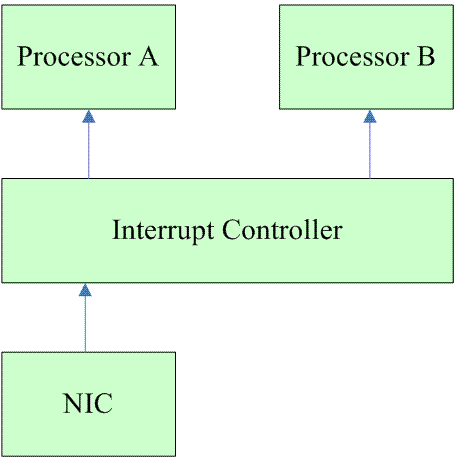

<!-- @import "[TOC]" {cmd="toc" depthFrom=1 depthTo=6 orderedList=false} -->

<!-- code_chunk_output -->

- [1 前言](#1-前言)
- [2 为何有 softirq 和 tasklet](#2-为何有-softirq-和-tasklet)
  - [2.1 为何有 top half 和 bottom half](#21-为何有-top-half-和-bottom-half)
  - [2.2 为何有 softirq 和 tasklet](#22-为何有-softirq-和-tasklet)

<!-- /code_chunk_output -->

# 1 前言

对于**中断处理**而言, linux 将其分成了**两个部分**, 一个叫做**中断 handler(top half**), 是**全程关闭中断**的, 另外一部分是**deferable task(bottom half**), 属于**不那么紧急需要处理**的事情. 在执行 bottom half 的时候, 是**开中断**的. 有**多种 bottom half 的机制**, 例如: **softirq**、**tasklet**、**workqueue**或是**直接创建一个 kernel thread** 来执行 bottom half(这在旧的 kernel 驱动中常见, 现在, 一个理智的 driver 厂商是不会这么做的). 本文主要讨论 softirq 机制. 由于**tasklet 是基于 softirq**的, 因此本文也会提及 tasklet, 但主要是从需求层面考虑, 不会涉及其具体的代码实现.

在普通的驱动中**一般是不会用到 softirq**, 但是由于驱动经常使用的 tasklet 是基于 softirq 的, 因此, 了解 softirq 机制有助于撰写更优雅的 driver. **softirq 不能动态分配**, 都是**静态定义(！！！**)的. **内核**已经定义了**若干种 softirq number**, 例如**网络数据的收发**、**block 设备的数据访问**(数据量大, 通信带宽高), **timer 的 deferable task**(时间方面要求高). 本文的第二章讨论了**softirq**和**tasklet**这两种机制**有何不同**, 分别适用于**什么样的场景**. 第三章描述了一些 context 的概念, 这是要理解后续内容的基础. 第四章是进入**softirq 的实现**, 对比 hard irq 来解析 soft irq 的注册、触发, 调度的过程.

注: 本文中的 linux kernel 的版本是 3.14

# 2 为何有 softirq 和 tasklet

## 2.1 为何有 top half 和 bottom half

中断处理模块是任何 OS 中最重要的一个模块, 对系统的性能会有直接的影响. 想像一下: 如果在通过 U 盘进行大量数据拷贝的时候, 你按下一个 key, 需要半秒的时间才显示出来, 这个场景是否让你崩溃? 因此, 对于那些复杂的、需要大量数据处理的硬件中断, 我们不能让 handler 中处理完一切再恢复现场(handler 是全程关闭中断的), 而是仅仅在**handler**中**处理一部分**, 具体包括:

(1) 有**实时性**要求的

(2) 和**硬件相关**的. 例如 **ack 中断**, **read HW FIFO to ram**等

(3) 如果是**共享中断**, 那么获取**硬件中断状态**以便**判断是否是本中断发生**

除此之外, 其他的内容都是放到 bottom half 中处理. 在把中断处理过程划分成 top half 和 bottom half 之后, 关中断的 top half 被瘦身, 可以非常快速的执行完毕, 大大减少了系统关中断的时间, 提高了系统的性能.

我们可以基于下面的系统进一步的进行讨论:

当**网卡控制器**的 FIFO 收到的来自**以太网的数据**的时候(例如半满的时候, 可以软件设定), 可以**将该事件**通过**irq signal**送达**Interrupt Controller**. Interrupt Controller 可以把中断**分发给系统中的 Processor A or B**.

**NIC 的中断处理过程**大概包括: **mask and ack interrupt controller**-------->**ack NIC**-------->**copy FIFO to ram**------>**handle Data in the ram**----------->**unmask interrupt controller**

我们先假设 **Processor A 处理**了这个**网卡中断事件**, 于是 NIC 的中断 handler 在 Processor A 上欢快的执行, 这时候, **Processor A 的本地中断是 disable**的. NIC 的中断 handler 在执行的过程中, **网络数据仍然源源不断的到来**, 但是, 如果**NIC 的中断 handler 不操作 NIC 的寄存器**来**ack 这个中断**的话, NIC 是**不会触发下一次中断**的. 还好, 我们的 NIC interrupt handler 总是在**最开始就会 ack**, 因此, 这不会导致性能问题. ack 之后, NIC 已经具体再次 trigger 中断的能力. 当 Processor A 上的 handler 在处理接收来自网络的数据的时候, **NIC 的 FIFO 很可能又收到新的数据**, 并**trigger 了中断**, 这时候, **Interrupt controller 还没有 umask**, 因此, 即便还有 Processor B(也就是说有**处理器资源**), **中断控制器**也**无法把这个中断送达处理器系统**. 因此, 只能眼睁睁的看着 NIC FIFO 填满数据, 数据溢出, 或者向对端发出拥塞信号, 无论如何, 整体的系统性能是受到严重的影响.

注意: 对于新的 interrupt controller, 可能没有 mask 和 umask 操作, 但是原理是一样的, 只不过 NIC 的 handler 执行完毕要发生 EOI 而已.

要解决上面的问题, 最重要的是尽快的**执行完中断 handler, 打开中断, unmask IRQ(或者发送 EOI**), 方法就是把**耗时的 handle Data in the ram**这个步骤**踢出 handler**, 让其在 bottom half 中执行.

## 2.2 为何有 softirq 和 tasklet

OK, linux kernel 已经把中断处理分成了 top half 和 bottom half, 看起来已经不错了, 那**为何**还要提供 **softirq**、**tasklet** 和 **workqueue**这些 bottom half 机制? 实际上, 在早期的 linux kernel 还真是只有一个 bottom half 机制, 简称 BH, 简单好用, 但是性能不佳. 后来, linux kernel 的开发者开发了 task queue 机制, 试图来替代 BH, 当然, 最后 task queue 也消失在内核代码中了. 现在的 linux kernel 提供了**三种 bottom half 的机制**, 来应对**不同的需求**.

**workqueue** 和 **softirq**、**tasklet** 有**本质的区别**: **workqueue** 运行在 **process context**, 而 **softirq** 和 **tasklet** 运行在 **interrupt context**. 因此, 出现 workqueue 是不奇怪的, 在有**sleep 需求**的场景中, defering task 必须延迟到 kernel thread 中执行, 也就是说**必须使用 workqueue 机制**. softirq 和 tasklet 是怎么回事呢? 从本质上将, **bottom half 机制**的设计有**两方面的需求**, 一个是**性能**, 一个是**易用性**. 设计一个通用的 bottom half 机制来满足这两个需求非常的困难, 因此, 内核提供了 softirq 和 tasklet 两种机制. **softirq 更倾向于性能**, 而**tasklet 更倾向于易用性**.

我们还是进入实际的例子吧, 还是使用上一节的系统图. 在**引入 softirq 之后**, 网络数据的处理如下:

**关中断**: **mask and ack interrupt controller**-------->**ack NIC**-------->**copy FIFO to ram**------>**raise softirq**------>**unmask interrupt controller**

**开中断**: 在**softirq**上下文中进行**handle Data in the ram**的动作

同样的, 我们先假设**Processor A**处理了这个网卡中断事件, 很快的完成了**基本的 HW 操作**后, **raise softirq(！！！**). 在**返回中断现场前**, 会**检查 softirq 的触发情况(！！！**), 因此, 后续**网络数据处理的 softirq**在**Processor A**上执行. 在**softirq handler 的执行过程中(！！！**), NIC 硬件**再次触发中断(网卡新的中断！！！**), **Interrupt controller 将该中断分发给 processor B**, 执行动作**和 Processor A 是类似**的, 因此, 最后, 网络数据处理的 softirq 在**processor B**上执行.

为了**性能**, **同一类型**的**softirq**有可能在**不同的 CPU**上**并发执行**, 这给使用者带来了极大的痛苦, 因为**驱动工程师**在撰写 softirq 的回调函数的时候要**考虑重入**, **考虑并发**, 要引入**同步机制**. 但是, 为了性能, 我们必须如此.

当**网络数据处理**的**softirq**同时在**Processor A 和 B**上运行的时候, **网卡中断又来**了(可能是 10G 的网卡吧). 这时候, **中断控制器分发**给**processor A**, 这时候, processor A 上的 handler 仍然会**raise softirq**, 但是**并不会调度该 softirq**. 也就是说, **softirq**在**一个 CPU**上是**串行执行**的. 这种情况下, 系统**性能瓶颈**是**CPU 资源**, 需要增加更多的 CPU 来解决该问题.

如果是 tasklet 的情况会如何呢? 为何 tasklet 性能不如 softirq 呢? 如果**一个 tasklet**在**processor A**上**被调度执行**, 那么它**永远也不会同时在 processor B 上执行(！！！**), 也就是说, **tasklet 是串行执行**的(注: **不同的 tasklet**还是会**并发**的), 不需要考虑重入的问题. 我们还是用网卡这个例子吧(注意: 这个例子仅仅是用来对比, **实际上**, **网络数据是使用 softirq 机制**的), 同样是上面的系统结构图. 假设使用 tasklet, 网络数据的处理如下:

关中断: mask and ack interrupt controller-------->ack NIC-------->copy FIFO to ram------>schedule tasklet------>unmask interrupt controller

开中断: 在 softirq 上下文中(一般使用**TASKLET\_SOFTIRQ 这个 softirq**)进行 handle Data in the ram 的动作

同样的, 我们先假设 Processor A 处理了这个网卡中断事件, 很快的完成了基本的 HW 操作后, **schedule tasklet**(同时也就**raise TASKLET\_SOFTIRQ softirq！！！**). 在**返回中断现场前**, 会**检查 softirq 的触发情况**, 因此, 在**TASKLET\_SOFTIRQ softirq 的 handler(！！！**)中, 获取**tasklet 相关信息**并**在 processor A 上执行该 tasklet 的 handler**. 在执行过程中, **NIC 硬件再次触发中断**, **Interrupt controller**将**该中断分发给 processor B**, 执行动作和 Processor A 是类似的, 虽然 TASKLET\_SOFTIRQ softirq 在 processor B 上可以执行, 但是, 在**检查 tasklet 的状态的时候**, 如果发现**该 tasklet**在**其他 processor**上**已经正在运行**, 那么**该 tasklet 不会被处理**, 一直等到**在 processor A 上的 tasklet 处理完**, 在**processor B 上的这个 tasklet 才能被执行(！！！在 B 上执行！！！**). 这样的串行化操作虽然对驱动工程师是一个福利, 但是对性能而言是极大的损伤.