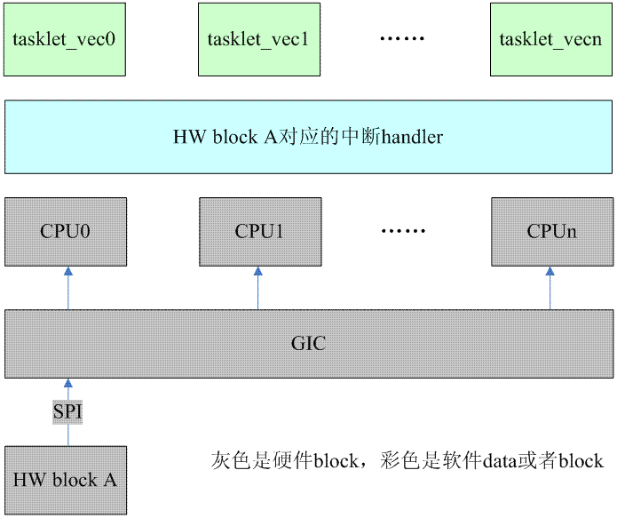

<!-- @import "[TOC]" {cmd="toc" depthFrom=1 depthTo=6 orderedList=false} -->

<!-- code_chunk_output -->

- [1 前言](#1-前言)
- [2 为什么需要 tasklet?](#2-为什么需要-tasklet)
  - [2.1 基本的思考](#21-基本的思考)
  - [2.2 对 linux 中的 bottom half 机制的思考](#22-对-linux-中的-bottom-half-机制的思考)
- [3 tasklet 的基本原理](#3-tasklet-的基本原理)
  - [3.1 如何抽象一个 tasklet](#31-如何抽象一个-tasklet)
  - [3.2 系统如何管理 tasklet?](#32-系统如何管理-tasklet)
  - [3.3 如何定义一个 tasklet?](#33-如何定义一个-tasklet)
  - [3.4 如何调度一个 tasklet](#34-如何调度一个-tasklet)
  - [3.5 在什么时机会执行 tasklet?](#35-在什么时机会执行-tasklet)

<!-- /code_chunk_output -->

# 1 前言

对于中断处理而言, linux 将其分成了两个部分, 一个叫做中断 handler(top half), 属于**不那么紧急**需要处理的事情被推迟执行, 我们称之**deferable task**, 或者叫做**bottom half**, . 具体如何推迟执行分成下面几种情况:

1、推迟到**top half 执行完**毕

2、推迟到**某个指定的时间片(例如 40ms)之后**执行

3、推迟到**某个内核线程被调度**的时候执行

对于**第一种**情况, 内核中的机制包括**softirq 机制**和**tasklet 机制**. **第二种**情况是属于**softirq 机制**的一种应用场景(**timer 类型的 softirq**), 在本站的**时间子系统**的系列文档中会描述. **第三种**情况主要包括**threaded irq handler**以及**通用的 workqueue 机制**, 当然也包括**自己创建**该驱动专属 kernel thread(**不推荐**使用). 本文主要描述 tasklet 这种机制, 第二章描述一些背景知识和和 tasklet 的思考, 第三章结合代码描述 tasklet 的原理.

注: 本文中的 linux kernel 的版本是 4.0

# 2 为什么需要 tasklet?

## 2.1 基本的思考

我们的驱动程序或者内核模块真的需要 tasklet 吗?每个人都有自己的看法. 我们先抛开 linux kernel 中的机制, 首先进行一番逻辑思考.

将**中断处理**分成**top half**(**cpu 和外设之间的交互！！！**, **获取状态**, **ack 状态**, **收发数据**等)和**bottom half**(后段的**数据处理**)已经深入人心, 对于任何的 OS 都一样, 将**不那么紧急**的事情推迟到**bottom half**中执行是 OK 的, 具体**如何推迟执行**分成**两种类型**: 有**具体时间要求**的(对应 linux kernel 中的**低精度 timer 和高精度 timer**)和**没有具体时间要求**的. 对于**没有具体时间**要求的又可以分成两种:

(1)**越快越好**型, 这种实际上是有**性能要求**的, 除了中断 top half 可以抢占其执行, 其他的进程上下文(无论该进程的优先级多么的高)是不会影响其执行的, 一言以蔽之, 在不影响中断延迟的情况下, OS 会尽快处理.

(2)**随遇而安**型. 这种属于那种没有性能需求的, 其调度执行依赖系统的调度器.

本质上讲, 越快越好型的 bottom half 不应该太多, 而且 tasklet 的 callback 函数**不能执行时间过长**, 否则会产生进程调度延迟过大的现象, 甚至是非常长而且不确定的延迟, 对 real time 的系统会产生很坏的影响.

## 2.2 对 linux 中的 bottom half 机制的思考

在 linux kernel 中, "**越快越好型**"有**两种**, **softirq**和**tasklet**, "**随遇而安**型"也有**两种**, **workqueue**和**threaded irq handler**. "**越快越好**型"能否**只留下一个 softirq**呢?对于崇尚简单就是美的程序员当然希望如此. 为了回答这个问题, 我们先看看**tasklet**对于 softirq 而言有哪些**好处**:

(1)**tasklet**可以**动态分配**, 也可以**静态分配**, 数量不限.

(2)**同一种 tasklet**在**多个 cpu**上也**不会并行执行**, 这使得程序员在撰写 tasklet function 的时候比较方便, 减少了对**并发**的考虑(当然损失了性能).

对于**第一种好处**, 其实也就是为乱用 tasklet 打开了方便之门, 很多撰写驱动的软件工程师不会仔细考量其 driver**是否有性能需求**就直接使用了**tasklet 机制**. 对于**第二种好处**, 本身**考虑并发**就是**软件工程师的职责**. 因此, 看起来 tasklet 并**没有引入特别的好处**, 而且**和 softirq 一样**, 都**不能 sleep**, 限制了 handler 撰写的方便性, 看起来其实并没有存在的必要. 在 4.0 kernel 的代码中, grep 一下 tasklet 的使用, 实际上是一个很长的列表, 只要对这些使用进行**简单的归类**就**可以删除对 tasklet 的使用**. 对于那些有**性能需求**的, 可以考虑**并入 softirq**, 其他的可以考虑**使用 workqueue**来取代. Steven Rostedt 试图进行这方面的尝试( http://lwn.net/Articles/239484/ ), 不过这个 patch 始终未能进入 main line.

# 3 tasklet 的基本原理

## 3.1 如何抽象一个 tasklet

内核中用下面的数据结构来表示 tasklet:

```c
[include/linux/interrupt.h]
struct tasklet_struct
{
    struct tasklet_struct *next;
    unsigned long state;
    atomic_t count;
    void (*func)(unsigned long);
    unsigned long data;
};
```

**每个 cpu**都会**维护一个链表(！！！**), 将**本 cpu**需要处理的**tasklet 管理**起来, **next**这个成员指向了该**链表中的下一个 tasklet**. **func**和**data**成员描述了**该 tasklet 的 callback 函数**, func 是**调用函数**, data 是**传递给 func 的参数**. state 成员表示**该 tasklet 的状态**, **TASKLET\_STATE\_SCHED**表示该 tasklet 已经**被调度到某个 CPU 上执行**, TASKLET\_STATE\_RUN 表示该 tasklet**正在某个 cpu 上执行**. **count 成员**是和**enable 或者 disable 该 tasklet**的状态相关, 如果**count 等于 0**那么该 tasklet 是处于**enable**的, 如果大于 0, 表示该 tasklet 是 disable 的. 在**softirq 文档**中, 我们知道**local\_bh\_disable/enable 函数**就是用来**disable/enable bottom half(！！！所有 softirq 和 tasklet！！！**)的, 这里就**包括 softirq 和 tasklet**. 但是, 有的时候内核同步的场景不需 disable 所有的 softirq 和 tasklet, 而仅仅是**disable 该 tasklet**, 这时候, tasklet\_disable 和 tasklet\_enable 就派上用场了.

```c
static inline void tasklet_disable(struct tasklet_struct *t)
{
    tasklet_disable_nosync(t);－－－－－－－给 tasklet 的 count 加一
    tasklet_unlock_wait(t);－－－－－如果该 tasklet 处于 running 状态, 那么需要等到该 tasklet 执行完毕
    smp_mb();
}

static inline void tasklet_enable(struct tasklet_struct *t)
{
    smp_mb__before_atomic();
    atomic_dec(&t->count);－－－－－－－给 tasklet 的 count 减一
}
```

tasklet\_disable 和 tasklet\_enable 支持嵌套, 但是需要成对使用.

## 3.2 系统如何管理 tasklet?

系统中的**每个 cpu**都会维护**一个 tasklet 的链表(！！！**), 定义如下:

```c
static DEFINE_PER_CPU(struct tasklet_head, tasklet_vec);
static DEFINE_PER_CPU(struct tasklet_head, tasklet_hi_vec);
```

linux kernel 中, 和**tasklet**相关的 softirq 有两项, **HI\_SOFTIRQ**用于**高优先级的 tasklet**, **TASKLET\_SOFTIRQ**用于**普通的 tasklet**. 对于**softirq**而言, **优先级**就是出现在**softirq pending register(\_\_softirq\_pending)中的先后顺序(！！！**), 位于**bit 0 拥有最高的优先级**, 也就是说, 如果有**多个不同类型**的**softirq 同时触发**, 那么**执行的先后顺序**依赖在**softirq pending register 的位置**, kernel 总是从右向左依次判断是否置位, 如果置位则执行. **HI\_SOFTIRQ 占据了 bit 0**, 其优先级甚至**高过 timer**, 需要慎用(实际上, 我 grep 了内核代码, 似乎没有发现对 HI\_SOFTIRQ 的使用). 当然**HI\_SOFTIRQ 和 TASKLET\_SOFTIRQ 的机理**是一样的, 因此本文只讨论 TASKLET\_SOFTIRQ, 大家可以举一反三.

## 3.3 如何定义一个 tasklet?

你可以用下面的宏定义来**静态定义 tasklet**:

```c
#define DECLARE_TASKLET(name, func, data) \
struct tasklet_struct name = { NULL, 0, ATOMIC_INIT(0), func, data }

#define DECLARE_TASKLET_DISABLED(name, func, data) \
struct tasklet_struct name = { NULL, 0, ATOMIC_INIT(1), func, data }
```

这两个宏都可以静态定义一个 struct tasklet\_struct 的变量, 只不过初始化后的 tasklet 一个是处于 eable 状态, 一个处于 disable 状态的. 当然, 也可以**动态分配 tasklet**, 然后调用**tasklet\_init**来**初始化该 tasklet**.

## 3.4 如何调度一个 tasklet

为了**调度一个 tasklet 执行**, 我们可以使用**tasklet\_schedule**这个接口:

```c
static inline void tasklet_schedule(struct tasklet_struct *t)
{
    if (!test_and_set_bit(TASKLET_STATE_SCHED, &t->state))
        __tasklet_schedule(t);
}
```

程序在**多个上下文**中可以**多次调度同一个 tasklet 执行**(也可能**来自多个 cpu core**), 不过实际上**该 tasklet 只会一次挂入首次调度到的那个 cpu 的 tasklet 链表(！！！**), 也就是说, 即便是**多次调用 tasklet\_schedule**, 实际上**tasklet 只会挂入一个指定 CPU 的 tasklet 队列**中(而且**只会挂入一次**), 也就是说只会调度一次执行. 这是通过**TASKLET\_STATE\_SCHED 这个 flag**来完成的, 我们可以用下面的图片来描述:



我们假设**HW block A**的**驱动**使用的**tasklet 机制**并且在**中断 handler(top half！！！**)中将**静态定义的 tasklet**(这个 tasklet 是**各个 cpu 共享**的, 不是 per cpu 的)**调度执行**(也就是**调用 tasklet\_schedule！！！**函数). 当**HW block A 检测到硬件**的动作(例如**接收 FIFO 中数据达到半满**)就会**触发 IRQ line 上的电平或者边缘信号**, **GIC**检测到**该信号**会将**该中断**分发给**某个 CPU 执行其 top half handler(！！！**), 我们假设这次是**cpu0**, 因此**该 driver 的 tasklet**被挂入**CPU0 对应的 tasklet 链表！！！**(tasklet\_vec)并**将 state 的状态**设定为**TASKLET\_STATE\_SCHED**. **HW block A 的驱动**中的**tasklet 虽已调度**, 但是**没有执行(！！！**), 如果这时候, 硬件**又一次触发中断**并**在 cpu1 上执行 top handler！！！**, 虽然**tasklet\_schedule 函数被再次调用**, 但是由于**TASKLET\_STATE\_SCHED 已经设定**, 因此**不会(！！！**)将**HW block A 的驱动**中的这个**tasklet 挂入 cpu1 的 tasklet 链表**中.

下面我们再仔细研究一下底层的\_\_tasklet\_schedule 函数:

```c
void __tasklet_schedule(struct tasklet_struct *t)
{
    unsigned long flags;

    local_irq_save(flags);－－－－(1)
    t->next = NULL;－－－－(2)
    *__this_cpu_read(tasklet_vec.tail) = t;
    __this_cpu_write(tasklet_vec.tail, &(t->next));
    raise_softirq_irqoff(TASKLET_SOFTIRQ);－－－－(3)
    local_irq_restore(flags);
}
```

(1)下面的**链表操作是 per\-cpu**的, 因此这里**禁止本地中断**就可以**拦截所有的并发**.

(2)这里的三行代码就是**将一个 tasklet 挂入链表的尾部**

(3)**raise TASKLET\_SOFTIRQ 类型**的**softirq**.

## 3.5 在什么时机会执行 tasklet?

上面描述了 tasklet 的调度, 当然**调度 tasklet 不等于执行 tasklet(！！！**), 系统会在适合的时间点执行 tasklet callback function. 由于**tasklet 是基于 softirq**的, 因此, 我们首先总结一下**softirq 的执行场景**:

(1)在**中断返回用户空间(进程上下文**)的时候, 如果有**pending 的 softirq**, 那么将执行该 softirq 的处理函数. 这里限定了**中断返回用户空间**也就是意味着**限制了下面两个场景的 softirq 被触发执行**:

(a)中断返回 hard interrupt context, 也就是**中断嵌套**的场景

(b)中断返回 software interrupt context, 也就是**中断抢占软中断上下文**的场景

(2)上面的描述缺少了一种场景: **中断返回内核态的进程上下文**的场景, 这里我们需要详细说明. **进程上下文**中调用**local\_bh\_enable**的时候, 如果有**pending 的 softirq**, 那么将**执行该 softirq 的处理函数**. 由于**内核同步**的要求, **进程上下文**中有可能会调用**local\_bh\_enable/disable 来保护临界区**. 在**临界区代码执行过程**中, **中断随时**会到来, **抢占该进程(内核态)的执行**(注意: 这里**只是 disable 了 bottom half, 没有禁止中断！！！**). 在这种情况下, 中断返回的时候是否会执行 softirq handler 呢?当然不会, 我们 disable 了 bottom half 的执行, 也就是意味着不能执行 softirq handler, 但是**本质上 bottom half 应该比进程上下文有更高的优先级(！！！**), 一旦条件允许, 要**立刻抢占进程上下文(！！！**)的执行, 因此, 当立刻离开临界区, 调用**local\_bh\_enable**的时候, 会**检查 softirq pending**, 如果**bottom half 处于 enable 的状态**, pending 的 s**oftirq handler 会被执行**.

(3)系统太繁忙了, 不过的**产生中断**, **raise softirq**, 由于**bottom half 的优先级高**, 从而导致进程无法调度执行. 这种情况下, **softirq 会推迟到 softirqd 这个内核线程**中去执行.

对于**TASKLET\_SOFTIRQ 类型的 softirq**, 其**handler 是 tasklet\_action**, 我们来看看各个 tasklet 是如何执行的:

```c
static void tasklet_action(struct softirq_action *a)
{
    struct tasklet_struct *list;

    local_irq_disable();－－－－－－－－－－(1)
    list = __this_cpu_read(tasklet_vec.head);
    __this_cpu_write(tasklet_vec.head, NULL);
    __this_cpu_write(tasklet_vec.tail, this_cpu_ptr(&tasklet_vec.head));
    local_irq_enable();

    while (list) {－－－－－－－－－遍历 tasklet 链表
        struct tasklet_struct *t = list;

        list = list->next;

        if (tasklet_trylock(t)) {－－－－－－－－(2)
            if (!atomic_read(&t->count)) {－－－－－－(3)
                if (!test_and_clear_bit(TASKLET_STATE_SCHED, &t->state))
                    BUG();
                t->func(t->data);
                tasklet_unlock(t);
                continue;－－－－－处理下一个 tasklet
            }
            tasklet_unlock(t);－－－－清除 TASKLET_STATE_RUN 标记
        }

        local_irq_disable();－－－－－－－(4)
        t->next = NULL;
        *__this_cpu_read(tasklet_vec.tail) = t;
        __this_cpu_write(tasklet_vec.tail, &(t->next));
        __raise_softirq_irqoff(TASKLET_SOFTIRQ); －－－－－－再次触发 softirq, 等待下一个执行时机
        local_irq_enable();
    }
}
```

(1)从本 cpu 的 tasklet 链表中取出全部的 tasklet, 保存在 list 这个临时变量中, 同时重新初始化本 cpu 的 tasklet 链表, 使该链表为空. 由于 bottom half 是开中断执行的, 因此在操作 tasklet 链表的时候需要使用关中断保护

(2)tasklet\_trylock 主要是用来设定该 tasklet 的 state 为 TASKLET\_STATE\_RUN, 同时判断该 tasklet 是否已经处于执行状态, 这个状态很重要, 它决定了后续的代码逻辑.

```c
static inline int tasklet_trylock(struct tasklet_struct *t)
{
    return !test_and_set_bit(TASKLET_STATE_RUN, &(t)->state);
}
```

你也许会奇怪: 为何这里从 tasklet 的链表中摘下一个本 cpu 要处理的 tasklet list, 而这个 list 中的 tasklet 已经处于 running 状态了, 会有这种情况吗?会的, 我们再次回到上面的那个软硬件结构图. 同样的, HW block A 的驱动使用的 tasklet 机制并且在中断 handler(top half)中将静态定义的 tasklet 调度执行. HW block A 的硬件中断首先送达 cpu0 处理, 因此该 driver 的 tasklet 被挂入 CPU0 对应的 tasklet 链表并在适当的时间点上开始执行该 tasklet. 这时候, cpu0 的硬件中断又来了, 该 driver 的 tasklet callback function 被抢占, 虽然 tasklet 仍然处于 running 状态. 与此同时, HW block A 硬件又一次触发中断并在 cpu1 上执行, 这时候, 该 driver 的 tasklet 处于 running 状态, 并且 TASKLET\_STATE\_SCHED 已经被清除, 因此, 调用 tasklet\_schedule 函数将会使得该 driver 的 tasklet 挂入 cpu1 的 tasklet 链表中. 由于 cpu0 在处理其他硬件中断, 因此, cpu1 的 tasklet 后发先至, 进入 tasklet_action 函数调用, 这时候, 当从 cpu1 的 tasklet 摘取所有需要处理的 tasklet 链表中, HW block A 对应的 tasklet 实际上已经是在 cpu0 上处于执行状态了.

我们在设计 tasklet 的时候就规定, 同一种类型的 tasklet 只能在一个 cpu 上执行, 因此 tasklet_trylock 就是起这个作用的.

(3)检查该 tasklet 是否处于 enable 状态, 如果是, 说明该 tasklet 可以真正进入执行状态了. 主要的动作就是清除 TASKLET\_STATE\_SCHED 状态, 执行 tasklet callback function.

(4)如果该 tasklet 已经在别的 cpu 上执行了, 那么我们将其挂入该 cpu 的 tasklet 链表的尾部, 这样, 在下一个 tasklet 执行时机到来的时候, kernel 会再次尝试执行该 tasklet, 在这个时间点, 也许其他 cpu 上的该 tasklet 已经执行完毕了. 通过这样代码逻辑, 保证了特定的 tasklet 只会在一个 cpu 上执行, 不会在多个 cpu 上并发.