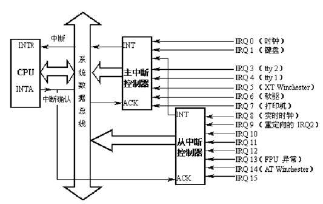
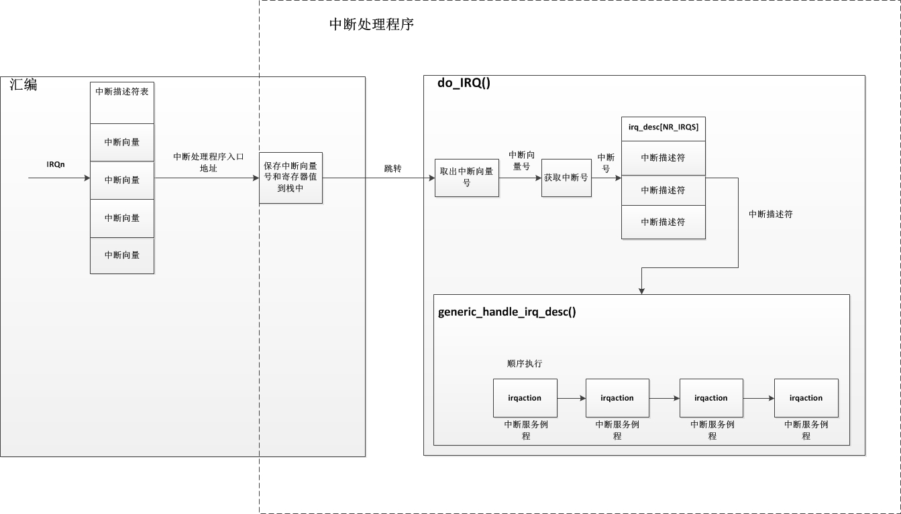
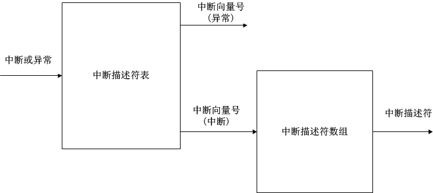
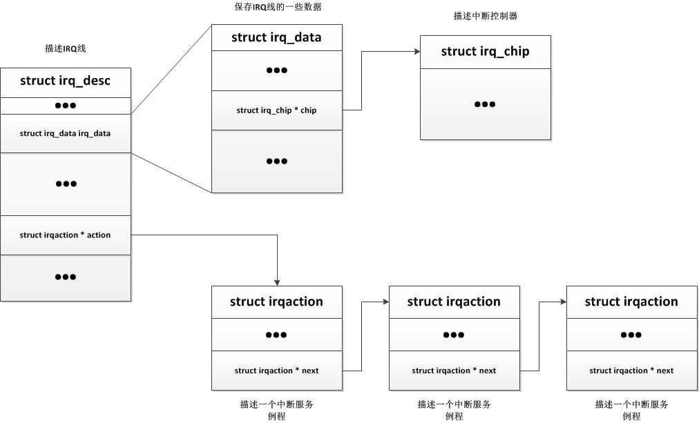

<!-- @import "[TOC]" {cmd="toc" depthFrom=1 depthTo=6 orderedList=false} -->

<!-- code_chunk_output -->

- [1. 关于中断和异常](#1-关于中断和异常)
- [2. 可编程中断控制器(PIC,APIC)](#2-可编程中断控制器picapic)
- [3. 中断描述符表(IDT)](#3-中断描述符表idt)
- [4. 中断处理](#4-中断处理)
  - [4.1. 共享中断线](#41-共享中断线)
  - [4.2. 中断线动态分配](#42-中断线动态分配)
- [5. 中断描述符](#5-中断描述符)
- [6. 中断服务例程(ISR)](#6-中断服务例程isr)
- [7. irq_stat 数组](#7-irq_stat-数组)
- [8. 数据结构总结](#8-数据结构总结)

<!-- /code_chunk_output -->

# 1. 关于中断和异常

一般在书中都会把中断和异常一起说明, 因为它们具有相同的特点, 同时也有不同的地方. 在 **CPU** 里, **中断和异常**都会放入到一个**中断描述符表**中, 都需要**特定的处理程序**进行处理, 并且它们都是异步事件, 内核完全不知道何时会有一个异常或者中断发生.

当**异常或者中断发生**时, **进程都会陷入内核**, 在内核中执行相应的处理. **异常**一般都是由 **CPU 内部或者进程产生**, 而**中断**一般都是由**外部设备**产生. **异常处理过程**实际上和**系统调用没什么区别**(实际上**系统调用是通过一个 0x80 异常陷入内核**当中), 而**中断的处理过程**和情况就相对来说比较复杂.

一个中断处理分为**硬中断**和**软中断两个部分**, 在**中断处理的过程**中系统是**禁止调度和抢占**的, 而**异常处理过程中是允许**的. 一个**中断处理程序**可以**抢占其他的中断处理程序**, 也可以**抢占异常处理程序**, 相反的, **异常处理程序**却**不能够抢占中断处理程序**.

# 2. 可编程中断控制器(PIC,APIC)

为了方便说明, 这里我们将**PIC 和 APIC 统称为中断控制器**. **中断控制器**是作为**中断(IRQ**)和**CPU 核**之间的一个**桥梁**而存在的, **每个 CPU 内部**都有一个自己的**中断控制器**, **中断线**并不是直接与 CPU 核相连, 而是与 CPU 内部或外部的**中断控制器相连**. 而为什么叫做可编程中断控制器, 是因为其本身有一定的寄存器, CPU 可以通过操作设置中断控制器屏蔽某个中断引脚的信号, 实现硬件上的中断屏蔽. 中断控制器也可以级联提供更多的中断线, 具体如下:



注: **这是 8259 控制器, 和 Local APIC, IO APIC 不一样!!!**

如上图, **CPU 的 INTR**与**中断控制器的 INT 相连**, **INTA**与**ACK 相连**, 当一个**外部中断发生**时(比如**键盘中断 IRQ1**), 中断控制器与 CPU 交互操作如下:

1. **IRQ1 发生中断**, **主中断控制器**接收到**中断信号**, 检查中断屏蔽寄存器 IRQ1 是否被屏蔽, 如果屏蔽则忽略此中断信号.
2. 将中断控制器中的**中断请求寄存器**对应的**IRQ1 位置位**, 表示**收到 IRQ1 中断**.
3. **中断控制器拉高 INT 引脚电平(这里不是边缘触发或水平触发**), 告知 CPU 有中断发生.
4. **CPU 每执行完一条指令时**, 都会**检查 INTR 引脚是否被拉高**, 这里已被拉高.
5. CPU 检查 EFLAGS 寄存器的中断运行标志位 IF 是否为 1, 若为 1, 表明允许中断, 通过**INTA 向中断控制器发出应答**.
6. **中断控制器**接收到**应答信号**, 将**IRQ1 的中断向量号**发到**数据总线**上, 此时**CPU**会通过**数据总线读取 IRQ1 的中断向量号**.
7. 最后, 如果中断控制器需要 EOI(End of Interrupt)信号, CPU 则会发送, 否则**中断控制器自动将 INT 拉低**, 并**清除 IRQ1 对应的中断请求寄存器位**.

在 linux 内核中, 用**struct irq\_chip**结构体描述一个**可编程中断控制器**, 它的整个结构和调度器中的调度类类似, 里面定义了中断控制器的一些操作, 如下:

```c
struct irq_chip {
    /* 中断控制器的名字 */
    const char    *name;
    /* 控制器初始化函数 */
    unsigned int    (*irq_startup)(struct irq_data *data);
    /* 控制器关闭函数 */
    void        (*irq_shutdown)(struct irq_data *data);
    /* 使能 irq 操作, 通常是直接调用 irq_unmask(), 通过 data 参数指明 irq */
    void        (*irq_enable)(struct irq_data *data);
    /* 禁止 irq 操作, 通常是直接调用 irq_mask, */
    /* 严格意义上, 他俩其实代表不同的意义, disable 表示中断控制器根本就不响应该 irq, */
    /* 而 mask 时, 中断控制器可能响应该 irq, 只是不通知 CPU */
    void        (*irq_disable)(struct irq_data *data);
    /* 用于 CPU 对该 irq 的回应, 通常表示 cpu 希望要清除该 irq 的 pending 状态, 准备接受下一个 irq 请求 */
    void        (*irq_ack)(struct irq_data *data);
    /* 屏蔽 irq 操作, 通过 data 参数表明指定 irq */
    void        (*irq_mask)(struct irq_data *data);
    /* 相当于 irq_mask() + irq_ack() */
    void        (*irq_mask_ack)(struct irq_data *data);
    /* 取消屏蔽指定 irq 操作 */
    void        (*irq_unmask)(struct irq_data *data);
    /* 某些中断控制器需要在 cpu 处理完该 irq 后发出 eoi 信号 */
    void        (*irq_eoi)(struct irq_data *data);
    /*  用于设置该 irq 和 cpu 之间的亲和力, 就是通知中断控制器, 该 irq 发生时, 那些 cpu 有权响应该 irq */
    int        (*irq_set_affinity)(struct irq_data *data, const struct cpumask *dest, bool force);
    int        (*irq_retrigger)(struct irq_data *data);
    /* 设置 irq 的电气触发条件, 例如 IRQ_TYPE_LEVEL_HIGH(电平触发) 或 IRQ_TYPE_EDGE_RISING(边缘触发) */
    int        (*irq_set_type)(struct irq_data *data, unsigned int flow_type);
    /* 通知电源管理子系统, 该 irq 是否可以用作系统的唤醒源 */
    int        (*irq_set_wake)(struct irq_data *data, unsigned int on);

    void        (*irq_bus_lock)(struct irq_data *data);
    void        (*irq_bus_sync_unlock)(struct irq_data *data);

    void        (*irq_cpu_online)(struct irq_data *data);
    void        (*irq_cpu_offline)(struct irq_data *data);

    void        (*irq_suspend)(struct irq_data *data);
    void        (*irq_resume)(struct irq_data *data);
    void        (*irq_pm_shutdown)(struct irq_data *data);

    void        (*irq_calc_mask)(struct irq_data *data);

    void        (*irq_print_chip)(struct irq_data *data, struct seq_file *p);
    int        (*irq_request_resources)(struct irq_data *data);
    void        (*irq_release_resources)(struct irq_data *data);

    unsigned long    flags;
};
```

# 3. 中断描述符表(IDT)

在中断系统中有两个名字很相像的结构, 就是中断描述符表和中断描述符数组. 这里我们先说说中断描述符表.  一个系统中的**中断和异常加起来一共是 256**个, 它们以**向量的形式**保存在**中断描述符表**中, 每一个向量是**8 字节**(整个表大小就是 8 x 256=2048 字节), 其主要保存着权限位和向量对应的中断或异常处理程序的入口地址. 而一般的, linux 会将中断描述符表中的 0\~31 用于非屏蔽中断和异常, 其他的中断用于 32\~255 之间. CPU 把**中断描述符表的向量类型**分为三种类型: **任务门,中断门,陷阱门**.

CPU 为了防止恶意程序访问中断, 限制了中断门的权限, 而在某些时候, **用户程序**又**必须使用中断**, 所以 Linux 把中断描述符的**中断向量类型改为了 5 种**: **中断门, 系统门, 系统中断门, 陷阱门, 任务门**. 这个中断描述符表的基地址保存在 idtr 寄存器中.

**中断门**

**用户程序不能访问的 CPU 中断门(权限字段为 0!!!**), 所有的**中断处理程序**都是这个, 被限定在**内核态**执行. 会**清除 IF 标志**, 屏蔽可屏蔽中断.

**系统门**

**用户程序**可以访问的**CPU 陷阱门(权限字段为 3**). 我们的**系统调用**就是通过**向量 128 系统门**进入的.

**系统中断门**

能够被用户进程访问的**CPU 陷阱门(权限字段为 3**), 作为一个特别的异常处理所用.

**陷阱门**

**用户进程不能访问的 CPU 陷阱门(权限字段为 0**), 大部分**异常处理程序入口都为陷阱门**.

**任务门**

**用户进程不能访问的 CPU 任务门(权限字段为 0**), ''Double fault"异常处理程序入口.

当我们发生异常或中断时, 系统首先会判断权限字段(安全处理), 权限通过则进入指定的处理函数, 而**所有的中断门的中断处理函数都是同一个(!!!**), 它首先是一段**汇编代码**, 汇编代码操作如下:

- 执行**SAVE\_ALL 宏**, 保存**中断向量号**和**寄存器上下文**至**当前运行进程的内核栈**或者**硬中断请求栈(当内核栈大小为 8K 时保存在内核栈, 若为 4K, 则保存在硬中断请求栈**).
- 调用**do\_IRQ**()函数.
- 跳转到**ret\_from\_intr**, 这是一段汇编代码, 主要**用于判断是否需要进行调度**.

# 4. 中断处理

**每个能够产生中断的设备或者模块**都会在内核中**注册一个中断服务例程(ISR**), 当**产生中断**时, **中断处理程序会被执行**, 在中断处理程序中, 首先会**保存中断向量号和上下文**, 之后执行**中断线对应的中断服务例程**. 对于 CPU 来说, 中断线是非常宝贵的资源, 而由于计算机的发展, 外部设备数量和种类越来越多, 导致了中断线资源不足的情况, linux 为了应对这种情况, 实现了**两种中断线分配方式**, 分别是: **共享中断线**, **中断线动态分配**.

## 4.1. 共享中断线
　　
**多个设备共用一条中断线**, 当此条中断线发生中断时, 因为不可能预先知道哪个特定的设备产生了中断, 因此, **这条中断线**上的**每个中断服务例程都会被执行**, 以验证是**哪个设备产生的中断**(一般的, **设备产生中断时, 会标记自己的状态寄存器**, **中断服务例程**通过检查每个设备的**状态寄存器**来查找产生中断的设备).

## 4.2. 中断线动态分配

**一条中断线**在**可能使用的时刻(!!!**)才与**一个设备驱动程序关联起来**, 这样一来, 即使**几个硬件设备并不共享中断线**, 同一个**中断向量**也可以由**这几个设备在不同时刻运行**.

**共享中断线**的分配方式是比较常见的, 一次典型的基于**共享中断线的中断处理流程**如下:



由于**中断处于中断上下文**中, 所以在中断处理过程中, 会有以下几个特性:

- 中断处理程序正在运行时, **CPU**会通知**中断控制器屏蔽**产生**此中断的中断线**. 此中断线发出的信号被暂时忽略, 当中断处理程序结束时恢复此中断线.
- 在**中断服务例程的设计**中, 原则上是**立即处理紧急的操作**, 将**非紧急的操作延后处理**(交给**软中断**进行处理).
- 中断处理程序是运行在**中断上下文**, 但是其实是**代表进程运行**的, 因此它**所代表的进程**必须处于 TASK\_RUNNING 状态, 否则可能出现僵死情况, 因此在中断处理程序中不能执行任何阻塞过程.

# 5. 中断描述符

中断描述符用于描述 IRQ 线的属性与状态, **每个 IRQ**都有它自己的**中断描述符**, 这些中断描述符用一个数组保存,  这个数组就是中断描述符数组, 整个中断描述符数组长度为 NR\_IRQS(通常为 224)项.

当**产生一个中断**或者**异常**时, 首先会从**中断描述符表**中获取到**一个中断向量号**时(此中断向量号**有可能表示中断**, 也可能表示的是一个**异常**), 如果是**一个中断**导致的, 会执行**do\_IRQ()函数**, 而在 do\_IRQ()函数中, 会**根据中断向量号**, 从**中断描述符数组**中获取**对应的中断描述符**, 如下图:



整个中断描述符结构如下:

```c
struct irq_desc {
    struct irq_data        irq_data;
    /* irq 的统计信息, 在 proc 中可查到 */
    unsigned int __percpu    *kstat_irqs;

    /* 回调函数, 当此中断产生中断时, 会调用 handle_irq, 在 handle_irq 中进行遍历 irqaction 链表
     * handle_simple_irq  用于简单处理;
     * handle_level_irq  用于电平触发中断的流控处理;
     * handle_edge_irq  用于边沿触发中断的流控处理;
     * handle_fasteoi_irq  用于需要响应 eoi 的中断控制器;
     * handle_percpu_irq  用于只在单一 cpu 响应的中断;
     * handle_nested_irq  用于处理使用线程的嵌套中断;
     */
    irq_flow_handler_t    handle_irq;
#ifdef CONFIG_IRQ_PREFLOW_FASTEOI
    irq_preflow_handler_t    preflow_handler;
#endif
    /* 中断服务例程链表 */
    struct irqaction    *action;    /* IRQ action list */
    /* 状态 */
    unsigned int        status_use_accessors;
    /* 函数调用中使用, 另一个名称为 istate */
    unsigned int        core_internal_state__do_not_mess_with_it;
    /* 嵌套深度, 中断线被激活显示 0, 如果为正数, 表示被禁止次数 */
    unsigned int        depth;        /* nested irq disables */
    unsigned int        wake_depth;    /* nested wake enables */
    /* 此中断线上发生的中断次数 */
    unsigned int        irq_count;    /* For detecting broken IRQs */
    /* 上次发生未处理中断时的 jiffies 值 */
    unsigned long        last_unhandled;    /* Aging timer for unhandled count */
    /* 中断线上无法处理的中断次数, 如果当第 100000 次中断发生时, 有超过 99900 次是意外中断, 系统会禁止这条中断线 */
    unsigned int        irqs_unhandled;
    atomic_t        threads_handled;
    int            threads_handled_last;
    /* 锁 */
    raw_spinlock_t        lock;
    struct cpumask        *percpu_enabled;
#ifdef CONFIG_SMP
    /* CPU 亲和力关系, 其实就是每个 CPU 是占一个 bit 长度, 某 CPU 上置为 1 表明该 CPU 可以进行这个中断的处理 */
    const struct cpumask    *affinity_hint;
    struct irq_affinity_notify *affinity_notify;
#ifdef CONFIG_GENERIC_PENDING_IRQ
    /* 用于调整 irq 在各个 cpu 之间的平衡 */
    cpumask_var_t        pending_mask;
#endif
#endif
    unsigned long        threads_oneshot;
    atomic_t        threads_active;
    /* 用于 synchronize_irq(), 等待该 irq 所有线程完成 */
    wait_queue_head_t       wait_for_threads;
#ifdef CONFIG_PM_SLEEP
    /* irqaction 数量 */
    unsigned int        nr_actions;
    unsigned int        no_suspend_depth;
    unsigned int        force_resume_depth;
#endif
#ifdef CONFIG_PROC_FS
    /* 指向与 IRQn 相关的/proc/irq/n 目录的描述符 */
    struct proc_dir_entry    *dir;
#endif
    int            parent_irq;
    struct module        *owner;
    /* 在/proc/interrupts 所显示名称 */
    const char        *name;
} ____cacheline_internodealigned_in_smp;
```

core\_internal\_state\_\_do\_not\_mes\_with\_it 成员是用于记录此中断线状态的, 中断线状态有如下几种形式:

```c
IRQS_AUTODETECT    　　　　/* 该 IRQ 线用来进行硬件设备探测 */
    IRQS_SPURIOUS_DISABLED    /* 该 IRQ 线被禁止, 是由于产生了欺骗性中断 */
    IRQS_POLL_INPROGRESS      /* 该 IRQ 进行轮询检查是否发生中断 */
    IRQS_ONESHOT　　　　　　　　/* 此 IRQ 没有在主处理函数中进行 unmasked 处理 */
    IRQS_REPLAY　　　　　　　　 /* IRQ 线已被禁止, 但前一个出现的中断还没有被应答 */
    IRQS_WAITING　　　　　　　　/* 进行硬件设备探测时, 会将所有没有挂载中断服务程序的 IRQ 线状态设置为 IRQS_WAITING, 如果该 IRQ 上有中断产生, 就清除这个状态, 可以推断哪些引脚产生过中断 */
    IRQS_PENDING　　　　　　　　/* IRQ 已经被应答(挂起), 但是内核还没有进行处理 */
    IRQS_SUSPENDED　　　　　　 /* 此 IRQ 被延迟 */
```

# 6. 中断服务例程(ISR)

中断服务例程用于描述一个设备的中断处理(区别与中断处理函数), 每个申请了中断的外部设备都会有一个中断服务例程, 其作用就是执行对应设备的中断处理. 当多个设备共享 IRQ 线时, 内核会将此 IRQ 线上所有设备的中断服务例程组织成一个链表并保存在中断描述符中, 当此 IRQ 线产生中断时, 中断处理函数会依次执行此 IRQ 线上的中断服务例程. 内核使用 struct irqaction 描述一个中断服务例程:

```c
struct irqaction {
    /* 此中断服务例程的中断处理函数 */
    irq_handler_t        handler;
    /* 设备 ID, 一般用于指向中断处理时需要的数据结构传入 handler */
    void            *dev_id;
    /* 此中断服务例程在 CPU 上所对应的设备 ID */
    void __percpu        *percpu_dev_id;
    /* 链表中下一个中断服务例程 */
    struct irqaction    *next;
    /* 进行中断处理的内核线程执行函数 */
    irq_handler_t        thread_fn;
    /* 一个内核线程, 用于执行中断处理 */
    struct task_struct    *thread;
    /* IRQ 线, IRQ 号 */
    unsigned int        irq;
    unsigned int        flags;
    unsigned long        thread_flags;
    unsigned long        thread_mask;
    const char        *name;
    /* 指向/proc/irq/n 目录的描述符 */
    struct proc_dir_entry    *dir;
} ____cacheline_internodealigned_in_smp;
```

# 7. irq_stat 数组

此数组包含 `NR_CPUS` 个元素, 系统中每个 CPU 对应数组中的一个元素. 每个元素的类型为 `irq_cpustat_t`, 其包含几个计数器和内核记录 CPU 正在做什么的标志.

```c
typedef struct {
    unsigned int __softirq_pending;        /* 表示挂起的软中断, 每一位表示一个软中断, 为 1 表示挂起 */
    long idle_timestamp;                    /* CPU 变为空闲的时间点 */

    /* 硬中断统计. */
    unsigned int irq_timer_count;            /* 定时器中断统计 */
    unsigned int irq_syscall_count;            /* 系统调用中断统计 */
    unsigned int irq_resched_count;
    unsigned int irq_hv_flush_count;
    unsigned int irq_call_count;
    unsigned int irq_hv_msg_count;
    unsigned int irq_dev_intr_count;

} ____cacheline_aligned irq_cpustat_t;
```

# 8. 数据结构总结

到此, 在中断处理中所涉及的几个重要的数据结构已经说明, 其最主要的数据结构为: 中断描述符(struct irq\_desc), 中断控制器描述符(struct irq\_chip), 中断服务例程(struct irqaction). 它们的组织形式如下:

