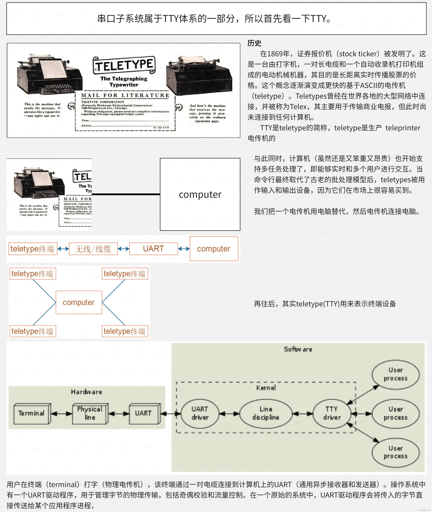
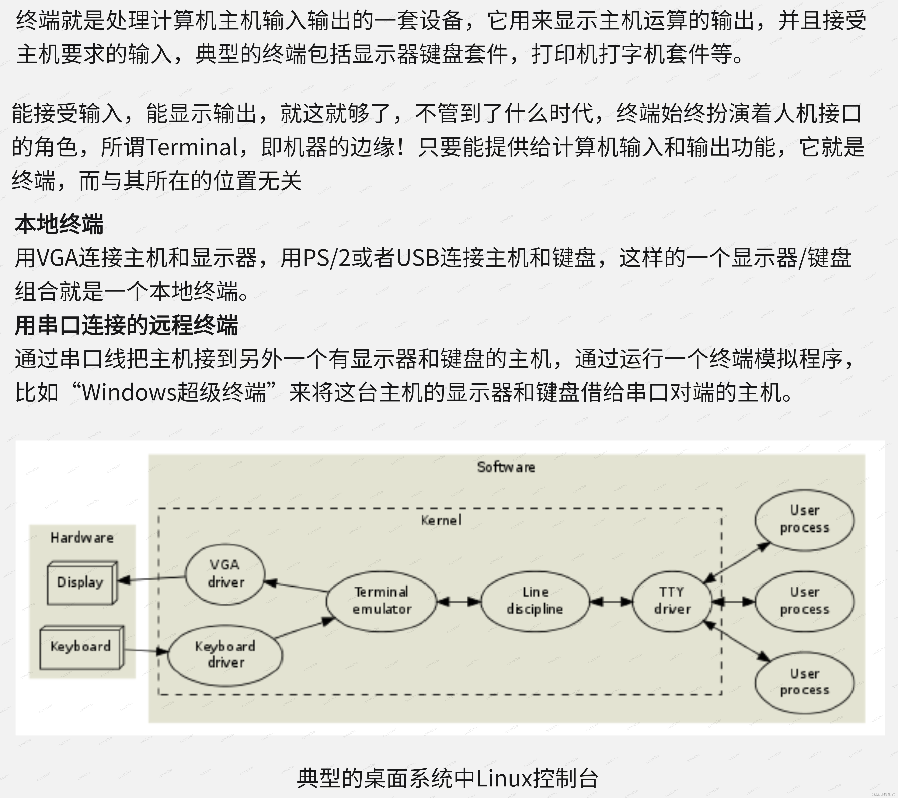
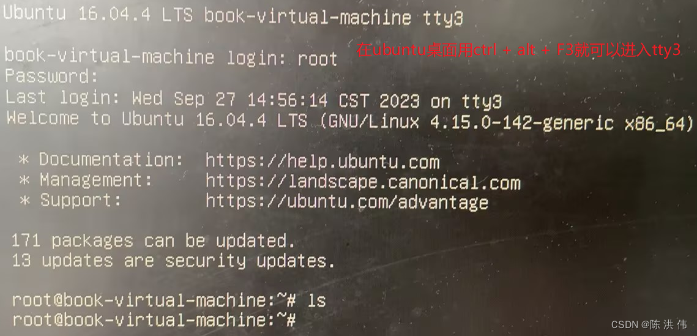
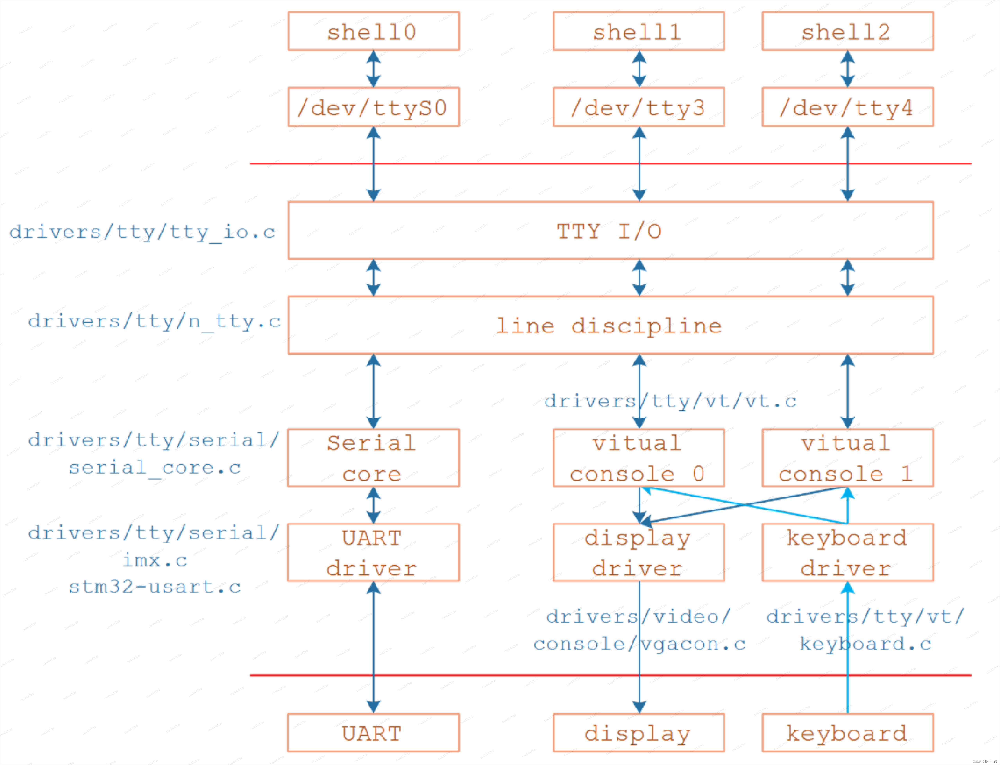
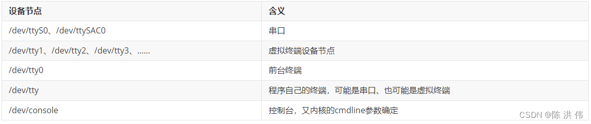
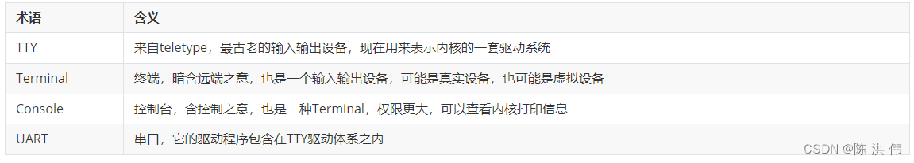

# TTY 的概念和历史

如上图所示, 刚开始一家公司之前生产的 teleprinter 很有名, 这个所谓的**远程打字机**, 其实就是**两台打字机连接起来**, 然后可以**相互传输电报**, 后来, 电脑出现了, 开始把其中一个打字机去掉换成电脑, 然后**打字机用串口连接到电脑**, 再往后呢, 电脑还可以连接其他的一些终端设备, 由于这一段历史, 连接到电脑的一些其他设备也叫 **TTY 设备**, 那这些设备对应的驱动也就跟 TTY 扯上了关系, 大体了解下这段历史就可以了. 

# 终端的概念

对于电脑来说, 终端其实简单来说就是扮演一个人机接口的角色, 能给计算机提供输入输出功能, 所以像键盘和显示器属于终端, 然后用串口远程连接电脑, 这个中断模拟程序也可以称为终端, 

然后呢, 我们在电脑上打开的虚拟桌面也可以称为终端.

# TTY 整体框架

经过前面对tty的历史以及终端概念的大体介绍, 现在可以引出来tty的一个大体驱动框架了, 上图是TTY的一个整体框架, 对于我们一个uart驱动来说, uart驱动可以由三部分组成, 

* TTY 层: 在Linux或UNIX系统中, TTY子系统负责管理所有的终端设备, 包括物理设备(如键盘和显示器), 串行设备(如串口), 以及虚拟设备(如SSH终端和伪终端). TTY子系统通过TTY驱动程序在内核级别实现进程管理、行编辑和会话管理. 因此, 无论是物理设备、串行设备还是虚拟设备, 都由TTY子系统进行管理. TTY驱动程序主要负责上层的逻辑处理, 包括数据缓存、字符设备的创建和管理, 以及用户空间和内核空间之间的数据交互等. 

* line discipline 层: 大多数用户都会在输入时犯错, 所以退格键会很有用. 这当然可以由应用程序本身来实现, 但是根据 UNIX设计"哲学", 应用程序应尽可能保持简单. 为了方便起见, 操作系统提供了一个编辑缓冲区和一些基本的编辑命令(退格, 清除单个单词, 清除行, 重新打印), 这些命令在行规范(line discipline)内默认启用, 行规程规定了键盘, 串口, 打印机, 显示器等输入输出设备和用户态Shell等程序之间的行为规范, 键盘上的按键事件被行规程解释成了Shell可以理解的输入并给出相应的输出. 人们要想操作计算机, 这套规程是必不可少的, 它事实上规定了信息从外部进入计算机的规范. 

* uart驱动层: UART驱动程序主要负责底层的硬件操作, 包括数据的发送和接收, 以及中断的处理等. 

上图中标注了在linux内核中, tty层, line discipline层, 以及uart驱动层分别在哪个文件里面. 

## TTY子系统中设备节点的差别

`/dev/ttyS0`、`/dev/ttySAC0`、`/dev/tty`、`/dev/tty0`、`/dev/tty1`、`/dev/console`, 它们有什么差别?

内核的打印信息从哪个设备上显示出来, 可以通过内核的cmdline来指定, 

比如: `console=ttyS0 console=tty`

我不想去分辨这个设备是串口还是虚拟终端,  有没有办法得到这个设备? 有！

通过 `/dev/console`！

`console=ttyS0` 时: `/dev/console` 就是 ttyS0
`console=tty` 时: `/dev/console` 就是前台程序的虚拟终端
`console=tty0` 时: `/dev/console` 就是前台程序的虚拟终端
`console=ttyN` 时: `/dev/console` 就是 `/dev/ttyN`

console有多个取值时, 使用最后一个取值来判断

# 驱动工作原理

uart 驱动程序工作的原理就是往指定的 io 端口写入数据, 每次传送 8 个bit. 

其中, io 端口与 com 口的对应关系如下: 

COM端口号 | IO端口基地址
---------|----------
 1 | 0x3f8
 2 | 0x2f8
 3 | 0x3e8
 4 | 0x2e8
 5 | 0x5f8
 6 | 0x4f8
 7 | 0x5e8
 8 | 0x4e8

每个COM口有8个寄存器, 功能如下: 

| Base Address | DLAB | I/O Access | Abbrv. | Register Name
---|---|---|---|---
| +0 | 0 | Write | THR | Transmitter Holding Buffer
| +0 | 0 | Read | RBR | Receiver Buffer
| +0 | 1 | Read/Write | DLL | Divisor Latch Low Byte
| +1 | 0 | Read/Write | IER | Interrupt Enable Register
| +1 | 1 | Read/Write | DLH | Divisor Latch High Byte
| +2 | x | Read | IIR | Interrupt Identification Register
| +2 | x | Write | FCR | FIFO Control Register
| +3 | x | Read/Write | LCR | Line Control Register
| +4 | x | Read/Write | MCR | Modem Control Register
| +5 | x | Read | LSR | Line Status Register
| +6 | x | Read | MSR | Modem Status Register
| +7 | x | Read/Write | SR | Scratch Register

The "x" in the DLAB column means that the status of the DLAB has no effect on what register is going to be accessed for that offset range. Notice also that some registers are Read only. If you attempt to write data to them, you may end up with either some problems with the modem (worst case), or the data will simply be ignored (typically the result). As mentioned earlier, some registers share a Port I/O address where one register will be used when you write data to it and another register will be used to retrieve data from the same address.

## 设置波特率

波特率的设置是通过设置 divisor 来实现的

`BaudRate = 115200/DivisorLatchValue`

## 发送与接收数据

操作就是先读取标志位, 确认是否端口处于忙的状态, 然后从 DATA_REG 读取数据. 

# reference

Linux内核UART串口子系统驱动框架详解: https://blog.csdn.net/u013171226/article/details/133343779

