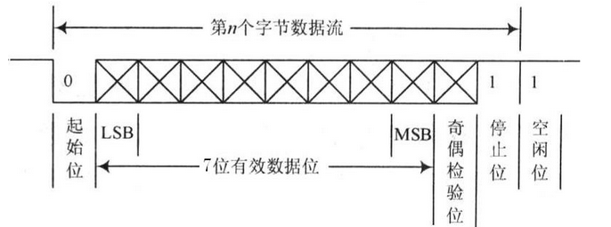
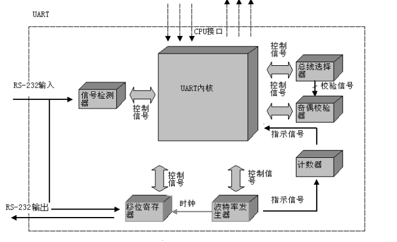
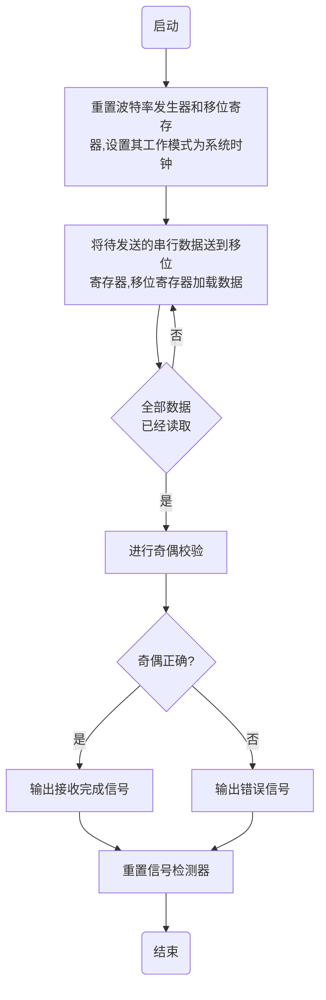
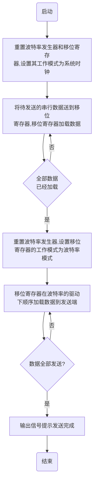

简本文介绍了UART协议, UART的工作原理、各类feature, 以及简单的驱动功能接口介绍

# 1. UART协议简介

## 1.1. 协议内容简介

**通用异步收发传输器**(Universal Asynchronous Receiver/Transmitter), 通常称作 UART, 是一种异步收发传输器, 是电脑硬件的一部分. 将资料由串行通信与并行通信间作传输转换, 作为**并行输入**成为**串行输出**的**芯片**, 通常集成于其他通讯接口的连结上.

UART 是一种通用串行数据总线, 用于异步通信. 该总线双向通信, 可以实现全双工传输和接收. 在**嵌入式**设计中, UART 用来**主机与辅助设备通信**, 如汽车音响与外接AP之间的通信, 与 PC 机通信包括与监控调试器和其它器件, 如 EEPROM 通信.

**串行通信**是指利用**一条传输线**将数据**一位位地顺序传送**. 特点是通信线路简单, 利用简单的线缆就可实现通信, 降低成本, 适用于**远距离通信**, 但**传输速度慢**的应用场合.

异步通信以**一个字符**为**传输单位**(另一个字符就是下一帧了), 通信中**两个字符**间的**时间间隔**多少是**不固定**的, 然而在**同一个字符**中的**两个相邻位**间的时间间隔是**固定**的.

## 1.2. 传输字符简介

数据传送速率用波特率来表示, 即**每秒钟**传送的**二进制位数**(bits per second, bps). 例如数据传送速率为 120 字符/秒, 而每一个字符为 10 位(1个起始位, 7个数据位, 1个校验位, 1个结束位), 则其传送的波特率为 10×120＝1200字符/秒=1200波特.

数据通信格式如下图:



图1 Uart数据传输格式

其中各位的意义如下:

1. 起始位: 先发出一个逻辑"0"的信号, 表示传输字符的开始.

2. 数据位: 紧接着起始位之后. 数据位的个数可以是5、6、7、8等, 构成一个字符. 通常采用ASCII码. 从最低位开始传送, 靠时钟定位.

3. 奇偶校验位: 资料位加上这一位后, 使得"1"的位数应为偶数(偶校验)或奇数(奇校验), 以此来校验资料传送的正确性.

4. 停止位: 它是一个字符数据的结束标志. 可以是1位、1.5位、2位的高电平.  由于数据是在传输线上定时的, 并且每一个设备有其自己的时钟, 很可能在通信中两台设备间出现了小小的不同步. 因此停止位不仅仅是表示传输的结束, 并且提供计算机校正时钟同步的机会. 适用于停止位的位数越多, 不同时钟同步的容忍程度越大, 但是数据传输率同时也越慢.

5. 空闲位: 处于逻辑"1"状态, 表示当前线路上没有资料传送.

## 1.3. UART实现原理

UART 主要由 UART 内核、信号监测器、移位寄存器、波特率发生器, 计数器、总线选择器和奇偶校验器总共 7 个模块组成. 实现原理图见下图.



图2 Uart 实现原理图

UART各个模块的功能如下:

1. UART内核模块

UART 内核模块是整个设计的核心. 在数据接收时, UART 内核模块负责控制波特率发生器和移位寄存器, 使得移位寄存器在波特率是中的驱动下同步地接收并且保存 RS-232 接收端口的串行数据. 在数据发送时, UART 内核模块首先根据待发送的数据和奇偶校验位的设置**产生完整的发送序列**(包括起始位、数据位、奇偶校验位和停止位), 之后控制**移位寄存器**将序列加载到移位寄存器的内部寄存器里, 最后再控制**波特率发生器**驱动移位寄存器将数据串行输出.

2. 信号监测模块

信号监测模块用于对 RS-232 的输入信号(经过电平转换后的逻辑信号)进行实时的检测, 一旦发现新的数据则立即通知 UART 内核.

3. 移位寄存器模块

移位寄存器模块的作用是**存储输入或者输出的数据**. 当 UART 接收 RS-232 输入时, 移位寄存器在波特率模式下采集 RS-232 输入信号, 并且保存结果; 当 UART 进行 RS-232 输出时, UART 内核首先将数据加载到移位寄存器内, 再使移位寄存器在波特率模式下将数据输出到 RS-232 输出端口上.

4. 波特率发生模块

由于 RS-232 传输必定是工作在某种波特率下, 比如 9600, 为了便于和 RS-232 总线同步, 需要产生符合RS-232传输波特率的时钟.

5. 奇偶校验模块

奇偶校验模块的功能是根据奇偶校验的设置和输入数据计算出相应的奇偶校验位, 它是通过组合逻辑实现的.

6. 总线选择模块

总线选择模块用于选择奇偶校验器的输入是数据发送总线还是数据接收总线. 在接收总线时, 总线选择模块将数据接收总线连接到奇偶校验器的输入端, 来检查已接收的数据的奇偶校验位是否正确; 而在发送数据时, 总线选择模块将数据发送总线连接到奇偶校验器的输入端, UART 内核模块就能够获取并且保存发送序列所需的奇偶校验位了.

7. 计数器模块

计数器模块的功能是记录串行数据发送或者接收的数目, 在计数到某数值时通知 UART 内核模块.

## 1.4. UART收发流程

UART 工作流程可以分为接收过程和发送过程部分.

**接收过程**指的是 UART 监测到 RS-232 总线上的数据, 顺序读取串行数据并且将其输出给 CPU 的过程. 当信号监测到新的数据(RS-232 输入逻辑变为0, 即 RS-232 输入协议的起始位)就会触发接收过程, 其流程如图所示. 首先UART内核会重置波特率发生器和移位寄存器, 并且设置移位寄存器的工作模式为波特率模式, 以准备接收数据. 其次, 移位寄存器在波特率时钟的驱动下工作, 不断地读取RS-232串行总线的输入数据, 并且将数据保存在内部的寄存器内. 接收完成后, UART内核会对已接收的数据进行奇偶校验并且输出校验结果. 最后, UART内核会重置信号监测器, 以备下一次数据接收. 流程图见下图3.

图3 uart 接收数据流程图:


发送过程有加载和发送两个步骤组成, 如图4所示. 加载步骤是UART内核按RS-232串行发送的顺序将起始位、数据位、奇偶校验位和停止位加载到移位寄存器内, 这个过程工作在系统时钟下, 相对于RS-232的传输速度来说非常快. 完成加载步骤后, UART内核会重置波特率发生器, 并且设置移位寄存器工作在波特率模式下, 于是移位寄存器便在波特率时钟的驱动下依次将加载的数据发送到RS-232的发送端TxD, 这样便产生了RS-232的数据发送时序.

图4 uart 发送数据流程图:


## 1.5. UART 传输时序

**发送数据过程**: 空闲状态, 线路处于高电位; 当收到发送数据指令后, 拉低线路一个数据位的时间 T, 接着数据按低位到高位依次发送, 数据发送完毕后, 接着发送**奇偶校验位**和**停止位**(停止位为高电位), 一帧资料发送结束.

**接收数据过程**: 空闲状态, 线路处于高电位; 当检测到线路的下降沿(线路电位由高电位变为低电位)时说明线路有数据传输, 按照约定的波特率从低位到高位接收数据, 数据接收完毕后, 接着接收并比较奇偶校验位是否正确, 如果正确则通知后续设备准备接收数据或存入缓存.

由于 UART 是异步传输, 没有传输同步时钟. 为了能**保证数据传输的正确性**, UART 采用 **16 倍数据波特率**的**时钟**进行采样. **每个数据**有 **16 个时钟采样**, **取中间的采样值**, 以保证采样不会滑码或误码. 一般 UART 一帧的数据位数为 8, 这样即使每个数据有一个时钟的误差, 接收端也能正确地采样到数据.

UART 的接收数据时序为: 当检测到数据的下降沿时, 表明线路上有数据进行传输, 这时**计数器** CNT 开始计数, 当计数器为 `24 = 16 + 8` 时, 采样的值为第 0 位数据; 当计数器的值为 40 时, 采样的值为第 1 位数据, 依此类推, 进行后面 6 个数据的采样. 如果需要进行奇偶校验, 则当计数器的值为 152 时, 采样的值即为奇偶位; 当计数器的值为 168 时, 采样的值为 "1" 表示停止位, 一帧数据接收完成.

## 1.6. UART相关寄存器简介

Uart 中主要的寄存器包含了线控制寄存器(ULCON)、控制寄存器(UCON)、FIFO 控制寄存器(UFCON)、MODEM控制寄存器(UMCON)、发送/接收状态寄存器(UTRSTAT)、错误状态寄存器(UERSTAT)、FIFO状态寄存器(UFSTAT)、MODEM状态寄存器(UMSTAT)、发送缓冲寄存器(UTXHn)、接收缓冲寄存器(URXHn)、波特率除数寄存器等.

由于每个版本的代码程序中寄存器都存在区别, 具体各寄存器的相应位对应的功能不在这里阐述, 后面会对应各个版本具体介绍.

## 1.7. 波特率的产生和误差

### 1.7.1. 波特率除数因子

在 UART 中**波特率发生器**为发送器和接收器提供**工作时钟**. 波特率发生器的时钟源可以选择 S3C2440A 的内部系统时钟(PCLK, FCLK/n)或 UEXTCLK(外部时钟源), 可以通过设置 UCONn 寄存器来设置波特率发生器的输入时钟源. 通常我们选择使用 PCLK 作为 UART 工作时钟.

UART 控制器中**没有**对**波特率**进行**设置**的寄存器, 而是通过设置一个**除数因子**, 来决定其波特率. 其计算公式如下:

```
 	UART除数(UBRDIVn) = (int)(CLK/(buad rate * 16 )) - 1
```

注: 上面好像不对, `divisor = (CLK frequency/(16 × Baud Rate))`

其中: UBRDIVn 的取值范围应该为 `1 ~ 2^16-1` . 例如: **波特率**为 `115200bps`, PCLK 时钟为其**工作频率**, 采用 50MHz, UBRDIVn 为:

```
 	UBRDIVn = (int)(50M / (115200 x 16)) - 1 = 26
```

在系统时钟未初始化时, PCLK = 12MHz, 如果波特率采用57600bps, 那么UBRDIVn为:

```
 	UBRDIVn = (int)(12M / (57600 x 16)) - 1 = 12
```

当使用外部时钟源时, 如果外部时钟小于 PCLK 时钟, 则 UEXTCLK 应该设置为 0.

### 1.7.2. 波特率的错误容忍率

数据信号在传输过程中由于外界电磁干扰, 信号减弱等原因, 当时钟频率较低, 传输速率较高时会产生误差, 当误差达到一定值时, 会出现数据信号不能正常识别, 造成通信异常. 好比如, 在普通列车轨道上试图行驶高速列车一样, 由于高速列车对轨道要求很高, 当速度达到一定程度, 很可能造成事故. 业界的波特率的错误容忍率为 1.86%(3 / 160), 如果大于该值则应该选择较低的波特率或提高输入时钟频率.

**错误容忍率**计算公式为:

```
 	UART Error = (tUPCLK - tUEXACT)/ tUEXACT * 100%
```

注:

tUPCLK为UART的真实工作时钟频率:

```
	tUPCLK = (UBRDIVn + 1) * 16 * 1Frame / PCLK
```

tUEXACT为UART理想工作时钟频率:

```
	tUEXACT = 1Frame / baud-rate
```

其中: 1Frame为数据帧的长度 =开始位 +数据位 +可选校验位 +停止位

假如, 波特率采用 115200bps, PCLK时钟为50MHz, 波特率除数因子UBRDIVn为 26(通过前面UBRDIVn计算公式算出), 采用1个停止位, 8个数据位, 无校验的8N1方式通信时, 其错误容忍率为:

```
          tUPCLK = 27 * 16 * 10 / 50M = 0.0000864
          tUEXACT = 10 / 115200 = 0.0000868
          UART Error  = | 0.0000864 - 0.0000868 | / 0.0000868 = 0.46%
```

在开发板没有初始化系统时钟前, 开发板工作在 12MHz 下, 假如我们将波特率设置为 115200bps, 采用 PCLK 为系统默认时钟 12MHz, 8N1 数据帧格式通信, 那么:

```
 	UBRDIVn = (int)(12M / (115200 * 16)) - 1 = 6
```

其错误容忍率:

```
          tUPCLK = 7 * 16 * 10 / 12M = 0.0000933
          tUEXACT = 10 / 115200 = 0.0000868
          UART Error = | 0.0000933 - 0.0000868 | / 0.0000868 = 7.5%
```

其错误容忍率大于1.86%, 因此在12MHz频率下, 波特率不能设置为115200, 现在将波特率设置为56700bps, 采用8N1数据帧格式通信, 那么:

```
          UBRDIVn = (int)(12M / (57600 * 16)) - 1 = 12
          tUPCLK = 13 * 16 * 10 / 12M = 0.000173
          tUEXACT = 10 / 57600 = 0.0001736
          UART Error = | 0. 000173 - 0. 0001736 | / 0. 0001736 = 0.345%
```

采用波特率为56700bps, 8N1数据帧格式通信时, 其错误容忍率小于标准的1.86%, 因此可以正常工作.

## 1.8. 中断控制

出现以下情况时, 可使 UART 产生中断:

1. FIFO 溢出错误

2. 线中止错误(line-break, 即Rx 信号一直为0 的状态, 包括校验位和停止位在内)

3. 奇偶校验错误

4. 帧错误(停止位不为1)

5. 接收超时(接收FIFO 已有数据但未满, 而后续数据长时间不来)

6. 发送

7. 接收

由于所有中断事件在发送到中断控制器之前会一起进行 "或运算" 操作, 所以任意时刻 UART 只能向中断产生一个中断请求. 通过查询中断状态函数 UARTIntStatus( ), 软件可以在同一个中断服务函数里处理多个中断事件(多个并列的if 语句).

## 1.9. FIFO 操作

FIFO 是 "First-In First-Out" 的缩写, 意为"先进先出", 是一种常见的队列操作.  Stellaris 系列ARM 的UART 模块包含有 2 个 16 字节的 FIFO: 一个用于发送, 另一个用于接收. 可以将两个 FIFO 分别配置为以不同深度触发中断. 可供选择的配置包括: 1/8、 1/4、1/2、3/4 和7/8 深度. 例如, 如果接收 FIFO 选择 1/4, 则在 UART 接收到 4 个数据时产生接收中断.

发送FIFO的基本工作过程: 只要有数据填充到发送 FIFO 里, 就会立即启动发送过程. 由于发送本身是个相对缓慢的过程, 因此在发送的同时其它需要发送的数据还可以继续填充到发送 FIFO 里. 当发送 FIFO 被填满时就不能再继续填充了, 否则会造成数据丢失, 此时只能等待. 这个等待并不会很久, 以 9600 的波特率为例, 等待出现一个空位的时间在 1ms 上下. 发送 FIFO 会按照填入数据的先后顺序把数据一个个发送出去, 直到发送 FIFO 全空时为止. 已发送完毕的数据会被自动清除, 在发送 FIFO 里同时会多出一个空位.

接收 FIFO 的基本工作过程:  当硬件逻辑接收到数据时, 就会往接收 FIFO 里填充接收到的数据. 程序应当及时取走这些数据, 数据被取走也是在接收FIFO 里被自动删除的过程, 因此在接收 FIFO 里同时会多出一个空位. 如果在接收 FIFO 里的数据未被及时取走而造成接收FIFO 已满, 则以后再接收到数据时因无空位可以填充而造成数据丢失.

收发 FIFO 主要是为了解决 UART 收发中断过于频繁而导致 CPU 效率不高的问题而引入的. 在进行 UART 通信时, 中断方式比轮询方式要简便且效率高. 但是, 如果**没有收发 FIFO**, 则**每收发一个数据**都要**中断处理一次**, 效率仍然不够高. 如果有了收发 FIFO, 则可以在连续收发若干个数据(可多至 14 个)后才产生一次中断然后一并处理, 这就大大提高了收发效率.

完全不必要担心FIFO 机制可能带来的数据丢失或得不到及时处理的问题, 因为它已经帮你想到了收发过程中存在的任何问题, 只要在初始化配置 UART 后, 就可以放心收发了,  FIFO 和中断例程会自动搞定一切.

## 1.10. 回环操作

UART 可以进入一个内部回环(Loopback)模式, 用于诊断或调试. 在回环模式下, 从Tx 上发送的数据将被Rx 输入端接收.

## 1.11. 串行红外协议

在某些 Stellaris 系列 ARM 芯片里, UART 还包含一个 IrDA 串行红外(SIR)编码器/ 解码器模块. IrDA SIR 模块的作用是在异步UART数据流和半双工串行SIR 接口之间进行转换. 片上不会执行任何模拟处理操作. SIR 模块的任务就是要给UART 提供一个数字编码输出和一个解码输入. UART 信号管脚可以和一个红外收发器连接以实现IrDA SIR物理层连接.

# 2. uart初始化相关程序代码介绍

Uart相关的初始化程序在 `uboot/drivers/serial/serial_sfax8.c`
sfax8_generic_setbrg 函数定义计算了波特率除数因子的整数和小数部分的值并写入寄存器中.

```cpp
static int sfax8_generic_setbrg(struct sfax8_regs *regs, int clock, int baudrate)
{
    unsigned int temp;
    unsigned int divider;
    unsigned int remainder;
    unsigned int fraction;

    /*
    * Set baud rate
    *
    * IBRD = UART_CLK / (16 * BAUD_RATE)
    * FBRD = RND((64 * MOD(UART_CLK,(16 * BAUD_RATE)))
    *		/ (16 * BAUD_RATE))
    */
    temp = 16 * baudrate;
    divider = clock / temp;
    remainder = clock % temp;
    temp = (8 * remainder) / baudrate;
    fraction = (temp >> 1) + (temp & 1);

    writel(divider, &regs->sfax8_ibrd);	//写入波特率整数部分
    writel(fraction, &regs->sfax8_fbrd);	//写入波特率小数部分

    sfax8_set_line_control(regs);
    /* Finally, enable the UART */
    writel(UART_SFAX8_CR_UARTEN | UART_SFAX8_CR_TXE |
            UART_SFAX8_CR_RXE | UART_SFAX8_CR_RTS, &regs->sfax8_cr);	//使能UART, 打开TX、RX通道

    return 0;
}
```

上述代码中的 `sfax8_set_line_control(regs)` 接口会将数据长度、FIFO enable等参数写入到行控制寄存器中.

```cpp
	static int sfax8_set_line_control(struct sfax8_regs *regs)
	{
		unsigned int lcr;
		/*
	 	* Internal update of baud rate register require line
	 	* control register write
	 	*/
		lcr = UART_SFAX8_LCRH_WLEN_8 | UART_SFAX8_LCRH_FEN;	//设置数据长度为8, 使能FIFO
		writel(lcr, &regs->sfax8_lcrh);
		return 0;
	}
```

Serial_getc 函数、serial_putc函数、serial_tstc函数的基本实现与mtk的版本基本相同.

```cpp
	static int sfax8_getc(struct sfax8_regs *regs)
	{
		unsigned int data;

		/* Wait until there is data in the FIFO */
		if (readl(&regs->fr) & UART_SFAX8_FR_RXFE)
			return -EAGAIN;

		data = readl(&regs->dr);

		/* Check for an error flag */    //校验数据寄存器bit8 ~ 11, 检测是否有error状态产生
		if (data & 0xFFFFFF00) {
			/* Clear the error */
			writel(0xFFFFFFFF, &regs->ecr);
			return -1;
		}

		return (int) data;
	}

	static int sfax8_putc(struct sfax8_regs *regs, char c)
	{
		/* Wait until there is space in the FIFO */
		if (readl(&regs->fr) & UART_SFAX8_FR_TXFF)
			return -EAGAIN;

		/* Send the character */
		writel(c, &regs->dr);

		return 0;
	}

	static int sfax8_tstc(struct sfax8_regs *regs)
	{
		WATCHDOG_RESET();
		return !(readl(&regs->fr) & UART_SFAX8_FR_RXFE);
	}
```
# 3. 项目引用

此项目参考文档

- [STM8 IrDA红外功能](http://www.waveshare.net/article/STM8-3-2-77.htm)

- [UART简介](http://wiki.dzsc.com/info/3674.html )

- [UART中的硬件流控RTS与CTS](http://blog.csdn.net/zeroboundary/article/details/8966586 )

# 4. FAQ

## 4.1. 是否存在非 FIFO 模式?

非FIFO模式还是存在的, 数据发送的时候, 放在传输缓冲区里面, 加上起始位、(奇偶校验位)、停止位, 然后传输; 接收的时候, 数据和状态都被放在接收缓冲寄存器中.

在非FIFO模式下, 数据接收和传输的缓冲区为对应FIFO的底部的一个字节, 故而是支持非FIFO模式的.

## 4.2. 中断的条件如何自己去创造?很多中断产生的条件都是不能直接进行更改的部分.

1. 溢出错误中断: UARTRIS_OERIS = 1 中断 . 以什么判断是否溢出?FIFO深度?(这里与发送接收中断的区别不太清晰)

只要有数据填充到发送FIFO 里, 就会立即启动发送过程. 由于发送本身是个相对缓慢的过程, 因此在发送的同时其它需要发送的数据还可以继续填充到发送 FIFO 里. 当发送 FIFO 被填满时就不能再继续填充了, 否则会造成数据丢失, 此时只能等待. 这里造成等待的就是溢出中断. 当设置了FIFO发送/接收中断水平时, 产生的则是发送/接收中断.

2. 中止错误中断: UARTRIS_BERIS =1 中断. ＲＸ信号一直为0的状态, 包括校验位和停止位. 这个可以手工进行设置RX为0, 校验位为0.
停止位可以设置1位或是2位. (设置为2位并且传输数据长度为5是停止位为1.5位, 待验证. *****验证无误*****)

硬件拉低电平, 使停止位为低电平(未使用).

3. 奇偶校验位错误中断: UARTRIS_PERIS =1 中断. 在选择了奇/偶校验的同时, 强制选择校验位数值, 观察与校验规则相悖的错误产生时, 该中断位是否变化, 是否会产生中断. (强制校验位数值确认会被视为错误产生中断)

4. 帧结构错误中断: 帧错误, 停止位不为1.
**上述的三种中断可以通过串口工具, 由串口输入一个数据长度、奇偶校验等与uart设定不同的数据模块, 从而满足相应的中断条件, 并产生中断. 同样的, 通过两个UART的回环测试, 设置不同的数据长度和奇偶校验, 巧妙的设置传输数据, 既可以产生这些中断. **

## 4.3. UART 设置Empty中断LEVEL, 和实际产生中断的条件的特别说明.

UART设置了FIFO警戒LEVEL后, 需要FIFO的中有效数据数目高于TX的LEVEL, 然后TX BLOCK持续发送数据, 直到数据数目低于警戒LEVEL才会才生中断.

如果FIFO中的数据一直低于警戒LEVEL, 则不会产出中断.
**SPI模块是只要FIFO中的数据低于警戒LEVEL就会产生中断. **

## 4.4. 红外模式设定后, 数据并没有从红外的对应IO输入输出数据, 仍然是UART的TX RX输入输出(应该从红外的输入\输出PIN上做数据收发).

由于在寄存器可配置的与红外相关的位只有红外使能位SIREN 、红外低耗使能位SIRLP、红外低耗波特率寄存器IrDA Low-Power Counter Register.

所以在程序编程寄存器配置这方面可做的调整很少, 需要在软硬件方面去核实红外模式产生的触发条件.

类似的触发条件在STM8 的技术手册中有所介绍.

红外测试通过

发现的问题:

1. 使能的先后顺序: 需要先使能红外, 再使能UART整个模块.

2. 红外的回环收发, 在两个UART的回环连接处需要加上一个取反器, 将红外编码产生的脉冲置零, 低电平置1. 然后再输入到另一个UART的接收端, 进行红外的解码.

可参考: [STM8 IrDA红外功能](http://www.waveshare.net/article/STM8-3-2-77.htm)和[UART简介](http://wiki.dzsc.com/info/3674.html )

## 4.5. CTS RTS 软件配置?详细流程?

CTS、RTS 为流控中的两个信号位.

流控又分为了软件流控和硬件流控.

软件流控是由 XON 和 XOFF 控制的.

硬件流控: 使能RTSEN和CTSEN, 然后硬件会根据FIFO的情况来自动的对RTS拉高拉低(低有效), 对应发送方的CTS随之变化.

而在不开启RTSEN和CTSEN时, 只是针对RTS位进行操作的话, 虽然CTS位会跟随着变化, 但是不能起到流控的作用. 也就是说, 寄存器中的RTS位可以认为没有作用.

可参考: [UART中的硬件流控RTS与CTS](http://blog.csdn.net/zeroboundary/article/details/8966586 )  中对于流控的介绍.

## 4.6. FPGA,使用921600波特率, 数据长度为5时, PC收不到数据乱码, 信号未确认. FPGA回环正常.

将PC收取的数据, 转化为二进制数据时, 发现PC收取的数据是实际发送数据的低5位, 高三位自动补零. 转化为ASSIC码时看起来像乱码.
实际收取数据正常.

## 4.7. 中断屏蔽和中断清除的测试问题

中断mask ( M ) 的作用与spec介绍的相反, 置1的时候不屏蔽, 置0的时候屏蔽;

屏蔽后的中断状态是M和R的与的结果, 即M修改会直接影响到S.

Interrupt Mask Set/Clear Register(中断屏蔽设置/清除, 简单记为M)

Raw Interrupt Status Register(原始中断状态寄存器, 简单记为R)

Masked Interrupt Status Register(屏蔽后的中断状态寄存器, 简单记为S)

Interrupt Clear Register(中断清除寄存器, 简单记为C)

现在测试的溢出中断中, 先产生溢出中断,

此时, R=45F;

S=45F;

1. 若直接M(置零), R = 41F; S = 0; (这里的超时中断异常)

2. 若直接C  (清除中断), R=0; S=0;

3. 先M, 后C, R=0; S=0;

从中得到的结论是清除中断寄存器(C)是清除R中断状态,所以S状态也跟被清零了. (codescape的地址空间中超时中断位显示异常, 与程序中看到的状态不同. )

M是在1的时候使能, 0的时候屏蔽中断.

S是M与R相结合所产生的, M屏蔽的S的状态, 不影响R的状态.

## 4.8. UART超时中断的验证

UART超时中断通过代码的查询和程序的验证, 确认R与M都是一样的, 屏蔽的话, 该中断位在R与M中均不会再产生.

## 4.9. 溢出错误中断的产生

溢出错误终端只有在接收数据的时候会产生, 做TX时, 如果TX  FIFO中数据堆满, 多余的数据会直接丢失而不产生溢出错误中断.

## 4.10. 串口如果没有输出,该如何处理

串口没有输出的时候,应该考虑如下原因

1. 串口线是否可以正常使用,通过找一个可以正常使用的板子,看是否正常输出,或者是找硬件检查串口线是否正常

2. 接线是否正确, 一定要保证串口线和开发板的插针一一对应, TX<->TX  RX<->RX 地<->地

3. 如果以上两步检查还是无法解决问题,则可以找硬件检查开发板和找软件检查烧录的镜像的正确性

## 4.11. 如果串口输出乱码, 该如何处理

一般输出乱码考虑串口工具的波特率设置的是否正确,Siflower默认串口的波特率为115200
