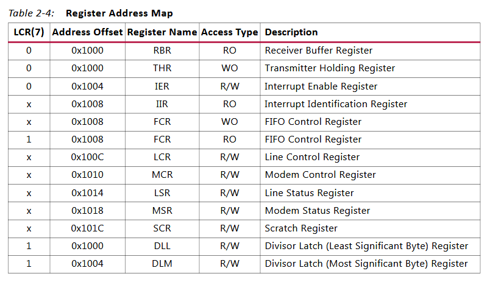
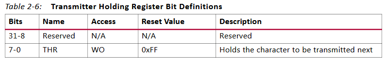
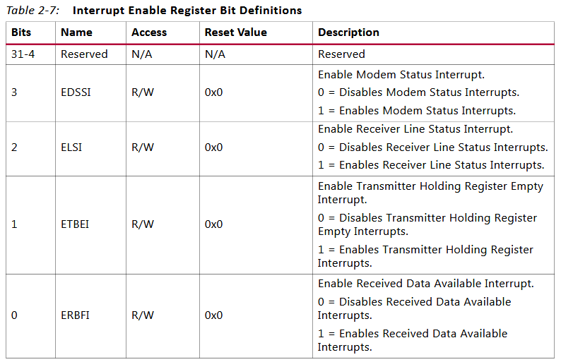
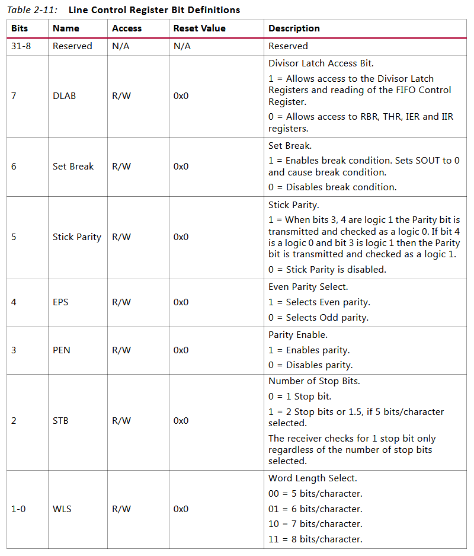
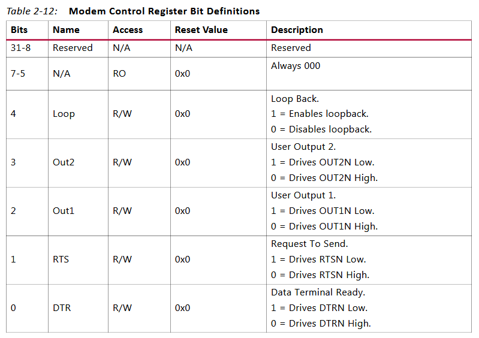
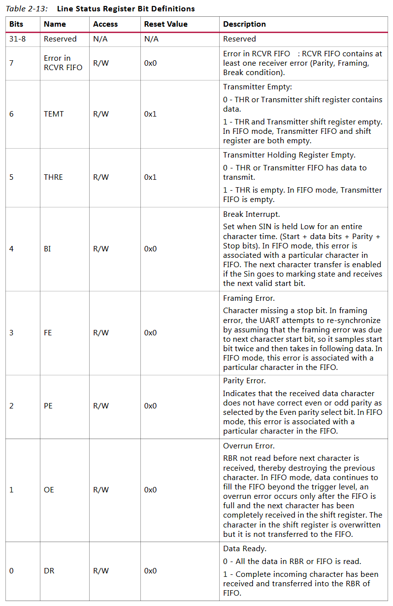
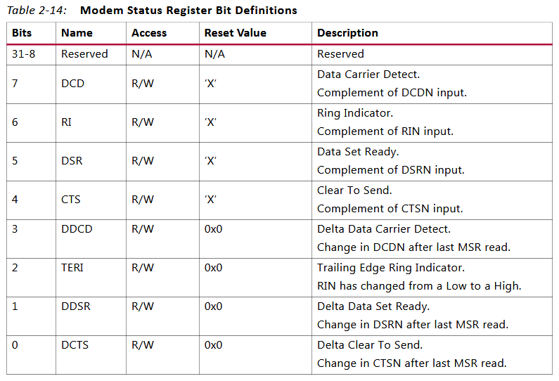

# 基本概念

## 波特率和分频器值

计算 16550 UART 的波特率涉及几个关键步骤, ‌包括设置波特率除数寄存器(‌低字节和高字节)‌以及理解波特率与分频系数的关系. 

理解波特率的概念: ‌波特率, ‌即数据位率, ‌是单位时间内传送的二进制数据的位数, ‌以位/秒(‌b/s)‌表示. ‌它表示了数据传输的速度. ‌

1. 设置波特率除数寄存器: ‌16550 UART 通过**两个 8 位**的波特率除数寄存器(‌一个低字节 DLL 和一个高字节 DLH)‌来设置波特率. ‌这两个寄存器共同决定了波特率值. ‌写入这两个寄存器的值将直接影响数据的传输速率. ‌

16550 UART的分频器值(Divisor Latch Value)用于设置UART的波特率. 分频器值是一个整数, 它决定了UART内部波特率发生器的分频比例. 计算分频器值的公式如下: 

```
波特率 = 时钟频率 / (分频器的值 * 16)

分频器的值 = 时钟频率 / (波特率 * 16)
```

这里的16是因为16550 UART使用 16 倍过采样技术来检测接收到的信号. 时钟频率是UART的输入时钟, 波特率是你希望设置的通信速率. 

例如, 如果UART的时钟频率是1.8432 MHz(这是一个常用的频率, 因为它可以方便地分频得到标准波特率), 并且你想要设置波特率为9600, 那么分频器值计算如下: 

```
分频器值 = 1,843,200 / (9600 × 16)
分频器值 = 1,843,200 / 153,600
分频器值 = 12
```

因此, 你需要将分频器设置为12来得到9600波特的通信速率. 

在实际应用中, 你需要通过编程方式将计算出的分频器值写入到UART的分频器锁存寄存器(Divisor Latch Registers)中. 这通常涉及到设置UART的线路控制寄存器(Line Control Register)来启用对分频器锁存寄存器的访问, 然后写入**高位**和**低位**分频器值. 

```cpp
    uint16_t divisor = UART_CLOCK_FREQ / (16 * baud_rate);
    vuart->dll = divisor & 0xFF; // 低字节
    vuart->dlh = (divisor >> 8) & 0xFF; // 高字节
```

# 介绍

8250 是 IBM PC 及兼容机使用的一种串口芯片; 16550 是一种带先进先出(FIFO)功能的 8250 系列串口芯片; 16550A 则是 16550 的升级版本, 修复了 FIFO 相关 BUG, 也是目前比较常见的串口芯片.

本文介绍的是 Xilinx UART 驱动分析, 硬件操作部分分析 16550 的实现.

Xilinx UART 驱动主要由 `drivers/tty/serial/xilinx_uartps.c` 来实现, 其相关配置和基本信息可参考: https://xilinx-wiki.atlassian.net/wiki/spaces/A/pages/18842340/PS+UART 或者附件 `A-PS UART-120824-070742.pdf`

# 16550 介绍

16550 寄存器信息如下:



RBR 定义如下:


THR 定义如下:



IER 定义如下:



IIR 定义如下:


FCR 定义如下:


LCR 定义如下:



MCR 定义如下:



LSR 定义如下:



MSR 定义如下:



SCR 定义如下:


# 配置步骤

配置 16550 模式的一般步骤:

1) 指定异步数据通信交换的格式

例如: 写入线控制寄存器来设置数据位(5、6、7或8)、打开奇偶校验并选择偶校验或奇校验、设置传输的停止位数.

通过编程线控制寄存器(Line Control Register, LCR)来设置除数锁存访问位(Divisor latch access bit).

2) 激活中断

向中断使能寄存器(Interrupt Enable register)写入值, 以允许特定的中断条件(如数据接收、发送缓冲区空等)生成中断.

3) 配置FIFO

写FIFO控制寄存器(FIFO Control register)以启用FIFOs、清除FIFOs和设置接收FIFO(RCVR FIFO)的触发级别.

4) 设置UART波特率

写除数锁存(Divisor Latch), 首先写入最低有效字节, 然后写入最高有效字节, 以正确设置UART的波特率.

5) 处理中断

当 UART 16550 触发中断时, 您的软件必须读取相关的寄存器(如接收缓冲区寄存器), 处理数据, 并清除中断标志.

# 16550 模式下的编程序列

## 设置目标

波特率: 56kbps

系统时钟: 100Mhz

使能 FIFO 接收缓冲区FIFO

异步数据传输格式: 8数据位(data bits)、偶校验(Even parity)和2停止位(stop bits)

## 设置流程

1) 写 `0x0000_0080` 到**线控制寄存器**(LCR)

设置 DLAB(Divisor Latch Access Bit)位为1, 允许写入 Divisor Latch 的值.

```cpp
//假设UART的LCR寄存器地址是0x<some_address>

uint16_t lcr_value = 0x0080; // 设置DLAB位为1

write_to_register(0x<some_address> , lcr_value); // 写入线控制寄存器
```

2) 写 `Divisor Latch` 以配置波特率

根据计算出的**分频值**设置 Divisor Latch 的**最低有效字节**(LSB)和**最高有效字节**(MSB). 分频器的值是通过时钟频率和期望的波特率计算得出的.

```
divisor = (CLK frequency/(16 × Baud Rate))
```

```cpp
// 假设UART的 Divisor Latch LSB和MSB的地址分别是0x<lsb_address>和0x<msb_address>
uint8_t divisor_lsb = 0x6F; // 分频器锁存器最低有效字节
uint8_t divisor_msb = 0x00; // 分频器锁存器最高有效字节(对于56 Kbps, 可能不需要这个字节, 取决于UART的具体实现)

write_to_register(0x<lsb_address>, divisor_lsb); // 写入分频器锁存器最低有效字节
write_to_register(0x<msb_address>, divisor_msb); // 写入分频器锁存器最高有效字节(如果需要的话)
```

注: lsb 就是 dll, msb 就是 dlh

3) 写 `0x0000_001F` 到**线控制寄存器**以设置数据格式

```cpp
// 重新设置线控制寄存器
uint16_t new_lcr_value = 0x001F; // 8数据位, 2停止位, 偶校验, DLAB=0
write_to_register(0x<some_address>, new_lcr_value); // 写入新的线控制寄存器值
```

4) 启用中断

```cpp
// 假设中断使能寄存器的地址是0x<ier_address>
uint8_t ier_value = 0x11; // 启用THRE(Transmitter Holding Register Empty)和RDA(Receive Data Available)中断
write_to_register(0x<ier_address>, ier_value); // 写入中断使能寄存器
```

5) 通过中断进行数据传输和接收

* 当THRE中断触发时, 意味着发送缓冲区为空, 可以写入新的数据到发送保持寄存器(Transmitter Holding Register).
* 当RDA中断触发时, 意味着接收缓冲区有新的数据可读, 可以从接收缓冲区寄存器(Receiver Buffer Register)中读取数据.

# 使用外部时钟时 16550 模式下的编程序列

## 设置目标

波特率: 56kbps

系统时钟: 100Mhz

外部xin时钟: 1.8432 MHz

使能 FIFO 接收缓冲区FIFO

异步数据传输格式: 8数据位(data bits)、偶校验(Even parity)和2停止位(stop bits)

## 设置流程

1) 写0x0000_0080到线控制寄存器

设置 DLAB(Divisor Latch Access Bit)位为 1, 允许写入 Divisor Latch 的值.

```
//假设UART的LCR寄存器地址是0x<some_address>
uint16_t lcr_value = 0x0080; // 设置DLAB位为1

write_to_register(0x<some_address> , lcr_value); // 写入线控制寄存器
```

2) 写Divisor Latch以配置波特率

根据计算出的分频值设置Divisor Latch的最低有效字节(LSB)和最高有效字节(MSB). 分频器的值是通过AXI时钟频率和期望的波特率计算得出的.

```
divisor = (AXI CLK frequency/(16 × Baud Rate))
```

```cpp
// 假设UART的 Divisor Latch LSB和MSB的地址分别是0x<lsb_address>和0x<msb_address>
uint8_t divisor_lsb = 0x02; // 分频器锁存器最低有效字节
uint8_t divisor_msb = 0x00; // 分频器锁存器最高有效字节(对于56 Kbps, 可能不需要这个字节, 取决于UART的具体实现)

write_to_register(0x<lsb_address>, divisor_lsb); // 写入分频器锁存器最低有效字节
write_to_register(0x<msb_address>, divisor_msb); // 写入分频器锁存器最高有效字节(如果需要的话)
```

3) 写 0x0000_001F 到线控制寄存器以设置数据格式

```cpp
// 重新设置线控制寄存器
uint16_t new_lcr_value = 0x001F; // 8数据位, 2停止位, 偶校验, DLAB=0
write_to_register(0x<some_address>, new_lcr_value); // 写入新的线控制寄存器值
```

4) 启用中断

```cpp
// 假设中断使能寄存器的地址是0x<ier_address>
uint8_t ier_value = 0x11; // 启用THRE(Transmitter Holding Register Empty)和RDA(Receive Data Available)中断
write_to_register(0x<ier_address>, ier_value); // 写入中断使能寄存器
```

5) 通过中断进行数据传输和接收

* 当 THRE 中断触发时, 意味着发送缓冲区为空, 可以写入新的数据到发送保持寄存器(Transmitter Holding Register).

* 当 RDA 中断触发时, 意味着接收缓冲区有新的数据可读, 可以从接收缓冲区寄存器(Receiver Buffer Register)中读取数据.

# 结构体

uart_driver 和 console 结构变量, 以及实现了 uart_ops 函数操作集定义如下所示

```cpp
// drivers/tty/serial/xilinx_uartps.c
static struct uart_driver cdns_uart_uart_driver = {
    .owner          = THIS_MODULE,
    .driver_name    = CDNS_UART_NAME,          /* xuartps */
    .dev_name       = CDNS_UART_TTY_NAME,      /* ttyPS */
    .major          = CDNS_UART_MAJOR,         /* 0, 注册时动态分配 */
    .minor          = CDNS_UART_MINOR,         /* 0, 注册时动态分配*/
    .nr             = CDNS_UART_NR_PORTS,      /* 2 */
#ifdef CONFIG_SERIAL_XILINX_PS_UART_CONSOLE
    .cons           = &cdns_uart_console,      /* ttyPS */
#endif
};

static struct console cdns_uart_console = {
    .name           = CDNS_UART_TTY_NAME,      /* ttyPS */
    .write          = cdns_uart_console_write,
    .device         = uart_console_device,
    .setup          = cdns_uart_console_setup,
    .flags          = CON_PRINTBUFFER,
    .index          = -1,                      /* 由cmdline指定(e.g. console=ttyPS ) */
    .data           = &cdns_uart_uart_driver,
};

static const struct uart_ops cdns_uart_ops = {
    .set_mctrl     = cdns_uart_set_mctrl,
    .get_mctrl     = cdns_uart_get_mctrl,
    .start_tx      = cdns_uart_start_tx,
    .stop_tx       = cdns_uart_stop_tx,
    .stop_rx       = cdns_uart_stop_rx,
    .tx_empty      = cdns_uart_tx_empty,
    .break_ctl     = cdns_uart_break_ctl,
    .set_termios   = cdns_uart_set_termios,
    .startup       = cdns_uart_startup,
    .shutdown      = cdns_uart_shutdown,
    .pm            = cdns_uart_pm,
    .type          = cdns_uart_type,
    .verify_port   = cdns_uart_verify_port,
    .request_port  = cdns_uart_request_port,
    .release_port  = cdns_uart_release_port,
    .config_port   = cdns_uart_config_port,
#ifdef CONFIG_CONSOLE_POLL
    .poll_get_char = cdns_uart_poll_get_char,
    .poll_put_char = cdns_uart_poll_put_char,
#endif
};
```

# 初始化

模块入口为 `cdns_uart_init`

首先注册 UART 驱动

```cpp
uart_register_driver(&cdns_uart_uart_driver);
```

随后又注册 platform 驱动

```cpp
platform_driver_register(&cdns_uart_platform_driver);
```

其中 `cdns_uart_platform_driver` 定义如下

```cpp
static const struct of_device_id cdns_uart_of_match[] = {
    { .compatible = "xlnx,xuartps", },
    { .compatible = "cdns,uart-r1p8", },
    { .compatible = "cdns,uart-r1p12", .data = &zynqmp_uart_def },
    { .compatible = "xlnx,zynqmp-uart", .data = &zynqmp_uart_def },
    {}
};

static struct platform_driver cdns_uart_platform_driver = {
    .probe   = cdns_uart_probe,
    .remove  = cdns_uart_remove,
    .driver  = {
        .name = CDNS_UART_NAME,
        .of_match_table = cdns_uart_of_match,
        .pm = &cdns_uart_dev_pm_ops,
        },
};
```

而在 `arch/arm/boot/dts/zynq-7000.dtsi` 中, 定义了 uart 设备树相关信息

```cpp
uart0: serial@e0000000 {
    compatible = "xlnx,xuartps", "cdns,uart-r1p8";
    status = "disabled";
    clocks = <&clkc 23>, <&clkc 40>;
    clock-names = "uart_clk", "pclk";
    reg = <0xE0000000 0x1000>;
    interrupts = <0 27 4>;
};

uart1: serial@e0001000 {
    compatible = "xlnx,xuartps", "cdns,uart-r1p8";
    status = "disabled";
    clocks = <&clkc 24>, <&clkc 41>;
    clock-names = "uart_clk", "pclk";
    reg = <0xE0001000 0x1000>;
    interrupts = <0 50 4>;
};
```

关于设备树, 可参考 `<Linux设备树解析>`(https://blog.csdn.net/smcdef/article/details/77387975)

从文章中我们知道内核会将设备树解析为 platform_device, 匹配后则会调用 `cdns_uart_probe()`

下面以 uart0 驱动 probe 分析一下该函数

```cpp
int cdns_uart_probe(struct platform_device *pdev)
{
    int id, irq;
    struct uart_port *port;
    struct resource *res;
    struct cdns_uart *cdns_uart_data;

    /* 分配驱动私有数据结构体 */
    cdns_uart_data = devm_kzalloc(&pdev->dev, sizeof(*cdns_uart_data), GFP_KERNEL);

    /* 从dts获取时钟(clocks), pclk=40, uart_clk=23 */
    cdns_uart_data->pclk = devm_clk_get(&pdev->dev, "pclk");
    cdns_uart_data->uartclk = devm_clk_get(&pdev->dev, "uart_clk");
    /* 准备时钟源 */
    clk_prepare(cdns_uart_data->pclk);
    clk_prepare(cdns_uart_data->uartclk);

    /* 从dts获取编址(reg), start=0xE0000000,end=0xE0001000 */
    platform_get_resource(pdev, IORESOURCE_MEM, 0);

    /* 从dts获取中断(interrupts), 中断号为27 !!! */
    platform_get_irq(pdev, 0);

    /* 获取设备编号, 此处为0 */
    id = of_alias_get_id(pdev->dev.of_node, "serial");

    /* 初始化uart端口 */
    port = cdns_uart_get_port(id);

    /* 设置uart端口硬件相关参数 */
    port->mapbase = res->start;
    port->irq = irq;
    port->dev = &pdev->dev;
    port->uartclk = clk_get_rate(cdns_uart_data->uartclk);
    port->private_data = cdns_uart_data;
    cdns_uart_data->port = port;
    platform_set_drvdata(pdev, port);

    /* 添加uart端口 */
    uart_add_one_port(&cdns_uart_uart_driver, port);
}

static struct uart_port cdns_uart_port[CDNS_UART_NR_PORTS]; /* 2 */
struct uart_port *cdns_uart_get_port(int id)
{
    struct uart_port *port;

    /* 获取本地定义的uart_port结构体变量 */
    port = &cdns_uart_port[id];

    spin_lock_init(&port->lock);
    port->membase  = NULL;
    port->irq      = 0;
    port->type     = PORT_UNKNOWN;        /* 会在config_port中设置为PORT_XUARTPS */
    port->iotype   = UPIO_MEM32;          /* 串口接口寄存器的地址类型 */ 
    port->flags    = UPF_BOOT_AUTOCONF;   /* 该标志会使uart_add_one_port调用config_port */ 
    port->ops      = &cdns_uart_ops;      /* 即前面定义的uart_ops函数操作集 */ 
    port->fifosize = CDNS_UART_FIFO_SIZE; /* 64 */
    port->line     = id;                  /* 0 */ 
    port->dev      = NULL;
    return port;
}
```

# 硬件操作实现

这里分析 8250/16550 对 uart_ops 的实现 `serial8250_pops`

主要代码位于 `drivers/tty/serial/8250/8250_port.c`

`tx_empty: serial8250_tx_empty`, 读取并判断 LSR 的第 THRE、TEMT 位是否为1

`set_mctrl: serial8250_set_mctrl`, 将位设置(RTS、DTR、OUT1、OUT2、LOOP)写入MCR

`get_mctrl: serial8250_get_mctrl`, 读取 MSR, 即 Modem Interface的当前状态

`stop_tx: serial8250_stop_tx`, 禁用 IER 的 THRI/ETBEI 位

`start_tx: serial8250_start_tx`, 启用 IER 的 THRI/ETBEI 位; 当 LSR 的 THRE 位为 1, 通过操作 THR 将 circ_buf 的数据搬运至 UART

`stop_rx: serial8250_stop_rx`, 禁用 IER 的 RLSI/ELSI 和 RDI/ERBFI 位

`enable_ms: serial8250_enable_ms`, 启用 IER 的 MSI/EDSSI

`break_ctl: serial8250_break_ctl`, 启动或者禁用 LCR 的 SBC/SetBreak 位

`startup: serial8250_startup`,

1. 设置FCR清空FIFO缓冲区, 清空中断寄存器(LSR、RX、IIR、MSR), 初始化相关寄存器

2. 调用uart_8250_ops::setup_irq(univ8250_setup_irq)

3. 设置MCR寄存器

4. 为TX/RX请求DMA通道

```cpp
univ8250_setup_irq
  serial_link_irq_chain
    request_irq
      serial8250_interrupt
        dw8250_handle_irq
        /* 即uart_port::handle_irq */
          serial8250_handle_irq
            handle_rx_dma(Running here???)
              serial8250_rx_dma
              /* uart_8250_port::uart_8250_dma::rx_dma */
                __dma_rx_complete
                  tty_insert_flip_string
                  /* 将数据插入接收数据缓冲区 */
                  tty_flip_buffer_push
                  /* 将数据搬至线路规程层 */
                    tty_schedule_flip
                      flush_to_ldisc
            serial8250_rx_chars
              serial8250_read_char
                uart_insert_char
                  tty_insert_flip_char
                  /* 将数据插入接收数据缓冲区 */
              tty_flip_buffer_push
              /* 将数据搬至线路规程层 */
                tty_schedule_flip
                  flush_to_ldisc
```

`shutdown: serial8250_shutdown`, 初始化寄存器(...), 注销中断处理程序(???)

`set_termios: serial8250_set_termios`, 设置相关寄存器(...)

`set_ldisc: serial8250_set_ldisc`, 如果没有设置了 Modem 状态, 则禁用 IER 的 MSI 位

`pm: serial8250_pm`, 休眠(???)

`type: serial8250_type`, 获取硬件名称

`release_port: serial8250_release_port`, 释放端口占用物理资源, 如 Memory, I/O

`request_port: serial8250_request_port`, 请求物理资源

`config_port: serial8250_config_port`, 按照传入参数配置端口

`verify_port: serial8250_verify_port`, 校验端口配置是否有效

# PCI

驱动实现:

`drivers/tty/serial/8250/8250_pci.c`

`static const struct pci_device_id serial_pci_tbl[]`

# 虚拟化支持

根据附件的 datasheet 中 Registers reset 值进行初始设置

`kvmtool/hw/serial.c`

# reference

https://blog.csdn.net/u011565038/article/details/138845991
