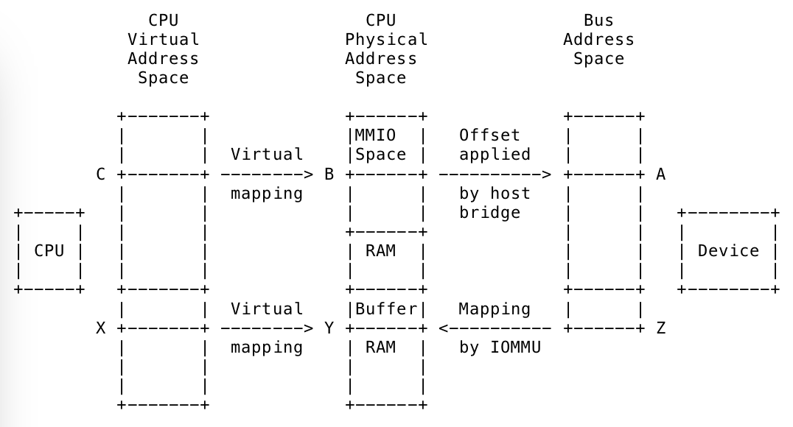

DMA 实际上是赋予了设备在 CPU 的控制下, 对 memory 进行读写访问的的能力.

* "CPU 的控制", 指的是控制路径, CPU/软件当然要对 DMA 的地址、长度进行设置, 对不同的设备的 DMA 空间进行隔离等;
* 而实际的 DMA 动作, 则是 by pass CPU 的.

谈到 DMA, 不可避免的会涉及到不同的地址转换, 这对理解 Linux 下面的 DMA 是十分重要的. 总共有三类地址: 虚拟地址, 物理地址以及总线地址.

内核通常使用虚拟地址, 比如像 kmallc(), vmalloc()和类似的接口返回的地址都是`void *`类型的虚拟地址.

虚拟内存系统, 比如 TLB, 页表等, 会将虚拟地址转换成 CPU 的物理地址. 物理地址的类型一般为`phy_addr_t`或者`resource_size_t`. 外设的寄存器, 内核实际上是把它们当成物理地址来进行管理, 这些地址可以在`/proc/iomem`中被访问. 这些物理地址不能直接被驱动程序使用, 必须使用 ioremap()来将这些地址映射为虚拟地址之后, 才能被驱动所使用. 这也就是为什么我们的驱动程序中, 总是会看到设备的寄存器地址空间被 ioremap 后, 才能被正确访问.

对于 IO 设备来讲, 它们使用的地址通常被称为总线地址(bus address). 如果设备的寄存器在 MMIO 地址空间, 或者设备使用 DMA 对 memory 进行读写访问, 这个过程中设备所使用的地址其实就是总线地址. 在一些硬件架构中, 总线地址和 CPU 的物理地址是相同的, 但是并不是所有的都这样. IOMMU 和 host bridge 可以在总线地址和物理地址之间进行任意的映射.

> x86 中 物理地址 = 总线地址

从设备的角度来讲, DMA 使用总线地址空间或者总线地址空间的一个子集. 比如说, 虽然系统支持 64-bit 的地址空间, 但是经过 IOMMU, 设备可能仅仅使用 32-bit 的地址空间就可以了.

在枚举过程中, 内核会获取到 IO 设备、它们的 MMIO 空间以及所挂载的桥设备. 例如, 一个 PCI 设备有 BAR 空间, 内核从 BAR 空间中拿到总线地址(A), 并且将它转换成 CPU 物理地址(B). 地址(B)被存储在 struct resource 结构中, 并且通过/proc/iomem 暴露出来. 当驱动 probe 设备的时候, 通常会用 ioremap()来讲物理地址(B)映射成虚拟地址(C). 此时, 就可以通过类似 ioread32(C)来访问到设备在总线地址(A)上的寄存器.

驱动程序同样的, 可以使用 kmalloc()和类似的接口, 来分配一个 buffer. 接口返回的地址实际上是虚拟地址, 如虚拟地址(X). 虚拟内存系统将 X 映射到物理地址(Y). 驱动可以使用虚拟地址(X)来访问这个 buffer, 但是设备不能使用这个地址, 因为 DMA 不会经过 CPU 的虚拟内存系统.

在一些简单的系统中, 设备可以直接向屋里地址 Y 进行 DMA 访问. 但是在其他的系统中, 一般需要一种硬件, 比如 IOMMU, 建立 DMA 地址(总线地址)和物理地址的映射关系. 比如, 将地址(Z)转换成地址(Y). dma_map_single()接口其实就是做了这么一个事情: 传入了虚拟地址 X, 然后设置 IOMMU 映射, 然后返回了总线地址(DMA 地址)Z. 映射之后, 驱动就可以告诉设备使用地址(Z)进行 DMA, IOMMU 会将对这个地址的 DMA 操作映射到实际的 RAM 中的地址 Y 上.

Linux 系统也能支持动态 DMA 映射, 驱动只需要在地址实际使用之前进行 mapping, 在使用之后进行 unmap 即可.

DMA 相关的 API

DMA 相关的 API 与底层的架构无关, 因为 Linux 已经替我们做好了 HAL 层. 所以我们使用 DMA API 的使用, 不应该使用总线相关的 API, 比如使用 dma_map_(), 而非 pci_map_()接口.

在我们的驱动程序里, 应该包含头文件 linux/dma-mapping.h, 这个头文件提供了 dma_addr_t 的定义. dma_addr_t 可以提供对任何平台的 dma 地址的支持.

# 内存的 DMA 可用性

哪些内存可以被用作 DMA?有一些不成文的规则.

使用页面分配函数(比如__get_gree_page*())或者通用内存分配函数(比如 kmalloc()、kmem_cache_alloc())分配的地址一般是可以来用作 DMA 地址的.

而使用 `vmallc()` 函数分配的地址最好不要用作 DMA, 因为 vmalloc 分配出来的地址在物理地址上不一定连续, 进行 DMA 的时候可能需要遍历页表去拿到物理地址, 而将这些物理地址转成虚拟地址的时候, 又需要使用到__va()类似的函数.

所以, 我们一般不能使用内核镜像地址(比如 `data/text/bss` 段), 或者模块镜像地址、栈地址来进行 DMA, 这些地址可能被映射到物理内存上的任意位置. 即使我们要使用这些种类的地址来进行 DMA, 我们也需要确保 I/O buffer 是 cacheline 对齐的. 否则, 就很容易在 DMA-incoherent cache 上出现 cache 一致性的问题.

我们也不能使用 kmap()返回的地址来进行 DMA, 原因与 vmalloc()类似.

块 I/O 和网络设备的 buffer 怎么分配的呢?实际上, 块 I/O 和网络子系统会保证它们使用的地址是可以进行 DMA 的.

# DMA 地址的限制

设备对于 DMA 地址空间一般都有一定的限制, 比如说我们的设备的寻址能力只有 24bit, 那么我们一定要将限制通知到内核.

默认情况下, 内核认为设备的寻址空间可以达到 32bit. 对于有 64bit 寻址能力的设备来讲, 我们需要告知内核调大这个能力. 而对于不足 32bit 寻址能力的设备来讲, 需要告诉内核降低这个能力.

需要特别注意的一点是: PCI-X 规范要求 PCI-X 设备要能够支持 64-bit 的寻址(DAC)的数据传输. 并且某些平台(SGI SN2)也要求当 IO 总线是 PCI-X 模式时, 必须要支持 64bit 的 consistent 分配.

正确的操作应该是: 我们必须在设备的 probe 函数中向内核查询机器的 DMA 控制器能否正常支持当前设备的 DMA 寻址限制. 即使设备支持默认的设置, 我们最好也在 probe 函数中这么做. 起码说明我们考虑到了这个事情.

通过调用 dma_set_mask_and_coherent()可以完成这种能力通知: 函数原型为

