# MSI中断

介绍MSI-X中断之前, 我们先来看看MSI中断的机制.

MSI中断本质上是一个memory write, memory write的地址就是设备配置空间的MSI address寄存器的值, memory write的数据就是设备配置空间的MSI data寄存器的值. Message address寄存器和message data寄存器是调用pci_enable_msi时, 系统软件填入的(address和data和CPU的架构相关, 简单说就是和CPU的中断控制器部分相关).

也就是说, **一个设备**想**产生一个 MSI 中断**, 只需要使用配置空间的message address寄存器和message data寄存器发起一个 memory write 请求, 即往message address寄存器写入memory data. 在X86系统下, message address对应的LAPIC的地址.

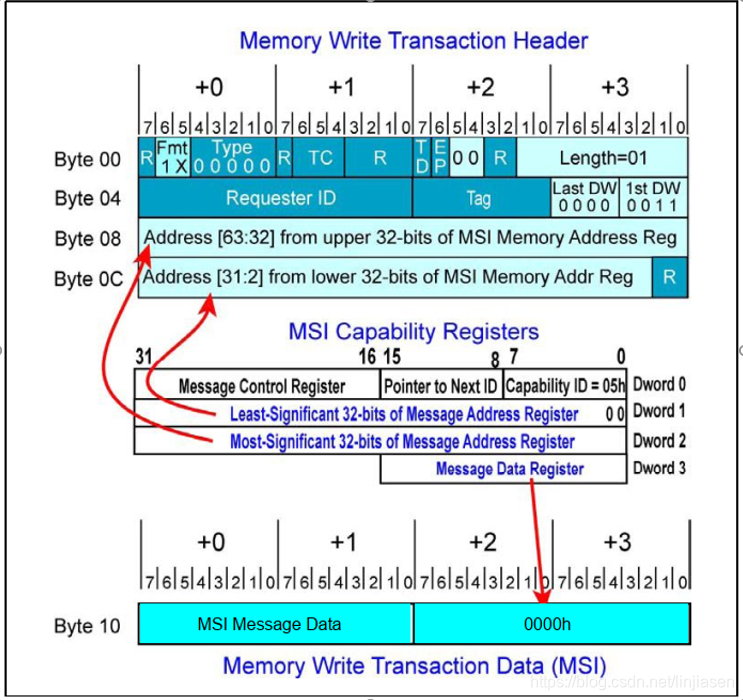

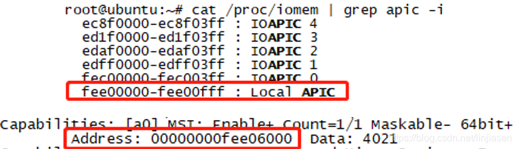

# 为何要引入MSI-X

前面讲了MSI中断的机制, 其实MSI-X Capability中断机制与MSI Capability的中断机制类似. 既然机制类似, 为啥还要需要引入MSI-X呢?

回答这个问题前, 我们先看看MSI有哪些限制?

(1) MSI相关的寄存器都是在配置空间中, 从Message Control寄存器multiple message Capble字段可以看出MSI最多支持32个中断向量, 且必须是2^N, 也就是说如果一个function需要3个中断向量, 必须申请4个才可以满足.

(2) MSI要求中断控制器分配给该function的中断向量号必须连续.

打个比方, 如果一个PCIe设备需要使用4个中断请求时, 如果使用MSI机制时, Message Data的 `[2:0]` 字段可以为0b000~0b011, 因此可以发送4种中断请求, 但是这4种中断请求的Message Data字段必须连续. 在许多中断控制器中, Message Data字段连续也意味着中断控制器需要为这个PCIe设备分配4个连续的中断向量号.

有时在一个中断控制器中, 虽然具有4个以上的中断向量号, 但是很难保证这些中断向量号是连续的. 因此中断控制器将无法为这些PCIe设备分配足够的中断请求, 此时该设备的"Multiple Message Enable"字段将小于"Multiple Message Capable". MSI-X为了解决上面的问题才出现的.

注意: 早期的linux的X86架构下是不支持Multiple Message的. (后面的linux X86代码改正了这个问题)


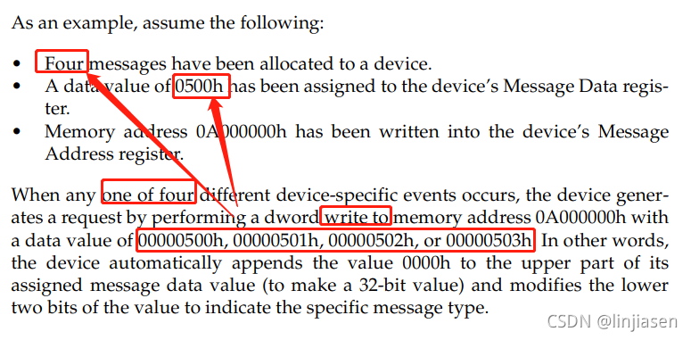

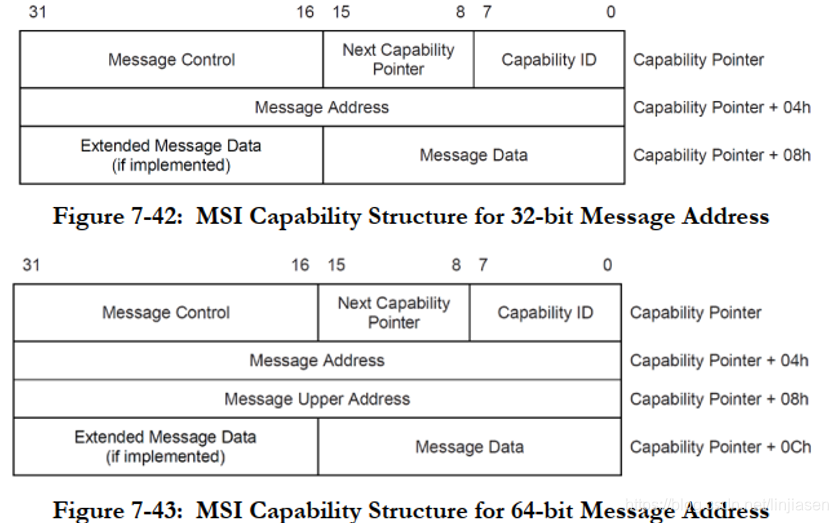

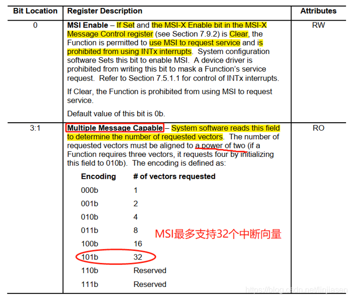

MSI-X的出现就是为了解决上面两个问题, 主要是第二个问题.

# MSI-X CAP结构

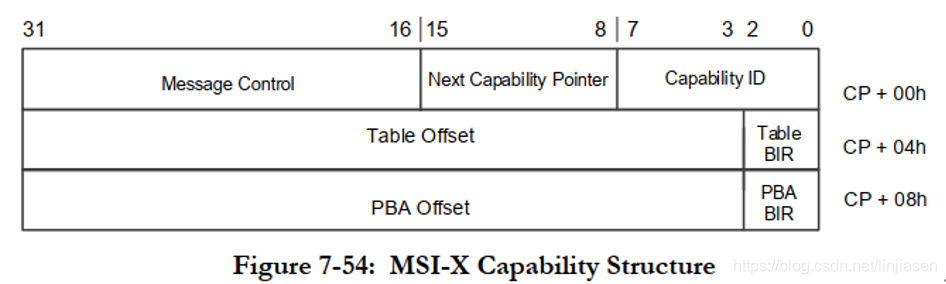

MSI-X 和 MSI 最大的不同是 message data、message address 字段和 status 字段没有存放在设备的配置空间中, 而是使用 MSI-X Table structure 和 MSI-X PBA structure 来存放这些字段.

MSI-X Table structure 和 PBA structure 存放在设备的 BAR 空间里, 这两个 structure 可以 map 到相同 BAR, 也可以 map 到不同 BAR, 但是这个 BAR 必须是 memory BAR 而不能是 IO BAR, 也就是说两个 structure 要 map 到 memory 空间.

注意: 一个 function 只能支持一个 MSI-X CAP.

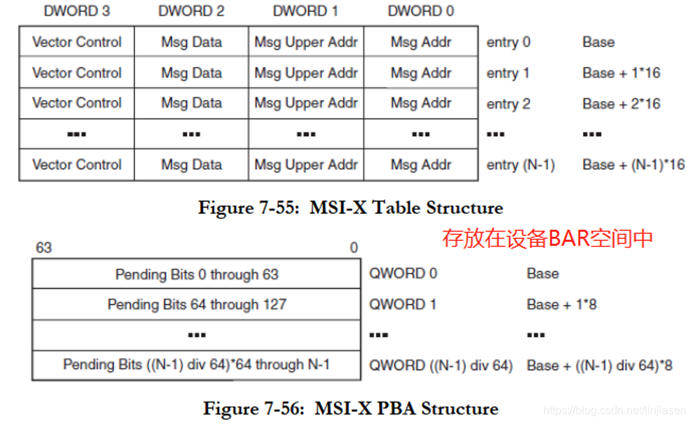

## 配置空间的 Message control 寄存器

配置空间 **Message Control** 寄存器中的 **table size** 字段可以获取 MSI-X 的table的大小.

软件读取该字段获取 table size, table size+1 就是MSI-X table entry的个数, 也就是Figure 7-36中的entry(N-1)中的N, 每个entry对应一个中断向量. 从table size可以看出1个function最多可以支持 `2^11 = 2048` 个 MSI-X 中断.

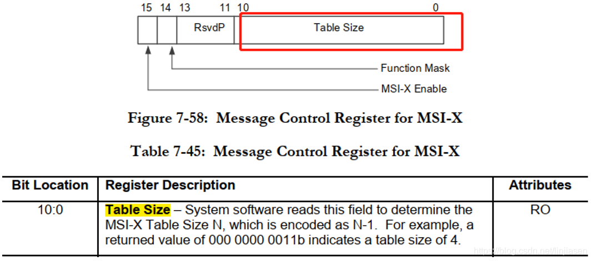

`pci_msix_vec_count` 读取 **Message Control** 寄存器的 table size 字段获取 MSI-X table entry 的个数.

调用关系如下:

`pci_enable_msix_range` -> `__pci_enable_msix_range` -> `__pci_enable_msix` -> `pci_msix_vec_count`

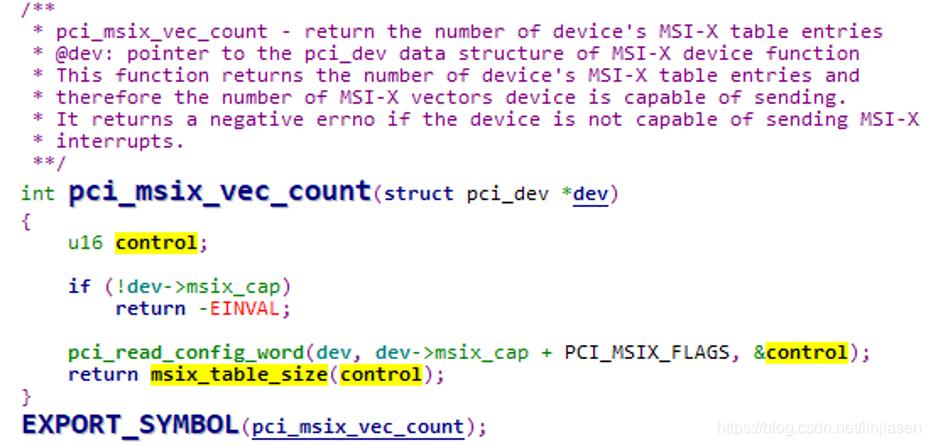

## 配置空间的 Table offset/Table BIR 寄存器

配置空间中 `Table offset/Table BIR` 寄存器的** Table BIR** 字段指示使用哪个 **BAR** 来映射的 MSI-X Table structure. 该字段的 0-5 也对应 function 的 BAR 0-5.

Table offset 字段代表 MSI-X Table structure entry 0 存放在BAR空间的偏移.

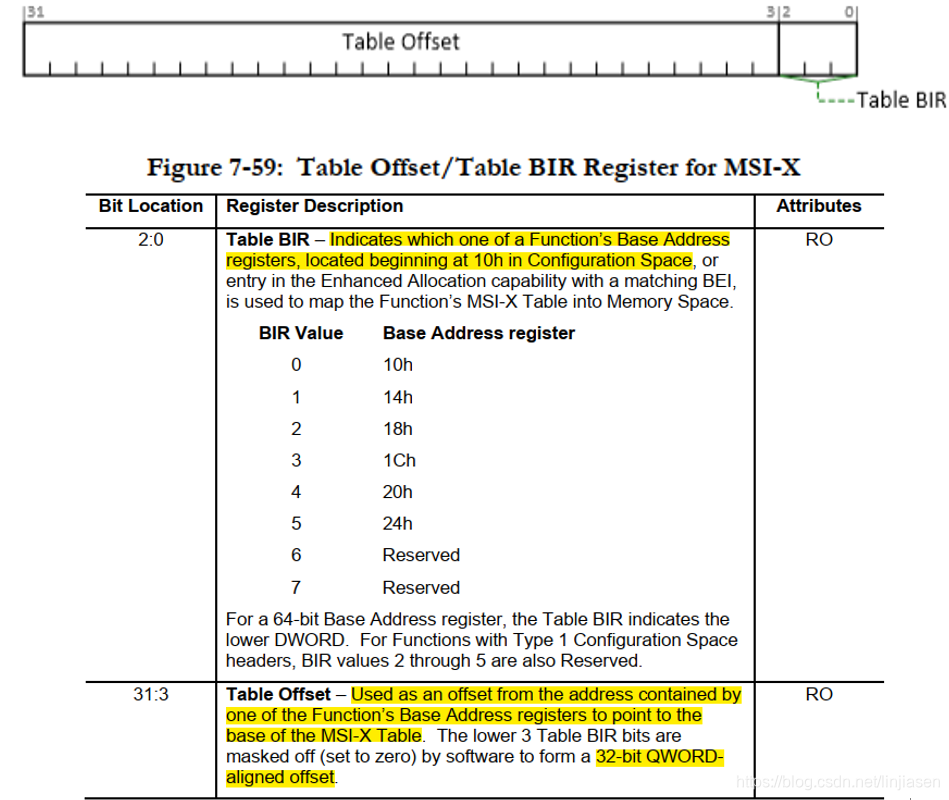

kernel代码先读取配置空间的Table offset/Table BIR寄存器, 通过Table BIR字段获取使用哪个BAR来映射MSI-X Table structure. 然后计算出MSI-X table entry 0相对BAR空间偏移的物理地址(phys_addr), 最后ioremap得到虚拟地址.

调用关系如下:

pci_enable_msix_range->__pci_enable_msix_range->__pci_enable_msix->msix_capability_init

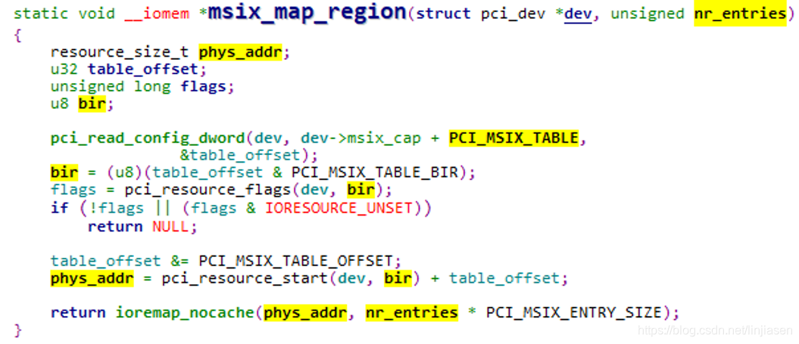

## 配置空间的 PBA offset/PBA BIR 寄存器

配置空间中 PBA offset/PBA BIR 寄存器的 PBA BIR 字段指示使用哪个 BAR 来映射的 PBA structure. 该字段的 0-5 也对应 function 的 BAR0-5.

PBA offset 字段代表 PBA structure 存放在BAR空间的偏移.

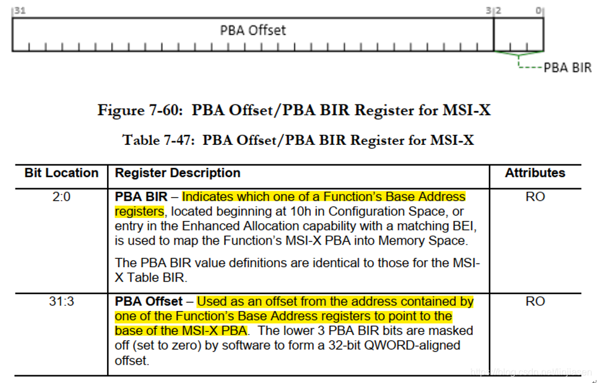

# Memory空间的MSI-X table structure

Message address和Message Upper address字段存放的是MSI-X memory write请求需要使用的地址.

Message Data字段存放的是MSI-X memory write请求需要使用的data. 该地址和CPU的架构相关, 是使能MSI-X时, 系统软件写入的.

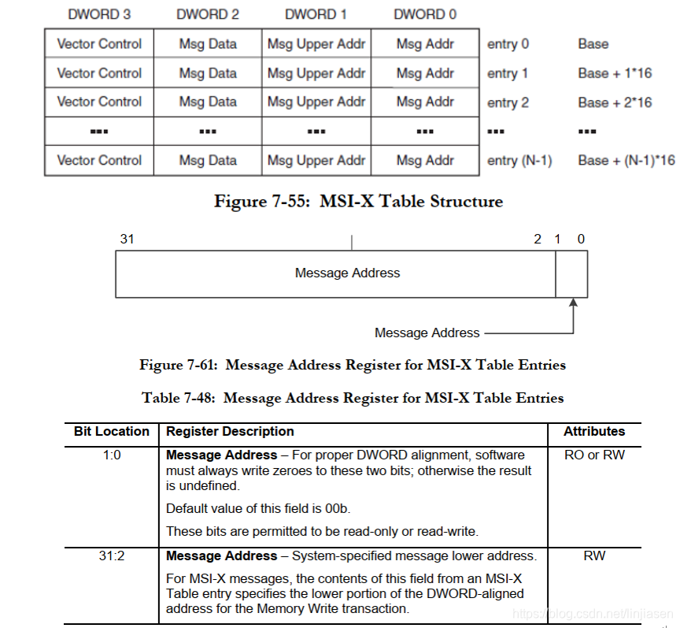

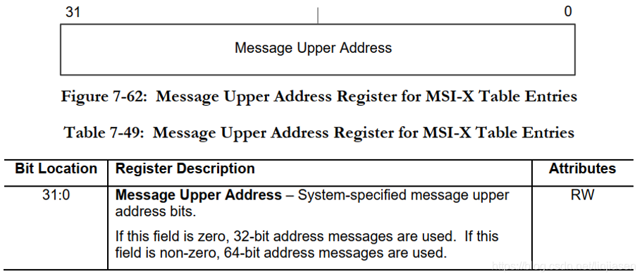

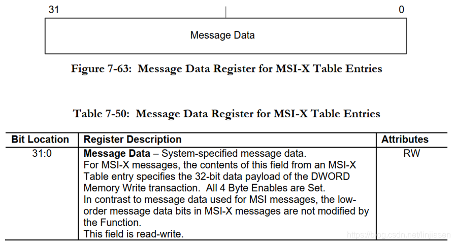

Kernel函数__pci_write_msi_msg把message address、message data写入对应的entry.

如果是X86的CPU, 存放message address和message data的结构 `struct msi_msg *msg` 是在 `irq_msi_compose_msg` 中初始化的, 这个值和CPU架构相关.

desc->mask_base是MSI-X table entry 0对应的虚拟地址, desc->msi_attrib.entry_nr是MSI-X table entry编号. desc->mask_base和desc->msi_attrib.entry_nr都是在msix_setup_entries赋值的(pci_enable_msix_range->__pci_enable_msix_range->

__pci_enable_msix->msix_capability_init->msix_setup_entries).

X86下调用关系:

pci_enable_msix_range->__pci_enable_msix_range->__pci_enable_msix-> msix_capability_init-> pci_msi_setup_msi_irqs-> arch_setup_msi_irqs->native_setup_msi_irqs->

msi_domain_alloc_irqs->irq_domain_activate_irq->__irq_domain_activate_irq-> msi_domain_activate->irq_chip_write_msi_msg->pci_msi_domain_write_msg-> __pci_write_msi_msg

使用kprobe工具dump出来的调用关系:

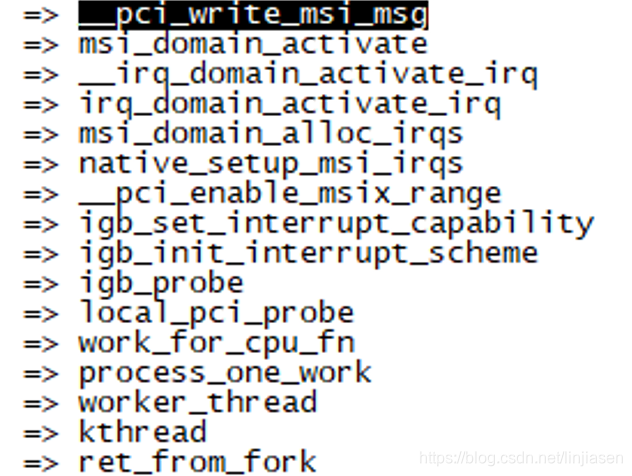


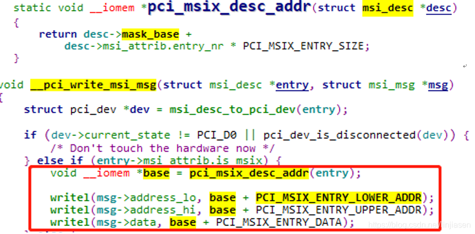

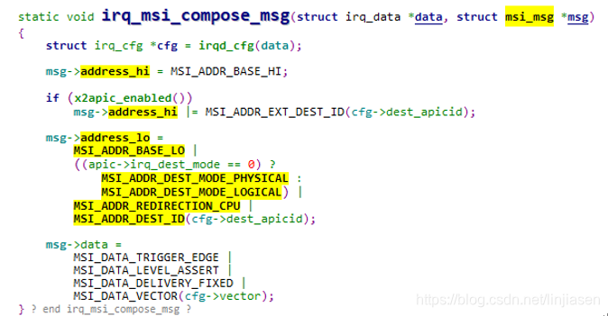

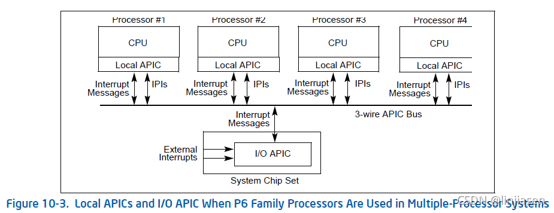

x86 的IOAPIC和local APIC的架构.

X86 下MSI address的格式如下

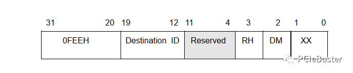

Destination ID 字段存放了中断要发往 LAPIC ID. 该 ID 也会记录在 I/O APIC Redirection Table 中每个表项的 bit56-63 . Redirection hint indication 指定了 MSI 是否直接送达 CPU.  Destination mode 指定了 Destination ID 字段存放的是逻辑还是物理 APIC ID .

X86下MSI data格式如下

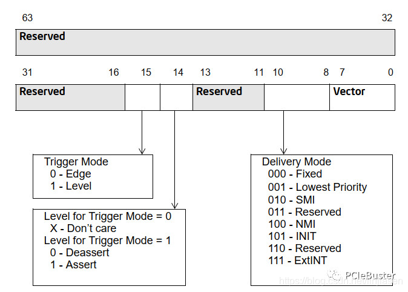

Vector 指定了中断向量号,  Delivery Mode 定义同传统中断, 表示中断类型. Trigger Mode 为触发模式, 0 为边缘触发, 1 为水平触发. Level 指定了水平触发中断时处于的电位(边缘触发无须设置该字段).

上面都是以X86为例, 具体的可以参考《Intel® 64 and IA-32 Architectures Software Developer's Manual》卷三关于APIC和MSI的部分.

Vector Control字段存放的是控制字段, 当Mask Bit为1时, PCIe设备不能使用该MSI-X table entry来发送中断消息.

如果其他的MSI-X table entry也是使用的相同的vector, 只要对应entry的vector control寄存器的mask bit字段不为1, 仍然可以使用该vector发送MSI-X中断消息. 这个意思是说Mask Bit的作用范围是该entry的, 如果两个entry使用相同的vector(对X86来说就是Message Data字段低8 bit相同), Mask Bit不为1的entry是可以使用该vector发出message中断.

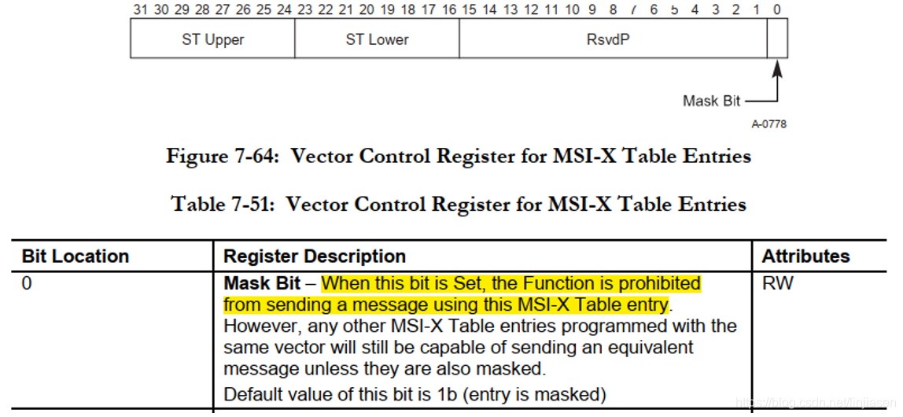

此时MSI-X中断还没有完全初始化完毕, Kernel代码是把MSI-X vector control 寄存器的Mask bit置1来mask所有vector的中断.

调用关系:

pci_enable_msix_range->__pci_enable_msix_range->__pci_enable_msix-> msix_capability_init-> msix_program_entries

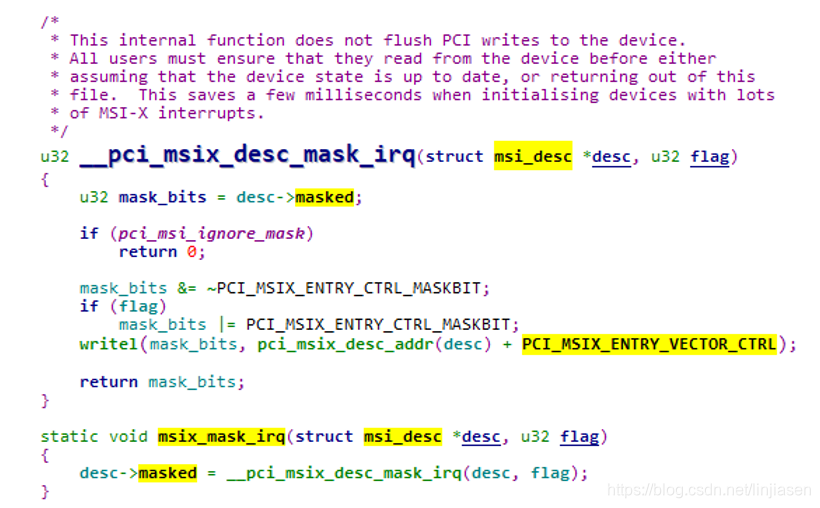

# 什么时候umask的vector中断呢?

以网卡为例, 在request_irq的时候才把MSI-X的使用的vector给unmask的.

__igb_open->request_threaded_irq->__setup_irq->irq_startup->__irq_startup-> unmask_irq->pci_msi_unmask_irq-> msi_set_mask_bit->msix_mask_irq->__pci_msix_desc_mask_irq

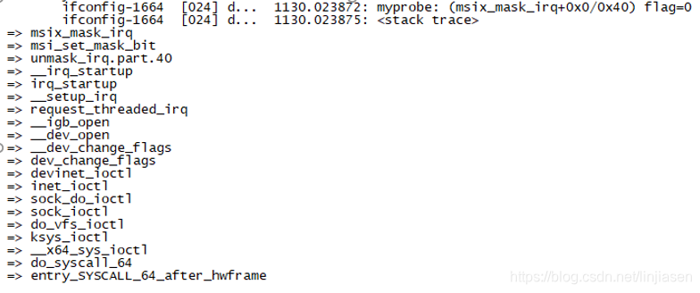

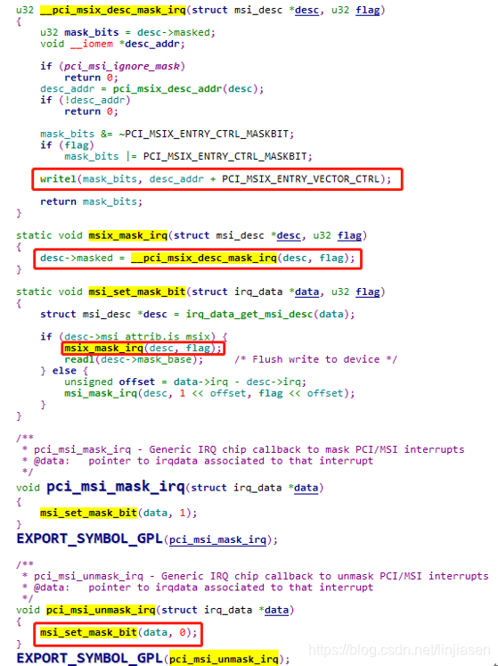

# MSI和MSI-X对比

对比项 | MSI | MSI-X
---------|----------|---------
 Message Address | 存放在配置空间中MSI相关寄存器 | 存放在BAR空间MSI-X table structure
 Message Data | 存放在配置空间中MSI相关寄存器 | 存放在BAR空间MSI-X table structure
 Sataus相关 | 存放在配置空间中MSI相关寄存器 | 存放在BAR空间PBA structure
 每个设备支持的Vector数量 | 32 | 2048
 中断号是否连续 | 是 | 否

# 举个例子

说了这么多拿网卡举个例子吧. 从配置空间可以看出MSI-X使用的BAR3, MSI-X table structure存放在BAR3起始地址+0的位置, PBA structure 存在 BAR3 起始地址 + 0x2000 的位置.

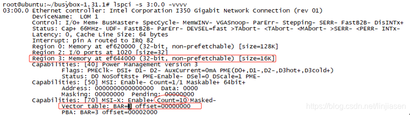

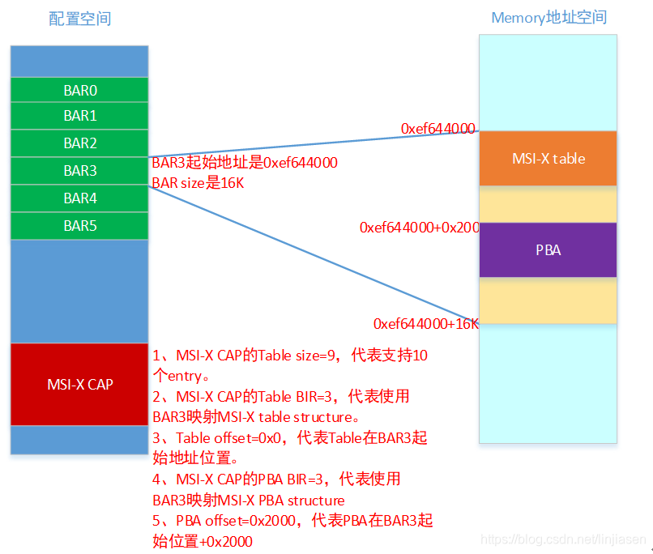

我们来读一下该地址, 发现使用的entry的message地址为LAPIC的地址


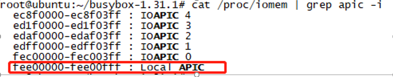

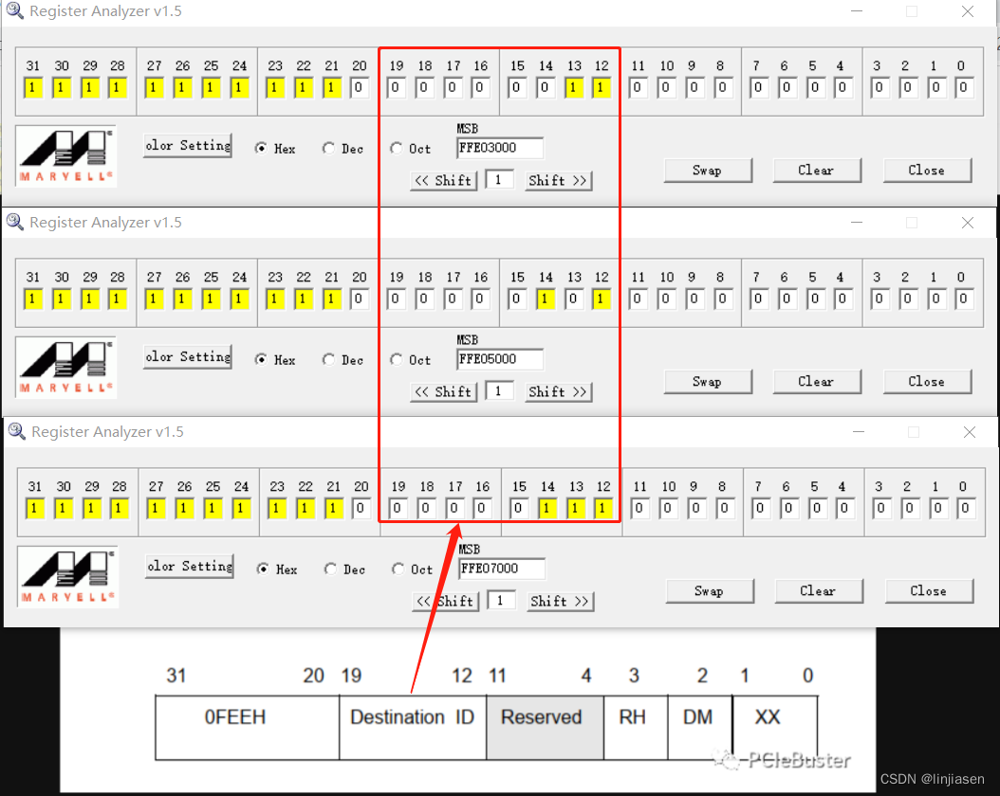


https://blog.csdn.net/linjiasen/article/details/105858038


---

PCI Local Bus Specification的Section 6.8.2描述了MSI-X性能和表结构. MSI-X性能结构指向MSI-X Table结构和MSI-X Pending Bit Array (PBA)寄存器. **BIOS** 设置**起始地址偏移**和与指向MSI-X Table和PBA寄存器的起始地址的指针相关联的BAR. 

MSI-X中断组件:

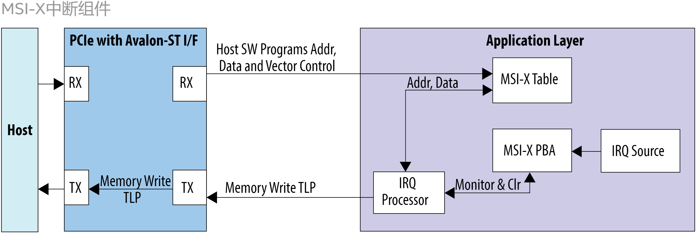

1) 主机软件按照以下步骤设置Application Layer中的MSI-X中断:

a. 主机软件**读取** 0x050 寄存器上的 Message Control 寄存器以确定 MSI-X Table 大小. 表入口(table entry)的数量是`<value read> + 1`. 

最大表格尺寸为2048个入口. 每个16字节入口分为4个字段, 如下图所示. 对于多功能类型(variant), BAR4访问MSI-X表. 对于所有其他类型(variant), 任何BAR都可以访问MSI-X表.  MSI-X表的基地址必须与4 KB边界对齐. 

b. 主机**设置 MSI-X 表**. 它为每个入口编程 MSI-X 地址, 数据和掩码比特, 如下图所示. 

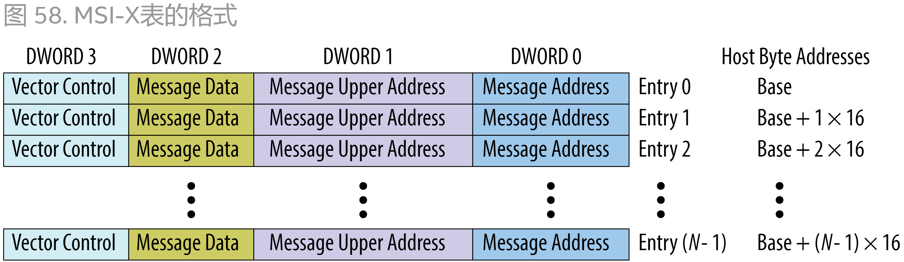

c. 主机使用下面公式计算 `<n^th>` 入口的地址:

```
nth_address = base address[BAR] + 16<n>
```

2) 当Application Layer有一个中断, 它会驱动一个中断请求到IRQ Source模块.

3) IRQ Source设 置 MSI-X PBA 表中的相应比特. 

PBA 可以使用 qword 或者 dword 访问. 对于 qword 访问, IRQ Source 使用下面的公式计算 `<m^th>` 比特的地址:

```
qword address = <PBA base addr> + 8(floor(<m>/64))
qword bit = <m> mod 64
```


4) IRQ Processor 读取 MSI-X 表中的入口

a. 如果中断被 MSI-X 表的 Vector_Control 域屏蔽, 那么中断保持在未决状态.

b. 如果中断没有被屏蔽, 那么 IRQ Processor 发送 Memory Write Request 到 TX 从接口. 它使用 MSI-X 表中的地址和数据. 如果 Message Upper Address = 0, 那么 IRQ Processor 将创建一个 three-dword header. 如果 Message Upper Address > 0 , 那么它将创建一个 4-dword header. 

5) 主机中断服务程序将 TLP 检测为中断并对其服务
