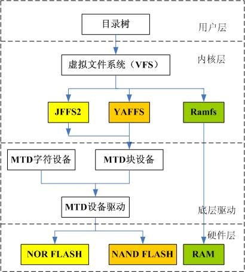

Linux 里面, 一切皆文件

从下往上逐层分析

1. 设备. 包括存储设备, 一般外设等.

2. 设备驱动程序. 先有设备驱动, 然后才能识别和读取设备. OS 对于设备的所有操作实际上是在操作设备的寄存器, 对于设备信息的获取, 检测等也是通过这些寄存器. 设备驱动就是对操作设备寄存器的抽象, 类似于对于设备的识别检测, 读写等定义了一些接口, 用来操作设备. 这些接口可以被内核直接使用.

3. 设备文件. 设备文件是为了方便用户空间操作. 分为三类, 包括字符设备,块设备和网络设备. 该分类方式是根据设备的读写方式划分的, 当发生读写操作, 进行系统调用, 最终还是调用驱动程序的接口.

4. 格式化为文件系统. 将某个设备文件(/dev/\*)格式化为某个系统. Linux 中一切皆文件, 所以对存储设备的数据操作也都是以文件为载体的, 每个文件包含的数据大小不定, 在设备上面可能是离散分布, 也可能是连续分布. 文件系统就是为了将系统中的一个个文件映射在真实的设备数据中, 所以文件系统强调的是文件数据的组成形式. 每种文件系统都有自己的文件中数据的组成方式. Linux 系统是树状文件组织形式, 所以每个文件系统的所有文件都需要遵循该规则, 并实现目录文件与文件的树状组织形式的算法.

5. 文件系统驱动. 也就是文件系统相应的.ko 文件. 先有文件系统驱动, 然后才能读取某种文件系统. 文件系统驱动可以用来识别并检测文件系统, 并操作文件等.

5. 挂载文件系统. 该行为是为了给操作系统在用户空间对设备进行文件方式操作提供通道.

6. VFS 文件系统. Linux 支持很多种文件系统格式, 但是系统操作需要在用户空间提供统一接口, VFS 就是对统一操作的抽象

从硬件聊起.

1. 插槽/接口. 主板是有插槽的, 所有设备都是往插槽上插, 插槽是有类型的. 比如 IDE/SATA/M.2, 存储设备是插在这上面的

2. 总线. 数据传输通道, 比如 M.2 插槽有 PCI\-E 和 SATA 两种通道, 数据就是通过这个传输的, 所以必须遵循该通道规定的格式, 这个格式就会被内核解析从而获取设备的数据, 所以内核的设备驱动就是以总线为单位进行开发的.

3. 协议标准. 内核针对总线开发驱动, 也就是这里的协议标准, 比如 SATA 总线有个 AHCI 和 NVMe